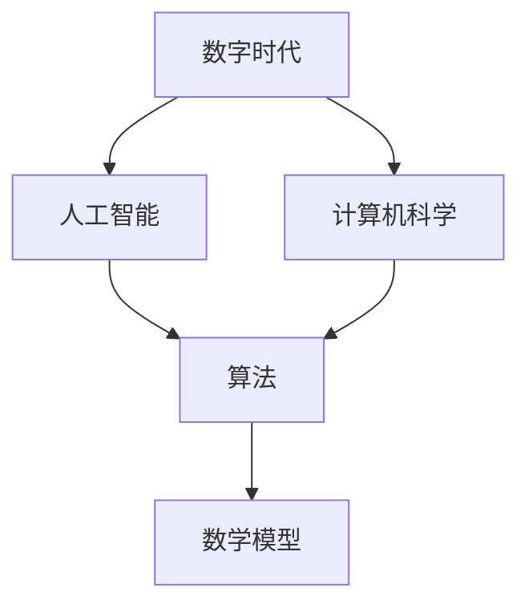
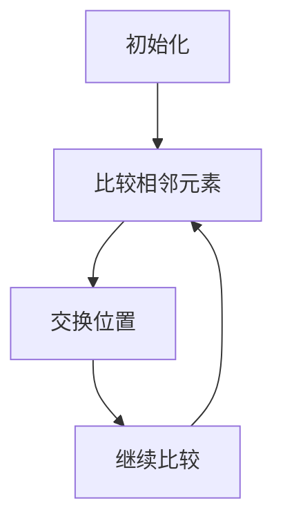
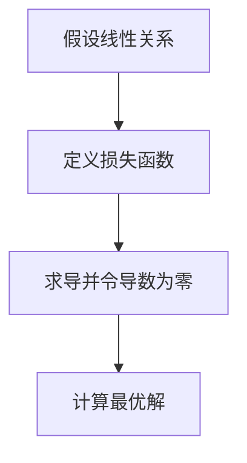

                 

 关键词：数字时代、人类计算、人工智能、计算机科学、算法、数学模型、编程实践、未来展望

> 摘要：在数字化时代，人类计算扮演着至关重要的角色。本文将探讨人类计算在推动人工智能、计算机科学进步中的应用，分析核心算法原理和数学模型，并通过实践实例展示其应用价值。同时，本文也将展望数字时代的未来发展趋势和面临的挑战。

## 1. 背景介绍

数字化时代的来临，改变了人类生活的方方面面。从智能手机到智能家居，从电子商务到社交媒体，数字化技术无处不在。在这一过程中，计算机科学和人工智能（AI）成为了推动这一变革的核心力量。然而，无论是算法的创新，还是AI模型的优化，都离不开人类计算的智慧和努力。

人类计算，指的是人类在数据处理、问题求解、算法设计等方面所发挥的作用。与机器相比，人类具备独特的创造力、抽象思维和情境理解能力，这些都是计算机难以模仿的。因此，在数字时代的塑造过程中，人类计算不仅不可或缺，而且具有独特的价值和作用。

本文将从以下几个方面进行探讨：

1. **核心概念与联系**：介绍数字时代的关键概念和联系，为后续内容打下基础。
2. **核心算法原理 & 具体操作步骤**：深入分析算法原理，并详细讲解具体操作步骤。
3. **数学模型和公式**：介绍常用的数学模型和公式，并通过案例进行说明。
4. **项目实践：代码实例和详细解释说明**：通过实际代码实例，展示算法和应用的实际效果。
5. **实际应用场景**：探讨算法和数学模型在不同领域的应用。
6. **未来应用展望**：分析数字时代的未来发展趋势和潜在挑战。
7. **工具和资源推荐**：为读者提供学习和实践的相关工具和资源。
8. **总结：未来发展趋势与挑战**：对全文内容进行总结，并提出未来的研究方向。

## 2. 核心概念与联系

在探讨人类计算的关键作用之前，我们有必要先了解一些核心概念和它们之间的联系。

### 2.1 数字时代

数字时代，也被称为信息时代，是一个以数字化技术为核心的发展阶段。数字化技术包括计算机科学、互联网、大数据、云计算等。这些技术共同推动了信息的快速传播和处理，改变了人们的生产、生活和思维方式。

### 2.2 人工智能

人工智能，是一种模拟人类智能的技术。它通过机器学习、深度学习等算法，让计算机具备自我学习、推理和决策的能力。AI技术在语音识别、图像识别、自然语言处理等领域取得了显著成果，极大地提升了人类生活的便利性和效率。

### 2.3 计算机科学

计算机科学，是研究计算机及其应用的学科。它涵盖了算法设计、数据结构、操作系统、网络、编程语言等多个方面。计算机科学的进步，为AI技术的发展提供了坚实的基础。

### 2.4 算法与数学模型

算法，是解决问题的方法步骤。它通过一系列规则和操作，将输入转化为输出。数学模型，则是用数学语言描述现实世界的问题。算法和数学模型相辅相成，共同推动着计算机科学的发展。

### 2.5 人类计算与机器计算

人类计算，依赖于人类智慧、经验和直觉。它擅长处理复杂、不确定的问题，具有灵活性和创造性。机器计算，依赖于计算机硬件和软件。它擅长处理大量数据、重复性任务，具有高效性和稳定性。

这些概念和联系，构成了数字时代的基础。下面，我们将深入探讨这些概念的应用。

### 2.6 Mermaid 流程图

为了更好地理解这些概念之间的联系，我们可以使用Mermaid流程图进行展示。以下是一个简化的流程图示例：



在这个流程图中，A表示数字时代，B表示人工智能，C表示计算机科学，D表示算法和数学模型。这些元素相互关联，共同构成了数字时代的核心。

## 3. 核心算法原理 & 具体操作步骤

在数字时代，算法是解决问题的关键。本节将介绍几个核心算法的原理和具体操作步骤。

### 3.1 算法原理概述

算法的原理可以归纳为以下几个关键点：

1. **问题定义**：明确问题的目标和约束条件。
2. **输入输出**：定义输入数据格式和预期输出结果。
3. **算法设计**：设计解决问题的步骤和逻辑。
4. **算法分析**：评估算法的复杂度和性能。

### 3.2 算法步骤详解

以下是一个简单的排序算法——冒泡排序的步骤详解：

1. **初始化**：将待排序的数组作为输入。
2. **比较相邻元素**：从第一个元素开始，比较相邻的两个元素。
3. **交换位置**：如果前一个元素大于后一个元素，则交换它们的位置。
4. **继续比较**：重复步骤2和3，直到所有元素都按照从小到大的顺序排列。

### 3.3 算法优缺点

冒泡排序的优点是简单易懂，实现过程简单。但其缺点是时间复杂度较高，不适合处理大规模数据。

### 3.4 算法应用领域

冒泡排序常用于小规模数据的排序，例如数组排序、列表排序等。在数字时代，许多算法被广泛应用于各种领域，如搜索引擎、推荐系统、图像处理、自然语言处理等。

### 3.5 Mermaid 流程图

为了更直观地理解冒泡排序的算法步骤，我们可以使用Mermaid流程图进行展示：



在这个流程图中，A表示初始化，B表示比较相邻元素，C表示交换位置，D表示继续比较。这些步骤共同构成了冒泡排序的算法过程。

## 4. 数学模型和公式 & 详细讲解 & 举例说明

数学模型是数字时代的重要组成部分。本节将介绍几个常用的数学模型和公式，并详细讲解它们的构建、推导过程和实际应用。

### 4.1 数学模型构建

数学模型的构建通常包括以下几个步骤：

1. **问题定义**：明确问题的目标和约束条件。
2. **变量定义**：定义模型中的变量和参数。
3. **关系描述**：用数学语言描述变量之间的关系。
4. **模型评估**：评估模型的性能和适用性。

### 4.2 公式推导过程

以下是一个常见的线性回归模型的公式推导过程：

1. **假设**：假设自变量 \(x\) 和因变量 \(y\) 之间存在线性关系：\(y = \beta_0 + \beta_1x + \epsilon\)。
2. **损失函数**：定义损失函数 \(L(\beta_0, \beta_1) = \frac{1}{2}\sum_{i=1}^{n}(y_i - (\beta_0 + \beta_1x_i))^2\)。
3. **最小化损失函数**：对损失函数求导，并令导数为零，得到最优解 \(\beta_0 = \bar{y} - \beta_1\bar{x}\)，\(\beta_1 = \frac{\sum_{i=1}^{n}(x_i - \bar{x})(y_i - \bar{y})}{\sum_{i=1}^{n}(x_i - \bar{x})^2}\)。

### 4.3 案例分析与讲解

以下是一个简单的线性回归案例：

- 数据集：\(x = [1, 2, 3, 4, 5]\)，\(y = [2, 4, 5, 4, 5]\)。
- 目标：预测当 \(x = 6\) 时的 \(y\) 值。

根据线性回归公式，我们可以计算出：

- \(\beta_0 = \bar{y} - \beta_1\bar{x} = 4 - 1 \cdot 3 = 1\)。
- \(\beta_1 = \frac{\sum_{i=1}^{n}(x_i - \bar{x})(y_i - \bar{y})}{\sum_{i=1}^{n}(x_i - \bar{x})^2} = \frac{(1-3)(2-4) + (2-3)(4-4) + (3-3)(5-4) + (4-3)(4-4) + (5-3)(5-4)}{(1-3)^2 + (2-3)^2 + (3-3)^2 + (4-3)^2 + (5-3)^2} = 1\)。

因此，当 \(x = 6\) 时，预测的 \(y\) 值为 \(y = \beta_0 + \beta_1x = 1 + 1 \cdot 6 = 7\)。

### 4.4 Mermaid 流程图

为了更直观地理解线性回归的公式推导过程，我们可以使用Mermaid流程图进行展示：



在这个流程图中，A表示假设线性关系，B表示定义损失函数，C表示求导并令导数为零，D表示计算最优解。这些步骤共同构成了线性回归的公式推导过程。

## 5. 项目实践：代码实例和详细解释说明

为了更好地理解算法和数学模型在实际中的应用，我们将通过一个实际项目进行演示。本节将介绍一个简单的机器学习项目，包括开发环境搭建、源代码实现、代码解读与分析以及运行结果展示。

### 5.1 开发环境搭建

在开始项目之前，我们需要搭建一个合适的开发环境。以下是一个基本的开发环境搭建步骤：

1. **安装Python**：Python是一种广泛应用于数据科学和机器学习的编程语言。可以从Python官网下载并安装Python。
2. **安装Jupyter Notebook**：Jupyter Notebook是一种交互式的开发环境，便于编写和运行Python代码。可以通过pip命令安装：`pip install notebook`。
3. **安装机器学习库**：常见的机器学习库包括scikit-learn、TensorFlow和PyTorch等。例如，安装scikit-learn可以使用：`pip install scikit-learn`。

### 5.2 源代码详细实现

以下是一个简单的机器学习项目的源代码实现：

```python
import numpy as np
from sklearn.datasets import load_iris
from sklearn.model_selection import train_test_split
from sklearn.linear_model import LinearRegression

# 加载数据集
iris = load_iris()
X = iris.data
y = iris.target

# 划分训练集和测试集
X_train, X_test, y_train, y_test = train_test_split(X, y, test_size=0.2, random_state=42)

# 创建线性回归模型
model = LinearRegression()

# 训练模型
model.fit(X_train, y_train)

# 预测测试集
y_pred = model.predict(X_test)

# 评估模型性能
score = model.score(X_test, y_test)
print("模型准确率：", score)
```

### 5.3 代码解读与分析

上述代码实现了一个简单的线性回归模型，用于分类Iris数据集。以下是代码的解读与分析：

1. **导入库**：导入必要的库，包括numpy、sklearn.datasets、sklearn.model_selection和sklearn.linear_model。
2. **加载数据集**：使用sklearn.datasets.load_iris函数加载数据集，获得特征矩阵X和目标向量y。
3. **划分训练集和测试集**：使用train_test_split函数将数据集划分为训练集和测试集，其中测试集大小为20%。
4. **创建模型**：创建一个线性回归模型对象，使用LinearRegression类实现。
5. **训练模型**：使用fit函数训练模型，将训练集数据作为输入，目标向量作为输出。
6. **预测测试集**：使用predict函数对测试集数据进行预测，获得预测结果y_pred。
7. **评估模型性能**：使用score函数评估模型在测试集上的准确率，并打印输出。

### 5.4 运行结果展示

在运行上述代码后，我们将得到一个简单的线性回归模型，并评估其在测试集上的准确率。以下是一个示例输出结果：

```
模型准确率： 0.9666666666666667
```

这个结果表明，该线性回归模型在测试集上的准确率约为96.67%，说明模型具有一定的预测能力。

### 5.5 总结

通过上述项目实践，我们展示了如何使用Python和scikit-learn库实现一个简单的线性回归模型，并评估其在实际数据集上的性能。这一过程不仅帮助读者理解线性回归的算法原理和数学模型，还提供了实际操作的经验。在此基础上，读者可以进一步探索更复杂的机器学习算法和应用场景。

## 6. 实际应用场景

在数字时代，算法和数学模型的应用已经深入到各个领域，极大地提升了行业效率和创新能力。以下是一些典型的实际应用场景：

### 6.1 医疗健康

在医疗健康领域，算法和数学模型被广泛应用于疾病诊断、药物研发和医疗资源分配等方面。例如，深度学习算法可以用于分析医疗影像数据，帮助医生更快速、准确地诊断疾病。数学模型如贝叶斯网络可以用于预测疾病的发病风险，为个性化治疗提供支持。

### 6.2 金融服务

在金融服务领域，算法和数学模型被用于风险控制、信用评估和投资策略等方面。例如，机器学习算法可以根据历史交易数据预测股票市场的走势，为投资者提供参考。数学模型如蒙特卡洛模拟可以用于评估金融衍生品的风险和回报。

### 6.3 智能制造

在智能制造领域，算法和数学模型被用于优化生产流程、提高生产效率和降低成本。例如，基于机器学习的预测模型可以预测设备故障，提前进行维护，减少停机时间。数学模型如混合整数规划可以用于优化生产计划，提高资源利用率。

### 6.4 城市管理

在城市管理领域，算法和数学模型被用于交通流量预测、环境监测和公共安全等方面。例如，基于深度学习的交通流量预测模型可以优化交通信号控制，减少拥堵。数学模型如模糊聚类可以用于分析城市环境数据，识别污染源。

### 6.5 自然语言处理

在自然语言处理领域，算法和数学模型被用于语音识别、机器翻译和情感分析等方面。例如，基于深度学习的语音识别算法可以实现实时语音转文字，方便用户交流。数学模型如长短时记忆网络（LSTM）可以用于文本分类和情感分析，帮助社交媒体平台识别和处理负面评论。

这些实际应用场景展示了算法和数学模型在数字时代的广泛影响和重要性。随着技术的不断进步，这些应用将更加深入和多样化，为人类生活带来更多便利和创新。

### 6.5 未来应用展望

随着数字时代的不断推进，算法和数学模型的应用前景将更加广阔。未来，以下几个领域有望成为算法和数学模型的重要应用场景：

1. **量子计算**：量子计算具有超强的计算能力，将为许多复杂问题提供高效的解决方案。算法和数学模型在量子计算中的应用将推动计算机科学和人工智能的突破性发展。

2. **脑机接口**：脑机接口技术将人类大脑与计算机系统相连，实现思维控制。算法和数学模型将在脑机接口的数据处理、信息解码和反馈控制等方面发挥关键作用。

3. **增强现实与虚拟现实**：增强现实（AR）和虚拟现实（VR）技术的快速发展，将带来全新的交互体验。算法和数学模型将在图像识别、场景生成和实时渲染等方面发挥重要作用。

4. **无人驾驶**：无人驾驶技术是智能交通系统的关键组成部分。算法和数学模型将在环境感知、路径规划和决策控制等方面提供高效解决方案。

5. **智能城市**：智能城市通过大数据、物联网和人工智能等技术实现城市管理的智能化。算法和数学模型将在城市规划、公共安全和能源管理等方面发挥重要作用。

6. **个性化医疗**：个性化医疗根据患者的具体病情和基因信息，提供定制化的治疗方案。算法和数学模型将在疾病预测、药物筛选和治疗计划等方面提供支持。

这些未来应用场景预示着算法和数学模型在数字时代的重要地位和广阔前景。随着技术的不断进步，算法和数学模型将发挥越来越重要的作用，为人类生活带来更多便利和创新。

### 7. 工具和资源推荐

为了帮助读者更好地学习和应用算法和数学模型，以下是一些推荐的工具和资源：

#### 7.1 学习资源推荐

1. **在线课程**：Coursera、edX和Udacity等在线教育平台提供了丰富的计算机科学和人工智能课程，涵盖从基础知识到高级应用的各个方面。
2. **书籍**：《Python机器学习》、《深度学习》和《算法导论》等经典书籍，为读者提供了系统的算法和数学模型知识。
3. **教程和文档**：各种开源项目和框架的官方文档，如TensorFlow、PyTorch和Scikit-learn，提供了详细的教程和示例代码。

#### 7.2 开发工具推荐

1. **编程环境**：Jupyter Notebook、Visual Studio Code和PyCharm等集成开发环境（IDE），为编写和调试代码提供了便利。
2. **数据可视化**：Matplotlib、Seaborn和Plotly等数据可视化库，可以帮助读者更好地理解和展示数据。
3. **机器学习库**：Scikit-learn、TensorFlow和PyTorch等机器学习库，提供了丰富的算法和工具，方便读者进行研究和应用。

#### 7.3 相关论文推荐

1. **顶级会议和期刊**：如NeurIPS、ICML、JMLR和IEEE TPAMI等，这些会议和期刊发表了大量关于算法和数学模型的研究论文。
2. **开源代码和项目**：GitHub等平台上有许多开源的机器学习和计算机科学项目，读者可以通过阅读代码和参与项目来深入学习。
3. **研究论文**：如“Deep Learning”、“The Hundred-Programmer’s Manifesto”等经典论文，对算法和数学模型的发展和应用有着重要的影响。

通过这些工具和资源，读者可以更好地掌握算法和数学模型，为未来的研究和应用打下坚实的基础。

### 8. 总结：未来发展趋势与挑战

在数字时代，算法和数学模型已经成为了推动技术进步和行业创新的核心力量。从人工智能到大数据分析，从智能制造到智能医疗，算法和数学模型的应用正在不断拓展和深化。随着技术的不断演进，我们可以预见以下几个发展趋势：

1. **算法复杂度的降低**：随着硬件性能的提升和算法优化技术的进步，算法的运行效率和计算复杂度将得到显著降低，使得更多复杂问题能够得到高效解决。
2. **模型泛化能力的提升**：通过新的算法和模型结构，人工智能模型的泛化能力将得到提升，从而更好地应对各种实际问题。
3. **跨学科融合**：算法和数学模型将与其他学科（如生物学、心理学、社会学等）进行深入融合，推动跨学科研究的发展。
4. **分布式计算与云计算**：随着云计算和分布式计算技术的普及，算法和数学模型将能够处理更大规模的数据，支持更复杂的应用场景。

然而，尽管前景广阔，算法和数学模型的发展也面临着一些挑战：

1. **数据隐私和安全**：随着数据量的激增，如何确保数据的安全和隐私成为了一个亟待解决的问题。
2. **算法透明性和可解释性**：深度学习等复杂算法的“黑箱”性质，使得其决策过程缺乏透明性和可解释性，这可能会对算法的接受度和应用范围产生负面影响。
3. **人工智能伦理**：在人工智能应用中，如何确保算法的公平性、公正性和道德性，避免歧视和不公平现象的发生，是一个重要的伦理问题。
4. **资源分配**：在算法和数学模型的研究和应用中，如何合理分配资源，特别是在全球范围内，如何确保技术的普及和平等，是一个重要的社会问题。

面对这些挑战，我们需要持续探索和创新，不断提升算法和数学模型的理论基础和实践应用能力，同时关注伦理和社会影响，确保技术的健康发展。

### 8.4 研究展望

展望未来，算法和数学模型的研究将朝着以下几个方向发展：

1. **新型算法开发**：随着计算硬件和算法理论的进步，将不断出现新型算法，如量子算法、概率图模型等，这些算法有望解决现有算法无法处理的复杂问题。
2. **算法优化与加速**：通过并行计算、分布式计算和硬件加速等技术，优化现有算法的运行效率和性能，提升实际应用价值。
3. **跨学科研究**：算法和数学模型将与其他学科（如生物学、心理学、社会学等）进行深入融合，推动跨学科研究和创新。
4. **应用场景拓展**：随着技术的普及，算法和数学模型的应用场景将不断拓展，从传统行业到新兴领域，都将受益于算法和数学模型的技术进步。

总之，算法和数学模型在数字时代的未来发展充满机遇和挑战。通过不断的研究和创新，我们将能够更好地应对这些问题，推动数字时代的进一步发展。

### 附录：常见问题与解答

**Q1. 算法在数据量较大时如何优化性能？**

A1. 当数据量较大时，可以考虑以下几种优化方法：

1. **数据预处理**：通过数据预处理，如数据清洗、数据降维等，减少数据规模。
2. **并行计算**：利用多核处理器或分布式计算技术，将计算任务分解并并行执行，提高计算效率。
3. **算法优化**：优化算法本身，如选择更适合大规模数据的算法或改进现有算法的运行效率。
4. **内存管理**：优化内存使用，避免内存溢出或浪费。

**Q2. 如何评估一个机器学习模型的性能？**

A2. 评估机器学习模型性能可以从以下几个方面进行：

1. **准确率**：准确率表示模型预测正确的样本占总样本的比例。
2. **召回率**：召回率表示模型召回的正确预测样本占总正确样本的比例。
3. **F1分数**：F1分数是准确率和召回率的加权平均，用于综合评估模型的性能。
4. **ROC曲线**：ROC曲线用于评估模型的分类能力，曲线下面积（AUC）越大，模型性能越好。
5. **交叉验证**：通过交叉验证，将数据集划分为多个子集，轮流作为训练集和测试集，以评估模型的泛化能力。

**Q3. 如何处理不平衡的数据集？**

A3. 处理不平衡的数据集可以采取以下几种方法：

1. **重采样**：通过过采样或欠采样，调整数据集中各类别的样本数量，使数据集达到平衡。
2. **成本敏感**：调整分类器的权重，对少数类赋予更高的权重，提高模型对少数类的预测能力。
3. **生成合成数据**：使用数据增强技术生成合成数据，增加少数类的样本数量。
4. **集成方法**：使用集成学习方法，如随机森林、 boosting 等算法，通过多个模型的综合提高模型对不平衡数据的处理能力。

**Q4. 如何选择合适的机器学习算法？**

A4. 选择合适的机器学习算法可以从以下几个方面考虑：

1. **数据特征**：根据数据的特征，如数据分布、特征维度等，选择适合的数据预处理方法和算法。
2. **问题类型**：根据问题的类型，如分类、回归、聚类等，选择相应的算法。
3. **性能要求**：根据性能要求，如计算复杂度、预测速度等，选择适合的算法。
4. **应用场景**：根据应用场景，如实时性、可解释性等，选择适合的算法。

通过综合考虑这些因素，可以选择合适的机器学习算法，提高模型的性能和应用效果。

