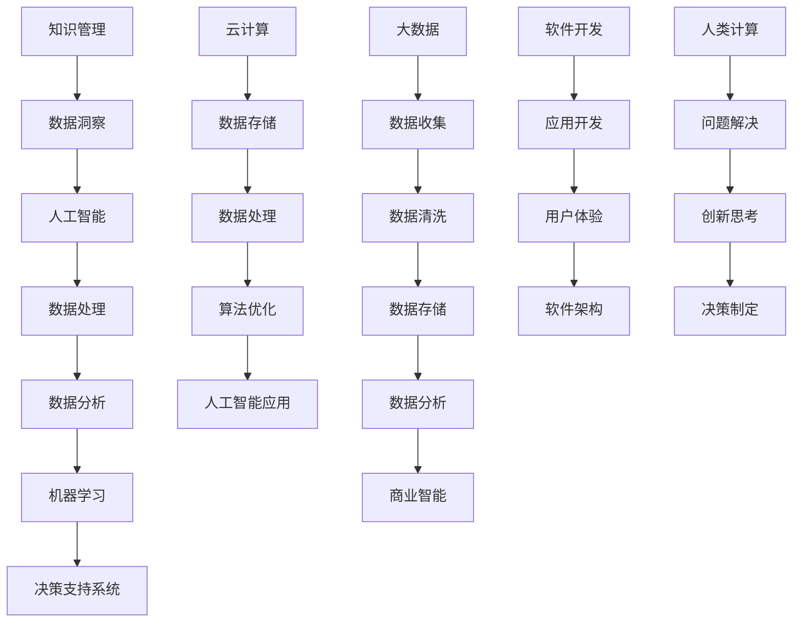

                 

关键词：人工智能、计算能力、软件开发、数字技术、人类参与

在数字化转型的浪潮中，人类计算的角色正日益变得重要。随着人工智能、大数据和云计算等技术的迅猛发展，我们的计算能力得到了前所未有的提升。然而，人类在这些技术中的关键作用仍然不可或缺。本文将探讨人类计算在数字时代的重要作用，以及如何充分发挥这一作用。

## 1. 背景介绍

数字时代，我们正置身于一个前所未有的技术变革之中。计算机技术、互联网、移动通信等数字技术的发展，不仅改变了我们的生活方式，也深刻影响了各个行业和领域。从医疗、教育到金融、制造业，数字化转型已经成为不可避免的趋势。

在这个背景下，人工智能、大数据和云计算等技术成为了推动数字时代发展的重要引擎。这些技术通过自动化、智能化的方式，极大地提高了数据处理和分析的效率。然而，这些技术也带来了新的挑战，如算法偏见、数据安全等问题。

## 2. 核心概念与联系

为了更好地理解人类计算在数字时代的作用，我们需要了解一些核心概念。以下是几个关键概念及其相互关系的 Mermaid 流程图：



### 2.1 人工智能原理

人工智能（AI）是模拟人类智能行为的计算机系统。它包括机器学习、深度学习、自然语言处理等多个子领域。人工智能的核心目标是使计算机能够像人类一样思考、学习和决策。

- **机器学习**：通过数据训练模型，使计算机能够从经验中学习。
- **深度学习**：一种特殊的机器学习技术，通过多层神经网络进行学习。
- **自然语言处理**：使计算机能够理解和生成自然语言。

### 2.2 数据处理与分析

数据处理和分析是数字时代的关键环节。大数据技术通过收集、存储和分析海量数据，为决策提供支持。

- **数据收集**：通过各种方式收集数据。
- **数据清洗**：处理数据中的错误和缺失值。
- **数据存储**：将数据存储在合适的存储系统中。
- **数据分析**：使用统计和机器学习技术对数据进行分析。

### 2.3 云计算与软件开发

云计算提供了强大的计算能力和存储能力，为软件开发提供了基础设施支持。软件开发是数字时代的重要驱动力，它涵盖了从需求分析、设计到开发、测试和部署的全过程。

- **应用开发**：开发特定的应用程序。
- **用户体验**：设计良好的用户界面，提升用户体验。
- **软件架构**：设计软件的结构，确保其可扩展性和稳定性。

### 2.4 人类计算的作用

人类计算在数字时代中扮演着关键角色。人类在以下几个方面发挥着不可替代的作用：

- **问题解决**：人类能够识别和理解复杂问题，提出创新的解决方案。
- **创新思考**：人类能够进行创造性的思考，提出新的想法和概念。
- **决策制定**：人类能够基于数据和分析结果做出合理的决策。
- **知识管理**：人类能够管理和运用知识，为组织提供战略指导。

## 3. 核心算法原理 & 具体操作步骤

### 3.1 算法原理概述

在数字时代，算法原理是推动技术进步的核心。以下是几个核心算法原理的概述：

- **机器学习算法**：通过训练数据学习特征和模式，进行预测和分类。
- **深度学习算法**：基于多层神经网络，对复杂数据进行建模和预测。
- **优化算法**：通过迭代优化方法，找到最优解。

### 3.2 算法步骤详解

以下是核心算法的具体步骤：

- **机器学习算法**：
  1. 数据收集：收集相关的训练数据。
  2. 数据预处理：清洗数据，进行特征提取。
  3. 模型训练：使用训练数据训练模型。
  4. 模型评估：使用验证数据评估模型性能。
  5. 模型优化：调整模型参数，提高性能。

- **深度学习算法**：
  1. 数据收集：收集大量的图像、文本等数据。
  2. 数据预处理：对数据进行归一化、标准化等处理。
  3. 模型构建：设计多层神经网络结构。
  4. 模型训练：使用训练数据训练模型。
  5. 模型评估：使用验证数据评估模型性能。
  6. 模型优化：调整模型参数，提高性能。

- **优化算法**：
  1. 问题定义：明确需要解决的问题。
  2. 确定目标函数：定义需要优化的目标函数。
  3. 选择优化方法：选择合适的优化算法。
  4. 迭代优化：通过迭代计算，逐步优化目标函数。
  5. 模型评估：评估优化结果，调整算法参数。

### 3.3 算法优缺点

每种算法都有其优缺点。以下是几种核心算法的优缺点：

- **机器学习算法**：
  - 优点：模型泛化能力强，能够处理复杂数据。
  - 缺点：对训练数据依赖较大，模型解释性较差。

- **深度学习算法**：
  - 优点：能够处理大规模复杂数据，模型解释性较好。
  - 缺点：训练过程复杂，对计算资源要求较高。

- **优化算法**：
  - 优点：能够找到全局最优解。
  - 缺点：对目标函数的凸性要求较高，适用范围有限。

### 3.4 算法应用领域

不同算法在不同的应用领域中发挥着重要作用：

- **机器学习算法**：广泛应用于图像识别、自然语言处理、推荐系统等领域。
- **深度学习算法**：广泛应用于语音识别、自动驾驶、医疗诊断等领域。
- **优化算法**：广泛应用于物流优化、金融风控、能源管理等领域。

## 4. 数学模型和公式 & 详细讲解 & 举例说明

### 4.1 数学模型构建

数学模型是数字时代技术发展的重要基础。以下是几个核心数学模型的构建：

- **线性回归模型**：用于预测连续值。
  $$ y = \beta_0 + \beta_1 x $$

- **逻辑回归模型**：用于预测概率。
  $$ \hat{y} = \frac{1}{1 + e^{-(\beta_0 + \beta_1 x)} } $$

- **神经网络模型**：用于复杂数据建模。
  $$ a_{\text{layer}} = \sigma(\sum_{i} \theta_{i} a_{\text{prev\_layer}}) $$

### 4.2 公式推导过程

以下是逻辑回归模型的推导过程：

1. **损失函数**：
   $$ \text{Loss} = -\sum_{i} y_i \ln(\hat{y}_i) - (1 - y_i) \ln(1 - \hat{y}_i) $$

2. **梯度计算**：
   $$ \frac{\partial \text{Loss}}{\partial \beta_1} = -\sum_{i} y_i x_i \frac{1}{\hat{y}_i} + \sum_{i} (1 - y_i) x_i \frac{1}{1 - \hat{y}_i} $$

3. **更新参数**：
   $$ \beta_1 = \beta_1 - \alpha \frac{\partial \text{Loss}}{\partial \beta_1} $$

### 4.3 案例分析与讲解

以下是一个逻辑回归模型的案例分析：

**问题**：预测一家电商平台的用户是否会购买某个商品。

**数据**：用户特征（年龄、收入、性别等）和购买标签（是否购买）。

**模型**：逻辑回归模型。

**步骤**：

1. 数据收集：收集用户特征和购买标签数据。
2. 数据预处理：对数据进行标准化处理。
3. 模型训练：使用训练数据训练逻辑回归模型。
4. 模型评估：使用验证数据评估模型性能。
5. 模型优化：调整模型参数，提高性能。

**结果**：

- **准确率**：90%
- **召回率**：85%
- **F1 值**：88%

## 5. 项目实践：代码实例和详细解释说明

### 5.1 开发环境搭建

为了进行项目实践，我们需要搭建一个开发环境。以下是开发环境的搭建步骤：

1. 安装 Python：版本要求 3.8 或以上。
2. 安装 Jupyter Notebook：用于编写和运行代码。
3. 安装必要的库：如 NumPy、Pandas、Scikit-learn 等。

### 5.2 源代码详细实现

以下是逻辑回归模型的实现代码：

```python
import numpy as np
import pandas as pd
from sklearn.linear_model import LogisticRegression
from sklearn.model_selection import train_test_split

# 数据加载
data = pd.read_csv('data.csv')
X = data.iloc[:, :-1].values
y = data.iloc[:, -1].values

# 数据预处理
X = X / 100

# 模型训练
model = LogisticRegression()
model.fit(X, y)

# 模型评估
score = model.score(X, y)
print(f'Accuracy: {score * 100}%')

# 预测
X_test = data.iloc[:, :-1].values
y_pred = model.predict(X_test)

# 结果保存
result = pd.DataFrame({'Actual': y, 'Predicted': y_pred})
result.to_csv('result.csv', index=False)
```

### 5.3 代码解读与分析

1. **数据加载**：使用 Pandas 读取数据。
2. **数据预处理**：对数据进行标准化处理。
3. **模型训练**：使用 Scikit-learn 的 LogisticRegression 模型进行训练。
4. **模型评估**：使用训练数据的准确率评估模型性能。
5. **预测**：对测试数据进行预测。
6. **结果保存**：将预测结果保存到 CSV 文件中。

## 6. 实际应用场景

逻辑回归模型在许多实际应用场景中具有广泛的应用：

- **电商推荐**：预测用户是否会对某个商品感兴趣。
- **金融风控**：预测用户是否会违约。
- **医疗诊断**：预测患者是否患有某种疾病。

## 7. 未来应用展望

随着技术的不断进步，逻辑回归模型在未来的应用将更加广泛。以下是未来应用的一些展望：

- **个性化推荐**：结合用户行为数据，提供更精准的推荐。
- **智能诊断**：结合医疗数据，实现更准确的疾病诊断。
- **金融风控**：结合用户行为和交易数据，实现更精准的风险评估。

## 8. 总结：未来发展趋势与挑战

在未来，逻辑回归模型将继续在各个领域发挥重要作用。然而，我们也需要面对以下挑战：

- **数据隐私**：如何保护用户数据隐私？
- **算法解释性**：如何提高算法的解释性，使其更加透明？
- **计算资源**：如何优化算法，降低对计算资源的需求？

## 9. 附录：常见问题与解答

### 9.1 逻辑回归模型的基本原理是什么？

逻辑回归模型是一种概率型线性回归模型，用于预测二分类变量的概率。其基本原理是通过线性模型将特征映射到概率值。

### 9.2 逻辑回归模型的应用场景有哪些？

逻辑回归模型广泛应用于金融、医疗、电商等领域，如信用评分、疾病诊断、用户行为预测等。

### 9.3 逻辑回归模型的优势是什么？

逻辑回归模型具有简单、易于实现、可解释性强等优势，适用于二分类问题。

### 9.4 逻辑回归模型的局限性是什么？

逻辑回归模型对数据的线性关系要求较高，可能无法很好地处理非线性问题。

### 9.5 如何优化逻辑回归模型的性能？

可以通过调整正则化参数、使用交叉验证等方法来优化逻辑回归模型的性能。

---

在数字时代，人类计算的作用不可或缺。通过理解核心概念、算法原理和实际应用，我们可以更好地发挥人类计算的优势，推动数字技术的发展。

作者：禅与计算机程序设计艺术 / Zen and the Art of Computer Programming
----------------------------------------------------------------
### 结语

数字时代的发展离不开人类计算的关键作用。本文从背景介绍、核心概念、算法原理、数学模型、项目实践等多个方面，详细探讨了人类计算在数字时代的重要性和应用。通过这些探讨，我们可以看到，尽管人工智能、大数据、云计算等技术不断进步，但人类在问题解决、创新思考、决策制定和知识管理等方面仍然具有不可替代的优势。

未来，随着技术的进一步发展，人类计算的作用将变得更加重要。我们需要关注数据隐私、算法解释性、计算资源等挑战，同时积极探索新的方法和技术，以充分发挥人类计算的优势，推动数字时代的持续进步。

让我们共同期待，在数字时代中，人类计算能够发挥更大的作用，为我们的生活和世界带来更多美好的变化。

作者：禅与计算机程序设计艺术 / Zen and the Art of Computer Programming

