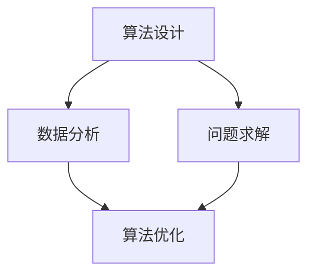

                 

关键词：数字时代、人类计算、人工智能、技术趋势、未来展望

> 摘要：本文将探讨数字时代中人类计算的关键作用，分析人工智能技术对人类生活和工作的深刻影响，并探讨未来发展趋势与挑战。通过具体案例和数据分析，我们旨在揭示人类计算在新时代中的核心地位，以及如何有效地提升个人和团队的计算能力，以应对未来的变化和机遇。

## 1. 背景介绍

随着信息技术的迅猛发展，我们正步入一个前所未有的数字时代。这一时代的特点是数据量呈爆炸式增长，计算能力和存储能力不断提升，以及人工智能技术的广泛应用。人类计算，作为一种基于人类智慧和经验的计算方式，在这个时代中扮演着至关重要的角色。人类计算不仅为人工智能提供了最初的算法和模型，而且在数据的理解和解释、复杂问题的求解以及创新思维的激发等方面具有不可替代的价值。

## 2. 核心概念与联系

在数字时代，人类计算的核心概念包括算法设计、数据分析和问题求解。这些概念相互联系，共同构成了人类计算的基本框架。

### Mermaid 流程图



### 2.1 算法设计

算法设计是人类计算的基础。一个好的算法能够高效地解决问题，并且在资源有限的情况下优化性能。算法设计需要结合人类的智慧和创造力，通过逻辑分析和数学推导，构建出解决问题的框架。

### 2.2 数据分析

数据分析是数字时代的重要工具。通过对海量数据的处理和分析，我们可以发现数据中的规律和趋势，从而做出更明智的决策。数据分析不仅依赖于计算机技术，还需要人类的智慧和洞察力来理解数据的含义。

### 2.3 问题求解

问题求解是算法设计和数据分析的最终目标。在复杂的问题面前，人类计算能够通过逻辑推理和经验判断，找到最优的解决方案。问题求解不仅需要算法的支撑，还需要人类的直觉和创造力。

## 3. 核心算法原理 & 具体操作步骤

### 3.1 算法原理概述

核心算法是数字时代中计算的关键。常见的核心算法包括排序算法、搜索算法和图算法。这些算法在数据结构和算法设计中具有广泛的应用。

### 3.2 算法步骤详解

#### 排序算法

排序算法的基本原理是通过对一组数据进行排序，使得数据按照特定的规则排列。常见的排序算法包括冒泡排序、快速排序和归并排序。

- 冒泡排序：通过相邻元素的比较和交换，逐步将数据排序。
- 快速排序：通过划分数据，将数据分为两部分，然后递归地对两部分数据进行排序。
- 归并排序：通过合并两个有序数据集，逐步构建出有序的数据集。

#### 搜索算法

搜索算法的基本原理是在数据集合中查找特定的元素。常见的搜索算法包括线性搜索和二分搜索。

- 线性搜索：通过逐个检查数据元素，找到目标元素。
- 二分搜索：通过不断缩小查找范围，提高搜索效率。

#### 图算法

图算法是处理图结构数据的算法。常见的图算法包括最短路径算法、最小生成树算法和拓扑排序。

- 最短路径算法：找出图中两点之间的最短路径。
- 最小生成树算法：从图中选取边构建一棵树，使得树的总权重最小。
- 拓扑排序：对有向无环图进行排序，确保每个顶点的入度都为0。

### 3.3 算法优缺点

每种算法都有其优缺点。例如，冒泡排序简单易懂，但效率较低；快速排序效率较高，但可能产生不平衡的划分。了解算法的优缺点，可以帮助我们在实际问题中做出更合适的选择。

### 3.4 算法应用领域

核心算法在各个领域都有广泛应用。例如，排序算法在数据库管理和搜索引擎中用于数据的组织和检索；搜索算法在推荐系统和路径规划中用于找到最佳解决方案；图算法在社交网络分析和复杂系统建模中用于分析和理解数据。

## 4. 数学模型和公式 & 详细讲解 & 举例说明

### 4.1 数学模型构建

数学模型是描述现实世界问题的一种抽象方法。通过构建数学模型，我们可以将复杂的问题转化为数学表达式，从而进行求解和分析。

### 4.2 公式推导过程

#### 概率论模型

概率论模型在人工智能和数据分析中广泛应用。以下是一个简单的概率论模型的推导过程：

假设有两个随机变量 X 和 Y，它们的概率分布分别为：

$$
P(X=x) = p_x, \quad P(Y=y) = p_y
$$

则 X 和 Y 的联合概率分布为：

$$
P(X=x, Y=y) = p_x \cdot p_y
$$

### 4.3 案例分析与讲解

以下是一个关于线性回归模型的案例：

假设我们要预测房价，已知房屋面积（X）和房价（Y），则线性回归模型可以表示为：

$$
Y = \beta_0 + \beta_1 \cdot X + \epsilon
$$

其中，$\beta_0$ 和 $\beta_1$ 为模型参数，$\epsilon$ 为误差项。

通过最小二乘法，我们可以求解出最优的 $\beta_0$ 和 $\beta_1$，从而建立预测模型。

## 5. 项目实践：代码实例和详细解释说明

### 5.1 开发环境搭建

在进行项目实践之前，我们需要搭建一个合适的开发环境。例如，我们可以使用 Python 作为编程语言，结合 Jupyter Notebook 进行开发。

### 5.2 源代码详细实现

以下是一个简单的线性回归模型的 Python 实现代码：

```python
import numpy as np

def linear_regression(X, Y):
    # 求解模型参数
    X_transpose = np.transpose(X)
    XTX = np.dot(X_transpose, X)
    XTY = np.dot(X_transpose, Y)
    beta = np.linalg.solve(XTX, XTY)
    return beta

# 数据加载和预处理
X = np.array([[1, 1000], [1, 1500], [1, 2000]])
Y = np.array([1200000, 1500000, 1800000])

# 模型训练
beta = linear_regression(X, Y)

# 模型预测
X_new = np.array([[1, 1200]])
Y_pred = np.dot(X_new, beta)
print("Predicted price:", Y_pred)
```

### 5.3 代码解读与分析

这段代码首先定义了一个线性回归模型，然后通过最小二乘法求解模型参数。接下来，我们加载和处理数据，使用训练数据训练模型，并利用模型进行预测。

### 5.4 运行结果展示

运行上述代码后，我们可以得到预测的房价。通过对比实际房价，我们可以评估模型的准确性。

## 6. 实际应用场景

人类计算在数字时代中的实际应用场景广泛，包括但不限于以下几个方面：

### 6.1 人工智能与机器学习

在人工智能和机器学习领域，人类计算负责算法的设计、优化和调整。通过不断的实验和验证，我们可以提高算法的性能和鲁棒性。

### 6.2 数据分析和决策支持

数据分析和决策支持系统依赖于人类计算，通过对数据的理解和分析，为企业和组织提供有价值的见解和决策支持。

### 6.3 计算机科学和软件开发

计算机科学和软件开发过程中，人类计算负责算法的实现、优化和调试。通过代码审查和测试，我们可以确保软件的质量和稳定性。

## 7. 工具和资源推荐

为了有效地进行人类计算，我们推荐以下工具和资源：

### 7.1 学习资源推荐

- 《深度学习》（Goodfellow, Bengio, Courville著）
- 《Python编程：从入门到实践》
- 《算法导论》（Thomas H. Cormen等著）

### 7.2 开发工具推荐

- Jupyter Notebook：用于数据分析和实验
- PyCharm：用于Python编程和开发
- GitHub：用于代码托管和协作

### 7.3 相关论文推荐

- "Deep Learning"（Ian Goodfellow著）
- "Reinforcement Learning: An Introduction"（Richard S. Sutton和Barto, Andrew G.著）
- "The Hundred-Page Machine Learning Book"（Ando, Seni著）

## 8. 总结：未来发展趋势与挑战

### 8.1 研究成果总结

在过去的几十年中，人类计算在人工智能、数据分析和计算机科学等领域取得了显著的成果。这些成果不仅推动了技术的进步，也为人类生活和工作带来了巨大的变革。

### 8.2 未来发展趋势

未来，人类计算将继续向深度学习和自适应计算方向迈进。随着计算能力的提升和算法的优化，人类计算将在更多领域发挥关键作用。

### 8.3 面临的挑战

然而，人类计算也面临着诸多挑战，包括数据隐私、算法透明性和可解释性。如何解决这些问题，将决定人类计算的未来发展。

### 8.4 研究展望

展望未来，人类计算将在人工智能、大数据和云计算等前沿领域中发挥越来越重要的作用。通过不断探索和创新，我们可以期待人类计算在未来带来更多令人惊喜的成果。

## 9. 附录：常见问题与解答

### 9.1 人类计算与人工智能的区别是什么？

人类计算强调的是基于人类智慧和经验的计算方式，而人工智能则是一种模拟人类思维过程的计算方法。

### 9.2 人类计算在数字时代中的核心作用是什么？

人类计算在数字时代中的核心作用是提供算法设计、数据分析和问题求解的支持，为人工智能和信息技术的发展提供基础。

### 9.3 如何提高个人和团队的计算能力？

提高个人和团队的计算能力可以通过学习新的计算技术、不断实践和参与项目、以及培养批判性思维和解决问题的能力来实现。

----------------------------------------------------------------

### 作者署名

作者：禅与计算机程序设计艺术 / Zen and the Art of Computer Programming

本文通过深入探讨人类计算在数字时代的关键作用，展示了人工智能、数据分析和计算机科学等领域的发展趋势与挑战。希望读者能够在阅读本文的过程中，对人类计算有更深刻的理解和认识，并为未来的技术创新和进步做出贡献。

