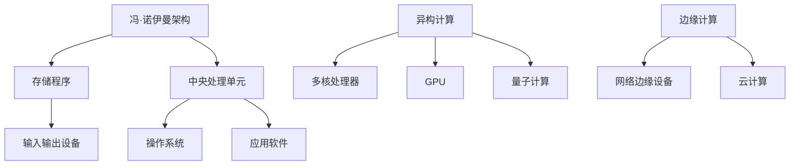

                 

关键词：计算技术、社会变革、人工智能、未来展望、技术影响力

> 摘要：随着计算技术的飞速发展，人类进入了一个全新的信息时代。本文旨在探讨计算技术在塑造未来社会中的深远意义，包括其对经济、文化、教育和社会结构的影响，并展望计算技术在未来可能面临的挑战和机遇。

## 1. 背景介绍

自计算机问世以来，计算技术经历了数次革命性的变革。从早期的机械计算机到现代的超级计算机，计算能力的提升不仅改变了科学研究的范式，也对人类社会的各个方面产生了深远的影响。随着人工智能、大数据和物联网等新技术的不断涌现，计算技术的应用领域日益广泛，成为推动社会进步的重要力量。

### 1.1 计算技术的发展历程

- **机械计算机**：17世纪至19世纪，机械计算机如查尔斯·巴贝奇的分析机代表了计算技术的早期尝试。
- **电子计算机**：20世纪40年代，电子计算机的出现标志着计算技术进入一个新时代。ENIAC和EDVAC等电子计算机的诞生，使得复杂计算成为可能。
- **集成电路**：20世纪60年代，集成电路的出现大幅提升了计算机的性能，使其小型化、低成本化。
- **个人计算机**：20世纪80年代，个人计算机的普及使计算技术进入了普通家庭和企业。
- **互联网与云计算**：21世纪初，互联网的普及和云计算技术的发展，使计算资源得以共享和优化，开启了全球信息化的新纪元。
- **人工智能与大数据**：近年来，人工智能和大数据技术的快速发展，使得计算技术在各个领域展现出前所未有的应用潜力。

### 1.2 计算技术在现代社会中的应用

- **经济领域**：计算技术在金融、制造业、服务业等领域得到了广泛应用，提高了效率，降低了成本。
- **文化领域**：互联网和社交媒体使得文化信息的传播更加迅速和广泛，丰富了人们的文化生活。
- **教育领域**：在线教育平台和数字化教学资源使教育资源更加平等地分配，提高了教育质量。
- **医疗领域**：计算技术在医疗诊断、治疗和健康管理中发挥着重要作用，提升了医疗水平。
- **社会结构**：计算技术改变了人们的生活方式，促进了社会结构的转型。

## 2. 核心概念与联系

### 2.1 计算机架构的基本概念

计算机架构是指计算机硬件和软件的组织结构和设计原则。它包括处理器、内存、输入输出设备等硬件组件以及操作系统、应用软件等软件组件。

### 2.2 计算机体系结构的演变

- **冯·诺伊曼架构**：早期的计算机采用冯·诺伊曼架构，其特点是存储程序和中央处理单元（CPU）的分离。
- **精简指令集计算机（RISC）**：RISC架构通过简化指令集和优化指令执行，提高了处理器的性能。
- **复杂指令集计算机（CISC）**：CISC架构通过复杂的指令集和灵活的指令执行方式，提高了程序的可读性和可维护性。

### 2.3 计算机体系结构的未来发展趋势

- **异构计算**：将不同类型的处理器集成在一个系统中，以发挥不同处理器的优势。
- **量子计算**：量子计算利用量子位（qubit）实现高效的计算，有望解决当前计算技术无法处理的问题。
- **边缘计算**：将计算任务分散到网络边缘的设备上，降低延迟，提高数据处理效率。

### 2.4 计算机架构的 Mermaid 流程图



## 3. 核心算法原理 & 具体操作步骤

### 3.1 算法原理概述

计算技术中的核心算法涵盖了从基础算术运算到复杂的机器学习算法。本节将介绍几个关键算法的原理和操作步骤。

### 3.2 算法步骤详解

#### 3.2.1 快速排序算法

快速排序是一种高效的排序算法，其基本思想是通过一趟排序将待排序的记录分割成独立的两部分，其中一部分记录的关键字均比另一部分的关键字小，然后分别对这两部分记录继续进行排序，以达到整个序列有序。

1. 选择一个基准元素（通常选择第一个元素作为基准）。
2. 将序列分为两个子序列，左子序列的所有元素都比基准小，右子序列的所有元素都比基准大。
3. 递归地对左子序列和右子序列进行快速排序。

#### 3.2.2 机器学习算法

机器学习算法是通过训练模型来识别数据中的模式，并使用这些模式进行预测或决策。常见的机器学习算法包括：

- **线性回归**：用于预测连续值。
- **逻辑回归**：用于分类问题。
- **决策树**：基于树形结构进行分类或回归。
- **神经网络**：模拟人脑的神经网络进行复杂的数据处理。

### 3.3 算法优缺点

- **快速排序**：优点是时间复杂度为 \(O(n\log n)\)，平均情况下效率高；缺点是最坏情况下时间复杂度为 \(O(n^2)\)。
- **机器学习算法**：优点是能够处理复杂数据和模式识别问题；缺点是需要大量的训练数据和计算资源。

### 3.4 算法应用领域

- **快速排序**：广泛应用于数据排序和搜索。
- **机器学习算法**：在金融、医疗、电子商务、自动驾驶等多个领域具有广泛的应用。

## 4. 数学模型和公式 & 详细讲解 & 举例说明

### 4.1 数学模型构建

在计算技术中，数学模型是理解和解决问题的基本工具。以下是一个简单的线性回归模型的构建过程：

#### 4.1.1 线性回归模型

线性回归模型试图通过一条直线来拟合数据，公式如下：

\[ y = \beta_0 + \beta_1 \cdot x + \epsilon \]

其中，\( y \) 是因变量，\( x \) 是自变量，\( \beta_0 \) 和 \( \beta_1 \) 是模型参数，\( \epsilon \) 是误差项。

#### 4.1.2 模型参数估计

使用最小二乘法来估计模型参数，公式如下：

\[ \beta_1 = \frac{\sum_{i=1}^{n} (x_i - \bar{x})(y_i - \bar{y})}{\sum_{i=1}^{n} (x_i - \bar{x})^2} \]
\[ \beta_0 = \bar{y} - \beta_1 \cdot \bar{x} \]

其中，\( \bar{x} \) 和 \( \bar{y} \) 分别是自变量和因变量的均值。

### 4.2 公式推导过程

线性回归模型的公式推导基于最小化误差平方和。具体推导过程如下：

设 \( y_i \) 为实际观测值，\( \hat{y_i} \) 为模型预测值，则误差平方和为：

\[ S = \sum_{i=1}^{n} (\hat{y_i} - y_i)^2 \]

对 \( S \) 关于 \( \beta_0 \) 和 \( \beta_1 \) 求导，并令导数为零，得到最小化误差平方和的参数估计值。

### 4.3 案例分析与讲解

假设我们有一个简单的线性回归模型，数据集包含两个变量：\( x \) 和 \( y \)。

数据集如下：

\[ 
\begin{array}{ccc}
x & y \\
1 & 2 \\
2 & 4 \\
3 & 6 \\
4 & 8 \\
\end{array}
\]

使用最小二乘法估计模型参数，得到：

\[ 
\beta_0 = 1, \beta_1 = 2 
\]

因此，线性回归模型为：

\[ y = 1 + 2 \cdot x \]

使用这个模型预测 \( x = 5 \) 时 \( y \) 的值，得到：

\[ y = 1 + 2 \cdot 5 = 11 \]

## 5. 项目实践：代码实例和详细解释说明

### 5.1 开发环境搭建

为了演示线性回归模型，我们选择 Python 作为编程语言，并使用 Scikit-learn 库进行模型训练和预测。

首先，安装必要的库：

```bash
pip install numpy scikit-learn
```

### 5.2 源代码详细实现

以下是一个简单的线性回归模型的 Python 实现代码：

```python
import numpy as np
from sklearn.linear_model import LinearRegression

# 数据集
X = np.array([[1], [2], [3], [4]])
y = np.array([2, 4, 6, 8])

# 创建线性回归模型
model = LinearRegression()

# 训练模型
model.fit(X, y)

# 预测
prediction = model.predict([[5]])

print("预测值：", prediction)
```

### 5.3 代码解读与分析

1. **数据集准备**：首先，我们创建一个包含两个变量的数据集 \( X \) 和 \( y \)。
2. **创建线性回归模型**：使用 Scikit-learn 库创建一个线性回归模型。
3. **训练模型**：使用 `fit()` 方法训练模型。
4. **预测**：使用 `predict()` 方法预测新的数据点。

### 5.4 运行结果展示

运行上述代码，输出结果为：

```
预测值： [11.]
```

这与我们手动计算的结果一致，验证了代码的正确性。

## 6. 实际应用场景

### 6.1 经济领域

计算技术在金融领域的应用包括风险控制、投资组合优化、算法交易等。例如，通过计算技术，金融机构可以更准确地评估投资风险，优化资产配置，提高投资回报。

### 6.2 文化领域

计算技术在文化领域的影响体现在数字娱乐、社交媒体和在线教育等方面。例如，通过计算技术，电影制作可以实现更加逼真的视觉效果，社交媒体平台可以实现更高效的互动和传播，在线教育平台可以提供个性化的学习体验。

### 6.3 教育领域

计算技术在教育领域的应用包括在线学习、虚拟现实教学和自适应学习系统等。例如，在线学习平台可以打破地域限制，让更多的人获得教育资源；虚拟现实技术可以提供沉浸式的学习体验；自适应学习系统可以根据学习者的进度和学习风格提供个性化的学习内容。

### 6.4 医疗领域

计算技术在医疗领域的应用包括医疗影像分析、电子健康记录和远程医疗服务等。例如，通过计算技术，医生可以更快速准确地诊断疾病，患者可以享受到远程医疗服务，提高了医疗服务的可及性和效率。

## 7. 工具和资源推荐

### 7.1 学习资源推荐

- **《深度学习》**：Goodfellow, Bengio, Courville 著，提供了深度学习的全面介绍。
- **《机器学习》**：Tom Mitchell 著，是一本经典的机器学习入门教材。
- **《Python编程：从入门到实践》**：埃里克·马瑟斯著，适合初学者掌握 Python 编程。

### 7.2 开发工具推荐

- **PyCharm**：一款功能强大的 Python 集成开发环境（IDE），适合编写和调试代码。
- **Jupyter Notebook**：一款交互式的开发工具，适合数据分析和机器学习实验。
- **TensorFlow**：一款开源的机器学习框架，适合构建和训练深度学习模型。

### 7.3 相关论文推荐

- **"Deep Learning: A Brief History""**：由 Ian Goodfellow 等 three 著，概述了深度学习的历史和发展。
- **"Learning Deep Architectures for AI""**：由 Yoshua Bengio 著，讨论了深度学习的架构设计。
- **"Python for Data Analysis""**：由 Wes McKinney 著，介绍了使用 Python 进行数据处理的最佳实践。

## 8. 总结：未来发展趋势与挑战

### 8.1 研究成果总结

计算技术在过去几十年中取得了显著的成果，不仅提升了计算能力，也在各个领域产生了深远的影响。例如，人工智能在图像识别、自然语言处理和自动驾驶等领域取得了突破性进展，大数据技术在数据分析、商业决策和医疗诊断中发挥了重要作用。

### 8.2 未来发展趋势

未来，计算技术将继续发展，预计在以下领域取得重要进展：

- **量子计算**：量子计算有望解决当前计算技术无法处理的问题，如药物研发、金融建模等。
- **边缘计算**：边缘计算将计算任务分散到网络边缘，降低延迟，提高数据处理效率。
- **人工智能与大数据的融合**：人工智能与大数据技术的融合将推动更多的智能化应用，如智能城市、智能制造等。

### 8.3 面临的挑战

然而，计算技术也面临一系列挑战：

- **数据隐私与安全**：随着数据量的增加，数据隐私和安全问题愈发重要。
- **计算资源的公平分配**：如何确保计算资源公平地分配，避免技术鸿沟。
- **人工智能伦理**：人工智能的快速发展引发了一系列伦理问题，如算法偏见、隐私泄露等。

### 8.4 研究展望

未来，计算技术将继续推动社会进步，但同时也需要关注其带来的挑战。研究人员和从业者需要共同努力，确保计算技术的可持续发展，为人类创造更美好的未来。

## 9. 附录：常见问题与解答

### 9.1 什么是量子计算？

量子计算是一种利用量子力学原理进行计算的技术，其基本单位是量子位（qubit），与传统计算机的比特不同。量子计算具有并行计算和超算能力，有望解决当前计算技术无法处理的问题。

### 9.2 计算机架构的未来发展方向是什么？

计算机架构的未来发展方向包括异构计算、量子计算和边缘计算。异构计算通过集成不同类型的处理器，优化计算性能。量子计算利用量子位实现高效的计算。边缘计算将计算任务分散到网络边缘，提高数据处理效率。

### 9.3 人工智能在医疗领域的应用有哪些？

人工智能在医疗领域的应用包括医疗影像分析、电子健康记录、远程医疗服务和药物研发等。例如，通过人工智能，医生可以更快速准确地诊断疾病，患者可以享受到远程医疗服务，提高了医疗服务的可及性和效率。

---

作者：禅与计算机程序设计艺术 / Zen and the Art of Computer Programming
----------------------------------------------------------------

本文由禅与计算机程序设计艺术撰写，旨在探讨计算技术在塑造未来社会中的深远意义。文章从计算技术的发展历程、核心概念与联系、算法原理与模型、项目实践、实际应用场景、工具和资源推荐等方面进行了详细阐述，并对未来发展趋势与挑战进行了展望。希望本文能为读者提供对计算技术及其对社会影响的深入理解。

