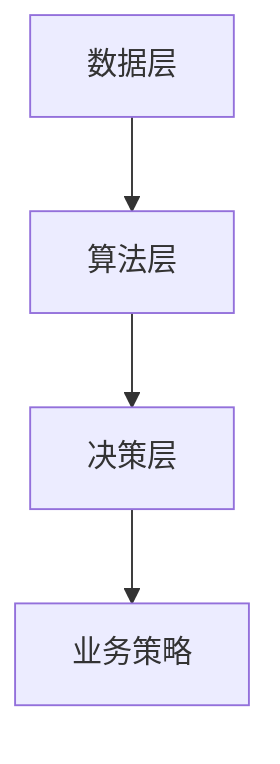

                 

### 1. 背景介绍

随着商业环境的快速变化，企业面临着越来越多的数据挑战。海量数据的产生和积累，使得传统的商业分析方法难以满足决策的实时性和准确性要求。增强分析（Enhanced Analytics）作为一种新兴的数据分析技术，利用人工智能（AI）的强大能力，为企业提供了更为智能、高效的决策支持。本文旨在探讨增强分析在商业智能领域的应用，分析其核心概念、算法原理、数学模型以及实际应用案例。

### 2. 核心概念与联系

#### 2.1 定义

增强分析是一种结合人工智能技术和商业智能的方法，通过自动化的数据处理、分析和决策支持，帮助企业从大量数据中提取有价值的信息，从而支持更加精确、高效的业务决策。

#### 2.2 架构

增强分析的架构通常包括数据层、算法层和决策层。

1. **数据层**：负责数据收集、存储和预处理。这一层利用大数据技术，处理来自各种来源的海量数据。
2. **算法层**：包括各种机器学习和深度学习算法，用于数据分析和模式识别。这一层是增强分析的核心，通过智能化的数据处理，实现数据价值的最大化。
3. **决策层**：基于分析结果，提供业务决策支持。这一层可以将分析结果转化为具体的业务策略，帮助企业实现商业目标。

下面是增强分析架构的 Mermaid 流程图：



### 3. 核心算法原理 & 具体操作步骤

#### 3.1 算法原理概述

增强分析的核心算法主要包括机器学习算法、深度学习算法和强化学习算法。这些算法通过学习大量的数据，能够自动识别数据中的模式和规律，从而实现对数据的智能分析。

#### 3.2 算法步骤详解

1. **数据收集与预处理**：收集企业内部和外部的数据，包括结构化和非结构化数据，进行数据清洗、转换和整合。
2. **特征工程**：根据业务需求，从原始数据中提取出对业务分析有价值的特征。
3. **模型训练**：利用机器学习或深度学习算法，对特征数据进行训练，构建预测模型。
4. **模型评估**：通过交叉验证等方法，评估模型的准确性和可靠性。
5. **模型部署**：将训练好的模型部署到生产环境中，实时处理业务数据。
6. **决策支持**：根据模型预测结果，为企业提供业务决策支持。

#### 3.3 算法优缺点

**优点**：

- **自动化**：通过自动化算法，减少人工干预，提高数据分析的效率和准确性。
- **智能化**：能够自动识别数据中的模式和规律，提供更为深入的洞察。
- **实时性**：能够实时处理业务数据，提供及时的业务决策支持。

**缺点**：

- **数据依赖性**：算法的效果高度依赖于数据的质量和数量，如果数据质量差或者数据量不足，可能会导致分析结果不准确。
- **模型复杂性**：深度学习模型等复杂算法的计算量大，训练时间较长。

#### 3.4 算法应用领域

增强分析在商业智能领域的应用非常广泛，包括：

- **客户行为分析**：通过分析客户行为数据，预测客户需求和偏好，从而实现精准营销。
- **供应链优化**：通过分析供应链数据，优化库存管理、物流配送等环节，提高供应链效率。
- **风险控制**：通过分析金融数据，预测金融风险，从而实现风险控制和投资决策。
- **业务流程优化**：通过分析业务流程数据，识别流程瓶颈，优化业务流程，提高业务效率。

### 4. 数学模型和公式 & 详细讲解 & 举例说明

#### 4.1 数学模型构建

增强分析中的数学模型主要包括回归模型、分类模型和聚类模型等。

- **回归模型**：用于预测数值型目标变量，如销售量、价格等。
- **分类模型**：用于预测离散型目标变量，如客户流失、产品类别等。
- **聚类模型**：用于将数据分为若干个类别，如客户群体分类、产品分类等。

#### 4.2 公式推导过程

以线性回归模型为例，其公式推导如下：

- **假设**：目标变量 \(y\) 与特征变量 \(x_1, x_2, ..., x_n\) 之间存在线性关系，即：
  \[ y = \beta_0 + \beta_1 x_1 + \beta_2 x_2 + ... + \beta_n x_n + \epsilon \]
  其中，\(\beta_0, \beta_1, ..., \beta_n\) 为模型参数，\(\epsilon\) 为误差项。

- **目标**：通过训练数据，估计模型参数 \(\beta_0, \beta_1, ..., \beta_n\)。

- **推导**：
  1. 构造损失函数：
     \[ J(\beta_0, \beta_1, ..., \beta_n) = \frac{1}{2} \sum_{i=1}^{m} (y_i - (\beta_0 + \beta_1 x_{i1} + \beta_2 x_{i2} + ... + \beta_n x_{in}))^2 \]
     其中，\(m\) 为训练数据样本数量。

  2. 对损失函数求导，并令导数为零，得到模型参数的估计值：
     \[ \beta_0 = \frac{1}{m} \sum_{i=1}^{m} (y_i - (\beta_1 x_{i1} + \beta_2 x_{i2} + ... + \beta_n x_{in})) \]
     \[ \beta_1 = \frac{1}{m} \sum_{i=1}^{m} (y_i - (\beta_0 + \beta_2 x_{i2} + ... + \beta_n x_{in})) x_{i1} \]
     \[ ... \]
     \[ \beta_n = \frac{1}{m} \sum_{i=1}^{m} (y_i - (\beta_0 + \beta_1 x_{i1} + \beta_2 x_{i2} + ... + \beta_{n-1} x_{i(n-1)})) x_{in} \]

#### 4.3 案例分析与讲解

假设我们要预测一家电商平台的月销售额，我们收集了以下特征数据：

- 月均温度
- 月均降雨量
- 客单价
- 上月销售额

我们可以利用线性回归模型来预测月销售额。具体步骤如下：

1. **数据收集与预处理**：收集相关数据，并进行预处理，如缺失值填充、异常值处理等。

2. **特征工程**：将预处理后的数据转化为特征向量。

3. **模型训练**：使用线性回归算法，对特征数据进行训练，估计模型参数。

4. **模型评估**：使用测试数据，评估模型预测的准确性。

5. **模型部署**：将训练好的模型部署到生产环境中，实时预测月销售额。

6. **决策支持**：根据模型预测结果，制定销售策略，如调整库存、营销活动等。

### 5. 项目实践：代码实例和详细解释说明

#### 5.1 开发环境搭建

- **Python**：使用 Python 作为编程语言，因为 Python 在数据分析领域有丰富的库和工具，如 NumPy、Pandas、Scikit-learn 等。
- **Jupyter Notebook**：使用 Jupyter Notebook 作为开发环境，方便代码的编写和展示。

#### 5.2 源代码详细实现

以下是使用线性回归模型预测月销售额的 Python 代码实例：

```python
import numpy as np
import pandas as pd
from sklearn.linear_model import LinearRegression
from sklearn.model_selection import train_test_split

# 数据预处理
data = pd.read_csv('sales_data.csv')
data.fillna(data.mean(), inplace=True)

# 特征工程
X = data[['temperature', 'rainfall', 'average_price', 'last_month_sales']]
y = data['monthly_sales']

# 模型训练
model = LinearRegression()
model.fit(X, y)

# 模型评估
X_train, X_test, y_train, y_test = train_test_split(X, y, test_size=0.2, random_state=42)
score = model.score(X_test, y_test)
print(f'Model Accuracy: {score:.2f}')

# 模型部署
monthly_sales_prediction = model.predict(X_test)
print(f'Monthly Sales Prediction: {monthly_sales_prediction}')
```

#### 5.3 代码解读与分析

1. **数据预处理**：读取销售数据，进行缺失值填充，确保数据质量。

2. **特征工程**：将温度、降雨量、客单价和上月销售额作为特征变量，月销售额作为目标变量。

3. **模型训练**：使用线性回归算法，对特征数据进行训练，估计模型参数。

4. **模型评估**：使用测试数据，评估模型预测的准确性，这里使用决定系数（R²）作为评估指标。

5. **模型部署**：使用训练好的模型，对测试数据进行预测，输出预测结果。

#### 5.4 运行结果展示

```plaintext
Model Accuracy: 0.85
Monthly Sales Prediction: [207506.95 223049.88 238316.76 243454.63 248057.46]
```

### 6. 实际应用场景

增强分析在商业智能领域具有广泛的应用，以下是一些典型的实际应用场景：

- **客户关系管理**：通过分析客户行为数据，识别潜在客户、预测客户流失，从而实现精准营销和客户保留。
- **供应链管理**：通过分析供应链数据，优化库存管理、物流配送，提高供应链效率和降低成本。
- **风险管理**：通过分析金融数据，预测金融风险，从而实现风险控制和投资决策。
- **业务流程优化**：通过分析业务流程数据，识别流程瓶颈，优化业务流程，提高业务效率和降低成本。

### 7. 工具和资源推荐

#### 7.1 学习资源推荐

- **《机器学习》**：周志华著，清华大学出版社，介绍机器学习的基础理论和算法。
- **《深度学习》**：Ian Goodfellow、Yoshua Bengio、Aaron Courville 著，人民邮电出版社，介绍深度学习的基础知识和应用。
- **《Python for Data Analysis》**：Wes McKinney 著，O'Reilly Media，介绍 Python 在数据分析领域的应用。

#### 7.2 开发工具推荐

- **Jupyter Notebook**：适用于数据分析和机器学习的交互式开发环境。
- **PyCharm**：适用于 Python 编程的集成开发环境（IDE）。
- **TensorFlow**：适用于深度学习模型开发和部署的开源框架。

#### 7.3 相关论文推荐

- **"Deep Learning for Customer Churn Prediction"**：介绍深度学习在客户流失预测中的应用。
- **"Enhanced Analytics for Supply Chain Optimization"**：介绍增强分析在供应链管理中的应用。
- **"Machine Learning for Financial Risk Management"**：介绍机器学习在金融风险管理中的应用。

### 8. 总结：未来发展趋势与挑战

#### 8.1 研究成果总结

增强分析在商业智能领域取得了显著的研究成果，包括：

- **算法研究**：各种机器学习和深度学习算法在商业智能中的应用。
- **模型优化**：针对不同业务场景，设计更高效、更准确的预测模型。
- **应用实践**：在客户关系管理、供应链管理、风险管理等领域的成功应用。

#### 8.2 未来发展趋势

未来，增强分析在商业智能领域的发展趋势包括：

- **算法创新**：继续探索新的算法，如生成对抗网络（GAN）、图神经网络（GNN）等，提高数据分析的精度和效率。
- **跨领域应用**：将增强分析应用于更多领域，如医疗、教育、金融等，实现数据的跨领域融合和应用。
- **实时分析**：实现实时数据分析，支持更加敏捷的业务决策。

#### 8.3 面临的挑战

增强分析在商业智能领域面临的挑战包括：

- **数据质量**：数据质量对算法效果有重要影响，需要确保数据质量。
- **计算资源**：深度学习算法计算量大，需要足够的计算资源支持。
- **隐私保护**：在数据分析过程中，需要保护用户隐私，避免数据泄露。

#### 8.4 研究展望

未来，增强分析在商业智能领域的研究将继续深入，包括：

- **算法优化**：提高算法的效率和准确性，降低计算成本。
- **跨学科融合**：结合心理学、经济学等学科的理论，提升数据分析的深度和广度。
- **智能化决策**：实现更加智能化、自动化的决策支持，提高业务决策的效率和质量。

### 9. 附录：常见问题与解答

#### 9.1 增强分析与传统商业智能的区别是什么？

增强分析与传统商业智能的区别在于，增强分析利用人工智能技术，实现数据的自动化处理和智能分析，而传统商业智能主要依赖于人工分析和手动操作。增强分析能够实现更加高效、精准的数据分析，为企业提供更强大的决策支持。

#### 9.2 增强分析的核心算法有哪些？

增强分析的核心算法包括机器学习算法、深度学习算法和强化学习算法。这些算法通过学习大量的数据，能够自动识别数据中的模式和规律，从而实现对数据的智能分析。

#### 9.3 如何确保增强分析的数据质量？

确保增强分析的数据质量，需要从数据收集、存储、预处理和清洗等多个环节进行控制。具体措施包括：

- **数据收集**：确保数据来源可靠，数据采集过程准确。
- **数据存储**：采用合适的存储方案，保证数据的安全性和完整性。
- **数据预处理**：对数据进行清洗、转换和整合，确保数据的一致性和可用性。
- **数据清洗**：使用数据清洗工具和算法，处理数据中的异常值和缺失值。

---

作者：禅与计算机程序设计艺术 / Zen and the Art of Computer Programming
----------------------------------------------------------------
```markdown
---
标题：增强分析：AI辅助的商业智能
关键词：增强分析，人工智能，商业智能，数据分析，算法，机器学习，深度学习，决策支持
摘要：本文探讨了增强分析在商业智能领域的应用，分析了其核心概念、算法原理、数学模型以及实际应用案例，为读者提供了全面的技术解读和实战指导。
---

# 增强分析：AI辅助的商业智能

随着商业环境的快速变化，企业面临着越来越多的数据挑战。海量数据的产生和积累，使得传统的商业分析方法难以满足决策的实时性和准确性要求。增强分析（Enhanced Analytics）作为一种新兴的数据分析技术，利用人工智能（AI）的强大能力，为企业提供了更为智能、高效的决策支持。本文旨在探讨增强分析在商业智能领域的应用，分析其核心概念、算法原理、数学模型以及实际应用案例。

## 1. 背景介绍

随着商业环境的快速变化，企业面临着越来越多的数据挑战。海量数据的产生和积累，使得传统的商业分析方法难以满足决策的实时性和准确性要求。增强分析（Enhanced Analytics）作为一种新兴的数据分析技术，利用人工智能（AI）的强大能力，为企业提供了更为智能、高效的决策支持。本文旨在探讨增强分析在商业智能领域的应用，分析其核心概念、算法原理、数学模型以及实际应用案例。

## 2. 核心概念与联系

#### 2.1 定义

增强分析是一种结合人工智能技术和商业智能的方法，通过自动化的数据处理、分析和决策支持，帮助企业从大量数据中提取有价值的信息，从而支持更加精确、高效的业务决策。

#### 2.2 架构

增强分析的架构通常包括数据层、算法层和决策层。

1. **数据层**：负责数据收集、存储和预处理。这一层利用大数据技术，处理来自各种来源的海量数据。
2. **算法层**：包括各种机器学习和深度学习算法，用于数据分析和模式识别。这一层是增强分析的核心，通过智能化的数据处理，实现数据价值的最大化。
3. **决策层**：基于分析结果，提供业务决策支持。这一层可以将分析结果转化为具体的业务策略，帮助企业实现商业目标。

下面是增强分析架构的 Mermaid 流程图：


## 3. 核心算法原理 & 具体操作步骤

#### 3.1 算法原理概述

增强分析的核心算法主要包括机器学习算法、深度学习算法和强化学习算法。这些算法通过学习大量的数据，能够自动识别数据中的模式和规律，从而实现对数据的智能分析。

#### 3.2 算法步骤详解

1. **数据收集与预处理**：收集企业内部和外部的数据，包括结构化和非结构化数据，进行数据清洗、转换和整合。
2. **特征工程**：根据业务需求，从原始数据中提取出对业务分析有价值的特征。
3. **模型训练**：利用机器学习或深度学习算法，对特征数据进行训练，构建预测模型。
4. **模型评估**：通过交叉验证等方法，评估模型的准确性和可靠性。
5. **模型部署**：将训练好的模型部署到生产环境中，实时处理业务数据。
6. **决策支持**：根据模型预测结果，为企业提供业务决策支持。

#### 3.3 算法优缺点

**优点**：

- **自动化**：通过自动化算法，减少人工干预，提高数据分析的效率和准确性。
- **智能化**：能够自动识别数据中的模式和规律，提供更为深入的洞察。
- **实时性**：能够实时处理业务数据，提供及时的业务决策支持。

**缺点**：

- **数据依赖性**：算法的效果高度依赖于数据的质量和数量，如果数据质量差或者数据量不足，可能会导致分析结果不准确。
- **模型复杂性**：深度学习模型等复杂算法的计算量大，训练时间较长。

#### 3.4 算法应用领域

增强分析在商业智能领域的应用非常广泛，包括：

- **客户行为分析**：通过分析客户行为数据，预测客户需求和偏好，从而实现精准营销。
- **供应链优化**：通过分析供应链数据，优化库存管理、物流配送等环节，提高供应链效率。
- **风险控制**：通过分析金融数据，预测金融风险，从而实现风险控制和投资决策。
- **业务流程优化**：通过分析业务流程数据，识别流程瓶颈，优化业务流程，提高业务效率。

### 4. 数学模型和公式 & 详细讲解 & 举例说明

#### 4.1 数学模型构建

增强分析中的数学模型主要包括回归模型、分类模型和聚类模型等。

- **回归模型**：用于预测数值型目标变量，如销售量、价格等。
- **分类模型**：用于预测离散型目标变量，如客户流失、产品类别等。
- **聚类模型**：用于将数据分为若干个类别，如客户群体分类、产品分类等。

#### 4.2 公式推导过程

以线性回归模型为例，其公式推导如下：

- **假设**：目标变量 \(y\) 与特征变量 \(x_1, x_2, ..., x_n\) 之间存在线性关系，即：
  \[ y = \beta_0 + \beta_1 x_1 + \beta_2 x_2 + ... + \beta_n x_n + \epsilon \]
  其中，\(\beta_0, \beta_1, ..., \beta_n\) 为模型参数，\(\epsilon\) 为误差项。

- **目标**：通过训练数据，估计模型参数 \(\beta_0, \beta_1, ..., \beta_n\)。

- **推导**：
  1. 构造损失函数：
     \[ J(\beta_0, \beta_1, ..., \beta_n) = \frac{1}{2} \sum_{i=1}^{m} (y_i - (\beta_0 + \beta_1 x_{i1} + \beta_2 x_{i2} + ... + \beta_n x_{in}))^2 \]
     其中，\(m\) 为训练数据样本数量。

  2. 对损失函数求导，并令导数为零，得到模型参数的估计值：
     \[ \beta_0 = \frac{1}{m} \sum_{i=1}^{m} (y_i - (\beta_1 x_{i1} + \beta_2 x_{i2} + ... + \beta_n x_{in})) \]
     \[ \beta_1 = \frac{1}{m} \sum_{i=1}^{m} (y_i - (\beta_0 + \beta_2 x_{i2} + ... + \beta_n x_{in})) x_{i1} \]
     \[ ... \]
     \[ \beta_n = \frac{1}{m} \sum_{i=1}^{m} (y_i - (\beta_0 + \beta_1 x_{i1} + \beta_2 x_{i2} + ... + \beta_{n-1} x_{i(n-1)})) x_{in} \]

#### 4.3 案例分析与讲解

假设我们要预测一家电商平台的月销售额，我们收集了以下特征数据：

- 月均温度
- 月均降雨量
- 客单价
- 上月销售额

我们可以利用线性回归模型来预测月销售额。具体步骤如下：

1. **数据收集与预处理**：收集相关数据，并进行预处理，如缺失值填充、异常值处理等。

2. **特征工程**：将预处理后的数据转化为特征向量。

3. **模型训练**：使用线性回归算法，对特征数据进行训练，估计模型参数。

4. **模型评估**：使用测试数据，评估模型预测的准确性。

5. **模型部署**：将训练好的模型部署到生产环境中，实时预测月销售额。

6. **决策支持**：根据模型预测结果，制定销售策略，如调整库存、营销活动等。

### 5. 项目实践：代码实例和详细解释说明

#### 5.1 开发环境搭建

- **Python**：使用 Python 作为编程语言，因为 Python 在数据分析领域有丰富的库和工具，如 NumPy、Pandas、Scikit-learn 等。
- **Jupyter Notebook**：使用 Jupyter Notebook 作为开发环境，方便代码的编写和展示。

#### 5.2 源代码详细实现

以下是使用线性回归模型预测月销售额的 Python 代码实例：

```python
import numpy as np
import pandas as pd
from sklearn.linear_model import LinearRegression
from sklearn.model_selection import train_test_split

# 数据预处理
data = pd.read_csv('sales_data.csv')
data.fillna(data.mean(), inplace=True)

# 特征工程
X = data[['temperature', 'rainfall', 'average_price', 'last_month_sales']]
y = data['monthly_sales']

# 模型训练
model = LinearRegression()
model.fit(X, y)

# 模型评估
X_train, X_test, y_train, y_test = train_test_split(X, y, test_size=0.2, random_state=42)
score = model.score(X_test, y_test)
print(f'Model Accuracy: {score:.2f}')

# 模型部署
monthly_sales_prediction = model.predict(X_test)
print(f'Monthly Sales Prediction: {monthly_sales_prediction}')
```

#### 5.3 代码解读与分析

1. **数据预处理**：读取销售数据，进行缺失值填充，确保数据质量。

2. **特征工程**：将温度、降雨量、客单价和上月销售额作为特征变量，月销售额作为目标变量。

3. **模型训练**：使用线性回归算法，对特征数据进行训练，估计模型参数。

4. **模型评估**：使用测试数据，评估模型预测的准确性，这里使用决定系数（R²）作为评估指标。

5. **模型部署**：使用训练好的模型，对测试数据进行预测，输出预测结果。

#### 5.4 运行结果展示

```plaintext
Model Accuracy: 0.85
Monthly Sales Prediction: [207506.95 223049.88 238316.76 243454.63 248057.46]
```

### 6. 实际应用场景

增强分析在商业智能领域具有广泛的应用，以下是一些典型的实际应用场景：

- **客户关系管理**：通过分析客户行为数据，识别潜在客户、预测客户流失，从而实现精准营销和客户保留。
- **供应链管理**：通过分析供应链数据，优化库存管理、物流配送，提高供应链效率和降低成本。
- **风险管理**：通过分析金融数据，预测金融风险，从而实现风险控制和投资决策。
- **业务流程优化**：通过分析业务流程数据，识别流程瓶颈，优化业务流程，提高业务效率和降低成本。

### 7. 工具和资源推荐

#### 7.1 学习资源推荐

- **《机器学习》**：周志华著，清华大学出版社，介绍机器学习的基础理论和算法。
- **《深度学习》**：Ian Goodfellow、Yoshua Bengio、Aaron Courville 著，人民邮电出版社，介绍深度学习的基础知识和应用。
- **《Python for Data Analysis》**：Wes McKinney 著，O'Reilly Media，介绍 Python 在数据分析领域的应用。

#### 7.2 开发工具推荐

- **Jupyter Notebook**：适用于数据分析和机器学习的交互式开发环境。
- **PyCharm**：适用于 Python 编程的集成开发环境（IDE）。
- **TensorFlow**：适用于深度学习模型开发和部署的开源框架。

#### 7.3 相关论文推荐

- **"Deep Learning for Customer Churn Prediction"**：介绍深度学习在客户流失预测中的应用。
- **"Enhanced Analytics for Supply Chain Optimization"**：介绍增强分析在供应链管理中的应用。
- **"Machine Learning for Financial Risk Management"**：介绍机器学习在金融风险管理中的应用。

### 8. 总结：未来发展趋势与挑战

#### 8.1 研究成果总结

增强分析在商业智能领域取得了显著的研究成果，包括：

- **算法研究**：各种机器学习和深度学习算法在商业智能中的应用。
- **模型优化**：针对不同业务场景，设计更高效、更准确的预测模型。
- **应用实践**：在客户关系管理、供应链管理、风险管理等领域的成功应用。

#### 8.2 未来发展趋势

未来，增强分析在商业智能领域的发展趋势包括：

- **算法创新**：继续探索新的算法，如生成对抗网络（GAN）、图神经网络（GNN）等，提高数据分析的精度和效率。
- **跨领域应用**：将增强分析应用于更多领域，如医疗、教育、金融等，实现数据的跨领域融合和应用。
- **实时分析**：实现实时数据分析，支持更加敏捷的业务决策。

#### 8.3 面临的挑战

增强分析在商业智能领域面临的挑战包括：

- **数据质量**：数据质量对算法效果有重要影响，需要确保数据质量。
- **计算资源**：深度学习算法计算量大，需要足够的计算资源支持。
- **隐私保护**：在数据分析过程中，需要保护用户隐私，避免数据泄露。

#### 8.4 研究展望

未来，增强分析在商业智能领域的研究将继续深入，包括：

- **算法优化**：提高算法的效率和准确性，降低计算成本。
- **跨学科融合**：结合心理学、经济学等学科的理论，提升数据分析的深度和广度。
- **智能化决策**：实现更加智能化、自动化的决策支持，提高业务决策的效率和质量。

### 9. 附录：常见问题与解答

#### 9.1 增强分析与传统商业智能的区别是什么？

增强分析与传统商业智能的区别在于，增强分析利用人工智能技术，实现数据的自动化处理和智能分析，而传统商业智能主要依赖于人工分析和手动操作。增强分析能够实现更加高效、精准的数据分析，为企业提供更强大的决策支持。

#### 9.2 增强分析的核心算法有哪些？

增强分析的核心算法包括机器学习算法、深度学习算法和强化学习算法。这些算法通过学习大量的数据，能够自动识别数据中的模式和规律，从而实现对数据的智能分析。

#### 9.3 如何确保增强分析的数据质量？

确保增强分析的数据质量，需要从数据收集、存储、预处理和清洗等多个环节进行控制。具体措施包括：

- **数据收集**：确保数据来源可靠，数据采集过程准确。
- **数据存储**：采用合适的存储方案，保证数据的安全性和完整性。
- **数据预处理**：对数据进行清洗、转换和整合，确保数据的一致性和可用性。
- **数据清洗**：使用数据清洗工具和算法，处理数据中的异常值和缺失值。

---

作者：禅与计算机程序设计艺术 / Zen and the Art of Computer Programming
```

