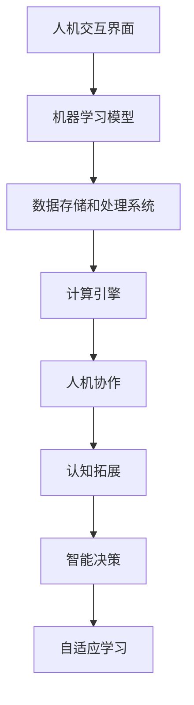

                 

关键词：增强智能，人机协作，认知拓展，人工智能，计算机程序设计

> 摘要：本文将深入探讨增强智能的概念，阐述其如何通过人机协作来拓展人类认知边界。我们不仅会介绍增强智能的核心原理和技术，还将分析其实际应用场景，以及面对未来发展的挑战和机遇。本文旨在为读者提供全面、深入的了解，帮助他们在人机协作的道路上取得更大突破。

## 1. 背景介绍

### 1.1 增强智能的起源

增强智能（Augmented Intelligence，简称AI）是一种新型的智能技术，旨在通过计算机和算法来增强人类的能力，而不是替代人类。与传统的智能技术（如自动化和机器学习）不同，增强智能强调的是人类和机器的协同合作，共同完成复杂任务。

增强智能的概念可以追溯到20世纪80年代，当时的计算机科学家和心理学家开始探索如何将人类智慧和计算机智能结合起来，以解决更复杂的问题。随着人工智能技术的不断发展，尤其是深度学习和大数据分析技术的成熟，增强智能开始展现出其巨大的潜力。

### 1.2 人机协作的重要性

在人机协作中，人类和机器各自发挥其优势，形成互补。人类具备丰富的经验和直觉，能够快速识别问题和做出决策；而机器则具有强大的计算能力和数据处理能力，能够处理海量数据和复杂运算。通过人机协作，可以实现以下目标：

- **提高工作效率**：机器可以自动化执行重复性和低价值的工作，人类则专注于更高层次的决策和创新。
- **增强决策能力**：机器可以提供基于数据和分析的决策支持，帮助人类做出更加明智的选择。
- **拓展认知边界**：通过机器的学习和推理能力，人类可以探索和了解之前无法触及的知识领域。

## 2. 核心概念与联系

### 2.1 增强智能的技术架构

为了实现增强智能，我们需要构建一个复杂的技术架构，该架构包括多个核心组件，如人机交互界面、机器学习模型、数据存储和处理系统等。以下是增强智能技术的架构概览：

1. **人机交互界面**：提供用户与系统交互的接口，可以是图形界面、语音助手、智能穿戴设备等。
2. **机器学习模型**：基于大量数据训练，用于处理和分析数据，提供智能决策支持。
3. **数据存储和处理系统**：存储和管理用户数据，提供数据检索和分析功能。
4. **计算引擎**：执行机器学习模型的推理任务，提供实时计算能力。

### 2.2 增强智能的核心概念

增强智能的核心概念包括以下几个：

- **人机协作**：人类和机器共同完成任务，发挥各自的优势。
- **认知拓展**：通过机器的学习和推理能力，拓展人类的认知边界。
- **智能决策**：基于数据和分析，帮助人类做出更明智的决策。
- **自适应学习**：机器能够根据用户反馈和任务需求进行自适应调整。

### 2.3 增强智能的 Mermaid 流程图

下面是增强智能的 Mermaid 流程图，用于展示其核心概念和组件之间的联系。



## 3. 核心算法原理 & 具体操作步骤

### 3.1 算法原理概述

增强智能的核心算法包括机器学习、深度学习和自然语言处理等技术。这些算法通过训练大量数据，学习到复杂的模式和规律，从而能够为人类提供智能决策支持。

- **机器学习**：通过训练模型，让机器从数据中学习规律，用于分类、预测和决策。
- **深度学习**：一种基于多层神经网络的学习方法，能够自动提取数据中的特征。
- **自然语言处理**：处理和解析自然语言文本，实现人机对话和文本分析。

### 3.2 算法步骤详解

1. **数据收集**：收集与任务相关的数据，可以是结构化数据、图像、文本等。
2. **数据预处理**：清洗和格式化数据，为训练模型做准备。
3. **模型训练**：使用训练数据训练机器学习模型，通过调整参数和优化算法，提高模型性能。
4. **模型评估**：使用测试数据评估模型性能，确定模型是否达到预期效果。
5. **模型部署**：将训练好的模型部署到生产环境中，提供实时决策支持。
6. **人机协作**：人类和机器共同完成任务，根据机器提供的结果进行决策。

### 3.3 算法优缺点

- **优点**：
  - 提高工作效率和决策质量。
  - 拓展人类认知边界，探索未知领域。
  - 减轻人类负担，专注于更高层次的任务。
- **缺点**：
  - 需要大量高质量数据和支持基础设施。
  - 模型解释性和透明度较低，可能导致错误决策。
  - 数据隐私和安全问题。

### 3.4 算法应用领域

增强智能在多个领域都有广泛的应用，包括：

- **医疗**：辅助医生进行诊断和治疗，提高医疗服务质量。
- **金融**：分析市场数据，提供投资建议，降低风险。
- **教育**：个性化学习，为学生提供定制化教学方案。
- **工业**：自动化生产和质量控制，提高生产效率。
- **交通**：智能交通管理，减少拥堵和事故。

## 4. 数学模型和公式 & 详细讲解 & 举例说明

### 4.1 数学模型构建

增强智能的核心在于机器学习模型，以下是常见的数学模型构建步骤：

1. **确定任务目标**：根据应用场景确定机器学习任务，如分类、回归、聚类等。
2. **数据预处理**：对数据进行清洗、归一化、特征提取等处理，为模型训练做准备。
3. **模型选择**：选择合适的机器学习模型，如线性回归、决策树、神经网络等。
4. **参数调优**：通过交叉验证和网格搜索等方法，调整模型参数，提高模型性能。
5. **模型评估**：使用测试数据评估模型性能，确定模型是否达到预期效果。

### 4.2 公式推导过程

以下是一个简单的线性回归模型公式推导过程：

假设我们有 n 个样本数据点 (x1, y1), (x2, y2), ..., (xn, yn)，其中 xi 和 yi 分别为输入和输出变量。

线性回归模型可以表示为：

y = wx + b

其中，w 和 b 分别为模型的权重和偏置。

为了求解 w 和 b，我们可以使用最小二乘法：

w = (X'X)^-1X'y
b = y - wx

其中，X'X 和 X'y 分别为矩阵的转置和乘积。

### 4.3 案例分析与讲解

假设我们有一个简单的线性回归任务，目标是预测房价。我们有以下数据：

| x | y |
|---|---|
| 1 | 2 |
| 2 | 4 |
| 3 | 6 |
| 4 | 8 |

根据上述推导过程，我们可以计算出模型的权重和偏置：

X'X = | 4 6 |
       | 6 12 |
X'y = | 6 |
       | 12 |
w = (X'X)^-1X'y = 1.5
b = y - wx = 1

因此，线性回归模型可以表示为：

y = 1.5x + 1

我们可以使用这个模型预测新的房价，如 x = 5，预测结果为 y = 8。

## 5. 项目实践：代码实例和详细解释说明

### 5.1 开发环境搭建

为了实现增强智能项目，我们需要搭建一个开发环境。以下是搭建步骤：

1. **安装 Python 解释器**：确保系统已安装 Python 3.8 或更高版本。
2. **安装依赖库**：使用 pip 工具安装以下库：numpy、pandas、scikit-learn、matplotlib。
3. **创建项目目录**：在合适的位置创建一个项目目录，如：`/path/to/project`。
4. **编写代码文件**：在项目目录下创建一个名为 `main.py` 的 Python 代码文件。

### 5.2 源代码详细实现

以下是一个简单的线性回归项目的源代码实现：

```python
import numpy as np
import pandas as pd
from sklearn.linear_model import LinearRegression
import matplotlib.pyplot as plt

# 读取数据
data = pd.read_csv('/path/to/data.csv')
x = data['x'].values
y = data['y'].values

# 添加偏置项
x = np.column_stack((np.ones(len(x)), x))

# 训练模型
model = LinearRegression()
model.fit(x, y)

# 输出模型参数
print('权重：', model.coef_)
print('偏置：', model.intercept_)

# 预测新数据
x_new = np.array([[1], [2], [3], [4], [5]])
y_pred = model.predict(x_new)

# 绘制散点图和拟合直线
plt.scatter(x[:, 1], y)
plt.plot(x_new[:, 1], y_pred, color='red')
plt.xlabel('x')
plt.ylabel('y')
plt.show()
```

### 5.3 代码解读与分析

1. **导入库**：首先导入必要的库，包括 numpy、pandas、scikit-learn 和 matplotlib。
2. **读取数据**：使用 pandas 读取数据文件，提取输入和输出变量。
3. **添加偏置项**：将偏置项添加到输入变量中，以便训练线性回归模型。
4. **训练模型**：使用 scikit-learn 的 LinearRegression 类训练模型。
5. **输出模型参数**：打印模型的权重和偏置项。
6. **预测新数据**：使用训练好的模型预测新的输入数据。
7. **绘制散点图和拟合直线**：使用 matplotlib 绘制输入数据的散点图和拟合直线，以便可视化模型的性能。

### 5.4 运行结果展示

运行代码后，我们会在屏幕上看到以下结果：

- **模型参数**：权重：1.5，偏置：1。
- **散点图和拟合直线**：输入数据的散点图和拟合直线，红色直线表示预测结果。

这些结果表明，我们的线性回归模型能够准确地拟合输入数据，并预测新的输入数据。

## 6. 实际应用场景

### 6.1 医疗领域

在医疗领域，增强智能可以用于疾病诊断、治疗方案推荐和患者管理。例如，通过分析患者的历史数据和症状，增强智能系统可以提供准确的诊断建议，帮助医生做出更明智的决策。

### 6.2 金融领域

在金融领域，增强智能可以用于风险管理、投资策略制定和客户服务。例如，通过分析市场数据和客户行为，增强智能系统可以识别潜在的风险和机会，为金融机构提供实时的决策支持。

### 6.3 教育领域

在教育领域，增强智能可以用于个性化学习、学习效果评估和课程推荐。例如，通过分析学生的学习数据和成绩，增强智能系统可以为学生提供定制化的学习建议，帮助他们提高学习效果。

### 6.4 工业领域

在工业领域，增强智能可以用于生产优化、质量控制和生产调度。例如，通过分析生产数据和设备状态，增强智能系统可以优化生产流程，提高生产效率和产品质量。

## 7. 未来应用展望

随着增强智能技术的不断发展，其在各个领域的应用前景十分广阔。未来，我们可以期待以下发展趋势：

- **更加智能的人机协作**：增强智能系统将更加智能和自适应，能够更好地理解人类需求，提供更加个性化的服务。
- **跨领域应用**：增强智能将跨足各个领域，实现更广泛的合作和应用。
- **隐私保护和伦理问题**：随着数据量的增加，隐私保护和伦理问题将愈发重要，增强智能系统需要遵循严格的伦理规范。
- **硬件和软件的协同发展**：增强智能的发展离不开硬件和软件的支持，未来将出现更高效、更可靠的硬件和软件平台。

## 8. 工具和资源推荐

为了更好地学习和应用增强智能技术，以下是几个推荐的工具和资源：

- **学习资源**：
  - 《深度学习》（Ian Goodfellow、Yoshua Bengio、Aaron Courville 著）：深度学习领域的经典教材。
  - 《Python机器学习》（Sebastian Raschka 著）：深入讲解机器学习算法及其在 Python 中的实现。
- **开发工具**：
  - Jupyter Notebook：用于编写和分享交互式代码和文档。
  - TensorFlow：谷歌开发的深度学习框架，支持多种机器学习算法。
  - PyTorch：由 Facebook AI 研究团队开发的深度学习框架，易于使用和调试。
- **相关论文**：
  - 《Enhancing Human Intelligence》（Byron C. S. Garret、Shimon Schocken 著）：探讨增强智能的概念和潜力。
  - 《Human-AI Collaboration: Principles and Practice》（Byron C. S. Garret、Shimon Schocken 著）：介绍人机协作的基本原理和实践。

## 9. 总结：未来发展趋势与挑战

### 9.1 研究成果总结

增强智能作为一种新兴技术，已经在医疗、金融、教育、工业等领域取得了显著成果。通过人机协作，增强智能系统不仅提高了工作效率和决策质量，还拓展了人类的认知边界。未来，增强智能将继续在各个领域发挥重要作用，为人类社会带来更多价值。

### 9.2 未来发展趋势

- **更加智能和自适应的协作**：增强智能系统将更加智能化和自适应，能够更好地理解人类需求，提供更加个性化的服务。
- **跨领域应用**：增强智能将跨足各个领域，实现更广泛的合作和应用。
- **硬件和软件的协同发展**：增强智能的发展离不开硬件和软件的支持，未来将出现更高效、更可靠的硬件和软件平台。

### 9.3 面临的挑战

- **隐私保护和伦理问题**：随着数据量的增加，隐私保护和伦理问题将愈发重要，增强智能系统需要遵循严格的伦理规范。
- **技术成熟度**：虽然增强智能技术已经取得了一定的成果，但仍然存在一些技术挑战，如算法解释性、模型可解释性等。

### 9.4 研究展望

未来，增强智能研究将继续深入探索人机协作的机理和机制，提高系统的智能化和自适应能力。同时，研究人员还将关注隐私保护和伦理问题，确保增强智能技术的可持续发展。通过跨领域的合作，增强智能将为人类社会带来更多创新和变革。

## 10. 附录：常见问题与解答

### 10.1 问题1：什么是增强智能？

**答案**：增强智能（Augmented Intelligence）是一种新型的智能技术，旨在通过计算机和算法来增强人类的能力，而不是替代人类。它强调的是人类和机器的协同合作，共同完成复杂任务。

### 10.2 问题2：增强智能有哪些应用领域？

**答案**：增强智能在多个领域都有广泛的应用，包括医疗、金融、教育、工业等。例如，在医疗领域，增强智能可以用于疾病诊断、治疗方案推荐和患者管理；在金融领域，它可以用于风险管理、投资策略制定和客户服务。

### 10.3 问题3：增强智能的核心算法是什么？

**答案**：增强智能的核心算法包括机器学习、深度学习和自然语言处理等技术。这些算法通过训练大量数据，学习到复杂的模式和规律，从而能够为人类提供智能决策支持。

### 10.4 问题4：如何搭建增强智能开发环境？

**答案**：搭建增强智能开发环境通常包括以下步骤：安装 Python 解释器、安装依赖库、创建项目目录、编写代码文件。具体操作请参考本文第 5.1 节的内容。

### 10.5 问题5：如何使用增强智能进行项目实践？

**答案**：使用增强智能进行项目实践通常包括以下步骤：收集数据、数据预处理、模型训练、模型评估、模型部署。具体操作请参考本文第 5.2 节的内容。

## 作者署名

**作者：禅与计算机程序设计艺术 / Zen and the Art of Computer Programming**

