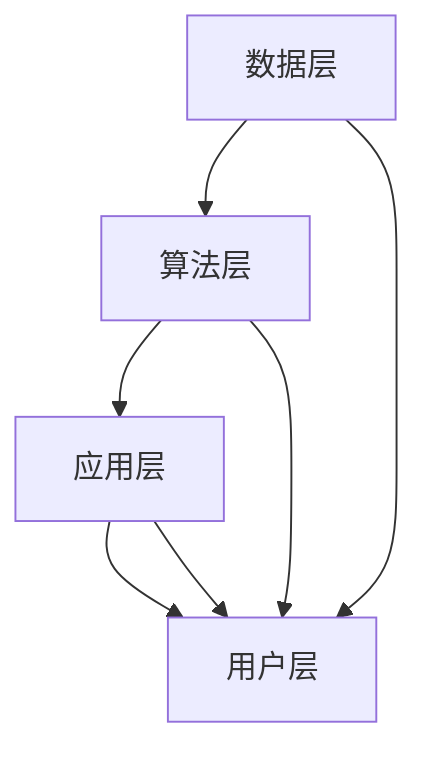

                 

关键词：增强智能，人机协同，认知拓展，人工智能应用，未来展望

> 摘要：随着人工智能技术的飞速发展，增强智能的概念逐渐成为研究热点。本文旨在探讨增强智能在人机协同中的重要作用，以及如何通过人机协同拓展认知新领域。文章首先介绍了增强智能的基本概念和原理，然后分析了增强智能在人机协同中的实现方式和优势，最后对未来增强智能的发展趋势和应用前景进行了展望。

## 1. 背景介绍

随着计算机技术的迅猛发展，人工智能（AI）已经成为当今世界的一个热门话题。从最初的规则推理到现代的深度学习，人工智能技术已经取得了显著的成果。然而，尽管人工智能在图像识别、自然语言处理、游戏智能等方面表现出色，但在某些领域，如复杂问题解决、决策制定等，仍面临着巨大的挑战。

为了解决这些问题，研究者们提出了增强智能（Augmented Intelligence，简称AI）的概念。增强智能是一种以人类为中心的人工智能，旨在通过辅助和扩展人类的能力，实现人机协同工作。与传统的人工智能不同，增强智能不仅关注机器的能力，更关注如何与人类更好地协作，共同完成复杂任务。

本文将围绕增强智能这一主题，探讨其基本概念、实现方式、优势以及未来发展趋势。希望通过本文的阐述，能够使读者对增强智能有更深入的理解，并激发对这一领域的兴趣。

## 2. 核心概念与联系

### 2.1 增强智能的定义

增强智能，顾名思义，是指通过技术手段增强人类智能的领域。它是一种基于人工智能技术的系统，旨在辅助人类完成复杂的任务，提升人类的工作效率和创造力。增强智能的核心在于人机协同，即通过机器与人类的紧密合作，实现优势互补。

### 2.2 增强智能的原理

增强智能的实现依赖于以下几个核心原理：

1. **认知计算**：认知计算是一种模拟人类思维过程的计算模型，它通过理解、学习、推理和决策等过程，实现对复杂问题的求解。

2. **大数据分析**：大数据分析技术能够处理海量数据，从中提取有价值的信息，为增强智能提供数据支持。

3. **自然语言处理**：自然语言处理技术使得机器能够理解人类语言，实现人机交互，为增强智能提供交互界面。

4. **机器学习**：机器学习技术使得机器能够通过数据学习，不断优化自身的性能，为增强智能提供智能化的决策支持。

### 2.3 增强智能的架构

增强智能的架构通常包括以下几个层次：

1. **数据层**：数据层是增强智能的基础，包括各种结构化和非结构化的数据，如文本、图像、音频等。

2. **算法层**：算法层包括各种机器学习和数据挖掘算法，用于处理和分析数据。

3. **应用层**：应用层是增强智能的直接实现，包括各种基于增强智能技术的应用，如智能客服、智能医疗、智能教育等。

4. **用户层**：用户层是增强智能的最终受益者，通过使用增强智能技术，提升工作效率和生活质量。

### 2.4 增强智能的 Mermaid 流程图

下面是增强智能的 Mermaid 流程图，展示了数据层、算法层、应用层和用户层之间的联系。



## 3. 核心算法原理 & 具体操作步骤

### 3.1 算法原理概述

增强智能的核心算法主要包括认知计算、大数据分析、自然语言处理和机器学习等。这些算法通过相互配合，实现人机协同，提升人类智能。

- **认知计算**：认知计算通过模拟人类思维过程，实现对复杂问题的求解。它包括感知、理解、学习、推理和决策等环节。

- **大数据分析**：大数据分析通过对海量数据的处理和分析，提取有价值的信息。它包括数据清洗、数据存储、数据挖掘等步骤。

- **自然语言处理**：自然语言处理使得机器能够理解人类语言，实现人机交互。它包括语言模型、词法分析、句法分析、语义分析等环节。

- **机器学习**：机器学习通过数据学习，不断优化自身的性能。它包括监督学习、无监督学习、半监督学习等。

### 3.2 算法步骤详解

下面是增强智能的具体操作步骤：

1. **数据收集**：收集各种结构化和非结构化的数据，如文本、图像、音频等。

2. **数据预处理**：对数据进行清洗、去重、归一化等处理，使其符合分析要求。

3. **特征提取**：从数据中提取有价值的信息，如关键词、主题、情感等。

4. **算法选择**：根据任务需求，选择合适的算法，如认知计算、大数据分析、自然语言处理、机器学习等。

5. **模型训练**：使用训练数据，对选定的算法进行训练，使其具备相应的智能能力。

6. **模型评估**：使用测试数据，对训练好的模型进行评估，检查其性能是否符合预期。

7. **模型部署**：将训练好的模型部署到实际应用场景，如智能客服、智能医疗、智能教育等。

8. **人机交互**：通过用户界面，实现人与机器的交互，使用户能够充分利用增强智能技术。

### 3.3 算法优缺点

增强智能的核心算法具有以下优缺点：

- **优点**：
  - **人机协同**：通过人机协同，实现优势互补，提升人类智能。
  - **灵活性**：可以根据实际需求，灵活选择和组合算法。
  - **自适应**：通过不断学习和优化，提高模型的性能。

- **缺点**：
  - **复杂性**：增强智能涉及多个领域的技术，实现过程较为复杂。
  - **数据依赖**：增强智能的性能高度依赖于数据的质量和数量。
  - **隐私风险**：增强智能在处理个人数据时，可能涉及到隐私保护的问题。

### 3.4 算法应用领域

增强智能的核心算法在多个领域具有广泛的应用，如：

- **智能客服**：通过自然语言处理和机器学习技术，实现智能客服系统，提升客户服务水平。
- **智能医疗**：通过大数据分析和认知计算技术，辅助医生进行诊断和治疗。
- **智能教育**：通过个性化学习和智能推荐技术，提高教学效果和学习效率。
- **智能安防**：通过图像识别和自然语言处理技术，实现智能安防系统，提升安全保障。

## 4. 数学模型和公式 & 详细讲解 & 举例说明

### 4.1 数学模型构建

增强智能的数学模型通常包括以下几个方面：

- **概率模型**：用于描述不确定性，如贝叶斯网络。
- **统计模型**：用于数据分析和预测，如线性回归、逻辑回归。
- **神经网络模型**：用于模拟人类思维过程，如深度神经网络、卷积神经网络。
- **优化模型**：用于优化决策，如线性规划、动态规划。

### 4.2 公式推导过程

以线性回归为例，线性回归模型的公式推导过程如下：

1. **假设**：假设目标变量 \(y\) 与自变量 \(x\) 之间存在线性关系，即 \(y = \beta_0 + \beta_1 x + \epsilon\)，其中 \(\beta_0\) 和 \(\beta_1\) 是待估参数，\(\epsilon\) 是误差项。

2. **损失函数**：定义损失函数 \(L(\beta_0, \beta_1) = \sum_{i=1}^n (y_i - (\beta_0 + \beta_1 x_i))^2\)，用于衡量预测值与真实值之间的差距。

3. **最小化损失函数**：通过最小化损失函数，求解参数 \(\beta_0\) 和 \(\beta_1\)。

4. **求解过程**：
   - **普通最小二乘法**：对损失函数求导，令导数为零，求解得到 \(\beta_0 = \frac{1}{n} \sum_{i=1}^n y_i - \beta_1 \frac{1}{n} \sum_{i=1}^n x_i\) 和 \(\beta_1 = \frac{1}{n} \sum_{i=1}^n (x_i - \bar{x})(y_i - \bar{y})\)，其中 \(\bar{x}\) 和 \(\bar{y}\) 分别是 \(x\) 和 \(y\) 的均值。
   - **梯度下降法**：迭代更新参数，直到损失函数最小。

### 4.3 案例分析与讲解

以股票预测为例，使用线性回归模型进行股票价格预测。

1. **数据收集**：收集某只股票在过去一段时间内的价格数据。

2. **数据预处理**：对数据进行清洗、归一化等处理。

3. **特征提取**：提取有用的特征，如开盘价、收盘价、成交量等。

4. **模型训练**：使用线性回归模型，对特征和价格进行拟合。

5. **模型评估**：使用测试数据，评估模型的预测性能。

6. **预测**：使用训练好的模型，预测未来一段时间内的股票价格。

通过上述步骤，可以实现对股票价格的预测。然而，需要注意的是，股票价格受多种因素影响，线性回归模型可能无法完全捕捉这些因素，因此预测结果可能存在一定误差。

## 5. 项目实践：代码实例和详细解释说明

### 5.1 开发环境搭建

1. **软件环境**：安装 Python 3.8 及以上版本、Jupyter Notebook、TensorFlow 2.0 及以上版本。
2. **硬件环境**：配置足够的内存和 GPU，以加速计算。

### 5.2 源代码详细实现

以下是一个简单的线性回归模型的 Python 代码实例：

```python
import tensorflow as tf
import numpy as np

# 数据准备
x = np.random.rand(100, 1)
y = 2 * x + 1 + np.random.rand(100, 1)

# 模型定义
model = tf.keras.Sequential([
    tf.keras.layers.Dense(units=1, input_shape=(1,))
])

# 编译模型
model.compile(loss='mean_squared_error', optimizer=tf.keras.optimizers.Adam(0.1))

# 训练模型
model.fit(x, y, epochs=1000)

# 预测
x_predict = np.array([[0.5]])
y_predict = model.predict(x_predict)
print("预测结果：", y_predict)
```

### 5.3 代码解读与分析

1. **数据准备**：生成随机数据，模拟股票价格数据。

2. **模型定义**：定义一个线性回归模型，输入层有 1 个神经元，输出层有 1 个神经元。

3. **编译模型**：设置损失函数为均方误差，优化器为 Adam。

4. **训练模型**：使用随机数据，训练 1000 个 epoch。

5. **预测**：使用训练好的模型，预测新的股票价格。

通过上述代码，可以实现对股票价格的简单预测。然而，需要注意的是，实际应用中股票价格受多种因素影响，线性回归模型可能无法完全捕捉这些因素，因此预测结果可能存在一定误差。

## 6. 实际应用场景

### 6.1 智能客服

智能客服是增强智能技术的一个重要应用领域。通过自然语言处理和机器学习技术，智能客服系统可以自动处理大量的客户咨询，提升客户服务水平。例如，银行、电商平台等企业，可以使用智能客服系统，为用户提供即时、准确的回答。

### 6.2 智能医疗

智能医疗是另一个重要的应用领域。通过大数据分析和认知计算技术，智能医疗系统可以辅助医生进行诊断和治疗。例如，通过分析患者的病史、检查报告等数据，智能医疗系统可以提供诊断建议，提高诊断准确率。此外，智能医疗还可以用于个性化治疗方案的制定，提高治疗效果。

### 6.3 智能教育

智能教育是增强智能技术在教育领域的应用。通过个性化学习和智能推荐技术，智能教育系统可以为学生提供个性化的学习建议，提高学习效果。例如，学生可以通过智能教育系统，选择适合自己的学习内容，进行有针对性的学习。

### 6.4 智能安防

智能安防是增强智能技术在公共安全领域的应用。通过图像识别和自然语言处理技术，智能安防系统可以实时监测监控视频，识别异常行为，提供报警信息。例如，在大型活动、公共场所等场景，智能安防系统可以及时发现安全隐患，保障公众安全。

## 7. 工具和资源推荐

### 7.1 学习资源推荐

1. **《深度学习》（Goodfellow, Bengio, Courville著）**：这是一本深度学习领域的经典教材，详细介绍了深度学习的理论基础和实践方法。
2. **《Python机器学习》（Sebastian Raschka著）**：这本书以Python编程语言为基础，介绍了机器学习的基本概念和算法实现。

### 7.2 开发工具推荐

1. **TensorFlow**：TensorFlow 是一款开源的深度学习框架，广泛应用于机器学习和人工智能领域。
2. **PyTorch**：PyTorch 是另一款流行的深度学习框架，与 TensorFlow 类似，提供了丰富的工具和库。

### 7.3 相关论文推荐

1. **“Deep Learning”**：这是一篇经典的综述文章，详细介绍了深度学习的理论基础和应用领域。
2. **“Reinforcement Learning: An Introduction”**：这是一本关于强化学习的经典教材，详细介绍了强化学习的基本概念和算法。

## 8. 总结：未来发展趋势与挑战

### 8.1 研究成果总结

近年来，增强智能技术取得了显著的成果。在智能客服、智能医疗、智能教育、智能安防等领域，增强智能技术已经取得了良好的应用效果。通过人机协同，增强智能技术不仅提升了人类的工作效率，还拓展了人类认知的边界。

### 8.2 未来发展趋势

未来，增强智能技术将继续向以下几个方向发展：

1. **智能化程度的提升**：随着人工智能技术的不断发展，增强智能的智能化程度将不断提高，实现更复杂、更智能的人机协同。
2. **跨领域的应用**：增强智能技术将不仅局限于特定的领域，还将跨领域应用，实现更广泛的人机协同。
3. **隐私保护和安全**：随着增强智能技术的应用，隐私保护和安全将成为重要议题，研究者们将致力于解决这些问题。

### 8.3 面临的挑战

尽管增强智能技术取得了显著成果，但仍然面临着一些挑战：

1. **数据隐私**：增强智能技术的应用涉及到大量个人数据，如何保护用户隐私成为重要问题。
2. **安全与伦理**：增强智能技术的应用可能引发安全与伦理问题，如算法偏见、数据滥用等。
3. **技术成熟度**：尽管增强智能技术已经取得了一定成果，但在某些领域，如认知计算、自然语言处理等，技术成熟度仍有待提高。

### 8.4 研究展望

未来，研究者们将继续致力于以下方向的研究：

1. **智能化技术的创新**：通过不断探索和创新，提高增强智能技术的智能化程度。
2. **跨领域的应用研究**：探讨增强智能技术在各个领域的应用，实现更广泛的人机协同。
3. **隐私保护和安全研究**：研究隐私保护和安全技术，确保增强智能技术的应用安全可靠。

## 9. 附录：常见问题与解答

### 9.1 增强智能是什么？

增强智能（Augmented Intelligence）是指通过技术手段增强人类智能的领域，旨在通过辅助和扩展人类的能力，实现人机协同工作。

### 9.2 增强智能的核心技术是什么？

增强智能的核心技术包括认知计算、大数据分析、自然语言处理和机器学习等。

### 9.3 增强智能有哪些应用领域？

增强智能在多个领域具有广泛应用，如智能客服、智能医疗、智能教育、智能安防等。

### 9.4 如何保障增强智能技术的安全与隐私？

通过研究隐私保护和安全技术，确保增强智能技术的应用安全可靠。同时，制定相关法律法规，规范增强智能技术的应用。

### 9.5 增强智能技术的未来发展趋势是什么？

未来，增强智能技术将向智能化程度提升、跨领域应用、隐私保护和安全等方向发展。

