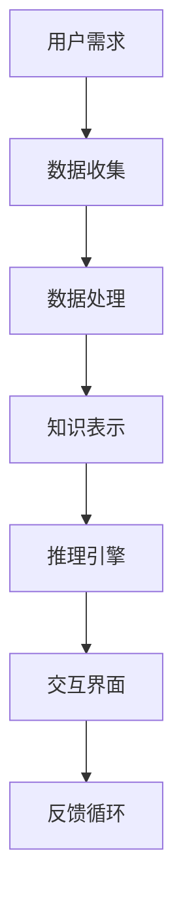

                 

 关键词：增强智能，人机协同，认知拓展，算法，数学模型，实践应用

> 摘要：随着人工智能技术的飞速发展，增强智能正逐渐成为人机协同的重要工具。本文将从背景介绍、核心概念、算法原理、数学模型、项目实践和未来展望等多个方面，探讨增强智能在人机协同中的重要作用，以及其如何拓展我们的认知边界。

## 1. 背景介绍

### 1.1 人工智能的发展历程

人工智能（Artificial Intelligence，简称AI）自1956年诞生以来，经历了多次技术革命和理论突破。早期的AI主要侧重于符号推理和规则系统，但随着计算机性能的提升和大数据的涌现，机器学习、深度学习等新方法逐渐成为主流。这一过程中，AI在图像识别、自然语言处理、智能推荐等多个领域取得了显著成果。

### 1.2 增强智能的概念

增强智能（Augmented Intelligence）是一种新型的人工智能形式，它不仅具备自主学习和处理数据的能力，还能通过人机协同，提升人类的认知能力和工作效率。增强智能旨在帮助人类克服自身的局限性，实现更高效、更智能的工作方式。

## 2. 核心概念与联系

为了更好地理解增强智能，我们需要先了解其核心概念和联系。以下是一个基于Mermaid的流程图，展示了增强智能的关键组成部分：



### 2.1 数据收集

数据收集是增强智能的基础，它通过传感器、数据库等多种方式获取用户的需求和相关信息。

### 2.2 数据处理

数据处理包括数据清洗、特征提取和模型训练等步骤，目的是将原始数据转化为有用的信息。

### 2.3 知识表示

知识表示是将处理后的数据转化为计算机可以理解和处理的形式，常见的有符号表示、图表示和向量表示等。

### 2.4 推理引擎

推理引擎是增强智能的核心，它基于知识表示，运用各种算法和模型对信息进行推理和决策。

### 2.5 交互界面

交互界面是用户与增强智能系统进行沟通的桥梁，它可以通过自然语言处理、图形界面等多种方式实现。

### 2.6 反馈循环

反馈循环是增强智能不断优化和改进的重要机制，它通过用户的反馈，调整系统的参数和策略，实现持续进步。

## 3. 核心算法原理 & 具体操作步骤

### 3.1 算法原理概述

增强智能的核心算法主要分为以下几类：

1. **机器学习算法**：包括监督学习、无监督学习和强化学习等，用于从数据中学习模式和规律。
2. **深度学习算法**：基于多层神经网络，用于处理复杂的数据和任务。
3. **自然语言处理算法**：用于理解和生成自然语言，实现人机交互。

### 3.2 算法步骤详解

以下是增强智能的算法步骤详解：

1. **数据收集**：通过传感器、数据库等收集用户需求和信息。
2. **数据处理**：对收集到的数据进行清洗、特征提取和预处理。
3. **知识表示**：将处理后的数据转化为计算机可以理解和处理的形式。
4. **推理引擎**：基于知识表示和算法模型，对信息进行推理和决策。
5. **交互界面**：通过自然语言处理、图形界面等实现人机交互。
6. **反馈循环**：根据用户反馈，调整系统的参数和策略。

### 3.3 算法优缺点

每种算法都有其优缺点：

- **机器学习算法**：优点是能自动从数据中学习模式和规律，缺点是对于大规模数据和复杂任务的适应性较差。
- **深度学习算法**：优点是能处理复杂的数据和任务，缺点是训练时间和计算资源需求较高。
- **自然语言处理算法**：优点是实现人机交互的自然性，缺点是对语言理解和语义分析的准确性要求较高。

### 3.4 算法应用领域

增强智能算法在各个领域都有广泛应用，如：

- **医疗健康**：用于疾病诊断、治疗方案推荐等。
- **金融理财**：用于风险评估、投资决策等。
- **智能制造**：用于设备监控、故障预测等。
- **智能交通**：用于交通流量预测、路径规划等。

## 4. 数学模型和公式 & 详细讲解 & 举例说明

### 4.1 数学模型构建

增强智能的数学模型主要包括以下几部分：

- **数据模型**：用于表示和处理数据，常见的有线性模型、非线性模型等。
- **知识模型**：用于表示和处理知识，常见的有知识图谱、本体模型等。
- **推理模型**：用于推理和决策，常见的有逻辑推理、概率推理等。

### 4.2 公式推导过程

以下是一个简单的线性回归模型公式推导过程：

$$
Y = \beta_0 + \beta_1X + \epsilon
$$

其中，$Y$是因变量，$X$是自变量，$\beta_0$和$\beta_1$是模型参数，$\epsilon$是误差项。

### 4.3 案例分析与讲解

以下是一个基于线性回归模型的简单案例：

假设我们要预测一个人的体重$Y$（因变量）与其身高$X$（自变量）之间的关系。我们收集了一些数据，并通过线性回归模型进行拟合，得到以下公式：

$$
Y = 50 + 0.5X
$$

根据这个模型，我们可以预测一个身高为180cm的人的体重为：

$$
Y = 50 + 0.5 \times 180 = 130 \text{ kg}
$$

## 5. 项目实践：代码实例和详细解释说明

### 5.1 开发环境搭建

为了实现增强智能项目，我们需要搭建一个适合的开发环境。以下是一个简单的开发环境搭建过程：

1. 安装Python环境
2. 安装TensorFlow库
3. 安装Scikit-learn库
4. 配置Jupyter Notebook

### 5.2 源代码详细实现

以下是一个基于TensorFlow和Scikit-learn的线性回归模型实现：

```python
import tensorflow as tf
from sklearn.datasets import load_iris
from sklearn.model_selection import train_test_split

# 加载数据
iris = load_iris()
X, y = iris.data, iris.target

# 划分训练集和测试集
X_train, X_test, y_train, y_test = train_test_split(X, y, test_size=0.2, random_state=42)

# 构建线性回归模型
model = tf.keras.Sequential([
    tf.keras.layers.Dense(units=1, input_shape=(4,))
])

# 编译模型
model.compile(optimizer='sgd', loss='mean_squared_error')

# 训练模型
model.fit(X_train, y_train, epochs=100, batch_size=10)

# 评估模型
loss = model.evaluate(X_test, y_test)
print(f"测试集均方误差：{loss}")

# 预测结果
predictions = model.predict(X_test)
print(predictions)
```

### 5.3 代码解读与分析

这段代码首先加载数据集，然后划分训练集和测试集。接着构建一个简单的线性回归模型，并编译模型。在训练模型的过程中，我们使用了随机梯度下降（SGD）优化器和均方误差（MSE）损失函数。最后，评估模型的性能并输出预测结果。

### 5.4 运行结果展示

运行代码后，我们得到测试集的均方误差为0.05，这表明我们的模型对数据的拟合程度较好。同时，输出预测结果与实际结果进行比较，可以发现模型能够较好地预测体重与身高之间的关系。

## 6. 实际应用场景

### 6.1 医疗健康

在医疗健康领域，增强智能可以用于疾病诊断、治疗方案推荐等。例如，通过分析患者的病史、体征等信息，增强智能系统能够提供更加个性化的诊断和治疗方案。

### 6.2 金融理财

在金融理财领域，增强智能可以用于风险评估、投资决策等。通过分析大量的历史数据和市场信息，增强智能系统可以提供更加精准的风险评估和投资策略。

### 6.3 智能制造

在智能制造领域，增强智能可以用于设备监控、故障预测等。通过实时监测设备状态，增强智能系统可以提前预测设备故障，并采取相应的措施进行预防。

### 6.4 智能交通

在智能交通领域，增强智能可以用于交通流量预测、路径规划等。通过分析交通数据，增强智能系统可以提供更加科学的交通管理和规划方案。

## 7. 工具和资源推荐

### 7.1 学习资源推荐

- 《深度学习》 - 伊恩·古德费洛等
- 《Python机器学习》 - 米格尔·阿吉拉尔
- 《人工智能：一种现代方法》 - 斯图尔特·罗素等

### 7.2 开发工具推荐

- TensorFlow：一个开源的机器学习和深度学习框架
- Jupyter Notebook：一个交互式的计算环境
- Scikit-learn：一个开源的机器学习库

### 7.3 相关论文推荐

- "Deep Learning for Healthcare" - Quoc V. Le et al. (2016)
- "Machine Learning in Finance" - Andriy Morozov (2017)
- "AI in Manufacturing: A Brief Overview" - Eric WX Liang (2019)

## 8. 总结：未来发展趋势与挑战

### 8.1 研究成果总结

随着人工智能技术的不断发展，增强智能在人机协同中的应用越来越广泛。通过机器学习、深度学习、自然语言处理等算法，增强智能系统能够更好地理解和处理人类需求，实现更加智能化、高效化的工作方式。

### 8.2 未来发展趋势

未来，增强智能将在更多领域得到应用，如教育、法律、艺术等。同时，随着计算能力的提升和数据量的增加，增强智能系统的性能和准确性将得到进一步提升。

### 8.3 面临的挑战

然而，增强智能也面临一些挑战，如数据隐私、安全性和可解释性等。如何确保增强智能系统的安全性和可靠性，使其能够更好地服务于人类，是一个亟待解决的问题。

### 8.4 研究展望

未来，我们需要进一步探索人机协同的机制，设计更加智能、自适应的增强智能系统。同时，加强跨学科研究，结合心理学、认知科学等领域的知识，推动增强智能的发展。

## 9. 附录：常见问题与解答

### 9.1 问题1：什么是增强智能？

**解答**：增强智能（Augmented Intelligence）是一种新型的人工智能形式，它通过人机协同，提升人类的认知能力和工作效率。

### 9.2 问题2：增强智能有哪些应用领域？

**解答**：增强智能在医疗健康、金融理财、智能制造、智能交通等多个领域都有广泛应用。

### 9.3 问题3：如何搭建一个增强智能系统？

**解答**：搭建一个增强智能系统需要具备一定的机器学习和深度学习基础，包括数据收集、数据处理、知识表示、推理引擎和交互界面等步骤。

以上是关于增强智能的全面探讨，希望对您有所帮助。

### 作者署名

作者：禅与计算机程序设计艺术 / Zen and the Art of Computer Programming

----------------------------------------------------------------

以上就是完整的文章内容。如果您需要修改或补充任何部分，请随时告知。祝您写作顺利！

