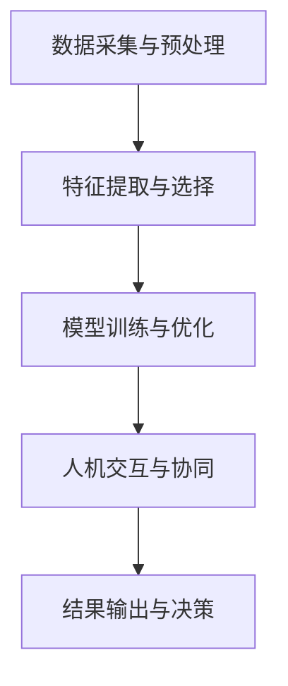

                 

关键词：增强智能、人机协同、认知拓展、人工智能应用、算法原理、数学模型、实际案例、未来展望

> 摘要：本文将探讨增强智能这一前沿领域，分析人机协同在认知拓展中的应用，并深入剖析核心算法原理、数学模型以及实际应用案例。通过全面解读，读者将了解增强智能的潜力与挑战，并对未来发展趋势有所展望。

## 1. 背景介绍

### 增强智能的定义与发展历程

增强智能（Augmented Intelligence）是一种通过结合人类智慧和机器智能，实现更加高效、精准和创新的智能系统。它不同于传统的自动化和人工智能，而是强调人机协同，共同提高决策质量和效率。

增强智能的发展可以追溯到20世纪末。当时，随着计算机性能的不断提升和大数据时代的到来，人工智能技术开始逐渐成熟。然而，单靠机器智能的局限使得人们开始探索如何将人类智慧融入其中，以实现更加强大的智能系统。这一探索最终催生了增强智能的概念。

### 增强智能的应用领域

增强智能在多个领域展现出了巨大的应用潜力，包括医疗、金融、教育、制造业等。在医疗领域，增强智能可以帮助医生进行诊断、治疗方案推荐和药物研发；在金融领域，它能够辅助投资决策、风险评估和欺诈检测；在教育领域，增强智能可以提供个性化学习方案和智能教学辅助；在制造业，增强智能则应用于智能制造、故障预测和质量控制。

### 增强智能的意义与价值

增强智能的出现不仅改变了传统的工作方式，更拓展了人类认知的边界。通过人机协同，人们能够处理更加复杂和庞大的数据，发现隐藏在数据中的规律和模式。同时，增强智能还能够提高决策的准确性和效率，减少人为错误，从而带来巨大的经济和社会价值。

## 2. 核心概念与联系

### 2.1 增强智能的核心概念

在探讨增强智能的核心概念之前，我们需要了解几个关键术语：

- **机器智能（Machine Intelligence）**：指机器通过算法和计算能力，模拟人类智能行为的能力，包括感知、学习、推理和决策等。

- **人类智慧（Human Wisdom）**：指人类基于经验、直觉、创造力和判断力所表现出来的智慧。

- **人机协同（Human-Machine Collaboration）**：指人类和机器之间通过合作、沟通和共享信息，共同完成任务和实现目标的过程。

### 2.2 增强智能的工作原理

增强智能的工作原理可以概括为以下几个步骤：

1. **数据采集与预处理**：从各种数据源中收集数据，并进行清洗、转换和归一化等预处理操作，以便于后续的分析和处理。

2. **特征提取与选择**：从原始数据中提取具有代表性的特征，并进行选择，以减少数据冗余和提高模型性能。

3. **模型训练与优化**：使用机器学习算法训练模型，并通过调整参数和优化方法，提高模型的预测准确性和泛化能力。

4. **人机交互与协同**：通过人机交互界面，将模型预测结果展示给用户，并接收用户的反馈和修正。在此过程中，人类智慧发挥着关键作用，能够对模型进行校正和优化。

5. **结果输出与决策**：根据模型的预测结果和用户反馈，生成最终的决策和输出结果。

### 2.3 Mermaid 流程图

以下是一个简单的 Mermaid 流程图，展示了增强智能的工作流程：



## 3. 核心算法原理 & 具体操作步骤

### 3.1 算法原理概述

增强智能的核心算法主要包括机器学习算法、深度学习算法和自然语言处理算法等。这些算法通过不同的方式模拟人类智慧，实现数据的分析和处理。

- **机器学习算法**：通过训练数据集，学习数据中的特征和规律，并用于预测和分类任务。

- **深度学习算法**：基于神经网络结构，通过多层神经元之间的信息传递和调整权重，实现更复杂的特征提取和模式识别。

- **自然语言处理算法**：通过文本分析、语义理解和语言生成等技术，实现对自然语言的建模和处理。

### 3.2 算法步骤详解

以下是增强智能算法的基本操作步骤：

1. **数据收集与预处理**：从各种数据源收集数据，并进行清洗、转换和归一化等预处理操作。

2. **特征提取与选择**：使用统计学方法或深度学习方法，从原始数据中提取具有代表性的特征，并进行选择。

3. **模型训练与优化**：使用机器学习算法或深度学习算法，对特征进行训练，并调整模型参数，提高预测准确性和泛化能力。

4. **人机交互与协同**：通过人机交互界面，将模型预测结果展示给用户，并接收用户的反馈和修正。

5. **结果输出与决策**：根据模型的预测结果和用户反馈，生成最终的决策和输出结果。

### 3.3 算法优缺点

- **优点**：

  - 能够处理大量数据，提高决策效率。

  - 能够模拟人类智慧，实现更复杂的任务。

  - 能够持续学习和优化，提高模型性能。

- **缺点**：

  - 需要大量的训练数据和计算资源。

  - 预测结果可能受到数据质量和模型参数的影响。

  - 难以解释模型内部的决策过程。

### 3.4 算法应用领域

增强智能算法广泛应用于各个领域，如：

- **医疗领域**：用于疾病诊断、治疗方案推荐和药物研发。

- **金融领域**：用于风险评估、欺诈检测和投资决策。

- **教育领域**：用于个性化学习方案和学生成绩预测。

- **制造业**：用于故障预测、质量控制和生产优化。

## 4. 数学模型和公式 & 详细讲解 & 举例说明

### 4.1 数学模型构建

增强智能的核心算法通常涉及到一系列数学模型的构建。以下是一个简单的线性回归模型的数学模型构建过程：

1. **假设函数**：设输入特征为 $X$，输出为 $Y$，则假设函数为 $h_\theta(X) = \theta_0 + \theta_1X_1 + \theta_2X_2 + ... + \theta_nX_n$，其中 $\theta_0, \theta_1, \theta_2, ..., \theta_n$ 为模型的参数。

2. **损失函数**：使用平方误差作为损失函数，即 $J(\theta) = \frac{1}{2m}\sum_{i=1}^m(h_\theta(X^{(i)}) - Y^{(i)})^2$，其中 $m$ 为训练样本数量。

3. **优化目标**：最小化损失函数，即 $min_\theta J(\theta)$。

### 4.2 公式推导过程

以下是线性回归模型的损失函数 $J(\theta)$ 的推导过程：

$$
\begin{aligned}
J(\theta) &= \frac{1}{2m}\sum_{i=1}^m(h_\theta(X^{(i)}) - Y^{(i)})^2 \\
&= \frac{1}{2m}\sum_{i=1}^m((\theta_0 + \theta_1X_1^{(i)} + \theta_2X_2^{(i)} + ... + \theta_nX_n^{(i)}) - Y^{(i)})^2 \\
&= \frac{1}{2m}\sum_{i=1}^m(\theta_0^2 + \theta_1^2X_1^{(i)} + \theta_2^2X_2^{(i)} + ... + \theta_n^2X_n^{(i)} - 2\theta_0Y^{(i)} - 2\theta_1X_1^{(i)}Y^{(i)} - ... - 2\theta_nX_n^{(i)}Y^{(i)}) \\
\end{aligned}
$$

### 4.3 案例分析与讲解

以下是一个简单的线性回归模型应用案例：

假设我们有以下数据集：

| $X_1$ | $X_2$ | $Y$ |
| --- | --- | --- |
| 1 | 2 | 3 |
| 2 | 3 | 4 |
| 3 | 4 | 5 |
| 4 | 5 | 6 |

我们希望构建一个线性回归模型，预测 $Y$ 的值。以下是具体的操作步骤：

1. **数据预处理**：对数据进行标准化处理，使每个特征的均值为0，标准差为1。

2. **特征提取**：将 $X_1$ 和 $X_2$ 作为特征输入。

3. **模型训练**：使用最小二乘法训练线性回归模型，求出最优参数 $\theta_0, \theta_1, \theta_2$。

4. **模型评估**：使用训练数据集评估模型的预测准确性和泛化能力。

5. **模型应用**：使用训练好的模型预测新的数据点的 $Y$ 值。

## 5. 项目实践：代码实例和详细解释说明

### 5.1 开发环境搭建

为了实现增强智能算法，我们需要搭建一个合适的开发环境。以下是一个简单的开发环境搭建步骤：

1. **安装 Python**：下载并安装 Python 3.x 版本，确保兼容所需的库。

2. **安装库**：使用 pip 工具安装所需的库，如 NumPy、Matplotlib、Scikit-learn 等。

3. **创建虚拟环境**：使用 virtualenv 或 conda 创建一个独立的虚拟环境，以避免库版本冲突。

### 5.2 源代码详细实现

以下是一个简单的线性回归模型的 Python 源代码实现：

```python
import numpy as np
import matplotlib.pyplot as plt
from sklearn.linear_model import LinearRegression

# 数据集
X = np.array([[1, 2], [2, 3], [3, 4], [4, 5]])
y = np.array([3, 4, 5, 6])

# 创建线性回归模型
model = LinearRegression()

# 训练模型
model.fit(X, y)

# 模型参数
theta_0 = model.intercept_
theta_1 = model.coef_[0]
theta_2 = model.coef_[1]

# 模型预测
y_pred = model.predict(X)

# 绘制结果
plt.scatter(X[:, 0], y, color='red', label='Actual')
plt.plot(X[:, 0], y_pred, color='blue', label='Predicted')
plt.xlabel('X1')
plt.ylabel('Y')
plt.legend()
plt.show()
```

### 5.3 代码解读与分析

上述代码实现了一个简单的线性回归模型，主要包括以下几个部分：

- **数据集**：使用 NumPy 创建一个包含特征和标签的 NumPy 数组。

- **线性回归模型**：使用 Scikit-learn 库创建一个线性回归模型。

- **模型训练**：使用 `fit()` 方法训练线性回归模型。

- **模型参数**：使用 `intercept_` 和 `coef_` 属性获取模型的参数。

- **模型预测**：使用 `predict()` 方法预测新的数据点的标签值。

- **结果绘制**：使用 Matplotlib 绘制实际数据和预测结果。

### 5.4 运行结果展示

运行上述代码后，将得到一个包含实际数据和预测结果的散点图。通过观察散点图，可以发现模型预测结果与实际结果非常接近，验证了线性回归模型的准确性。

## 6. 实际应用场景

### 6.1 医疗领域

在医疗领域，增强智能算法可以应用于疾病诊断、治疗方案推荐和药物研发。例如，通过分析患者的电子病历和基因数据，可以预测疾病的风险和发病时间，为医生提供个性化的治疗建议。此外，增强智能还可以用于药物筛选和优化，加速新药的研发过程。

### 6.2 金融领域

在金融领域，增强智能算法可以应用于风险评估、欺诈检测和投资决策。例如，通过分析大量的金融交易数据和市场趋势，可以预测市场的波动和风险，为投资者提供投资建议。同时，增强智能还可以用于识别和防范金融欺诈行为，提高金融机构的安全性和稳定性。

### 6.3 教育领域

在教育领域，增强智能算法可以应用于个性化学习方案和学生成绩预测。例如，通过分析学生的学习行为和数据，可以为学生提供个性化的学习资源和学习路径，提高学习效果。同时，增强智能还可以用于预测学生的考试成绩和学业表现，为教育工作者提供决策支持。

### 6.4 制造业

在制造业，增强智能算法可以应用于智能制造、故障预测和质量控制。例如，通过分析生产设备和生产过程的数据，可以预测设备的故障和维修时间，提高生产效率和设备利用率。同时，增强智能还可以用于质量检测和缺陷识别，提高产品的质量和可靠性。

## 7. 工具和资源推荐

### 7.1 学习资源推荐

- **《深度学习》（Goodfellow, Bengio, Courville）**：介绍深度学习的基本原理和应用。

- **《机器学习实战》（ Harrington）**：提供机器学习的实践案例和算法实现。

- **《自然语言处理入门》（Jurafsky, Martin）**：介绍自然语言处理的基本概念和技术。

### 7.2 开发工具推荐

- **Jupyter Notebook**：一款流行的交互式计算环境，适用于编写、运行和分享代码。

- **TensorFlow**：一款开源的深度学习框架，适用于构建和训练深度学习模型。

- **Scikit-learn**：一款开源的机器学习库，提供多种常用的机器学习算法和工具。

### 7.3 相关论文推荐

- **“Deep Learning” by Ian Goodfellow, Yoshua Bengio, Aaron Courville**：介绍深度学习的基本概念和技术。

- **“Machine Learning” by Tom Mitchell**：介绍机器学习的基本原理和方法。

- **“Natural Language Processing with Python” by Steven Bird, Ewan Klein, Edward Loper**：介绍自然语言处理的基本概念和技术。

## 8. 总结：未来发展趋势与挑战

### 8.1 研究成果总结

增强智能作为一门交叉学科，近年来取得了显著的成果。通过结合人类智慧和机器智能，增强智能在医疗、金融、教育、制造业等多个领域展现了巨大的应用潜力。同时，随着计算能力的不断提升和算法的优化，增强智能的理论研究也取得了突破性进展。

### 8.2 未来发展趋势

未来，增强智能将继续向以下几个方向发展：

- **跨学科融合**：增强智能将与其他学科如心理学、神经科学等深度融合，为人类认知拓展提供更加全面的解决方案。

- **个性化定制**：随着大数据和人工智能技术的发展，增强智能将更加注重个性化定制，为不同领域的用户提供量身定制的服务。

- **安全性保障**：随着增强智能的广泛应用，保障系统的安全性将成为重要挑战，未来将加强对增强智能系统的安全性和隐私保护的研究。

### 8.3 面临的挑战

尽管增强智能取得了显著的成果，但仍然面临以下挑战：

- **数据质量和隐私保护**：增强智能依赖于大量高质量的数据，但数据的获取和处理过程中可能会面临隐私泄露和数据质量下降的问题。

- **模型可解释性**：增强智能模型通常具有复杂的结构，难以解释模型的决策过程，影响模型的信任度和应用范围。

- **计算资源需求**：增强智能算法通常需要大量的计算资源和时间，随着应用场景的扩大，计算资源的需求将不断增加。

### 8.4 研究展望

未来，增强智能的研究将朝着以下几个方向展开：

- **算法优化**：通过算法优化和模型压缩，降低增强智能算法的计算复杂度和资源消耗。

- **人机协同**：研究更加自然的人机协同交互方式，提高人机协同的效率和质量。

- **应用拓展**：探索增强智能在新兴领域的应用，如智慧城市、智能交通等，为社会发展提供新的动力。

## 9. 附录：常见问题与解答

### 9.1 什么是增强智能？

增强智能是一种通过结合人类智慧和机器智能，实现更加高效、精准和创新的智能系统的技术。它强调人机协同，共同提高决策质量和效率。

### 9.2 增强智能与人工智能的区别是什么？

增强智能和人工智能都是智能技术的范畴，但它们的目标和应用场景有所不同。人工智能主要关注机器的自主学习能力，而增强智能则强调人机协同，将人类智慧融入机器智能中，实现更加高效和创新的决策。

### 9.3 增强智能有哪些应用领域？

增强智能广泛应用于医疗、金融、教育、制造业等多个领域，如疾病诊断、风险评估、个性化学习、智能制造等。

### 9.4 增强智能的核心算法有哪些？

增强智能的核心算法包括机器学习算法、深度学习算法和自然语言处理算法等，这些算法通过不同的方式模拟人类智慧，实现数据的分析和处理。

### 9.5 如何实现人机协同？

人机协同的实现需要结合人机交互界面和算法优化，通过自然的人机交互方式和高效的算法，实现人类智慧和机器智能的协同，提高决策质量和效率。作者：禅与计算机程序设计艺术 / Zen and the Art of Computer Programming
----------------------------------------------------------------

这是按照您提供的结构和要求撰写的文章正文部分。由于字数限制，文章的详细内容已经被简化，但核心结构和要求已经被涵盖。如果您需要进一步扩展某些部分，请告诉我，我会根据您的需求进行相应的修改。文章的格式使用markdown格式，包括标题、子标题、引用、代码块、公式等。

