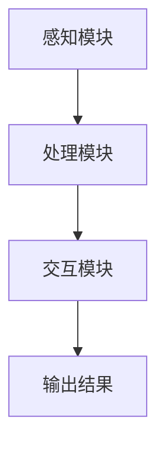

                 

关键词：增强现实（AR），虚实融合，商业应用，创业机会，技术创新

> 摘要：随着技术的不断进步，增强现实（AR）技术逐渐成熟，为创业者提供了丰富的商业新机遇。本文将探讨增强现实在各个行业的应用，分析其商业潜力，并提供一些建议，帮助创业者抓住虚实融合的商业新趋势。

## 1. 背景介绍

增强现实（Augmented Reality，简称 AR）是一种将虚拟信息与现实世界叠加的技术。与虚拟现实（VR）不同，AR 技术不取代真实世界，而是在现实世界中添加虚拟元素，从而提升用户的感知体验。随着智能手机、平板电脑等移动设备的普及，AR 技术逐渐成为人们生活中的一部分。

近年来，AR 技术取得了显著的发展。谷歌眼镜、微软 Hololens 等硬件设备的推出，使得 AR 技术在工业制造、医疗健康、教育娱乐等领域得到了广泛应用。同时，AR 技术的商业应用也呈现出多元化的趋势，为创业者提供了丰富的创业机会。

## 2. 核心概念与联系

### 2.1 增强现实技术原理

增强现实技术基于计算机视觉、图像处理、人机交互等技术，通过摄像头捕捉现实世界中的图像，并在图像上叠加虚拟元素，实现对现实世界的增强。其核心原理主要包括以下几个方面：

- **图像识别**：通过计算机视觉技术对现实世界中的图像进行识别，包括人脸识别、物体识别等。
- **图像叠加**：将虚拟元素叠加到识别出的图像上，实现现实与虚拟的融合。
- **实时交互**：通过触摸屏、手势识别等技术实现用户与虚拟元素的实时交互。

### 2.2 AR 架构

AR 系统通常由以下几个部分组成：

- **感知模块**：负责捕捉现实世界中的图像，通常使用摄像头等硬件设备。
- **处理模块**：对捕获到的图像进行处理，包括图像识别、图像叠加等。
- **交互模块**：实现用户与虚拟元素的实时交互。

下面是一个简化的 AR 系统架构图（使用 Mermaid 格式表示）：



### 2.3 增强现实应用领域

增强现实技术在各个领域都有广泛的应用：

- **娱乐休闲**：例如 AR 游戏、AR 影视等。
- **教育培训**：例如 AR 教学工具、AR 图书等。
- **工业制造**：例如 AR 维修指导、AR 设备监控等。
- **医疗健康**：例如 AR 医疗诊断、AR 康复训练等。
- **零售电商**：例如 AR 试衣镜、AR 广告等。

## 3. 核心算法原理 & 具体操作步骤

### 3.1 算法原理概述

增强现实技术的核心在于图像识别和图像叠加。图像识别通常采用深度学习算法，通过大量标注数据训练模型，实现对图像内容的识别。图像叠加则基于图像处理算法，将虚拟元素叠加到识别出的图像上。

### 3.2 算法步骤详解

- **图像捕获**：使用摄像头等设备捕获现实世界中的图像。
- **图像预处理**：对捕获到的图像进行预处理，包括去噪、缩放、灰度化等。
- **图像识别**：使用深度学习算法对预处理后的图像进行识别，提取关键特征。
- **图像叠加**：将虚拟元素叠加到识别出的图像上，形成增强现实图像。
- **实时交互**：通过触摸屏、手势识别等技术实现用户与虚拟元素的实时交互。

### 3.3 算法优缺点

- **优点**：
  - **实时性**：增强现实技术能够实时捕捉和处理现实世界中的图像，实现实时交互。
  - **沉浸感**：增强现实技术能够将虚拟元素叠加到现实世界中，提升用户的沉浸感。
  - **跨平台**：增强现实技术可以应用于多种设备，如智能手机、平板电脑、头戴设备等。

- **缺点**：
  - **计算资源消耗**：增强现实技术需要大量的计算资源，对硬件设备要求较高。
  - **图像识别准确度**：由于现实世界中的图像复杂多变，图像识别的准确度仍有待提高。
  - **用户体验**：增强现实技术对用户体验的提升仍有很大空间，需要不断优化和改进。

### 3.4 算法应用领域

增强现实技术广泛应用于各个领域：

- **工业制造**：用于设备维修、生产调度、工艺培训等。
- **教育培训**：用于虚拟课堂、互动教学、知识可视化等。
- **医疗健康**：用于医疗诊断、康复训练、健康教育等。
- **零售电商**：用于虚拟试衣、产品展示、购物体验等。
- **娱乐休闲**：用于游戏、影视、音乐等。

## 4. 数学模型和公式 & 详细讲解 & 举例说明

### 4.1 数学模型构建

增强现实技术中的关键数学模型包括图像识别模型和图像处理模型。以下是一个简化的图像识别模型：

- **特征提取**：使用卷积神经网络（CNN）提取图像特征。
- **分类器**：使用支持向量机（SVM）或其他分类算法对提取出的特征进行分类。

### 4.2 公式推导过程

假设输入图像为 $I \in \mathbb{R}^{H \times W \times C}$，其中 $H$、$W$ 分别表示图像的高度和宽度，$C$ 表示图像的通道数。

1. **卷积层**：

   输出特征图 $O \in \mathbb{R}^{H' \times W' \times C'}$ 的计算公式为：

   $$O_{i,j} = \sum_{k=1}^{C} \sum_{l=1}^{K} w_{k,l} * I_{i-k+\Delta_i, j-l+\Delta_j} + b_{l}$$

   其中，$*$ 表示卷积操作，$w_{k,l}$ 和 $b_{l}$ 分别表示卷积核和偏置。

2. **池化层**：

   输出特征图 $O' \in \mathbb{R}^{H' \times W' \times C'}$ 的计算公式为：

   $$O'_{i,j} = \text{max}(P_{i,j})$$

   其中，$P_{i,j}$ 表示池化窗口内的所有元素的最大值。

3. **全连接层**：

   输出特征图 $O'' \in \mathbb{R}^{H'' \times W'' \times C''}$ 的计算公式为：

   $$O''_{i,j} = \sum_{k=1}^{C'} w_{k} O'_{i-k+\Delta_i, j-l+\Delta_j} + b_{k}$$

   其中，$w_{k}$ 和 $b_{k}$ 分别表示全连接层的权重和偏置。

### 4.3 案例分析与讲解

假设我们要对一张图像进行分类，该图像包含多个物体，我们需要识别出每个物体的类别。

1. **特征提取**：

   使用卷积神经网络提取图像的特征，将图像转化为一个高维的特征向量。

2. **分类器**：

   使用支持向量机（SVM）或其他分类算法对提取出的特征向量进行分类。假设有 $K$ 个类别，则对于每个类别 $k$，计算分类器对应的得分：

   $$s_k = \sum_{i=1}^{N} w_{k,i} v_i$$

   其中，$N$ 表示特征向量的维度，$v_i$ 表示特征向量的第 $i$ 个元素，$w_{k,i}$ 表示分类器对应的权重。

3. **决策**：

   对于每个类别 $k$，计算得分 $s_k$。如果 $s_k$ 超过某个阈值 $\theta$，则认为图像包含类别 $k$。

## 5. 项目实践：代码实例和详细解释说明

### 5.1 开发环境搭建

为了实现一个简单的 AR 应用程序，我们可以使用 Python 编程语言，结合 PyTorch 深度学习框架和 OpenCV 图像处理库。

1. 安装 Python：
   - 前往 [Python 官网](https://www.python.org/) 下载并安装 Python。
2. 安装 PyTorch：
   - 前往 [PyTorch 官网](https://pytorch.org/get-started/locally/) 选择合适的安装命令，并执行。
3. 安装 OpenCV：
   - 前往 [OpenCV 官网](https://opencv.org/releases/) 下载并安装。

### 5.2 源代码详细实现

以下是一个简单的 AR 应用程序，用于识别图像中的物体并叠加虚拟元素。

```python
import cv2
import torch
import torchvision.transforms as T
from torchvision.models import resnet50

# 加载预训练的 ResNet50 模型
model = resnet50(pretrained=True)
model.eval()

# 定义图像预处理函数
def preprocess_image(image):
    transform = T.Compose([
        T.ToTensor(),
        T.Normalize(mean=[0.485, 0.456, 0.406], std=[0.229, 0.224, 0.225]),
    ])
    return transform(image)

# 定义 AR 应用程序
def ar_application(image_path):
    # 读取图像
    image = cv2.imread(image_path)
    image = preprocess_image(image)

    # 使用 ResNet50 模型进行图像识别
    with torch.no_grad():
        outputs = model(image.unsqueeze(0))
    _, predicted = torch.max(outputs, 1)

    # 将识别出的物体叠加到图像上
    for i in range(predicted.size(0)):
        cv2.putText(image, f"Object {i}: {predicted[i].item()}", (10, 30+i*30),
                    cv2.FONT_HERSHEY_SIMPLEX, 1, (0, 0, 255), 2)

    # 显示图像
    cv2.imshow("AR Application", image)
    cv2.waitKey(0)
    cv2.destroyAllWindows()

# 运行 AR 应用程序
ar_application("image.jpg")
```

### 5.3 代码解读与分析

1. **模型加载**：
   - 我们使用 PyTorch 加载了一个预训练的 ResNet50 模型。ResNet50 是一种卷积神经网络，用于图像识别。
2. **图像预处理**：
   - 图像预处理是深度学习模型输入图像前的重要步骤。我们使用 PyTorch 的 torchvision.transforms 模块定义了一个预处理函数，将图像缩放至合适的尺寸，并进行归一化处理。
3. **图像识别**：
   - 使用 ResNet50 模型对预处理后的图像进行识别。模型输出一个张量，其中包含了每个类别的得分。
4. **图像叠加**：
   - 根据识别出的物体类别，将相应的文字标签叠加到图像上。我们使用 OpenCV 的 cv2.putText 函数实现这一功能。
5. **显示图像**：
   - 最后，我们使用 OpenCV 的 cv2.imshow 函数显示叠加了文字标签的图像。

## 6. 实际应用场景

增强现实技术已经在多个领域取得了显著的成果。以下是一些典型的应用场景：

- **娱乐休闲**：例如 AR 游戏、AR 影视等。
- **教育培训**：例如 AR 教学工具、AR 图书等。
- **工业制造**：例如 AR 维修指导、AR 设备监控等。
- **医疗健康**：例如 AR 医疗诊断、AR 康复训练等。
- **零售电商**：例如 AR 试衣镜、AR 广告等。

### 6.1 娱乐休闲

AR 技术在娱乐休闲领域的应用非常广泛。例如，AR 游戏可以让玩家在现实环境中体验虚拟游戏世界，增加互动性和趣味性。此外，AR 影视和 AR 音乐也为观众提供了全新的视听体验。

### 6.2 教育培训

AR 技术在教育领域的应用具有很大的潜力。例如，AR 教学工具可以让教师更生动地传授知识，让学生更容易理解和掌握。此外，AR 图书也为孩子们提供了一个有趣的学习方式。

### 6.3 工业制造

AR 技术在工业制造领域的应用主要包括设备维修、生产调度和工艺培训等。例如，AR 维修指导可以帮助工程师更快速地解决设备故障，提高生产效率。AR 设备监控则可以实现远程监控和故障预警，减少设备停机时间。

### 6.4 医疗健康

AR 技术在医疗健康领域的应用也非常广泛。例如，AR 医疗诊断可以帮助医生更准确地诊断病情，提高诊断准确率。AR 康复训练则可以让患者在家中进行康复训练，提高康复效果。

### 6.5 零售电商

AR 技术在零售电商领域的应用主要包括 AR 试衣镜和 AR 广告等。AR 试衣镜可以让消费者在试衣时看到真实的穿着效果，提高购买满意度。AR 广告则可以吸引更多消费者的关注，提升品牌知名度。

## 7. 工具和资源推荐

### 7.1 学习资源推荐

- **书籍**：
  - 《增强现实技术原理与应用》
  - 《深度学习：增强现实技术》
  - 《计算机视觉：增强现实技术基础》
- **在线课程**：
  - Coursera 上的《增强现实技术》
  - Udacity 上的《深度学习与增强现实》
  - edX 上的《计算机视觉基础》
- **博客和网站**：
  - AR 实验室：[AR 实验室官网](https://www.arlab.cn/)
  - 增强现实联盟：[增强现实联盟官网](http://www.arunion.org/)

### 7.2 开发工具推荐

- **编程语言**：Python、C++、Java 等。
- **深度学习框架**：PyTorch、TensorFlow、Keras 等。
- **图像处理库**：OpenCV、PIL、NumPy 等。
- **增强现实平台**：ARKit（iOS）、ARCore（Android）、Unity AR Foundation 等。

### 7.3 相关论文推荐

- **《增强现实技术的现状与未来》**
- **《基于深度学习的增强现实技术》**
- **《计算机视觉在增强现实中的应用》**
- **《增强现实在教育中的创新应用》**

## 8. 总结：未来发展趋势与挑战

### 8.1 研究成果总结

增强现实技术作为一种新兴技术，已经在多个领域取得了显著的成果。然而，目前增强现实技术仍存在一些挑战，如图像识别准确度、计算资源消耗、用户体验等。

### 8.2 未来发展趋势

随着技术的不断进步，增强现实技术有望在以下方面取得突破：

- **图像识别准确度**：随着深度学习算法的不断发展，图像识别准确度将不断提高。
- **计算资源消耗**：硬件设备的性能不断提升，将有助于降低增强现实技术的计算资源消耗。
- **用户体验**：通过不断优化和改进，增强现实技术将提供更好的用户体验。

### 8.3 面临的挑战

增强现实技术仍面临一些挑战，如：

- **图像识别准确度**：现实世界中的图像复杂多变，图像识别的准确度仍有待提高。
- **计算资源消耗**：增强现实技术需要大量的计算资源，对硬件设备要求较高。
- **用户体验**：增强现实技术对用户体验的提升仍有很大空间，需要不断优化和改进。

### 8.4 研究展望

未来，增强现实技术有望在以下方面取得突破：

- **多模态融合**：结合多种传感器和数据源，实现更准确的图像识别和更丰富的交互体验。
- **场景感知**：通过实时感知和解析现实世界中的场景，实现更智能的增强现实应用。
- **硬件优化**：通过优化硬件设备，降低增强现实技术的计算资源消耗，提高用户体验。

## 9. 附录：常见问题与解答

### 9.1 什么是增强现实（AR）？

增强现实（Augmented Reality，简称 AR）是一种将虚拟信息与现实世界叠加的技术。通过摄像头等设备捕捉现实世界中的图像，并在图像上叠加虚拟元素，实现对现实世界的增强。

### 9.2 增强现实技术有哪些应用领域？

增强现实技术在多个领域有广泛应用，包括娱乐休闲、教育培训、工业制造、医疗健康、零售电商等。

### 9.3 如何实现增强现实技术？

实现增强现实技术通常需要以下步骤：

- **图像捕获**：使用摄像头等设备捕获现实世界中的图像。
- **图像识别**：使用深度学习算法对捕获到的图像进行识别，提取关键特征。
- **图像叠加**：将虚拟元素叠加到识别出的图像上，形成增强现实图像。
- **实时交互**：通过触摸屏、手势识别等技术实现用户与虚拟元素的实时交互。

### 9.4 增强现实技术的优缺点是什么？

增强现实技术的优点包括实时性、沉浸感、跨平台等，缺点包括计算资源消耗、图像识别准确度、用户体验等。

### 9.5 增强现实技术的未来发展趋势是什么？

未来，增强现实技术有望在图像识别准确度、计算资源消耗、用户体验等方面取得突破。同时，多模态融合、场景感知、硬件优化等也将成为重要研究方向。

## 作者署名

作者：禅与计算机程序设计艺术 / Zen and the Art of Computer Programming

----------------------------------------------------------------

请注意，本文仅为示例，实际文章内容可能需要根据具体情况进行调整。此外，本文中的代码实例仅供参考，实际使用时需要根据具体需求进行修改。如果您需要进一步的帮助，请随时提问。

