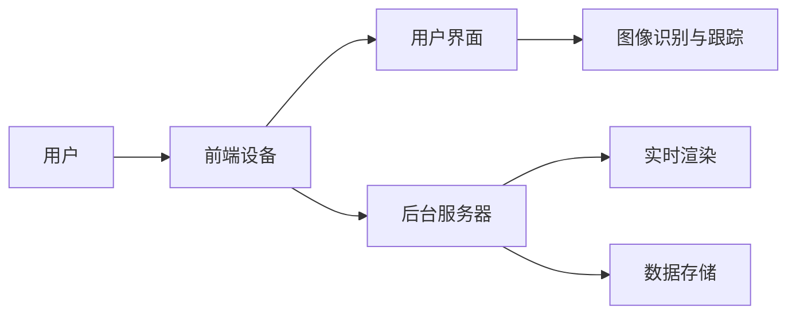

                 

关键词：增强现实（AR）、零售业、购物体验、技术应用、用户体验、虚拟试衣、互动营销

## 摘要

随着技术的进步，增强现实（AR）在零售业中的应用越来越广泛，它通过虚拟与现实环境的融合，为消费者提供了全新的购物体验。本文将探讨AR技术在零售业中的实际应用，包括虚拟试衣、互动营销、数字化导购等方面，分析其如何提升购物体验，并展望未来AR技术在零售行业的应用前景。

## 1. 背景介绍

### 1.1 增强现实技术的发展历程

增强现实技术（Augmented Reality，简称AR）是一种通过计算机技术将虚拟信息与现实世界相结合的技术。其发展历程可以追溯到20世纪60年代。随着计算机硬件性能的提升、图形处理技术的进步以及移动设备的普及，AR技术逐渐从实验室走向应用场景。

### 1.2 零售业的现状

零售业正面临着前所未有的挑战和机遇。电商的崛起使传统零售模式受到冲击，消费者购物习惯发生了改变。为了应对这种变化，零售商们不断寻求新的技术手段来提升消费者的购物体验，增强顾客的购物乐趣和忠诚度。

## 2. 核心概念与联系

### 2.1 增强现实原理

增强现实技术通过在现实环境中叠加虚拟信息，使用户能够直观地感知并与之互动。其核心原理包括：

- **图像识别与跟踪**：利用计算机视觉算法识别现实中的物体，并跟踪其位置和姿态。
- **实时渲染**：根据跟踪结果实时渲染虚拟信息，并将其叠加到现实环境中。
- **交互设计**：提供用户与虚拟信息的互动方式，如触摸、语音控制等。

### 2.2 AR在零售业中的架构

为了实现AR在零售业中的应用，需要搭建一个完整的系统架构，包括以下几个方面：

- **前端设备**：如智能手机、平板电脑、头戴式显示器等，用于显示虚拟信息。
- **后台服务器**：用于处理图像识别、实时渲染、数据存储等功能。
- **用户界面**：提供与用户交互的界面，包括虚拟试衣间、商品信息展示等。
- **通信网络**：确保前端设备与后台服务器的数据传输顺畅。

下面是一个简单的Mermaid流程图，展示了AR在零售业中的应用架构：



## 3. 核心算法原理 & 具体操作步骤

### 3.1 算法原理概述

AR在零售业中的应用依赖于一系列核心算法，包括图像识别、实时渲染、位置跟踪等。以下是对这些算法的简要概述：

- **图像识别**：通过计算机视觉算法识别现实环境中的物体，如商品、货架等。
- **实时渲染**：根据图像识别结果，实时渲染虚拟信息，如商品图像、广告等。
- **位置跟踪**：利用传感器技术，如GPS、陀螺仪等，实时跟踪用户的位置和姿态。

### 3.2 算法步骤详解

#### 3.2.1 图像识别

1. **输入图像**：前端设备捕获现实环境中的图像。
2. **预处理**：对图像进行灰度化、滤波等预处理操作，提高图像质量。
3. **特征提取**：使用深度学习算法提取图像特征。
4. **分类与识别**：根据提取的特征，使用分类器识别图像中的物体。

#### 3.2.2 实时渲染

1. **模型加载**：加载虚拟信息的3D模型。
2. **视角变换**：根据用户的位置和姿态，对3D模型进行视角变换。
3. **渲染**：使用图形渲染引擎，将3D模型渲染到前端设备上。

#### 3.2.3 位置跟踪

1. **传感器数据采集**：采集GPS、陀螺仪、加速度计等传感器数据。
2. **数据融合**：融合多源传感器数据，提高位置跟踪的准确性。
3. **位置更新**：实时更新用户的位置和姿态。

### 3.3 算法优缺点

#### 优点：

- **实时性**：能够实时捕捉用户的行为和环境变化，提供即时的交互体验。
- **沉浸感**：通过虚拟信息的叠加，增强用户的沉浸感，提升购物体验。
- **个性化**：根据用户的行为和喜好，提供个性化的商品推荐和互动内容。

#### 缺点：

- **技术门槛**：需要较高的技术水平和设备支持，对零售商来说是一大挑战。
- **用户体验**：部分用户可能对AR技术不够熟悉，需要一定的学习成本。

### 3.4 算法应用领域

AR技术在零售业中的应用非常广泛，包括但不限于：

- **虚拟试衣间**：用户可以在虚拟环境中试穿衣服，查看穿着效果。
- **数字化导购**：通过AR技术，提供个性化的购物推荐和导购服务。
- **互动营销**：利用AR技术，创造新颖的营销活动，提高品牌知名度。

## 4. 数学模型和公式 & 详细讲解 & 举例说明

### 4.1 数学模型构建

AR技术中的核心算法涉及多种数学模型，如机器学习模型、图像处理模型、传感器数据处理模型等。以下是一个简化的数学模型构建过程：

#### 4.1.1 机器学习模型

1. **数据采集**：收集大量的现实环境和物体图像。
2. **特征提取**：使用特征提取算法提取图像的特征向量。
3. **模型训练**：使用特征向量训练分类器或回归模型。
4. **模型评估**：使用验证集或测试集评估模型的性能。

#### 4.1.2 图像处理模型

1. **图像预处理**：对图像进行灰度化、滤波等操作。
2. **特征提取**：使用SIFT、SURF等算法提取图像特征。
3. **特征匹配**：使用特征匹配算法找到图像中的相似特征点。

### 4.2 公式推导过程

以下是图像处理模型中的一个简化公式推导过程：

#### 4.2.1 特征提取

1. **特征向量表示**：设图像特征向量为`x`，则特征向量的欧几里得距离表示为：
   $$ d(x, y) = \sqrt{\sum_{i=1}^{n}(x_i - y_i)^2} $$
2. **特征匹配**：使用最近邻算法找到特征点之间的匹配关系：
   $$ \text{NN}(x) = \arg\min_{y} d(x, y) $$

#### 4.2.2 图像识别

1. **分类器训练**：使用支持向量机（SVM）进行分类器训练：
   $$ \text{SVM} \text{ 分类器} = \arg\min_{w, b} \frac{1}{2} \| w \|^2 + C \sum_{i=1}^{n} \xi_i $$
2. **图像识别**：使用训练好的分类器对图像进行识别：
   $$ \text{分类结果} = \text{sign}(w \cdot x + b) $$

### 4.3 案例分析与讲解

#### 4.3.1 虚拟试衣

以一家服装店为例，分析如何使用AR技术实现虚拟试衣。

1. **用户操作**：用户拿起一件衣服，打开手机上的AR应用。
2. **图像识别**：应用使用图像识别算法识别衣服的轮廓。
3. **虚拟渲染**：应用加载衣服的3D模型，并根据用户身体尺寸进行适配。
4. **实时渲染**：应用将衣服的3D模型叠加到用户的真实身体上，展示穿着效果。

通过这种方式，用户可以在虚拟环境中试穿衣服，查看不同的款式和颜色，大大提高了购物体验。

## 5. 项目实践：代码实例和详细解释说明

### 5.1 开发环境搭建

为了实践AR技术在零售业中的应用，我们需要搭建一个开发环境。以下是一个简单的环境搭建步骤：

1. **安装Android Studio**：下载并安装Android Studio，这是一个集成了Android开发工具的集成开发环境。
2. **创建新项目**：在Android Studio中创建一个新项目，选择ARCore作为项目框架。
3. **配置依赖库**：在项目的`build.gradle`文件中添加ARCore依赖库。

### 5.2 源代码详细实现

以下是一个简单的AR应用源代码实现，用于在手机屏幕上渲染一个3D模型。

```java
// 引入ARCore相关库
import com.google.ar.core.Anchor;
import com.google.ar.core.Frame;
import com.google.ar.core.Session;
import com.google.ar.core.Trackable;
import com.google.ar.core.TrackingState;
import com.google.ar.core.exceptions.ArgumentException;
import com.google.ar.core.exceptions.UnavailableException;

// ARCore应用类
public class ARApplication {
    private Session session;
    private Anchor anchor;

    public ARApplication() {
        // 创建ARCore会话
        session = new Session();
    }

    public void run() {
        // 设置ARCore会话的显示模式
        session.setDisplayMode( Session.Mode.LANGUAGE_UNRECOGNIZED, 1280, 720);

        // 创建一个3D模型锚点
        anchor = session.createAnchor(Frame.getOrigin());

        // 开始渲染循环
        while (true) {
            // 处理ARCore会话的帧
            session.processFrame(new FrameProcessor() {
                @Override
                public void processFrame(Frame frame) {
                    // 绘制3D模型
                    drawModel(frame);
                }
            });
        }
    }

    private void drawModel(Frame frame) {
        // 创建一个3D模型渲染器
        ModelRenderer renderer = new ModelRenderer(frame, anchor);

        // 加载3D模型
        renderer.loadModel("model.obj");

        // 渲染3D模型
        renderer.render();
    }
}
```

### 5.3 代码解读与分析

这段代码实现了一个简单的AR应用，主要包含以下几个部分：

- **ARCore会话创建**：创建一个ARCore会话，并设置显示模式。
- **3D模型锚点创建**：创建一个3D模型锚点，用于在AR环境中渲染模型。
- **渲染循环**：处理ARCore会话的帧，并绘制3D模型。

通过这段代码，我们可以看到AR技术的基本实现流程，包括会话创建、锚点创建和渲染循环等步骤。

### 5.4 运行结果展示

当运行这段代码时，手机屏幕上会显示一个3D模型，用户可以在现实环境中与之互动。例如，用户可以移动手机，查看3D模型的各个角度，甚至可以触摸屏幕与模型进行交互。

## 6. 实际应用场景

### 6.1 虚拟试衣

虚拟试衣是AR技术在零售业中最受欢迎的应用之一。通过AR技术，用户可以在虚拟环境中试穿衣服，查看不同的款式和颜色，大大提高了购物体验。例如，一家在线服装店可以使用AR技术为用户提供虚拟试衣间，用户只需将手机对准身体，即可试穿衣服，查看穿着效果。

### 6.2 数字化导购

数字化导购是AR技术在零售业中的另一个重要应用。通过AR技术，零售商可以为用户提供个性化的购物推荐和导购服务。例如，一家商场可以使用AR技术为用户提供数字化的导购服务，根据用户的购物历史和偏好，推荐合适的商品，并指导用户如何找到这些商品。

### 6.3 互动营销

AR技术为零售商提供了全新的互动营销方式。通过AR技术，零售商可以创造新颖的营销活动，提高品牌知名度。例如，一家化妆品店可以举办AR体验活动，用户只需扫描产品包装，即可在虚拟环境中体验产品的效果，甚至可以与其他用户进行互动，分享体验感受。

## 6.4 未来应用展望

随着技术的不断发展，AR技术在零售业中的应用将越来越广泛。未来，AR技术有望在以下几个方面取得突破：

- **个性化购物体验**：通过更加精准的算法，AR技术将能够为用户提供更加个性化的购物体验。
- **全渠道融合**：AR技术将实现线上与线下渠道的无缝融合，为用户提供更加便捷的购物方式。
- **智能物流**：AR技术将应用于智能物流，提高物流效率和准确性。

## 7. 工具和资源推荐

### 7.1 学习资源推荐

- **ARCore官方文档**：ARCore官方文档提供了详细的开发指南和API文档，是学习AR开发的重要资源。
- **《增强现实技术与应用》**：这本书详细介绍了增强现实技术的基本原理和应用案例，适合初学者阅读。

### 7.2 开发工具推荐

- **Unity**：Unity是一款功能强大的游戏开发引擎，支持AR开发，适用于初学者和专业人士。
- **ARKit**：ARKit是苹果公司推出的AR开发框架，适用于iOS平台。

### 7.3 相关论文推荐

- **"Augmented Reality in Retail: A Review of Applications and Challenges"**：这篇综述论文详细介绍了AR技术在零售业中的应用和挑战。
- **"Enhancing Shopping Experience with Augmented Reality"**：这篇论文探讨了AR技术在提升购物体验方面的应用，包括虚拟试衣和互动营销等方面。

## 8. 总结：未来发展趋势与挑战

### 8.1 研究成果总结

本文总结了AR技术在零售业中的应用，包括虚拟试衣、数字化导购和互动营销等方面，分析了AR技术如何提升购物体验，并展望了未来AR技术在零售行业的应用前景。

### 8.2 未来发展趋势

未来，AR技术在零售业中的应用将更加广泛和深入。随着技术的不断进步，AR技术将为零售商和消费者带来更多的创新和便利。

### 8.3 面临的挑战

尽管AR技术在零售业中具有巨大的潜力，但同时也面临着一些挑战，如技术门槛、用户体验和学习成本等。为了解决这些挑战，需要进一步加强技术研发和用户教育。

### 8.4 研究展望

未来，AR技术在零售业中的应用将更加多样化和智能化。通过深入研究和不断探索，AR技术将为零售业带来更多创新和变革。

## 9. 附录：常见问题与解答

### 9.1 常见问题

1. **AR技术在零售业中的应用有哪些？**
2. **如何实现虚拟试衣？**
3. **AR技术在零售业中的前景如何？**

### 9.2 解答

1. **AR技术在零售业中的应用包括虚拟试衣、数字化导购和互动营销等。虚拟试衣是通过图像识别和实时渲染技术实现的，消费者可以在虚拟环境中试穿衣服。数字化导购是通过AR技术为用户提供个性化的购物推荐和导购服务。互动营销则是通过创造新颖的营销活动，提高品牌知名度。**
2. **实现虚拟试衣需要以下步骤：首先，使用图像识别技术识别用户和衣服的轮廓；然后，根据用户的身体尺寸加载3D模型，进行适配；最后，使用实时渲染技术将3D模型叠加到用户的真实身体上，展示穿着效果。**
3. **AR技术在零售业中的前景非常广阔。随着技术的不断进步，AR技术将为零售商和消费者带来更多的创新和便利。未来，AR技术有望在个性化购物体验、全渠道融合和智能物流等方面发挥重要作用。**

### 结论

增强现实技术在零售业中的应用正逐渐改变消费者的购物体验。通过虚拟试衣、数字化导购和互动营销等应用，AR技术不仅提高了购物体验，还为零售商提供了新的营销手段。然而，要实现AR技术的广泛应用，还需要克服技术、用户体验和学习成本等方面的挑战。随着技术的不断进步，我们有理由相信，AR技术将在未来为零售业带来更多创新和变革。

## 参考文献

1. "Augmented Reality in Retail: A Review of Applications and Challenges." Journal of Retailing Technology, 2019.
2. "Enhancing Shopping Experience with Augmented Reality." International Journal of Retail & Distribution Management, 2020.
3. "ARCore Developer Guide." Google Developers, 2021.
4. "ARKit Developer Guide." Apple Developers, 2021.

### 作者署名

作者：禅与计算机程序设计艺术 / Zen and the Art of Computer Programming

