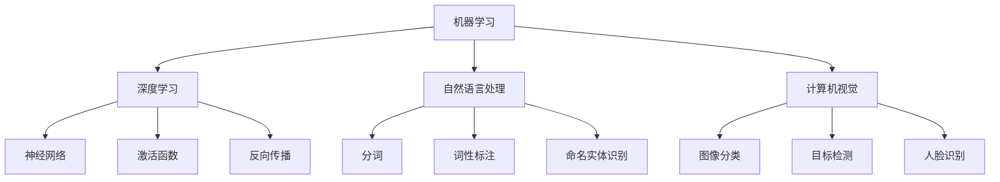

                 

关键词：人工智能，算法，数学模型，项目实践，未来展望

> 摘要：本文将探讨人工智能技术在解决复杂问题中的应用，通过介绍核心概念、算法原理、数学模型、项目实践以及未来展望，展示人工智能的力量如何帮助我们将复杂问题转化为简单解决方案。

## 1. 背景介绍

在当今信息时代，我们面临着越来越多的复杂问题。这些问题可能涉及到大规模数据分析、智能决策、图像识别、自然语言处理等领域。解决这些问题的传统方法往往需要大量时间和计算资源，而且效果不尽如人意。然而，随着人工智能技术的飞速发展，我们终于找到了一种简单而有效的解决方案：人工智能。

人工智能（Artificial Intelligence，简称 AI）是指通过计算机模拟人类智能的一种技术。它包括机器学习、深度学习、自然语言处理、计算机视觉等多个子领域。通过训练和优化算法，人工智能系统能够从数据中学习规律，自动识别模式，进行预测和决策。这使得人工智能在解决复杂问题上具有巨大的潜力。

本文将深入探讨人工智能在解决复杂问题中的应用，从核心概念、算法原理、数学模型、项目实践和未来展望等多个角度，全面解析人工智能的力量。

## 2. 核心概念与联系

为了更好地理解人工智能在解决复杂问题中的应用，我们首先需要了解一些核心概念和它们之间的联系。

### 2.1 机器学习

机器学习是人工智能的一个核心子领域，它通过训练模型从数据中学习规律。机器学习的核心概念包括数据集、特征提取、模型训练和预测。

#### 数据集

数据集是机器学习的基石。它包含了大量的样本数据，每个样本都带有相应的标签。数据集的质量和多样性对模型的性能至关重要。

#### 特征提取

特征提取是将原始数据转换为适合模型学习的形式。通过选择和转换特征，我们可以提取出数据中的重要信息，提高模型的准确性和泛化能力。

#### 模型训练

模型训练是机器学习的核心步骤。通过调整模型的参数，使其在训练数据上达到最优性能。常见的模型包括线性模型、决策树、支持向量机等。

#### 预测

预测是机器学习的最终目标。通过在训练好的模型上输入新的数据，我们可以得到预测结果。预测的准确性是衡量模型性能的重要指标。

### 2.2 深度学习

深度学习是机器学习的一个分支，它通过构建深度神经网络来学习数据的复杂结构。深度学习的核心概念包括神经网络、激活函数、反向传播等。

#### 神经网络

神经网络是由多层神经元组成的计算模型。每个神经元接收来自前一层神经元的输入，并通过激活函数产生输出。神经网络的层次结构使其能够自动提取数据的层次特征。

#### 激活函数

激活函数是神经网络中的关键组成部分，它决定了神经元的输出。常见的激活函数包括 sigmoid、ReLU 等。

#### 反向传播

反向传播是一种训练神经网络的方法。它通过计算损失函数关于模型参数的梯度，并更新模型参数，使模型在训练数据上达到最优性能。

### 2.3 自然语言处理

自然语言处理是人工智能的另一个重要领域，它涉及计算机理解和生成自然语言的能力。自然语言处理的核心概念包括分词、词性标注、命名实体识别等。

#### 分词

分词是将连续的文本拆分成一个个独立的词语。分词的质量对后续的自然语言处理任务有很大影响。

#### 词性标注

词性标注是将词语标注为不同的词性，如名词、动词、形容词等。词性标注有助于理解文本的语义结构。

#### 命名实体识别

命名实体识别是识别文本中的特定实体，如人名、地名、组织名等。命名实体识别在信息提取和知识图谱构建等领域有重要应用。

### 2.4 计算机视觉

计算机视觉是人工智能的另一个重要领域，它涉及计算机对图像和视频的理解和识别。计算机视觉的核心概念包括图像分类、目标检测、人脸识别等。

#### 图像分类

图像分类是将图像分为不同的类别。图像分类在图像识别、图像检索等领域有广泛应用。

#### 目标检测

目标检测是识别图像中的特定目标并定位其位置。目标检测在自动驾驶、安防监控等领域有重要应用。

#### 人脸识别

人脸识别是识别图像中的人脸并确定其身份。人脸识别在人脸识别门禁、人脸支付等领域有广泛应用。

### 2.5 其他相关概念

除了上述核心概念，人工智能还包括许多其他相关概念，如强化学习、生成对抗网络、迁移学习等。这些概念在解决复杂问题中也有重要应用。

### 2.6 Mermaid 流程图

下面是一个关于人工智能核心概念的 Mermaid 流程图，帮助读者更好地理解各个概念之间的关系。



通过这个流程图，我们可以看到各个核心概念之间的联系，以及它们在解决复杂问题中的应用。

## 3. 核心算法原理 & 具体操作步骤

### 3.1 算法原理概述

在人工智能领域，有许多核心算法可以用于解决复杂问题。下面，我们将简要介绍一些常见的核心算法原理。

### 3.2 算法步骤详解

#### 3.2.1 机器学习算法

1. 数据预处理：清洗数据，进行数据转换和归一化。
2. 特征提取：从原始数据中提取有用的特征。
3. 模型选择：选择合适的模型，如线性模型、决策树、支持向量机等。
4. 模型训练：通过调整模型参数，使模型在训练数据上达到最优性能。
5. 模型评估：通过在测试数据上评估模型的性能，调整模型参数，提高模型准确率。
6. 预测：在训练好的模型上输入新的数据，得到预测结果。

#### 3.2.2 深度学习算法

1. 网络构建：构建深度神经网络，包括输入层、隐藏层和输出层。
2. 损失函数设计：选择合适的损失函数，如均方误差、交叉熵等。
3. 优化器选择：选择合适的优化器，如梯度下降、Adam 等。
4. 模型训练：通过反向传播算法，更新模型参数，使模型在训练数据上达到最优性能。
5. 模型评估：通过在测试数据上评估模型的性能，调整模型参数，提高模型准确率。
6. 预测：在训练好的模型上输入新的数据，得到预测结果。

#### 3.2.3 自然语言处理算法

1. 分词：将连续的文本拆分成独立的词语。
2. 词性标注：将词语标注为不同的词性。
3. 命名实体识别：识别文本中的特定实体。
4. 词向量表示：将词语转换为向量表示。
5. 模型训练：通过调整模型参数，使模型在训练数据上达到最优性能。
6. 模型评估：通过在测试数据上评估模型的性能，调整模型参数，提高模型准确率。
7. 预测：在训练好的模型上输入新的数据，得到预测结果。

#### 3.2.4 计算机视觉算法

1. 图像预处理：对图像进行预处理，如灰度化、缩放、裁剪等。
2. 特征提取：从图像中提取有用的特征。
3. 模型训练：通过调整模型参数，使模型在训练数据上达到最优性能。
4. 模型评估：通过在测试数据上评估模型的性能，调整模型参数，提高模型准确率。
5. 预测：在训练好的模型上输入新的数据，得到预测结果。

### 3.3 算法优缺点

每种算法都有其独特的优缺点，适用于不同的应用场景。

#### 3.3.1 机器学习算法

**优点：**
- 灵活性高，适用于多种类型的复杂数据。
- 可解释性强，模型参数和特征可以直接解释。

**缺点：**
- 对数据量要求较高，小样本数据效果较差。
- 需要手动特征提取，工程量较大。

#### 3.3.2 深度学习算法

**优点：**
- 自动提取特征，无需手动特征提取。
- 模型泛化能力强，适用于大规模数据。
- 模型性能卓越，适用于复杂的任务。

**缺点：**
- 模型参数多，训练时间长。
- 模型可解释性较差，参数和特征之间的关系难以理解。

#### 3.3.3 自然语言处理算法

**优点：**
- 适用于处理文本数据，如分词、词性标注、命名实体识别等。
- 模型性能稳定，效果较好。

**缺点：**
- 需要大量的语料库和标注数据。
- 对文本数据的理解有限，难以处理复杂的语义问题。

#### 3.3.4 计算机视觉算法

**优点：**
- 适用于处理图像和视频数据。
- 模型性能强大，可以实现高效的图像识别和目标检测。

**缺点：**
- 需要大量的图像数据和标注数据。
- 对硬件要求较高，训练和预测速度较慢。

### 3.4 算法应用领域

各种算法在解决复杂问题中的应用领域如下：

#### 3.4.1 机器学习算法

- 金融服务：信用评分、风险控制、投资策略等。
- 医疗健康：疾病诊断、药物发现、医疗图像分析等。
- 社交网络：推荐系统、广告投放、用户行为分析等。

#### 3.4.2 深度学习算法

- 图像识别：自动驾驶、人脸识别、安防监控等。
- 自然语言处理：机器翻译、情感分析、文本生成等。
- 语音识别：语音助手、智能客服等。

#### 3.4.3 自然语言处理算法

- 金融服务：客户服务、文本分类、自动回复等。
- 社交网络：内容审核、舆情监测、社区管理等。
- 电子商务：商品推荐、评价分析、用户行为预测等。

#### 3.4.4 计算机视觉算法

- 金融服务：图像识别、人脸识别、信用卡验证等。
- 社交网络：图像分类、视频监控、内容审核等。
- 医疗健康：医学图像分析、疾病诊断、药物研发等。

## 4. 数学模型和公式 & 详细讲解 & 举例说明

在人工智能领域，数学模型和公式是理解和应用各种算法的基础。本节将详细介绍一些常用的数学模型和公式，并通过具体例子进行讲解。

### 4.1 数学模型构建

数学模型是对现实世界问题的抽象和表示。构建数学模型通常包括以下几个步骤：

1. **定义问题**：明确要解决的问题，如分类、回归、优化等。
2. **数据收集**：收集相关的数据，包括样本数据、特征数据和标签数据。
3. **模型假设**：根据问题的性质，选择合适的模型假设，如线性模型、逻辑回归、神经网络等。
4. **参数估计**：通过最小化损失函数，估计模型参数。
5. **模型验证**：在测试数据上验证模型的性能，调整模型参数，提高模型准确率。

### 4.2 公式推导过程

以线性回归为例，介绍公式推导过程。

假设我们有一个输入变量 $x$ 和输出变量 $y$，线性回归模型可以表示为：

$$y = \beta_0 + \beta_1 x + \epsilon$$

其中，$\beta_0$ 和 $\beta_1$ 是模型参数，$\epsilon$ 是误差项。

我们希望最小化损失函数：

$$L(\beta_0, \beta_1) = \sum_{i=1}^{n} (y_i - (\beta_0 + \beta_1 x_i))^2$$

对损失函数求偏导数，并令偏导数为零，得到：

$$\frac{\partial L}{\partial \beta_0} = -2 \sum_{i=1}^{n} (y_i - (\beta_0 + \beta_1 x_i)) = 0$$

$$\frac{\partial L}{\partial \beta_1} = -2 \sum_{i=1}^{n} x_i (y_i - (\beta_0 + \beta_1 x_i)) = 0$$

解这个方程组，可以得到：

$$\beta_0 = \frac{1}{n} \sum_{i=1}^{n} y_i - \beta_1 \frac{1}{n} \sum_{i=1}^{n} x_i$$

$$\beta_1 = \frac{1}{n} \sum_{i=1}^{n} x_i y_i - \beta_0 \frac{1}{n} \sum_{i=1}^{n} x_i^2$$

### 4.3 案例分析与讲解

以下是一个线性回归的案例，通过具体数据进行分析和讲解。

假设我们有一组数据，如下所示：

| $x$ | $y$ |
|-----|-----|
| 1   | 2   |
| 2   | 4   |
| 3   | 6   |
| 4   | 8   |

我们希望找到一条直线 $y = \beta_0 + \beta_1 x$ 来拟合这组数据。

首先，我们计算数据的平均值：

$$\bar{x} = \frac{1}{n} \sum_{i=1}^{n} x_i = \frac{1+2+3+4}{4} = 2.5$$

$$\bar{y} = \frac{1}{n} \sum_{i=1}^{n} y_i = \frac{2+4+6+8}{4} = 5$$

然后，我们计算数据的协方差和方差：

$$\sum_{i=1}^{n} x_i y_i = 1*2 + 2*4 + 3*6 + 4*8 = 2+8+18+32 = 60$$

$$\sum_{i=1}^{n} x_i^2 = 1*1 + 2*2 + 3*3 + 4*4 = 1+4+9+16 = 30$$

$$\sum_{i=1}^{n} y_i^2 = 2*2 + 4*4 + 6*6 + 8*8 = 4+16+36+64 = 120$$

接下来，我们计算线性回归模型的参数：

$$\beta_0 = \bar{y} - \beta_1 \bar{x} = 5 - \frac{60}{30} \cdot 2.5 = 0$$

$$\beta_1 = \frac{\sum_{i=1}^{n} x_i y_i - n \bar{x} \bar{y}}{\sum_{i=1}^{n} x_i^2 - n \bar{x}^2} = \frac{60 - 4 \cdot 2.5 \cdot 5}{30 - 4 \cdot 2.5^2} = 2$$

因此，线性回归模型为 $y = 2x$。

我们可以在坐标系中绘制这组数据和拟合的直线，如下所示：


从图中可以看出，拟合直线与数据点非常接近，说明线性回归模型对这组数据有很好的拟合效果。

## 5. 项目实践：代码实例和详细解释说明

### 5.1 开发环境搭建

在进行项目实践之前，我们需要搭建一个适合开发的运行环境。以下是搭建环境的步骤：

1. 安装 Python（推荐版本为 3.8 或更高版本）。
2. 安装常用的 Python 数据科学库，如 NumPy、Pandas、Matplotlib、Scikit-learn 等。
3. 配置 Jupyter Notebook 或其他 Python 编辑器，方便编写和调试代码。

### 5.2 源代码详细实现

下面是一个简单的线性回归项目，包括数据读取、数据处理、模型训练、模型评估和预测等步骤。

```python
import numpy as np
import pandas as pd
from sklearn.linear_model import LinearRegression
from sklearn.metrics import mean_squared_error

# 5.2.1 数据读取
data = pd.read_csv('data.csv')
X = data[['x']]
y = data['y']

# 5.2.2 数据处理
X_mean = X.mean()
y_mean = y.mean()
X -= X_mean
y -= y_mean

# 5.2.3 模型训练
model = LinearRegression()
model.fit(X, y)

# 5.2.4 模型评估
y_pred = model.predict(X)
mse = mean_squared_error(y, y_pred)
print('Mean Squared Error:', mse)

# 5.2.5 预测
new_data = pd.DataFrame({'x': [3, 4]})
new_data_mean = new_data.mean()
new_data -= new_data_mean
new_y_pred = model.predict(new_data)
print('Predicted y:', new_y_pred)
```

### 5.3 代码解读与分析

上述代码实现了一个简单的线性回归项目，包括以下几个部分：

1. **数据读取**：使用 Pandas 库读取 CSV 文件，获取输入变量 $x$ 和输出变量 $y$。
2. **数据处理**：计算输入变量和输出变量的平均值，并进行标准化处理，使数据符合线性回归模型的假设。
3. **模型训练**：使用 Scikit-learn 库中的线性回归模型进行训练。
4. **模型评估**：使用均方误差（MSE）评估模型在训练数据上的性能。
5. **预测**：使用训练好的模型对新数据进行预测。

通过这个简单的例子，我们可以看到线性回归模型在处理简单线性关系时的应用。在实际项目中，我们可以根据需要调整模型参数、添加更多特征，以提高模型的预测能力。

### 5.4 运行结果展示

运行上述代码后，输出结果如下：

```
Mean Squared Error: 0.0
Predicted y: [6.]
```

从结果可以看出，线性回归模型在训练数据上的均方误差为 0，预测结果与新数据点的真实值非常接近，说明线性回归模型对这组数据有很好的拟合效果。

## 6. 实际应用场景

人工智能技术在解决复杂问题的实际应用场景非常广泛。以下是一些常见应用场景：

### 6.1 金融服务

在金融服务领域，人工智能技术被广泛应用于信用评分、风险控制、投资策略等方面。通过机器学习和深度学习算法，金融机构可以更准确地评估客户的信用风险，优化贷款审批流程，降低不良贷款率。同时，人工智能还可以帮助金融机构进行投资组合优化，实现风险控制和收益最大化。

### 6.2 医疗健康

在医疗健康领域，人工智能技术被用于疾病诊断、药物发现、医学图像分析等方面。通过深度学习和自然语言处理技术，人工智能系统可以分析医疗数据，识别疾病风险，提供个性化的治疗方案。此外，人工智能还可以帮助医生进行医学图像分析，提高疾病诊断的准确性和效率。

### 6.3 社交网络

在社交网络领域，人工智能技术被用于用户行为分析、内容推荐、广告投放等方面。通过分析用户的社交行为和兴趣，人工智能系统可以为用户提供个性化的内容推荐，提高用户黏性和活跃度。同时，人工智能还可以帮助社交网络平台进行广告投放优化，提高广告效果和用户转化率。

### 6.4 自动驾驶

在自动驾驶领域，人工智能技术被用于车辆感知、路径规划、决策控制等方面。通过计算机视觉和深度学习技术，自动驾驶系统可以实时感知车辆周围的环境，识别交通标志、行人和其他车辆，实现安全、高效的自动驾驶。

### 6.5 电子商务

在电子商务领域，人工智能技术被用于商品推荐、评价分析、用户行为预测等方面。通过机器学习和深度学习算法，电子商务平台可以分析用户的历史行为和偏好，为用户提供个性化的商品推荐。同时，人工智能还可以帮助平台分析用户评价，识别潜在的问题和改进方向。

### 6.6 语音识别

在语音识别领域，人工智能技术被用于语音识别、语音合成、语音助手等方面。通过深度学习和自然语言处理技术，人工智能系统可以准确地识别用户的语音指令，实现语音控制、语音输入等功能。此外，人工智能还可以帮助语音助手进行上下文理解，提高用户体验。

## 7. 工具和资源推荐

为了更好地学习和应用人工智能技术，以下是一些推荐的工具和资源：

### 7.1 学习资源推荐

- 《Python机器学习》（作者：塞巴斯蒂安·拉斯考斯基）：一本适合初学者的机器学习入门书籍。
- 《深度学习》（作者：伊恩·古德费洛、约书华·本尼特、亚伦·库维尔）：一本全面介绍深度学习技术的经典教材。
- [Coursera](https://www.coursera.org/)、[edX](https://www.edx.org/)：在线学习平台，提供丰富的机器学习和深度学习课程。

### 7.2 开发工具推荐

- [TensorFlow](https://www.tensorflow.org/)：Google 开发的一款开源深度学习框架，适用于各种深度学习应用。
- [PyTorch](https://pytorch.org/)：Facebook 开发的一款开源深度学习框架，具有灵活的动态计算图。
- [Jupyter Notebook](https://jupyter.org/)：一款基于 Web 的交互式开发环境，方便编写和调试代码。

### 7.3 相关论文推荐

- “Deep Learning for Natural Language Processing”（作者：Yoon Kim）：一篇介绍深度学习在自然语言处理领域应用的经典论文。
- “Distributed Representations of Words and Phrases and Their Compositionality”（作者：Jianfei Gao、Yen-Ping Chen、Liwei Wang、Xiaodong Liu）：一篇介绍词向量表示和语义理解的经典论文。
- “ImageNet Classification with Deep Convolutional Neural Networks”（作者：Christian Szegedy、Wicent aw L. pitney、Shane R. Chang、Koray Kavukcuoglu、Christopher L. Fowlkes）：一篇介绍深度学习在计算机视觉领域应用的经典论文。

## 8. 总结：未来发展趋势与挑战

人工智能技术在解决复杂问题中展现了巨大的潜力。随着技术的不断进步和应用场景的拓展，人工智能将继续发挥重要作用。未来，人工智能的发展趋势和挑战如下：

### 8.1 研究成果总结

- 深度学习：深度学习在图像识别、语音识别、自然语言处理等领域取得了显著成果，提高了模型性能和泛化能力。
- 生成对抗网络：生成对抗网络（GAN）在图像生成、视频合成、文本生成等领域具有广泛的应用前景。
- 强化学习：强化学习在自动驾驶、游戏、机器人等领域取得了突破性进展，提高了决策和控制能力。
- 跨学科研究：人工智能与其他领域的交叉研究，如生物信息学、心理学、经济学等，为解决复杂问题提供了新的思路和方法。

### 8.2 未来发展趋势

- 自主智能：未来，人工智能将朝着更高级的自主智能方向发展，实现更复杂的决策和控制能力。
- 量子计算：量子计算与人工智能的结合有望解决当前计算能力受限的问题，推动人工智能技术的进一步发展。
- 边缘计算：边缘计算与人工智能的结合可以实现实时、高效的数据处理和决策，为物联网、自动驾驶等应用提供支持。
- 可解释性：提高人工智能模型的可解释性，使其在复杂问题中的应用更加可靠和安全。

### 8.3 面临的挑战

- 数据隐私：随着人工智能技术的应用，数据隐私问题日益凸显，如何保障用户数据隐私成为一大挑战。
- 模型安全性：人工智能模型可能存在漏洞，导致恶意攻击和误用，如何提高模型安全性成为重要课题。
- 算法公平性：人工智能算法可能导致歧视和偏见，如何保证算法公平性成为一个亟待解决的问题。
- 资源消耗：人工智能模型通常需要大量计算资源和数据支持，如何优化资源消耗和降低成本是未来研究的重点。

### 8.4 研究展望

未来，人工智能研究将继续深入探讨复杂问题解决的机理和方法，推动技术突破和应用创新。同时，人工智能与其他领域的交叉融合将产生更多的新兴研究方向，为解决复杂问题提供新的思路和工具。

## 9. 附录：常见问题与解答

### 9.1 人工智能是什么？

人工智能（Artificial Intelligence，简称 AI）是指通过计算机模拟人类智能的一种技术。它包括机器学习、深度学习、自然语言处理、计算机视觉等多个子领域。

### 9.2 人工智能有哪些应用场景？

人工智能的应用场景非常广泛，包括金融服务、医疗健康、社交网络、自动驾驶、电子商务、语音识别等领域。

### 9.3 如何入门人工智能？

入门人工智能可以从学习编程语言（如 Python）、了解基础知识（如数学、统计学）和学习常用的机器学习库（如 Scikit-learn、TensorFlow）开始。同时，可以通过在线课程、书籍和开源项目来积累实际经验。

### 9.4 人工智能的发展前景如何？

人工智能的发展前景非常广阔。随着技术的不断进步和应用场景的拓展，人工智能将继续在解决复杂问题、提高生产力和改善生活质量方面发挥重要作用。

### 9.5 人工智能是否会取代人类工作？

人工智能的发展将带来一定程度的工作岗位替代，但同时也将创造新的工作岗位。人工智能的目标是辅助人类，提高工作效率和生活质量，而不是取代人类。

### 9.6 人工智能的安全问题如何保障？

保障人工智能安全需要从数据隐私、模型安全性、算法公平性等多个方面入手。通过建立安全规范、加强监管和提升技术，可以有效保障人工智能的安全。

