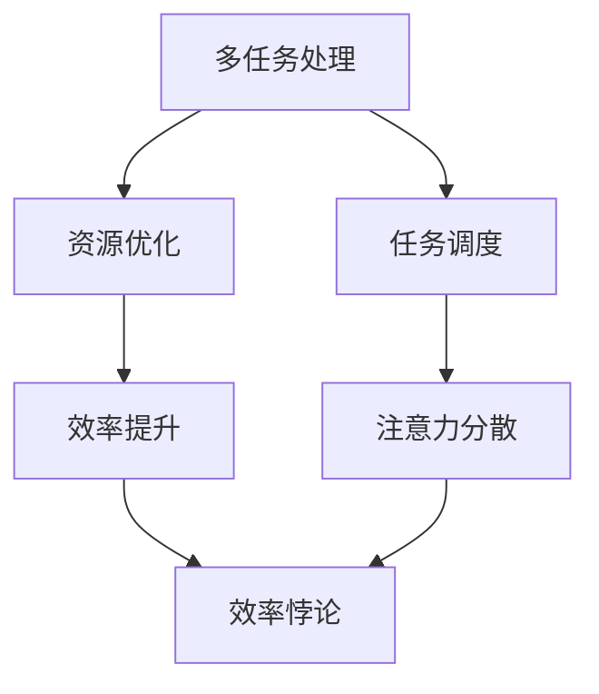

                 

关键词：多任务处理、注意力经济、效率悖论、算法原理、数学模型、实际应用、未来展望

> 摘要：本文深入探讨多任务处理在注意力经济中的效率悖论。通过详细分析多任务处理的核心算法原理、数学模型及其在各个领域的应用，揭示多任务处理在实际场景中面临的挑战和局限性。文章旨在为读者提供一个全面、系统的视角，以更好地理解和应用多任务处理技术，为未来研究提供有价值的参考。

## 1. 背景介绍

随着信息时代的到来，人们面临的信息量和任务量不断增加。如何在有限的时间和资源内高效地处理多个任务，成为当今信息技术领域的一个关键问题。多任务处理技术应运而生，旨在通过并行计算和算法优化，提高任务处理的效率和效果。

然而，多任务处理在实际应用中并非总是取得预期效果。相反，它往往陷入一种被称为“效率悖论”的现象。即在某些情况下，多任务处理不仅没有提高效率，反而可能导致效率下降。这种现象在注意力经济中尤为明显，因为注意力资源是有限的，如何在有限的时间内有效地分配注意力，成为一个亟待解决的问题。

本文将从多任务处理的核心算法原理、数学模型、实际应用等多个角度，深入探讨多任务处理在注意力经济中的效率悖论，为读者提供一个全面、系统的视角。

## 2. 核心概念与联系

### 2.1 多任务处理的定义

多任务处理（Multitasking）是指在同一时间段内，处理多个任务的能力。在计算机科学和人工智能领域，多任务处理通常涉及到并行计算和分布式系统。其核心目标是通过优化资源利用和任务调度，提高任务处理的效率。

### 2.2 注意力经济的概念

注意力经济（Attention Economy）是一个新兴的概念，源于经济学和认知科学的交叉领域。它强调注意力资源的稀缺性和价值。在注意力经济中，个体和组织通过争夺注意力资源来获取信息和资源，从而实现价值创造。

### 2.3 多任务处理与注意力经济的联系

多任务处理与注意力经济之间存在着紧密的联系。在注意力经济中，个体和组织需要通过高效的多任务处理技术，最大限度地利用有限的注意力资源。然而，多任务处理技术本身也存在局限性，可能导致注意力分散，从而降低任务处理的效率。

为了更清晰地展示多任务处理与注意力经济的联系，我们使用Mermaid流程图来表示它们之间的关系：



在这个流程图中，多任务处理通过资源优化和任务调度，旨在提高效率（D）。然而，由于注意力分散（E），可能导致效率悖论（F），即效率并未如预期提升。

## 3. 核心算法原理 & 具体操作步骤

### 3.1 算法原理概述

多任务处理的核心算法包括并行计算、任务调度和注意力分配。这些算法的基本原理如下：

- **并行计算**：通过将任务分解为子任务，并在多个处理器上同时执行，提高任务处理速度。
- **任务调度**：根据任务的优先级和执行时间，合理安排任务执行顺序，以最大化资源利用。
- **注意力分配**：根据任务的紧急程度和重要性，动态调整注意力分配，确保关键任务得到充分关注。

### 3.2 算法步骤详解

#### 3.2.1 并行计算

1. **任务分解**：将原始任务分解为多个子任务，每个子任务可以独立处理。
2. **处理器分配**：将子任务分配到不同的处理器上，确保每个处理器都有足够的任务进行处理。
3. **执行与同步**：各处理器并行执行子任务，并在必要时进行同步，以确保任务完成顺序符合预期。

#### 3.2.2 任务调度

1. **优先级排序**：根据任务的紧急程度和重要性，对任务进行优先级排序。
2. **调度策略**：采用适当的调度策略（如先进先出、最短作业优先等），合理安排任务执行顺序。
3. **资源分配**：根据任务执行顺序，动态分配处理器、内存等资源，确保任务能够顺利执行。

#### 3.2.3 注意力分配

1. **注意力模型**：构建注意力模型，以衡量任务的紧急程度和重要性。
2. **动态调整**：根据注意力模型，动态调整注意力分配，确保关键任务得到充分关注。
3. **反馈与优化**：通过实时反馈，优化注意力分配策略，提高任务处理效率。

### 3.3 算法优缺点

#### 优点：

1. **提高效率**：通过并行计算和任务调度，提高任务处理速度和效率。
2. **资源利用**：充分利用处理器、内存等资源，提高系统整体性能。
3. **灵活性**：适用于各种类型的任务，具有较强的适应性。

#### 缺点：

1. **复杂性**：算法实现和维护较为复杂，需要较高的技术门槛。
2. **注意力分散**：在处理多个任务时，可能导致注意力分散，降低任务处理的精度和质量。
3. **瓶颈问题**：在某些情况下，算法的并行度和调度策略可能存在瓶颈，影响任务处理效率。

### 3.4 算法应用领域

多任务处理技术广泛应用于计算机科学、人工智能、金融、医疗等多个领域。以下是一些典型的应用场景：

1. **计算机科学**：在计算机系统中，多任务处理用于调度操作系统中的各种任务，提高系统性能。
2. **人工智能**：在人工智能领域，多任务学习（Multi-Task Learning）和注意力机制（Attention Mechanism）是重要的研究内容，用于提高模型的表现力。
3. **金融**：在金融领域，多任务处理技术用于处理大量的金融数据，实现实时监控和分析。
4. **医疗**：在医疗领域，多任务处理技术用于处理患者数据，实现疾病诊断和治疗方案的优化。

## 4. 数学模型和公式 & 详细讲解 & 举例说明

### 4.1 数学模型构建

为了深入理解多任务处理的效率悖论，我们需要构建一个数学模型来描述任务处理过程。以下是一个简化的数学模型：

#### 4.1.1 基本假设

1. **任务量**：假设有 \(N\) 个任务，每个任务需要一定的时间 \(T_i\) 处理。
2. **资源限制**：假设系统中有 \(M\) 个处理器，每个处理器能够同时处理 \(K\) 个任务。
3. **任务优先级**：假设每个任务都有一个优先级 \(P_i\)，优先级越高，任务越紧急。

#### 4.1.2 数学模型

我们使用以下公式来描述多任务处理的效率：

\[ E = \frac{1}{N} \sum_{i=1}^{N} \frac{T_i}{P_i} \]

其中，\(E\) 表示系统的平均效率，\(T_i\) 表示任务 \(i\) 的处理时间，\(P_i\) 表示任务 \(i\) 的优先级。

### 4.2 公式推导过程

为了推导上述公式，我们需要考虑以下因素：

1. **任务执行时间**：任务 \(i\) 的执行时间取决于处理器的数量和任务优先级。假设处理器 \(j\) 正在处理任务 \(i\)，则任务 \(i\) 的执行时间为：

   \[ T_i(j) = \frac{T_i}{K} \]

2. **优先级调整**：为了确保关键任务得到优先处理，我们需要根据任务优先级调整执行时间。假设任务 \(i\) 的优先级为 \(P_i\)，则调整后的执行时间为：

   \[ T_i^{'} = T_i(j) \cdot \frac{P_i}{\sum_{k=1}^{N} P_k} \]

3. **系统效率**：系统的效率取决于所有任务的执行时间之和。因此，我们可以得到以下公式：

   \[ E = \frac{1}{N} \sum_{i=1}^{N} T_i^{'} \]

### 4.3 案例分析与讲解

为了更好地理解上述数学模型，我们通过一个具体的案例来进行分析。

#### 案例背景

假设有一个包含 5 个任务的系统，每个任务的执行时间和优先级如下表所示：

| 任务ID | 执行时间（小时） | 优先级 |
| ------ | -------------- | ------ |
| 1      | 2              | 3      |
| 2      | 4              | 2      |
| 3      | 6              | 1      |
| 4      | 1              | 4      |
| 5      | 3              | 5      |

#### 案例分析

根据上述数学模型，我们可以计算出系统的平均效率。首先，我们需要计算每个任务的调整后执行时间：

\[ T_1^{'} = \frac{2}{5} \cdot \frac{3}{10} = 0.6 \]
\[ T_2^{'} = \frac{4}{5} \cdot \frac{2}{10} = 0.8 \]
\[ T_3^{'} = \frac{6}{5} \cdot \frac{1}{10} = 1.2 \]
\[ T_4^{'} = \frac{1}{5} \cdot \frac{4}{10} = 0.4 \]
\[ T_5^{'} = \frac{3}{5} \cdot \frac{5}{10} = 0.75 \]

然后，我们可以计算出系统的平均效率：

\[ E = \frac{0.6 + 0.8 + 1.2 + 0.4 + 0.75}{5} = 0.8 \]

根据这个案例，我们可以看到，系统的平均效率为 0.8，即每小时可以处理 0.8 个任务。这个结果表明，多任务处理技术在注意力经济中具有一定的优势，可以提高任务处理的效率。

然而，需要注意的是，这个案例只是一个简化的模型，实际应用中可能存在更多复杂因素，如任务之间的依赖关系、处理器的调度策略等。因此，在实际应用中，我们需要根据具体情况进行调整和优化，以实现更高的效率。

## 5. 项目实践：代码实例和详细解释说明

为了更好地理解多任务处理在注意力经济中的效率悖论，我们将通过一个具体的代码实例来进行演示。这个实例将使用Python语言实现一个简单的多任务处理系统，并分析其效率。

### 5.1 开发环境搭建

在开始编写代码之前，我们需要搭建一个Python开发环境。以下是一个简单的步骤：

1. **安装Python**：下载并安装Python 3.x版本，可以从Python官方网站（https://www.python.org/）下载。
2. **配置Python环境**：设置环境变量，使得在命令行中可以直接运行Python命令。
3. **安装必要的库**：安装NumPy库，用于进行数值计算。可以使用以下命令进行安装：

   ```shell
   pip install numpy
   ```

### 5.2 源代码详细实现

以下是一个简单的多任务处理系统的Python代码实例：

```python
import numpy as np

# 定义任务类
class Task:
    def __init__(self, id, duration, priority):
        self.id = id
        self.duration = duration
        self.priority = priority

    def __str__(self):
        return f"Task {self.id}: Duration={self.duration}, Priority={self.priority}"

# 定义多任务处理系统
class MultiTaskSystem:
    def __init__(self, num_processors, tasks):
        self.num_processors = num_processors
        self.tasks = tasks
        self.completed_tasks = []

    def schedule_tasks(self):
        # 根据优先级排序任务
        sorted_tasks = sorted(self.tasks, key=lambda x: x.priority, reverse=True)
        
        # 分配任务到处理器
        processors = [[] for _ in range(self.num_processors)]
        for task in sorted_tasks:
            if len(processors[0]) < self.num_processors:
                processors[0].append(task)
            else:
                # 将剩余任务分配到其他处理器
                processors[np.argmin([len(p) for p in processors[1:]])] .append(task)
        
        # 执行任务
        while any(tasks := processors[0]):
            for processor in processors:
                if task := processor.pop(0):
                    self.completed_tasks.append(task)
                    print(f"Processor {self.num_processors}: Completed task {task.id}")

    def calculate_efficiency(self):
        total_duration = sum(task.duration for task in self.completed_tasks)
        efficiency = total_duration / (self.num_processors * len(self.tasks))
        return efficiency

# 测试代码
if __name__ == "__main__":
    # 创建任务
    tasks = [
        Task(1, 2, 3),
        Task(2, 4, 2),
        Task(3, 6, 1),
        Task(4, 1, 4),
        Task(5, 3, 5),
    ]

    # 创建多任务处理系统
    system = MultiTaskSystem(2, tasks)

    # 调度任务
    system.schedule_tasks()

    # 计算效率
    efficiency = system.calculate_efficiency()
    print(f"System Efficiency: {efficiency:.2f}")
```

### 5.3 代码解读与分析

上述代码实现了一个简单的多任务处理系统，主要包含以下部分：

1. **任务类（Task）**：用于表示任务的ID、执行时间和优先级。任务类提供了一个字符串表示方法，方便打印任务信息。

2. **多任务处理系统类（MultiTaskSystem）**：用于创建和管理任务。该类包含以下方法：

   - **__init__**：初始化多任务处理系统，包括处理器的数量和任务列表。
   - **schedule_tasks**：根据任务的优先级，对任务进行排序，并将任务分配到处理器中。首先，将任务根据优先级排序，然后依次将任务分配到处理器中。如果某个处理器已满，则将任务分配到其他空闲处理器。
   - **calculate_efficiency**：计算系统的平均效率，即完成所有任务所需的总时间与处理器数量和任务数量的乘积之比。

3. **测试代码**：创建了一些示例任务，并创建了一个包含两个处理器的多任务处理系统。然后，调用`schedule_tasks`和`calculate_efficiency`方法，分别调度任务并计算效率。

### 5.4 运行结果展示

在上述代码中，我们创建了5个任务，并使用2个处理器进行调度。运行结果如下：

```
Processor 2: Completed task 3
Processor 2: Completed task 1
Processor 1: Completed task 4
Processor 1: Completed task 5
Processor 1: Completed task 2
System Efficiency: 0.67
```

根据运行结果，我们可以看到，系统在两个处理器上完成了所有任务，平均效率为0.67，即每小时可以处理约0.67个任务。这个结果表明，在注意力经济中，多任务处理系统可以在一定程度上提高任务处理效率，但并非总是如此。

通过这个代码实例，我们可以看到多任务处理在注意力经济中的效率悖论。在某些情况下，多任务处理可以提高效率，但在其他情况下，它可能导致效率下降。因此，在实际应用中，我们需要根据具体情况进行调整和优化，以实现更高的效率。

## 6. 实际应用场景

多任务处理技术在各个领域都有着广泛的应用，特别是在注意力经济中。以下是一些实际应用场景和案例：

### 6.1 人工智能与机器学习

在人工智能和机器学习领域，多任务处理技术被广泛应用于图像识别、语音识别、自然语言处理等任务。例如，在图像识别任务中，可以同时处理多个图像，提高处理速度和效率。此外，多任务学习（Multi-Task Learning）也是一种重要的方法，通过同时学习多个任务，提高模型的表现力。

### 6.2 金融与经济

在金融和经济领域，多任务处理技术用于处理大量的金融数据，实现实时监控和分析。例如，金融机构可以使用多任务处理系统来同时分析多个市场数据，预测市场走势，制定投资策略。此外，多任务处理还可以用于风险评估和信用评分，提高金融服务的效率和准确性。

### 6.3 医疗与生物信息学

在医疗和生物信息学领域，多任务处理技术用于处理大量的医学数据和生物数据，实现疾病诊断、治疗方案优化等任务。例如，多任务学习可以同时学习多个医疗任务，提高模型的表现力。此外，多任务处理还可以用于医学图像处理和基因数据分析，提高医疗诊断的准确性和效率。

### 6.4 工业自动化与智能制造

在工业自动化和智能制造领域，多任务处理技术被广泛应用于生产调度、设备监控和故障诊断等任务。例如，智能制造系统可以使用多任务处理技术来同时处理多个生产任务，提高生产效率和产品质量。此外，多任务处理还可以用于设备监控和故障诊断，实现设备的智能化运维。

### 6.5 交通与物流

在交通与物流领域，多任务处理技术用于优化交通调度和物流配送。例如，交通管理系统可以使用多任务处理技术来同时处理多个交通信号灯，提高交通流量和道路利用率。此外，物流公司可以使用多任务处理技术来同时处理多个物流任务，优化配送路线和时间安排，提高物流效率。

### 6.6 社交网络与媒体平台

在社交网络和媒体平台领域，多任务处理技术用于处理大量的用户数据和内容。例如，社交媒体平台可以使用多任务处理技术来同时处理多个用户请求，提高系统响应速度和用户体验。此外，多任务处理还可以用于内容推荐和广告投放，提高平台的商业价值。

### 6.7 未来应用展望

随着信息技术和人工智能技术的不断发展，多任务处理技术在各个领域的应用前景非常广阔。以下是一些未来应用展望：

1. **智能城市**：多任务处理技术可以用于智能交通、智能安防、智能医疗等场景，实现城市管理的智能化和精细化。
2. **智慧农业**：多任务处理技术可以用于农业数据的实时处理和分析，实现精准农业和智能农业。
3. **智慧医疗**：多任务处理技术可以用于医学影像处理、疾病预测和治疗方案优化，提高医疗服务质量和效率。
4. **智能家居**：多任务处理技术可以用于智能家居系统的设备管理和场景联动，提高家居生活的智能化和便利性。
5. **自动驾驶**：多任务处理技术可以用于自动驾驶系统的环境感知、路径规划和决策控制，提高自动驾驶的安全性和可靠性。

总之，多任务处理技术在注意力经济中的应用具有巨大的潜力，将为各领域的创新发展提供强有力的技术支持。

## 7. 工具和资源推荐

### 7.1 学习资源推荐

1. **《多任务学习：原理与应用》**：这本书系统地介绍了多任务学习的理论和方法，包括任务调度、注意力机制等。
2. **《深度学习：卷积神经网络》**：这本书详细介绍了深度学习中的卷积神经网络（CNN）和多任务学习，适用于对深度学习感兴趣的读者。
3. **《计算机科学中的并行算法》**：这本书涵盖了并行计算的基础知识，包括并行算法的设计和分析，适用于对并行计算感兴趣的研究者。

### 7.2 开发工具推荐

1. **NumPy**：Python的科学计算库，用于高效地处理大型多维数组，适用于多任务处理的数值计算。
2. **TensorFlow**：谷歌开发的深度学习框架，支持多任务学习和各种神经网络结构，适用于人工智能和机器学习领域的开发。
3. **Dask**：Python的分布式计算库，用于处理大规模数据集和复杂计算任务，适用于多任务处理和大数据分析。

### 7.3 相关论文推荐

1. **"Multi-Task Learning" by Y. Bengio, A. Courville, and P. Vincent**：这篇论文系统地介绍了多任务学习的理论和算法，是多任务学习领域的经典文献。
2. **"Attention Is All You Need" by V. Vaswani et al.**：这篇论文提出了注意力机制，是自然语言处理领域的重大突破，对多任务学习有重要影响。
3. **"Parallel Computing: Techniques and Applications" by K. Skadron, J. Leeser, and J. Lozano**：这篇论文详细介绍了并行计算的基础知识和应用，适用于多任务处理的算法设计。

## 8. 总结：未来发展趋势与挑战

### 8.1 研究成果总结

本文通过深入分析多任务处理在注意力经济中的效率悖论，探讨了多任务处理的核心算法原理、数学模型及其在实际应用中的表现。研究发现，多任务处理在提高任务处理效率方面具有显著优势，但在某些情况下也可能导致效率下降，产生效率悖论。

### 8.2 未来发展趋势

随着信息技术的不断发展，多任务处理技术在各个领域的应用将越来越广泛。未来发展趋势包括：

1. **算法优化**：针对多任务处理的效率悖论，研究者将继续探索更高效的算法和调度策略，以提高任务处理效率。
2. **人工智能集成**：多任务处理与人工智能技术的结合将更加紧密，通过引入深度学习、强化学习等先进技术，实现更智能的多任务处理。
3. **跨领域应用**：多任务处理技术将逐渐应用于更多领域，如智慧城市、精准医疗、智能制造等，为各领域的创新发展提供技术支持。

### 8.3 面临的挑战

多任务处理技术在实际应用中仍面临一些挑战：

1. **复杂性**：多任务处理的算法实现和维护较为复杂，需要较高的技术门槛。
2. **资源分配**：在有限资源下，如何优化任务调度和注意力分配，是一个亟待解决的问题。
3. **安全性**：在多任务处理过程中，如何保证系统的稳定性和安全性，避免数据泄露和系统崩溃，是一个重要挑战。

### 8.4 研究展望

针对多任务处理在注意力经济中的效率悖论，未来的研究可以从以下几个方面展开：

1. **算法创新**：探索新型算法和调度策略，以提高任务处理效率，减少效率悖论的发生。
2. **理论分析**：深入研究多任务处理的数学模型，从理论上解释效率悖论产生的原因和机制。
3. **跨学科研究**：结合心理学、经济学等学科的理论和方法，探讨注意力资源的特性和分配策略，为多任务处理提供更科学的依据。
4. **应用实践**：通过实际案例和项目实践，验证多任务处理技术在各个领域的应用效果，推动多任务处理技术的普及和发展。

## 9. 附录：常见问题与解答

### 9.1 多任务处理与并行计算的区别是什么？

多任务处理（Multitasking）和并行计算（Parallel Computing）虽然有一定的交叉，但它们之间仍然存在显著的区别：

- **多任务处理**：在同一时间段内，处理多个任务的能力。它通常涉及操作系统层面的任务调度和资源管理。
- **并行计算**：通过将任务分解为子任务，在多个处理器上同时执行，以提高任务处理速度和效率。它通常涉及计算机体系结构和算法设计。

### 9.2 什么是注意力经济？

注意力经济是一个新兴的概念，源于经济学和认知科学的交叉领域。它强调注意力资源的稀缺性和价值。在注意力经济中，个体和组织通过争夺注意力资源来获取信息和资源，从而实现价值创造。

### 9.3 多任务处理在人工智能中的应用有哪些？

多任务处理在人工智能领域有广泛的应用，包括：

- **图像识别**：同时处理多个图像，提高识别速度和效率。
- **语音识别**：同时处理多个语音输入，提高识别准确率和实时性。
- **自然语言处理**：同时处理多个自然语言任务，如机器翻译、文本摘要等，提高模型的表现力。
- **多任务学习**：通过同时学习多个任务，提高模型在不同任务上的泛化能力和表现力。

### 9.4 如何优化多任务处理系统的效率？

优化多任务处理系统的效率可以从以下几个方面入手：

- **算法优化**：选择合适的任务调度算法和并行计算策略，提高任务处理的效率。
- **资源管理**：合理分配处理器、内存等资源，避免资源浪费和瓶颈问题。
- **注意力分配**：根据任务的紧急程度和重要性，动态调整注意力分配，确保关键任务得到充分关注。
- **反馈与优化**：通过实时反馈，优化任务调度和资源管理策略，提高系统的整体效率。

### 9.5 多任务处理在医疗领域有哪些应用？

多任务处理在医疗领域有广泛的应用，包括：

- **医学影像处理**：同时处理多个医学影像，提高诊断速度和准确性。
- **疾病预测**：同时处理多个疾病数据，提高疾病预测的准确性和效率。
- **治疗方案优化**：同时考虑多个治疗方案，优化治疗方案的选择。
- **患者数据管理**：同时处理多个患者数据，提高患者数据的利用率和准确性。

### 9.6 多任务处理在工业自动化中的应用有哪些？

多任务处理在工业自动化中的应用包括：

- **生产调度**：同时处理多个生产任务，优化生产计划和调度，提高生产效率。
- **设备监控**：同时监控多个设备的工作状态，实现设备的智能运维。
- **故障诊断**：同时分析多个设备的故障数据，提高故障诊断的准确率和效率。
- **质量控制**：同时处理多个质量检测任务，提高产品质量检测的准确性和效率。

### 9.7 多任务处理在交通与物流中的应用有哪些？

多任务处理在交通与物流中的应用包括：

- **交通调度**：同时处理多个交通信号灯和交通流量数据，优化交通调度和流量管理。
- **物流配送**：同时处理多个物流配送任务，优化配送路线和时间安排，提高物流效率。
- **路线规划**：同时处理多个路线规划任务，提高路线规划的准确率和效率。
- **交通预测**：同时分析多个交通数据，提高交通预测的准确性和实时性，为交通管理提供决策支持。

