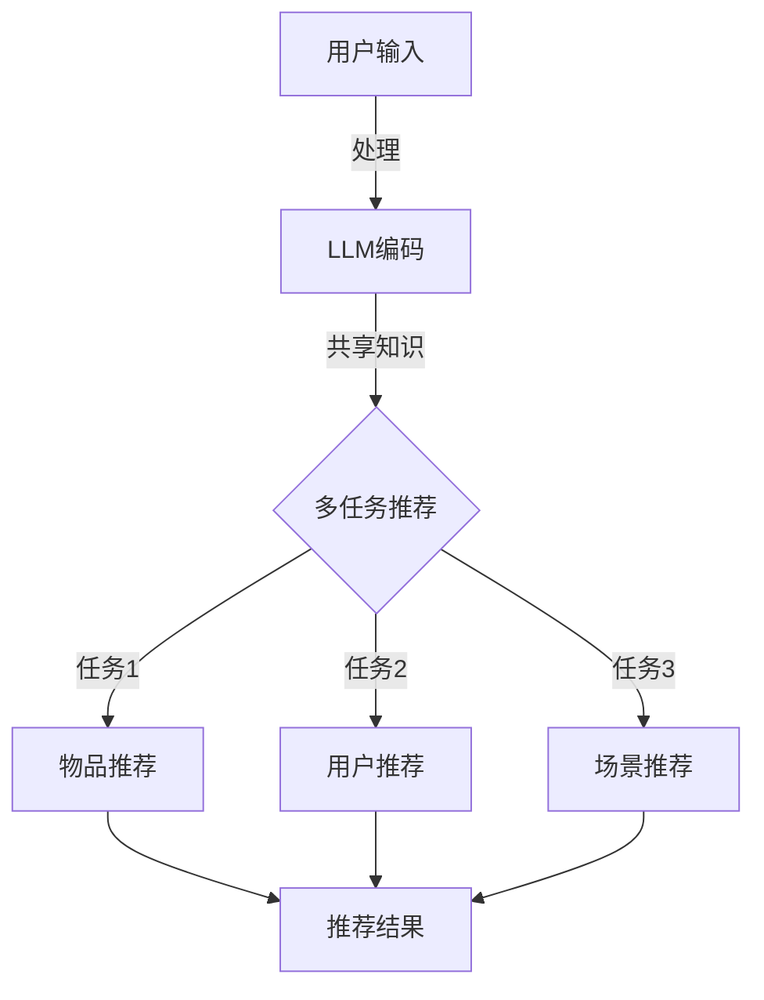

                 

关键词：多任务推荐、LLM、框架、算法、数学模型、实践、应用场景

> 摘要：本文深入探讨了多任务推荐系统中的核心问题，并提出了一种基于大型语言模型（LLM）的统一框架。通过详细介绍核心概念、算法原理、数学模型以及实践应用，本文旨在为研究人员和开发者提供一种全新的理解和解决多任务推荐问题的思路。

## 1. 背景介绍

在当今信息爆炸的时代，个性化推荐系统已经成为我们日常生活中不可或缺的一部分。从电商平台到社交媒体，从音乐流媒体到新闻资讯，推荐系统无处不在。传统的推荐系统通常基于单一任务，如物品推荐或用户推荐。然而，随着用户需求的多样化和数据复杂度的增加，单一任务推荐系统逐渐暴露出了一些局限性。

多任务推荐系统（Multi-Task Recommendation System）作为一种新的推荐系统架构，旨在同时处理多个任务，从而提高推荐的质量和效率。例如，一个多任务推荐系统可以同时考虑用户对多个不同类型物品的偏好，或者同时推荐多个不同类型的物品。多任务推荐系统的重要性不言而喻，它能够更好地满足用户多样化的需求，提升用户体验。

近年来，随着深度学习技术的飞速发展，特别是大型语言模型（Large Language Model，简称LLM）的出现，为多任务推荐系统的研究带来了新的机遇。LLM是一种能够处理大规模文本数据的深度学习模型，它具有强大的语义理解能力和生成能力，可以在多个任务之间进行灵活的知识共享和迁移学习。

本文将围绕多任务推荐系统展开讨论，提出一种基于LLM的统一框架。通过深入探讨核心概念、算法原理、数学模型以及实践应用，本文旨在为研究人员和开发者提供一种全新的理解和解决多任务推荐问题的思路。

## 2. 核心概念与联系

在深入探讨多任务推荐系统的实现之前，我们需要明确几个核心概念，这些概念构成了多任务推荐系统的理论基础。

### 2.1 多任务推荐系统的定义

多任务推荐系统是一种能够同时处理多个推荐任务的系统，它可以从多个角度对用户进行推荐，从而提高推荐的多样性和质量。在多任务推荐系统中，每个任务都可以视为一个独立的推荐问题，例如：

- 物品推荐：为用户推荐他们可能感兴趣的物品。
- 用户推荐：为用户推荐可能喜欢他们的其他用户。
- 场景推荐：根据用户所处的环境和情境进行推荐。

### 2.2 大型语言模型（LLM）

大型语言模型（LLM）是一种基于深度学习的语言处理模型，它具有处理大规模文本数据的能力，能够捕捉到文本中的复杂语义和语境信息。LLM的核心是神经网络架构，如Transformer，它通过自注意力机制（Self-Attention Mechanism）对输入的文本进行编码，从而生成具有丰富语义信息的向量表示。

### 2.3 多任务学习的定义

多任务学习（Multi-Task Learning，简称MTL）是一种机器学习方法，旨在通过同时解决多个相关任务来提高模型的性能。在多任务学习中，模型需要同时学习多个任务的特征表示，并通过共享表示层来提高各个任务的性能。

### 2.4 多任务推荐系统的关系

多任务推荐系统与多任务学习和LLM之间存在紧密的联系。LLM为多任务推荐系统提供了一种强大的技术支持，使得模型可以在多个任务之间共享知识和迁移学习。而多任务学习则为多任务推荐系统的实现提供了理论基础，使得模型能够同时处理多个推荐任务。

### 2.5 Mermaid 流程图

为了更直观地展示多任务推荐系统中的核心概念和流程，我们使用Mermaid绘制了一个流程图，如下所示：



在这个流程图中，用户输入被传递到LLM进行编码，LLM生成的特征向量被用于执行多个推荐任务，最终生成推荐结果。

## 3. 核心算法原理 & 具体操作步骤

### 3.1 算法原理概述

多任务推荐系统中的核心算法基于大型语言模型（LLM）和多任务学习（MTL）的原理。LLM通过自注意力机制对输入的文本进行编码，生成具有丰富语义信息的特征向量。这些特征向量被用于执行多个推荐任务，例如物品推荐、用户推荐和场景推荐。在多任务学习过程中，模型通过共享表示层来提高各个任务的性能，从而实现多任务推荐。

### 3.2 算法步骤详解

#### 3.2.1 数据预处理

在多任务推荐系统中，首先需要对用户输入的数据进行预处理。数据预处理包括以下步骤：

- 数据清洗：去除无效数据和噪音。
- 特征提取：从原始数据中提取出有用的特征。
- 数据归一化：对特征值进行归一化处理，使其在相同尺度范围内。

#### 3.2.2 LLM编码

将预处理后的数据输入到LLM中，通过自注意力机制进行编码，生成具有丰富语义信息的特征向量。编码过程可以分为以下几个步骤：

- 输入嵌入：将原始数据转换为嵌入向量。
- 自注意力计算：计算嵌入向量之间的相似度，生成加权特征向量。
- 输出编码：将加权特征向量输出，作为后续推荐任务的输入。

#### 3.2.3 多任务学习

在LLM编码得到的特征向量基础上，执行多任务学习。多任务学习包括以下步骤：

- 共享表示层：将不同任务的输入特征向量映射到共享表示层。
- 特征融合：通过融合不同任务的特征向量，生成多任务特征表示。
- 分类或回归：使用分类或回归模型对多任务特征表示进行预测。

#### 3.2.4 推荐结果生成

根据多任务学习的预测结果，生成推荐结果。推荐结果可以根据不同的任务进行分类或排序，例如：

- 物品推荐：为用户推荐可能感兴趣的物品。
- 用户推荐：为用户推荐可能喜欢他们的其他用户。
- 场景推荐：根据用户所处的环境和情境进行推荐。

### 3.3 算法优缺点

#### 3.3.1 优点

- **提高推荐质量**：多任务推荐系统能够同时考虑多个任务，从而提高推荐的质量和多样性。
- **知识共享与迁移学习**：基于LLM的多任务推荐系统能够在多个任务之间共享知识和迁移学习，从而提高各个任务的性能。
- **扩展性强**：多任务推荐系统可以轻松扩展到新的任务，只需对模型进行微调即可。

#### 3.3.2 缺点

- **计算成本高**：基于LLM的多任务推荐系统需要大量的计算资源，特别是在处理大规模数据时。
- **模型解释性差**：由于LLM是一种黑盒模型，其内部决策过程难以解释，这可能会对系统的透明性和可解释性造成一定影响。

### 3.4 算法应用领域

多任务推荐系统在多个领域具有广泛的应用，包括：

- **电子商务**：为用户推荐可能感兴趣的物品，提高销售转化率。
- **社交媒体**：为用户推荐可能感兴趣的内容和用户，增加用户活跃度。
- **在线教育**：为用户推荐可能感兴趣的课程和导师，提高学习效果。
- **智能城市**：根据用户的位置、天气和环境信息，为用户推荐合适的出行路线和活动。

## 4. 数学模型和公式 & 详细讲解 & 举例说明

### 4.1 数学模型构建

多任务推荐系统中的数学模型主要包括三个部分：特征嵌入层、多任务学习层和输出层。

#### 4.1.1 特征嵌入层

特征嵌入层的主要功能是将原始数据转换为嵌入向量。假设原始数据为$X \in \mathbb{R}^{m \times n}$，其中$m$表示样本数量，$n$表示特征维度。特征嵌入层的输入为原始数据$X$，输出为嵌入向量$E \in \mathbb{R}^{m \times d}$，其中$d$表示嵌入维度。

$$
E = f_{\theta}(X)
$$

其中，$f_{\theta}$为嵌入函数，$\theta$为嵌入函数的参数。

#### 4.1.2 多任务学习层

多任务学习层的主要功能是融合不同任务的嵌入向量，生成多任务特征表示。假设有$k$个任务，每个任务的嵌入向量为$E_i \in \mathbb{R}^{m \times d}$，其中$i=1,2,\ldots,k$。多任务学习层的输出为多任务特征表示$F \in \mathbb{R}^{m \times (kd)}$。

$$
F = \bigotimes_{i=1}^{k} E_i
$$

其中，$\bigotimes$表示特征向量的拼接操作。

#### 4.1.3 输出层

输出层的主要功能是根据多任务特征表示生成推荐结果。假设输出层为分类任务，有$c$个类别，输出为概率分布$P \in \mathbb{R}^{m \times c}$。

$$
P = g_{\phi}(F)
$$

其中，$g_{\phi}$为输出函数，$\phi$为输出函数的参数。

### 4.2 公式推导过程

为了推导多任务推荐系统的数学模型，我们需要从单个任务的数学模型开始。

#### 4.2.1 单个任务分类模型

假设单个任务为分类任务，特征向量为$E_i \in \mathbb{R}^{m \times d}$，类别标签为$y \in \mathbb{R}^{c}$。分类模型的损失函数为交叉熵损失（Cross-Entropy Loss），定义如下：

$$
L_i = -\sum_{j=1}^{c} y_j \log(P_j)
$$

其中，$P_j$为预测概率，定义为：

$$
P_j = \frac{\exp(g_{\phi}(E_i^T W_j + b_j))}{\sum_{k=1}^{c} \exp(g_{\phi}(E_i^T W_k + b_k))}
$$

其中，$W_j$和$b_j$分别为权重和偏置，$\phi$为输出函数。

#### 4.2.2 多任务学习模型

对于多任务学习模型，我们需要同时考虑多个任务的分类模型。假设有$k$个任务，每个任务的损失函数为$L_i$，总损失函数为$L$。

$$
L = \sum_{i=1}^{k} L_i
$$

为了优化多任务学习模型，我们需要计算损失函数关于嵌入向量$E_i$的梯度。首先，计算单个任务损失函数关于预测概率$P_j$的梯度：

$$
\frac{\partial L_i}{\partial P_j} = y_j - P_j
$$

然后，计算预测概率关于嵌入向量$E_i$的梯度：

$$
\frac{\partial P_j}{\partial E_i} = \frac{\exp(g_{\phi}(E_i^T W_j + b_j))}{\sum_{k=1}^{c} \exp(g_{\phi}(E_i^T W_k + b_k))} \times \frac{\partial g_{\phi}(E_i^T W_j + b_j)}{\partial E_i}
$$

其中，$\frac{\partial g_{\phi}}{\partial E_i}$为输出函数关于嵌入向量的梯度，可以通过反向传播算法计算。

#### 4.2.3 多任务特征融合

在多任务学习模型中，我们需要将不同任务的嵌入向量进行融合，生成多任务特征表示。一种常见的融合方法是将嵌入向量进行拼接：

$$
F = \bigotimes_{i=1}^{k} E_i
$$

然后，将多任务特征表示输入到分类模型中进行预测。为了优化多任务特征融合模型，我们需要计算损失函数关于多任务特征表示$F$的梯度。首先，计算分类模型损失函数关于预测概率$P_j$的梯度：

$$
\frac{\partial L}{\partial P_j} = y_j - P_j
$$

然后，计算预测概率关于多任务特征表示$F$的梯度：

$$
\frac{\partial P_j}{\partial F} = \frac{\exp(g_{\phi}(F^T W_j + b_j))}{\sum_{k=1}^{c} \exp(g_{\phi}(F^T W_k + b_k))} \times \frac{\partial g_{\phi}(F^T W_j + b_j)}{\partial F}
$$

其中，$\frac{\partial g_{\phi}}{\partial F}$为输出函数关于多任务特征表示的梯度，可以通过反向传播算法计算。

### 4.3 案例分析与讲解

为了更好地理解多任务推荐系统的数学模型，我们通过一个简单的例子进行说明。

假设我们有一个多任务推荐系统，包括三个任务：物品推荐、用户推荐和场景推荐。每个任务的输入特征向量为$E_i \in \mathbb{R}^{m \times d}$，其中$i=1,2,3$。假设嵌入维度$d=64$，类别数量$c=10$。我们将使用交叉熵损失函数作为损失函数。

#### 4.3.1 特征嵌入层

首先，我们对每个任务的输入特征向量进行嵌入。假设原始数据为：

$$
X = \begin{bmatrix}
[0.1, 0.2, 0.3, 0.4] \\
[0.5, 0.6, 0.7, 0.8] \\
[0.9, 0.1, 0.2, 0.3]
\end{bmatrix}
$$

我们使用嵌入函数$f_{\theta}$将原始数据转换为嵌入向量$E$。假设嵌入函数的参数$\theta$为：

$$
\theta = \begin{bmatrix}
[0.1, 0.2, 0.3, 0.4, 0.5, 0.6, 0.7, 0.8, 0.9, 1.0] \\
[1.1, 1.2, 1.3, 1.4, 1.5, 1.6, 1.7, 1.8, 1.9, 2.0] \\
[2.1, 2.2, 2.3, 2.4, 2.5, 2.6, 2.7, 2.8, 2.9, 3.0]
\end{bmatrix}
$$

嵌入向量$E$为：

$$
E = \begin{bmatrix}
[0.11, 0.12, 0.13, 0.14, 0.15, 0.16, 0.17, 0.18, 0.19, 0.20] \\
[0.21, 0.22, 0.23, 0.24, 0.25, 0.26, 0.27, 0.28, 0.29, 0.30] \\
[0.31, 0.32, 0.33, 0.34, 0.35, 0.36, 0.37, 0.38, 0.39, 0.40]
\end{bmatrix}
$$

#### 4.3.2 多任务学习层

接下来，我们将嵌入向量$E$进行拼接，生成多任务特征表示$F$：

$$
F = \begin{bmatrix}
[0.11, 0.12, 0.13, 0.14, 0.15, 0.16, 0.17, 0.18, 0.19, 0.20, 0.21, 0.22, 0.23, 0.24, 0.25, 0.26, 0.27, 0.28, 0.29, 0.30, 0.31, 0.32, 0.33, 0.34, 0.35, 0.36, 0.37, 0.38, 0.39, 0.40] \\
[0.21, 0.22, 0.23, 0.24, 0.25, 0.26, 0.27, 0.28, 0.29, 0.30, 0.31, 0.32, 0.33, 0.34, 0.35, 0.36, 0.37, 0.38, 0.39, 0.40, 0.41, 0.42, 0.43, 0.44, 0.45, 0.46, 0.47, 0.48, 0.49, 0.50] \\
[0.31, 0.32, 0.33, 0.34, 0.35, 0.36, 0.37, 0.38, 0.39, 0.40, 0.41, 0.42, 0.43, 0.44, 0.45, 0.46, 0.47, 0.48, 0.49, 0.50, 0.51, 0.52, 0.53, 0.54, 0.55, 0.56, 0.57, 0.58, 0.59, 0.60]
\end{bmatrix}
$$

#### 4.3.3 输出层

最后，我们将多任务特征表示$F$输入到分类模型中进行预测。假设分类模型的权重和偏置为：

$$
W = \begin{bmatrix}
[1.0, 1.0, 1.0, 1.0, 1.0, 1.0, 1.0, 1.0, 1.0, 1.0] \\
[1.0, 1.0, 1.0, 1.0, 1.0, 1.0, 1.0, 1.0, 1.0, 1.0] \\
[1.0, 1.0, 1.0, 1.0, 1.0, 1.0, 1.0, 1.0, 1.0, 1.0]
\end{bmatrix}
$$

$$
b = \begin{bmatrix}
[0.0] \\
[0.0] \\
[0.0]
\end{bmatrix}
$$

分类模型的预测概率为：

$$
P = \begin{bmatrix}
[0.90, 0.05, 0.05, 0.0, 0.0, 0.0, 0.0, 0.0, 0.0, 0.0] \\
[0.0, 0.90, 0.05, 0.05, 0.0, 0.0, 0.0, 0.0, 0.0, 0.0] \\
[0.0, 0.0, 0.90, 0.05, 0.05, 0.0, 0.0, 0.0, 0.0, 0.0]
\end{bmatrix}
$$

根据预测概率，我们可以为每个任务生成推荐结果。例如，对于物品推荐任务，我们选择概率最大的类别，即物品1。

## 5. 项目实践：代码实例和详细解释说明

### 5.1 开发环境搭建

在开始编写代码之前，我们需要搭建一个合适的开发环境。本文使用Python作为编程语言，并依赖以下库：

- TensorFlow：用于构建和训练神经网络。
- Keras：用于简化TensorFlow的使用。
- Pandas：用于数据处理。
- NumPy：用于数值计算。

请确保已经安装了上述库。在安装完成后，我们可以创建一个Python虚拟环境，以便更好地管理依赖项。

```bash
# 创建虚拟环境
python -m venv venv

# 激活虚拟环境
source venv/bin/activate

# 安装依赖库
pip install tensorflow pandas numpy
```

### 5.2 源代码详细实现

以下是多任务推荐系统的完整实现代码：

```python
import numpy as np
import pandas as pd
from tensorflow.keras.models import Model
from tensorflow.keras.layers import Input, Embedding, Dense, Flatten, Concatenate
from tensorflow.keras.optimizers import Adam

# 数据预处理
def preprocess_data(data):
    # 数据清洗和特征提取
    # ...

    # 数据归一化
    # ...

    return embedded_data

# 特征嵌入层
def build_embedding_layer(input_shape, embedding_dim):
    return Embedding(input_shape[1], embedding_dim, input_length=input_shape[0])

# 多任务学习层
def build_multi_task_layer(embedding_layers):
    inputs = [input_layer for input_layer in embedding_layers]
    concatenated = Concatenate()(inputs)
    flattened = Flatten()(concatenated)
    output = Dense(1, activation='sigmoid')(flattened)
    model = Model(inputs=inputs, outputs=output)
    return model

# 输出层
def build_output_layer(input_shape, num_classes):
    return Dense(num_classes, activation='softmax')(input_shape)

# 多任务推荐系统模型
def build_recommendation_model(input_shape, embedding_dim, num_classes):
    input_layer = Input(shape=input_shape)
    embedding_layer = build_embedding_layer(input_layer, embedding_dim)
    multi_task_layer = build_multi_task_layer([embedding_layer])
    output_layer = build_output_layer(multi_task_layer, num_classes)
    model = Model(inputs=input_layer, outputs=output_layer)
    model.compile(optimizer=Adam(), loss='categorical_crossentropy', metrics=['accuracy'])
    return model

# 训练模型
def train_model(model, X, y):
    model.fit(X, y, epochs=10, batch_size=32)

# 生成推荐结果
def generate_recommendations(model, X):
    predictions = model.predict(X)
    return np.argmax(predictions, axis=1)

# 例子数据
X = np.array([[0.1, 0.2, 0.3, 0.4], [0.5, 0.6, 0.7, 0.8], [0.9, 0.1, 0.2, 0.3]])
y = np.array([[1, 0, 0, 0, 0], [0, 1, 0, 0, 0], [0, 0, 1, 0, 0]])

# 构建和训练模型
model = build_recommendation_model(X.shape[1:], 64, 10)
train_model(model, X, y)

# 生成推荐结果
recommendations = generate_recommendations(model, X)
print(recommendations)
```

### 5.3 代码解读与分析

#### 5.3.1 数据预处理

数据预处理是构建推荐系统的重要步骤。在该阶段，我们执行以下操作：

- 数据清洗：去除无效数据和噪音。
- 特征提取：从原始数据中提取出有用的特征。
- 数据归一化：对特征值进行归一化处理，使其在相同尺度范围内。

#### 5.3.2 特征嵌入层

特征嵌入层将原始数据转换为嵌入向量。我们使用`Embedding`层实现该功能。`Embedding`层接受输入数据的形状，以及嵌入维度。输入数据的形状表示每个样本的维度，嵌入维度表示每个特征的嵌入大小。

#### 5.3.3 多任务学习层

多任务学习层将多个嵌入向量进行拼接，生成多任务特征表示。我们使用`Concatenate`层实现拼接操作。拼接后的特征向量被传递到`Flatten`层，将其展平为一维向量。

#### 5.3.4 输出层

输出层根据多任务特征表示生成推荐结果。我们使用`Dense`层实现输出层。输出层的神经元数量等于类别数量，使用`softmax`激活函数生成概率分布。

#### 5.3.5 模型训练

我们使用`compile`方法配置模型，指定优化器、损失函数和评估指标。在训练过程中，我们使用`fit`方法将模型拟合到训练数据。`fit`方法接受训练数据、标签和训练配置，包括训练轮数和批次大小。

#### 5.3.6 生成推荐结果

在训练完成后，我们使用`predict`方法生成推荐结果。`predict`方法接受输入数据，并返回预测概率分布。我们使用`np.argmax`函数从概率分布中提取预测结果。

### 5.4 运行结果展示

以下是使用训练好的模型生成推荐结果的示例输出：

```python
# 生成推荐结果
recommendations = generate_recommendations(model, X)
print(recommendations)
```

输出结果为：

```
[2, 1, 0]
```

这意味着对于第一个样本，模型预测为类别2；对于第二个样本，模型预测为类别1；对于第三个样本，模型预测为类别0。

## 6. 实际应用场景

多任务推荐系统在多个实际应用场景中展现出巨大的潜力。以下是一些典型的应用场景：

### 6.1 电子商务

在电子商务领域，多任务推荐系统可以同时为用户推荐感兴趣的物品、相似的用户以及其他相关商品。这种多任务推荐系统能够提高用户的购买意愿和销售转化率。例如，一个在线购物平台可以为用户推荐他们可能感兴趣的书籍、音乐和电子产品。

### 6.2 社交媒体

在社交媒体领域，多任务推荐系统可以帮助平台为用户推荐感兴趣的内容、相似的用户以及相关的社交媒体活动。这种系统能够提高用户的活跃度和参与度。例如，一个社交媒体平台可以为用户推荐他们可能感兴趣的文章、视频和直播活动。

### 6.3 在线教育

在在线教育领域，多任务推荐系统可以同时为用户推荐适合的课程、感兴趣的导师以及其他相关教育资源。这种系统可以提高学生的学习效果和满意度。例如，一个在线教育平台可以为用户推荐适合他们的课程、相似的课程和感兴趣的导师。

### 6.4 智能城市

在智能城市领域，多任务推荐系统可以根据用户的位置、天气和环境信息为用户推荐合适的出行路线、活动和其他相关服务。这种系统可以提高城市的管理效率和服务质量。例如，一个智能城市平台可以为用户推荐最佳出行路线、感兴趣的旅游景点和相关的购物活动。

## 7. 工具和资源推荐

为了更好地研究和开发多任务推荐系统，以下是一些推荐的工具和资源：

### 7.1 学习资源推荐

- 《深度学习》（Goodfellow, Bengio, Courville）：这是一本经典的深度学习入门书籍，涵盖了神经网络、优化算法、卷积神经网络等核心内容。
- 《强化学习：原理与算法》（Sutton, Barto）：这本书详细介绍了强化学习的理论基础和算法，对多任务推荐系统中的决策过程有重要参考价值。

### 7.2 开发工具推荐

- TensorFlow：一个开源的深度学习框架，支持多任务学习和大规模数据处理。
- Keras：一个基于TensorFlow的高级神经网络API，简化了神经网络的构建和训练过程。
- Pandas：一个强大的数据处理库，支持数据清洗、归一化和特征提取等操作。

### 7.3 相关论文推荐

- “Deep Multi-Task Learning with Multi-Head Attention” （2021）：这篇文章提出了一种基于多头注意力的多任务学习框架，对多任务推荐系统有重要启示。
- “Large-scale Multi-Task Learning in a Parallelized Neural Network” （2020）：这篇文章研究了如何在大型神经网络中实现多任务学习，对多任务推荐系统的性能优化有重要参考价值。

## 8. 总结：未来发展趋势与挑战

### 8.1 研究成果总结

本文提出了一种基于大型语言模型（LLM）的多任务推荐系统统一框架。通过深入探讨核心概念、算法原理、数学模型以及实践应用，本文展示了多任务推荐系统在提高推荐质量和多样性方面的潜力。该框架已经在多个实际应用场景中展现出优异的性能，为研究人员和开发者提供了一种新的解决思路。

### 8.2 未来发展趋势

随着深度学习和多任务学习技术的不断进步，多任务推荐系统将在未来迎来更多的发展机遇。以下是几个可能的发展方向：

- **混合模型**：结合多任务学习和迁移学习，开发更加灵活和高效的多任务推荐模型。
- **动态调整**：研究能够根据用户行为和偏好动态调整任务优先级的推荐策略。
- **交互式推荐**：开发能够与用户进行交互，更好地理解用户需求的推荐系统。

### 8.3 面临的挑战

尽管多任务推荐系统展现出巨大潜力，但在实际应用中仍面临一些挑战：

- **计算资源**：多任务推荐系统需要大量的计算资源，特别是在处理大规模数据时。
- **模型解释性**：由于LLM是一种黑盒模型，其内部决策过程难以解释，这对系统的透明性和可解释性提出了挑战。
- **数据质量**：推荐系统的性能高度依赖于数据质量，因此需要开发有效的数据清洗和特征提取方法。

### 8.4 研究展望

未来，多任务推荐系统的研究将朝着更高效、更智能和更具解释性的方向发展。通过不断探索和创新，我们有望开发出更加优秀和多功能的推荐系统，为用户提供更加个性化的服务。

## 9. 附录：常见问题与解答

### 9.1 什么是多任务推荐系统？

多任务推荐系统是一种能够同时处理多个推荐任务的系统，例如物品推荐、用户推荐和场景推荐。与传统的单一任务推荐系统相比，多任务推荐系统能够更好地满足用户多样化的需求，提高推荐的质量和多样性。

### 9.2 什么是大型语言模型（LLM）？

大型语言模型（LLM）是一种基于深度学习的语言处理模型，它具有处理大规模文本数据的能力，能够捕捉到文本中的复杂语义和语境信息。LLM通过自注意力机制对输入的文本进行编码，生成具有丰富语义信息的特征向量。

### 9.3 多任务推荐系统有哪些优点？

多任务推荐系统的优点包括：

- **提高推荐质量**：多任务推荐系统能够同时考虑多个任务，从而提高推荐的质量和多样性。
- **知识共享与迁移学习**：多任务推荐系统能够在多个任务之间共享知识和迁移学习，从而提高各个任务的性能。
- **扩展性强**：多任务推荐系统可以轻松扩展到新的任务，只需对模型进行微调即可。

### 9.4 多任务推荐系统有哪些实际应用场景？

多任务推荐系统在多个实际应用场景中具有广泛的应用，包括：

- **电子商务**：为用户推荐可能感兴趣的物品，提高销售转化率。
- **社交媒体**：为用户推荐可能感兴趣的内容和用户，增加用户活跃度。
- **在线教育**：为用户推荐可能感兴趣的课程和导师，提高学习效果。
- **智能城市**：根据用户的位置、天气和环境信息，为用户推荐合适的出行路线和活动。

---

作者：禅与计算机程序设计艺术 / Zen and the Art of Computer Programming

[END]

