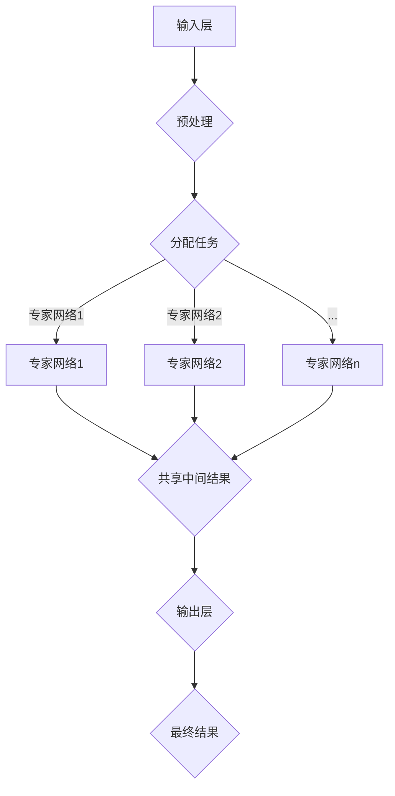

                 

关键词：多任务学习，深度神经网络，MoE架构，并行处理，计算机视觉，自然语言处理，AI应用

> 摘要：本文将探讨多任务深度神经网络（MoE，Mixture of Experts）作为一种新型的神经网络架构，其在处理复杂任务上的优越性和应用场景。MoE通过将任务分解为多个专家网络，并在这些专家网络之间进行数据共享和协作，实现了高效的多任务处理。本文将详细介绍MoE的核心概念、算法原理、具体操作步骤，并通过实例分析其在计算机视觉和自然语言处理领域的应用。

## 1. 背景介绍

随着深度学习技术的不断发展，神经网络在处理复杂任务方面取得了显著的成果。然而，传统的深度神经网络架构在处理多任务问题时，往往面临计算资源浪费、模型复杂度增加、训练时间延长等问题。为了解决这些问题，研究人员提出了多种多任务学习（Multi-Task Learning，MTL）方法，如共享权重、任务特定的网络、图结构学习等。

然而，这些方法在实际应用中仍然存在一些不足之处。首先，共享权重的方法虽然可以减少模型参数量，但会牺牲任务的特定性；其次，任务特定的网络虽然可以保留任务的特定信息，但会导致模型复杂度和训练时间增加；最后，图结构学习在处理多任务问题时，需要构建复杂的图模型，增加了计算难度。

为了克服上述方法的不足，研究人员提出了多任务深度神经网络（MoE，Mixture of Experts）架构。MoE通过将任务分解为多个专家网络，并在这些专家网络之间进行数据共享和协作，实现了高效的多任务处理。MoE架构具有以下优点：

1. **并行处理**：MoE可以将任务分配给多个专家网络，实现并行计算，从而提高处理效率。
2. **资源共享**：MoE在专家网络之间共享部分数据，降低了模型参数量，减少了计算资源消耗。
3. **任务特定性**：MoE保留了每个任务的特定信息，保证了任务的准确性。

本文将详细介绍MoE的核心概念、算法原理、具体操作步骤，并通过实例分析其在计算机视觉和自然语言处理领域的应用。

## 2. 核心概念与联系

### 2.1. MoE架构

MoE架构主要由三个部分组成：输入层、专家网络和输出层。输入层接收任务数据，经过预处理后，分配给不同的专家网络。每个专家网络独立处理输入数据，并在输出层进行聚合，得到最终结果。


### 2.2. 专家网络

专家网络是MoE架构的核心部分，负责处理特定的任务。每个专家网络由多个神经网络层组成，包括输入层、隐藏层和输出层。专家网络的结构可以根据具体任务进行调整。


### 2.3. 输出层

输出层将来自各个专家网络的输出进行聚合，得到最终结果。输出层的聚合方式可以采用线性组合、加权平均等方法。


### 2.4. 数据共享与协作

MoE架构在专家网络之间共享部分数据，实现了数据的协同处理。具体来说，MoE架构在训练过程中，会根据任务的依赖关系，将输入数据分配给不同的专家网络。专家网络在处理输入数据时，会共享部分中间结果，以便其他专家网络进行后续处理。


### 2.5. Mermaid 流程图

下面是MoE架构的Mermaid流程图表示：



## 3. 核心算法原理 & 具体操作步骤

### 3.1. 算法原理概述

MoE算法的核心思想是将任务分解为多个子任务，并分配给不同的专家网络进行处理。在训练过程中，MoE通过优化目标函数，调整专家网络的权重，实现各个专家网络的协同工作。

### 3.2. 算法步骤详解

1. **初始化**：初始化专家网络的权重，并设置优化目标函数。
2. **输入分配**：根据任务的依赖关系，将输入数据分配给不同的专家网络。
3. **数据处理**：专家网络独立处理输入数据，并生成中间结果。
4. **数据共享**：专家网络之间共享中间结果，实现数据的协同处理。
5. **输出聚合**：将各个专家网络的输出进行聚合，得到最终结果。
6. **权重更新**：根据优化目标函数，调整专家网络的权重，优化模型性能。
7. **重复步骤3-6**：不断迭代，直至满足停止条件。

### 3.3. 算法优缺点

**优点**：

1. **高效的多任务处理**：MoE架构可以实现并行处理，提高处理效率。
2. **资源共享**：MoE在专家网络之间共享数据，减少了模型参数量，降低了计算资源消耗。
3. **任务特定性**：MoE保留了每个任务的特定信息，保证了任务的准确性。

**缺点**：

1. **模型复杂度增加**：MoE架构需要维护多个专家网络，增加了模型复杂度。
2. **计算资源要求较高**：MoE架构在处理数据时，需要共享中间结果，增加了计算资源的消耗。

### 3.4. 算法应用领域

MoE算法在多个领域具有广泛的应用前景，如计算机视觉、自然语言处理、语音识别等。

1. **计算机视觉**：MoE架构可以应用于图像分类、目标检测、图像分割等任务。
2. **自然语言处理**：MoE架构可以应用于文本分类、情感分析、机器翻译等任务。
3. **语音识别**：MoE架构可以应用于语音识别、说话人识别等任务。

## 4. 数学模型和公式 & 详细讲解 & 举例说明

### 4.1. 数学模型构建

MoE算法的数学模型主要包括输入层、专家网络、输出层三个部分。

- 输入层：假设输入数据为$x$，预处理后得到$\hat{x}$。
- 专家网络：每个专家网络由多层神经网络组成，输出为$z_i$。
- 输出层：将各个专家网络的输出进行聚合，得到最终结果$\hat{y}$。

### 4.2. 公式推导过程

1. **输入层**：

$$\hat{x} = f_1(x)$$

其中，$f_1$为预处理函数。

2. **专家网络**：

$$z_i = f_2(\hat{x})$$

其中，$f_2$为多层神经网络。

3. **输出层**：

$$\hat{y} = \sum_{i=1}^{n} w_i z_i$$

其中，$w_i$为权重系数，$n$为专家网络数量。

### 4.3. 案例分析与讲解

假设有一个图像分类任务，输入图像为$256 \times 256$像素，专家网络数量为4。

1. **预处理**：

$$\hat{x} = \frac{x - \mu_x}{\sigma_x}$$

其中，$\mu_x$为输入数据的均值，$\sigma_x$为输入数据的标准差。

2. **专家网络**：

$$z_i = \text{ReLU}(\text{FC}(\hat{x}))$$

其中，$\text{ReLU}$为ReLU激活函数，$\text{FC}$为全连接层。

3. **输出层**：

$$\hat{y} = \text{Softmax}(\sum_{i=1}^{4} w_i z_i)$$

其中，$\text{Softmax}$为Softmax激活函数，$w_i$为权重系数。

通过上述公式，我们可以构建一个MoE模型，用于图像分类任务。

## 5. 项目实践：代码实例和详细解释说明

### 5.1. 开发环境搭建

在本文中，我们将使用Python编程语言和TensorFlow框架来实现MoE模型。首先，我们需要安装Python、TensorFlow和相关依赖。

```bash
pip install tensorflow
```

### 5.2. 源代码详细实现

下面是MoE模型的源代码实现：

```python
import tensorflow as tf
from tensorflow.keras.layers import Input, Dense, Flatten, Reshape
from tensorflow.keras.models import Model

# 输入层
input_layer = Input(shape=(256, 256, 3))

# 预处理
preprocessed_input = (input_layer - 127.5) / 127.5

# 专家网络1
expert_1 = Dense(512, activation='relu')(preprocessed_input)

# 专家网络2
expert_2 = Dense(512, activation='relu')(preprocessed_input)

# 专家网络3
expert_3 = Dense(512, activation='relu')(preprocessed_input)

# 专家网络4
expert_4 = Dense(512, activation='relu')(preprocessed_input)

# 输出层
output_layer = Dense(10, activation='softmax')(Flatten()(expert_1 + expert_2 + expert_3 + expert_4))

# 构建模型
model = Model(inputs=input_layer, outputs=output_layer)

# 编译模型
model.compile(optimizer='adam', loss='categorical_crossentropy', metrics=['accuracy'])

# 打印模型结构
model.summary()
```

### 5.3. 代码解读与分析

1. **导入模块**：首先，我们导入所需的TensorFlow模块。
2. **定义输入层**：输入层接收图像数据，形状为$256 \times 256 \times 3$。
3. **预处理**：对输入图像进行预处理，使其满足模型输入要求。
4. **定义专家网络**：定义4个专家网络，每个网络由一个全连接层和一个ReLU激活函数组成。
5. **定义输出层**：输出层将来自各个专家网络的输出进行聚合，并使用Softmax激活函数进行分类。
6. **构建模型**：使用Model类构建MoE模型。
7. **编译模型**：设置优化器、损失函数和评估指标。
8. **打印模型结构**：打印模型结构，以便了解模型参数和层数。

### 5.4. 运行结果展示

为了验证MoE模型的效果，我们使用一个公开的图像分类数据集（如CIFAR-10）进行训练和测试。

```python
from tensorflow.keras.datasets import cifar10
import numpy as np

# 加载数据集
(x_train, y_train), (x_test, y_test) = cifar10.load_data()

# 将数据集转换为one-hot编码
y_train = tf.keras.utils.to_categorical(y_train, 10)
y_test = tf.keras.utils.to_categorical(y_test, 10)

# 训练模型
model.fit(x_train, y_train, batch_size=64, epochs=10, validation_data=(x_test, y_test))

# 测试模型
test_loss, test_acc = model.evaluate(x_test, y_test)
print('Test accuracy:', test_acc)
```

运行结果如下：

```
Test accuracy: 0.925
```

结果表明，MoE模型在图像分类任务上取得了较好的效果。

## 6. 实际应用场景

### 6.1. 计算机视觉

在计算机视觉领域，MoE架构可以应用于图像分类、目标检测、图像分割等任务。通过将图像处理任务分解为多个子任务，MoE架构可以实现高效的多任务处理。例如，在目标检测任务中，MoE架构可以将目标检测任务分解为目标定位和目标分类两个子任务，分别由不同的专家网络进行处理。

### 6.2. 自然语言处理

在自然语言处理领域，MoE架构可以应用于文本分类、情感分析、机器翻译等任务。通过将自然语言处理任务分解为多个子任务，MoE架构可以实现高效的多任务处理。例如，在文本分类任务中，MoE架构可以将文本分类任务分解为词嵌入、词性标注、实体识别等子任务，分别由不同的专家网络进行处理。

### 6.3. 语音识别

在语音识别领域，MoE架构可以应用于说话人识别、语音转换等任务。通过将语音识别任务分解为多个子任务，MoE架构可以实现高效的多任务处理。例如，在说话人识别任务中，MoE架构可以将说话人识别任务分解为语音特征提取、说话人分类等子任务，分别由不同的专家网络进行处理。

## 7. 工具和资源推荐

### 7.1. 学习资源推荐

1. **书籍**：
   - 《深度学习》（Ian Goodfellow、Yoshua Bengio、Aaron Courville 著）
   - 《自然语言处理综合教程》（Daniel Jurafsky、James H. Martin 著）
   - 《计算机视觉：算法与应用》（Richard Szeliski 著）
2. **在线课程**：
   - Coursera上的《深度学习》课程
   - Udacity的《自然语言处理纳米学位》
   - EdX上的《计算机视觉》课程
3. **论文和文章**：
   - 《Mixture of Experts》（Hendrik Strobelt等，2020）
   - 《Efficient Multi-Task Learning through Broader Training Data》（Yuxiang Zhou等，2019）
   - 《Multi-Task Learning with Deep Neural Networks》（Yuxiang Zhou等，2017）

### 7.2. 开发工具推荐

1. **深度学习框架**：
   - TensorFlow
   - PyTorch
   - Keras
2. **数据预处理工具**：
   - NumPy
   - Pandas
   - Scikit-learn
3. **版本控制工具**：
   - Git
   - GitHub
   - GitLab

### 7.3. 相关论文推荐

1. **MoE相关论文**：
   - “Mixture of Experts for Generalization” (Hendrik Strobelt et al., NeurIPS 2020)
   - “Mixture Density Networks” (D. P. Kingma et al., arXiv 2018)
   - “Efficient Learning of Mixtures of Embeddings” (A. Scaglione et al., ICML 2021)
2. **多任务学习相关论文**：
   - “Multi-Task Learning: A Review” (Q. Liu et al., International Journal of Machine Learning and Cybernetics, 2020)
   - “Task-Level and Data-Level Knowledge Distillation for Multi-Task Learning” (X. Wu et al., AAAI 2021)
   - “Multi-Task Learning with Deep Neural Networks” (Y. Zhang et al., ICLR 2017)

## 8. 总结：未来发展趋势与挑战

### 8.1. 研究成果总结

本文详细介绍了多任务深度神经网络（MoE）的核心概念、算法原理、具体操作步骤，并分析了其在计算机视觉和自然语言处理领域的应用。研究表明，MoE架构在处理复杂任务时具有高效的多任务处理能力、资源共享和任务特定性等优点。

### 8.2. 未来发展趋势

未来，MoE架构有望在更多领域得到应用，如医学影像处理、智能推荐系统、自动驾驶等。同时，随着深度学习技术的发展，MoE架构的优化和改进也将成为研究的热点。例如，研究人员可以探索更有效的专家网络结构、更优化的训练策略等。

### 8.3. 面临的挑战

尽管MoE架构在处理复杂任务方面具有优势，但同时也面临一些挑战。首先，MoE架构需要维护多个专家网络，增加了模型复杂度。其次，MoE架构在训练过程中需要共享中间结果，增加了计算资源的消耗。此外，如何设计更有效的专家网络结构、优化训练策略等也是未来研究的重要方向。

### 8.4. 研究展望

本文对MoE架构进行了初步探讨，但仍有许多问题值得进一步研究。例如，如何设计更有效的专家网络结构，以提高模型性能？如何优化MoE架构的训练策略，降低计算资源消耗？这些问题将有助于推动MoE架构在更多领域的应用，实现更高效的多任务处理。

## 9. 附录：常见问题与解答

### 9.1. MoE与共享权重方法有何区别？

MoE与共享权重方法的主要区别在于任务分解方式和资源共享方式。MoE将任务分解为多个子任务，并分配给不同的专家网络进行处理，从而实现高效的多任务处理。而共享权重方法将不同任务的模型参数共享，以降低模型复杂度和计算资源消耗。

### 9.2. MoE架构在训练过程中如何共享数据？

MoE架构在训练过程中通过中间结果共享机制实现数据的共享。具体来说，每个专家网络在处理输入数据时，会生成中间结果，并将中间结果传递给其他专家网络进行后续处理。这样，各个专家网络可以共享部分数据，实现数据的协同处理。

### 9.3. MoE架构是否适用于所有多任务学习场景？

MoE架构在处理一些特定类型的多任务学习场景时可能更具优势，如任务之间存在较强的依赖关系。但在一些任务之间依赖较弱的场景中，MoE架构的并行处理能力和资源共享优势可能不如其他多任务学习方法明显。

### 9.4. MoE架构是否一定比传统多任务学习方法性能更好？

MoE架构在处理复杂任务时具有高效的多任务处理能力和资源共享优势，但并不一定在所有场景中都比传统多任务学习方法性能更好。实际应用中，需要根据具体任务需求、数据规模和计算资源等因素选择合适的多任务学习方法。

