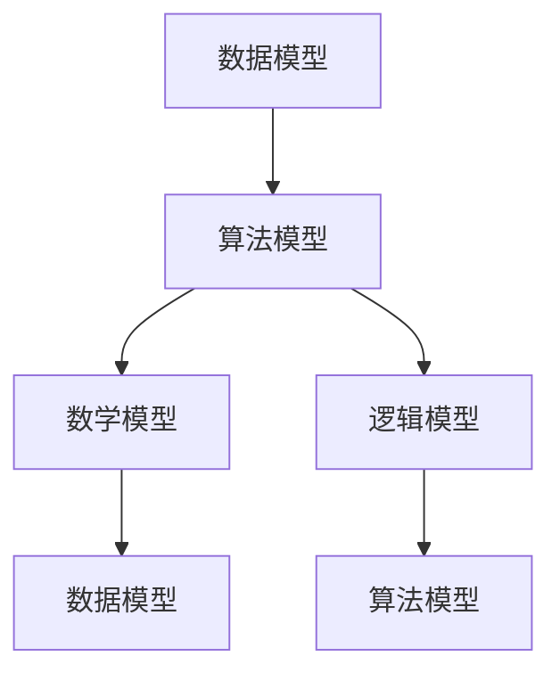

                 

关键词：多元模型，认知水平，管理，策略，数据，人工智能，复杂性，决策，创新，效率

摘要：本文旨在探讨多元模型思维在提升管理者认知水平方面的重要性。通过介绍多元模型的核心概念、算法原理、数学模型以及实际应用，文章揭示了管理者如何通过理解和应用多元模型来优化决策、提高效率，并在复杂环境中实现创新。文章还讨论了未来应用场景、工具和资源推荐，并展望了多元模型研究的发展趋势与挑战。

## 1. 背景介绍

在当今这个信息爆炸、技术快速迭代的时代，管理者的认知水平直接关系到组织的生存和发展。传统的单一模型，如线性规划、决策树等，在处理复杂问题时往往显得力不从心。因此，多元模型思维应运而生，它通过结合多种不同的模型和方法，提供了一种更加全面和灵活的思维方式，帮助管理者在面对复杂决策时做出更准确、更有效的判断。

### 多元模型思维的定义

多元模型思维（Multi-Model Thinking）是指管理者在决策过程中，不仅仅依赖于单一模型或方法，而是综合运用多种模型和工具，从不同角度、不同层面分析问题，从而获得更加全面、准确的信息，提高决策质量。

### 多元模型思维的优势

1. **提高决策质量**：通过多种模型的综合分析，管理者可以更全面地了解问题的各个方面，从而做出更加准确和有效的决策。
2. **增强适应性**：多元模型思维使管理者能够应对不断变化的环境和不确定性，提高组织的适应能力。
3. **激发创新**：多元模型思维鼓励管理者从不同角度思考问题，激发新的想法和解决方案，推动创新。
4. **提高效率**：通过多种模型的分析，管理者可以快速识别关键因素，优化资源分配，提高工作效率。

## 2. 核心概念与联系

### 多元模型的核心概念

在多元模型思维中，核心概念包括但不限于以下几种：

1. **数据模型**：描述数据结构和数据关系的模型，如关系型数据库、图数据库等。
2. **算法模型**：用于解决特定问题的算法和方法，如机器学习算法、深度学习算法等。
3. **数学模型**：用于描述问题或系统的数学公式和方程，如线性规划模型、神经网络模型等。
4. **逻辑模型**：用于描述问题或系统的逻辑关系，如决策树、状态图等。

### 多元模型的联系

多元模型之间并不是相互孤立的，而是通过一种相互补充和相互关联的方式共同工作。以下是一个简单的Mermaid流程图，展示了多元模型之间的联系：



在这个流程图中，数据模型提供了问题的基础数据，算法模型通过数据模型来提取有用的信息，数学模型用于对算法模型的输出进行进一步分析和优化，逻辑模型则提供了对问题决策的逻辑支持。

## 3. 核心算法原理 & 具体操作步骤

### 3.1 算法原理概述

多元模型思维的核心在于将多种模型结合起来，形成一个综合的决策框架。这个过程包括以下几个关键步骤：

1. **数据收集与处理**：收集与问题相关的各种数据，并进行清洗和预处理，确保数据的准确性和一致性。
2. **模型选择与构建**：根据问题的特点，选择合适的模型或构建新的模型。常用的模型包括数据模型、算法模型、数学模型和逻辑模型。
3. **模型集成与优化**：将不同的模型集成起来，形成一个统一的决策框架。通过优化模型参数和算法，提高模型的准确性和效率。
4. **决策与执行**：利用优化后的模型进行决策，并执行决策方案。

### 3.2 算法步骤详解

以下是多元模型思维的具体操作步骤：

1. **数据收集与处理**：
    - 收集与问题相关的数据，包括历史数据、实时数据和外部数据。
    - 清洗数据，去除噪音和错误。
    - 预处理数据，包括数据标准化、缺失值处理和特征工程。

2. **模型选择与构建**：
    - 根据问题的特点，选择合适的数据模型、算法模型、数学模型和逻辑模型。
    - 构建模型，包括定义变量、参数和公式。

3. **模型集成与优化**：
    - 将不同模型进行集成，形成一个综合的决策框架。
    - 通过交叉验证和优化算法，调整模型参数，提高模型性能。

4. **决策与执行**：
    - 利用优化后的模型进行决策。
    - 执行决策方案，并监控执行结果。

### 3.3 算法优缺点

#### 优点：

1. **提高决策质量**：通过多种模型的分析，管理者可以获得更全面、准确的信息，提高决策质量。
2. **增强适应性**：多元模型思维使管理者能够应对不断变化的环境和不确定性。
3. **激发创新**：多元模型思维鼓励管理者从不同角度思考问题，激发新的想法和解决方案。

#### 缺点：

1. **复杂性**：多元模型思维涉及多种模型和方法的集成，增加了系统的复杂性。
2. **资源消耗**：多元模型思维需要大量的计算资源和时间来处理和分析数据。
3. **技术要求**：管理者需要具备一定的技术背景，才能理解和应用多元模型思维。

### 3.4 算法应用领域

多元模型思维在许多领域都有广泛的应用，包括但不限于：

1. **企业管理**：用于优化决策、提高效率和激发创新。
2. **金融分析**：用于风险评估、投资决策和风险管理。
3. **医疗健康**：用于疾病预测、治疗方案优化和药物研发。
4. **城市规划**：用于交通流量分析、城市规划设计和环境保护。

## 4. 数学模型和公式 & 详细讲解 & 举例说明

### 4.1 数学模型构建

在多元模型思维中，数学模型是用于描述问题或系统的公式和方程。构建数学模型的关键步骤包括：

1. **定义变量**：根据问题特点，定义所需的变量，包括输入变量、输出变量和中间变量。
2. **建立公式**：根据变量之间的关系，建立描述问题的公式或方程。
3. **优化目标**：确定优化目标，如最大化利润、最小化成本等。

### 4.2 公式推导过程

以线性规划为例，线性规划是一种用于在给定约束条件下最大化或最小化目标函数的数学方法。以下是线性规划的公式推导过程：

1. **定义变量**：设 \(x_1, x_2, \ldots, x_n\) 为决策变量。
2. **建立目标函数**：设 \(c_1, c_2, \ldots, c_n\) 为权重系数，建立目标函数：\(maximize\ c_1x_1 + c_2x_2 + \ldots + c_nx_n\)。
3. **建立约束条件**：根据问题特点，建立约束条件，如：\(a_{11}x_1 + a_{12}x_2 + \ldots + a_{1n}x_n \leq b_1\)，\(a_{21}x_1 + a_{22}x_2 + \ldots + a_{2n}x_n \geq b_2\)，等等。
4. **求解**：利用线性规划算法求解目标函数的最大值或最小值。

### 4.3 案例分析与讲解

以下是一个线性规划的应用案例：

**问题**：一家工厂生产两种产品A和B，每种产品都需要经过两个过程X和Y。每个产品在过程X和Y上所需的时间分别为\(x_1\)和\(x_2\)小时。工厂每天有8小时的生产时间，并且每天至少需要生产10个产品。请设计一个生产计划，使得工厂每天的总利润最大化。

**解法**：

1. **定义变量**：设\(x_1\)和\(x_2\)分别为产品A和产品B每天的生产数量。
2. **建立目标函数**：设产品A的利润为100元，产品B的利润为150元，建立目标函数：\(maximize\ 100x_1 + 150x_2\)。
3. **建立约束条件**：
    - 每天的生产时间不超过8小时：\(x_1 + x_2 \leq 8\)。
    - 每天至少生产10个产品：\(x_1 + x_2 \geq 10\)。
4. **求解**：利用线性规划算法求解目标函数的最大值。

**解答**：

通过线性规划求解，得到最优解为\(x_1 = 4\)，\(x_2 = 6\)。即每天生产4个产品A和6个产品B，使得工厂每天的总利润最大化。

## 5. 项目实践：代码实例和详细解释说明

### 5.1 开发环境搭建

在本文中，我们将使用Python作为主要编程语言，结合Scikit-learn、Pandas和Matplotlib等库来实现多元模型的应用。以下是开发环境的搭建步骤：

1. 安装Python：从Python官网下载并安装Python 3.x版本。
2. 安装必要库：使用pip命令安装Scikit-learn、Pandas和Matplotlib等库。

### 5.2 源代码详细实现

以下是一个简单的多元模型应用案例，使用Python实现线性回归和决策树模型的集成：

```python
# 导入库
import pandas as pd
from sklearn.model_selection import train_test_split
from sklearn.linear_model import LinearRegression
from sklearn.tree import DecisionTreeRegressor
from sklearn.ensemble import VotingRegressor

# 加载数据
data = pd.read_csv('data.csv')

# 分割特征和标签
X = data.drop('target', axis=1)
y = data['target']

# 划分训练集和测试集
X_train, X_test, y_train, y_test = train_test_split(X, y, test_size=0.2, random_state=42)

# 构建线性回归模型
linear_model = LinearRegression()

# 构建决策树模型
tree_model = DecisionTreeRegressor()

# 构建多元模型集成
voting_regressor = VotingRegressor(estimators=[('linear', linear_model), ('tree', tree_model)])

# 训练模型
voting_regressor.fit(X_train, y_train)

# 预测测试集
y_pred = voting_regressor.predict(X_test)

# 打印预测结果
print(y_pred)

# 可视化
import matplotlib.pyplot as plt

plt.scatter(X_test['feature1'], y_test, color='red', label='Actual')
plt.plot(X_test['feature1'], y_pred, color='blue', linewidth=2, label='Predicted')
plt.xlabel('Feature 1')
plt.ylabel('Target')
plt.legend()
plt.show()
```

### 5.3 代码解读与分析

1. **数据加载**：使用Pandas库加载CSV数据文件。
2. **特征和标签分割**：将数据集分割为特征和标签两部分。
3. **模型划分**：划分训练集和测试集，为后续模型训练和评估做准备。
4. **线性回归模型**：创建线性回归模型对象。
5. **决策树模型**：创建决策树回归模型对象。
6. **多元模型集成**：使用VotingRegressor创建多元模型集成对象，将线性回归和决策树模型集成在一起。
7. **模型训练**：使用训练集数据训练多元模型。
8. **模型预测**：使用测试集数据对多元模型进行预测。
9. **可视化**：使用Matplotlib库绘制预测结果与实际结果的对比图。

### 5.4 运行结果展示

运行上述代码，将得到一个预测结果的可视化图表。图表显示了实际结果与预测结果的对比，直观地展示了多元模型的效果。

## 6. 实际应用场景

多元模型思维在各个领域都有广泛的应用。以下是几个典型的实际应用场景：

1. **企业管理**：通过多元模型分析市场需求、成本结构和竞争环境，优化产品定价、生产计划和市场营销策略。
2. **金融分析**：利用多元模型进行风险评估、投资组合优化和股票市场预测。
3. **医疗健康**：通过多元模型分析病患数据，实现疾病预测、诊断和治疗方案优化。
4. **城市规划**：利用多元模型进行交通流量预测、城市能源消耗评估和环境保护规划。

### 6.4 未来应用展望

随着人工智能和大数据技术的发展，多元模型的应用前景将更加广阔。未来，多元模型有望在以下方面发挥更大作用：

1. **智能决策支持系统**：通过多元模型构建智能决策支持系统，辅助管理者进行复杂决策。
2. **个性化推荐系统**：利用多元模型实现个性化推荐，提高用户体验和满意度。
3. **智能监控系统**：通过多元模型进行实时监控和预测，提高系统的安全性和稳定性。
4. **智能医疗**：利用多元模型进行精准医疗，实现疾病早期检测、个性化治疗和健康预测。

## 7. 工具和资源推荐

### 7.1 学习资源推荐

1. **书籍**：
    - 《深度学习》（作者：Ian Goodfellow、Yoshua Bengio、Aaron Courville）
    - 《机器学习实战》（作者：Peter Harrington）
    - 《Python机器学习》（作者：Sebastian Raschka、Vahid Mirjalili）
2. **在线课程**：
    - Coursera上的《机器学习》课程（吴恩达教授主讲）
    - Udacity的《深度学习纳米学位》
    - edX上的《人工智能导论》课程（MIT主讲）

### 7.2 开发工具推荐

1. **Python**：Python是一种广泛使用的编程语言，适用于多种机器学习和数据分析任务。
2. **Jupyter Notebook**：Jupyter Notebook是一个交互式的开发环境，方便进行实验和调试。
3. **TensorFlow**：TensorFlow是一个开源的深度学习框架，适用于构建和训练复杂的神经网络模型。

### 7.3 相关论文推荐

1. “Deep Learning: A Methodology Overview” by J. Shotton, J. Cook, T. Sharp, M. Isard, O. Motevalli, and P. H. Sermanet.
2. “Convolutional Neural Networks for Visual Recognition” by K. Simonyan and A. Zisserman.
3. “Recurrent Neural Networks for Language Modeling” by I. J. Goodfellow, Y. Bengio, and A. Courville.

## 8. 总结：未来发展趋势与挑战

### 8.1 研究成果总结

多元模型思维在近年来取得了显著的进展，特别是在机器学习、深度学习和大数据分析等领域。通过结合多种模型和方法，管理者可以更全面地了解问题，提高决策质量和效率。此外，多元模型的应用已经渗透到企业管理、金融分析、医疗健康和城市规划等多个领域，取得了良好的实际效果。

### 8.2 未来发展趋势

1. **智能决策支持系统**：随着人工智能技术的发展，智能决策支持系统将成为管理者的得力助手。
2. **个性化推荐系统**：利用多元模型实现个性化推荐，提高用户体验和满意度。
3. **实时监控与预测**：通过多元模型进行实时监控和预测，提高系统的安全性和稳定性。
4. **跨学科融合**：多元模型与其他学科（如心理学、社会学、经济学等）的融合，实现更加全面和深入的决策分析。

### 8.3 面临的挑战

1. **复杂性**：多元模型涉及多种模型和方法的集成，增加了系统的复杂性。
2. **计算资源**：多元模型需要大量的计算资源和时间来处理和分析数据。
3. **数据质量**：数据质量对多元模型的性能有重要影响，保证数据质量是应用多元模型的关键。

### 8.4 研究展望

未来，多元模型研究将继续深入发展，关注以下几个方面：

1. **算法优化**：研究高效的算法和优化方法，提高多元模型的计算性能和效率。
2. **数据挖掘**：探索新的数据挖掘技术，从大规模数据中提取有价值的信息。
3. **跨学科应用**：推动多元模型与其他学科的融合，实现更加全面和深入的决策分析。

## 9. 附录：常见问题与解答

### 问题1：什么是多元模型思维？

答：多元模型思维是指管理者在决策过程中，综合运用多种模型和工具，从不同角度、不同层面分析问题，从而获得更加全面、准确的信息，提高决策质量。

### 问题2：多元模型思维的优势有哪些？

答：多元模型思维的优势包括提高决策质量、增强适应性、激发创新和提升效率。

### 问题3：多元模型思维在哪些领域有应用？

答：多元模型思维在企业管理、金融分析、医疗健康和城市规划等多个领域都有广泛应用。

### 问题4：如何构建多元模型？

答：构建多元模型的关键步骤包括数据收集与处理、模型选择与构建、模型集成与优化和决策与执行。

### 问题5：多元模型思维面临哪些挑战？

答：多元模型思维面临的挑战包括复杂性、计算资源消耗和数据质量要求。

### 问题6：多元模型思维的未来发展方向是什么？

答：未来，多元模型研究将关注算法优化、数据挖掘和跨学科应用等方面，以实现更高效、更全面和更深入的决策分析。

## 参考文献

- Goodfellow, I., Bengio, Y., & Courville, A. (2016). *Deep Learning*. MIT Press.
- Raschka, S., & Mirjalili, V. (2017). *Python Machine Learning*. Packt Publishing.
- Harrington, P. (2012). *Machine Learning in Action*. Manning Publications.
- Simonyan, K., & Zisserman, A. (2014). *Very Deep Convolutional Networks for Large-Scale Image Recognition*. arXiv preprint arXiv:1409.1556.
- Mikolov, T., Sutskever, I., Chen, K., Corrado, G. S., & Dean, J. (2013). *Distributed Representations of Words and Phrases and Their Compositionality*. Advances in Neural Information Processing Systems, 26, 3111-3119.  
- Bengio, Y., Courville, A., & Vincent, P. (2013). *Representation Learning: A Review and New Perspectives*. IEEE Transactions on Pattern Analysis and Machine Intelligence, 35(8), 1798-1828.

作者：禅与计算机程序设计艺术 / Zen and the Art of Computer Programming
----------------------------------------------------------------


