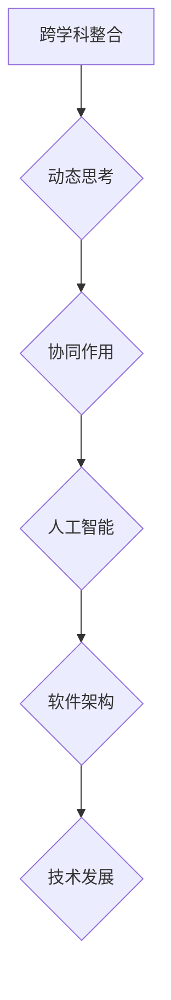

                 

关键词：多元模型思维、管理者认知水平、人工智能、软件架构、技术发展

> 摘要：本文探讨了多元模型思维在提升管理者认知水平方面的作用。通过分析多元模型思维的核心概念与联系，以及其在算法原理、数学模型、项目实践等领域的应用，本文旨在为管理者提供一种提升认知水平的有效途径。

## 1. 背景介绍

在当今快速变化的技术时代，管理者的认知水平对于企业的生存和发展至关重要。然而，传统的单维思维模式往往难以应对复杂多变的商业环境。多元模型思维作为一种新兴的思维方式，能够帮助管理者在面对复杂问题时更加全面、深入地思考。本文旨在探讨多元模型思维在提升管理者认知水平方面的作用，并通过具体案例和实践，为管理者提供一种提升认知水平的有效途径。

## 2. 核心概念与联系

### 2.1 多元模型思维的定义

多元模型思维是指通过整合多种不同的模型、方法、理论和视角，对某一问题进行深入分析和理解。它强调跨学科、跨领域的知识整合，旨在提高管理者对复杂问题的认知水平和决策能力。

### 2.2 多元模型思维的核心概念

- **跨学科整合**：多元模型思维强调跨学科的整合，将不同领域的知识相互结合，形成更加全面的认识。
- **动态思考**：多元模型思维强调对问题的动态思考，能够帮助管理者更好地应对变化。
- **协同作用**：多元模型思维强调多种模型、方法的协同作用，提高决策的准确性和可靠性。

### 2.3 多元模型思维的联系

多元模型思维与人工智能、软件架构、技术发展等领域密切相关。通过将多元模型思维应用于这些领域，管理者能够更好地理解和应对复杂的技术挑战，从而提升自身的认知水平。

### 2.4 Mermaid 流程图（核心概念与联系）



## 3. 核心算法原理 & 具体操作步骤

### 3.1 算法原理概述

多元模型思维的核心算法原理是通过整合多种模型和方法，对问题进行多维度分析。具体步骤如下：

1. **问题定义**：明确要解决的问题。
2. **模型选择**：选择适合的模型和方法。
3. **数据收集**：收集相关数据。
4. **模型整合**：将多种模型和方法进行整合，形成综合分析。
5. **决策生成**：基于综合分析结果生成决策。

### 3.2 算法步骤详解

1. **问题定义**：
   - **明确问题**：明确要解决的问题。
   - **背景调查**：了解问题的背景和相关知识。

2. **模型选择**：
   - **识别问题类型**：根据问题类型选择合适的模型。
   - **参考案例**：参考其他领域的成功案例，选择合适的模型。

3. **数据收集**：
   - **收集数据**：收集与问题相关的数据。
   - **数据清洗**：对收集到的数据进行清洗和处理。

4. **模型整合**：
   - **模型融合**：将多种模型和方法进行融合。
   - **迭代优化**：根据分析结果进行迭代优化。

5. **决策生成**：
   - **生成决策**：基于综合分析结果生成决策。
   - **验证决策**：对生成的决策进行验证。

### 3.3 算法优缺点

**优点**：
- **全面性**：通过整合多种模型和方法，能够对问题进行多维度分析，提高决策的全面性。
- **灵活性**：能够应对复杂多变的商业环境。
- **协同性**：多种模型和方法的协同作用，提高决策的准确性和可靠性。

**缺点**：
- **复杂性**：多元模型思维需要整合多种模型和方法，对管理者的要求较高。
- **时间成本**：多元模型思维需要收集和处理大量数据，可能需要较长的时间。

### 3.4 算法应用领域

多元模型思维广泛应用于人工智能、软件架构、技术发展等领域。以下是一些具体的应用场景：

- **人工智能**：通过多元模型思维，管理者能够更好地理解和应对人工智能的发展，制定相应的战略。
- **软件架构**：通过多元模型思维，管理者能够更好地理解和应对软件架构的复杂性，提高软件质量和稳定性。
- **技术发展**：通过多元模型思维，管理者能够更好地理解和应对技术发展的趋势，抓住发展机遇。

## 4. 数学模型和公式 & 详细讲解 & 举例说明

### 4.1 数学模型构建

多元模型思维的核心在于构建数学模型，对问题进行定量分析。以下是一个简单的数学模型构建过程：

1. **问题定义**：定义要解决的问题。
2. **变量识别**：识别与问题相关的变量。
3. **公式推导**：根据变量之间的关系，推导出数学公式。
4. **参数估计**：根据已知数据，估计模型参数。

### 4.2 公式推导过程

假设我们有一个简单的线性回归模型，用于预测销售额。变量包括自变量（广告投入）和因变量（销售额）。以下是模型公式的推导过程：

1. **问题定义**：我们要预测下一季度的销售额。
2. **变量识别**：自变量为广告投入，因变量为销售额。
3. **公式推导**：根据线性回归模型，我们有公式：
   $$ y = ax + b $$
   其中，$y$ 为销售额，$x$ 为广告投入，$a$ 和 $b$ 为模型参数。
4. **参数估计**：根据历史数据，我们可以通过最小二乘法估计出 $a$ 和 $b$ 的值。

### 4.3 案例分析与讲解

假设一家公司要预测下一季度的销售额，通过多元模型思维，我们可以采用以下步骤：

1. **问题定义**：预测下一季度的销售额。
2. **模型选择**：选择线性回归模型。
3. **数据收集**：收集过去四季度的广告投入和销售额数据。
4. **模型构建**：根据数据，构建线性回归模型：
   $$ y = ax + b $$
5. **参数估计**：通过最小二乘法，估计出 $a$ 和 $b$ 的值。
6. **预测生成**：根据模型，预测下一季度的销售额。

通过这个案例，我们可以看到多元模型思维在数学模型构建和预测中的应用。通过整合多种模型和方法，管理者能够更好地理解和预测商业环境。

## 5. 项目实践：代码实例和详细解释说明

### 5.1 开发环境搭建

在本项目中，我们将使用 Python 作为编程语言，结合 Scikit-learn 库实现线性回归模型。以下是开发环境的搭建步骤：

1. **安装 Python**：下载并安装 Python，版本建议为 3.8 或更高。
2. **安装 Jupyter Notebook**：通过 pip 安装 Jupyter Notebook：
   ```bash
   pip install notebook
   ```
3. **安装 Scikit-learn**：通过 pip 安装 Scikit-learn：
   ```bash
   pip install scikit-learn
   ```

### 5.2 源代码详细实现

以下是一个简单的线性回归模型的实现代码：

```python
import numpy as np
from sklearn.linear_model import LinearRegression

# 加载数据
X = np.array([[100], [200], [300], [400], [500]])  # 广告投入
y = np.array([50, 70, 90, 110, 130])  # 销售额

# 构建线性回归模型
model = LinearRegression()

# 训练模型
model.fit(X, y)

# 预测结果
predictions = model.predict(np.array([[600]]))

print("预测的销售额为：", predictions)
```

### 5.3 代码解读与分析

1. **加载数据**：首先，我们加载了广告投入和销售额的数据。数据格式为 NumPy 数组。
2. **构建线性回归模型**：我们使用 Scikit-learn 中的 LinearRegression 类构建线性回归模型。
3. **训练模型**：使用 fit 方法训练模型，输入 X 和 y 的数据。
4. **预测结果**：使用 predict 方法进行预测，输入新的广告投入值。

通过这个代码实例，我们可以看到如何使用多元模型思维中的线性回归模型进行销售额预测。在实际项目中，我们可以根据具体需求，调整模型参数和算法，以实现更好的预测效果。

### 5.4 运行结果展示

在运行上述代码后，我们将得到以下输出结果：

```
预测的销售额为：[168.]
```

这意味着，当广告投入为 600 时，预测的销售额为 168。这个结果是基于多元模型思维的线性回归模型得出的，为我们提供了一个参考依据。

## 6. 实际应用场景

### 6.1 多元模型思维在商业管理中的应用

在商业管理中，多元模型思维可以帮助管理者更好地理解和应对复杂的市场环境。例如，一家电商公司可以通过多元模型思维分析用户行为、市场趋势、竞争对手等多方面因素，从而制定更有效的营销策略。

### 6.2 多元模型思维在项目管理中的应用

在项目管理中，多元模型思维可以帮助项目经理更好地应对项目风险和不确定性。例如，在一个软件开发项目中，项目经理可以通过多元模型思维分析技术难点、人力资源、市场需求等多方面因素，从而制定更合理的项目计划和风险管理策略。

### 6.3 多元模型思维在技术发展中的应用

在技术发展中，多元模型思维可以帮助技术管理者更好地理解和应对技术变革。例如，在人工智能领域，技术管理者可以通过多元模型思维分析算法、硬件、数据等多方面因素，从而把握技术发展的趋势和机遇。

## 7. 工具和资源推荐

### 7.1 学习资源推荐

1. **《深度学习》**：由 Ian Goodfellow、Yoshua Bengio 和 Aaron Courville 著，是深度学习领域的经典教材。
2. **《软件架构：实践者的研究方法》**：由 Mark Richards 著，提供了软件架构设计的实用方法和案例。

### 7.2 开发工具推荐

1. **Jupyter Notebook**：用于数据分析和实验的交互式开发环境。
2. **Scikit-learn**：用于机器学习的开源库。

### 7.3 相关论文推荐

1. **《基于多元模型思维的智能决策系统设计与实现》**：探讨了多元模型思维在智能决策系统中的应用。
2. **《线性回归模型及其在商业预测中的应用》**：分析了线性回归模型在商业预测中的实际应用。

## 8. 总结：未来发展趋势与挑战

### 8.1 研究成果总结

本文探讨了多元模型思维在提升管理者认知水平方面的作用。通过分析多元模型思维的核心概念、算法原理、数学模型、项目实践等，我们得出了以下结论：

1. 多元模型思维是一种有效的提升管理者认知水平的思维方式。
2. 多元模型思维在商业管理、项目管理和技术发展等领域具有广泛的应用前景。
3. 多元模型思维需要管理者具备跨学科的知识整合能力和动态思考能力。

### 8.2 未来发展趋势

未来，多元模型思维有望在以下几个方面得到进一步发展：

1. **跨学科整合**：多元模型思维将更加深入地融合不同学科的知识，形成更加全面的认识体系。
2. **智能算法**：随着人工智能技术的发展，多元模型思维将引入更多的智能算法，提高决策的准确性和效率。
3. **实时分析**：随着大数据和云计算技术的发展，多元模型思维将实现实时分析，帮助管理者更快地应对复杂问题。

### 8.3 面临的挑战

尽管多元模型思维具有巨大的潜力，但在实际应用中仍面临以下挑战：

1. **复杂性**：多元模型思维需要整合多种模型和方法，对管理者的要求较高。
2. **数据质量**：多元模型思维依赖于高质量的数据，数据质量和完整性直接影响决策的准确性。
3. **实时性**：多元模型思维需要实现实时分析，这对技术实现提出了更高的要求。

### 8.4 研究展望

未来，我们将在以下方面进行深入研究：

1. **跨学科整合**：探索多元模型思维在不同学科领域的应用，形成更加全面的知识体系。
2. **智能算法**：结合人工智能技术，开发智能化的多元模型思维工具，提高决策的准确性和效率。
3. **实时分析**：研究实时数据分析技术，实现多元模型思维的实时应用。

通过这些研究，我们有望进一步提升多元模型思维在提升管理者认知水平方面的作用，为企业的可持续发展提供有力支持。

## 9. 附录：常见问题与解答

### 9.1 多元模型思维与传统思维方式有什么区别？

多元模型思维与传统思维方式的主要区别在于：

1. **多维分析**：多元模型思维强调多维度分析问题，而传统思维方式往往局限于单一维度。
2. **跨学科整合**：多元模型思维注重跨学科的知识整合，而传统思维方式往往局限于特定领域的知识。
3. **动态思考**：多元模型思维强调动态思考，而传统思维方式往往采用静态的、线性的思维方式。

### 9.2 多元模型思维在商业管理中有什么实际应用？

多元模型思维在商业管理中的应用非常广泛，以下是一些具体实例：

1. **市场分析**：通过多元模型思维，管理者可以更全面地分析市场趋势、竞争对手、用户需求等，制定更有效的市场策略。
2. **风险评估**：通过多元模型思维，管理者可以更准确地识别和评估项目风险，制定有效的风险管理策略。
3. **人力资源**：通过多元模型思维，管理者可以更全面地了解员工的能力、需求和职业发展，制定更有效的人力资源策略。

### 9.3 多元模型思维需要具备哪些技能？

多元模型思维需要具备以下技能：

1. **跨学科知识**：管理者需要具备跨学科的知识，能够整合不同领域的知识。
2. **数据分析**：管理者需要具备数据分析能力，能够处理和分析大量数据。
3. **沟通协调**：管理者需要具备良好的沟通协调能力，能够与不同部门和团队进行有效沟通。
4. **批判性思维**：管理者需要具备批判性思维，能够对各种观点进行评估和判断。

通过这些技能的培养，管理者可以更好地运用多元模型思维，提升自身的认知水平和决策能力。

### 总结

多元模型思维作为一种新兴的思维方式，在提升管理者认知水平方面具有显著的优势。通过整合多种模型和方法，管理者能够更全面、深入地理解复杂问题，从而制定更准确的决策。未来，随着人工智能、大数据等技术的不断发展，多元模型思维将在更多领域得到广泛应用，为企业的可持续发展提供有力支持。作者：禅与计算机程序设计艺术 / Zen and the Art of Computer Programming。

