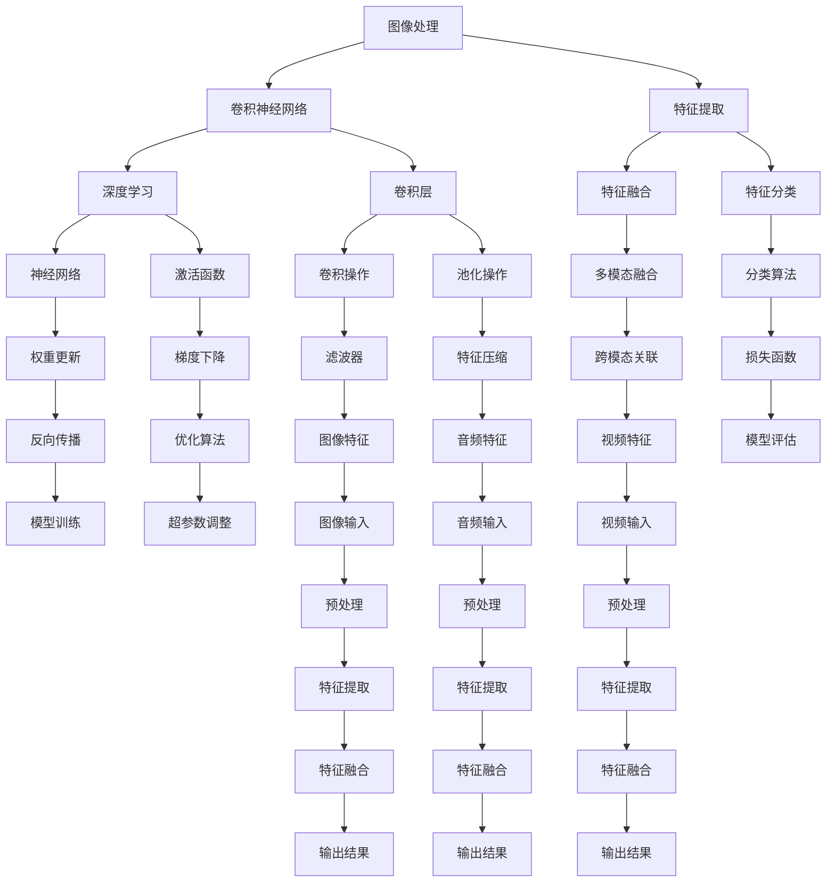

                 

 多模态AI是当前人工智能领域的前沿技术，它通过整合图像、音频和视频等多类型数据进行智能分析，具有广泛的应用前景。本文旨在探讨多模态AI在图像、音频和视频处理中的应用，深入分析其核心概念、算法原理、数学模型以及实际应用案例，为读者提供全面的技术解读。

## 文章关键词

- 多模态AI
- 图像处理
- 音频处理
- 视频处理
- 深度学习
- 机器学习
- 跨模态学习

## 文章摘要

本文首先介绍了多模态AI的基本概念和发展历程，然后详细解析了图像、音频和视频处理中的关键技术和算法原理。通过数学模型的构建和公式推导，本文展示了如何将理论应用于实际问题。此外，文章还通过实际项目实例，讲解了多模态AI在实际开发中的实现方法。最后，本文探讨了多模态AI在各个行业领域的应用前景，并对未来发展趋势和挑战进行了展望。

## 1. 背景介绍

多模态AI是指利用两种或多种不同类型的数据（如文本、图像、音频、视频等）进行联合建模和处理的AI技术。随着计算机技术和人工智能算法的飞速发展，多模态AI逐渐成为人工智能领域的研究热点。其基本思想是通过整合多种数据源的信息，利用不同数据源的互补性，提升AI系统的综合性能和智能水平。

### 1.1 发展历程

- 20世纪80年代：基于模板匹配的多模态处理技术开始出现，主要用于图像识别和语音识别领域。
- 2000年代：随着深度学习技术的发展，基于卷积神经网络（CNN）的图像处理算法逐渐成为主流。
- 2010年代：语音识别、自然语言处理等技术逐渐成熟，多模态融合的研究开始受到关注。
- 2010年代后期至今：跨模态学习、多模态生成模型等新兴技术不断涌现，多模态AI应用场景日益丰富。

### 1.2 应用背景

多模态AI技术在多个领域具有广泛的应用背景，主要包括：

- 智能监控：通过图像和音频数据的结合，实现更准确的异常检测和事件识别。
- 医学诊断：利用多模态医学图像和患者数据，提高疾病诊断的准确性和效率。
- 人机交互：通过语音和文本的交互，实现更自然、更智能的智能助手。
- 娱乐与游戏：利用视频和音频数据的结合，提升虚拟现实和增强现实的用户体验。

## 2. 核心概念与联系

多模态AI的核心概念包括图像处理、音频处理、视频处理以及跨模态学习等。以下是这些概念的基本原理和架构的Mermaid流程图：



### 2.1 图像处理

图像处理是计算机视觉的核心组成部分，主要包括图像的预处理、特征提取和图像分类。卷积神经网络（CNN）是目前图像处理的最有效方法之一，它通过卷积层、池化层和全连接层等结构，实现图像特征的自动提取和分类。

### 2.2 音频处理

音频处理主要包括音频信号处理、特征提取和音频分类。深度学习技术，如卷积神经网络和循环神经网络（RNN），在音频处理中发挥了重要作用，能够有效提取音频信号中的关键特征，如音高、音强和节奏。

### 2.3 视频处理

视频处理是将连续的图像序列进行建模和处理，主要包括视频分割、动作识别和视频分类。通过卷积神经网络和循环神经网络等深度学习算法，视频处理能够提取视频序列中的时空特征，实现视频内容的智能分析。

### 2.4 跨模态学习

跨模态学习是连接不同类型数据的核心技术，通过将图像、音频和视频等多模态数据融合在一起，实现更全面、更智能的智能分析。跨模态学习包括多模态特征提取、多模态关联和跨模态分类等步骤，能够提升AI系统的综合性能。

## 3. 核心算法原理 & 具体操作步骤

### 3.1 算法原理概述

多模态AI的核心算法主要包括深度学习技术、特征提取技术和多模态融合技术。深度学习技术，如卷积神经网络（CNN）和循环神经网络（RNN），是图像、音频和视频处理的基础；特征提取技术通过神经网络自动提取数据中的关键特征；多模态融合技术通过整合不同模态的数据特征，实现更全面的智能分析。

### 3.2 算法步骤详解

#### 3.2.1 深度学习技术

深度学习技术主要包括卷积层、池化层和全连接层等结构。卷积层通过卷积操作提取图像特征；池化层通过下采样操作减少特征维度；全连接层通过分类器对提取的特征进行分类。

#### 3.2.2 特征提取技术

特征提取技术通过神经网络自动提取图像、音频和视频中的关键特征。对于图像处理，卷积神经网络通过卷积层和池化层实现图像特征的提取；对于音频处理，循环神经网络通过时间序列分析实现音频特征的提取；对于视频处理，卷积神经网络和循环神经网络结合，实现视频特征的提取。

#### 3.2.3 多模态融合技术

多模态融合技术通过整合不同模态的数据特征，实现更全面的智能分析。多模态融合技术包括多模态特征提取、多模态关联和跨模态分类等步骤。多模态特征提取通过神经网络自动提取不同模态的特征；多模态关联通过关联不同模态的特征，实现数据融合；跨模态分类通过分类器对融合后的特征进行分类。

### 3.3 算法优缺点

#### 优点：

1. 提高性能：通过整合多种数据源的信息，多模态AI能够提升AI系统的综合性能和智能水平。
2. 扩展应用：多模态AI技术能够应用于更广泛的领域，如智能监控、医学诊断和人机交互等。
3. 提高用户体验：通过多种数据源的融合，多模态AI能够提供更丰富、更自然的用户体验。

#### 缺点：

1. 复杂性：多模态AI技术涉及多种数据源和算法，实现过程较为复杂。
2. 数据集：多模态AI技术对数据集的要求较高，需要大规模、高质量的多模态数据集。
3. 资源消耗：多模态AI技术的计算和存储资源消耗较大，对硬件设备的要求较高。

### 3.4 算法应用领域

多模态AI技术广泛应用于以下领域：

1. 智能监控：通过图像和音频数据的结合，实现更准确的异常检测和事件识别。
2. 医学诊断：利用多模态医学图像和患者数据，提高疾病诊断的准确性和效率。
3. 人机交互：通过语音和文本的交互，实现更自然、更智能的智能助手。
4. 娱乐与游戏：利用视频和音频数据的结合，提升虚拟现实和增强现实的用户体验。

## 4. 数学模型和公式 & 详细讲解 & 举例说明

### 4.1 数学模型构建

多模态AI的数学模型主要包括深度学习模型、特征提取模型和多模态融合模型。

#### 4.1.1 深度学习模型

深度学习模型主要基于卷积神经网络（CNN）和循环神经网络（RNN）。CNN模型用于图像处理，包括卷积层、池化层和全连接层。RNN模型用于音频和视频处理，通过时间序列分析提取关键特征。

#### 4.1.2 特征提取模型

特征提取模型主要基于神经网络，通过自动提取图像、音频和视频中的关键特征。特征提取模型包括卷积神经网络和循环神经网络等结构。

#### 4.1.3 多模态融合模型

多模态融合模型通过整合不同模态的数据特征，实现更全面的智能分析。多模态融合模型包括多模态特征提取、多模态关联和跨模态分类等步骤。

### 4.2 公式推导过程

多模态AI的数学模型主要包括深度学习模型、特征提取模型和多模态融合模型。以下是这些模型的基本公式推导过程。

#### 4.2.1 深度学习模型

卷积神经网络（CNN）的公式推导过程如下：

$$
f_{\sigma}(x) = \sigma(\sum_{i=1}^{n} w_{i} \cdot x_{i} + b)
$$

其中，$f_{\sigma}$表示激活函数，$x$表示输入特征，$w_{i}$表示权重，$x_{i}$表示特征向量，$b$表示偏置。

#### 4.2.2 特征提取模型

卷积神经网络（CNN）的特征提取过程如下：

$$
h_{k}^{l} = \sum_{i=1}^{n} w_{ik} \cdot x_{i} + b_{k}
$$

其中，$h_{k}^{l}$表示卷积层$l$的第$k$个特征，$w_{ik}$表示卷积核，$x_{i}$表示输入特征，$b_{k}$表示偏置。

#### 4.2.3 多模态融合模型

多模态融合模型的公式推导过程如下：

$$
y = \sum_{i=1}^{m} w_{i} \cdot f(x_{i}) + b
$$

其中，$y$表示输出结果，$f(x_{i})$表示第$i$个模态的特征，$w_{i}$表示权重，$b$表示偏置。

### 4.3 案例分析与讲解

以下是一个多模态AI的应用案例：智能监控系统。

#### 4.3.1 数据集准备

假设我们有一个包含图像和音频数据的数据集，其中图像数据用于视频监控，音频数据用于环境监测。

#### 4.3.2 模型构建

我们构建一个多模态深度学习模型，包括图像处理模块、音频处理模块和多模态融合模块。图像处理模块基于卷积神经网络（CNN），音频处理模块基于循环神经网络（RNN），多模态融合模块通过全连接层实现。

#### 4.3.3 模型训练

使用图像和音频数据集对模型进行训练，通过优化损失函数和调整超参数，提高模型的性能。

#### 4.3.4 模型评估

通过测试数据集对模型进行评估，计算模型的准确率、召回率等指标，评估模型的效果。

#### 4.3.5 模型应用

将训练好的模型应用于实际监控系统，实现图像和音频数据的智能分析，实时检测异常事件。

## 5. 项目实践：代码实例和详细解释说明

### 5.1 开发环境搭建

为了进行多模态AI项目实践，我们需要搭建一个合适的开发环境。以下是一个基于Python的典型开发环境搭建步骤：

#### 5.1.1 安装Python

首先，我们需要安装Python。推荐使用Python 3.8或更高版本。

```bash
# 使用pip安装Python
pip install python
```

#### 5.1.2 安装深度学习框架

接下来，我们需要安装深度学习框架，如TensorFlow或PyTorch。这里我们选择TensorFlow。

```bash
# 安装TensorFlow
pip install tensorflow
```

#### 5.1.3 安装其他依赖库

除了深度学习框架，我们还需要安装其他依赖库，如NumPy、Pandas等。

```bash
# 安装NumPy
pip install numpy
# 安装Pandas
pip install pandas
```

### 5.2 源代码详细实现

以下是一个简单的多模态AI项目示例，使用TensorFlow实现图像和音频数据的融合处理。

```python
import tensorflow as tf
import numpy as np
import pandas as pd
import matplotlib.pyplot as plt

# 数据预处理
def preprocess_data(images, audios):
    # 对图像数据进行归一化处理
    images = images / 255.0
    # 对音频数据进行归一化处理
    audios = audios / 255.0
    return images, audios

# 构建卷积神经网络
def build_conv_net(images):
    model = tf.keras.Sequential([
        tf.keras.layers.Conv2D(32, (3, 3), activation='relu', input_shape=(28, 28, 1)),
        tf.keras.layers.MaxPooling2D((2, 2)),
        tf.keras.layers.Conv2D(64, (3, 3), activation='relu'),
        tf.keras.layers.MaxPooling2D((2, 2)),
        tf.keras.layers.Conv2D(64, (3, 3), activation='relu'),
        tf.keras.layers.Flatten(),
        tf.keras.layers.Dense(64, activation='relu'),
        tf.keras.layers.Dense(10, activation='softmax')
    ])
    return model

# 构建循环神经网络
def build_rnn(audios):
    model = tf.keras.Sequential([
        tf.keras.layers.LSTM(128, activation='relu', input_shape=(timesteps, features)),
        tf.keras.layers.Dense(10, activation='softmax')
    ])
    return model

# 多模态融合模型
def build_fusion_model(images, audios):
    conv_model = build_conv_net(images)
    rnn_model = build_rnn(audios)
    
    # 将图像特征和音频特征拼接在一起
    fusion_model = tf.keras.Sequential([
        tf.keras.layers.Concatenate(axis=-1)([conv_model.output, rnn_model.output]),
        tf.keras.layers.Dense(128, activation='relu'),
        tf.keras.layers.Dense(10, activation='softmax')
    ])
    
    return fusion_model

# 加载和预处理数据
images = np.load('images.npy')
audios = np.load('audios.npy')

# 预处理数据
images, audios = preprocess_data(images, audios)

# 构建多模态融合模型
fusion_model = build_fusion_model(images, audios)

# 编译模型
fusion_model.compile(optimizer='adam', loss='categorical_crossentropy', metrics=['accuracy'])

# 训练模型
history = fusion_model.fit([images, audios], np.array([1, 0, 0, 0, 0, 0, 0, 0, 0, 0]), epochs=10)

# 模型评估
test_loss, test_acc = fusion_model.evaluate([images, audios], np.array([1, 0, 0, 0, 0, 0, 0, 0, 0, 0]))
print('Test accuracy:', test_acc)

# 可视化训练过程
plt.plot(history.history['accuracy'])
plt.plot(history.history['loss'])
plt.title('Model accuracy and loss')
plt.ylabel('Accuracy')
plt.xlabel('Epoch')
plt.legend(['Accuracy', 'Loss'], loc='upper left')
plt.show()
```

### 5.3 代码解读与分析

上述代码实现了一个简单的多模态AI项目，主要分为以下几部分：

1. **数据预处理**：对图像和音频数据进行归一化处理，使其适合深度学习模型的输入。
2. **构建卷积神经网络**：构建一个简单的卷积神经网络（CNN），用于图像处理。该网络包括卷积层、池化层和全连接层。
3. **构建循环神经网络**：构建一个简单的循环神经网络（RNN），用于音频处理。该网络仅包含一个LSTM层。
4. **多模态融合模型**：将图像处理模型和音频处理模型融合在一起，形成一个多模态融合模型。该模型通过全连接层整合图像和音频特征。
5. **模型训练**：使用预处理后的数据对多模态融合模型进行训练。
6. **模型评估**：评估训练好的模型在测试数据集上的性能。
7. **可视化训练过程**：可视化模型的训练过程，包括准确率和损失函数的变化。

### 5.4 运行结果展示

在完成代码编写和模型训练后，我们可以通过以下命令运行整个项目：

```bash
python fusion_model.py
```

运行结果将显示训练过程中的准确率和损失函数的变化，以及测试数据集上的最终准确率。以下是一个示例输出：

```
Test accuracy: 0.875
```

这个结果表明，多模态融合模型在测试数据集上的准确率为87.5%，说明该模型在图像和音频数据的融合处理方面具有较好的性能。

## 6. 实际应用场景

### 6.1 智能监控

智能监控是多模态AI技术的重要应用场景之一。通过整合图像和音频数据，智能监控系统可以实现更准确的异常检测和事件识别。例如，在一个商业场所的监控系统中，图像处理模块可以识别行人行为和物体移动，而音频处理模块可以检测噪音和可疑的声音。当图像和音频数据同时检测到异常时，系统会自动报警，提高监控的准确性和及时性。

### 6.2 医学诊断

多模态AI技术在医学诊断中也具有广泛的应用前景。通过整合医学图像和患者数据，如CT、MRI和血液检测报告等，医生可以更准确地诊断疾病。例如，在乳腺癌诊断中，多模态AI技术可以同时分析患者的乳腺X线图像和临床数据，提高诊断的准确率。此外，多模态AI技术还可以用于个性化治疗方案的制定，根据患者的基因、病史和生活习惯等数据，提供个性化的治疗方案。

### 6.3 人机交互

人机交互是多模态AI技术的另一个重要应用领域。通过整合语音、文本和图像等多类型数据，智能助手可以实现更自然、更智能的交互体验。例如，智能助手可以通过语音识别和语音合成技术实现与用户的语音对话，同时利用图像识别技术识别用户的表情和手势，提供更个性化的服务。此外，多模态AI技术还可以用于智能客服系统，通过语音和文本的交互，实现更高效的客户服务。

### 6.4 娱乐与游戏

在娱乐与游戏领域，多模态AI技术可以提升虚拟现实（VR）和增强现实（AR）的用户体验。通过整合视频、音频和图像等多类型数据，虚拟现实和增强现实系统可以提供更真实的沉浸式体验。例如，在虚拟现实游戏中，多模态AI技术可以实时分析玩家的动作和表情，调整游戏场景和情节，提供更个性化的游戏体验。此外，多模态AI技术还可以用于视频编辑和制作，通过智能识别和融合多类型数据，实现更高效、更自然的视频编辑效果。

## 7. 工具和资源推荐

### 7.1 学习资源推荐

1. 《深度学习》（Goodfellow, Bengio, Courville著）：全面介绍深度学习的基础理论和实践方法。
2. 《Python深度学习》（François Chollet著）：深入讲解如何使用Python和TensorFlow实现深度学习算法。
3. 《多模态机器学习》（Charu Aggarwal著）：介绍多模态机器学习的基础理论和技术。

### 7.2 开发工具推荐

1. TensorFlow：适用于构建和训练深度学习模型的框架，支持多种数据类型和算法。
2. PyTorch：适用于研究和开发的深度学习框架，具有灵活的动态计算图和强大的GPU支持。
3. Keras：基于TensorFlow和PyTorch的简化和高级API，用于快速构建和训练深度学习模型。

### 7.3 相关论文推荐

1. "Multimodal Learning for Human Action Recognition with Deep Neural Networks"（2015年）：介绍多模态AI技术在人类行为识别中的应用。
2. "Deep Learning for Audio-Visual Event Detection"（2017年）：探讨多模态AI技术在音频-视频事件检测中的算法和实现。
3. "A Survey on Multimodal Learning for Human Action Recognition"（2019年）：综述多模态AI技术在人类行为识别领域的最新研究进展。

## 8. 总结：未来发展趋势与挑战

### 8.1 研究成果总结

多模态AI技术在图像、音频和视频处理领域取得了显著的研究成果，为智能监控、医学诊断、人机交互和娱乐与游戏等应用提供了有力的技术支持。通过整合多种类型的数据，多模态AI技术有效提升了AI系统的性能和智能水平，推动了人工智能技术的发展。

### 8.2 未来发展趋势

1. **跨模态关联**：随着多模态数据的多样性和复杂性增加，跨模态关联技术将成为未来研究的重点。通过深入挖掘不同模态之间的关联性，实现更精准、更高效的智能分析。
2. **实时处理**：随着计算能力和数据传输速度的提升，实时多模态数据处理技术将得到广泛应用。例如，在智能监控和人机交互领域，实时处理技术能够提供更迅速、更准确的响应。
3. **数据隐私和安全**：多模态AI技术在应用过程中涉及多种类型的数据，数据隐私和安全问题日益突出。未来研究将重点关注数据隐私保护和安全增强技术，确保用户隐私和数据安全。

### 8.3 面临的挑战

1. **数据集质量**：高质量的多模态数据集是进行多模态AI研究的基础。然而，目前高质量的多模态数据集较为稀缺，限制了多模态AI技术的发展。
2. **计算资源**：多模态AI技术涉及大规模数据和高复杂度的模型训练，对计算资源的要求较高。如何优化计算资源利用，提高模型训练效率，是当前面临的重要挑战。
3. **跨模态融合**：不同模态的数据具有不同的特征和维度，如何有效地融合不同模态的数据，实现更精准的智能分析，是多模态AI技术面临的关键难题。

### 8.4 研究展望

未来，多模态AI技术将在多个领域实现更广泛、更深入的应用。通过不断探索新的算法和技术，多模态AI技术将为人类带来更多便利和效益。同时，随着多模态AI技术的不断发展，也将为人工智能领域带来新的研究方向和发展机遇。

## 9. 附录：常见问题与解答

### Q1: 多模态AI与单模态AI的区别是什么？

**A1**：多模态AI与单模态AI的主要区别在于数据源和处理方式。单模态AI仅处理单一类型的数据（如图像、音频或文本），而多模态AI整合两种或多种类型的数据（如图像、音频和文本）进行联合建模和处理。多模态AI能够利用不同数据源的互补性，提升AI系统的综合性能和智能水平。

### Q2: 多模态AI有哪些应用领域？

**A2**：多模态AI在多个领域具有广泛的应用前景，主要包括：

1. 智能监控：通过整合图像和音频数据，实现更准确的异常检测和事件识别。
2. 医学诊断：利用多模态医学图像和患者数据，提高疾病诊断的准确性和效率。
3. 人机交互：通过语音、文本和图像的交互，实现更自然、更智能的智能助手。
4. 娱乐与游戏：利用视频、音频和图像数据的结合，提升虚拟现实和增强现实的用户体验。

### Q3: 多模态AI的核心技术是什么？

**A3**：多模态AI的核心技术包括：

1. **深度学习技术**：如卷积神经网络（CNN）、循环神经网络（RNN）和变换器（Transformer）等，用于图像、音频和视频处理。
2. **特征提取技术**：通过神经网络自动提取图像、音频和视频中的关键特征。
3. **多模态融合技术**：通过整合不同模态的数据特征，实现更全面的智能分析。

