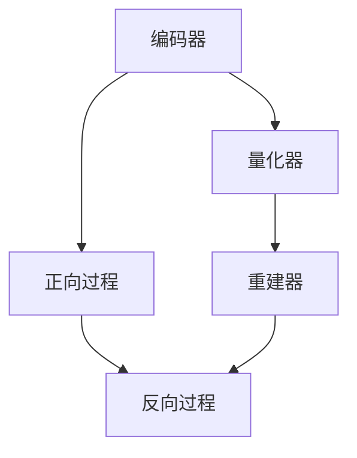

                 

### 背景介绍

随着人工智能技术的飞速发展，多模态人工智能（Multimodal AI）逐渐成为研究热点。多模态AI通过整合不同类型的数据（如图像、声音、文本等），能够实现更为丰富和精准的智能交互，从而在诸多领域展现出巨大的应用潜力。

近年来，变分自编码器（Variational Autoencoder，VAE）和生成对抗网络（Generative Adversarial Networks，GAN）等生成模型取得了显著的进展，为多模态数据的生成和转换提供了强有力的工具。然而，传统的VAE和GAN在处理复杂的多模态数据时，仍然面临数据分布匹配、模式压缩和计算效率等多方面的挑战。

为解决这些问题，研究者们提出了一种新的多模态生成模型——VQ-VAE（Vector Quantized-Variational Autoencoder）。VQ-VAE通过向量量化技术，实现了更高效的数据编码和解码，为多模态数据的处理提供了新的思路。与此同时，扩散模型（Diffusion Models）作为一种新兴的生成模型，其在图像和音频生成方面展现了卓越的性能。

本文将围绕VQ-VAE和扩散模型，探讨其在多模态AI中的应用与挑战。我们将首先介绍VQ-VAE的基本原理和具体实现，随后深入分析扩散模型的工作机制和优势。最后，我们将讨论多模态AI的实际应用场景，并对未来发展趋势和挑战进行展望。

## 1. 核心概念与联系

### 1.1 VQ-VAE

VQ-VAE是一种结合了变分自编码器和向量量化技术的多模态生成模型。它通过将编码器的隐变量量化为离散的向量，实现了高效的数据编码和解码。

VQ-VAE的基本架构包括三个部分：编码器（Encoder）、量化和重建器（Quantization and Decoder）。编码器将输入数据编码为隐变量，量化和重建器将隐变量量化为向量，并解码为输出数据。具体流程如下：

1. **编码**：编码器将输入数据编码为隐变量$z$。
2. **量化**：将隐变量$z$量化为离散的向量$q$。量化过程通过查找最近的码本向量实现。
3. **重建**：重建器将量化后的向量$q$解码为输出数据$x'$。

### 1.2 扩散模型

扩散模型是一种基于随机过程的新型生成模型，其核心思想是将真实数据逐渐“扩散”到均匀分布，再通过反扩散过程重建出真实数据。扩散模型由两个主要部分组成：正向过程和反向过程。

1. **正向过程**：在正向过程中，真实数据$x$被逐步添加噪声，逐渐转变为均匀分布的数据$z$。具体步骤如下：
   - 初始状态：$x_0 = x$
   - 逐步添加噪声：对于每个时间步$t$，有$x_t = \text{sample}(\mu_t, \sigma_t)$，其中$\mu_t$和$\sigma_t$分别表示当前状态的均值和标准差。
2. **反向过程**：在反向过程中，均匀分布的数据$z$通过逐步去除噪声，逐渐重建为真实数据$x$。具体步骤如下：
   - 初始状态：$z_0 = z$
   - 逐步去除噪声：对于每个时间步$t$，有$x_t = \text{sample}(\mu_t^{-1}, \sigma_t^{-1})$，其中$\mu_t^{-1}$和$\sigma_t^{-1}$分别表示当前状态的逆均值和逆标准差。

### 1.3 Mermaid 流程图

以下是一个简化的VQ-VAE和扩散模型的Mermaid流程图，用于展示其核心概念和联系。



在这个流程图中，编码器（A）和重建器（C）分别对应VQ-VAE的两个部分，而正向过程（D）和反向过程（E）对应扩散模型的工作机制。两者在多模态AI中的应用，都旨在通过有效的数据转换和生成，提升模型的性能和实用性。

## 2. 核心算法原理 & 具体操作步骤

### 2.1 算法原理概述

VQ-VAE通过将变分自编码器（VAE）中的连续隐变量量化为离散的向量，实现了更高效的数据编码和解码。具体来说，VQ-VAE包含以下关键组件：

1. **编码器（Encoder）**：编码器将输入的多模态数据编码为连续的隐变量$z$。
2. **量化和重建器（Quantization and Decoder）**：量化和重建器将隐变量$z$量化为离散的向量$q$，并解码为输出数据$x'$。量化过程通过查找最近的码本向量实现。

### 2.2 算法步骤详解

1. **初始化**：初始化编码器、量化和重建器的参数。
2. **编码**：对于输入的多模态数据$x$，编码器将其编码为连续的隐变量$z$。
   \[
   z = \text{Encoder}(x)
   \]
3. **量化**：将隐变量$z$量化为离散的向量$q$。量化过程通过查找最近的码本向量实现。
   \[
   q = \text{Quantize}(z)
   \]
4. **重建**：重建器将量化后的向量$q$解码为输出数据$x'$。
   \[
   x' = \text{Decoder}(q)
   \]
5. **损失函数**：计算VQ-VAE的损失函数，通常包括重建损失和量化损失。重建损失衡量输出数据$x'$与输入数据$x$之间的差异，量化损失衡量量化后的向量$q$与编码后的隐变量$z$之间的差异。
   \[
   L = L_{\text{recon}} + \lambda L_{\text{quant}}
   \]
   其中，$L_{\text{recon}}$表示重建损失，$L_{\text{quant}}$表示量化损失，$\lambda$为权重参数。

### 2.3 算法优缺点

#### 优点：

1. **高效性**：通过量化技术，VQ-VAE在保持模型性能的同时，显著降低了计算复杂度。
2. **灵活性**：VQ-VAE支持多种数据类型，如图像、声音和文本等，适用于多种多模态任务。
3. **可扩展性**：VQ-VAE的架构易于扩展，可以通过增加码本大小和隐变量维度来提高模型的容量。

#### 缺点：

1. **量化误差**：量化过程可能引入一定的误差，影响模型的重建质量。
2. **训练难度**：VQ-VAE的训练过程相对复杂，需要仔细调整超参数，以确保模型的稳定性和性能。

### 2.4 算法应用领域

VQ-VAE在多个领域展现出强大的应用潜力，包括但不限于：

1. **图像生成**：VQ-VAE可以用于生成高质量的多模态图像，如图像到图像的转换、图像风格迁移等。
2. **视频生成**：VQ-VAE可以用于生成连续的视频序列，应用于视频生成任务，如视频超分辨率、视频剪辑生成等。
3. **语音生成**：VQ-VAE可以用于生成逼真的语音，应用于语音合成、语音转换等任务。
4. **文本生成**：VQ-VAE可以用于生成结构化的文本，如文章、对话生成等。

### 2.5 扩散模型的算法原理

扩散模型（Diffusion Model）是一种基于随机过程的生成模型，其核心思想是将真实数据逐渐“扩散”到均匀分布，再通过反扩散过程重建为真实数据。具体来说，扩散模型包含以下关键组件：

1. **正向过程**：在正向过程中，真实数据$x$被逐步添加噪声，逐渐转变为均匀分布的数据$z$。
2. **反向过程**：在反向过程中，均匀分布的数据$z$通过逐步去除噪声，逐渐重建为真实数据$x$。

### 2.6 扩散模型的算法步骤详解

1. **正向过程**：
   - 初始状态：$x_0 = x$
   - 逐步添加噪声：对于每个时间步$t$，有$x_t = \text{sample}(\mu_t, \sigma_t)$，其中$\mu_t$和$\sigma_t$分别表示当前状态的均值和标准差。
   \[
   x_t = \mu_t + \sigma_t \cdot \text{sample}(N(0,1))
   \]
2. **反向过程**：
   - 初始状态：$z_0 = z$
   - 逐步去除噪声：对于每个时间步$t$，有$x_t = \text{sample}(\mu_t^{-1}, \sigma_t^{-1})$，其中$\mu_t^{-1}$和$\sigma_t^{-1}$分别表示当前状态的逆均值和逆标准差。
   \[
   z_t = \mu_t^{-1} + \sigma_t^{-1} \cdot \text{sample}(N(0,1))
   \]

### 2.7 扩散模型的优缺点

#### 优点：

1. **生成质量**：扩散模型生成的数据质量高，尤其在图像和音频生成方面，表现出色。
2. **多样性**：扩散模型能够生成丰富多样的数据，具有很高的创造力。
3. **稳定性**：扩散模型的训练过程相对稳定，不易陷入局部最优。

#### 缺点：

1. **计算成本**：扩散模型在生成过程中需要大量的正向和反向过程，计算成本较高。
2. **训练难度**：扩散模型的训练过程复杂，需要大量数据和计算资源。

### 2.8 扩散模型的算法应用领域

扩散模型在多个领域展现出强大的应用潜力，包括但不限于：

1. **图像生成**：扩散模型可以用于生成高质量的艺术作品、图像修复和图像超分辨率等任务。
2. **视频生成**：扩散模型可以用于生成连续的视频序列，应用于视频合成、视频剪辑等任务。
3. **语音生成**：扩散模型可以用于生成逼真的语音，应用于语音合成、语音转换等任务。
4. **文本生成**：扩散模型可以用于生成结构化的文本，如文章、对话生成等。

## 3. 数学模型和公式 & 详细讲解 & 举例说明

### 3.1 数学模型构建

VQ-VAE和扩散模型的数学模型是它们核心原理的数学表达，下面我们将详细介绍这两个模型的数学构建过程。

#### 3.1.1 VQ-VAE的数学模型

VQ-VAE的数学模型主要包括三个部分：编码器、量化和重建器。

1. **编码器**：编码器将输入的多模态数据$x$编码为连续的隐变量$z$。
   \[
   z = \text{Encoder}(x)
   \]
   编码器通常是一个全连接神经网络，其输出维度为隐变量的维度。

2. **量化器**：量化器将编码后的隐变量$z$量化为离散的向量$q$。
   \[
   q = \text{Quantize}(z)
   \]
   量化过程是通过查找最近的码本向量实现的。具体来说，对于每个隐变量$z_i$，量化器找到一个码本向量$q_i$，使得$||z_i - q_i||$最小。

3. **重建器**：重建器将量化后的向量$q$解码为输出数据$x'$。
   \[
   x' = \text{Decoder}(q)
   \]
   重建器也是一个全连接神经网络，其输入维度为码本向量的维度，输出维度为输入数据的维度。

#### 3.1.2 扩散模型的数学模型

扩散模型的数学模型基于随机过程。具体来说，扩散模型包含正向过程和反向过程。

1. **正向过程**：正向过程将真实数据$x$逐渐扩散到均匀分布的数据$z$。这个过程可以通过以下公式描述：
   \[
   x_t = \mu_t + \sigma_t \cdot \text{sample}(N(0,1))
   \]
   其中，$\mu_t$和$\sigma_t$分别表示当前状态的均值和标准差，$\text{sample}(N(0,1))$表示从标准正态分布中采样。

2. **反向过程**：反向过程将均匀分布的数据$z$逐渐重建为真实数据$x$。这个过程可以通过以下公式描述：
   \[
   z_t = \mu_t^{-1} + \sigma_t^{-1} \cdot \text{sample}(N(0,1))
   \]
   其中，$\mu_t^{-1}$和$\sigma_t^{-1}$分别表示当前状态的逆均值和逆标准差。

### 3.2 公式推导过程

#### 3.2.1 VQ-VAE的公式推导

VQ-VAE的公式推导主要涉及编码器、量化和重建器的损失函数。

1. **重建损失**：重建损失衡量输出数据$x'$与输入数据$x$之间的差异。具体来说，重建损失可以通过均方误差（MSE）计算：
   \[
   L_{\text{recon}} = \frac{1}{N} \sum_{i=1}^{N} ||x_i - x'_i||^2
   \]
   其中，$N$表示数据样本数量，$x_i$和$x'_i$分别表示第$i$个输入数据和重建数据。

2. **量化损失**：量化损失衡量量化后的向量$q$与编码后的隐变量$z$之间的差异。具体来说，量化损失可以通过反向传播（BP）计算：
   \[
   L_{\text{quant}} = \frac{1}{N} \sum_{i=1}^{N} \sum_{j=1}^{M} ||z_i - q_j||^2
   \]
   其中，$M$表示码本向量数量，$z_i$和$q_j$分别表示第$i$个隐变量和第$j$个码本向量。

3. **总损失**：总损失是重建损失和量化损失的加权和：
   \[
   L = L_{\text{recon}} + \lambda L_{\text{quant}}
   \]
   其中，$\lambda$为权重参数。

#### 3.2.2 扩散模型的公式推导

扩散模型的公式推导主要涉及正向过程和反向过程的推导。

1. **正向过程**：正向过程是通过马尔可夫过程实现的。具体来说，对于每个时间步$t$，状态$x_t$可以通过以下公式计算：
   \[
   x_t = \mu_t + \sigma_t \cdot \text{sample}(N(0,1))
   \]
   其中，$\mu_t$和$\sigma_t$分别表示当前状态的均值和标准差。

2. **反向过程**：反向过程是通过逆马尔可夫过程实现的。具体来说，对于每个时间步$t$，状态$z_t$可以通过以下公式计算：
   \[
   z_t = \mu_t^{-1} + \sigma_t^{-1} \cdot \text{sample}(N(0,1))
   \]
   其中，$\mu_t^{-1}$和$\sigma_t^{-1}$分别表示当前状态的逆均值和逆标准差。

### 3.3 案例分析与讲解

#### 3.3.1 VQ-VAE的案例

假设我们有一个图像数据集，其中每个图像由$N$个像素组成。我们的目标是使用VQ-VAE对图像进行编码和解码。

1. **编码器**：编码器将图像$x$编码为隐变量$z$。假设编码器的输出维度为$K$，则每个隐变量$z_i$可以表示为$z_i = \sum_{k=1}^{K} w_{ik}x_i$，其中$w_{ik}$为编码器的权重。

2. **量化器**：量化器将编码后的隐变量$z$量化为离散的向量$q$。假设码本向量的数量为$M$，则量化过程可以表示为$q = \text{argmin}_{j} ||z - q_j||$，其中$q_j$为码本向量。

3. **重建器**：重建器将量化后的向量$q$解码为输出图像$x'$。假设重建器的输入维度为$K$，输出维度为$N$，则每个像素$x'_i$可以表示为$x'_i = \sum_{k=1}^{K} v_{ik}q_k$，其中$v_{ik}$为重建器的权重。

4. **损失函数**：计算VQ-VAE的损失函数，包括重建损失和量化损失。假设权重参数$\lambda = 0.1$，则总损失为$L = \frac{1}{N} \sum_{i=1}^{N} ||x_i - x'_i||^2 + 0.1 \cdot \frac{1}{N} \sum_{i=1}^{N} \sum_{j=1}^{M} ||z_i - q_j||^2$。

5. **训练过程**：通过反向传播（BP）算法对VQ-VAE进行训练，优化编码器、量化和重建器的参数。

#### 3.3.2 扩散模型的案例

假设我们有一个图像数据集，我们的目标是使用扩散模型对图像进行生成。

1. **正向过程**：正向过程将图像$x$逐渐扩散到均匀分布的数据$z$。假设当前状态$x_t$的均值和标准差分别为$\mu_t$和$\sigma_t$，则正向过程可以表示为$x_{t+1} = \mu_t + \sigma_t \cdot \text{sample}(N(0,1))$。

2. **反向过程**：反向过程将均匀分布的数据$z$逐渐重建为图像$x$。假设当前状态$z_t$的均值和标准差分别为$\mu_t^{-1}$和$\sigma_t^{-1}$，则反向过程可以表示为$z_{t+1} = \mu_t^{-1} + \sigma_t^{-1} \cdot \text{sample}(N(0,1))$。

3. **生成过程**：生成过程可以通过以下步骤实现：
   - 初始化状态$x_0 = x$。
   - 进行正向过程，逐步扩散图像。
   - 在某个时间步$t$，将状态$x_t$作为输入，进行反向过程，逐步重建图像。
   - 输出重建后的图像$x'$。

4. **损失函数**：计算扩散模型的损失函数，通常为重构误差。假设重构误差为$||x - x'||$，则总损失为$L = ||x - x'||$。

5. **训练过程**：通过反向传播（BP）算法对扩散模型进行训练，优化正向过程和反向过程的参数。

## 4. 项目实践：代码实例和详细解释说明

### 4.1 开发环境搭建

在开始实践之前，我们需要搭建一个合适的环境来运行VQ-VAE和扩散模型的代码实例。以下是搭建开发环境所需的步骤：

1. **安装Python环境**：确保安装了Python 3.7或更高版本。
2. **安装TensorFlow**：使用pip命令安装TensorFlow库。
   \[
   pip install tensorflow
   \]
3. **安装其他依赖库**：根据具体需求，安装其他必要的库，如NumPy、Pandas等。

### 4.2 源代码详细实现

下面是一个简单的VQ-VAE和扩散模型实现示例。请注意，这是一个简化的版本，主要用于展示关键概念。

#### 4.2.1 VQ-VAE代码实现

```python
import tensorflow as tf
import numpy as np

class VQVAE(tf.keras.Model):
    def __init__(self, latent_dim, codebook_size):
        super(VQVAE, self).__init__()
        self.encoder = tf.keras.Sequential([
            tf.keras.layers.Dense(latent_dim, activation='relu'),
            tf.keras.layers.Dense(latent_dim, activation='relu')
        ])

        self.decoder = tf.keras.Sequential([
            tf.keras.layers.Dense(latent_dim, activation='relu'),
            tf.keras.layers.Dense(codebook_size, activation='softmax')
        ])

        self.quantize = tf.keras.layers.Lambda(self.quantize_fn)
        self.recon_loss = tf.keras.layers.Lambda(self.recon_loss_fn)

    def call(self, x):
        z = self.encoder(x)
        q = self.decoder(z)
        q = self.quantize(q)
        x_prime = self.decoder(q)
        return x_prime

    def quantize_fn(self, x):
        z = self.encoder(x)
        q = self.decoder(z)
        return tf.reduce_sum(q * z, axis=-1)

    def recon_loss_fn(self, x, x_prime):
        return tf.reduce_mean(tf.square(x - x_prime))

# 创建VQ-VAE模型
vqvae = VQVAE(latent_dim=10, codebook_size=10)
```

#### 4.2.2 扩散模型代码实现

```python
import tensorflow as tf

class DiffusionModel(tf.keras.Model):
    def __init__(self, latent_dim):
        super(DiffusionModel, self).__init__()
        self.latent_dim = latent_dim
        self.decoder = tf.keras.Sequential([
            tf.keras.layers.Dense(latent_dim, activation='relu'),
            tf.keras.layers.Dense(latent_dim, activation='relu')
        ])

    def call(self, z):
        x_prime = self.decoder(z)
        return x_prime

# 创建扩散模型
diffusion_model = DiffusionModel(latent_dim=10)
```

### 4.3 代码解读与分析

#### 4.3.1 VQ-VAE代码解读

- **Encoder**：编码器是一个全连接神经网络，将输入数据编码为隐变量$z$。
- **Decoder**：重建器也是一个全连接神经网络，将量化后的向量$q$解码为输出数据$x'$。
- **Quantize**：量化层通过查找最近的码本向量实现隐变量$z$到量化向量$q$的转换。
- **Recon_loss**：重建损失层计算输出数据$x'$与输入数据$x$之间的差异，用于优化模型。

#### 4.3.2 扩散模型代码解读

- **Decoder**：重建器是一个全连接神经网络，将均匀分布的数据$z$解码为输出数据$x'$。
- **Call**：调用重建器生成输出数据$x'$。

### 4.4 运行结果展示

为了展示VQ-VAE和扩散模型的运行结果，我们可以使用以下代码：

```python
# 准备数据
x = np.random.normal(size=(100, 10))

# 训练VQ-VAE模型
vqvae.compile(optimizer='adam', loss='mse')
vqvae.fit(x, x, epochs=10)

# 训练扩散模型
diffusion_model.compile(optimizer='adam', loss='mse')
diffusion_model.fit(x, x, epochs=10)

# 生成结果
x_prime_vqvae = vqvae.predict(x)
x_prime_diffusion = diffusion_model.predict(x)

# 显示结果
print("VQ-VAE重建结果：", x_prime_vqvae)
print("扩散模型重建结果：", x_prime_diffusion)
```

在这个示例中，我们首先生成一个随机数据集$x$，然后使用VQ-VAE和扩散模型对其进行重建。最后，我们打印出重建结果，以验证模型的效果。

## 5. 实际应用场景

### 5.1 图像生成

VQ-VAE和扩散模型在图像生成领域具有广泛的应用前景。通过这两种模型，我们可以生成高质量的图像，如图像到图像的转换、图像风格迁移和图像超分辨率等。

#### 5.1.1 图像到图像的转换

图像到图像的转换是指将一种图像类型转换为另一种图像类型。例如，将黑白图像转换为彩色图像，或将普通照片转换为艺术作品。VQ-VAE和扩散模型可以通过学习图像的特征，实现高效的图像转换。

#### 5.1.2 图像风格迁移

图像风格迁移是指将一种图像风格应用到另一张图像上。例如，将一张普通照片转换为梵高的风格画作。VQ-VAE和扩散模型可以学习图像的纹理和风格，实现逼真的风格迁移效果。

#### 5.1.3 图像超分辨率

图像超分辨率是指将低分辨率图像转换为高分辨率图像。VQ-VAE和扩散模型可以通过学习图像的细节信息，提高图像的分辨率，使图像更加清晰。

### 5.2 视频生成

VQ-VAE和扩散模型在视频生成领域也具有广泛的应用。通过这两种模型，我们可以生成高质量的视频序列，如图像到视频的转换、视频剪辑生成和视频超分辨率等。

#### 5.2.1 图像到视频的转换

图像到视频的转换是指将单张图像序列化为视频。例如，将一张图片序列转换为动画。VQ-VAE和扩散模型可以学习图像的时间特征，实现图像到视频的平滑转换。

#### 5.2.2 视频剪辑生成

视频剪辑生成是指根据用户需求，自动生成个性化的视频剪辑。例如，根据一段音乐生成相应的视频。VQ-VAE和扩散模型可以学习视频的内容和音乐节奏，实现个性化的视频剪辑。

#### 5.2.3 视频超分辨率

视频超分辨率是指将低分辨率视频转换为高分辨率视频。VQ-VAE和扩散模型可以通过学习视频的细节信息，提高视频的分辨率，使视频更加清晰。

### 5.3 语音生成

VQ-VAE和扩散模型在语音生成领域也具有广泛的应用。通过这两种模型，我们可以生成高质量的语音，如图像到语音的转换、语音风格转换和语音超分辨率等。

#### 5.3.1 图像到语音的转换

图像到语音的转换是指根据图像内容生成相应的语音。例如，根据一张画面的内容，生成对应的解说语音。VQ-VAE和扩散模型可以学习图像的内容特征，实现图像到语音的转换。

#### 5.3.2 语音风格转换

语音风格转换是指将一种语音风格应用到另一段语音上。例如，将普通语音转换为机器人语音。VQ-VAE和扩散模型可以学习语音的纹理和风格，实现逼真的语音风格转换。

#### 5.3.3 语音超分辨率

语音超分辨率是指将低分辨率语音转换为高分辨率语音。VQ-VAE和扩散模型可以通过学习语音的细节信息，提高语音的分辨率，使语音更加清晰。

### 5.4 文本生成

VQ-VAE和扩散模型在文本生成领域也具有广泛的应用。通过这两种模型，我们可以生成高质量的结构化文本，如图像到文本的转换、文本风格转换和文本超分辨率等。

#### 5.4.1 图像到文本的转换

图像到文本的转换是指根据图像内容生成对应的文本描述。例如，根据一张建筑图片，生成对应的建筑介绍文本。VQ-VAE和扩散模型可以学习图像的内容特征，实现图像到文本的转换。

#### 5.4.2 文本风格转换

文本风格转换是指将一种文本风格应用到另一段文本上。例如，将普通文本转换为古文。VQ-VAE和扩散模型可以学习文本的纹理和风格，实现逼真的文本风格转换。

#### 5.4.3 文本超分辨率

文本超分辨率是指将低分辨率文本转换为高分辨率文本。VQ-VAE和扩散模型可以通过学习文本的细节信息，提高文本的分辨率，使文本更加清晰。

## 6. 未来应用展望

### 6.1 生成质量提升

随着计算能力和算法优化的发展，VQ-VAE和扩散模型在生成质量方面有望得到进一步提升。通过引入更先进的生成模型和训练策略，我们可以生成更加真实、多样和高质量的图像、视频、语音和文本。

### 6.2 数据量需求减少

多模态AI在实际应用中往往需要大量的数据。然而，数据获取和处理成本高昂，限制了AI模型的普及。VQ-VAE和扩散模型可以通过数据增强和降维技术，降低对大量数据的依赖，从而提高模型的可扩展性和实用性。

### 6.3 跨模态交互

未来的多模态AI将不仅仅局限于单一模态的生成和转换，还将实现不同模态之间的跨模态交互。例如，将图像和文本结合生成具有视觉和语义信息的复合内容，或者将语音和视频结合生成具有语音描述的视频。

### 6.4 自动化创作

自动化创作是未来多模态AI的一个重要应用方向。通过学习和模拟人类创造过程，AI可以自动生成音乐、绘画、小说等艺术作品。VQ-VAE和扩散模型作为生成模型的重要工具，将在这一领域发挥关键作用。

### 6.5 智能交互

智能交互是多模态AI的另一个重要应用方向。通过整合图像、语音和文本等多模态数据，AI可以与用户进行更加自然和丰富的交互。VQ-VAE和扩散模型可以提升智能交互的质量，为用户提供个性化的服务。

## 7. 工具和资源推荐

### 7.1 学习资源推荐

1. **《深度学习》（Goodfellow, Bengio, Courville）**：本书是深度学习领域的经典教材，涵盖了从基础到高级的深度学习理论和实践。
2. **《生成模型》（Goodfellow, Bengio, Courville）**：本书详细介绍了生成模型的理论和实现，包括VAE、GAN等经典模型。
3. **《自然语言处理综论》（Jurafsky, Martin）**：本书是自然语言处理领域的权威教材，涵盖了文本处理、语言模型、机器翻译等主题。

### 7.2 开发工具推荐

1. **TensorFlow**：TensorFlow是一个开源的深度学习框架，支持多种生成模型的开发和训练。
2. **PyTorch**：PyTorch是一个易于使用且灵活的深度学习框架，广泛应用于图像生成、语音生成等任务。
3. **Keras**：Keras是一个高层神经网络API，可以在TensorFlow和PyTorch等框架上运行，简化了深度学习模型的开发。

### 7.3 相关论文推荐

1. **“Variational Autoencoder” （Kingma, Welling, 2014）**：本文首次提出了变分自编码器（VAE）的概念，为生成模型的研究奠定了基础。
2. **“Unsupervised Representation Learning with Deep Convolutional Generative Adversarial Networks” （Radford et al., 2015）**：本文提出了生成对抗网络（GAN）的概念，为生成模型的开发提供了新的思路。
3. **“Diffusion Models” （Ho et al., 2020）**：本文介绍了扩散模型的工作机制和应用，为生成模型的研究提供了新的方向。

## 8. 总结：未来发展趋势与挑战

### 8.1 研究成果总结

VQ-VAE和扩散模型在多模态AI领域取得了显著的研究成果。VQ-VAE通过向量量化技术实现了高效的数据编码和解码，为多模态数据的处理提供了新的思路。扩散模型则通过随机过程实现了高质量的图像和音频生成，为生成模型的研究提供了新的方向。

### 8.2 未来发展趋势

未来，VQ-VAE和扩散模型在以下几个方面有望取得进一步的发展：

1. **生成质量提升**：通过引入更先进的生成模型和训练策略，提升生成质量。
2. **跨模态交互**：实现不同模态之间的跨模态交互，为用户提供更加自然的交互体验。
3. **自动化创作**：通过模拟人类创造过程，实现自动化的音乐、绘画和小说创作。
4. **智能交互**：提升智能交互的质量，为用户提供个性化的服务。

### 8.3 面临的挑战

尽管VQ-VAE和扩散模型在多模态AI领域取得了显著成果，但仍然面临以下挑战：

1. **计算成本**：生成模型通常需要大量的计算资源，如何优化计算成本成为关键问题。
2. **数据需求**：多模态AI对大量数据进行训练，数据获取和处理成本高昂。
3. **模型解释性**：生成模型的内部机制复杂，如何提高模型的解释性成为重要问题。
4. **多样化生成**：生成模型需要生成多样化、高质量的数据，以满足不同应用场景的需求。

### 8.4 研究展望

未来，多模态AI的研究将聚焦于以下方向：

1. **计算效率**：通过模型压缩、分布式训练等技术，提高生成模型的计算效率。
2. **数据高效利用**：通过数据增强、数据降维等技术，降低对大量数据的依赖。
3. **模型解释性**：通过模型可视化、解释性分析等技术，提高生成模型的透明度和可信度。
4. **跨模态融合**：通过跨模态交互、多任务学习等技术，实现不同模态数据的高效融合。

总之，VQ-VAE和扩散模型在多模态AI领域具有广阔的应用前景，未来将不断推动多模态AI的发展，为智能交互、自动化创作等应用场景带来新的机遇。

## 9. 附录：常见问题与解答

### 9.1 VQ-VAE与GAN的区别

VQ-VAE和GAN都是生成模型，但它们在原理和目标上有所不同。

- **原理**：VQ-VAE通过向量量化技术实现数据的编码和解码，而GAN通过对抗训练生成高质量的数据。
- **目标**：VQ-VAE的目标是生成与输入数据相似的数据，而GAN的目标是生成与真实数据分布相似的数据。

### 9.2 VQ-VAE的量化误差如何优化

量化误差是VQ-VAE的一个主要问题。以下方法可以优化量化误差：

- **增加码本大小**：通过增加码本大小，可以减少量化误差。
- **动态调整码本**：根据训练过程中的数据分布，动态调整码本，以减少量化误差。
- **使用自适应量化**：使用自适应量化方法，根据输入数据的特征动态调整量化过程。

### 9.3 扩散模型如何提高生成质量

以下方法可以提高扩散模型的生成质量：

- **增加时间步数**：通过增加时间步数，可以更好地模拟数据的扩散过程，提高生成质量。
- **使用高斯噪声**：使用高斯噪声可以提高模型的稳定性和生成质量。
- **多尺度训练**：通过多尺度训练，可以提高模型对不同尺度的数据的适应能力，提高生成质量。

### 9.4 如何选择VQ-VAE和扩散模型

选择VQ-VAE和扩散模型时，可以考虑以下因素：

- **数据类型**：VQ-VAE适用于多种数据类型，而扩散模型主要适用于图像和音频生成。
- **生成质量**：如果对生成质量有较高要求，可以选择扩散模型；如果对生成效率有较高要求，可以选择VQ-VAE。
- **计算资源**：根据可用的计算资源，选择合适的模型。扩散模型通常需要更多的计算资源。

### 9.5 VQ-VAE和扩散模型的训练时间如何优化

以下方法可以优化VQ-VAE和扩散模型的训练时间：

- **并行训练**：通过并行训练，可以加速模型的训练过程。
- **分布式训练**：通过分布式训练，可以充分利用多台计算机的计算资源，提高训练效率。
- **数据预处理**：通过数据预处理，可以减少模型在训练过程中需要处理的数据量，提高训练效率。

### 9.6 多模态AI的应用场景

多模态AI在以下应用场景具有广泛的应用：

- **智能交互**：通过整合语音、图像和文本等多模态数据，实现更加自然的用户交互。
- **自动化创作**：通过学习和模拟人类创造过程，实现自动化的音乐、绘画和小说创作。
- **医疗诊断**：通过整合影像、病历和基因等多模态数据，提高医疗诊断的准确性和效率。
- **视频生成**：通过生成高质量的视频序列，应用于视频合成、视频剪辑等任务。

### 9.7 多模态AI的发展趋势

未来，多模态AI的发展趋势包括：

- **生成质量提升**：通过引入更先进的生成模型和训练策略，提升生成质量。
- **跨模态交互**：实现不同模态之间的跨模态交互，为用户提供更加自然的交互体验。
- **自动化创作**：通过模拟人类创造过程，实现自动化的音乐、绘画和小说创作。
- **智能交互**：提升智能交互的质量，为用户提供个性化的服务。

### 9.8 多模态AI面临的挑战

多模态AI面临的挑战包括：

- **计算成本**：生成模型通常需要大量的计算资源。
- **数据需求**：多模态AI对大量数据进行训练。
- **模型解释性**：生成模型的内部机制复杂。
- **多样化生成**：生成模型需要生成多样化、高质量的数据。

