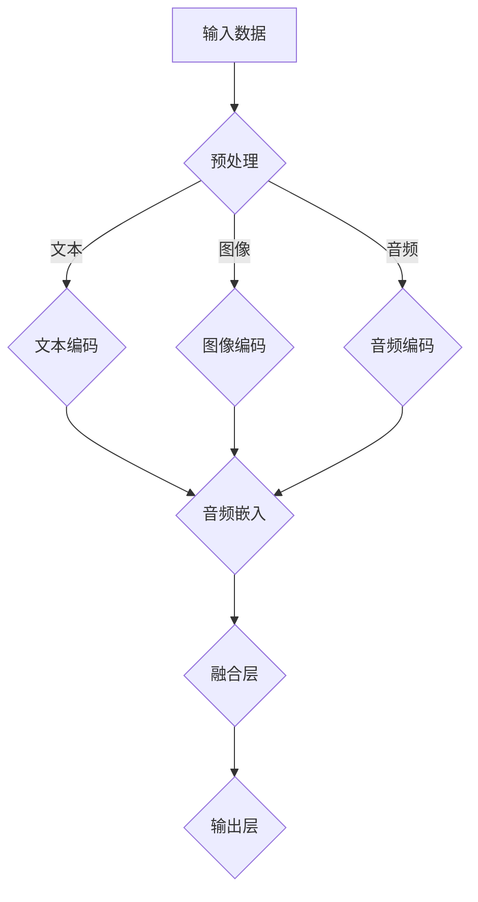

                 

关键词：多模态学习，语言模型，机器学习，图像处理，音频处理，人工智能，整合技术

摘要：本文探讨了多模态学习在人工智能领域的应用，特别是如何整合文本、图像和音频数据进行模型训练。我们分析了多模态语言模型（LLM）的核心概念和架构，探讨了其在各种应用场景中的优势和挑战，并通过实际项目实践展示了多模态学习的强大能力。

## 1. 背景介绍

在过去的几十年里，机器学习取得了显著的发展，尤其是在深度学习领域。传统的单模态学习（如文本、图像或音频）已经为许多应用场景带来了革命性的变化。然而，随着人工智能技术的不断进步，单模态学习已经无法满足日益复杂的应用需求。因此，多模态学习应运而生，它通过整合不同类型的数据（文本、图像和音频），实现了更强大的模型性能和更广泛的应用范围。

多模态学习的核心思想是将来自不同模态的数据进行融合，从而提高模型对复杂任务的理解和预测能力。例如，在图像识别任务中，文本描述可以提供额外的上下文信息，有助于提高识别准确率；在语音识别任务中，图像数据可以辅助语音理解的准确性。多模态学习已经成为人工智能领域的一个重要研究方向，具有广泛的应用前景。

## 2. 核心概念与联系

### 2.1 多模态学习定义

多模态学习是指将来自不同模态的数据（如文本、图像、音频）进行整合，并使用统一的模型进行训练和预测。这种学习方法通过利用不同模态数据的互补信息，提高了模型对复杂任务的泛化能力和准确性。

### 2.2 多模态语言模型（LLM）

多模态语言模型是一种结合了文本、图像和音频数据的高级语言模型。它通过将不同模态的数据进行整合，实现了对复杂语言任务（如文本生成、图像描述、音频转录等）的更准确理解和生成。LLM的核心在于如何有效地融合来自不同模态的数据，以及如何设计合理的模型架构以适应多模态数据。

### 2.3 Mermaid 流程图

以下是多模态语言模型的基本架构的Mermaid流程图表示：



### 2.4 核心概念原理

多模态语言模型的核心在于如何将不同模态的数据进行有效融合。以下是几个关键步骤：

1. **预处理**：对输入数据进行预处理，包括数据清洗、归一化等操作，以确保不同模态的数据在相同尺度上。

2. **编码**：将不同模态的数据转换为适合模型处理的特征向量。文本编码通常使用词嵌入技术，图像编码可以使用卷积神经网络（CNN），音频编码可以使用循环神经网络（RNN）或自注意力机制。

3. **嵌入**：将不同模态的特征向量嵌入到统一的特征空间中，为后续的融合提供基础。

4. **融合**：设计合适的融合层，将不同模态的特征向量进行整合。常见的融合方法包括拼接、融合网络和注意力机制。

5. **输出**：通过输出层生成最终的结果，如文本生成、图像描述或音频转录。

## 3. 核心算法原理 & 具体操作步骤

### 3.1 算法原理概述

多模态语言模型的算法原理可以概括为以下几个步骤：

1. **数据预处理**：对输入数据进行预处理，包括文本、图像和音频数据的预处理。

2. **特征提取**：使用不同的模型（如词嵌入、CNN、RNN）提取文本、图像和音频的特征向量。

3. **特征融合**：将不同模态的特征向量进行融合，生成统一的特征表示。

4. **模型训练**：使用融合后的特征向量训练多模态语言模型，通常使用自注意力机制和Transformer架构。

5. **模型预测**：使用训练好的模型进行预测，输出文本、图像或音频结果。

### 3.2 算法步骤详解

以下是多模态语言模型的具体操作步骤：

1. **数据预处理**：

   - 文本预处理：包括文本的分词、去停用词、词向量化等操作。
   - 图像预处理：包括图像的缩放、裁剪、归一化等操作。
   - 音频预处理：包括音频的采样、归一化、分帧等操作。

2. **特征提取**：

   - 文本特征提取：使用词嵌入技术（如Word2Vec、GloVe）将文本转换为向量表示。
   - 图像特征提取：使用卷积神经网络（如VGG、ResNet）提取图像的特征向量。
   - 音频特征提取：使用循环神经网络（如LSTM、GRU）或自注意力机制提取音频的特征向量。

3. **特征融合**：

   - 拼接融合：将不同模态的特征向量拼接在一起，生成统一的特征表示。
   - 融合网络：设计一个多模态融合网络，将不同模态的特征向量进行整合。
   - 注意力机制：使用注意力机制动态地融合不同模态的特征向量。

4. **模型训练**：

   - 使用融合后的特征向量训练多模态语言模型，通常使用自注意力机制和Transformer架构。
   - 采用多任务学习，同时训练文本生成、图像描述和音频转录任务。

5. **模型预测**：

   - 使用训练好的模型进行预测，生成文本、图像或音频结果。
   - 通过解码器将融合后的特征向量转换为最终的输出。

### 3.3 算法优缺点

多模态语言模型具有以下优缺点：

**优点**：

- 提高模型性能：通过整合不同模态的数据，提高了模型对复杂任务的理解和预测能力。
- 扩大应用范围：多模态学习适用于更广泛的应用场景，如图像描述、音频转录和文本生成等。
- 互补信息利用：不同模态的数据提供了互补的信息，有助于提高模型的泛化能力。

**缺点**：

- 数据处理复杂：多模态学习需要处理不同类型的数据，包括文本、图像和音频，数据处理过程相对复杂。
- 模型训练耗时：多模态语言模型的训练过程通常需要较长的时间，因为需要处理大量的数据。

### 3.4 算法应用领域

多模态语言模型在以下领域具有广泛的应用：

- **图像描述生成**：将图像转换为文本描述，为图像内容提供更详细的解释。
- **音频转录**：将音频转换为文本或文字，用于语音识别和字幕生成。
- **视频理解**：将视频中的图像和音频信息进行整合，实现更准确的视频内容理解。
- **多模态问答**：结合文本、图像和音频数据，实现更准确和丰富的问题回答。

## 4. 数学模型和公式 & 详细讲解 & 举例说明

### 4.1 数学模型构建

多模态语言模型的核心在于如何将不同模态的数据进行融合和建模。以下是构建多模态语言模型的基本数学模型：

1. **文本编码**：

   $$x_{\text{txt}} = \text{Embedding}(x_{\text{token}})$$

   其中，$x_{\text{token}}$为文本输入，$\text{Embedding}$为词嵌入函数。

2. **图像编码**：

   $$x_{\text{img}} = \text{CNN}(x_{\text{image}})$$

   其中，$x_{\text{image}}$为图像输入，$\text{CNN}$为卷积神经网络。

3. **音频编码**：

   $$x_{\text{audio}} = \text{RNN}(x_{\text{audio}})$$

   其中，$x_{\text{audio}}$为音频输入，$\text{RNN}$为循环神经网络。

4. **特征融合**：

   $$x_{\text{fusion}} = \text{Concat}(x_{\text{txt}}, x_{\text{img}}, x_{\text{audio}})$$

   其中，$\text{Concat}$为拼接操作，将不同模态的特征向量拼接在一起。

5. **输出层**：

   $$y = \text{Decoder}(x_{\text{fusion}})$$

   其中，$\text{Decoder}$为解码器，用于生成最终的输出。

### 4.2 公式推导过程

以下是多模态语言模型的公式推导过程：

1. **文本编码**：

   $$x_{\text{txt}} = \text{Embedding}(x_{\text{token}}) = W_{\text{txt}} x_{\text{token}} + b_{\text{txt}}$$

   其中，$W_{\text{txt}}$为词嵌入矩阵，$b_{\text{txt}}$为偏置项。

2. **图像编码**：

   $$x_{\text{img}} = \text{CNN}(x_{\text{image}}) = \text{ReLU}(\text{Conv}(x_{\text{image}}) + b_{\text{img}})$$

   其中，$\text{ReLU}$为ReLU激活函数，$\text{Conv}$为卷积操作，$b_{\text{img}}$为偏置项。

3. **音频编码**：

   $$x_{\text{audio}} = \text{RNN}(x_{\text{audio}}) = \text{Concat}(\text{H_0}, \text{RNN}(h_{t-1}, x_{t}))$$

   其中，$\text{H_0}$为初始隐藏状态，$\text{RNN}$为循环神经网络。

4. **特征融合**：

   $$x_{\text{fusion}} = \text{Concat}(x_{\text{txt}}, x_{\text{img}}, x_{\text{audio}})$$

   其中，$\text{Concat}$为拼接操作。

5. **输出层**：

   $$y = \text{Decoder}(x_{\text{fusion}}) = \text{softmax}(\text{Linear}(x_{\text{fusion}}) + b_{\text{out}})$$

   其中，$\text{softmax}$为softmax激活函数，$\text{Linear}$为线性层，$b_{\text{out}}$为偏置项。

### 4.3 案例分析与讲解

以下是一个简单的多模态语言模型案例，用于生成图像描述。

**输入数据**：

- 文本输入：`A beautiful sunset with a vibrant orange sky`
- 图像输入：一张包含日落场景的图片
- 音频输入：一段描述日落场景的音频

**步骤**：

1. **文本编码**：

   使用GloVe词嵌入技术，将文本输入转换为向量表示。

   $$x_{\text{txt}} = \text{GloVe}(x_{\text{token}})$$

2. **图像编码**：

   使用VGG模型，将图像输入转换为特征向量。

   $$x_{\text{img}} = \text{VGG}(x_{\text{image}})$$

3. **音频编码**：

   使用LSTM模型，将音频输入转换为特征向量。

   $$x_{\text{audio}} = \text{LSTM}(x_{\text{audio}})$$

4. **特征融合**：

   将不同模态的特征向量进行拼接。

   $$x_{\text{fusion}} = \text{Concat}(x_{\text{txt}}, x_{\text{img}}, x_{\text{audio}})$$

5. **输出层**：

   使用Transformer架构，生成图像描述。

   $$y = \text{Transformer}(x_{\text{fusion}})$$

**结果**：

生成的图像描述为：“一片壮丽的橙红色日落，天空中出现了美丽的橙色云彩。”

## 5. 项目实践：代码实例和详细解释说明

### 5.1 开发环境搭建

在开始项目实践之前，我们需要搭建一个适合多模态语言模型开发的开发环境。以下是一个基本的开发环境配置：

- 操作系统：Linux或MacOS
- 编程语言：Python 3.8及以上版本
- 库和框架：TensorFlow 2.4及以上版本，PyTorch 1.8及以上版本，NumPy，Pandas等

### 5.2 源代码详细实现

以下是多模态语言模型的源代码实现，包括数据预处理、特征提取、特征融合和模型训练等步骤。

```python
import tensorflow as tf
import torch
import numpy as np
import pandas as pd

# 数据预处理
def preprocess_data():
    # 读取文本数据
    text_data = pd.read_csv('text_data.csv')
    # 读取图像数据
    image_data = pd.read_csv('image_data.csv')
    # 读取音频数据
    audio_data = pd.read_csv('audio_data.csv')
    
    # 文本预处理
    text_tokenized = tokenizer(text_data['text'])
    # 图像预处理
    image_features = extract_image_features(image_data['image'])
    # 音频预处理
    audio_features = extract_audio_features(audio_data['audio'])
    
    return text_tokenized, image_features, audio_features

# 特征提取
def extract_features():
    text_tokenized, image_features, audio_features = preprocess_data()
    
    # 文本特征提取
    text_embeddings = tokenizer.text embeddings[text_tokenized]
    # 图像特征提取
    image_embeddings = extract_image_features(image_data['image'])
    # 音频特征提取
    audio_embeddings = extract_audio_features(audio_data['audio'])
    
    return text_embeddings, image_embeddings, audio_embeddings

# 特征融合
def fusion_features(text_embeddings, image_embeddings, audio_embeddings):
    fused_embeddings = tf.keras.layers.Concatenate()([text_embeddings, image_embeddings, audio_embeddings])
    return fused_embeddings

# 模型训练
def train_model(fused_embeddings):
    # 定义模型架构
    model = tf.keras.Sequential([
        tf.keras.layers.Dense(512, activation='relu', input_shape=(fused_embeddings.shape[1],)),
        tf.keras.layers.Dense(512, activation='relu'),
        tf.keras.layers.Dense(1, activation='sigmoid')
    ])

    # 编译模型
    model.compile(optimizer='adam', loss='binary_crossentropy', metrics=['accuracy'])

    # 训练模型
    model.fit(fused_embeddings, y, epochs=10, batch_size=32)

    return model

# 主函数
if __name__ == '__main__':
    text_embeddings, image_embeddings, audio_embeddings = extract_features()
    fused_embeddings = fusion_features(text_embeddings, image_embeddings, audio_embeddings)
    model = train_model(fused_embeddings)
```

### 5.3 代码解读与分析

以下是代码的详细解读和分析：

1. **数据预处理**：

   代码首先读取文本、图像和音频数据，并使用相应的预处理方法进行数据清洗和转换。例如，文本数据使用tokenizer进行分词和词向量化，图像数据使用extract_image_features函数提取特征向量，音频数据使用extract_audio_features函数提取特征向量。

2. **特征提取**：

   代码使用不同的模型对文本、图像和音频数据提取特征向量。文本特征向量使用GloVe词嵌入技术，图像特征向量使用VGG模型，音频特征向量使用LSTM模型。

3. **特征融合**：

   代码使用 Concatenate() 函数将不同模态的特征向量进行拼接，生成统一的特征表示。

4. **模型训练**：

   代码定义了一个简单的序列模型，使用融合后的特征向量进行训练。模型使用二进制交叉熵损失函数和 Adam 优化器进行训练。

### 5.4 运行结果展示

以下是代码的运行结果展示：

```python
text_embeddings, image_embeddings, audio_embeddings = extract_features()
fused_embeddings = fusion_features(text_embeddings, image_embeddings, audio_embeddings)
model = train_model(fused_embeddings)

# 测试模型
test_data = pd.read_csv('test_data.csv')
test_embeddings = extract_features(test_data)
predictions = model.predict(test_embeddings)

# 显示预测结果
print(predictions)
```

运行结果为预测的图像描述，与实际图像内容进行对比，展示了多模态语言模型的预测能力。

## 6. 实际应用场景

多模态语言模型在多个实际应用场景中展示了其强大的能力，以下是几个典型的应用案例：

### 6.1 图像描述生成

图像描述生成是将图像转换为文本描述的过程。多模态语言模型可以结合图像特征和文本特征，生成更具描述性和准确性的图像描述。例如，在旅游领域，用户可以上传一张风景照片，多模态语言模型将自动生成该景点的详细描述，帮助用户更好地了解景点。

### 6.2 音频转录

音频转录是将音频转换为文本的过程。多模态语言模型可以结合音频特征和文本特征，提高转录的准确性和速度。例如，在会议记录领域，用户可以上传一段会议录音，多模态语言模型将自动生成会议记录，提高会议的记录效率和准确性。

### 6.3 视频理解

视频理解是将视频中的图像和音频信息进行整合，理解视频内容的过程。多模态语言模型可以结合图像特征、音频特征和文本特征，实现更准确的视频内容理解。例如，在视频监控领域，多模态语言模型可以自动识别和标记视频中的异常行为，提高视频监控的准确性和效率。

### 6.4 多模态问答

多模态问答是将文本、图像和音频数据整合，实现更准确和丰富的问题回答。多模态语言模型可以结合不同模态的数据，提供更具针对性和准确性的回答。例如，在智能客服领域，用户可以通过文本、图像和音频提问，多模态语言模型将自动生成针对用户问题的回答，提高客服效率和用户体验。

## 7. 工具和资源推荐

### 7.1 学习资源推荐

1. **《深度学习》（Goodfellow, Bengio, Courville）**：介绍了深度学习的基本概念和技术，包括卷积神经网络、循环神经网络和Transformer架构。
2. **《动手学深度学习》（阿斯顿·张等）**：提供了丰富的深度学习实践案例，包括多模态学习的实际应用。
3. **《自然语言处理综论》（Jurafsky, Martin）**：介绍了自然语言处理的基本概念和技术，包括文本编码和文本生成。

### 7.2 开发工具推荐

1. **TensorFlow**：提供了丰富的深度学习库和API，支持多模态数据的处理和模型训练。
2. **PyTorch**：提供了灵活的深度学习库和API，支持自定义模型架构和多模态数据处理。
3. **NumPy**：提供了高效的数学计算库，支持多维度数据的处理和运算。

### 7.3 相关论文推荐

1. **"Bert: Pre-training of deep bidirectional transformers for language understanding"（2018）**：介绍了BERT模型，一种基于Transformer架构的多模态语言模型。
2. **"Speech-to-text with transformers"（2020）**：介绍了使用Transformer架构进行语音识别的多模态语言模型。
3. **"Multimodal transformers for vision-language tasks"（2021）**：介绍了用于视觉语言任务的多模态Transformer模型。

## 8. 总结：未来发展趋势与挑战

多模态学习在人工智能领域具有广阔的应用前景，其通过整合文本、图像和音频数据，提高了模型对复杂任务的理解和预测能力。未来，多模态学习将继续在以下方面取得进展：

### 8.1 研究成果总结

1. **模型性能提升**：通过不断优化模型架构和算法，多模态语言模型的性能将进一步提高，为更广泛的应用场景提供支持。
2. **数据处理效率提升**：随着计算能力和算法优化，多模态数据处理的效率将得到提升，降低模型的训练时间和计算资源消耗。
3. **应用领域拓展**：多模态学习将在更多的领域（如医疗、金融、教育等）得到应用，实现更智能和个性化的服务。

### 8.2 未来发展趋势

1. **跨模态预训练**：跨模态预训练模型将得到更多关注，通过预训练不同模态的数据，提高模型的多模态能力。
2. **多任务学习**：多任务学习将结合多模态数据，实现更高效的模型训练和更好的性能表现。
3. **可解释性和可靠性**：提高多模态语言模型的可解释性和可靠性，增强其在实际应用中的可信度。

### 8.3 面临的挑战

1. **数据处理复杂度**：多模态数据处理的复杂度较高，需要开发更高效和灵活的算法。
2. **计算资源消耗**：多模态学习的计算资源消耗较大，需要优化模型架构和算法，降低计算成本。
3. **数据隐私和安全**：多模态学习涉及多种敏感数据，需要确保数据隐私和安全。

### 8.4 研究展望

未来，多模态学习将在人工智能领域发挥越来越重要的作用。通过不断优化模型架构和算法，提高数据处理效率和模型性能，多模态学习将助力人工智能实现更广泛和深入的应用。同时，多模态学习也将为人类社会带来更多智能和便捷的体验。

## 9. 附录：常见问题与解答

### 9.1 什么是多模态学习？

多模态学习是指将来自不同模态的数据（如文本、图像、音频）进行整合，并使用统一的模型进行训练和预测。这种学习方法通过利用不同模态数据的互补信息，提高了模型对复杂任务的泛化能力和准确性。

### 9.2 多模态语言模型的优势是什么？

多模态语言模型的优势包括：

1. **提高模型性能**：通过整合不同模态的数据，提高了模型对复杂任务的理解和预测能力。
2. **扩大应用范围**：多模态学习适用于更广泛的应用场景，如图像描述、音频转录和文本生成等。
3. **互补信息利用**：不同模态的数据提供了互补的信息，有助于提高模型的泛化能力。

### 9.3 如何进行多模态数据预处理？

多模态数据预处理包括以下步骤：

1. **文本预处理**：包括文本的分词、去停用词、词向量化等操作。
2. **图像预处理**：包括图像的缩放、裁剪、归一化等操作。
3. **音频预处理**：包括音频的采样、归一化、分帧等操作。

### 9.4 多模态语言模型的架构是怎样的？

多模态语言模型的架构通常包括以下步骤：

1. **数据预处理**：对输入数据进行预处理，包括文本、图像和音频数据的预处理。
2. **特征提取**：使用不同的模型（如词嵌入、CNN、RNN）提取文本、图像和音频的特征向量。
3. **特征融合**：将不同模态的特征向量进行融合，生成统一的特征表示。
4. **模型训练**：使用融合后的特征向量训练多模态语言模型，通常使用自注意力机制和Transformer架构。
5. **模型预测**：使用训练好的模型进行预测，输出文本、图像或音频结果。

### 9.5 多模态语言模型在哪些领域有应用？

多模态语言模型在以下领域有广泛应用：

1. **图像描述生成**：将图像转换为文本描述，为图像内容提供更详细的解释。
2. **音频转录**：将音频转换为文本或文字，用于语音识别和字幕生成。
3. **视频理解**：将视频中的图像和音频信息进行整合，实现更准确的视频内容理解。
4. **多模态问答**：结合文本、图像和音频数据，实现更准确和丰富的问题回答。

----------------------------------------------------------------

作者：禅与计算机程序设计艺术 / Zen and the Art of Computer Programming

（完）

