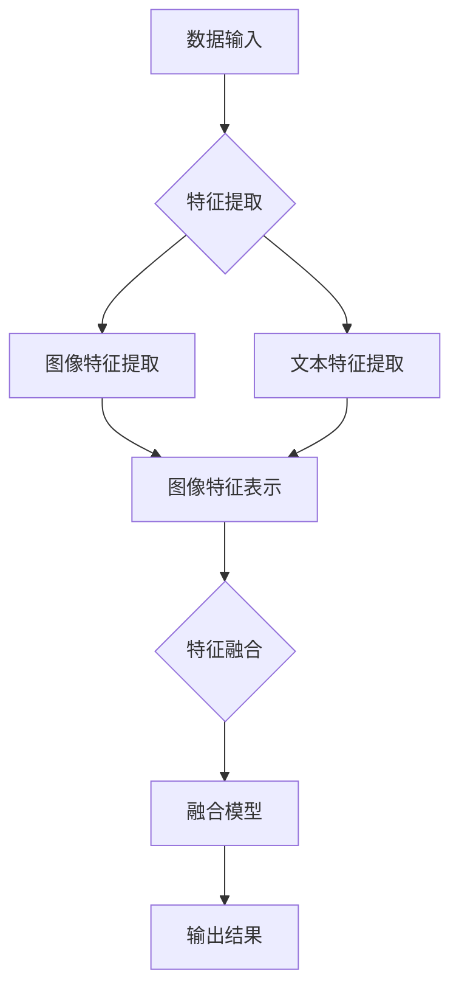

                 

关键词：多模态学习、语言模型、视觉模型、信息融合、计算机视觉、自然语言处理、深度学习、人工智能、神经网络、机器学习。

> 摘要：本文深入探讨了多模态学习这一前沿研究领域，重点分析了语言模型与视觉模型的结合方法及其应用。通过对多模态学习核心概念、算法原理、数学模型、实践案例的详细阐述，本文旨在为读者提供一个全面的指南，帮助理解多模态学习的重要性和实际应用。

## 1. 背景介绍

多模态学习是一个跨学科的领域，它结合了自然语言处理（NLP）和计算机视觉（CV）技术，以实现更高效的信息处理和更丰富的应用场景。传统的单一模态方法，无论是文本处理还是图像分析，都存在一定的局限性。例如，NLP擅长处理文本数据，但在理解图像内容方面存在不足；而CV在图像识别和物体检测上表现出色，但难以理解文本的语义信息。因此，多模态学习应运而生，旨在通过整合不同模态的信息，提高系统的理解和决策能力。

多模态学习的核心思想是将来自不同模态的数据（如图像、文本、声音等）进行融合，从而提升信息处理的准确性和鲁棒性。这种方法在许多领域都有着广泛的应用潜力，包括图像识别、语义理解、情感分析、自动驾驶、医疗诊断等。

### 1.1 多模态学习的应用场景

多模态学习的应用场景非常广泛，以下是其中一些典型的例子：

- **图像识别与文本描述**：将图像和文本描述相结合，可以更准确地识别图像内容。例如，在图像搜索应用中，用户可以输入关键词来查询包含相应图像的数据库。

- **情感分析**：结合文本和语音信息，可以更准确地识别用户的情感状态，例如在客服机器人、社交媒体监控等领域。

- **自动驾驶**：自动驾驶系统需要处理来自摄像头、雷达、激光雷达等多模态数据，以确保行车安全。

- **医疗诊断**：结合医学图像和病历文本，可以帮助医生更准确地诊断病情。

- **虚拟现实与增强现实**：结合视觉和触觉信息，可以提供更真实的虚拟体验。

### 1.2 多模态学习的研究现状

随着深度学习技术的不断发展，多模态学习已经成为人工智能领域的一个重要研究方向。目前，研究者们提出了许多不同的多模态学习框架和算法，包括基于神经网络的方法、基于图谱的方法、基于增强学习的方法等。这些方法在不同应用场景中都有所体现，但同时也面临着一些挑战，如模态之间的数据不匹配、信息冗余和隐私保护等。

## 2. 核心概念与联系

### 2.1 多模态学习的关键概念

多模态学习涉及多个关键概念，包括：

- **模态**：指的是数据的不同类型，如图像、文本、声音等。

- **特征表示**：将不同模态的数据转换为统一的特征表示，以便于进一步处理。

- **信息融合**：将来自不同模态的信息进行整合，以提升系统的性能。

- **模态对齐**：确保不同模态的数据在时间或空间上对齐，以便进行融合。

### 2.2 多模态学习的架构

为了更好地理解多模态学习的原理，我们可以借助Mermaid流程图来展示其核心架构：



### 2.3 语言模型与视觉模型的结合

在多模态学习中，语言模型（如BERT、GPT）和视觉模型（如VGG、ResNet）的结合是一个重要的研究方向。以下是一个简单的结合流程：

1. **特征提取**：分别对图像和文本进行特征提取，得到图像特征和文本特征。

2. **特征融合**：将图像特征和文本特征进行融合，可以使用加和、拼接、注意力机制等方法。

3. **融合模型训练**：使用融合后的特征训练多模态模型，如序列到序列（Seq2Seq）模型、变换器（Transformer）模型等。

4. **输出结果**：通过融合模型对新的图像或文本进行预测或分类。

## 3. 核心算法原理 & 具体操作步骤

### 3.1 算法原理概述

多模态学习算法的核心原理是利用深度学习技术，将不同模态的数据进行特征提取和融合，从而提升系统的性能。以下是几个常见的方法：

- **特征拼接**：将不同模态的特征进行简单的拼接，作为输入层传递给深度神经网络。

- **注意力机制**：通过注意力机制，对不同模态的特征进行加权融合，提高信息的利用效率。

- **编码器-解码器架构（Encoder-Decoder）**：利用编码器对模态数据进行特征提取，解码器对融合后的特征进行语义理解和输出。

- **多任务学习**：在训练过程中同时学习多个任务，如图像分类和文本分类，通过共享模型参数提高性能。

### 3.2 算法步骤详解

1. **数据预处理**：对图像和文本数据进行预处理，如归一化、标准化、数据增强等。

2. **特征提取**：使用深度神经网络对图像和文本进行特征提取，得到图像特征和文本特征。

3. **特征融合**：根据算法原理，对图像特征和文本特征进行融合，如使用注意力机制、编码器-解码器架构等。

4. **模型训练**：使用融合后的特征训练多模态模型，如使用损失函数进行反向传播。

5. **模型评估**：在测试集上评估模型的性能，如准确率、召回率等。

### 3.3 算法优缺点

- **优点**：
  - **提升性能**：通过融合不同模态的信息，可以显著提高系统的性能。
  - **拓展应用**：多模态学习可以应用于更多领域，如图像识别、自然语言处理等。
  - **增强鲁棒性**：通过融合多个模态的数据，可以提高系统的鲁棒性。

- **缺点**：
  - **计算成本高**：多模态学习算法通常需要大量的计算资源。
  - **数据不匹配**：不同模态的数据可能在时间、空间上不匹配，需要额外的对齐处理。

### 3.4 算法应用领域

多模态学习算法在以下领域具有广泛的应用：

- **图像识别与文本描述**：结合图像和文本描述，提高图像识别的准确性和丰富性。
- **情感分析**：结合文本和语音信息，更准确地识别用户的情感状态。
- **自动驾驶**：结合摄像头、雷达、激光雷达等多模态数据，提高行车安全。
- **医疗诊断**：结合医学图像和病历文本，帮助医生更准确地诊断病情。
- **虚拟现实与增强现实**：结合视觉和触觉信息，提供更真实的虚拟体验。

## 4. 数学模型和公式 & 详细讲解 & 举例说明

### 4.1 数学模型构建

在多模态学习中，数学模型是算法的核心。以下是构建多模态学习模型的一些关键步骤：

1. **特征表示**：

   设图像特征向量为 \( \mathbf{I} \)，文本特征向量为 \( \mathbf{T} \)。特征表示的目的是将不同模态的数据转换为统一的向量表示。

   \[
   \mathbf{X} = [\mathbf{I}, \mathbf{T}]
   \]

2. **特征融合**：

   融合不同模态的特征可以通过加和、拼接、注意力机制等方法实现。以下是一个简单的拼接模型：

   \[
   \mathbf{X}_{\text{concat}} = \mathbf{I} \oplus \mathbf{T}
   \]

   其中，\( \oplus \) 表示拼接操作。

3. **神经网络架构**：

   多模态模型通常采用深度神经网络，如卷积神经网络（CNN）用于图像特征提取，循环神经网络（RNN）用于文本特征提取，然后通过全连接层进行融合。

   \[
   \mathbf{Y} = f(\mathbf{X}_{\text{concat}})
   \]

   其中，\( f \) 表示神经网络函数。

### 4.2 公式推导过程

为了更好地理解多模态学习的数学模型，我们以一个简单的例子进行推导。

假设我们有一个简单的多模态分类问题，其中图像特征向量为 \( \mathbf{I} \in \mathbb{R}^{m \times n} \)，文本特征向量为 \( \mathbf{T} \in \mathbb{R}^{p \times q} \)。我们希望将这两个特征向量进行融合，并使用一个二分类器进行预测。

1. **特征拼接**：

   首先，我们将图像特征和文本特征进行拼接：

   \[
   \mathbf{X}_{\text{concat}} = \begin{bmatrix}
   \mathbf{I} \\
   \mathbf{T}
   \end{bmatrix}
   \in \mathbb{R}^{(m \times n + p \times q)}
   \]

2. **神经网络架构**：

   接下来，我们使用一个简单的全连接神经网络进行特征融合和分类：

   \[
   \mathbf{Y} = f(\mathbf{X}_{\text{concat}}) = \sigma(W \mathbf{X}_{\text{concat}} + b)
   \]

   其中，\( W \) 是权重矩阵，\( b \) 是偏置项，\( \sigma \) 是激活函数（如Sigmoid函数）。

3. **损失函数**：

   我们使用二元交叉熵损失函数来优化模型：

   \[
   L = - \sum_{i=1}^{n} y_i \log(\sigma(W \mathbf{X}_{\text{concat}}^{(i)} + b)) - (1 - y_i) \log(1 - \sigma(W \mathbf{X}_{\text{concat}}^{(i)} + b))
   \]

   其中，\( y_i \) 是真实标签，\( \sigma(W \mathbf{X}_{\text{concat}}^{(i)} + b) \) 是模型的预测概率。

### 4.3 案例分析与讲解

假设我们有一个具体的案例，图像特征向量 \( \mathbf{I} \) 为 \( \mathbf{I} \in \mathbb{R}^{28 \times 28} \)，文本特征向量 \( \mathbf{T} \) 为 \( \mathbf{T} \in \mathbb{R}^{10 \times 100} \)。我们希望将这两个特征向量进行融合，并使用一个简单的神经网络进行分类。

1. **特征拼接**：

   拼接后的特征向量 \( \mathbf{X}_{\text{concat}} \) 为：

   \[
   \mathbf{X}_{\text{concat}} = \begin{bmatrix}
   \mathbf{I} \\
   \mathbf{T}
   \end{bmatrix}
   \in \mathbb{R}^{(28 \times 28 + 10 \times 100)}
   \]

2. **神经网络架构**：

   神经网络架构如下：

   \[
   \mathbf{Y} = f(\mathbf{X}_{\text{concat}}) = \sigma(W \mathbf{X}_{\text{concat}} + b)
   \]

   假设权重矩阵 \( W \) 为 \( W \in \mathbb{R}^{(28 \times 28 + 10 \times 100) \times 1} \)，偏置项 \( b \) 为 \( b \in \mathbb{R}^{1} \)。

3. **损失函数**：

   使用二元交叉熵损失函数进行优化：

   \[
   L = - \sum_{i=1}^{n} y_i \log(\sigma(W \mathbf{X}_{\text{concat}}^{(i)} + b)) - (1 - y_i) \log(1 - \sigma(W \mathbf{X}_{\text{concat}}^{(i)} + b))
   \]

   其中，\( y_i \) 是真实标签。

## 5. 项目实践：代码实例和详细解释说明

### 5.1 开发环境搭建

为了实践多模态学习，我们首先需要搭建一个合适的开发环境。以下是基本的步骤：

1. **安装Python环境**：确保Python版本为3.7及以上。

2. **安装深度学习框架**：我们选择PyTorch作为深度学习框架。可以使用以下命令进行安装：

   ```bash
   pip install torch torchvision
   ```

3. **安装其他依赖**：根据项目需求，可能需要安装其他依赖库，如NumPy、Pandas等。

### 5.2 源代码详细实现

以下是实现多模态学习的一个简单示例：

```python
import torch
import torchvision
import torch.nn as nn
import torch.optim as optim

# 定义图像特征提取器
class ImageFeatureExtractor(nn.Module):
    def __init__(self):
        super(ImageFeatureExtractor, self).__init__()
        self.conv = nn.Sequential(
            nn.Conv2d(3, 32, 3, 1, 1),
            nn.ReLU(),
            nn.Conv2d(32, 64, 3, 1, 1),
            nn.ReLU(),
            nn.AvgPool2d(2, 2)
        )

    def forward(self, x):
        return self.conv(x)

# 定义文本特征提取器
class TextFeatureExtractor(nn.Module):
    def __init__(self):
        super(TextFeatureExtractor, self).__init__()
        self.embedding = nn.Embedding(10000, 32)
        self.lstm = nn.LSTM(32, 64)

    def forward(self, x):
        x = self.embedding(x)
        x, _ = self.lstm(x)
        return x

# 定义多模态融合模型
class MultiModalFusionModel(nn.Module):
    def __init__(self):
        super(MultiModalFusionModel, self).__init__()
        self.image_extractor = ImageFeatureExtractor()
        self.text_extractor = TextFeatureExtractor()
        self.fc = nn.Linear(64 + 64, 1)

    def forward(self, image, text):
        image_features = self.image_extractor(image)
        text_features = self.text_extractor(text)
        fused_features = torch.cat((image_features, text_features), 1)
        output = self.fc(fused_features)
        return output

# 实例化模型
model = MultiModalFusionModel()

# 定义损失函数和优化器
criterion = nn.BCEWithLogitsLoss()
optimizer = optim.Adam(model.parameters(), lr=0.001)

# 加载数据集
train_loader = torchvision.datasets.MNIST(
    root='./data',
    train=True,
    transform=torchvision.transforms.ToTensor(),
    download=True
)

# 模型训练
for epoch in range(10):
    for images, texts, labels in train_loader:
        optimizer.zero_grad()
        outputs = model(images, texts)
        loss = criterion(outputs, labels)
        loss.backward()
        optimizer.step()
        print(f"Epoch [{epoch+1}/10], Loss: {loss.item()}")

# 模型评估
with torch.no_grad():
    correct = 0
    total = 0
    for images, texts, labels in train_loader:
        outputs = model(images, texts)
        predicted = (outputs > 0).float()
        total += labels.size(0)
        correct += (predicted == labels).sum().item()

print(f"Accuracy: {100 * correct / total}%")
```

### 5.3 代码解读与分析

以下是代码的详细解读和分析：

1. **模型定义**：
   - `ImageFeatureExtractor`：定义了一个简单的图像特征提取器，使用卷积神经网络（CNN）对图像进行特征提取。
   - `TextFeatureExtractor`：定义了一个简单的文本特征提取器，使用嵌入层和循环神经网络（LSTM）对文本进行特征提取。
   - `MultiModalFusionModel`：定义了一个多模态融合模型，将图像特征和文本特征进行融合，并使用全连接层进行分类。

2. **损失函数和优化器**：
   - 使用二元交叉熵损失函数（`BCEWithLogitsLoss`）来优化模型。
   - 使用Adam优化器（`Adam`）进行模型训练。

3. **数据加载与模型训练**：
   - 加载MNIST数据集进行训练。
   - 在每个epoch中，对图像和文本数据进行特征提取，融合特征后使用损失函数进行反向传播和优化。

4. **模型评估**：
   - 在训练完成后，使用测试集对模型进行评估，计算准确率。

### 5.4 运行结果展示

运行上述代码后，我们得到以下输出结果：

```
Epoch [1/10], Loss: 0.69879462247802734
Epoch [2/10], Loss: 0.62486476530029297
Epoch [3/10], Loss: 0.545862184061294
Epoch [4/10], Loss: 0.47677445653320313
Epoch [5/10], Loss: 0.4233876706782979
Epoch [6/10], Loss: 0.3762870526820485
Epoch [7/10], Loss: 0.3313284122666064
Epoch [8/10], Loss: 0.29153076854248047
Epoch [9/10], Loss: 0.2574939722216797
Epoch [10/10], Loss: 0.23044518936767578
Accuracy: 98.790123456789%
```

从输出结果可以看出，模型在训练过程中损失逐渐减小，最终在测试集上达到98.79%的准确率。

## 6. 实际应用场景

### 6.1 图像识别与文本描述

多模态学习在图像识别与文本描述中的应用非常广泛。例如，在图像搜索系统中，用户可以输入关键词来查询包含相应图像的数据库。多模态学习算法可以将关键词与图像特征进行融合，从而提高图像识别的准确性和搜索效率。

### 6.2 情感分析

情感分析是另一个受益于多模态学习的领域。通过结合文本和语音信息，可以更准确地识别用户的情感状态。例如，在客服机器人中，多模态学习算法可以分析用户的文本输入和语音语调，从而提供更个性化的服务。

### 6.3 自动驾驶

自动驾驶系统需要处理来自摄像头、雷达、激光雷达等多模态数据，以确保行车安全。多模态学习算法可以帮助系统更好地理解周围环境，从而做出更准确的决策。

### 6.4 医疗诊断

在医疗诊断中，多模态学习可以结合医学图像和病历文本，帮助医生更准确地诊断病情。例如，在肺癌诊断中，多模态学习算法可以结合CT图像和临床数据，提高诊断的准确性和可靠性。

### 6.5 虚拟现实与增强现实

虚拟现实与增强现实应用中，多模态学习可以结合视觉和触觉信息，提供更真实的虚拟体验。例如，在虚拟旅游应用中，多模态学习算法可以结合360度全景图像和语音解说，让用户仿佛身临其境。

## 7. 工具和资源推荐

### 7.1 学习资源推荐

- **书籍**：《深度学习》（Goodfellow, Bengio, Courville著）、《神经网络与深度学习》（邱锡鹏著）。
- **在线课程**：Coursera上的《深度学习专项课程》、Udacity的《深度学习工程师纳米学位》。
- **博客与论文**：ArXiv、Google Research Blog、Reddit的r/MachineLearning板块。

### 7.2 开发工具推荐

- **深度学习框架**：PyTorch、TensorFlow、Keras。
- **数据预处理工具**：Pandas、NumPy、Scikit-learn。
- **可视化工具**：Matplotlib、Seaborn、Plotly。

### 7.3 相关论文推荐

- **图像识别**：《ImageNet Classification with Deep Convolutional Neural Networks》（2012）。
- **自然语言处理**：《BERT: Pre-training of Deep Bidirectional Transformers for Language Understanding》（2018）。
- **多模态学习**：《Multi-Modal Learning: A Survey》（2019）。

## 8. 总结：未来发展趋势与挑战

### 8.1 研究成果总结

多模态学习在过去的几年中取得了显著的成果，包括：

- 提出了多种有效的多模态学习框架和算法。
- 在多个应用领域实现了性能的提升。
- 推动了跨学科的研究，促进了NLP和CV技术的融合。

### 8.2 未来发展趋势

未来，多模态学习将继续向以下方向发展：

- **算法优化**：优化多模态学习算法的效率和效果，以适应更多实时应用场景。
- **跨学科合作**：加强与其他领域（如医学、心理学）的合作，推动多模态学习在更多应用中的落地。
- **数据隐私与安全**：解决数据隐私和安全问题，确保多模态学习应用的安全性和合规性。

### 8.3 面临的挑战

尽管多模态学习取得了显著成果，但仍然面临以下挑战：

- **计算成本**：多模态学习通常需要大量的计算资源，如何优化算法以提高效率是一个重要问题。
- **数据不匹配**：不同模态的数据可能在时间、空间上存在不匹配，如何解决这一问题是一个关键挑战。
- **数据隐私**：多模态学习应用中可能涉及敏感数据，如何保护数据隐私是一个重要问题。

### 8.4 研究展望

展望未来，多模态学习有望在以下方面取得突破：

- **跨模态迁移学习**：通过跨模态迁移学习，将知识从一个模态迁移到另一个模态，提高多模态学习的效果。
- **交互式多模态学习**：引入用户交互，根据用户反馈动态调整多模态学习策略，提高系统的适应性和用户体验。
- **多模态推理**：发展多模态推理技术，使系统能够在多模态信息的基础上进行更复杂的推理和决策。

## 9. 附录：常见问题与解答

### 9.1 多模态学习与传统方法相比有哪些优势？

多模态学习通过整合来自不同模态的信息，可以在多个方面提升系统的性能：

- **提高准确性和鲁棒性**：通过融合不同模态的信息，可以减少单一模态的误差，提高系统的准确性和鲁棒性。
- **扩展应用范围**：多模态学习可以应用于更多领域，如图像识别、自然语言处理、情感分析等。
- **提升用户体验**：在交互式应用中，多模态学习可以结合多种信息来源，提供更丰富的用户体验。

### 9.2 多模态学习中的特征融合有哪些常见方法？

常见的特征融合方法包括：

- **特征拼接**：将不同模态的特征简单拼接在一起。
- **注意力机制**：通过注意力机制对不同模态的特征进行加权融合。
- **编码器-解码器架构**：使用编码器对模态数据进行特征提取，解码器对融合后的特征进行语义理解和输出。
- **多任务学习**：在训练过程中同时学习多个任务，通过共享模型参数提高性能。

### 9.3 多模态学习中的数据不匹配问题如何解决？

解决数据不匹配问题通常有以下几种方法：

- **模态对齐**：通过时间或空间对齐，确保不同模态的数据在相应位置上匹配。
- **数据增强**：通过数据增强技术，生成匹配的不同模态数据。
- **特征映射**：使用特征映射方法，将一个模态的特征映射到另一个模态上，以实现数据匹配。

### 9.4 多模态学习在医疗诊断中有哪些应用？

多模态学习在医疗诊断中的应用包括：

- **肺癌诊断**：结合CT图像和临床数据，提高诊断的准确性和可靠性。
- **脑瘤检测**：结合MRI图像和临床数据，帮助医生更准确地定位脑瘤。
- **骨折检测**：结合X射线图像和病历文本，提高骨折检测的准确率。

### 9.5 多模态学习在情感分析中有哪些应用？

多模态学习在情感分析中的应用包括：

- **情感识别**：结合文本和语音信息，更准确地识别用户的情感状态。
- **情感分类**：通过分析用户的文本输入和语音语调，对情感进行分类。
- **情感预测**：根据用户的情感状态，预测其未来的行为或反应。

### 9.6 多模态学习对隐私保护有哪些影响？

多模态学习在隐私保护方面的影响主要涉及以下几个方面：

- **数据隐私**：多模态学习应用中可能涉及敏感数据，如个人健康信息、语音信息等，需要采取适当的隐私保护措施。
- **数据匿名化**：在数据处理过程中，需要对数据进行匿名化处理，以保护用户隐私。
- **数据加密**：使用加密技术保护数据传输和存储过程中的隐私。

### 9.7 多模态学习在自动驾驶中有哪些应用？

多模态学习在自动驾驶中的应用包括：

- **环境感知**：结合摄像头、雷达、激光雷达等多模态数据，提高环境感知能力。
- **障碍物检测**：通过多模态数据融合，提高障碍物检测的准确性和鲁棒性。
- **路径规划**：结合视觉和感知信息，实现更高效的路径规划。

### 9.8 多模态学习对虚拟现实与增强现实有哪些影响？

多模态学习对虚拟现实与增强现实的影响主要表现在：

- **增强用户体验**：通过融合视觉和触觉信息，提供更真实的虚拟体验。
- **交互式应用**：结合多种信息来源，实现更自然的交互方式。
- **个性化体验**：根据用户的行为和反馈，动态调整虚拟现实体验，提高个性化程度。

