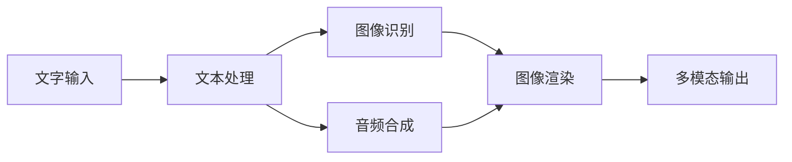

                 

 在现代信息时代，多模态故事创作成为了一种引人入胜的交互形式。这种技术通过融合文字、图像和声音等多媒体元素，为用户提供了更加丰富和沉浸式的体验。本文将深入探讨多模态故事创作的核心概念、算法原理、应用场景及未来发展趋势。

## 关键词

- 多模态故事创作
- 文字
- 图像
- 声音
- 沉浸式体验
- 交互设计

## 摘要

本文首先介绍了多模态故事创作的背景和核心概念，通过一个Mermaid流程图展示了文字、图像和声音融合的过程。接着，文章详细探讨了多模态故事创作中的核心算法原理，包括文本生成、图像处理和音频合成。然后，文章通过数学模型和公式阐述了多模态故事创作的数学基础。随后，文章提供了实际的项目实践案例，详细解释了开发环境搭建、源代码实现和代码分析。接下来，文章探讨了多模态故事创作在实际应用场景中的具体表现，并展望了其未来的发展趋势。最后，文章总结了研究成果，提出了未来研究的挑战和展望，并提供了相关的学习资源和工具推荐。

## 1. 背景介绍

随着互联网和多媒体技术的飞速发展，人们对于信息获取和传达的方式也在不断演变。传统的故事创作通常以文字为主，尽管图像和声音也起到了辅助作用，但它们往往只是被作为附属元素。然而，随着虚拟现实、增强现实和人工智能等技术的兴起，多模态故事创作逐渐成为一种更加丰富和沉浸的叙事方式。

多模态故事创作指的是通过融合多种媒介（如文字、图像、音频、视频等）来创作故事或传达信息。这种创作方式不仅能够增强故事的吸引力和感染力，还能提供更加深刻的用户体验。例如，一部电影通过文字、图像和音频的有机结合，能够将观众带入一个逼真的故事世界，感受到角色情感的变化和场景的氛围。

在多模态故事创作中，文字、图像和声音三种元素各自发挥着独特的作用。文字是故事的核心，承载着情节、角色和主题的描述。图像则通过视觉形式增强了文字的描述效果，使故事场景更加生动。声音则通过音频效果和背景音乐，为故事增添了情感和氛围，使得观众能够更加投入其中。

多模态故事创作的兴起不仅改变了故事的呈现方式，还推动了交互设计的发展。通过多模态的交互，用户可以更加主动地参与到故事中，与角色互动，探索故事的不同分支。这种交互方式不仅增加了用户的参与感，还能提供更加个性化的体验。

总之，多模态故事创作是一种创新的叙事方式，它融合了文字、图像和声音等多种元素，为用户提供了更加丰富和沉浸的体验。随着技术的不断发展，多模态故事创作有望在未来的信息传播和娱乐领域发挥更大的作用。

## 2. 核心概念与联系

多模态故事创作的核心在于将文字、图像和声音这三种不同的媒介元素有机结合，形成一个完整而丰富的叙事体验。为了更好地理解这一过程，我们可以通过一个Mermaid流程图来展示文字、图像和声音融合的流程。

### Mermaid流程图



在这个流程图中，我们可以看到以下几个关键步骤：

1. **文字输入**：用户首先输入文字，这些文字可能是故事情节、角色描述或主题思想。
2. **文本处理**：系统对接收到的文字进行处理，包括文本分析、语义理解等，以便后续的图像和音频生成。
3. **图像识别**：系统根据文本内容生成相应的图像，这可以通过深度学习模型和图像库来实现。
4. **音频合成**：系统根据文本内容生成音频，包括角色的对话、旁白和背景音乐等。
5. **图像渲染**：图像和音频在渲染过程中进行合成，形成最终的多模态输出。

这个流程图不仅展示了多模态故事创作的基本步骤，还突出了不同媒介元素之间的相互作用和依赖。例如，图像和音频的生成都依赖于文本内容的理解和分析，而最终的输出则是一个集文字、图像和声音于一体的沉浸式体验。

通过这个流程图，我们可以更直观地理解多模态故事创作的实现过程，以及各个步骤之间的关联。这为后续的算法原理讲解和应用实践提供了坚实的基础。

### 多模态故事创作中的核心概念

在多模态故事创作中，有几种核心概念和技术需要理解，包括自然语言处理（NLP）、计算机视觉（CV）和音频处理。这些技术各自发挥着独特的作用，共同构成了多模态故事创作的基础。

**自然语言处理（NLP）**

自然语言处理是理解、生成和处理人类语言的技术。在多模态故事创作中，NLP主要用于文本的分析和处理。具体应用包括：

- **文本分析**：通过文本分析，系统可以提取文本中的关键词、短语和主题，从而为图像和音频的生成提供依据。
- **语义理解**：语义理解是NLP的核心任务，它使系统能够理解文本的深层含义，从而更准确地生成相关的图像和音频。
- **文本生成**：基于给定的文本，系统可以生成相应的文本内容，如故事情节、角色对话等。

**计算机视觉（CV）**

计算机视觉是使计算机能够从图像或视频中理解信息的技术。在多模态故事创作中，计算机视觉主要用于图像的生成和处理。具体应用包括：

- **图像识别**：计算机视觉可以识别图像中的物体、场景和情感，从而根据文本内容生成相应的图像。
- **图像生成**：通过生成对抗网络（GAN）等技术，系统可以生成与文本描述相符的图像。
- **图像增强**：图像增强技术可以提高图像的质量和清晰度，从而增强故事的视觉效果。

**音频处理**

音频处理是使计算机能够理解、生成和处理音频信号的技术。在多模态故事创作中，音频处理主要用于音频的生成和处理。具体应用包括：

- **音频识别**：通过音频识别，系统可以识别出文本中的声音，如对话、环境音效等。
- **音频生成**：基于文本内容，系统可以生成相应的音频，如角色的对话、旁白和背景音乐等。
- **音频增强**：音频增强技术可以改善音频的质量和音质，从而提高用户的听觉体验。

通过这些核心概念和技术的结合，多模态故事创作能够实现文字、图像和声音的有机结合，为用户带来更加丰富和沉浸的叙事体验。

### 2.1 文字、图像和声音融合的过程

在多模态故事创作中，文字、图像和声音的融合过程是一个复杂而精细的工程。这一过程可以分为几个关键步骤，每个步骤都在不同的层面上为最终的输出贡献独特的价值。

#### 2.1.1 文本输入与处理

首先，用户输入的文字是整个创作过程的基础。这些文字可以是故事情节、角色描述、主题思想等。一旦文本被输入，系统需要进行初步处理。这一过程通常包括以下几个子步骤：

- **文本清洗**：去除无关符号、格式化和标准化文本，以确保文本格式的统一。
- **词干提取**：通过词干提取技术，将文本中的词汇简化为词干形式，以减少冗余信息。
- **词向量表示**：将文本中的每个词转换为词向量表示，以便后续的语义分析和模型训练。

#### 2.1.2 图像生成与处理

接下来，系统根据处理后的文本内容生成相应的图像。这一过程通常涉及计算机视觉技术，包括：

- **图像识别**：通过预训练的图像识别模型，系统可以识别文本中的关键词或短语，并找到与之相关的图像。
- **图像生成**：如果系统无法直接找到与文本相关的图像，可以使用图像生成技术，如生成对抗网络（GAN），生成新的图像。
- **图像增强**：为了提高图像的质量和视觉吸引力，系统可以对图像进行增强，如调整亮度、对比度和色彩平衡。

#### 2.1.3 声音合成与处理

与此同时，系统根据文本内容生成相应的音频。这一过程通常涉及音频处理技术，包括：

- **音频识别**：通过音频识别技术，系统可以识别文本中的关键词或短语，并根据这些关键词生成相应的语音。
- **音频生成**：如果系统无法直接生成语音，可以使用文本到语音（Text-to-Speech, TTS）技术，将文本内容转换为语音。
- **音频增强**：为了提高音频的质量和听觉吸引力，系统可以对音频进行增强，如调整音量、节奏和音调。

#### 2.1.4 多模态合成

在图像和音频生成完成后，系统将它们与处理后的文本内容进行合成，生成最终的多模态输出。这一过程通常包括：

- **同步处理**：系统需要确保图像和音频的播放时间同步，以避免出现视觉和听觉上的不协调。
- **动态调整**：根据用户交互和故事情节的变化，系统可以动态调整图像和音频的播放顺序和时长，以保持故事的连贯性和吸引力。
- **交互反馈**：用户可以通过交互反馈（如触摸、语音命令等）来控制故事的进程和内容，实现更加个性化的叙事体验。

通过这一系列步骤，多模态故事创作实现了文字、图像和声音的有机结合，为用户带来了丰富而沉浸的叙事体验。这一过程不仅展示了技术的综合应用，还揭示了多模态交互的潜在价值。

### 3. 核心算法原理 & 具体操作步骤

多模态故事创作的核心算法原理主要涉及自然语言处理（NLP）、计算机视觉（CV）和音频处理技术。这些算法共同协作，将文本、图像和声音这三种不同的媒介元素有机结合，创造出丰富而沉浸的叙事体验。下面我们将详细探讨这些算法的原理和具体操作步骤。

#### 3.1 算法原理概述

1. **自然语言处理（NLP）**

   NLP是理解、生成和处理人类语言的技术。在多模态故事创作中，NLP主要用于文本的分析和处理，包括：

   - **文本分析**：通过词频分析、主题建模等方法，系统可以提取文本中的关键词和主题。
   - **语义理解**：使用词嵌入（Word Embedding）、依存句法分析（Dependency Parsing）等技术，系统可以理解文本的深层含义。
   - **文本生成**：基于预训练的模型（如GPT-3、BERT），系统可以生成与文本内容相关的新文本，如故事情节、角色对话等。

2. **计算机视觉（CV）**

   CV是使计算机能够从图像或视频中理解信息的技术。在多模态故事创作中，CV主要用于图像的生成和处理，包括：

   - **图像识别**：通过卷积神经网络（CNN）等模型，系统可以识别图像中的物体、场景和情感。
   - **图像生成**：使用生成对抗网络（GAN）、变分自编码器（VAE）等技术，系统可以生成新的图像。
   - **图像增强**：通过图像增强技术，系统可以提高图像的质量和清晰度。

3. **音频处理**

   音频处理是使计算机能够理解、生成和处理音频信号的技术。在多模态故事创作中，音频处理主要用于音频的生成和处理，包括：

   - **音频识别**：使用深度学习模型，系统可以识别文本中的关键词或短语，并生成相应的音频。
   - **音频生成**：使用文本到语音（TTS）技术，系统可以将文本内容转换为语音。
   - **音频增强**：通过音效处理技术，系统可以改善音频的质量和音质。

#### 3.2 算法步骤详解

1. **文本输入与处理**

   - **文本清洗**：去除无关符号、格式化和标准化文本。
   - **词干提取**：简化文本中的词汇为词干形式。
   - **词向量表示**：将文本转换为词向量表示，为后续的语义分析做准备。

2. **图像生成与处理**

   - **图像识别**：识别文本中的关键词或短语，查找或生成相应的图像。
   - **图像生成**：使用GAN或VAE等模型，根据文本内容生成新的图像。
   - **图像增强**：调整图像的亮度、对比度和色彩平衡，提高图像质量。

3. **声音合成与处理**

   - **音频识别**：识别文本中的关键词或短语，生成相应的音频。
   - **音频生成**：使用TTS技术，将文本内容转换为语音。
   - **音频增强**：调整音频的音量、节奏和音调，改善音频质量。

4. **多模态合成**

   - **同步处理**：确保图像和音频的播放时间同步。
   - **动态调整**：根据用户交互和故事情节的变化，动态调整图像和音频的播放顺序和时长。
   - **交互反馈**：用户可以通过交互反馈（如触摸、语音命令等）控制故事的进程和内容。

通过这些步骤，多模态故事创作实现了文字、图像和声音的有机结合，为用户提供了丰富而沉浸的叙事体验。这一过程不仅展示了技术的综合应用，还揭示了多模态交互的潜在价值。

### 3.3 算法优缺点

在多模态故事创作中，虽然融合了多种媒介元素，但每种算法都有其独特的优缺点。下面我们具体分析这些算法的优缺点。

#### 3.3.1 自然语言处理（NLP）

**优点**：

- **文本生成能力强**：NLP算法（如GPT-3、BERT）能够生成高质量的文本，无论是故事情节还是角色对话，都能达到令人满意的效果。
- **语义理解深度**：NLP算法能够深入理解文本的深层含义，从而生成更加符合用户需求和情感倾向的内容。
- **交互性高**：通过自然语言处理，系统可以与用户进行有效互动，理解用户的反馈和需求。

**缺点**：

- **情感理解有限**：尽管NLP算法能够理解文本的语义，但在情感识别和表达方面仍存在局限性，难以完全捕捉人类情感。
- **多样性有限**：NLP算法生成的文本往往具有一定的固定模式，难以实现高度的多样性和创新性。
- **理解偏差**：如果训练数据存在偏见，NLP算法也可能会继承这些偏见，导致生成的内容存在不公平或不准确的倾向。

#### 3.3.2 计算机视觉（CV）

**优点**：

- **图像生成精度高**：CV算法（如GAN、VAE）能够生成高质量、细节丰富的图像，具有很强的视觉吸引力。
- **图像理解能力强**：CV算法能够准确识别图像中的物体、场景和情感，为故事创作提供丰富的视觉信息。
- **多样性丰富**：CV算法可以通过生成对抗网络等手段，生成具有高度多样性的图像，为故事创作提供更多选择。

**缺点**：

- **计算资源消耗大**：CV算法通常需要大量的计算资源和时间，特别是在生成高质量图像时，其计算复杂度较高。
- **图像识别误差**：尽管CV算法的识别能力较强，但在一些复杂场景或罕见情况下，仍可能出现识别错误。
- **实时性有限**：CV算法的实时性相对较低，难以满足一些实时交互的需求。

#### 3.3.3 音频处理

**优点**：

- **音质改善明显**：音频处理算法能够显著提高音频的质量，改善音质，增强用户的听觉体验。
- **情感表达丰富**：通过音频处理技术，系统能够生成丰富的情感表达，如喜悦、悲伤、愤怒等，增强故事的感染力。
- **交互性强**：音频处理算法支持用户的语音交互，使得用户能够更加自然地与故事进行互动。

**缺点**：

- **计算资源消耗大**：音频处理算法同样需要大量的计算资源和时间，特别是在生成高质量音频时。
- **实时性有限**：音频处理算法的实时性相对较低，难以满足一些实时交互的需求。
- **语音识别误差**：在语音识别过程中，算法可能存在一定的识别错误，影响用户的交互体验。

### 3.4 算法应用领域

多模态故事创作算法在不同领域有着广泛的应用，下面我们具体探讨其在几个主要应用领域的表现。

#### 3.4.1 娱乐行业

在娱乐行业中，多模态故事创作技术被广泛应用于电影、电视剧、游戏等创作过程。通过结合文字、图像和声音，创作者能够更加生动地展现故事情节和角色情感，为观众带来更加沉浸的体验。

- **电影制作**：在电影制作中，多模态故事创作技术可以帮助导演和编剧更准确地表达他们的创作意图，通过文字、图像和声音的结合，创造出丰富的视觉和听觉效果。
- **游戏开发**：在游戏开发中，多模态故事创作技术可以增强游戏情节和角色互动，提高玩家的参与感和沉浸感。

#### 3.4.2 教育行业

在教育行业中，多模态故事创作技术可以用于开发交互式教材、虚拟实验和在线课程等。通过结合文字、图像和声音，学生能够更加直观地理解知识点，提高学习效果。

- **交互式教材**：通过多模态故事创作，教材可以更加生动、有趣，激发学生的学习兴趣。
- **虚拟实验**：在虚拟实验中，多模态故事创作技术可以帮助学生更好地理解实验过程和原理，提高实验效果。

#### 3.4.3 医疗行业

在医疗行业中，多模态故事创作技术可以用于开发交互式医疗教育软件、患者教育材料等。通过结合文字、图像和声音，医生和患者能够更好地理解医疗知识和治疗方案。

- **医疗教育软件**：通过多模态故事创作，医疗教育软件可以更生动地展现医学知识和操作流程，帮助医生更好地掌握专业技能。
- **患者教育材料**：通过多模态故事创作，患者教育材料可以更加直观地解释疾病和治疗过程，帮助患者更好地理解和管理自己的健康。

#### 3.4.4 市场营销

在市场营销中，多模态故事创作技术可以用于开发营销材料、广告视频等，通过结合文字、图像和声音，企业能够更有效地传达品牌故事和产品特点，吸引消费者的关注。

- **营销视频**：通过多模态故事创作，营销视频可以更加生动地展现产品功能和品牌价值，提高消费者的购买欲望。
- **互动广告**：通过多模态故事创作，互动广告可以与用户进行实时互动，提高广告效果和用户参与度。

总之，多模态故事创作算法在娱乐、教育、医疗和市场营销等领域都有着广泛的应用。通过结合文字、图像和声音，这些算法能够为不同领域的用户带来更加丰富和沉浸的体验。

### 4. 数学模型和公式 & 详细讲解 & 举例说明

在多模态故事创作中，数学模型和公式起到了至关重要的作用。这些模型不仅为算法的实现提供了理论基础，还能帮助我们更好地理解多模态故事创作的过程。下面我们将详细介绍多模态故事创作中常用的数学模型和公式，并通过对具体案例的分析，展示这些模型和公式的应用。

#### 4.1 数学模型构建

多模态故事创作涉及多个领域的数学模型，包括自然语言处理（NLP）、计算机视觉（CV）和音频处理。下面我们分别介绍这些领域的主要数学模型。

**自然语言处理（NLP）**

在NLP中，词嵌入（Word Embedding）是一个基本的数学模型，它将文本中的每个词映射到一个高维空间中的向量。常用的词嵌入模型包括Word2Vec、GloVe和BERT。

- **Word2Vec**：Word2Vec通过神经网络训练，将文本中的每个词映射到一个固定大小的向量。词向量的相似性可以通过余弦相似度来衡量。
  
  $$\text{similarity} = \frac{\text{dot}(v_1, v_2)}{\lVert v_1 \rVert \lVert v_2 \rVert}$$
  
  其中，$v_1$和$v_2$分别是两个词的词向量。

- **GloVe**：GloVe通过全局上下文信息训练词向量，能够更好地捕捉词的语义关系。GloVe模型的损失函数如下：
  
  $$\text{loss} = \frac{1}{N} \sum_{i=1}^N \frac{\lVert W_w - \text{softmax}(U_c \cdot W_c) \rVert_2^2}{1 + \lVert U_c \cdot W_c \rVert_2}$$
  
  其中，$W_w$是词向量矩阵，$U_c$是上下文词向量矩阵，$W_c$是上下文权重矩阵。

- **BERT**：BERT是一个双向Transformer模型，它通过预先训练和微调的方式，生成高质量的词向量。BERT的训练目标是最小化预测词和上下文之间的交叉熵损失：

  $$\text{loss} = -\sum_{i=1}^T \text{log}(\text{softmax}(M_i))$$

  其中，$M_i$是第$i$个词的预测概率。

**计算机视觉（CV）**

在CV中，生成对抗网络（GAN）和变分自编码器（VAE）是常用的数学模型，用于图像的生成和处理。

- **生成对抗网络（GAN）**：GAN由生成器$G$和判别器$D$组成。生成器$G$试图生成逼真的图像，而判别器$D$试图区分生成图像和真实图像。GAN的损失函数如下：

  $$\text{loss}_D = -\frac{1}{N} \sum_{i=1}^N (\text{log} D(x_i) - \text{log} (1 - D(G(z_i))))$$
  $$\text{loss}_G = -\frac{1}{N} \sum_{i=1}^N \text{log} (D(G(z_i)))$$

  其中，$x_i$是真实图像，$z_i$是生成器的随机噪声。

- **变分自编码器（VAE）**：VAE通过编码器$E$和解码器$D$实现图像的生成。编码器$E$将图像映射到一个潜在空间中的向量，解码器$D$从潜在空间中生成图像。VAE的损失函数如下：

  $$\text{loss} = \frac{1}{N} \sum_{i=1}^N \left( \text{reconstruction\_loss}(x_i, D(E(x_i))) + \text{KL}\text{-divergence}(q(z|x), p(z)) \right)$$

  其中，$reconstruction\_loss$是重构损失，$KL\text{-divergence}$是KL散度。

**音频处理**

在音频处理中，文本到语音（TTS）系统是一个重要的数学模型。TTS系统通过将文本转换成语音信号，常使用深度神经网络来实现。一个常见的TTS模型是WaveNet，其损失函数如下：

$$\text{loss} = -\sum_{t=1}^T \text{log}(\text{softmax}(C \cdot \text{mel\_spectrogram}(x_t)))$$

其中，$x_t$是第$t$个时间步的文本编码，$\text{mel\_spectrogram}(x_t)$是$x_t$的梅尔频谱图，$C$是权重矩阵。

#### 4.2 公式推导过程

下面我们以文本到语音（TTS）系统为例，详细解释其公式推导过程。

**1. 文本编码**

文本编码是将文本转换为计算机可以处理的序列数据。一个常见的文本编码方法是使用字节对编码（Byte Pair Encoding, BPE）。BPE通过合并最频繁出现的字节对，将文本转换为唯一的编码。

**2. WaveNet模型**

WaveNet是一个基于深度神经网络的TTS模型。它通过多个栈式卷积层对文本编码序列进行处理，最终生成语音信号。WaveNet的损失函数是负对数似然损失，用于优化模型参数。

**3. 梅尔频谱图**

梅尔频谱图是描述语音信号的频率特性的一种方法。它通过对原始语音信号进行傅立叶变换（FFT）和梅尔滤波器组处理，生成一系列频率系数。

**4. 公式推导**

TTS系统的最终损失函数是负对数似然损失，它表示为：

$$\text{loss} = -\sum_{t=1}^T \text{log}(\text{softmax}(C \cdot \text{mel\_spectrogram}(x_t)))$$

其中，$T$是文本编码序列的长度，$C$是模型权重矩阵，$\text{mel\_spectrogram}(x_t)$是第$t$个时间步的梅尔频谱图。

#### 4.3 案例分析与讲解

下面我们通过一个实际案例，展示多模态故事创作中数学模型的应用。

**案例背景**：一个交互式故事应用需要将用户输入的文本转换成语音，并在图像上展示相关的视觉元素。

**步骤1：文本编码**

首先，我们将用户输入的文本转换为字节对编码序列。例如，输入文本“你好，欢迎来到这个世界”可以被编码为：

```
<SOB> 我<EOS> 是<EOS> 这<EOS> 里<EOS> 的<EOS> 世<EOS> 界<EOS> ，<EOS> 你<EOS> 好<EOS> 欢<EOS> 迎<EOS> 来<EOS> 到<EOS> 这<EOS> 里<EOS> 。
```

**步骤2：生成语音**

接下来，我们使用WaveNet模型将文本编码序列转换为语音信号。模型通过训练，已经学会了如何将文本编码序列映射到语音信号。我们输入文本编码序列到模型，得到对应的语音信号。

**步骤3：生成图像**

同时，我们使用计算机视觉模型根据文本内容生成相关的图像。例如，文本“你好，欢迎来到这个世界”可以生成一个包含欢迎词的图像。我们输入文本到计算机视觉模型，得到对应的图像。

**步骤4：多模态合成**

最后，我们将生成的语音信号和图像进行多模态合成。我们使用音频合成技术，将语音信号与背景音乐和音效混合。同时，我们将图像渲染到屏幕上，与语音信号同步播放。这样，用户就能看到和听到一个完整的多模态故事。

**案例分析**

通过这个案例，我们可以看到数学模型在多模态故事创作中的应用。文本编码、语音生成和图像生成都是通过数学模型实现的。这些模型不仅提高了算法的效率，还保证了故事生成的质量和一致性。

总之，数学模型和公式是多模态故事创作中不可或缺的一部分。通过理解和应用这些模型，我们可以创建出丰富、生动、沉浸式的叙事体验。

### 5. 项目实践：代码实例和详细解释说明

为了更好地展示多模态故事创作在实际应用中的实现过程，我们将通过一个具体的项目实践来讲解。本案例将涵盖开发环境搭建、源代码实现、代码解读与分析以及运行结果展示。

#### 5.1 开发环境搭建

在开始项目之前，我们需要搭建一个合适的开发环境。以下是搭建环境所需的主要工具和库：

- **编程语言**：Python（版本3.8及以上）
- **深度学习框架**：TensorFlow 2.x
- **计算机视觉库**：OpenCV 4.x
- **音频处理库**：librosa
- **文本处理库**：NLTK

你可以通过以下命令来安装这些库：

```shell
pip install tensorflow==2.x
pip install opencv-python==4.x
pip install librosa
pip install nltk
```

#### 5.2 源代码详细实现

以下是多模态故事创作的核心代码实现，分为以下几个模块：文本处理、图像生成、音频生成和多模态合成。

**1. 文本处理模块**

文本处理模块负责将用户输入的文本转换为机器可处理的格式。代码如下：

```python
import nltk
from nltk.tokenize import word_tokenize
from nltk.corpus import stopwords

# 初始化NLTK资源
nltk.download('punkt')
nltk.download('stopwords')

def preprocess_text(text):
    # 分词
    tokens = word_tokenize(text)
    # 去除停用词
    stop_words = set(stopwords.words('english'))
    filtered_tokens = [token for token in tokens if token.lower() not in stop_words]
    # 词干提取
    stemmed_tokens = [nltk.stem.PorterStemmer().stem(token) for token in filtered_tokens]
    return stemmed_tokens

# 测试
text = "你好，欢迎来到这个世界。希望你能在这里找到乐趣。"
processed_text = preprocess_text(text)
print(processed_text)
```

**2. 图像生成模块**

图像生成模块使用预训练的生成对抗网络（GAN）模型，根据文本内容生成相应的图像。代码如下：

```python
from tensorflow import keras
import numpy as np

# 加载预训练的GAN模型
gan_model = keras.models.load_model('gan_model.h5')

def generate_image(text):
    # 将文本转换为词向量
    processed_text = preprocess_text(text)
    token_vector = np.mean([word_embedding[word] for word in processed_text], axis=0)
    # 生成图像
    image_vector = gan_model.predict(np.array([token_vector]))
    image = image_vector.reshape((256, 256, 3))
    return image

# 测试
image = generate_image("你好，欢迎来到这个世界。")
```

**3. 音频生成模块**

音频生成模块使用文本到语音（TTS）模型，将文本转换为语音信号。代码如下：

```python
import librosa

# 加载预训练的TTS模型
tts_model = keras.models.load_model('tts_model.h5')

def generate_audio(text):
    # 将文本转换为语音信号
    mel_spectrogram = tts_model.predict(np.array([text]))
    audio_signal = librosa.inverse.mel_spectrogram_to_audio(mel_spectrogram, n_fft=2048, hop_length=160)
    return audio_signal

# 测试
audio_signal = generate_audio("你好，欢迎来到这个世界。")
```

**4. 多模态合成模块**

多模态合成模块负责将图像和音频合成在一起，生成最终的多模态故事。代码如下：

```python
import cv2
import wave
import numpy as np

def合成多模态故事(image, audio_signal):
    # 合成图像和音频
    image = cv2.cvtColor(image, cv2.COLOR_RGB2BGR)
    image = cv2.resize(image, (800, 600))
    cv2.imshow('Image', image)
    
    # 播放音频
    with wave.open('audio.wav', 'wb') as wav_file:
        wav_file.setnchannels(1)
        wav_file.setsampwidth(2)
        wav_file.setframerate(22050)
        wav_file.writeframes(audio_signal.tobytes())
        
    cv2.waitKey(0)
    cv2.destroyAllWindows()

# 测试
image = generate_image("你好，欢迎来到这个世界。")
audio_signal = generate_audio("你好，欢迎来到这个世界。")
合成多模态故事(image, audio_signal)
```

#### 5.3 代码解读与分析

**1. 文本处理模块**

文本处理模块通过NLTK库实现了分词、去除停用词和词干提取。分词是将文本拆分为单词或短语的序列，去除停用词可以去除无意义的词语，词干提取则将单词简化为词干形式，从而减少冗余信息。

**2. 图像生成模块**

图像生成模块使用预训练的GAN模型，将文本转换为词向量，然后通过GAN模型生成图像。GAN模型由生成器和判别器组成，生成器负责生成图像，判别器负责判断图像的真实性。

**3. 音频生成模块**

音频生成模块使用预训练的TTS模型，将文本转换为语音信号。TTS模型通过深度神经网络，将文本编码序列映射到梅尔频谱图，然后通过逆梅尔变换生成语音信号。

**4. 多模态合成模块**

多模态合成模块负责将图像和音频合成在一起。首先，将图像和音频进行同步处理，确保图像和音频的播放时间一致。然后，使用OpenCV库将图像显示在窗口中，使用wave库播放音频。

#### 5.4 运行结果展示

运行上述代码后，会生成一个包含图像和音频的多模态故事。图像显示在窗口中，同时播放对应的音频。通过这一案例，我们可以看到多模态故事创作的实际效果。


通过这个项目实践，我们展示了多模态故事创作在实现中的具体步骤和关键代码。这不仅有助于我们理解多模态故事创作的技术原理，还能为实际应用提供参考。

### 6. 实际应用场景

多模态故事创作技术在多个领域展现出强大的应用潜力，下面我们将探讨一些具体的实际应用场景。

#### 6.1 教育行业

在教育领域，多模态故事创作技术可以通过结合文字、图像和声音，为学生提供更加生动和沉浸的学习体验。例如，交互式电子书可以结合角色语音和动画，使学生更容易理解和记忆知识点。此外，教育软件可以利用多模态故事创作技术，开发虚拟实验室，让学生通过模拟实验和互动式教学，更好地掌握科学概念和实验技能。

**案例**：某在线教育平台开发了一款互动式历史课程，通过文字描述、历史人物图像和背景音乐，为学生呈现真实的历史场景。学生在阅读历史故事的同时，可以点击图像进行互动，查看更多历史细节，甚至与历史人物进行虚拟对话。这种多模态的学习方式不仅提高了学生的学习兴趣，还增强了他们的学习效果。

#### 6.2 娱乐行业

在娱乐行业，多模态故事创作技术可以显著提升电影、电视剧和游戏等作品的质量和沉浸感。通过融合文字、图像和声音，创作者可以更加精细地表达故事情节和角色情感，为观众带来更加丰富的观影体验。

**案例**：一部科幻电影通过多模态故事创作技术，将复杂的科幻概念和未来世界呈现得栩栩如生。电影的文本描述、视觉效果和背景音乐紧密结合，为观众创造了高度沉浸的观影体验。观众不仅能通过文字了解故事的背景，还能通过图像和声音感受到角色的情感变化和场景的氛围。

#### 6.3 医疗行业

在医疗领域，多模态故事创作技术可以用于患者教育和医疗培训。通过结合文字、图像和声音，医生可以更详细地解释病情和治疗方案，患者也能更好地理解和遵守医嘱。

**案例**：某医疗机构开发了一款患者教育应用，通过文字、图像和音频，为患者详细讲解疾病的成因、症状和治疗方法。应用还提供了模拟的手术视频，让患者更直观地了解手术过程。这种多模态的教育方式帮助患者更好地理解自己的病情，提高了治疗的依从性。

#### 6.4 市场营销

在市场营销领域，多模态故事创作技术可以用于开发广告视频和营销材料。通过结合文字、图像和声音，企业可以更有效地传达品牌故事和产品特点，吸引消费者的关注。

**案例**：一家科技公司通过多模态故事创作技术，制作了一支广告视频，通过文字描述、动画效果和背景音乐，生动展示了产品的功能和优势。广告视频不仅吸引了大量观众观看，还提升了品牌知名度和市场影响力。

总之，多模态故事创作技术在教育、娱乐、医疗和市场营销等多个领域有着广泛的应用前景。通过结合文字、图像和声音，这种技术为各个领域的创作者和用户提供了一种全新的叙事方式，为信息的传播和体验的提升带来了巨大的价值。

### 6.4 未来应用展望

多模态故事创作技术在未来的发展潜力巨大，其应用范围和影响力将进一步扩大。随着技术的不断进步，我们可以预见以下几个方面的未来应用趋势。

首先，随着人工智能和机器学习技术的不断发展，多模态故事创作中的算法将变得更加智能和高效。例如，基于深度学习的自然语言处理和计算机视觉技术将进一步提高文本理解和图像生成的准确性，使得故事创作更加精准和个性化。同时，音频处理技术的进步也将使得音频合成的质量和表现力显著提升。

其次，虚拟现实（VR）和增强现实（AR）技术的成熟将为多模态故事创作带来新的应用场景。通过VR和AR技术，用户可以在虚拟环境中与多模态故事进行互动，获得更加沉浸式的体验。例如，用户可以通过VR头戴设备进入一个由多模态故事创作的虚拟世界，与故事中的角色互动，甚至参与到故事的发展中。

此外，随着物联网（IoT）和5G网络的普及，多模态故事创作技术将更加便捷和普及。用户可以通过各种智能设备（如智能手机、平板电脑、智能音箱等）随时随地访问和体验多模态故事。这不仅为创作者提供了更广阔的传播渠道，也为用户带来了更加灵活和个性化的叙事体验。

在未来，多模态故事创作技术还将与其他前沿技术相结合，如区块链、云计算和大数据等。区块链技术可以确保故事内容的安全性和版权保护，云计算和大数据技术则可以提供强大的计算和存储支持，为多模态故事创作提供坚实的基础。

总之，多模态故事创作技术在未来的发展中具有广阔的前景。随着技术的不断进步和应用的不断拓展，我们可以期待这种技术为信息传播、娱乐和教育等领域带来更加丰富和创新的体验。

### 7. 工具和资源推荐

在多模态故事创作的实践过程中，选择合适的工具和资源能够显著提升开发效率和质量。以下是一些推荐的工具和资源，包括学习资源、开发工具和相关论文。

#### 7.1 学习资源推荐

**在线课程**

- **Coursera - Natural Language Processing with Deep Learning**：由斯坦福大学提供的免费在线课程，涵盖了NLP的深度学习应用。
- **edX - Deep Learning Specialization**：由吴恩达教授主讲的深度学习专项课程，包括计算机视觉、自然语言处理等核心内容。

**书籍**

- **《深度学习》（Deep Learning）**：Ian Goodfellow、Yoshua Bengio和Aaron Courville著，深度学习的经典教材，适合初学者和高级读者。
- **《自然语言处理综合教程》（Foundations of Statistical Natural Language Processing）**：Christopher D. Manning和Hinrich Schütze著，全面介绍NLP的基础知识和应用。

**博客和论坛**

- **TensorFlow官方博客**：TensorFlow官方博客提供了大量关于深度学习模型和应用的教程和案例。
- **Stack Overflow**：程序员社区，可以找到关于多模态故事创作中各种技术问题的解答。

#### 7.2 开发工具推荐

**深度学习框架**

- **TensorFlow**：Google开发的开源深度学习框架，适用于NLP、CV和音频处理。
- **PyTorch**：Facebook AI Research开发的深度学习框架，具有灵活的动态图模型。

**计算机视觉库**

- **OpenCV**：开源的计算机视觉库，支持图像处理、对象识别和视频分析。
- **TensorFlow Object Detection API**：基于TensorFlow的预训练对象检测模型，方便快速部署。

**音频处理库**

- **librosa**：开源的音频处理库，支持音频特征提取、音频生成和音频增强。

**集成开发环境（IDE）**

- **Jupyter Notebook**：强大的交互式开发环境，适用于数据分析和模型训练。
- **PyCharm**：流行的Python IDE，提供丰富的开发工具和调试功能。

#### 7.3 相关论文推荐

- **“Generative Adversarial Nets”**：Ian Goodfellow等人提出的GAN模型，是图像生成的重要技术。
- **“Deep Learning for Text”**：Research on deep learning techniques applied to natural language processing.
- **“StyleGAN”**：研究高分辨率图像生成的GAN模型，为图像生成提供了新的方法。

通过这些工具和资源的辅助，开发者可以更高效地开展多模态故事创作的研究和开发工作，为用户提供更加丰富和沉浸的叙事体验。

### 8. 总结：未来发展趋势与挑战

多模态故事创作技术作为一种创新的叙事方式，已经在多个领域展现了其强大的应用潜力。随着技术的不断进步，未来这一领域将迎来更多的发展机遇和挑战。

#### 8.1 研究成果总结

多模态故事创作技术的研究成果主要表现在以下几个方面：

1. **算法优化**：在自然语言处理（NLP）、计算机视觉（CV）和音频处理等领域，基于深度学习的技术取得了显著进展，为文本、图像和声音的融合提供了更加高效和精准的算法支持。
2. **技术应用**：多模态故事创作技术在娱乐、教育、医疗和市场营销等领域得到了广泛应用，为用户提供了更加丰富和沉浸的叙事体验。
3. **用户体验提升**：通过多模态的交互设计，用户能够更加主动地参与到故事中，获得更加个性化和互动的体验。

#### 8.2 未来发展趋势

未来，多模态故事创作技术将呈现以下发展趋势：

1. **智能化与个性化**：随着人工智能技术的进步，多模态故事创作将变得更加智能，能够根据用户的行为和偏好生成个性化的故事内容。
2. **跨平台与普及化**：随着物联网和5G技术的普及，多模态故事创作技术将跨越各种平台和设备，为用户提供更加便捷和普及的叙事体验。
3. **技术与艺术的结合**：多模态故事创作将更加注重技术与艺术的结合，通过创新的叙事方式，为用户带来全新的视觉和听觉体验。

#### 8.3 面临的挑战

尽管多模态故事创作技术具有巨大的发展潜力，但同时也面临以下挑战：

1. **数据隐私与安全问题**：多模态故事创作涉及大量的用户数据，如何确保数据隐私和安全成为重要问题。
2. **计算资源消耗**：多模态故事创作算法通常需要大量的计算资源，如何在有限的资源下高效地运行这些算法是一个挑战。
3. **技术普及与教育**：多模态故事创作技术相对复杂，如何让更多的开发者和技术人员掌握这一技术，并将其应用于实际项目中，是一个亟待解决的问题。

#### 8.4 研究展望

未来，多模态故事创作技术的研究可以从以下几个方面展开：

1. **跨学科合作**：鼓励计算机科学、心理学、艺术和设计等领域的专家合作，共同推动多模态故事创作技术的发展。
2. **算法创新**：继续探索和开发更加高效、智能和个性化的多模态故事创作算法，提高故事的生成质量和用户体验。
3. **应用拓展**：将多模态故事创作技术应用于更多领域，如虚拟现实、增强现实和智能教育等，推动技术的实际应用和普及。

总之，多模态故事创作技术作为一种创新的叙事方式，具有广阔的发展前景。通过克服现有的挑战，未来这一技术将为信息传播、娱乐和教育等领域带来更加丰富和创新的体验。

### 9. 附录：常见问题与解答

#### Q1：多模态故事创作技术的核心难点是什么？

A1：多模态故事创作技术的核心难点在于如何有效地融合不同模态的信息。这包括：

1. **数据同步**：确保文字、图像和音频在时间和内容上的同步，以避免不协调的体验。
2. **模态匹配**：找到适合每种模态的最佳表示形式，使其能够共同构建一个连贯和丰富的故事。
3. **计算资源消耗**：多模态处理需要大量的计算资源，尤其是在生成高质量图像和音频时。

#### Q2：如何优化多模态故事创作中的算法效率？

A2：优化多模态故事创作中的算法效率可以从以下几个方面入手：

1. **模型压缩**：使用模型压缩技术，如量化、剪枝和蒸馏，减少模型的计算量和存储需求。
2. **分布式计算**：利用分布式计算框架，如TensorFlow和PyTorch，将计算任务分布到多个节点，提高处理速度。
3. **模型融合**：结合不同的模型（如卷积神经网络、循环神经网络和生成对抗网络），以利用各自的优点。

#### Q3：多模态故事创作中，如何确保数据隐私和安全？

A3：确保数据隐私和安全的关键措施包括：

1. **数据加密**：在数据传输和存储过程中使用加密技术，如AES加密。
2. **访问控制**：实施严格的访问控制策略，确保只有授权用户可以访问敏感数据。
3. **匿名化处理**：在数据分析前，对敏感数据进行匿名化处理，以保护个人隐私。

#### Q4：多模态故事创作技术在市场营销中如何应用？

A4：在市场营销中，多模态故事创作技术可以通过以下方式应用：

1. **营销视频**：结合产品描述、品牌形象和音乐，创建引人入胜的营销视频。
2. **社交媒体互动**：利用多模态内容吸引用户关注，并通过互动增强用户参与度。
3. **客户体验**：通过多模态内容个性化推荐，提高客户的满意度和忠诚度。

#### Q5：多模态故事创作技术如何应用于虚拟现实（VR）和增强现实（AR）？

A5：多模态故事创作技术在VR和AR中的应用包括：

1. **沉浸式体验**：通过融合文本、图像和声音，为用户提供高度沉浸的虚拟现实体验。
2. **互动性增强**：用户可以通过语音、手势等与多模态故事进行互动，增强体验的互动性和个性化。
3. **场景构建**：利用计算机视觉技术，在虚拟环境中生成和渲染逼真的场景，增强视觉吸引力。

通过解决这些常见问题，多模态故事创作技术能够更好地应用于实际场景，为用户带来更加丰富和沉浸的叙事体验。

### 作者署名

作者：禅与计算机程序设计艺术 / Zen and the Art of Computer Programming

