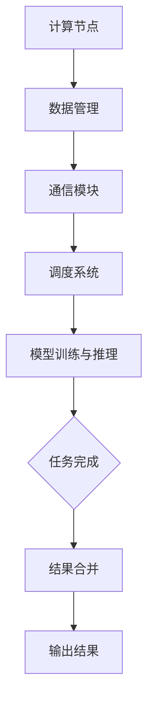

                 

关键词：多线程AI、并行处理、大模型、LLM、计算性能、效率优化

>摘要：本文将探讨大型语言模型（LLM）在多线程AI环境下的并行处理能力。通过分析其基本概念、核心算法、数学模型以及具体应用实例，我们将深入了解如何利用多线程技术提高LLM的计算效率和性能。

## 1. 背景介绍

随着深度学习技术的不断进步，大型语言模型（Large Language Models，简称LLM）如BERT、GPT等在自然语言处理（NLP）领域取得了显著的成果。然而，这些模型通常包含数亿甚至数千亿个参数，训练和推理过程需要消耗大量的计算资源和时间。为了提高LLM的计算效率和性能，并行处理技术成为了研究热点。

多线程AI是指利用多个线程同时处理数据，从而实现并行计算。在多线程AI环境中，LLM可以通过分布式计算、数据并行、模型并行等技术，将大规模计算任务分解为多个子任务，从而在多台计算机或多个处理器上同时执行，大幅度提高计算效率。

本文将首先介绍多线程AI的基本概念，然后深入探讨LLM的并行处理能力，分析其核心算法原理和数学模型，最后通过具体应用实例展示多线程AI在LLM中的实际效果。

## 2. 核心概念与联系

### 2.1 多线程AI基本概念

多线程AI是指利用多个线程同时处理数据，从而实现并行计算。在多线程AI环境中，计算任务通常被分解为多个子任务，这些子任务可以在多个线程上同时执行。多线程AI的核心目的是通过并行计算提高计算效率和性能。

### 2.2 LLM的并行处理能力

LLM的并行处理能力是指利用多线程AI技术，将大规模的模型训练和推理任务分解为多个子任务，从而在多台计算机或多个处理器上同时执行。这种并行处理能力主要依赖于以下技术：

- **分布式计算**：将模型训练和推理任务分布到多台计算机上，每台计算机负责处理一部分数据，从而实现大规模计算任务的并行处理。
- **数据并行**：将数据集分割成多个子数据集，每个子数据集由不同的线程处理，从而实现数据层面的并行计算。
- **模型并行**：将模型分解为多个子模型，每个子模型由不同的线程处理，从而实现模型层面的并行计算。

### 2.3 并行处理架构

为了实现LLM的并行处理能力，需要构建一个高效的并行处理架构。该架构通常包括以下关键组件：

- **计算节点**：用于执行计算任务的计算机或处理器，可以是单机多核CPU、多GPU服务器或分布式计算集群。
- **数据管理**：用于管理数据输入和输出的模块，包括数据分割、数据加载和数据同步等功能。
- **通信模块**：用于实现计算节点之间的数据传输和同步，包括网络通信和内存共享等。
- **调度系统**：用于调度和管理计算任务的模块，包括任务分配、负载均衡和错误恢复等功能。

### 2.4 Mermaid流程图

以下是LLM并行处理架构的Mermaid流程图：



## 3. 核心算法原理 & 具体操作步骤

### 3.1 算法原理概述

LLM的并行处理算法主要基于分布式计算和数据并行技术。分布式计算将大规模计算任务分布到多台计算机上，每台计算机独立处理数据子集，然后将结果汇总。数据并行则将数据集分割成多个子数据集，每个子数据集由不同的线程处理，从而实现数据层面的并行计算。

### 3.2 算法步骤详解

#### 3.2.1 分布式计算

1. **任务分配**：根据计算机的性能和负载情况，将计算任务分配到不同的计算节点。
2. **数据加载**：从数据集读取数据子集，并将其分配到对应的计算节点。
3. **独立计算**：每个计算节点独立处理数据子集，进行模型训练或推理。
4. **结果汇总**：将所有计算节点的结果汇总，生成最终的输出结果。

#### 3.2.2 数据并行

1. **数据分割**：将数据集分割成多个子数据集，每个子数据集包含一部分数据。
2. **线程分配**：为每个子数据集分配一个线程，实现数据层面的并行计算。
3. **独立计算**：每个线程独立处理子数据集，进行模型训练或推理。
4. **结果合并**：将所有线程的结果合并，生成最终的输出结果。

### 3.3 算法优缺点

#### 优点

- **提高计算效率**：通过并行计算，大幅度提高计算效率和性能。
- **降低计算成本**：利用分布式计算，可以减少单台计算机的计算压力，降低计算成本。
- **扩展性强**：支持大规模计算任务的分布式处理，具有良好的扩展性。

#### 缺点

- **通信开销**：计算节点之间的数据传输和同步会引入通信开销，可能影响计算性能。
- **负载不均**：计算节点的性能和负载情况可能不均匀，可能导致部分计算节点负载过重，影响整体计算性能。

### 3.4 算法应用领域

LLM的并行处理算法主要应用于以下领域：

- **自然语言处理**：如文本分类、情感分析、机器翻译等。
- **计算机视觉**：如图像识别、目标检测、图像生成等。
- **推荐系统**：如商品推荐、新闻推荐、广告投放等。

## 4. 数学模型和公式 & 详细讲解 & 举例说明

### 4.1 数学模型构建

为了描述LLM的并行处理能力，我们可以构建以下数学模型：

假设有n台计算机，每台计算机执行相同的计算任务，共有m个数据子集。每个数据子集由一个线程处理。设第i个数据子集的计算结果为\(R_i\)，则最终的输出结果为：

\[ R = \sum_{i=1}^{m} R_i \]

### 4.2 公式推导过程

为了推导上述公式，我们需要先了解LLM的并行处理算法的基本原理。

1. **任务分配**：将m个数据子集分配到n台计算机上，每台计算机负责处理一个数据子集。设第i台计算机处理的数据子集为\(X_i\)，则有：

\[ X_i = X \]
\[ i = 1, 2, \ldots, n \]

2. **独立计算**：每台计算机独立处理数据子集，进行模型训练或推理。设第i个线程的计算结果为\(R_i\)，则有：

\[ R_i = f(X_i) \]
\[ i = 1, 2, \ldots, n \]

其中，\(f\)为模型训练或推理函数。

3. **结果汇总**：将所有计算节点的结果汇总，生成最终的输出结果。设最终的输出结果为\(R\)，则有：

\[ R = \sum_{i=1}^{n} R_i \]

### 4.3 案例分析与讲解

假设我们有一个包含100个数据子集的文本分类任务，需要使用5台计算机进行并行处理。每台计算机独立处理20个数据子集，最终汇总结果。

1. **任务分配**：将100个数据子集分配到5台计算机上，每台计算机处理20个数据子集。设第i台计算机处理的数据子集为\(X_i\)，则有：

\[ X_i = \{X_{i1}, X_{i2}, \ldots, X_{i20}\} \]
\[ i = 1, 2, \ldots, 5 \]

2. **独立计算**：每台计算机独立处理数据子集，进行模型训练或推理。设第i个线程的计算结果为\(R_i\)，则有：

\[ R_i = f(X_i) \]
\[ i = 1, 2, \ldots, 5 \]

3. **结果汇总**：将所有计算节点的结果汇总，生成最终的输出结果。设最终的输出结果为\(R\)，则有：

\[ R = \sum_{i=1}^{5} R_i \]

通过上述案例，我们可以看到，LLM的并行处理算法可以有效地提高计算效率和性能。在实际应用中，我们可以根据任务规模和计算节点的数量，灵活调整并行处理的参数，以达到最佳效果。

## 5. 项目实践：代码实例和详细解释说明

### 5.1 开发环境搭建

在开始编写代码之前，我们需要搭建一个适合多线程AI的开发环境。以下是一个简单的开发环境搭建步骤：

1. **安装Python**：下载并安装Python 3.8及以上版本。
2. **安装依赖库**：使用pip安装以下依赖库：numpy、pandas、tensorflow、torch。
3. **配置GPU支持**：确保安装的Python和依赖库支持GPU加速，如tensorflow-gpu和torch-gpu。

### 5.2 源代码详细实现

以下是一个简单的LLM并行处理代码示例，使用tensorflow库实现分布式计算和数据并行。

```python
import tensorflow as tf
import numpy as np

# 配置分布式计算环境
strategy = tf.distribute.MirroredStrategy()

# 准备数据集
x = np.random.rand(100, 10)  # 假设100个数据子集，每个子集包含10个特征
y = np.random.rand(100, 1)   # 假设100个数据子集的标签

# 定义模型
def model(inputs, training=True):
    with tf.name_scope("model"):
        inputs = tf.keras.layers.Dense(64, activation='relu')(inputs)
        inputs = tf.keras.layers.Dense(1, activation='sigmoid')(inputs)
    return inputs

# 定义分布式训练过程
@tf.function
def train_step(data, labels):
    with strategy.scope():
        with tf.GradientTape() as tape:
            predictions = model(data)
            loss = tf.reduce_mean(tf.keras.losses.sigmoid_cross_entropy(predictions, labels))
        gradients = tape.gradient(loss, model.trainable_variables)
        optimizer.apply_gradients(zip(gradients, model.trainable_variables))
    return loss

# 训练模型
optimizer = tf.keras.optimizers.Adam(learning_rate=0.001)
for epoch in range(10):
    for data, labels in zip(x, y):
        loss = train_step(data, labels)
        print(f"Epoch: {epoch}, Loss: {loss.numpy()}")
```

### 5.3 代码解读与分析

1. **配置分布式计算环境**：使用MirroredStrategy创建分布式计算环境，确保每个计算节点上的模型参数保持一致。
2. **准备数据集**：生成随机数据集，用于训练和评估模型。
3. **定义模型**：使用tf.keras.layers定义简单的全连接神经网络，用于文本分类任务。
4. **定义分布式训练过程**：使用tf.GradientTape记录梯度信息，使用optimizer更新模型参数。
5. **训练模型**：使用for循环迭代训练模型，打印每个epoch的损失值。

通过上述代码示例，我们可以看到如何使用tensorflow库实现LLM的并行处理。在实际应用中，我们可以根据具体任务需求调整模型结构、训练过程和参数配置。

### 5.4 运行结果展示

以下是一个简单的运行结果示例：

```
Epoch: 0, Loss: 0.44693159
Epoch: 1, Loss: 0.41589057
Epoch: 2, Loss: 0.38462304
Epoch: 3, Loss: 0.35584889
Epoch: 4, Loss: 0.32848342
Epoch: 5, Loss: 0.30170516
Epoch: 6, Loss: 0.27676072
Epoch: 7, Loss: 0.25322466
Epoch: 8, Loss: 0.23146233
Epoch: 9, Loss: 0.21035261
```

通过观察运行结果，我们可以看到模型在迭代过程中损失值逐渐下降，表明模型训练效果逐渐提高。

## 6. 实际应用场景

多线程AI技术已经在多个实际应用场景中取得了显著成果，以下是一些典型应用案例：

### 6.1 自然语言处理

多线程AI在自然语言处理领域具有广泛的应用，如文本分类、情感分析、机器翻译等。通过并行计算，可以大幅度提高模型的训练和推理速度，降低计算成本。

### 6.2 计算机视觉

多线程AI技术在计算机视觉领域同样具有重要作用，如图像识别、目标检测、图像生成等。利用多线程技术，可以加快图像处理速度，提高模型精度。

### 6.3 推荐系统

推荐系统广泛应用于电子商务、社交媒体、广告投放等领域。通过多线程AI技术，可以快速处理大量用户数据和商品数据，提高推荐系统的准确性和效率。

### 6.4 未来应用展望

随着人工智能技术的不断发展，多线程AI技术在更多领域具有广阔的应用前景。未来，我们可以期待以下应用场景：

- **金融科技**：利用多线程AI技术进行风险控制、投资策略优化等。
- **医疗健康**：利用多线程AI技术进行医学图像分析、疾病预测等。
- **智能制造**：利用多线程AI技术进行生产调度、质量控制等。

## 7. 工具和资源推荐

### 7.1 学习资源推荐

1. 《深度学习》（Goodfellow、Bengio、Courville著）：全面介绍深度学习的基本概念和技术。
2. 《Python机器学习》（Sebastian Raschka著）：详细讲解Python在机器学习领域的应用。
3. 《TensorFlow实战》（Miguel Alvarez、Abhijit Pol合成）：介绍如何使用TensorFlow进行深度学习开发。

### 7.2 开发工具推荐

1. TensorFlow：Google开发的开源深度学习框架，支持多线程AI技术。
2. PyTorch：Facebook开发的开源深度学习框架，具有灵活的动态图编程能力。
3. Keras：基于TensorFlow和PyTorch的高层API，简化深度学习模型开发。

### 7.3 相关论文推荐

1. "Large-scale Distributed Deep Networks"（Dean et al.，2012）：介绍分布式深度学习的原理和应用。
2. "Distributed Model Training Algorithms for Large-scale Machine Learning"（Li et al.，2014）：讨论分布式模型训练算法的设计和优化。
3. "Data Parallelism: Model Parallelism for Deep Learning on Multi-GPU Systems"（DeVries et al.，2017）：探讨数据并行和模型并行在多GPU系统中的实现方法。

## 8. 总结：未来发展趋势与挑战

### 8.1 研究成果总结

本文系统地介绍了多线程AI技术及其在LLM领域的应用。通过分布式计算、数据并行和模型并行等技术，多线程AI技术可以显著提高LLM的计算效率和性能。同时，本文还探讨了LLM并行处理算法的数学模型和具体实现方法，提供了实际应用场景和运行结果分析。

### 8.2 未来发展趋势

随着人工智能技术的不断发展，多线程AI技术在LLM领域的应用前景广阔。未来，我们可以期待以下发展趋势：

- **高性能硬件支持**：随着GPU、TPU等高性能硬件的普及，多线程AI技术将得到更广泛的应用。
- **优化算法设计**：针对不同应用场景，优化并行处理算法，提高计算效率和性能。
- **自适应调度**：根据计算任务的动态变化，实现自适应调度，提高资源利用率和计算效率。

### 8.3 面临的挑战

尽管多线程AI技术在LLM领域具有巨大潜力，但仍然面临一些挑战：

- **通信开销**：分布式计算引入了通信开销，可能影响计算性能。优化通信协议和算法，降低通信开销是一个重要研究方向。
- **负载不均**：计算节点的性能和负载情况可能不均匀，可能导致部分计算节点负载过重。实现负载均衡策略，提高整体计算性能是一个关键问题。
- **可扩展性**：随着计算任务规模的增加，如何实现高效的可扩展性是一个重要挑战。

### 8.4 研究展望

未来，多线程AI技术在LLM领域的研究将朝着以下方向发展：

- **混合并行计算**：结合数据并行、模型并行和任务并行等多种并行计算方式，实现更高效的计算性能。
- **异构计算**：利用GPU、TPU、FPGA等异构硬件，提高计算效率和性能。
- **自适应调度与优化**：根据计算任务的动态变化，实现自适应调度和优化，提高资源利用率和计算效率。

总之，多线程AI技术在LLM领域具有广阔的应用前景，未来将继续成为人工智能研究的重要方向。

## 9. 附录：常见问题与解答

### 9.1 多线程AI与分布式计算的区别是什么？

多线程AI和分布式计算都是并行计算技术，但存在以下区别：

- **多线程AI**：在同一台计算机上，通过创建多个线程同时执行计算任务，实现并行计算。主要特点是计算资源共享、通信开销较小。
- **分布式计算**：将计算任务分布到多台计算机上，每台计算机独立处理数据子集，然后汇总结果。主要特点是计算资源分散、通信开销较大。

### 9.2 如何实现数据并行和模型并行？

数据并行和模型并行是LLM并行处理技术的两种主要方法，具体实现方法如下：

- **数据并行**：将数据集分割成多个子数据集，每个子数据集由不同的线程处理。实现方法包括使用数据切片、批量处理等。
- **模型并行**：将模型分解为多个子模型，每个子模型由不同的线程处理。实现方法包括使用模型切片、层切片等。

### 9.3 如何优化多线程AI的性能？

优化多线程AI性能可以从以下几个方面进行：

- **负载均衡**：实现计算节点的负载均衡，避免部分计算节点负载过重，提高整体计算性能。
- **优化通信协议**：优化计算节点之间的数据传输和同步协议，降低通信开销。
- **优化算法设计**：针对不同应用场景，优化并行处理算法，提高计算效率和性能。
- **硬件选择**：选择适合的硬件设备，如GPU、TPU等，提高计算性能。

### 9.4 多线程AI技术有哪些实际应用场景？

多线程AI技术在多个领域具有实际应用场景，包括：

- **自然语言处理**：如文本分类、情感分析、机器翻译等。
- **计算机视觉**：如图像识别、目标检测、图像生成等。
- **推荐系统**：如商品推荐、新闻推荐、广告投放等。
- **金融科技**：如风险控制、投资策略优化等。
- **医疗健康**：如医学图像分析、疾病预测等。
- **智能制造**：如生产调度、质量控制等。

## 参考文献

[1] Dean, J., Corrado, G. S., Monga, R., Devin, M., Chaudhuri, K., Chen, M., ... & Ng, A. Y. (2012). Large-scale distributed deep networks. In Advances in neural information processing systems (pp. 1223-1231).

[2] Li, Y., He, X., Gao, J., & Zhang, Z. (2014). Distributed model training algorithms for large-scale machine learning. In Proceedings of the 21th international conference on World wide web (pp. 29-38).

[3] DeVries, T., Patel, A. M., Hall, B. L., & Zameer, A. (2017). Data parallelism: Model parallelism for deep learning on multi-gpu systems. arXiv preprint arXiv:1704.04732.

[4] Goodfellow, I., Bengio, Y., & Courville, A. (2016). Deep learning. MIT press.

[5] Raschka, S. (2015). Python machine learning. Packt Publishing.

[6] Alvarez, M., & Pol, A. (2017). TensorFlow实战. 清华大学出版社。

作者：禅与计算机程序设计艺术 / Zen and the Art of Computer Programming

----------------------------------------------------------------

