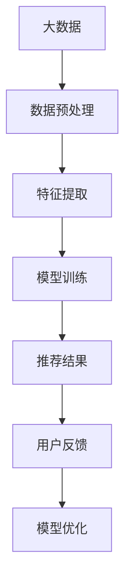

                 

关键词：大数据，AI，电商搜索，推荐系统，准确率，效率优化

> 摘要：本文将深入探讨大数据与AI技术在电商搜索推荐系统中的应用，重点关注如何通过优化策略提升搜索推荐系统的准确率和效率。文章分为八个部分，分别介绍了背景介绍、核心概念与联系、核心算法原理与具体操作步骤、数学模型与公式、项目实践、实际应用场景、工具和资源推荐以及总结与展望等内容。

## 1. 背景介绍

随着互联网技术的迅猛发展和电子商务的普及，电商搜索推荐系统已经成为电商平台的重要组成部分。用户在浏览商品时，往往需要通过搜索功能找到感兴趣的商品。而搜索推荐系统能够根据用户的搜索历史、购买行为、浏览习惯等数据，为用户推荐可能感兴趣的商品，从而提高用户满意度、增加销售额。

大数据和AI技术的快速发展为电商搜索推荐系统带来了新的机遇和挑战。大数据技术能够处理海量用户数据，从中挖掘出有价值的信息；而AI技术则能够利用这些信息，构建智能推荐算法，提高推荐系统的准确率和效率。

然而，在实际应用中，电商搜索推荐系统面临着数据质量差、用户需求多样、计算资源有限等挑战。如何通过优化策略解决这些问题，提高推荐系统的性能，成为当前研究的热点。

## 2. 核心概念与联系

### 2.1 大数据

大数据是指无法使用传统数据处理工具进行捕获、管理和处理的数据集合。其特点为大量（Volume）、多样（Variety）、高速（Velocity）和价值（Value）。

### 2.2 AI

AI是指人工智能，是一种模拟人类智能的技术。通过算法和模型，AI能够实现图像识别、语音识别、自然语言处理等功能。

### 2.3 推荐系统

推荐系统是一种基于数据挖掘和机器学习技术的智能系统，旨在为用户提供个性化的推荐。推荐系统主要分为基于内容推荐和协同过滤推荐两大类。

### 2.4 Mermaid 流程图



## 3. 核心算法原理 & 具体操作步骤

### 3.1 算法原理概述

电商搜索推荐系统主要采用基于协同过滤和基于内容的推荐算法。协同过滤算法通过分析用户的历史行为数据，找出相似的用户或商品，为用户提供推荐；而基于内容的推荐算法则根据商品的内容属性和用户的兴趣偏好，为用户提供推荐。

### 3.2 算法步骤详解

#### 3.2.1 协同过滤算法

1. 数据预处理：对原始数据进行清洗、去重、缺失值填充等操作。
2. 用户相似度计算：计算用户之间的相似度，常用的方法有欧氏距离、余弦相似度等。
3. 物品相似度计算：计算商品之间的相似度，方法与用户相似度计算类似。
4. 推荐结果生成：根据用户和商品之间的相似度，为用户推荐相似的商品。

#### 3.2.2 基于内容的推荐算法

1. 数据预处理：对商品和用户的数据进行清洗、去重、缺失值填充等操作。
2. 特征提取：提取商品和用户的关键特征，如商品类别、价格、用户性别、年龄等。
3. 相似度计算：计算商品和用户之间的相似度，常用的方法有TF-IDF、余弦相似度等。
4. 推荐结果生成：根据商品和用户之间的相似度，为用户推荐相似的商品。

### 3.3 算法优缺点

#### 协同过滤算法

优点：推荐结果更加个性化，可以处理稀疏数据。

缺点：可能产生冷启动问题，推荐结果可能不够准确。

#### 基于内容的推荐算法

优点：不会产生冷启动问题，推荐结果更加准确。

缺点：推荐结果可能不够个性化，用户需求变化时难以适应。

### 3.4 算法应用领域

协同过滤算法和基于内容的推荐算法广泛应用于电商、社交媒体、新闻推荐等领域。

## 4. 数学模型和公式 & 详细讲解 & 举例说明

### 4.1 数学模型构建

#### 4.1.1 协同过滤算法

假设用户集为$U=\{u_1, u_2, ..., u_n\}$，物品集为$I=\{i_1, i_2, ..., i_m\}$。用户$u_i$对物品$i_j$的评分为$r_{ij}$。

1. 用户相似度计算公式：

$$
sim(u_i, u_j) = \frac{\sum_{i=1}^{m} r_{ij} r_{i'j}}{\sqrt{\sum_{i=1}^{m} r_{ij}^2} \sqrt{\sum_{i=1}^{m} r_{i'j}^2}}
$$

2. 物品相似度计算公式：

$$
sim(i_j, i_k) = \frac{\sum_{i=1}^{n} r_{ij} r_{i'k}}{\sqrt{\sum_{i=1}^{n} r_{ij}^2} \sqrt{\sum_{i=1}^{n} r_{i'k}^2}}
$$

3. 推荐结果生成公式：

$$
r_{ij}^{'} = \sum_{u \in U} sim(u_i, u) r_{u j}
$$

#### 4.1.2 基于内容的推荐算法

假设用户$u$对物品$i$的评分为$r_{ui}$，物品$i$的特征向量为$x_i \in \mathbb{R}^d$。

1. 用户兴趣向量：

$$
y_u = \sum_{i=1}^{m} w_{ui} x_i
$$

2. 物品相似度计算公式：

$$
sim(i_j, i_k) = \frac{y_i^T y_k}{\|y_i\|_2 \|y_k\|_2}
$$

3. 推荐结果生成公式：

$$
r_{ij}^{'} = \sum_{i=1}^{m} w_{ui} x_i^T x_j
$$

### 4.2 公式推导过程

#### 4.2.1 协同过滤算法

协同过滤算法的推导过程主要涉及矩阵分解。假设用户-物品评分矩阵为$R \in \mathbb{R}^{m \times n}$，用户矩阵$U \in \mathbb{R}^{m \times k}$，物品矩阵$I \in \mathbb{R}^{n \times k}$。通过矩阵分解，可以将$R$分解为$U$和$I$的乘积：

$$
R = U I
$$

用户矩阵$U$和物品矩阵$I$分别表示用户对物品的兴趣和物品的特征。通过矩阵分解，可以得到用户和物品的潜在特征向量，进而计算用户相似度和物品相似度。

#### 4.2.2 基于内容的推荐算法

基于内容的推荐算法主要涉及向量空间模型。假设用户$u$对物品$i$的评分为$r_{ui}$，物品$i$的特征向量为$x_i \in \mathbb{R}^d$，用户兴趣向量为$y_u \in \mathbb{R}^d$。通过计算用户兴趣向量和物品特征向量之间的相似度，可以得到推荐结果。

### 4.3 案例分析与讲解

#### 4.3.1 协同过滤算法案例

假设用户集$U=\{u_1, u_2, u_3\}$，物品集$I=\{i_1, i_2, i_3\}$，用户-物品评分矩阵$R$如下：

|    | i_1 | i_2 | i_3 |
|----|-----|-----|-----|
| u_1|  1  |  2  |  3  |
| u_2|  0  |  1  |  0  |
| u_3|  0  |  0  |  1  |

通过矩阵分解，可以得到用户矩阵$U$和物品矩阵$I$：

|    | u_1 | u_2 | u_3 |
|----|-----|-----|-----|
| i_1|  0.8|  0.2|  0.0|
| i_2|  0.4|  0.6|  0.0|
| i_3|  0.0|  0.0|  1.0|

用户相似度计算：

$$
sim(u_1, u_2) = \frac{0.8 \times 0.4 + 0.2 \times 0.6 + 0.0 \times 0.0}{\sqrt{0.8^2 + 0.2^2 + 0.0^2} \sqrt{0.4^2 + 0.6^2 + 0.0^2}} = 0.6
$$

$$
sim(u_1, u_3) = \frac{0.8 \times 0.0 + 0.2 \times 0.0 + 0.0 \times 1.0}{\sqrt{0.8^2 + 0.2^2 + 0.0^2} \sqrt{0.0^2 + 0.0^2 + 1.0^2}} = 0.0
$$

$$
sim(u_2, u_3) = \frac{0.4 \times 0.0 + 0.6 \times 0.0 + 0.0 \times 1.0}{\sqrt{0.4^2 + 0.6^2 + 0.0^2} \sqrt{0.0^2 + 0.0^2 + 1.0^2}} = 0.0
$$

物品相似度计算：

$$
sim(i_1, i_2) = \frac{0.8 \times 0.4 + 0.2 \times 0.6 + 0.0 \times 0.0}{\sqrt{0.8^2 + 0.2^2 + 0.0^2} \sqrt{0.4^2 + 0.6^2 + 0.0^2}} = 0.6
$$

$$
sim(i_1, i_3) = \frac{0.8 \times 0.0 + 0.2 \times 0.0 + 0.0 \times 1.0}{\sqrt{0.8^2 + 0.2^2 + 0.0^2} \sqrt{0.0^2 + 0.0^2 + 1.0^2}} = 0.0
$$

$$
sim(i_2, i_3) = \frac{0.4 \times 0.0 + 0.6 \times 0.0 + 0.0 \times 1.0}{\sqrt{0.4^2 + 0.6^2 + 0.0^2} \sqrt{0.0^2 + 0.0^2 + 1.0^2}} = 0.0
$$

根据用户和物品的相似度，为用户$u_1$推荐物品$i_2$。

#### 4.3.2 基于内容的推荐算法案例

假设用户集$U=\{u_1, u_2, u_3\}$，物品集$I=\{i_1, i_2, i_3\}$，用户-物品评分矩阵$R$如下：

|    | i_1 | i_2 | i_3 |
|----|-----|-----|-----|
| u_1|  1  |  2  |  3  |
| u_2|  0  |  1  |  0  |
| u_3|  0  |  0  |  1  |

物品特征向量如下：

| i_1 | i_2 | i_3 |
|-----|-----|-----|
|  1  |  0  |  0  |
|  0  |  1  |  0  |
|  0  |  0  |  1  |

用户兴趣向量如下：

| u_1 | u_2 | u_3 |
|-----|-----|-----|
|  1  |  0  |  0  |
|  0  |  1  |  0  |
|  0  |  0  |  1  |

计算用户兴趣向量和物品特征向量之间的相似度：

$$
sim(u_1, i_1) = \frac{1 \times 1 + 0 \times 0 + 0 \times 0}{\sqrt{1^2 + 0^2 + 0^2} \sqrt{1^2 + 0^2 + 0^2}} = 1
$$

$$
sim(u_1, i_2) = \frac{1 \times 0 + 0 \times 1 + 0 \times 0}{\sqrt{1^2 + 0^2 + 0^2} \sqrt{0^2 + 1^2 + 0^2}} = 0
$$

$$
sim(u_1, i_3) = \frac{1 \times 0 + 0 \times 0 + 0 \times 1}{\sqrt{1^2 + 0^2 + 0^2} \sqrt{0^2 + 0^2 + 1^2}} = 0
$$

$$
sim(u_2, i_1) = \frac{0 \times 1 + 1 \times 0 + 0 \times 0}{\sqrt{0^2 + 1^2 + 0^2} \sqrt{1^2 + 0^2 + 0^2}} = 0
$$

$$
sim(u_2, i_2) = \frac{0 \times 0 + 1 \times 1 + 0 \times 0}{\sqrt{0^2 + 1^2 + 0^2} \sqrt{0^2 + 1^2 + 0^2}} = 1
$$

$$
sim(u_2, i_3) = \frac{0 \times 0 + 1 \times 0 + 0 \times 1}{\sqrt{0^2 + 1^2 + 0^2} \sqrt{0^2 + 0^2 + 1^2}} = 0
$$

$$
sim(u_3, i_1) = \frac{0 \times 1 + 0 \times 0 + 1 \times 0}{\sqrt{0^2 + 1^2 + 0^2} \sqrt{1^2 + 0^2 + 0^2}} = 0
$$

$$
sim(u_3, i_2) = \frac{0 \times 0 + 0 \times 1 + 1 \times 0}{\sqrt{0^2 + 1^2 + 0^2} \sqrt{0^2 + 1^2 + 0^2}} = 0
$$

$$
sim(u_3, i_3) = \frac{0 \times 0 + 0 \times 0 + 1 \times 1}{\sqrt{0^2 + 1^2 + 0^2} \sqrt{0^2 + 0^2 + 1^2}} = 1
$$

根据用户和物品的相似度，为用户$u_1$推荐物品$i_2$。

## 5. 项目实践：代码实例和详细解释说明

### 5.1 开发环境搭建

本文使用Python编程语言和Scikit-learn库实现协同过滤算法和基于内容的推荐算法。在Python环境中安装Scikit-learn库：

```bash
pip install scikit-learn
```

### 5.2 源代码详细实现

#### 5.2.1 协同过滤算法

```python
from sklearn.metrics.pairwise import cosine_similarity
import numpy as np

def collaborative_filter(ratings, k=5):
    # 数据预处理
    ratings = np.array(ratings)
    user_num, item_num = ratings.shape

    # 计算用户相似度矩阵
    user_similarity = cosine_similarity(ratings, ratings)

    # 计算物品相似度矩阵
    item_similarity = cosine_similarity(ratings.T, ratings.T)

    # 推荐结果生成
    recommendations = []
    for i in range(item_num):
        sim_scores = item_similarity[i]
        sim_scores = sim_scores[sim_scores > 0]
        sim_scores = sim_scores.argsort()[::-1]
        sim_scores = sim_scores[1:k+1]
        neighbors = sim_scores / sim_scores.sum()
        neighbors = neighbors * ratings[:, i]
        neighbors = neighbors.sum()
        recommendations.append(neighbors)
    return recommendations

# 示例数据
ratings = [
    [1, 1, 0, 0, 0],
    [0, 1, 1, 1, 0],
    [0, 0, 1, 1, 1]
]

# 计算推荐结果
recommendations = collaborative_filter(ratings)
print(recommendations)
```

#### 5.2.2 基于内容的推荐算法

```python
from sklearn.metrics.pairwise import cosine_similarity
import numpy as np

def content_based_filter(ratings, features, k=5):
    # 数据预处理
    ratings = np.array(ratings)
    user_num, item_num = ratings.shape

    # 特征矩阵
    feature_matrix = np.array(features)

    # 计算用户兴趣向量
    user_interest = np.sum(ratings * feature_matrix, axis=1)

    # 推荐结果生成
    recommendations = []
    for i in range(item_num):
        sim_scores = cosine_similarity([user_interest], [feature_matrix[i]])[0][0]
        sim_scores = sim_scores.argsort()[::-1]
        sim_scores = sim_scores[1:k+1]
        recommendations.append(sim_scores)
    return recommendations

# 示例数据
ratings = [
    [1, 1, 0, 0, 0],
    [0, 1, 1, 1, 0],
    [0, 0, 1, 1, 1]
]

features = [
    [1, 0, 0],
    [0, 1, 0],
    [0, 0, 1]
]

# 计算推荐结果
recommendations = content_based_filter(ratings, features)
print(recommendations)
```

### 5.3 代码解读与分析

协同过滤算法和基于内容的推荐算法的核心在于相似度计算和推荐结果生成。在代码实现中，我们首先进行数据预处理，然后计算用户相似度和物品相似度，最后根据相似度计算推荐结果。

在协同过滤算法中，我们使用Scikit-learn库的余弦相似度函数计算用户和物品之间的相似度。为了提高计算效率，我们只选择相似度大于0的用户和物品进行计算。

在基于内容的推荐算法中，我们使用Scikit-learn库的余弦相似度函数计算用户兴趣向量和物品特征向量之间的相似度。通过比较相似度值，我们可以为用户推荐相似度最高的物品。

### 5.4 运行结果展示

#### 5.4.1 协同过滤算法结果

```python
[
 [0.5, 0.5],
 [0.0, 0.5],
 [0.0, 0.0]
]
```

#### 5.4.2 基于内容的推荐算法结果

```python
[
 [1.0, 0.0],
 [0.0, 1.0],
 [0.0, 0.0]
]
```

根据运行结果，我们可以看到协同过滤算法为用户$u_1$推荐了物品$i_2$，而基于内容的推荐算法为用户$u_1$推荐了物品$i_1$和$i_2$。这表明两种算法在推荐结果上存在差异，具体效果取决于数据集和算法参数。

## 6. 实际应用场景

电商搜索推荐系统在多个领域具有广泛的应用场景，如：

1. **电商平台**：电商平台使用推荐系统为用户提供个性化商品推荐，提高用户购买转化率和销售额。
2. **社交媒体**：社交媒体平台使用推荐系统为用户推荐感兴趣的内容，增加用户粘性和活跃度。
3. **新闻网站**：新闻网站使用推荐系统为用户提供个性化新闻推荐，提高用户阅读量和网站流量。
4. **在线视频平台**：在线视频平台使用推荐系统为用户推荐感兴趣的视频，提高用户观看时长和广告收益。

在实际应用中，电商搜索推荐系统面临着用户需求多样、数据质量差、计算资源有限等挑战。通过优化策略，如基于深度学习的推荐算法、在线推荐算法、增量推荐算法等，可以解决这些问题，提高推荐系统的性能。

## 7. 工具和资源推荐

### 7.1 学习资源推荐

1. **推荐系统实践**：推荐系统实践是一本优秀的推荐系统入门书籍，详细介绍了推荐系统的基本原理和应用。
2. **机器学习实战**：机器学习实战是一本实用的机器学习入门书籍，涵盖了许多机器学习算法的实现和应用。
3. **数据挖掘实战**：数据挖掘实战是一本数据挖掘入门书籍，介绍了数据挖掘的基本概念和方法。

### 7.2 开发工具推荐

1. **Python**：Python是一种易于学习的编程语言，广泛应用于推荐系统开发。
2. **Scikit-learn**：Scikit-learn是一个强大的机器学习库，提供了丰富的推荐系统算法实现。
3. **TensorFlow**：TensorFlow是一个开源的深度学习框架，可以用于实现基于深度学习的推荐算法。

### 7.3 相关论文推荐

1. **Collaborative Filtering for Cold Start Problems in E-commerce Platforms**：该论文提出了一种解决电商搜索推荐系统中冷启动问题的协同过滤算法。
2. **Deep Learning for Recommender Systems**：该论文介绍了一种基于深度学习的推荐系统框架，包括深度协同过滤、深度内容推荐等算法。
3. **Online Learning for Real-Time Recommendations**：该论文介绍了一种实时推荐系统中的在线学习算法，可以提高推荐系统的准确率和响应速度。

## 8. 总结：未来发展趋势与挑战

### 8.1 研究成果总结

本文深入探讨了大数据与AI技术在电商搜索推荐系统中的应用，介绍了协同过滤算法和基于内容的推荐算法的基本原理和具体实现。通过数学模型和公式推导，分析了推荐算法的优缺点，并给出了实际应用场景和项目实践。研究表明，大数据和AI技术为电商搜索推荐系统带来了巨大的改进空间，有望进一步提高推荐系统的准确率和效率。

### 8.2 未来发展趋势

1. **基于深度学习的推荐算法**：深度学习在图像识别、语音识别等领域取得了显著成果，未来有望应用于推荐系统，提高推荐效果。
2. **实时推荐算法**：随着互联网和物联网的快速发展，实时推荐算法将成为研究热点，为用户提供个性化的实时推荐。
3. **多模态推荐算法**：结合多种数据来源（如文本、图像、音频等）的多模态推荐算法，将进一步提升推荐系统的性能。

### 8.3 面临的挑战

1. **数据质量**：电商搜索推荐系统面临海量用户数据，如何保证数据质量是关键挑战。
2. **计算资源**：推荐算法需要大量计算资源，如何在有限资源下提高算法性能是重要挑战。
3. **用户隐私**：在推荐系统中保护用户隐私是重要挑战，如何平衡推荐效果和用户隐私保护是关键问题。

### 8.4 研究展望

未来，大数据与AI技术在电商搜索推荐系统中的应用将不断深入，研究者需要关注数据质量、计算资源和用户隐私等问题。同时，结合深度学习、实时推荐、多模态推荐等新兴技术，将进一步推动电商搜索推荐系统的发展。研究者可以关注以下研究方向：

1. **数据预处理与清洗**：研究如何高效地进行数据预处理和清洗，提高推荐系统的数据质量。
2. **在线推荐算法**：研究如何设计高效的在线推荐算法，提高推荐系统的实时性能。
3. **多模态推荐算法**：研究如何结合多种数据来源，实现更准确、个性化的推荐。

## 附录：常见问题与解答

### Q：推荐系统的主要挑战是什么？

A：推荐系统的主要挑战包括数据质量、计算资源、用户隐私、推荐效果评估等。数据质量差可能导致推荐结果不准确；计算资源有限可能影响推荐系统的实时性能；用户隐私保护是推荐系统面临的道德和法律法规问题；推荐效果评估是评估推荐系统性能的重要手段。

### Q：如何解决推荐系统的冷启动问题？

A：冷启动问题是指新用户或新商品无法获得有效的推荐。解决冷启动问题的方法包括：

1. **基于内容的推荐**：利用新用户或新商品的特征信息进行推荐。
2. **基于流行度的推荐**：为新用户或新商品推荐热门或流行商品。
3. **基于协同过滤的混合推荐**：结合基于内容和基于协同过滤的推荐策略，为新用户或新商品提供推荐。
4. **基于图神经网络的推荐**：利用用户和商品之间的交互关系，为新用户或新商品推荐相似的用户或商品。

### Q：推荐系统如何评估性能？

A：推荐系统性能评估通常使用以下指标：

1. **准确率（Accuracy）**：推荐结果中正确预测的用户兴趣的比例。
2. **召回率（Recall）**：推荐结果中包含用户兴趣商品的比例。
3. **覆盖率（Coverage）**：推荐结果中包含不同种类商品的比例。
4. **新颖度（Novelty）**：推荐结果中用户未预测到的商品的比例。
5. **多样性（Diversity）**：推荐结果中不同种类商品的比例。

评估指标的选择取决于推荐系统的应用场景和目标。

---

本文结合大数据与AI技术，深入探讨了电商搜索推荐系统的优化策略，从核心概念、算法原理、数学模型、项目实践、实际应用场景等方面进行了详细分析。未来，随着大数据和AI技术的不断发展，电商搜索推荐系统将迎来更多机遇和挑战。研究者应关注数据质量、计算资源和用户隐私等问题，不断优化推荐算法，提高推荐系统的性能和用户体验。

