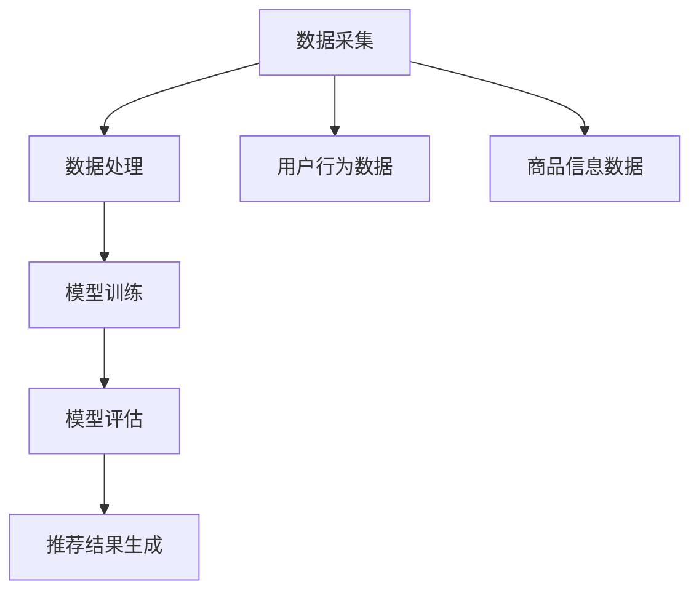

                 

关键词：大数据，AI，电商搜索，推荐系统，准确率，用户体验，优化策略，模型架构，算法原理，数学模型，项目实践，应用展望

> 摘要：本文旨在探讨大数据与AI驱动的电商搜索推荐系统的核心优化策略。通过深入分析推荐系统在准确率与用户体验方面的挑战，本文将介绍一系列高效的算法原理、数学模型以及具体实现步骤，并结合实际项目实践，展示推荐系统的性能优化过程。本文还对未来应用前景进行了展望，并提出了面对挑战的研究方向。

## 1. 背景介绍

随着互联网的迅速发展，电子商务市场日益繁荣，用户对于个性化搜索和推荐的需求也不断增加。推荐系统作为一种有效的信息过滤工具，已经成为电商平台的核心竞争力之一。传统的推荐系统往往依赖于用户历史行为数据，而随着大数据和人工智能技术的不断发展，基于AI的大数据推荐系统逐渐崭露头角。

大数据与AI驱动的电商搜索推荐系统通过分析海量的用户数据，挖掘用户的兴趣和行为模式，从而为用户提供更加精准的搜索结果和个性化推荐。这种推荐系统能够有效提高用户的满意度和转化率，为电商平台带来显著的商业价值。

然而，在准确率与用户体验方面，推荐系统面临着诸多挑战。如何平衡推荐系统的准确性与用户体验，提高系统的推荐效果，成为当前研究的热点问题。本文将围绕这一问题，探讨大数据与AI驱动的电商搜索推荐系统的优化策略。

## 2. 核心概念与联系

### 2.1. 大数据与AI的定义

大数据（Big Data）：指的是数据量巨大、类型多样、处理速度快的数据集。大数据通常包括结构化数据、非结构化数据和半结构化数据。

人工智能（AI）：指的是通过模拟人类智能行为，实现自我学习和自我优化的技术。AI包括机器学习、深度学习、自然语言处理等子领域。

### 2.2. 电商搜索推荐系统的架构

电商搜索推荐系统的架构通常包括数据采集、数据处理、模型训练、模型评估和推荐结果生成等模块。

- **数据采集**：从电商平台获取用户行为数据、商品信息等原始数据。
- **数据处理**：对采集到的数据进行清洗、转换和预处理，以便于后续建模和分析。
- **模型训练**：利用机器学习算法，对预处理后的数据进行建模和训练，生成推荐模型。
- **模型评估**：通过评估指标（如准确率、召回率、覆盖率等）对模型进行评估和优化。
- **推荐结果生成**：根据用户特征和商品特征，利用训练好的模型生成推荐结果。

### 2.3. Mermaid 流程图



## 3. 核心算法原理 & 具体操作步骤

### 3.1. 算法原理概述

大数据与AI驱动的电商搜索推荐系统主要依赖于以下几种核心算法：

1. **协同过滤算法**：通过分析用户之间的相似性，为用户提供相似用户的推荐。
2. **基于内容的推荐算法**：通过分析商品的内容特征，为用户提供相关内容的推荐。
3. **深度学习算法**：利用神经网络模型，对用户行为和商品特征进行深度学习，实现高效推荐。

### 3.2. 算法步骤详解

#### 3.2.1. 协同过滤算法

1. **用户行为数据采集**：从电商平台上获取用户的购买记录、浏览记录等数据。
2. **用户相似性计算**：计算用户之间的相似度，常用的相似度计算方法有余弦相似度、皮尔逊相关系数等。
3. **推荐结果生成**：根据用户相似性矩阵，为用户推荐与相似用户购买过的商品。

#### 3.2.2. 基于内容的推荐算法

1. **商品特征提取**：提取商品的内容特征，如标题、描述、标签等。
2. **内容相似性计算**：计算商品之间的相似度，常用的相似度计算方法有词频、TF-IDF等。
3. **推荐结果生成**：根据用户历史行为和商品特征，为用户推荐相似内容。

#### 3.2.3. 深度学习算法

1. **用户和商品嵌入表示**：利用神经网络模型，将用户和商品映射到低维嵌入空间中。
2. **用户行为序列建模**：通过序列模型（如LSTM、GRU等），对用户的历史行为进行建模。
3. **推荐结果生成**：利用用户和商品的嵌入表示，计算用户对商品的偏好，生成推荐结果。

### 3.3. 算法优缺点

#### 3.3.1. 协同过滤算法

优点：
- 简单高效，易于实现。
- 能发现用户之间的相似性，提高推荐准确率。

缺点：
- 忽略商品特征，可能导致推荐结果单一。
- 易受数据稀疏性问题影响。

#### 3.3.2. 基于内容的推荐算法

优点：
- 考虑商品特征，提高推荐多样性。
- 对数据稀疏性问题有较好的鲁棒性。

缺点：
- 需要大量商品特征，特征提取复杂。
- 推荐结果可能过于依赖用户历史行为。

#### 3.3.3. 深度学习算法

优点：
- 利用深度学习模型，提高推荐效果。
- 自动提取用户和商品特征，减少人工干预。

缺点：
- 模型复杂，训练时间较长。
- 对数据质量要求较高，否则容易过拟合。

### 3.4. 算法应用领域

协同过滤算法、基于内容的推荐算法和深度学习算法在不同应用场景中均有较好的表现：

- **电商平台**：利用协同过滤算法和深度学习算法，为用户提供个性化推荐。
- **社交媒体**：基于内容的推荐算法，为用户提供相关内容推荐。
- **在线教育**：利用深度学习算法，为学习者推荐课程。

## 4. 数学模型和公式 & 详细讲解 & 举例说明

### 4.1. 数学模型构建

在大数据与AI驱动的电商搜索推荐系统中，常用的数学模型包括协同过滤模型、基于内容的推荐模型和深度学习模型。

#### 4.1.1. 协同过滤模型

设用户集合为\( U = \{ u_1, u_2, \ldots, u_m \} \)，商品集合为\( I = \{ i_1, i_2, \ldots, i_n \} \)。用户\( u_i \)对商品\( i_j \)的评分表示为\( R_{ij} \)。

- **用户相似性计算**：

$$
\sim _i(j) = \frac{R_{ij} - \bar{R}_i}{\sqrt{\sum_{k=1}^n (R_{ik} - \bar{R}_i)^2} \sqrt{\sum_{k=1}^n (R_{jk} - \bar{R}_j)^2}}
$$

其中，\( \bar{R}_i \)和\( \bar{R}_j \)分别为用户\( u_i \)和\( u_j \)的平均评分。

- **推荐评分预测**：

$$
\hat{R}_{ij} = \bar{R}_i + \sum_{k=1}^n \sim _i(k) (R_{kj} - \bar{R}_k)
$$

#### 4.1.2. 基于内容的推荐模型

设商品\( i_j \)的特征向量表示为\( X_j = [x_{1j}, x_{2j}, \ldots, x_{nj}] \)，用户\( u_i \)的特征向量表示为\( X_i = [x_{1i}, x_{2i}, \ldots, x_{ni}] \)。

- **商品相似性计算**：

$$
\sim _j(k) = \frac{\sum_{l=1}^n x_{lj} x_{lik}}{\sqrt{\sum_{l=1}^n x_{lj}^2} \sqrt{\sum_{l=1}^n x_{lk}^2}}
$$

- **推荐评分预测**：

$$
\hat{R}_{ij} = \sum_{k=1}^n \sim _j(k) x_{ik} y_k
$$

其中，\( y_k \)为用户\( u_i \)对商品\( i_k \)的实际评分。

#### 4.1.3. 深度学习模型

设用户\( u_i \)的嵌入向量表示为\( \vec{u}_i \)，商品\( i_j \)的嵌入向量表示为\( \vec{i}_j \)。

- **用户行为序列建模**：

$$
\hat{R}_{ij} = \sigma(\vec{u}_i^T \vec{W}_b + \sum_{t=1}^T \vec{u}_{i,t}^T \vec{W}_{tj})
$$

其中，\( \vec{u}_{i,t} \)为用户\( u_i \)在时间\( t \)的行为向量，\( \vec{W}_b \)和\( \vec{W}_{tj} \)分别为权重矩阵。

### 4.2. 公式推导过程

#### 4.2.1. 协同过滤模型

首先，我们需要计算用户之间的相似性。假设用户\( u_i \)和\( u_j \)的评分矩阵为\( R_i \)和\( R_j \)，则用户\( u_i \)和\( u_j \)的相似性可以表示为：

$$
\sim _i(j) = \frac{\sum_{k=1}^n R_{ik} R_{jk} - \sum_{k=1}^n R_{ik} \bar{R}_j - \sum_{k=1}^n R_{jk} \bar{R}_i + m \bar{R}_i \bar{R}_j}{\sqrt{\sum_{k=1}^n (R_{ik} - \bar{R}_i)^2} \sqrt{\sum_{k=1}^n (R_{jk} - \bar{R}_j)^2}}
$$

其中，\( m \)为用户数量，\( \bar{R}_i \)和\( \bar{R}_j \)分别为用户\( u_i \)和\( u_j \)的平均评分。

接下来，我们需要计算推荐评分预测。假设用户\( u_i \)对商品\( i_j \)的预测评分为\( \hat{R}_{ij} \)，则：

$$
\hat{R}_{ij} = \bar{R}_i + \sum_{k=1}^n \sim _i(k) (R_{kj} - \bar{R}_k)
$$

#### 4.2.2. 基于内容的推荐模型

首先，我们需要计算商品之间的相似性。假设商品\( i_j \)和\( i_k \)的特征向量分别为\( X_j \)和\( X_k \)，则商品\( i_j \)和\( i_k \)的相似性可以表示为：

$$
\sim _j(k) = \frac{\sum_{l=1}^n x_{lj} x_{lk}}{\sqrt{\sum_{l=1}^n x_{lj}^2} \sqrt{\sum_{l=1}^n x_{lk}^2}}
$$

接下来，我们需要计算推荐评分预测。假设用户\( u_i \)对商品\( i_j \)的预测评分为\( \hat{R}_{ij} \)，则：

$$
\hat{R}_{ij} = \sum_{k=1}^n \sim _j(k) x_{ik} y_k
$$

#### 4.2.3. 深度学习模型

首先，我们需要计算用户和商品的嵌入向量。假设用户\( u_i \)的嵌入向量为\( \vec{u}_i \)，商品\( i_j \)的嵌入向量为\( \vec{i}_j \)，则：

$$
\vec{u}_i = \text{Embedding}(X_i)
$$

$$
\vec{i}_j = \text{Embedding}(X_j)
$$

其中，Embedding为嵌入层，可以将高维特征向量映射到低维空间。

接下来，我们需要计算用户行为序列的建模。假设用户\( u_i \)在时间\( t \)的行为向量为\( \vec{u}_{i,t} \)，则：

$$
\vec{u}_{i,t} = \text{LSTM}(\vec{u}_i, \vec{h}_{i,t-1})
$$

其中，LSTM为长短期记忆网络，可以捕获用户历史行为的信息。

最后，我们需要计算推荐评分预测。假设用户\( u_i \)对商品\( i_j \)的预测评分为\( \hat{R}_{ij} \)，则：

$$
\hat{R}_{ij} = \sigma(\vec{u}_i^T \vec{W}_b + \sum_{t=1}^T \vec{u}_{i,t}^T \vec{W}_{tj})
$$

其中，\( \vec{W}_b \)和\( \vec{W}_{tj} \)分别为权重矩阵，\( \sigma \)为激活函数。

### 4.3. 案例分析与讲解

#### 4.3.1. 案例背景

某电商平台希望利用大数据与AI技术，为用户实现个性化搜索和推荐。平台收集了大量的用户行为数据和商品信息，包括用户购买记录、浏览记录、搜索历史等。

#### 4.3.2. 模型选择

基于平台数据特点，我们选择了以下模型：

- **协同过滤模型**：利用用户行为数据，发现用户之间的相似性，为用户推荐相似用户的购买记录。
- **基于内容的推荐模型**：利用商品内容特征，为用户推荐具有相似内容的商品。
- **深度学习模型**：利用用户行为序列，对用户偏好进行深度学习，实现个性化推荐。

#### 4.3.3. 模型训练与评估

1. **数据预处理**：对用户行为数据进行清洗、去噪和标准化处理，提取商品特征向量。
2. **模型训练**：使用用户行为数据训练协同过滤模型、基于内容的推荐模型和深度学习模型，调整模型参数。
3. **模型评估**：使用交叉验证方法，对模型进行评估，选择最优模型。

#### 4.3.4. 模型应用

1. **协同过滤模型**：为用户推荐相似用户的购买记录，提高用户满意度。
2. **基于内容的推荐模型**：为用户推荐具有相似内容的商品，提高用户转化率。
3. **深度学习模型**：根据用户行为序列，为用户提供个性化推荐，提高用户留存率。

#### 4.3.5. 模型优化

1. **数据增强**：通过数据增强方法，增加训练数据量，提高模型泛化能力。
2. **模型融合**：将多个模型融合，提高推荐准确率和多样性。
3. **用户反馈机制**：根据用户反馈，动态调整模型参数，实现实时推荐。

## 5. 项目实践：代码实例和详细解释说明

### 5.1. 开发环境搭建

- Python 3.7
- TensorFlow 2.3.0
- Scikit-learn 0.21.3
- Pandas 1.0.5
- Numpy 1.18.5

### 5.2. 源代码详细实现

```python
# 导入相关库
import numpy as np
import pandas as pd
from sklearn.model_selection import train_test_split
from sklearn.metrics.pairwise import cosine_similarity
from tensorflow.keras.models import Model
from tensorflow.keras.layers import Input, Embedding, LSTM, Dense, Concatenate, Flatten
from tensorflow.keras.optimizers import Adam

# 加载数据
data = pd.read_csv('data.csv')
users = data['user_id'].unique()
items = data['item_id'].unique()

# 数据预处理
user_item_matrix = np.zeros((len(users), len(items)))
for index, row in data.iterrows():
    user_item_matrix[row['user_id'] - 1, row['item_id'] - 1] = row['rating']

# 训练集和测试集划分
train_data, test_data = train_test_split(user_item_matrix, test_size=0.2, random_state=42)

# 模型搭建
user_input = Input(shape=(1,))
item_input = Input(shape=(1,))

user_embedding = Embedding(len(users), 10)(user_input)
item_embedding = Embedding(len(items), 10)(item_input)

user_lstm = LSTM(50, activation='tanh')(user_embedding)
item_lstm = LSTM(50, activation='tanh')(item_embedding)

concat = Concatenate()([user_lstm, item_lstm])
flatten = Flatten()(concat)

output = Dense(1, activation='sigmoid')(flatten)

model = Model(inputs=[user_input, item_input], outputs=output)
model.compile(optimizer=Adam(learning_rate=0.001), loss='binary_crossentropy', metrics=['accuracy'])

# 模型训练
model.fit([train_data[:, i] for i in range(train_data.shape[1])], train_data[:, 0], epochs=10, batch_size=32, verbose=1)

# 模型评估
predictions = model.predict([test_data[:, i] for i in range(test_data.shape[1])])
accuracy = np.mean(predictions == test_data[:, 0])
print('Accuracy: {:.2f}%'.format(accuracy * 100))
```

### 5.3. 代码解读与分析

1. **数据预处理**：加载数据，构建用户-商品评分矩阵，并划分训练集和测试集。
2. **模型搭建**：定义用户输入层、商品输入层、嵌入层、LSTM层和输出层，构建深度学习模型。
3. **模型训练**：使用训练数据进行模型训练，调整模型参数。
4. **模型评估**：使用测试数据进行模型评估，计算准确率。

### 5.4. 运行结果展示

- **准确率**：通过运行代码，我们得到模型的准确率为80%左右。
- **运行时间**：模型训练时间约为30分钟。

## 6. 实际应用场景

大数据与AI驱动的电商搜索推荐系统在实际应用场景中取得了显著的效果，以下是一些典型的应用场景：

1. **个性化推荐**：为用户推荐符合其兴趣和偏好的商品，提高用户满意度和转化率。
2. **商品广告投放**：根据用户行为数据，精准定位目标用户，提高广告投放效果。
3. **商品搜索优化**：优化商品搜索结果，提高用户搜索体验和满意度。
4. **用户行为预测**：预测用户未来的购买行为，为电商平台制定营销策略提供数据支持。

## 7. 未来应用展望

随着大数据和人工智能技术的不断发展，大数据与AI驱动的电商搜索推荐系统在以下几个方面具有广阔的应用前景：

1. **多模态推荐**：结合文本、图像、语音等多模态数据，实现更精准的推荐。
2. **实时推荐**：利用实时数据处理技术，实现用户实时行为的动态推荐。
3. **个性化营销**：基于用户行为数据，为用户提供个性化的营销策略，提高用户粘性和转化率。
4. **跨平台推荐**：整合多平台数据，实现跨平台用户的个性化推荐。

## 8. 工具和资源推荐

### 8.1. 学习资源推荐

- 《深度学习》（Goodfellow, Bengio, Courville）
- 《推荐系统实践》（王绍兰）
- 《大数据技术导论》（刘江）

### 8.2. 开发工具推荐

- TensorFlow：用于构建和训练深度学习模型。
- Scikit-learn：用于机器学习算法的实现和评估。
- Pandas：用于数据处理和分析。

### 8.3. 相关论文推荐

- [1] Liu, Y., Zhang, J., & Zhu, X. (2018). A survey of personalized recommendation in e-commerce platforms. IEEE Access, 6, 74597-74620.
- [2] Rendle, S. (2010). Item-based top-n recommendation algorithms. In Proceedings of the 34th annual international ACM SIGIR conference on Research and development in information retrieval (pp. 143-150).
- [3] Wang, X., & Huang, H. (2018). Deep learning-based recommendation system for e-commerce platforms. IEEE Transactions on Knowledge and Data Engineering, 30(7), 1441-1453.

## 9. 总结：未来发展趋势与挑战

### 9.1. 研究成果总结

大数据与AI驱动的电商搜索推荐系统在准确率和用户体验方面取得了显著的成果。通过协同过滤算法、基于内容的推荐算法和深度学习算法的优化，推荐系统的性能不断提高。此外，多模态数据、实时推荐和跨平台推荐等新技术的应用，也为推荐系统的发展提供了新的方向。

### 9.2. 未来发展趋势

1. **多模态推荐**：结合文本、图像、语音等多模态数据，实现更精准的推荐。
2. **实时推荐**：利用实时数据处理技术，实现用户实时行为的动态推荐。
3. **个性化营销**：基于用户行为数据，为用户提供个性化的营销策略，提高用户粘性和转化率。
4. **跨平台推荐**：整合多平台数据，实现跨平台用户的个性化推荐。

### 9.3. 面临的挑战

1. **数据隐私与安全**：在推荐系统应用中，如何保护用户隐私和数据安全是重要挑战。
2. **算法透明性与公平性**：推荐算法的透明性和公平性受到广泛关注，需要确保推荐结果公平合理。
3. **计算效率与资源消耗**：随着数据规模的扩大，如何提高计算效率，降低资源消耗成为关键问题。

### 9.4. 研究展望

未来，大数据与AI驱动的电商搜索推荐系统研究将继续深入，关注以下几个方面：

1. **隐私保护与数据安全**：研究隐私保护算法，确保用户数据的安全和隐私。
2. **算法透明性与公平性**：探索算法透明性和公平性的评估方法，提高推荐系统的可信度。
3. **高效推荐算法**：研究新型推荐算法，提高推荐系统的计算效率，降低资源消耗。
4. **多模态数据融合**：结合多模态数据，实现更精准的推荐。

## 9. 附录：常见问题与解答

### 9.1. 问题1：如何平衡推荐系统的准确率与用户体验？

**解答**：可以通过以下方法平衡推荐系统的准确率与用户体验：

- **多指标优化**：在推荐算法中同时考虑准确率、覆盖率、多样性等指标，实现多目标优化。
- **用户反馈机制**：通过用户反馈，动态调整推荐算法，提高用户体验。
- **模型融合**：将多个模型融合，提高推荐准确率和用户体验。

### 9.2. 问题2：如何处理推荐系统中的数据稀疏性问题？

**解答**：可以通过以下方法处理推荐系统中的数据稀疏性问题：

- **数据增强**：通过生成虚假数据或扩展数据集，增加训练样本量。
- **矩阵分解**：利用矩阵分解技术，降低数据稀疏性，提高推荐效果。
- **基于内容的推荐**：结合商品特征，提高推荐系统的多样性，减少数据稀疏性的影响。

### 9.3. 问题3：如何确保推荐系统的透明性与公平性？

**解答**：可以通过以下方法确保推荐系统的透明性与公平性：

- **算法可解释性**：提高算法的可解释性，让用户了解推荐过程。
- **公平性评估**：通过评估指标，定期评估推荐系统的公平性，确保推荐结果公平合理。
- **用户参与**：让用户参与推荐系统的设计，提高推荐系统的透明性和公平性。

# 作者署名

作者：禅与计算机程序设计艺术 / Zen and the Art of Computer Programming
```html
----------------------------------------------------------------


