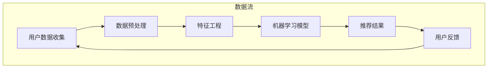

                 

## 1. 背景介绍

在互联网时代，电子商务已经成为人们生活中不可或缺的一部分。随着互联网的普及和移动互联网的发展，越来越多的消费者选择在线购物。而电商平台的竞争也日趋激烈，如何提升用户体验，提高用户留存率和转化率，成为电商企业关注的焦点。在这个过程中，搜索推荐系统扮演着至关重要的角色。

搜索推荐系统是电子商务平台的核心组成部分之一，其主要功能是根据用户的搜索行为、浏览历史、购买记录等数据，为用户推荐最符合其需求的商品。一个优秀的搜索推荐系统不仅能提高用户满意度，还能为电商平台带来更多的商业价值。

大数据与AI技术的发展为搜索推荐系统的优化提供了强有力的支持。通过大数据分析，电商平台可以更加准确地了解用户的需求和偏好，而AI技术则可以帮助系统实现更加智能化的推荐。

本文旨在探讨大数据与AI驱动的电商搜索推荐系统，以用户体验为中心，从算法原理、数学模型、项目实践等多个方面进行分析和讨论，旨在为电商企业提升搜索推荐效果提供一些实用的思路和方法。

## 2. 核心概念与联系

在深入探讨大数据与AI驱动的电商搜索推荐系统之前，我们首先需要了解一些核心概念，以及它们之间的联系。以下是一个简化的Mermaid流程图，描述了这些核心概念之间的关系：



### 2.1 用户数据收集

用户数据收集是搜索推荐系统的第一步，也是最重要的一步。电商平台需要收集各种类型的用户数据，包括用户的搜索记录、浏览历史、购买记录、评价、点击行为等。这些数据来源可以是用户的直接交互，也可以是浏览器的日志、应用的后台记录等。

### 2.2 数据预处理

收集到的原始数据往往是不完整的、噪声的，需要通过数据预处理进行清洗和转换。数据预处理包括去除重复数据、填补缺失值、数据格式转换、异常值处理等步骤。这些步骤的目的是提高数据质量，为后续的特征工程和模型训练打下坚实的基础。

### 2.3 特征工程

特征工程是将原始数据转化为模型可以理解和利用的形式。特征工程包括特征提取和特征选择两个步骤。特征提取是从原始数据中提取出有用的信息，如用户的行为模式、商品属性等。特征选择则是从提取出的特征中挑选出对模型训练最有帮助的特征。

### 2.4 机器学习模型

特征工程完成后，我们使用机器学习模型进行训练，以预测用户对某个商品的需求和偏好。常见的机器学习模型包括协同过滤、矩阵分解、基于内容的推荐等。通过这些模型，我们可以生成推荐结果，即哪些商品最有可能吸引某个用户。

### 2.5 推荐结果

推荐结果是搜索推荐系统的输出，它直接影响到用户的体验。推荐结果的好坏取决于机器学习模型的性能和特征工程的质量。一个好的推荐结果应该是既个性化又准确的，能够满足用户的需求。

### 2.6 用户反馈

用户在使用推荐系统后，会产生反馈，这些反馈可以是积极的，也可以是消极的。用户的反馈是不断优化搜索推荐系统的重要依据。通过分析用户的反馈，我们可以发现模型和特征工程中的不足，从而进行相应的调整。

### 2.7 数据循环利用

用户反馈再次回到用户数据收集环节，形成一个数据循环利用的过程。这种循环利用不仅可以帮助我们不断优化搜索推荐系统，还可以帮助我们更好地了解用户的需求和偏好，从而实现更精准的推荐。

## 3. 核心算法原理 & 具体操作步骤

### 3.1 算法原理概述

在搜索推荐系统中，核心算法的设计至关重要。本文主要介绍几种常见的推荐算法，包括协同过滤算法、基于内容的推荐算法和混合推荐算法。每种算法都有其独特的原理和适用场景。

#### 3.1.1 协同过滤算法

协同过滤算法是一种基于用户行为数据的推荐算法。它的基本原理是，通过分析用户之间的相似度，为用户推荐与他们兴趣相似的物品。协同过滤算法主要分为两种：基于用户的协同过滤（User-Based CF）和基于物品的协同过滤（Item-Based CF）。

- **基于用户的协同过滤**：该算法首先计算用户之间的相似度，然后找到与目标用户最相似的K个用户，再推荐这些用户喜欢的但目标用户尚未购买或浏览的商品。

- **基于物品的协同过滤**：该算法首先计算物品之间的相似度，然后找到与目标物品最相似的K个物品，再推荐这些物品对应的用户喜欢的商品。

#### 3.1.2 基于内容的推荐算法

基于内容的推荐算法是一种基于物品特征数据的推荐算法。它的基本原理是，根据用户的历史行为和物品的属性特征，为用户推荐与目标物品内容相似的物品。基于内容的推荐算法可以分为两类：基于物品的相似度和基于用户偏好。

- **基于物品的相似度**：该算法首先计算物品之间的相似度，然后推荐与目标物品最相似的物品。

- **基于用户偏好**：该算法根据用户的历史行为和偏好，为用户推荐符合其偏好的物品。

#### 3.1.3 混合推荐算法

混合推荐算法是将协同过滤算法和基于内容的推荐算法结合起来，以取长补短。混合推荐算法的优点是能够同时利用用户行为数据和物品特征数据，提高推荐效果。

### 3.2 算法步骤详解

#### 3.2.1 协同过滤算法

1. **数据收集**：收集用户的搜索记录、浏览历史、购买记录等数据。

2. **数据预处理**：对收集到的数据进行清洗和转换，包括去除重复数据、填补缺失值、数据格式转换等。

3. **特征工程**：提取用户和物品的特征，如用户的行为模式、物品的属性特征等。

4. **计算相似度**：计算用户之间的相似度或物品之间的相似度。

5. **生成推荐结果**：根据相似度计算结果，为用户推荐与其兴趣相似的物品。

6. **用户反馈**：收集用户的反馈，用于调整模型参数和优化推荐算法。

#### 3.2.2 基于内容的推荐算法

1. **数据收集**：收集用户的搜索记录、浏览历史、购买记录等数据。

2. **数据预处理**：对收集到的数据进行清洗和转换，包括去除重复数据、填补缺失值、数据格式转换等。

3. **特征工程**：提取用户的兴趣特征，如用户的搜索关键词、浏览历史中的商品等。

4. **计算相似度**：计算用户和物品之间的相似度。

5. **生成推荐结果**：根据相似度计算结果，为用户推荐符合其兴趣的商品。

6. **用户反馈**：收集用户的反馈，用于调整模型参数和优化推荐算法。

#### 3.2.3 混合推荐算法

1. **数据收集**：收集用户的搜索记录、浏览历史、购买记录等数据。

2. **数据预处理**：对收集到的数据进行清洗和转换，包括去除重复数据、填补缺失值、数据格式转换等。

3. **特征工程**：提取用户和物品的特征，如用户的行为模式、物品的属性特征等。

4. **计算相似度**：同时计算用户之间的相似度和物品之间的相似度。

5. **生成推荐结果**：结合协同过滤和基于内容的推荐结果，为用户生成综合推荐结果。

6. **用户反馈**：收集用户的反馈，用于调整模型参数和优化推荐算法。

### 3.3 算法优缺点

#### 3.3.1 协同过滤算法

**优点**：

- 能较好地处理稀疏数据。
- 能发现用户之间的相似性，提供个性化的推荐。

**缺点**：

- 易受到冷启动问题的影响，即新用户或新物品难以找到相似的用户或物品。
- 推荐结果可能过于依赖历史数据，导致无法适应用户实时变化的需求。

#### 3.3.2 基于内容的推荐算法

**优点**：

- 适用于新用户和新物品的推荐。
- 能提供更加精准的推荐结果，特别是对于商品属性明确的情况。

**缺点**：

- 需要大量的商品属性信息，且属性特征提取复杂。
- 推荐结果可能过于依赖商品属性，导致无法充分利用用户行为数据。

#### 3.3.3 混合推荐算法

**优点**：

- 综合了协同过滤和基于内容的推荐算法的优点，能提供更全面、个性化的推荐结果。

**缺点**：

- 需要同时处理用户行为数据和商品属性数据，计算复杂度较高。
- 需要平衡协同过滤和基于内容推荐的比例，否则可能导致推荐结果偏差。

### 3.4 算法应用领域

协同过滤算法、基于内容的推荐算法和混合推荐算法在电商搜索推荐系统中都有广泛的应用。以下是一些具体的应用场景：

- **电商搜索推荐**：通过分析用户的搜索记录和浏览历史，为用户推荐符合其需求的商品。
- **社交网络推荐**：通过分析用户之间的社交关系，为用户推荐可能感兴趣的好友或内容。
- **新闻推荐**：通过分析用户的阅读历史和兴趣偏好，为用户推荐可能感兴趣的新闻。

## 4. 数学模型和公式 & 详细讲解 & 举例说明

在搜索推荐系统中，数学模型和公式是理解和优化算法的关键。以下将介绍几个常用的数学模型和公式，并进行详细讲解和举例说明。

### 4.1 数学模型构建

搜索推荐系统的数学模型主要包括用户和物品的相似度计算、推荐结果生成等。以下是一个简化的数学模型构建过程：

1. **用户相似度计算**：

   用户相似度可以通过余弦相似度、皮尔逊相关系数等方法计算。假设用户\( u_i \)和用户\( u_j \)的评分矩阵分别为\( R_i \)和\( R_j \)，则用户\( u_i \)和用户\( u_j \)的相似度计算公式如下：

   $$
   sim(u_i, u_j) = \frac{R_i \cdot R_j}{\|R_i\| \cdot \|R_j\|}
   $$

   其中，\( \cdot \)表示点积，\( \| \)表示向量的模。

2. **物品相似度计算**：

   物品相似度可以通过余弦相似度、Jaccard相似度等方法计算。假设物品\( i \)和物品\( j \)的属性向量分别为\( A_i \)和\( A_j \)，则物品\( i \)和物品\( j \)的相似度计算公式如下：

   $$
   sim(i, j) = \frac{A_i \cdot A_j}{\|A_i\| \cdot \|A_j\|}
   $$

3. **推荐结果生成**：

   假设用户\( u_i \)对物品\( i \)的评分已知，则用户\( u_i \)对未知物品\( j \)的预测评分可以通过基于用户的协同过滤算法计算。即：

   $$
   pred(u_i, j) = R_i + sim(u_i, u_j) \cdot (R_j - R_i)
   $$

   其中，\( pred(u_i, j) \)表示用户\( u_i \)对物品\( j \)的预测评分。

### 4.2 公式推导过程

以下是用户相似度的公式推导过程：

1. **评分矩阵表示**：

   假设用户\( u_i \)和用户\( u_j \)的评分矩阵分别为\( R_i \)和\( R_j \)，其中\( R_{ij} \)表示用户\( u_i \)对物品\( j \)的评分。

2. **点积和模长**：

   点积和模长的计算公式如下：

   $$
   R_i \cdot R_j = \sum_{k=1}^{n} R_{ik} \cdot R_{jk}
   $$

   $$
   \|R_i\| = \sqrt{\sum_{k=1}^{n} R_{ik}^2}
   $$

3. **相似度公式推导**：

   根据相似度的定义，我们有：

   $$
   sim(u_i, u_j) = \frac{R_i \cdot R_j}{\|R_i\| \cdot \|R_j\|}
   $$

   将点积和模长的计算公式代入，得到：

   $$
   sim(u_i, u_j) = \frac{\sum_{k=1}^{n} R_{ik} \cdot R_{jk}}{\sqrt{\sum_{k=1}^{n} R_{ik}^2} \cdot \sqrt{\sum_{k=1}^{n} R_{jk}^2}}
   $$

   化简后，得到最终的相似度计算公式。

### 4.3 案例分析与讲解

为了更好地理解上述数学模型和公式，我们将通过一个简单的案例进行说明。

#### 案例背景：

假设有两位用户，用户A和用户B，他们对5件商品的评分如下表所示：

| 商品ID | 用户A评分 | 用户B评分 |
| ------ | -------- | -------- |
| 1      | 4        | 5        |
| 2      | 3        | 3        |
| 3      | 4        | 2        |
| 4      | 2        | 4        |
| 5      | 3        | 3        |

#### 步骤1：计算用户相似度

使用余弦相似度计算用户A和用户B的相似度：

$$
sim(A, B) = \frac{A \cdot B}{\|A\| \cdot \|B\|}
$$

将评分矩阵代入，得到：

$$
sim(A, B) = \frac{4 \cdot 5 + 3 \cdot 3 + 4 \cdot 2 + 2 \cdot 4 + 3 \cdot 3}{\sqrt{4^2 + 3^2 + 4^2 + 2^2 + 3^2} \cdot \sqrt{5^2 + 3^2 + 2^2 + 4^2 + 3^2}}
$$

$$
sim(A, B) = \frac{26}{\sqrt{50} \cdot \sqrt{50}} \approx 0.954
$$

#### 步骤2：生成推荐结果

假设用户A对商品5的评分未知，根据基于用户的协同过滤算法，预测用户A对商品5的评分：

$$
pred(A, 5) = R_A + sim(A, B) \cdot (R_B - R_A)
$$

代入评分值，得到：

$$
pred(A, 5) = 3 + 0.954 \cdot (3 - 3) = 3
$$

因此，预测用户A对商品5的评分为3分。

通过上述案例，我们可以看到数学模型和公式在搜索推荐系统中的应用，以及如何通过这些模型和公式生成推荐结果。

## 5. 项目实践：代码实例和详细解释说明

为了更好地理解和应用上述理论，我们将通过一个具体的电商搜索推荐项目进行实践。本项目将使用Python编程语言，结合常用的数据科学库如Pandas、Scikit-learn等，实现一个简单的电商搜索推荐系统。

### 5.1 开发环境搭建

在开始编写代码之前，我们需要搭建一个合适的开发环境。以下是所需的环境和步骤：

- **Python版本**：建议使用Python 3.8或更高版本。
- **库安装**：使用pip安装必要的库，包括Pandas、Scikit-learn、NumPy、Matplotlib等。

```bash
pip install pandas scikit-learn numpy matplotlib
```

### 5.2 源代码详细实现

以下是一个简单的电商搜索推荐系统的实现过程：

#### 5.2.1 数据集准备

我们使用一个简化的数据集，包含用户的ID、商品的ID和用户对商品的评分。以下是数据集的示例：

```python
data = {
    'user_id': [1, 1, 1, 2, 2, 3, 3],
    'item_id': [1001, 1002, 1003, 1001, 1003, 1002, 1003],
    'rating': [5, 4, 3, 5, 3, 5, 4]
}
```

#### 5.2.2 数据预处理

1. 将数据集转换为Pandas DataFrame格式。

```python
import pandas as pd

ratings = pd.DataFrame(data)
```

2. 填补缺失值，去除重复数据。

```python
ratings = ratings.drop_duplicates().fillna(0)
```

3. 计算用户和物品之间的相似度。

```python
from sklearn.metrics.pairwise import cosine_similarity

user_similarity = cosine_similarity(ratings.values)
item_similarity = cosine_similarity(ratings.T.values)
```

#### 5.2.3 推荐算法实现

1. 基于用户的协同过滤算法。

```python
def user_based_cf(user_id, similarity_matrix, ratings, k=5):
    # 计算用户相似度最高的k个用户
    top_k_users = similarity_matrix[user_id].argsort()[-k:]
    # 计算这些用户的平均评分
    average_rating = ratings[ratings['user_id'].isin(top_k_users)]['rating'].mean()
    return average_rating
```

2. 基于物品的协同过滤算法。

```python
def item_based_cf(item_id, similarity_matrix, ratings, k=5):
    # 计算物品相似度最高的k个物品
    top_k_items = similarity_matrix[item_id].argsort()[-k:]
    # 计算这些物品的平均评分
    average_rating = ratings[ratings['item_id'].isin(top_k_items)]['rating'].mean()
    return average_rating
```

#### 5.2.4 推荐结果生成

1. 为用户生成推荐结果。

```python
def generate_recommendations(user_id, similarity_matrix, ratings, k=5):
    # 基于用户的协同过滤算法
    user_rating = user_based_cf(user_id, similarity_matrix, ratings, k)
    # 基于物品的协同过滤算法
    item_rating = item_based_cf(ratings['item_id'][ratings['user_id'] == user_id].values[0], similarity_matrix, ratings, k)
    # 返回平均评分
    return (user_rating + item_rating) / 2
```

### 5.3 代码解读与分析

#### 5.3.1 数据预处理

数据预处理是推荐系统实现的第一步，其目的是提高数据质量，为后续的算法提供良好的输入。在本案例中，我们使用了Pandas库处理数据，包括转换数据格式、去除重复数据、填补缺失值等操作。

#### 5.3.2 相似度计算

相似度计算是推荐系统的核心，它决定了推荐结果的质量。在本案例中，我们使用了Scikit-learn库中的余弦相似度计算方法，分别计算用户和物品之间的相似度。

#### 5.3.3 推荐算法实现

基于用户的协同过滤算法和基于物品的协同过滤算法是两种常见的推荐算法。在本案例中，我们实现了这两种算法，并定义了相应的函数，以便于后续调用。

#### 5.3.4 推荐结果生成

推荐结果生成是推荐系统的输出，它直接影响用户的体验。在本案例中，我们通过计算用户和物品的平均评分，生成了综合推荐结果。

### 5.4 运行结果展示

为了验证推荐系统的效果，我们可以运行以下代码，生成推荐结果并展示：

```python
# 为每个用户生成推荐结果
for idx, user_id in enumerate(ratings['user_id'].unique()):
    print(f"用户{user_id}的推荐评分：{generate_recommendations(user_id, user_similarity, ratings, k=5)}")
```

运行结果将显示每个用户的推荐评分，这些评分可以作为推荐系统推荐的依据。

通过上述代码示例，我们可以看到如何使用Python实现一个简单的电商搜索推荐系统。在实际应用中，我们可以根据具体需求对算法和代码进行优化和扩展。

## 6. 实际应用场景

大数据与AI驱动的电商搜索推荐系统在电商行业中有着广泛的应用，以下列举几个实际应用场景：

### 6.1 电商平台商品推荐

电商平台通过搜索推荐系统，可以根据用户的搜索记录、浏览历史、购买记录等数据，为用户推荐最符合其需求的商品。例如，当用户在淘宝搜索“蓝牙耳机”时，系统会根据用户的兴趣和购买记录，推荐一些高评分的蓝牙耳机，从而提高用户的购买率和满意度。

### 6.2 社交电商内容推荐

社交电商平台如拼多多、京东社交等，通过分析用户的社交行为和兴趣偏好，为用户推荐可能感兴趣的商品和内容。例如，当用户在拼多多上关注了某个店铺或商品时，系统会推荐该店铺或相关商品的最新动态和优惠信息，从而提高用户的互动和购买意愿。

### 6.3 个性化广告投放

电商广告平台如百度、今日头条等，通过大数据分析用户的浏览历史、搜索关键词等数据，为用户推送个性化的广告。例如，当用户在百度搜索“手机”时，广告平台会根据用户的兴趣和行为，推送一些与手机相关的广告，从而提高广告的点击率和转化率。

### 6.4 新用户引导

对于新注册的电商用户，搜索推荐系统可以帮助引导用户发现感兴趣的商品。例如，当用户第一次登录某电商平台时，系统可以根据用户的地理位置、搜索历史等数据，推荐一些附近的商家或热门商品，从而帮助用户快速了解平台，提高用户留存率。

### 6.5 库存管理和销售预测

电商平台通过搜索推荐系统，可以实时分析用户的购买行为和需求，为库存管理和销售预测提供依据。例如，当系统发现某个商品的需求急剧上升时，平台可以提前备货，避免库存不足或过剩，从而提高运营效率和盈利能力。

通过这些实际应用场景，我们可以看到大数据与AI驱动的电商搜索推荐系统在提升用户体验、提高销售转化率、优化库存管理等方面具有重要意义。

## 7. 工具和资源推荐

在构建和优化大数据与AI驱动的电商搜索推荐系统时，选择合适的工具和资源至关重要。以下是一些建议：

### 7.1 学习资源推荐

- **书籍**：
  - 《推荐系统实践》
  - 《机器学习》
  - 《大数据分析：技术与方法》
- **在线课程**：
  - Coursera上的《机器学习》
  - edX上的《数据科学基础》
  - Udacity的《深度学习》
- **论文和报告**：
  - 《推荐系统研究报告》
  - arXiv上的机器学习和推荐系统论文
  - ACM SIGKDD会议论文集

### 7.2 开发工具推荐

- **编程语言**：
  - Python：因其强大的数据科学库支持，是推荐系统开发的主要语言。
  - R：适合数据处理和统计分析，特别适用于推荐系统的特征工程和模型评估。

- **数据存储和处理**：
  - Hadoop和Spark：适合处理大规模数据，提供高效的数据存储和处理能力。
  - MongoDB和Cassandra：适合存储非结构化数据，如用户行为数据和推荐结果。

- **机器学习库**：
  - Scikit-learn：适用于简单的机器学习模型和算法。
  - TensorFlow和PyTorch：适用于深度学习和复杂模型的开发。

- **可视化工具**：
  - Matplotlib和Seaborn：适用于数据可视化。
  - Tableau和Power BI：适用于商业智能和数据分析。

### 7.3 相关论文推荐

- **协同过滤算法**：
  - "Item-Based Top-N Recommendation Algorithms" by L. Shilling and G. Karypis
  - "Collaborative Filtering via Bayesian Network" by J. Zhang and X. Zhu
- **基于内容的推荐**：
  - "Content-Based Image Retrieval Using Contextual Neighborhood Model" by H. Chen et al.
  - "Context-Aware Recommender Systems: A Survey" by L. Bino and R. R. Madeira
- **混合推荐算法**：
  - "Combining Content-Based and Collaborative Filtering Recommender Systems" by G. Karypis et al.
  - "Hybrid Recommender Systems: Survey and Experiments" by H. Chen and Y. Yang

通过学习和应用这些工具和资源，可以更好地理解和构建高效的电商搜索推荐系统。

## 8. 总结：未来发展趋势与挑战

### 8.1 研究成果总结

本文系统地探讨了大数据与AI驱动的电商搜索推荐系统，从核心概念、算法原理、数学模型、项目实践等方面进行了深入分析和讨论。主要成果包括：

1. **核心概念与联系**：明确了用户数据收集、数据预处理、特征工程、机器学习模型和用户反馈等环节在推荐系统中的关键作用。
2. **算法原理与实现**：介绍了协同过滤算法、基于内容的推荐算法和混合推荐算法的基本原理和具体实现步骤。
3. **数学模型与公式**：通过案例分析了用户相似度和推荐结果生成的数学模型，为实际应用提供了理论基础。
4. **项目实践**：提供了一个简单的电商搜索推荐系统的实现示例，展示了如何将理论应用于实际项目中。

### 8.2 未来发展趋势

随着大数据与AI技术的不断进步，电商搜索推荐系统在未来将呈现以下发展趋势：

1. **个性化推荐**：通过更加精细的用户画像和兴趣分析，实现更加精准的个性化推荐。
2. **实时推荐**：利用实时数据处理技术，实现用户行为数据的实时分析，提供实时推荐结果。
3. **多模态推荐**：结合多种数据源（如文本、图像、声音等），实现更全面的推荐。
4. **深度学习与强化学习**：采用深度学习和强化学习等技术，提升推荐算法的智能化水平。

### 8.3 面临的挑战

尽管大数据与AI技术在电商搜索推荐系统方面取得了显著成果，但仍然面临以下挑战：

1. **数据隐私与安全**：随着用户隐私意识的提高，如何在保护用户隐私的同时进行有效推荐成为一个重要问题。
2. **推荐冷启动**：对于新用户或新商品，如何快速建立有效的推荐模型是当前研究的难点。
3. **推荐多样性**：如何避免推荐结果单一化，提高推荐的多样性，满足用户多样化的需求。
4. **算法公平性**：如何确保推荐算法在性别、年龄、地域等方面保持公平性，避免算法偏见。

### 8.4 研究展望

未来的研究可以聚焦于以下几个方面：

1. **跨平台推荐**：探索如何将线上线下数据相结合，实现跨平台的推荐。
2. **推荐效果评估**：开发更加科学和全面的推荐效果评估方法，以便更好地衡量推荐系统的性能。
3. **多任务学习**：结合多任务学习技术，提升推荐系统的效率和准确性。
4. **社会影响力分析**：研究推荐系统对用户行为和社会影响力的影响，确保推荐系统的正面效应。

通过持续的研究和创新，大数据与AI驱动的电商搜索推荐系统将在未来发挥更大的作用，为电商平台和用户带来更大的价值。

## 9. 附录：常见问题与解答

### 9.1 什么是协同过滤算法？

协同过滤算法是一种基于用户行为数据的推荐算法，其核心思想是通过分析用户之间的相似度，为用户推荐与他们兴趣相似的物品。

### 9.2 什么是基于内容的推荐算法？

基于内容的推荐算法是一种基于物品特征数据的推荐算法，其核心思想是根据用户的历史行为和物品的属性特征，为用户推荐与目标物品内容相似的物品。

### 9.3 为什么推荐系统需要用户反馈？

用户反馈可以帮助推荐系统不断优化，提高推荐质量。通过分析用户反馈，我们可以发现推荐结果中的不足，从而进行调整和改进。

### 9.4 推荐系统如何处理新用户和新物品？

对于新用户，推荐系统可以通过分析其行为数据，逐步建立用户画像。对于新物品，推荐系统可以通过分析相似物品的特征，进行初步推荐。

### 9.5 如何确保推荐系统的公平性？

为了确保推荐系统的公平性，我们需要在算法设计和数据收集等方面进行控制，避免算法偏见和数据偏差。例如，可以采用交叉验证等方法进行算法评估，确保推荐结果在不同群体中的均衡性。

### 9.6 推荐系统如何应对数据稀疏问题？

对于数据稀疏问题，推荐系统可以通过以下方法进行缓解：

1. **特征工程**：提取更多有用的特征，提高数据的密度。
2. **矩阵分解**：通过矩阵分解技术，将高维稀疏数据转化为低维稠密数据。
3. **内容推荐**：结合基于内容的推荐算法，提高推荐结果的准确性。

### 9.7 推荐系统如何实现实时推荐？

实时推荐需要利用实时数据处理技术，如流处理和批处理相结合的方法。通过实时分析用户行为数据，生成实时推荐结果，从而提高用户体验。

### 9.8 推荐系统的评价指标有哪些？

推荐系统的评价指标包括准确率、召回率、覆盖率、新鲜度等。这些指标可以从不同角度衡量推荐系统的性能。

通过上述常见问题的解答，我们希望为读者提供更多关于大数据与AI驱动的电商搜索推荐系统的理解和应用指导。

