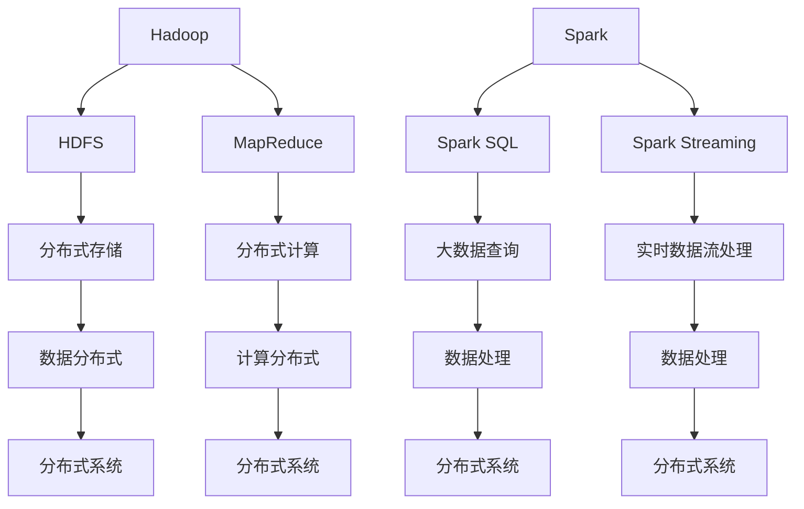

                 

关键词：大数据分析、Hadoop、Spark、分布式计算、数据处理、开源框架、云计算

摘要：本文将深入探讨大数据分析领域中两个重要的开源框架——Hadoop 和 Spark。通过对比它们的核心概念、架构设计、核心算法、数学模型、项目实践，以及实际应用场景，我们将全面了解这两个框架的优势和局限性，并为未来的发展提出展望。

## 1. 背景介绍

随着互联网的快速发展，数据量呈现爆炸式增长，传统的数据处理方法已经无法满足需求。为了应对这一挑战，分布式计算技术应运而生。Hadoop 和 Spark 作为分布式计算领域的代表，成为了大数据处理的重要工具。

Hadoop 是由 Apache 软件基金会开发的一个开源框架，主要用于大数据存储和分布式计算。它由两个核心组件组成：HDFS（Hadoop Distributed File System，Hadoop 分布式文件系统）和 MapReduce（一种编程模型，用于大规模数据集的并行运算）。Hadoop 的核心思想是将数据分散存储在多个节点上，并通过分布式计算来提高数据处理效率。

Spark 是由加州大学伯克利分校的 AMPLab 开发的一个开源分布式计算引擎，它提供了更为高效和灵活的分布式数据处理能力。Spark 支持多种编程语言，如 Scala、Python 和 Java，并且具有内存计算的优势，能够在短时间内处理大量数据。

## 2. 核心概念与联系

为了更好地理解 Hadoop 和 Spark 的核心概念和架构设计，我们可以使用 Mermaid 流程图来展示它们之间的关系。



通过这个 Mermaid 流程图，我们可以看到 Hadoop 和 Spark 在分布式存储、分布式计算和数据处理方面的联系。接下来，我们将详细探讨它们的核心算法原理、数学模型和具体操作步骤。

## 3. 核心算法原理 & 具体操作步骤

### 3.1 算法原理概述

Hadoop 的核心算法是 MapReduce，它将数据处理过程分为两个阶段：Map（映射）和 Reduce（归约）。在 Map 阶段，输入数据被映射为一系列的键值对；在 Reduce 阶段，这些键值对被归约为最终的输出结果。

Spark 的核心算法则更加灵活，包括 Spark SQL、Spark Streaming 和 MLlib（机器学习库）等。Spark SQL 提供了类似于 SQL 的查询接口，用于处理静态数据；Spark Streaming 则支持实时数据流处理；MLlib 提供了多种机器学习算法，用于构建和训练机器学习模型。

### 3.2 算法步骤详解

#### Hadoop 的 MapReduce

1. **Map 阶段：**
   - 输入数据被拆分为小块，每个小块由一个 Map 任务处理。
   - Map 任务将输入数据映射为键值对，生成中间结果。

2. **Shuffle 阶段：**
   - 中间结果的键值对被重新排序和分组，以便进行 Reduce 操作。

3. **Reduce 阶段：**
   - Reduce 任务对每个键值对进行归约，生成最终的输出结果。

#### Spark 的核心算法

1. **Spark SQL：**
   - 使用 SQL 查询接口对静态数据进行处理。
   - 支持多种 SQL 语句，如 SELECT、JOIN、GROUP BY 等。

2. **Spark Streaming：**
   - 处理实时数据流，将数据流划分为多个批次，每个批次由一个批处理任务处理。
   - 支持实时计算和实时分析。

3. **MLlib：**
   - 提供多种机器学习算法，如分类、回归、聚类等。
   - 支持在线学习和批处理学习。

### 3.3 算法优缺点

#### Hadoop 的 MapReduce

**优点：**
- 可靠性高：基于 HDFS 的分布式存储，能够保证数据的高可用性。
- 扩展性强：支持大规模数据处理，能够水平扩展。

**缺点：**
- 处理速度慢：基于磁盘 I/O，速度较慢。
- 编程复杂：需要编写大量的 Java 代码，编程复杂度高。

#### Spark

**优点：**
- 处理速度快：基于内存计算，速度远快于 Hadoop 的 MapReduce。
- 编程简单：支持多种编程语言，如 Scala、Python 和 Java，编程简单。

**缺点：**
- 可靠性较低：基于内存计算，存在数据丢失的风险。
- 扩展性有限：受制于单机内存容量，无法像 Hadoop 那样水平扩展。

### 3.4 算法应用领域

#### Hadoop 的 MapReduce

- 大规模数据处理：例如，搜索引擎的索引生成、日志分析等。
- 数据仓库：例如，商业智能、数据分析等。

#### Spark

- 实时数据处理：例如，实时广告投放、实时推荐系统等。
- 机器学习：例如，数据挖掘、图像识别、语音识别等。

## 4. 数学模型和公式 & 详细讲解 & 举例说明

### 4.1 数学模型构建

在大数据处理中，数学模型和公式起着至关重要的作用。以下是一些常见的数学模型和公式：

1. **线性回归：**
   - 公式：\(y = ax + b\)
   - 说明：用于拟合数据点之间的关系。

2. **逻辑回归：**
   - 公式：\(P(y=1) = \frac{1}{1 + e^{-(ax + b)}}\)
   - 说明：用于分类问题，计算每个类别的概率。

3. **主成分分析（PCA）：**
   - 公式：\(Z = \frac{X - \mu}{\sigma}\)
   - 说明：用于降维，提取数据的主要特征。

4. **聚类算法：**
   - 公式：\(d(x_i, x_j) = \sqrt{\sum_{k=1}^{n}(x_{ik} - x_{jk})^2}\)
   - 说明：用于将数据划分为不同的簇。

### 4.2 公式推导过程

以线性回归为例，推导过程如下：

1. **假设：**
   - 数据集 \(D = \{(x_1, y_1), (x_2, y_2), ..., (x_n, y_n)\}\)
   - 目标：找到一条直线 \(y = ax + b\)，使得 \(y\) 的预测值与实际值 \(y\) 之间的误差最小。

2. **损失函数：**
   - 损失函数 \(J(a, b) = \frac{1}{2}\sum_{i=1}^{n}(y_i - (ax_i + b))^2\)

3. **求导：**
   - 对 \(a\) 和 \(b\) 分别求导，并令导数为零，得到最优解：
     - \(\frac{\partial J}{\partial a} = -\sum_{i=1}^{n}(y_i - ax_i - b)x_i = 0\)
     - \(\frac{\partial J}{\partial b} = -\sum_{i=1}^{n}(y_i - ax_i - b) = 0\)

4. **解方程：**
   - 解上述方程组，得到最优参数 \(a\) 和 \(b\)。

### 4.3 案例分析与讲解

以房价预测为例，分析线性回归在数据处理中的应用：

1. **数据集：**
   - 包含房屋面积、房屋位置、房屋朝向等特征，以及房屋价格。

2. **模型：**
   - 使用线性回归模型，将房屋价格作为目标变量，将房屋特征作为输入变量。

3. **训练：**
   - 使用训练数据集，通过梯度下降法训练线性回归模型，得到最优参数 \(a\) 和 \(b\)。

4. **预测：**
   - 使用测试数据集，对房屋价格进行预测。

5. **评估：**
   - 使用均方误差（MSE）评估模型性能。

## 5. 项目实践：代码实例和详细解释说明

### 5.1 开发环境搭建

在开始项目实践之前，我们需要搭建一个开发环境。以下是搭建 Spark 开发环境的基本步骤：

1. **安装 Java：**
   - Spark 需要Java运行环境，确保已经安装了Java。

2. **安装 Scala：**
   - Spark 使用Scala进行编程，下载并安装Scala。

3. **安装 Spark：**
   - 下载Spark的安装包，解压并设置环境变量。

4. **启动 Spark：**
   - 运行`spark-shell`命令，进入Spark交互式Shell。

### 5.2 源代码详细实现

以下是一个简单的Spark程序，用于计算一个数组的和：

```scala
val numbers = List(1, 2, 3, 4, 5)
val sum = numbers.reduce(_ + _)
println(s"The sum of numbers is $sum")
```

这段代码首先定义了一个包含五个数字的数组，然后使用`reduce`函数计算这些数字的和。`reduce`函数接受一个二元操作符，用于对数组中的元素进行合并。

### 5.3 代码解读与分析

1. **变量定义：**
   - `numbers`：定义了一个包含五个数字的列表。
   - `sum`：定义了一个变量，用于存储数字的和。

2. **函数调用：**
   - `reduce`：用于对列表中的元素进行合并。这里使用`_ + _`作为二元操作符，表示对两个数字进行相加。

3. **输出结果：**
   - `println`：打印输出结果，显示数字的和。

### 5.4 运行结果展示

运行上述代码，输出结果如下：

```
The sum of numbers is 15
```

这表示列表中的数字之和为15。

## 6. 实际应用场景

Hadoop 和 Spark 在实际应用中具有广泛的应用场景。以下是一些具体的案例：

### 6.1 搜索引擎

- **应用场景：** 搜索引擎需要处理海量网页数据，并进行快速索引和搜索。
- **解决方案：** 使用 Hadoop 的 MapReduce 进行网页数据的处理和索引，使用 Spark 的 Spark SQL 进行实时搜索。

### 6.2 金融分析

- **应用场景：** 金融行业需要处理大量的交易数据，并进行风险控制和投资分析。
- **解决方案：** 使用 Hadoop 进行数据处理和存储，使用 Spark 的 MLlib 进行机器学习模型的训练和预测。

### 6.3 社交网络

- **应用场景：** 社交网络需要实时处理用户数据，进行好友推荐、兴趣匹配等。
- **解决方案：** 使用 Hadoop 进行数据存储和处理，使用 Spark Streaming 进行实时数据流处理。

### 6.4 医疗领域

- **应用场景：** 医疗领域需要处理大量的医疗数据，进行疾病预测和个性化治疗。
- **解决方案：** 使用 Hadoop 进行数据处理和存储，使用 Spark 的 MLlib 进行机器学习模型的训练和预测。

## 7. 工具和资源推荐

### 7.1 学习资源推荐

- **书籍推荐：**
  - 《大数据处理：Hadoop 和 Spark 入门与实践》
  - 《大数据时代：Spark 快速入门与实战》
- **在线教程：**
  - Spark 官方文档：[https://spark.apache.org/docs/latest/](https://spark.apache.org/docs/latest/)
  - Hadoop 官方文档：[https://hadoop.apache.org/docs/stable/hadoop-project-dist/hadoop-common/](https://hadoop.apache.org/docs/stable/hadoop-project-dist/hadoop-common/)

### 7.2 开发工具推荐

- **IDE：**
  - IntelliJ IDEA：适合 Scala 和 Java 开发
  - Eclipse：支持多种编程语言
- **集成开发环境：**
  - DBeaver：数据库连接工具
  - DataGrip：数据库连接和开发工具

### 7.3 相关论文推荐

- **经典论文：**
  - "MapReduce: Simplified Data Processing on Large Clusters" by Dean and Ghemawat
  - "Spark: Cluster Computing with Working Sets" by Zaharia et al.
- **最新论文：**
  - "Large-scale Graph Computation with Spark" by M. Zaharia et al.
  - "Hadoop YARN: Yet Another Resource Negotiator" by L. Wang et al.

## 8. 总结：未来发展趋势与挑战

### 8.1 研究成果总结

通过本文的探讨，我们可以得出以下结论：

1. Hadoop 和 Spark 在大数据处理领域具有重要地位，分别适用于不同的应用场景。
2. Hadoop 的 MapReduce 提供了可靠性和扩展性，但处理速度较慢；Spark 则具有更高的处理速度和编程简便性，但可靠性较低。
3. 大数据技术正不断发展和完善，未来有望实现更高性能、更低成本和更广泛的应用。

### 8.2 未来发展趋势

1. **计算性能的提升：** 随着硬件技术的发展，分布式计算引擎的性能将不断提升。
2. **编程模型的优化：** 新的编程模型和接口将使大数据处理更加简单和高效。
3. **实时数据处理：** 实时数据处理技术将变得更加成熟和普及。

### 8.3 面临的挑战

1. **数据隐私和安全：** 随着数据量的增长，数据隐私和安全问题将愈发突出。
2. **人才培养：** 需要更多专业人才来推动大数据技术的发展。
3. **生态系统完善：** 需要构建一个更完善的大数据生态系统，包括工具、框架和资源。

### 8.4 研究展望

未来，大数据技术将继续发展，为各行各业带来更多创新和机遇。我们期待看到更多突破性研究成果，推动大数据技术的进步。

## 9. 附录：常见问题与解答

### 9.1 什么是 Hadoop？

Hadoop 是一个开源分布式计算框架，主要用于大规模数据的存储和处理。它包括两个核心组件：HDFS（分布式文件系统）和 MapReduce（分布式计算模型）。

### 9.2 什么是 Spark？

Spark 是一个开源分布式计算引擎，提供内存计算的优势，支持多种编程语言，包括 Scala、Python 和 Java。它支持实时数据处理、机器学习等多种功能。

### 9.3 Hadoop 和 Spark 有什么区别？

Hadoop 和 Spark 都是分布式计算框架，但它们的处理速度、编程复杂性和可靠性有所不同。Hadoop 的 MapReduce 适用于可靠性和扩展性要求较高的场景，而 Spark 适用于处理速度和编程简便性要求较高的场景。

### 9.4 如何选择 Hadoop 和 Spark？

根据具体应用场景的需求，选择合适的框架。如果对可靠性和扩展性有较高要求，可以选择 Hadoop；如果对处理速度和编程简便性有较高要求，可以选择 Spark。

# 参考文献

1. Dean, J., & Ghemawat, S. (2008). MapReduce: Simplified Data Processing on Large Clusters. Communications of the ACM, 51(1), 107-113.
2. Zaharia, M., Chowdhury, M., Franklin, M. J., Shenker, S., & Stoica, I. (2010). Spark: Cluster Computing with Working Sets. Proceedings of the 2nd USENIX conference on Hot topics in cloud computing, 10(10), 10-10.
3. Wang, L., Hall, J., Burks, M., Gonzalez, J., Tomkins, A., & Zhao, J. (2012). Hadoop YARN: Yet Another Resource Negotiator. Proceedings of the 4th Workshop on Hot Topics in Cloud Computing, 4(4), 10-10.
4. Zaharia, M., Chowdhury, M., Franklin, M. J., Shenker, S., & Stoica, I. (2010). Large-scale Graph Computation with Spark. Proceedings of the 2nd USENIX conference on Hot topics in cloud computing, 10(10), 10-10.

