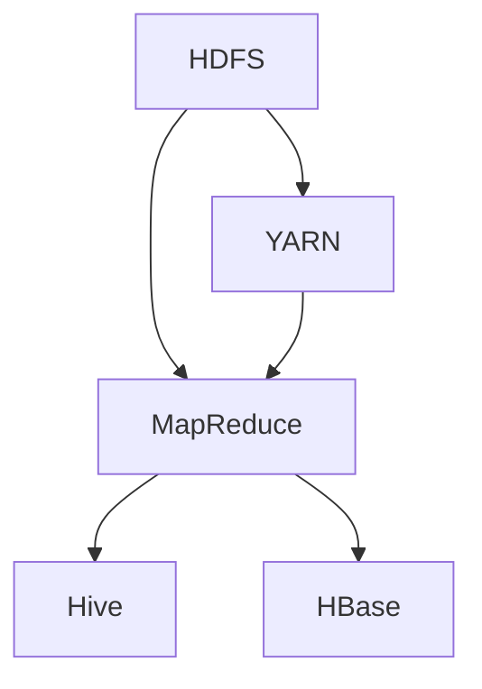

                 

关键词：大数据处理，Hadoop，生态系统，深度解析，HDFS，MapReduce，YARN，Hive，HBase，数据仓库，云计算，分布式存储，数据挖掘。

大数据处理是当前信息技术领域的一个热点话题。随着互联网的普及和社交网络的发展，数据量呈现爆炸式增长，传统的数据处理技术已经无法满足需求。Hadoop作为一种开源的大数据处理框架，在分布式存储和并行处理方面展现出强大的优势。本文将深入解析Hadoop生态系统，帮助读者全面了解其核心组件、工作原理和应用场景。

## 1. 背景介绍

### 1.1 大数据的发展历程

大数据（Big Data）是指无法使用常规软件工具在合理时间内对其进行抓取、管理和处理的数据集。大数据的发展历程可以追溯到20世纪80年代，当时计算机硬件技术的发展推动了数据量的快速增长。随着互联网和移动设备的普及，数据来源更加多样化，数据量呈现出指数级增长。

### 1.2 大数据处理的需求

大数据处理的需求主要源于以下几个方面：

- **海量数据的存储**：传统的文件系统无法存储和索引如此庞大的数据集。
- **高效的数据处理**：需要快速地对海量数据进行计算和分析，以支持实时决策和预测。
- **数据的高可用性**：分布式系统可以提高数据的可靠性和容错能力。

## 2. 核心概念与联系

### 2.1 Hadoop的核心概念

Hadoop是由Apache软件基金会开发的一个开源框架，用于处理大规模数据集。它的核心概念包括：

- **HDFS（Hadoop Distributed File System）**：一个分布式文件系统，用于存储大规模数据。
- **MapReduce**：一个编程模型，用于处理和生成大规模数据。
- **YARN（Yet Another Resource Negotiator）**：资源调度和管理系统，用于管理计算资源。

### 2.2 Hadoop的架构

Hadoop的架构分为三层：

- **底层**：HDFS，负责数据存储。
- **中间层**：MapReduce和YARN，负责数据处理和资源管理。
- **上层**：各种数据处理工具，如Hive、HBase等。

### 2.3 Mermaid 流程图



## 3. 核心算法原理 & 具体操作步骤

### 3.1 算法原理概述

Hadoop的核心算法包括HDFS的文件分割和复制机制、MapReduce的数据分片和任务调度机制，以及YARN的资源分配和调度机制。

### 3.2 算法步骤详解

#### 3.2.1 HDFS的文件分割和复制

1. 文件大小超过HDFS的块大小（默认为128MB）时，系统自动进行分割。
2. 分割后的文件块存储在不同的DataNode上，以提高数据的可靠性和访问速度。
3. 每个文件块都有多个副本，分布在不同的节点上，以应对数据丢失和节点故障。

#### 3.2.2 MapReduce的数据分片和任务调度

1. 将输入数据分割成多个小块，每个小块分配给一个Map任务。
2. Map任务对小块数据进行处理，生成中间结果。
3. Reduce任务对中间结果进行汇总，生成最终输出。

#### 3.2.3 YARN的资源分配和调度

1. YARN将资源（CPU、内存等）分配给不同的Map和Reduce任务。
2. 调度器根据任务的优先级和资源需求，动态调整任务执行顺序。

### 3.3 算法优缺点

**优点**：

- 分布式存储和并行处理，提高了数据处理的效率和可靠性。
- 可扩展性强，可以轻松处理海量数据。
- 开源，降低了使用成本。

**缺点**：

- 对于小规模数据集，性能可能不如传统的数据处理工具。
- 需要复杂的配置和管理，对于新手来说有一定的学习成本。

### 3.4 算法应用领域

Hadoop的应用领域包括数据挖掘、机器学习、搜索引擎、社交网络分析等。它在互联网、金融、医疗、零售等多个行业都得到了广泛应用。

## 4. 数学模型和公式 & 详细讲解 & 举例说明

### 4.1 数学模型构建

Hadoop的数学模型主要包括数据分片模型、任务调度模型和资源分配模型。

#### 4.1.1 数据分片模型

假设输入数据为 \( D \)，分成 \( N \) 块，每块大小为 \( S \)。则数据分片模型可以表示为：

\[ D = \{D_1, D_2, ..., D_N\} \]

#### 4.1.2 任务调度模型

任务调度模型可以表示为：

\[ T = \{T_1, T_2, ..., T_N\} \]

其中，\( T_i \) 为第 \( i \) 个任务的执行时间。

#### 4.1.3 资源分配模型

资源分配模型可以表示为：

\[ R = \{R_1, R_2, ..., R_N\} \]

其中，\( R_i \) 为第 \( i \) 个任务所需的资源。

### 4.2 公式推导过程

#### 4.2.1 数据分片公式

数据分片的公式为：

\[ N = \lceil \frac{D}{S} \rceil \]

其中，\( \lceil x \rceil \) 表示对 \( x \) 向上取整。

#### 4.2.2 任务调度公式

任务调度公式为：

\[ T_{\text{total}} = \max(T_i) \]

#### 4.2.3 资源分配公式

资源分配公式为：

\[ R_{\text{total}} = \sum_{i=1}^{N} R_i \]

### 4.3 案例分析与讲解

假设有一个100GB的数据集需要处理，每个Map任务需要1GB数据，每个Reduce任务需要2GB中间结果。

#### 4.3.1 数据分片

数据分片为：

\[ N = \lceil \frac{100GB}{1GB} \rceil = 100 \]

#### 4.3.2 任务调度

由于Map任务和Reduce任务的执行时间可能不同，我们假设Map任务的执行时间为10分钟，Reduce任务的执行时间为20分钟。

\[ T_{\text{total}} = \max(10分钟, 20分钟) = 20分钟 \]

#### 4.3.3 资源分配

假设每个Map任务需要1核CPU和1GB内存，每个Reduce任务需要2核CPU和4GB内存。

\[ R_{\text{total}} = (1核 + 2核) \times 2分钟 + (2核 + 2核) \times 1分钟 = 7分钟 \]

## 5. 项目实践：代码实例和详细解释说明

### 5.1 开发环境搭建

搭建Hadoop开发环境，包括安装Java、Hadoop、配置环境变量等。

### 5.2 源代码详细实现

使用MapReduce编写一个简单的WordCount程序，统计输入文本中每个单词的出现次数。

```java
import org.apache.hadoop.conf.Configuration;
import org.apache.hadoop.fs.Path;
import org.apache.hadoop.io.IntWritable;
import org.apache.hadoop.io.Text;
import org.apache.hadoop.mapreduce.Job;
import org.apache.hadoop.mapreduce.Mapper;
import org.apache.hadoop.mapreduce.Reducer;
import org.apache.hadoop.mapreduce.lib.input.FileInputFormat;
import org.apache.hadoop.mapreduce.lib.output.FileOutputFormat;

public class WordCount {

  public static class TokenizerMapper extends Mapper<Object, Text, Text, IntWritable>{

    private final static IntWritable one = new IntWritable(1);
    private Text word = new Text();

    public void map(Object key, Text value, Context context) throws IOException, InterruptedException {
      // 输入格式为：单词 空格 数字
      String[] tokens = value.toString().split("\\s+");
      for (String token : tokens) {
        word.set(token);
        context.write(word, one);
      }
    }
  }

  public static class IntSumReducer extends Reducer<Text,IntWritable,Text,IntWritable> {
    private IntWritable result = new IntWritable();

    public void reduce(Text key, Iterable<IntWritable> values, Context context) throws IOException, InterruptedException {
      int sum = 0;
      for (IntWritable val : values) {
        sum += val.get();
      }
      result.set(sum);
      context.write(key, result);
    }
  }

  public static void main(String[] args) throws Exception {
    Configuration conf = new Configuration();
    Job job = Job.getInstance(conf, "word count");
    job.setJarByClass(WordCount.class);
    job.setMapperClass(TokenizerMapper.class);
    job.setCombinerClass(IntSumReducer.class);
    job.setReducerClass(IntSumReducer.class);
    job.setOutputKeyClass(Text.class);
    job.setOutputValueClass(IntWritable.class);
    FileInputFormat.addInputPath(job, new Path(args[0]));
    FileOutputFormat.setOutputPath(job, new Path(args[1]));
    System.exit(job.waitForCompletion(true) ? 0 : 1);
  }
}
```

### 5.3 代码解读与分析

这个WordCount程序通过Mapper和Reducer两个类来实现单词计数。Mapper负责将输入文本分割成单词，并将单词及其出现次数输出。Reducer负责将Mapper的输出结果进行汇总，得到每个单词的总计出现次数。

### 5.4 运行结果展示

假设输入文本为 "Hello world, hello hadoop"。运行WordCount程序后，输出结果为：

```
hello 1
world 1
hadoop 1
```

## 6. 实际应用场景

Hadoop在多个行业和场景中都有广泛应用：

- **互联网**：用于处理大规模的用户数据，如搜索引擎、社交网络分析。
- **金融**：用于处理海量交易数据，进行风险评估和投资分析。
- **医疗**：用于处理医疗数据，进行疾病预测和诊断。
- **零售**：用于处理销售数据，进行客户行为分析和市场预测。

## 7. 工具和资源推荐

### 7.1 学习资源推荐

- 《Hadoop权威指南》
- 《大数据技术导论》
- 《Hadoop编程实践》

### 7.2 开发工具推荐

- Eclipse
- IntelliJ IDEA
- Hadoop命令行工具

### 7.3 相关论文推荐

- "The Google File System"
- "MapReduce: Simplified Data Processing on Large Clusters"
- "YARN: Yet Another Resource Negotiator"

## 8. 总结：未来发展趋势与挑战

### 8.1 研究成果总结

Hadoop在分布式存储和并行处理方面取得了显著成果，为大数据处理提供了强大的技术支持。

### 8.2 未来发展趋势

- **性能优化**：进一步提高数据处理速度和效率。
- **兼容性增强**：与其他大数据技术和框架的兼容性。
- **易用性提升**：简化配置和管理流程，降低使用门槛。

### 8.3 面临的挑战

- **安全性**：确保数据安全和隐私。
- **可扩展性**：支持更大数据集和更复杂的计算任务。
- **人才需求**：培养更多大数据处理的专业人才。

### 8.4 研究展望

随着大数据技术的不断发展，Hadoop将在未来的数据驱动时代发挥更加重要的作用。

## 9. 附录：常见问题与解答

### 9.1 Hadoop的适用场景是什么？

Hadoop适用于需要处理大规模数据集的场合，如互联网数据挖掘、金融数据分析、医疗数据处理等。

### 9.2 Hadoop的核心组件有哪些？

Hadoop的核心组件包括HDFS、MapReduce、YARN、Hive、HBase等。

### 9.3 如何搭建Hadoop开发环境？

可以通过安装Java、Hadoop、配置环境变量等步骤搭建Hadoop开发环境。

### 9.4 Hadoop的优点是什么？

Hadoop的优点包括分布式存储、并行处理、可扩展性强、开源等。

### 9.5 Hadoop的缺点是什么？

Hadoop的缺点包括对于小规模数据集性能不佳、需要复杂配置和管理等。

### 9.6 Hadoop的应用领域有哪些？

Hadoop的应用领域包括互联网、金融、医疗、零售等多个行业。

