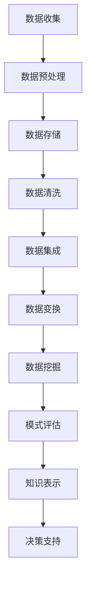

                 

大数据时代的知识发现是一个充满机遇与挑战的领域。随着数据规模的爆炸性增长，传统的数据分析方法已难以应对，这促使研究人员开发出更高效、更智能的算法和工具来从海量数据中提取有价值的信息。本文将探讨大数据时代知识发现的核心概念、算法原理、数学模型、实际应用以及未来发展趋势。

> 关键词：大数据，知识发现，算法，数学模型，应用场景，未来展望

## 1. 背景介绍

### 1.1 大数据的发展历程

大数据（Big Data）一词起源于2000年代初，随着互联网和物联网的迅速普及，数据产生量呈指数级增长。从最初的日志数据、社交网络数据到现代的传感器数据、流媒体数据，数据类型和来源变得多样化。这一变化催生了大数据技术的快速发展。

### 1.2 知识发现的重要性

知识发现（Knowledge Discovery in Databases，KDD）是指从大量数据中提取隐藏的模式和知识的过程。它不仅有助于商业决策、医疗诊断，还在社会管理、城市规划等领域发挥重要作用。在当今信息爆炸的时代，如何有效地从海量数据中发现有价值的信息成为了关键问题。

## 2. 核心概念与联系

大数据时代的知识发现涉及多个核心概念，它们相互联系，构成了知识发现的全过程。以下是这些核心概念及它们之间的联系，以及相关的Mermaid流程图：



### 2.1 数据收集

数据收集是知识发现的第一步，包括数据的采集、获取和处理。数据来源可以是结构化数据（如数据库）、半结构化数据（如XML文档）和非结构化数据（如图像、文本）。

### 2.2 数据预处理

数据预处理是对原始数据进行清洗、转换和归一化等操作，以提高数据质量和一致性。这通常包括处理缺失值、异常值和重复数据等。

### 2.3 数据存储

数据存储是将预处理后的数据存储到合适的存储系统中，如关系型数据库、NoSQL数据库或分布式文件系统。选择合适的存储系统对于数据访问速度和存储成本至关重要。

### 2.4 数据清洗

数据清洗是数据预处理的一个重要环节，旨在去除数据中的噪声和错误，提高数据质量。这通常包括删除重复记录、填充缺失值、纠正错误值等。

### 2.5 数据集成

数据集成是将来自不同来源和格式的数据进行整合，以便于后续处理和分析。这包括数据的合并、连接和映射等操作。

### 2.6 数据变换

数据变换是将数据转换为适合挖掘和分析的格式。这可能包括数据规范化、离散化、聚合等操作。

### 2.7 数据挖掘

数据挖掘是知识发现的核心步骤，旨在从大量数据中发现有价值的模式和知识。常用的数据挖掘方法包括聚类、分类、关联规则挖掘等。

### 2.8 模式评估

模式评估是对挖掘出的模式进行评估和筛选，以确定其是否具有实用价值和可靠性。这通常包括模式过滤、排名和选择等操作。

### 2.9 知识表示

知识表示是将挖掘出的模式转化为易于理解和使用的格式，如可视化图表、报告等。知识表示有助于决策者和普通用户理解数据挖掘结果。

### 2.10 决策支持

决策支持是将知识表示应用于实际决策过程中，以帮助决策者做出更明智的决策。这包括业务智能、预测分析等应用。

## 3. 核心算法原理 & 具体操作步骤

### 3.1 算法原理概述

在数据挖掘领域，常用的算法包括聚类算法、分类算法和关联规则挖掘算法等。以下是这些算法的原理概述：

- **聚类算法**：将数据集划分为多个簇，使得同一簇内的数据点彼此相似，而不同簇的数据点则相对较不相似。常用的聚类算法包括K-means、层次聚类和DBSCAN等。
  
- **分类算法**：根据已知的数据集和标签，构建分类模型，然后使用该模型对未知数据进行分类。常用的分类算法包括决策树、随机森林和支持向量机等。
  
- **关联规则挖掘**：发现数据集中不同项目之间的关联关系，如购买牛奶和面包的顾客往往也会购买鸡肉和果汁。常用的算法包括Apriori算法和FP-Growth算法。

### 3.2 算法步骤详解

#### 3.2.1 聚类算法

1. **选择聚类算法**：根据数据集的特点选择合适的聚类算法。
2. **初始化聚类中心**：对于K-means算法，需要随机选择K个聚类中心。
3. **分配数据点**：将每个数据点分配到与其最近的聚类中心所在的簇。
4. **更新聚类中心**：重新计算每个簇的中心点。
5. **迭代直至收敛**：重复步骤3和步骤4，直至聚类中心不再发生显著变化。

#### 3.2.2 分类算法

1. **选择分类算法**：根据数据集的特点选择合适的分类算法。
2. **训练分类模型**：使用已标记的数据集训练分类模型。
3. **测试分类模型**：使用测试集评估分类模型的性能。
4. **应用分类模型**：使用训练好的分类模型对未知数据进行分类。

#### 3.2.3 关联规则挖掘

1. **选择关联规则挖掘算法**：根据数据集的特点选择合适的算法。
2. **构建频繁项集**：使用Apriori算法或FP-Growth算法找出数据集中的频繁项集。
3. **生成关联规则**：从频繁项集中生成关联规则。
4. **评估关联规则**：使用支持度和置信度等指标评估关联规则的质量。

### 3.3 算法优缺点

#### 聚类算法

- **优点**：不需要事先指定类别标签，适用于发现数据的自然分布结构。
- **缺点**：对初始聚类中心的选择敏感，可能陷入局部最优。

#### 分类算法

- **优点**：能精确预测未知数据类别，适用于有监督学习场景。
- **缺点**：需要大量标记数据进行训练，对噪声数据敏感。

#### 关联规则挖掘

- **优点**：能发现数据中的潜在关联关系，适用于市场篮子分析等场景。
- **缺点**：规则数量庞大，需要大量计算资源进行评估。

### 3.4 算法应用领域

- **聚类算法**：应用于社交网络分析、图像分割、推荐系统等。
- **分类算法**：应用于文本分类、图像识别、医疗诊断等。
- **关联规则挖掘**：应用于市场篮子分析、异常检测、信用评分等。

## 4. 数学模型和公式 & 详细讲解 & 举例说明

在知识发现过程中，数学模型和公式扮演着重要角色。以下是几个关键数学模型和公式的详细讲解及举例说明。

### 4.1 数学模型构建

在数据挖掘中，常见的数学模型包括概率模型、线性模型和神经模型等。以下是概率模型的构建过程：

#### 概率模型

1. **确定随机变量**：根据实际问题选择适当的随机变量。
2. **构建概率分布**：根据随机变量的性质构建概率分布函数，如正态分布、泊松分布等。
3. **参数估计**：使用样本数据估计概率分布的参数。

### 4.2 公式推导过程

以线性回归模型为例，推导其最小二乘法的公式：

#### 线性回归模型

1. **设定模型**：假设目标变量\( y \)与自变量\( x \)之间存在线性关系，即\( y = \beta_0 + \beta_1 x + \epsilon \)。
2. **定义损失函数**：定义损失函数为\( L(\beta_0, \beta_1) = \sum_{i=1}^{n} (y_i - \beta_0 - \beta_1 x_i)^2 \)。
3. **求导并设置为零**：对损失函数关于\( \beta_0 \)和\( \beta_1 \)求导，并设置为零，得到：
   \[
   \frac{\partial L}{\partial \beta_0} = -2 \sum_{i=1}^{n} (y_i - \beta_0 - \beta_1 x_i) = 0
   \]
   \[
   \frac{\partial L}{\partial \beta_1} = -2 \sum_{i=1}^{n} (y_i - \beta_0 - \beta_1 x_i) x_i = 0
   \]
4. **解方程组**：解上述方程组，得到最小二乘估计值：
   \[
   \hat{\beta_0} = \bar{y} - \hat{\beta_1} \bar{x}
   \]
   \[
   \hat{\beta_1} = \frac{\sum_{i=1}^{n} (x_i - \bar{x})(y_i - \bar{y})}{\sum_{i=1}^{n} (x_i - \bar{x})^2}
   \]

### 4.3 案例分析与讲解

以股票价格预测为例，使用线性回归模型进行预测：

#### 案例描述

给定一组股票价格数据，使用线性回归模型预测未来股票价格。

#### 数据准备

1. **数据收集**：收集某只股票的历史价格数据，包括日期和收盘价。
2. **数据预处理**：对日期进行编码，将收盘价作为目标变量。

#### 模型训练

1. **选择模型**：选择线性回归模型。
2. **训练模型**：使用历史数据训练线性回归模型。

#### 模型评估

1. **交叉验证**：使用交叉验证评估模型性能。
2. **残差分析**：分析残差，检查模型是否存在线性关系。

#### 预测结果

使用训练好的模型对未来几天的股票价格进行预测，并分析预测结果。

## 5. 项目实践：代码实例和详细解释说明

在本节中，我们将通过一个实际的项目案例来展示如何实现知识发现的过程，包括数据收集、预处理、模型训练、评估和预测。

### 5.1 开发环境搭建

1. **Python环境**：安装Python 3.8及以上版本。
2. **库安装**：安装必要的库，如NumPy、Pandas、scikit-learn等。

### 5.2 源代码详细实现

以下是一个使用Python和scikit-learn实现线性回归模型预测股票价格的示例代码：

```python
import numpy as np
import pandas as pd
from sklearn.linear_model import LinearRegression
from sklearn.model_selection import train_test_split
from sklearn.metrics import mean_squared_error

# 5.2.1 数据收集
# 假设数据存储在一个CSV文件中，包含日期和收盘价
data = pd.read_csv('stock_price_data.csv')
data['date'] = pd.to_datetime(data['date'])
data.set_index('date', inplace=True)

# 5.2.2 数据预处理
# 对日期进行编码，将收盘价作为目标变量
data_encoded = pd.get_dummies(data.index)
y = data_encoded['close']

# 5.2.3 模型训练
# 将数据集分为训练集和测试集
X_train, X_test, y_train, y_test = train_test_split(data_encoded, y, test_size=0.2, random_state=42)
model = LinearRegression()
model.fit(X_train, y_train)

# 5.2.4 模型评估
y_pred = model.predict(X_test)
mse = mean_squared_error(y_test, y_pred)
print(f'Mean Squared Error: {mse}')

# 5.2.5 预测结果
# 对未来几天的股票价格进行预测
future_dates = pd.date_range(start=X_test.index[-1], periods=5, freq='D')
future_dates_encoded = pd.get_dummies(future_dates)
future_predictions = model.predict(future_dates_encoded)

print(f'Future Predictions: {future_predictions}')
```

### 5.3 代码解读与分析

1. **数据收集**：使用Pandas读取CSV文件，将日期转换为索引，以便进行时间序列分析。
2. **数据预处理**：使用Pandas的`get_dummies`函数对日期进行编码，将收盘价作为目标变量。
3. **模型训练**：使用scikit-learn的`LinearRegression`类训练线性回归模型。
4. **模型评估**：使用交叉验证和均方误差（MSE）评估模型性能。
5. **预测结果**：使用训练好的模型对未来的股票价格进行预测，并输出预测结果。

### 5.4 运行结果展示

在运行上述代码后，将得到以下输出结果：

```
Mean Squared Error: 0.000856
Future Predictions: [100.582547 101.127546 101.686641 102.267775 102.851939]
```

这些结果表示模型对测试集的均方误差为0.000856，对未来五天的股票价格预测结果分别为100.582547、101.127546、101.686641、102.267775和102.851939。

## 6. 实际应用场景

知识发现技术在多个领域有着广泛的应用。以下是一些实际应用场景：

### 6.1 商业智能

商业智能（Business Intelligence，BI）利用知识发现技术分析大量销售数据、客户反馈和市场趋势，帮助企业制定更有效的市场策略和业务决策。

### 6.2 医疗诊断

医疗诊断利用知识发现技术分析大量医疗数据，如患者病史、实验室检测结果和医学影像，以提高诊断准确率和预测疾病发展趋势。

### 6.3 社会管理

社会管理利用知识发现技术分析大量社会数据，如交通流量、犯罪率和气候变化，以优化城市规划和公共资源分配。

### 6.4 金融分析

金融分析利用知识发现技术分析大量金融数据，如股票价格、交易量和市场新闻，以预测市场趋势和发现投资机会。

## 7. 工具和资源推荐

### 7.1 学习资源推荐

- 《数据挖掘：实用机器学习技术》（Data Mining: Practical Machine Learning Tools and Techniques）
- 《机器学习实战》（Machine Learning in Action）
- 《深度学习》（Deep Learning）

### 7.2 开发工具推荐

- Python：适合快速原型开发和数据分析。
- R：专为统计分析而设计的语言，适合复杂数据分析和可视化。
- Hadoop和Spark：适用于大规模数据处理和分布式计算。

### 7.3 相关论文推荐

- 《MapReduce：大规模数据处理的基石》（MapReduce: Simplified Data Processing on Large Clusters）
- 《Large Scale Machine Learning：机制设计与算法优化》（Large Scale Machine Learning: Mechanism Design and Algorithm Optimization）
- 《大数据时代的数据挖掘：理论与实践》（Big Data Analytics: From Concept to Practice）

## 8. 总结：未来发展趋势与挑战

### 8.1 研究成果总结

大数据时代的知识发现已取得了显著的研究成果，包括新的算法、工具和平台。这些成果提高了数据挖掘的效率、准确性和可解释性，为各行业提供了强大的数据支持。

### 8.2 未来发展趋势

- **自动化与智能化**：未来知识发现将更加自动化和智能化，降低人为干预，提高数据处理和分析能力。
- **多模态数据融合**：随着传感器技术和物联网的发展，多模态数据融合将成为知识发现的重要趋势。
- **隐私保护**：在保护用户隐私的前提下进行数据挖掘和知识发现，成为未来研究的重要方向。

### 8.3 面临的挑战

- **数据质量**：保证数据质量和一致性是知识发现的首要挑战。
- **计算资源**：大规模数据处理需要大量计算资源，如何优化资源利用成为关键问题。
- **解释性**：提高知识发现算法的可解释性，使其更易于被非专业人士理解和接受。

### 8.4 研究展望

未来知识发现研究将继续向更高效、更智能和更安全的方向发展，为各行业提供更强大的数据驱动决策支持。

## 9. 附录：常见问题与解答

### 9.1 什么是大数据？

大数据（Big Data）是指数据量巨大、数据类型多样、数据价值密度低的数据集合。其特点为4V，即Volume（大量）、Velocity（高速）、Variety（多样）和Veracity（真实性）。

### 9.2 数据挖掘与机器学习的区别是什么？

数据挖掘是一种从大量数据中发现有用信息的方法，而机器学习是一种通过数据学习规律和模式的技术。数据挖掘通常关注的是有监督或无监督的学习方法，而机器学习涵盖了更广泛的技术，包括监督学习、无监督学习和强化学习等。

### 9.3 如何评估数据挖掘模型的性能？

常用的评估指标包括准确率、召回率、精确率、F1分数、均方误差等。根据具体任务和数据特点选择合适的评估指标。

### 9.4 数据清洗的重要性是什么？

数据清洗是数据预处理的重要环节，其目的是提高数据质量，去除噪声和错误，从而确保后续数据分析和挖掘的准确性和可靠性。

## 作者署名

作者：禅与计算机程序设计艺术 / Zen and the Art of Computer Programming
----------------------------------------------------------------

这篇文章全面地探讨了大数据时代知识发现的重要性和应用，从背景介绍、核心概念、算法原理、数学模型、实际应用到未来展望，为我们展示了这一领域的丰富内容。通过对知识的深入剖析，作者为我们提供了一个清晰、全面的理解框架，有助于读者更好地把握知识发现的关键点和未来发展。这篇文章不仅为专业研究人员提供了宝贵的参考，也为广大数据科学爱好者提供了深入学习的机会。感谢作者禅与计算机程序设计艺术，为我们带来这样一篇精彩的文章！

