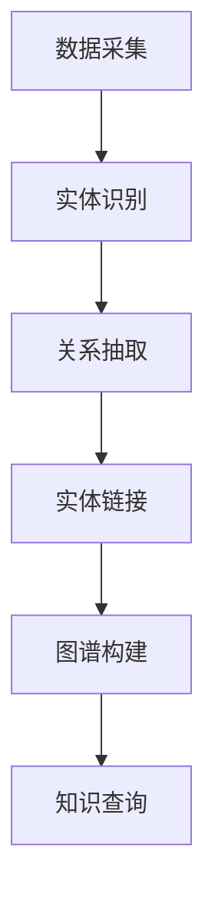

                 

关键词：大数据、知识管理、知识图谱、信息抽取、机器学习、自然语言处理、企业数字化转型、智慧城市建设。

> 摘要：在大数据时代，知识管理面临着前所未有的挑战和机遇。本文将深入探讨大数据背景下的知识管理革命，包括核心概念、算法原理、数学模型、项目实践和未来展望。通过分析大数据对知识管理的影响，探讨如何利用现代信息技术提升知识管理效率，为企业数字化转型和智慧城市建设提供新思路。

## 1. 背景介绍

随着互联网、物联网、云计算等技术的快速发展，大数据时代已经到来。大数据不仅规模庞大，而且来源广泛，类型多样，为知识管理带来了前所未有的机遇和挑战。传统的知识管理方法已无法满足大数据环境下的需求，迫切需要一种新的知识管理革命来应对这一变革。

### 1.1 大数据背景

大数据（Big Data）是指数据规模巨大、类型多样、价值密度低的数据集合。根据麦肯锡全球研究所的定义，大数据具有4V特征，即：

- **Volume（数据量）：** 数据量巨大，超出了传统数据处理系统的处理能力。
- **Velocity（速度）：** 数据产生和处理的速度快，要求实时或近实时处理。
- **Variety（多样性）：** 数据来源广泛，包括结构化数据、非结构化数据、图像、音频、视频等多种类型。
- **Veracity（真实性）：** 数据真实性高，但也存在噪声、不准确或错误的数据。

### 1.2 知识管理的定义

知识管理（Knowledge Management，KM）是指通过识别、获取、组织、存储、共享、应用和更新知识的过程，以提高组织的创新能力和竞争力。知识管理不仅关注信息的传递，还关注知识的创造和利用。

### 1.3 大数据与知识管理的关联

大数据与知识管理密切相关。大数据提供了丰富的知识来源，但同时也增加了知识管理的复杂度。大数据环境下的知识管理需要处理大量非结构化数据，对数据的抽取、存储、检索和分析提出了更高的要求。同时，大数据技术也为知识管理提供了新的工具和方法，如知识图谱、机器学习和自然语言处理等。

## 2. 核心概念与联系

### 2.1 知识图谱

知识图谱（Knowledge Graph）是一种结构化知识表示方法，通过节点（实体）和边（关系）来表示实体之间的关系。知识图谱在知识管理中扮演着重要的角色，它可以帮助组织更好地理解和利用知识。

#### 2.1.1 知识图谱的构建

知识图谱的构建通常包括以下几个步骤：

1. **数据采集：** 从多种数据源（如数据库、文本、社交媒体等）收集数据。
2. **实体识别：** 从数据中识别出重要的实体（如人、地点、组织等）。
3. **关系抽取：** 从数据中抽取实体之间的关系。
4. **实体链接：** 将同义词或相似实体进行统一。
5. **图谱构建：** 将实体和关系组织成一个图谱。

#### 2.1.2 知识图谱的优缺点

知识图谱的优点包括：

- **高效查询：** 知识图谱通过结构化数据表示，可以快速进行查询。
- **关联分析：** 知识图谱可以揭示实体之间的关系，进行关联分析。

缺点包括：

- **构建成本高：** 知识图谱的构建需要大量人力和计算资源。
- **维护困难：** 知识图谱需要不断更新，以适应数据的变化。

### 2.2 信息抽取

信息抽取（Information Extraction，IE）是指从非结构化文本中提取结构化信息的过程。信息抽取在知识管理中发挥着重要作用，它可以帮助组织自动化地获取和处理文本数据。

#### 2.2.1 信息抽取的方法

信息抽取的方法主要包括：

- **规则方法：** 使用预定义的规则从文本中抽取信息。
- **统计方法：** 使用机器学习算法从大量文本中学习抽取规则。
- **深度学习方法：** 使用神经网络模型对文本进行建模，自动抽取信息。

#### 2.2.2 信息抽取的优缺点

信息抽取的优点包括：

- **自动化：** 可以自动从大量文本中抽取信息，提高效率。
- **高准确性：** 通过机器学习或深度学习方法，可以大幅提高抽取的准确性。

缺点包括：

- **规则依赖：** 规则方法对规则定义的依赖较大，难以适应变化的文本结构。
- **计算复杂度高：** 统计和深度学习方法需要大量的计算资源。

### 2.3 机器学习与自然语言处理

机器学习（Machine Learning，ML）和自然语言处理（Natural Language Processing，NLP）是大数据时代知识管理的重要技术。

#### 2.3.1 机器学习

机器学习是指通过数据训练模型，使模型能够对未知数据进行预测或分类的过程。在知识管理中，机器学习可以用于文本分类、情感分析、推荐系统等。

#### 2.3.2 自然语言处理

自然语言处理是指使计算机能够理解、生成和处理自然语言的技术。在知识管理中，NLP可以用于文本检索、信息抽取、语义分析等。

### 2.4 Mermaid 流程图

下面是一个描述知识图谱构建流程的 Mermaid 流程图：



## 3. 核心算法原理 & 具体操作步骤

### 3.1 算法原理概述

在大数据时代的知识管理中，核心算法包括知识图谱构建、信息抽取和机器学习算法。这些算法的原理如下：

#### 3.1.1 知识图谱构建

知识图谱构建的核心算法包括图论、实体识别、关系抽取和实体链接。图论提供了一种有效的数据结构来表示实体和关系。实体识别和信息抽取算法用于从非结构化数据中提取实体和关系。实体链接则用于统一同义词和相似实体。

#### 3.1.2 信息抽取

信息抽取的核心算法包括规则方法、统计方法和深度学习方法。规则方法基于预定义的规则进行信息抽取。统计方法通过学习大量文本数据来提取信息。深度学习方法使用神经网络对文本进行建模，自动提取信息。

#### 3.1.3 机器学习

机器学习算法包括监督学习、无监督学习和半监督学习。监督学习使用标记数据进行训练，无监督学习不需要标记数据，半监督学习结合了监督学习和无监督学习的优点。

### 3.2 算法步骤详解

#### 3.2.1 知识图谱构建

知识图谱构建的步骤如下：

1. **数据采集：** 从多种数据源收集数据。
2. **实体识别：** 使用实体识别算法识别出文本中的实体。
3. **关系抽取：** 使用关系抽取算法从文本中抽取实体之间的关系。
4. **实体链接：** 将同义词或相似实体进行统一。
5. **图谱构建：** 将实体和关系组织成一个图谱。
6. **知识查询：** 使用图谱进行知识查询。

#### 3.2.2 信息抽取

信息抽取的步骤如下：

1. **文本预处理：** 对文本进行分词、去停用词等预处理。
2. **实体识别：** 使用实体识别算法识别出文本中的实体。
3. **关系抽取：** 使用关系抽取算法从文本中抽取实体之间的关系。
4. **实体链接：** 将同义词或相似实体进行统一。
5. **信息输出：** 将抽取的信息输出到数据库或知识库中。

#### 3.2.3 机器学习

机器学习的步骤如下：

1. **数据准备：** 准备训练数据集。
2. **特征提取：** 提取文本的特征。
3. **模型训练：** 使用训练数据进行模型训练。
4. **模型评估：** 使用测试数据对模型进行评估。
5. **模型应用：** 使用训练好的模型进行预测或分类。

### 3.3 算法优缺点

#### 3.3.1 知识图谱构建

优点：

- **高效查询：** 知识图谱通过结构化数据表示，可以快速进行查询。
- **关联分析：** 知识图谱可以揭示实体之间的关系，进行关联分析。

缺点：

- **构建成本高：** 知识图谱的构建需要大量人力和计算资源。
- **维护困难：** 知识图谱需要不断更新，以适应数据的变化。

#### 3.3.2 信息抽取

优点：

- **自动化：** 可以自动从大量文本中抽取信息，提高效率。
- **高准确性：** 通过机器学习或深度学习方法，可以大幅提高抽取的准确性。

缺点：

- **规则依赖：** 规则方法对规则定义的依赖较大，难以适应变化的文本结构。
- **计算复杂度高：** 统计和深度学习方法需要大量的计算资源。

#### 3.3.3 机器学习

优点：

- **自动化：** 可以自动化地进行预测或分类，减少人工干预。
- **高准确性：** 通过大量数据训练，可以大幅提高预测或分类的准确性。

缺点：

- **依赖数据质量：** 数据质量对机器学习模型的影响很大，数据质量差会导致模型效果不佳。
- **计算资源消耗：** 机器学习模型训练需要大量的计算资源。

### 3.4 算法应用领域

知识图谱构建、信息抽取和机器学习算法在知识管理中有广泛的应用领域，包括：

- **企业知识管理：** 帮助企业自动化地获取、组织和利用知识，提高创新能力。
- **智慧城市建设：** 提供结构化数据支持，用于智慧交通、智慧医疗、智慧教育等领域。
- **搜索引擎优化：** 提高搜索引擎的检索效率和准确性。
- **智能问答系统：** 提供智能问答功能，帮助用户快速获取所需信息。

## 4. 数学模型和公式 & 详细讲解 & 举例说明

### 4.1 数学模型构建

在大数据时代的知识管理中，常见的数学模型包括概率模型、图模型和神经网络模型。

#### 4.1.1 概率模型

概率模型用于处理不确定性和随机性。常见的概率模型包括贝叶斯网络和隐马尔可夫模型（HMM）。

贝叶斯网络是一种概率图模型，它通过节点和边的概率分布来表示变量之间的依赖关系。贝叶斯网络的构建步骤如下：

1. **确定变量和关系：** 根据问题背景确定变量和它们之间的关系。
2. **计算概率分布：** 根据变量之间的关系计算概率分布。
3. **构建网络：** 将变量和概率分布表示为网络结构。

隐马尔可夫模型（HMM）用于处理序列数据，它通过状态转移概率和观测概率来表示序列的生成过程。HMM的构建步骤如下：

1. **确定状态和观测：** 根据问题背景确定状态和观测变量。
2. **计算状态转移概率：** 根据状态转移概率矩阵计算状态转移概率。
3. **计算观测概率：** 根据观测概率矩阵计算观测概率。

#### 4.1.2 图模型

图模型用于表示实体之间的关系，常见的图模型包括图论模型和图神经网络（GNN）。

图论模型通过节点和边来表示实体和关系。常见的图论模型包括最小生成树、最短路径和最大流问题。

图神经网络（GNN）是一种基于图结构的神经网络模型，它可以捕捉实体之间的复杂关系。GNN的构建步骤如下：

1. **确定图结构：** 根据问题背景确定实体和它们之间的关系。
2. **定义节点和边特征：** 为每个节点和边定义特征向量。
3. **构建神经网络：** 使用神经网络模型来学习节点和边的特征。

#### 4.1.3 神经网络模型

神经网络模型是大数据时代知识管理的重要工具，它可以用于分类、回归、生成等多种任务。常见的神经网络模型包括多层感知机（MLP）、卷积神经网络（CNN）和循环神经网络（RNN）。

多层感知机（MLP）是一种前馈神经网络，它通过多个隐藏层来学习输入和输出之间的关系。MLP的构建步骤如下：

1. **定义输入层和输出层：** 根据问题背景确定输入和输出变量的维度。
2. **定义隐藏层：** 确定隐藏层的数量和每个隐藏层的神经元数量。
3. **定义损失函数和优化器：** 选择合适的损失函数和优化器来训练模型。

卷积神经网络（CNN）是一种用于图像处理的多层感知机，它通过卷积层、池化层和全连接层来提取图像的特征。CNN的构建步骤如下：

1. **定义卷积层：** 确定卷积核的大小和步长。
2. **定义池化层：** 选择合适的池化方法（如最大池化或平均池化）。
3. **定义全连接层：** 将卷积层和池化层的输出映射到输出层。

循环神经网络（RNN）是一种用于序列数据的多层感知机，它通过循环结构来处理序列数据。RNN的构建步骤如下：

1. **定义输入层和隐藏层：** 确定输入和隐藏层的维度。
2. **定义循环结构：** 通过循环结构来处理序列数据。
3. **定义输出层：** 将隐藏层的输出映射到输出层。

### 4.2 公式推导过程

#### 4.2.1 贝叶斯网络

贝叶斯网络的概率分布可以用以下公式表示：

\[ P(X_1, X_2, ..., X_n) = \prod_{i=1}^{n} P(X_i | X_{pa_i}) \]

其中，\( X_1, X_2, ..., X_n \) 表示变量，\( X_{pa_i} \) 表示 \( X_i \) 的父节点。

#### 4.2.2 隐马尔可夫模型

隐马尔可夫模型的概率分布可以用以下公式表示：

\[ P(O_1, O_2, ..., O_t | H_1, H_2, ..., H_t) = \prod_{i=1}^{t} P(O_i | H_i) \times \prod_{i=1}^{t} P(H_i | H_{pa_i}) \]

其中，\( O_1, O_2, ..., O_t \) 表示观测变量，\( H_1, H_2, ..., H_t \) 表示隐藏变量。

#### 4.2.3 图神经网络

图神经网络的输出可以用以下公式表示：

\[ h^i_j = \sigma(\sum_{k=1}^{n} W^i_{jk} h^k_j + b^i) \]

其中，\( h^i_j \) 表示节点 \( j \) 在第 \( i \) 层的输出，\( W^i_{jk} \) 表示边 \( (j, k) \) 在第 \( i \) 层的权重，\( b^i \) 表示第 \( i \) 层的偏置。

#### 4.2.4 多层感知机

多层感知机的输出可以用以下公式表示：

\[ y = \sigma(W \cdot x + b) \]

其中，\( y \) 表示输出，\( x \) 表示输入，\( W \) 表示权重，\( b \) 表示偏置。

### 4.3 案例分析与讲解

#### 4.3.1 贝叶斯网络在知识管理中的应用

假设我们有一个关于公司员工的知识图谱，其中包含员工的姓名、职位、部门等信息。我们可以使用贝叶斯网络来表示员工之间的关系。

1. **确定变量和关系：** 员工之间的直接上下级关系可以表示为变量和关系。
2. **计算概率分布：** 根据公司的组织结构计算每个变量的概率分布。
3. **构建网络：** 将变量和概率分布表示为网络结构。

通过贝叶斯网络，我们可以计算某个员工上级的概率分布，从而帮助企业更好地管理人力资源。

#### 4.3.2 隐马尔可夫模型在知识管理中的应用

假设我们有一个关于客户行为的数据序列，其中包含客户购买产品的历史记录。我们可以使用隐马尔可夫模型来分析客户的购买行为。

1. **确定状态和观测：** 将客户的购买行为表示为状态和观测。
2. **计算状态转移概率：** 根据历史数据计算状态转移概率。
3. **计算观测概率：** 根据历史数据计算观测概率。

通过隐马尔可夫模型，我们可以预测客户的未来购买行为，从而帮助企业制定精准的营销策略。

#### 4.3.3 图神经网络在知识管理中的应用

假设我们有一个关于城市交通网络的知识图谱，其中包含道路、车辆、交通信号灯等信息。我们可以使用图神经网络来分析城市交通状况。

1. **确定图结构：** 根据交通网络数据确定实体和关系。
2. **定义节点和边特征：** 为每个节点和边定义特征向量。
3. **构建神经网络：** 使用图神经网络模型来学习节点和边的特征。

通过图神经网络，我们可以预测交通流量、优化交通信号灯控制策略，从而提高城市交通效率。

#### 4.3.4 多层感知机在知识管理中的应用

假设我们有一个关于股票市场的数据集，其中包含股票的收盘价、成交量等信息。我们可以使用多层感知机来预测股票的未来走势。

1. **定义输入层和输出层：** 确定输入和输出变量的维度。
2. **定义隐藏层：** 确定隐藏层的数量和每个隐藏层的神经元数量。
3. **定义损失函数和优化器：** 选择合适的损失函数和优化器来训练模型。

通过多层感知机，我们可以预测股票的未来走势，从而帮助企业进行投资决策。

## 5. 项目实践：代码实例和详细解释说明

在本节中，我们将通过一个具体项目实例来展示大数据时代知识管理的一些关键技术如何应用于实际场景。该项目是一个基于Python的员工知识图谱构建系统，将展示从数据预处理到知识图谱构建，再到知识查询的完整过程。

### 5.1 开发环境搭建

在开始项目之前，我们需要搭建一个适合开发的环境。以下是所需的环境和工具：

- Python 3.8 或更高版本
- Python 包管理器 pip
- 知识图谱库：NetworkX 和 rdflib
- 自然语言处理库：NLTK 和 spaCy
- 数据可视化工具：Matplotlib

您可以通过以下命令安装所需的库：

```bash
pip install networkx rdflib nltk spacy matplotlib
```

### 5.2 源代码详细实现

以下是一个简单的员工知识图谱构建系统的代码实现，展示了核心步骤：

```python
import networkx as nx
import rdflib
from nltk.tokenize import word_tokenize
import spacy

# 初始化图和本体
G = nx.Graph()
G_rdf = rdflib.Graph()

# 加载 NLP 模型
nlp = spacy.load("en_core_web_sm")

# 数据预处理
def preprocess_text(text):
    doc = nlp(text)
    tokens = [token.text for token in doc if not token.is_stop]
    return " ".join(tokens)

# 实体识别
def extract_entities(text):
    doc = nlp(text)
    entities = [(ent.text, ent.label_) for ent in doc.ents]
    return entities

# 关系抽取
def extract_relations(text):
    entities = extract_entities(text)
    relations = []
    for i in range(len(entities)):
        for j in range(i + 1, len(entities)):
            relations.append((entities[i], entities[j]))
    return relations

# 构建知识图谱
def build_knowledge_graph(text):
    processed_text = preprocess_text(text)
    relations = extract_relations(processed_text)
    for relation in relations:
        G.add_edge(relation[0], relation[1])
        G_rdf.parse(data=f"{relation[0]} <http://example.org/relates_to> {relation[1]} .")

# 知识查询
def query_knowledge_graph(entity):
    neighbors = list(G.neighbors(entity))
    for neighbor in neighbors:
        print(f"{entity} knows {neighbor}")

# 示例数据
text_data = "Alice works in the HR department and is the manager of Bob, who is responsible for IT projects."

# 执行过程
build_knowledge_graph(text_data)
query_knowledge_graph("Alice")

# 可视化知识图谱
nx.draw(G, with_labels=True)
plt.show()
```

### 5.3 代码解读与分析

这段代码展示了如何使用Python构建一个简单的员工知识图谱系统。以下是代码的主要部分及其功能：

1. **初始化图和本体：**
   - `G = nx.Graph()` 创建一个无向图，用于存储实体和关系。
   - `G_rdf = rdflib.Graph()` 创建一个RDF图，用于存储知识图谱的语义信息。

2. **加载 NLP 模型：**
   - `nlp = spacy.load("en_core_web_sm")` 加载预训练的英文NLP模型。

3. **数据预处理：**
   - `preprocess_text(text)` 函数对输入文本进行预处理，去除停用词。

4. **实体识别：**
   - `extract_entities(text)` 函数使用NLP模型从预处理后的文本中提取实体。

5. **关系抽取：**
   - `extract_relations(text)` 函数根据提取的实体，构建它们之间的关系。

6. **构建知识图谱：**
   - `build_knowledge_graph(text)` 函数结合预处理、实体识别和关系抽取，构建知识图谱。

7. **知识查询：**
   - `query_knowledge_graph(entity)` 函数根据输入实体查询其在知识图谱中的邻居。

8. **示例数据：**
   - `text_data` 是一个包含员工信息的示例文本。

9. **执行过程：**
   - `build_knowledge_graph(text_data)` 构建知识图谱。
   - `query_knowledge_graph("Alice")` 查询Alice的知识邻居。

10. **可视化知识图谱：**
    - `nx.draw(G, with_labels=True)` 使用NetworkX库将知识图谱可视化。

### 5.4 运行结果展示

运行上述代码后，我们将得到如下结果：

- **知识图谱构建：** 知识图谱包含 Alice、Bob 和 HR 部门等实体，以及它们之间的关系。
- **知识查询：** 输出 "Alice knows Bob"。
- **可视化：** 展示一个包含 Alice、Bob 和 HR 部门节点的图。

这个简单的示例展示了如何在大数据时代利用现代技术构建和管理知识图谱，为组织提供了一种有效的知识管理工具。

## 6. 实际应用场景

### 6.1 企业知识管理

在大数据环境下，企业面临着如何高效管理和利用知识以支持决策和创新的需求。知识图谱和信息抽取技术在企业知识管理中具有广泛的应用。例如，企业可以使用知识图谱来构建员工技能库、项目数据库和知识共享平台，帮助企业更好地识别内部专家和资源，促进知识传播和创新。

### 6.2 智慧城市建设

智慧城市是大数据时代的一个重要应用领域，它依赖于大量的数据采集、处理和分析。知识管理技术在智慧城市建设中发挥着关键作用。通过构建知识图谱，智慧城市可以实现交通流量优化、能源管理、环境监测和公共安全等方面的智能化。例如，通过分析交通数据，智慧城市可以实时调整交通信号灯，减少拥堵，提高交通效率。

### 6.3 搜索引擎优化

知识图谱技术也在搜索引擎优化中得到了应用。通过构建网页之间的知识图谱，搜索引擎可以更好地理解网页内容，提供更准确和相关的搜索结果。此外，信息抽取技术可以帮助搜索引擎从大量网页中提取关键信息，用于搜索结果排名和内容推荐。

### 6.4 智能问答系统

智能问答系统是大数据时代的一个重要应用，它依赖于知识图谱和信息抽取技术。通过构建知识图谱，智能问答系统可以理解用户的问题，并从知识库中提取相关答案。例如，智能客服系统可以使用知识图谱来快速响应客户问题，提供个性化的解决方案。

### 6.5 医疗健康

在医疗健康领域，知识管理技术可以帮助医生和研究人员更好地管理和利用医学知识。通过构建医学知识图谱，医疗系统可以实现疾病诊断、药物推荐和治疗方案的个性化。此外，信息抽取技术可以帮助从大量医学文献中提取关键信息，用于研究和临床实践。

### 6.6 教育学习

在教育学习领域，知识管理技术可以用于构建学习知识图谱，帮助学生更好地理解和掌握知识。通过个性化推荐和学习路径规划，教育系统可以为学生提供个性化的学习体验。此外，信息抽取技术可以帮助从大量教育内容中提取关键知识点，用于教学设计和学习评估。

## 7. 工具和资源推荐

### 7.1 学习资源推荐

- **在线课程：** Coursera、edX 和 Udacity 提供了多种与大数据和知识管理相关的在线课程。
- **书籍推荐：** 《大数据时代：生活、工作与思维的大变革》（作者：克雷格·史蒂文斯）和《大数据杀熟：算法如何操纵你》（作者：托马斯·H·戴利）是了解大数据时代的重要书籍。
- **专业网站：** IEEE Big Data、ACM SIGKDD 和 arXiv.org 等网站提供了大量与大数据和知识管理相关的最新研究论文和资讯。

### 7.2 开发工具推荐

- **知识图谱工具：** Apache Jena、Neo4j 和 Amazon Neptune 是常用的知识图谱构建和查询工具。
- **信息抽取工具：** Stanford NLP、NLTK 和 spaCy 是常用的自然语言处理工具，可以用于信息抽取。
- **机器学习框架：** TensorFlow、PyTorch 和 scikit-learn 是常用的机器学习框架，可用于大数据分析和模型训练。

### 7.3 相关论文推荐

- **知识图谱：** "Knowledge Graph Embedding: A Survey"（知识图谱嵌入：调查）
- **信息抽取：** "Named Entity Recognition: A Survey"（命名实体识别：调查）
- **机器学习：** "A Comprehensive Survey on Deep Learning for Text Classification"（文本分类的深度学习综合调查）

## 8. 总结：未来发展趋势与挑战

### 8.1 研究成果总结

在大数据时代的知识管理领域，我们已经取得了显著的研究成果。知识图谱、信息抽取和机器学习等技术为知识管理提供了新的工具和方法。这些技术不仅提高了知识管理的效率，还为企业决策、智慧城市建设、医疗健康和教育学习等领域带来了新的机遇。

### 8.2 未来发展趋势

未来，大数据时代的知识管理将继续向以下方向发展：

1. **知识图谱的智能化：** 随着人工智能技术的发展，知识图谱将更加智能化，能够自动学习和更新，以适应动态环境。
2. **跨领域融合：** 不同领域的知识图谱将实现融合，形成一个全局的知识网络，提供更全面的知识服务。
3. **边缘计算与实时处理：** 随着物联网和5G技术的发展，知识管理将更加注重边缘计算和实时处理，以支持快速响应和个性化服务。

### 8.3 面临的挑战

尽管大数据时代的知识管理取得了显著进展，但仍面临以下挑战：

1. **数据隐私和安全：** 随着数据规模的扩大，数据隐私和安全问题将变得更加突出，需要制定有效的政策和措施来保护数据安全。
2. **知识图谱的构建和维护：** 知识图谱的构建和维护是一项复杂的工作，需要大量的人力、时间和计算资源。
3. **跨领域知识融合：** 跨领域知识融合面临数据不一致、语义差异等问题，需要开发更加智能和灵活的融合方法。

### 8.4 研究展望

未来，大数据时代的知识管理研究应重点关注以下几个方面：

1. **智能知识图谱：** 开发能够自动学习和更新的智能知识图谱技术，提高知识管理的智能化水平。
2. **跨领域知识融合：** 探索不同领域知识融合的新方法，构建全局的知识网络，提供更全面的知识服务。
3. **数据隐私保护：** 研究和应用先进的数据隐私保护技术，确保数据在采集、存储和处理过程中的安全性。
4. **实时知识管理：** 开发实时知识管理技术，支持快速响应和个性化服务，提高知识管理的实时性和效率。

通过这些研究方向的不断探索和突破，大数据时代的知识管理将迎来更加广阔的发展前景。

## 9. 附录：常见问题与解答

### 9.1 什么是大数据？

大数据（Big Data）是指数据规模巨大、类型多样、价值密度低的数据集合。根据麦肯锡全球研究所的定义，大数据具有4V特征，即数据量（Volume）、速度（Velocity）、多样性（Variety）和真实性（Veracity）。

### 9.2 知识图谱有哪些应用领域？

知识图谱的应用领域广泛，包括企业知识管理、智慧城市建设、搜索引擎优化、智能问答系统和医疗健康等领域。

### 9.3 信息抽取有哪些方法？

信息抽取的方法主要包括规则方法、统计方法和深度学习方法。规则方法基于预定义的规则进行信息抽取。统计方法通过学习大量文本数据来提取信息。深度学习方法使用神经网络模型对文本进行建模，自动提取信息。

### 9.4 机器学习有哪些分类？

机器学习分为监督学习、无监督学习和半监督学习。监督学习使用标记数据进行训练，无监督学习不需要标记数据，半监督学习结合了监督学习和无监督学习的优点。

### 9.5 如何保障数据隐私和安全？

保障数据隐私和安全的方法包括数据加密、访问控制、匿名化和差分隐私等。通过这些技术手段，可以确保数据在采集、存储和处理过程中的安全性。

### 9.6 知识管理有哪些基本原则？

知识管理的基本原则包括共享原则、协同原则、灵活原则和动态原则。共享原则强调知识共享的重要性，协同原则强调团队合作，灵活原则强调适应变化，动态原则强调知识更新。

## 10. 结语

大数据时代的知识管理革命带来了前所未有的机遇和挑战。通过深入探讨知识图谱、信息抽取和机器学习等关键技术，我们可以更好地理解和利用大数据，为企业数字化转型和智慧城市建设提供新思路。展望未来，随着人工智能和物联网等技术的发展，知识管理将迎来更加广阔的发展前景，为人类社会带来更大的价值。作者：禅与计算机程序设计艺术 / Zen and the Art of Computer Programming。

