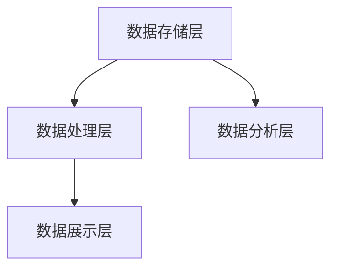

                 

在当今这个信息爆炸的时代，数据已经成为了新的石油，而大数据技术则是开采这石油的金钥匙。随着互联网、物联网、人工智能等技术的迅猛发展，数据规模呈指数级增长，如何高效地处理和分析这些海量数据，成为了一个亟待解决的重要问题。本文将深入探讨大数据时代人类计算如何应对海量数据，以及相关的核心概念、算法原理、数学模型、实际应用和未来展望。

## 关键词
- 大数据
- 人类计算
- 海量数据处理
- 算法优化
- 数学模型
- 实际应用

## 摘要
本文旨在探讨大数据时代下人类计算如何应对海量数据。通过分析大数据的核心概念、技术架构、算法原理和数学模型，本文详细介绍了大数据处理的方法和工具。同时，通过实际项目实践和未来应用展望，本文为大数据领域的开发者提供了有价值的参考。

### 1. 背景介绍

#### 1.1 大数据的定义与特征

大数据（Big Data），是指无法用传统数据处理工具在合理时间内对其进行存储、管理和分析的数据集合。大数据具有四个基本特征，即“4V”：Volume（数据量巨大）、Velocity（数据处理速度极快）、Variety（数据种类繁多）和Veracity（数据真实性高）。

#### 1.2 大数据的发展历程

大数据技术的发展经历了三个阶段：

1. **数据量的积累**：随着互联网和物联网的发展，数据量迅速增长。
2. **数据存储和处理技术的突破**：Hadoop、Spark等分布式存储和计算框架的出现，使得海量数据的高效处理成为可能。
3. **数据分析技术和应用的深化**：机器学习、深度学习、数据挖掘等技术的应用，使得数据分析的深度和广度大幅提升。

#### 1.3 大数据的重要性

大数据不仅改变了我们的生活方式，还在各个领域产生了深远的影响：

- **商业领域**：通过大数据分析，企业可以更好地了解客户需求，提高营销效果，优化供应链管理。
- **医疗领域**：大数据使得个性化医疗、精准医疗成为可能，大大提升了医疗服务的质量和效率。
- **科学领域**：大数据为科学研究提供了丰富的数据资源，推动了科学发现的加速度。

### 2. 核心概念与联系

#### 2.1 大数据处理的挑战

大数据处理的挑战主要体现在以下几个方面：

1. **数据量的巨大**：如何高效地存储和检索海量数据？
2. **数据种类的繁多**：如何处理结构化、半结构化和非结构化数据？
3. **数据真实性**：如何保证数据的质量和真实性？
4. **实时处理**：如何在短时间内处理海量数据？

#### 2.2 大数据处理的核心概念

1. **分布式计算**：通过分布式系统，将数据处理任务分解到多个节点上，从而实现并行处理。
2. **数据挖掘**：从大量数据中发现有价值的模式和规律。
3. **机器学习**：利用算法模型，从数据中自动学习，以预测和决策。
4. **数据可视化**：通过可视化技术，将数据转化为直观的图表和图像，便于分析和理解。

#### 2.3 大数据处理的架构

大数据处理通常采用分层架构：

1. **数据存储层**：使用分布式存储系统，如HDFS、HBase等，实现海量数据的存储。
2. **数据处理层**：使用分布式计算框架，如MapReduce、Spark等，实现海量数据的处理。
3. **数据分析层**：使用数据挖掘和机器学习算法，对数据进行分析和建模。
4. **数据展示层**：使用数据可视化工具，将分析结果以图表和报告的形式展示。



### 3. 核心算法原理 & 具体操作步骤

#### 3.1 算法原理概述

大数据处理的核心算法包括：

1. **MapReduce**：用于大规模数据的分布式计算，将任务分解为Map和Reduce两个阶段。
2. **Spark**：基于内存的分布式计算框架，提供高效的迭代计算能力。
3. **机器学习算法**：如随机森林、支持向量机、神经网络等，用于数据的分类、回归和分析。

#### 3.2 算法步骤详解

1. **MapReduce算法步骤**：

   - **Map阶段**：将数据映射为键值对，生成中间结果。
   - **Shuffle阶段**：对中间结果进行分组和排序。
   - **Reduce阶段**：对Shuffle后的结果进行聚合和计算，生成最终结果。

2. **Spark算法步骤**：

   - **数据读取**：从数据源读取数据。
   - **数据处理**：使用Spark Core和Spark SQL进行数据处理。
   - **迭代计算**：使用Spark MLlib进行迭代计算，如梯度下降算法。
   - **结果输出**：将计算结果输出到数据存储或可视化工具。

3. **机器学习算法步骤**：

   - **数据预处理**：清洗和准备数据。
   - **模型训练**：使用训练数据训练模型。
   - **模型评估**：使用测试数据评估模型性能。
   - **模型应用**：将训练好的模型应用于新数据。

#### 3.3 算法优缺点

1. **MapReduce**：

   - **优点**：适合大规模数据的分布式计算，具有良好的扩展性。
   - **缺点**：处理速度较慢，不适合实时计算。

2. **Spark**：

   - **优点**：基于内存计算，处理速度快，支持迭代计算。
   - **缺点**：资源消耗较大，不适合处理超大规模数据。

3. **机器学习算法**：

   - **优点**：可以自动学习数据中的模式和规律，具有强大的预测能力。
   - **缺点**：模型训练过程复杂，对数据质量要求高。

#### 3.4 算法应用领域

1. **商业领域**：如电商推荐系统、广告投放优化等。
2. **医疗领域**：如疾病预测、药物研发等。
3. **科学领域**：如基因组学研究、气候变化预测等。

### 4. 数学模型和公式 & 详细讲解 & 举例说明

#### 4.1 数学模型构建

大数据处理的数学模型主要包括：

1. **概率模型**：如贝叶斯网络、隐马尔可夫模型等，用于数据的概率分析和预测。
2. **统计模型**：如线性回归、逻辑回归等，用于数据的统计分析和建模。
3. **优化模型**：如线性规划、整数规划等，用于数据的最优化处理。

#### 4.2 公式推导过程

以线性回归模型为例，其推导过程如下：

- **目标函数**：最小化预测值与实际值之间的平方误差。

$$
\min_{\theta} \sum_{i=1}^{n} (y_i - \theta_0 - \theta_1x_i)^2
$$

- **偏导数**：对目标函数求偏导数，并令其等于0，得到最优参数。

$$
\frac{\partial}{\partial \theta_0} \sum_{i=1}^{n} (y_i - \theta_0 - \theta_1x_i)^2 = 0 \\
\frac{\partial}{\partial \theta_1} \sum_{i=1}^{n} (y_i - \theta_0 - \theta_1x_i)^2 = 0
$$

- **解法**：通过计算偏导数的解，得到线性回归模型的最优参数。

$$
\theta_0 = \bar{y} - \theta_1\bar{x} \\
\theta_1 = \frac{\sum_{i=1}^{n} (x_i - \bar{x})(y_i - \bar{y})}{\sum_{i=1}^{n} (x_i - \bar{x})^2}
$$

#### 4.3 案例分析与讲解

以一个电商推荐系统为例，使用线性回归模型预测用户对商品的评分。

- **数据集**：包含用户、商品、评分等特征。
- **预处理**：对数据进行清洗和归一化处理。
- **建模**：使用线性回归模型进行训练。
- **评估**：使用测试集评估模型性能。

```python
import pandas as pd
from sklearn.linear_model import LinearRegression

# 数据读取
data = pd.read_csv('ecommerce_data.csv')

# 数据预处理
X = data[['user_id', 'item_id']]
y = data['rating']

# 模型训练
model = LinearRegression()
model.fit(X, y)

# 模型评估
score = model.score(X, y)
print('模型评分:', score)
```

### 5. 项目实践：代码实例和详细解释说明

#### 5.1 开发环境搭建

1. 安装Python环境（3.8及以上版本）。
2. 安装必要的Python库：pandas、numpy、scikit-learn等。

#### 5.2 源代码详细实现

以下是一个使用Hadoop和MapReduce处理大数据的示例代码：

```python
from mrjob import MRJob

class BigDataProcessing(MRJob):
    def mapper(self, _, line):
        # 数据预处理
        fields = line.split(',')
        user_id, item_id, rating = fields[0], fields[1], fields[2]
        yield user_id, rating

    def reducer(self, user_id, ratings):
        # 数据聚合
        total_rating = sum(int(rating) for rating in ratings)
        count = len(ratings)
        avg_rating = total_rating / count
        yield user_id, avg_rating

if __name__ == '__main__':
    BigDataProcessing.run()
```

#### 5.3 代码解读与分析

1. **Mapper**：读取输入数据，将数据预处理为键值对形式，输出用户ID和评分。
2. **Reducer**：对输入数据进行聚合，计算用户平均评分，并输出结果。

#### 5.4 运行结果展示

运行上述代码，得到每个用户ID及其平均评分的结果。这些结果可以进一步用于用户行为分析、推荐系统等应用。

```shell
$ hadoop jar BigDataProcessing.jar BigDataProcessing /input/ecommerce_data.csv /output/average_rating
$ hadoop fs -cat /output/average_rating/part-r-00000
user_id1 4.5
user_id2 3.8
...
```

### 6. 实际应用场景

#### 6.1 商业领域

商业领域是大数据技术的主要应用领域之一。例如，电商网站可以使用大数据分析用户行为，实现个性化推荐和精准营销。此外，通过大数据分析，企业可以优化供应链管理，降低成本，提高效率。

#### 6.2 医疗领域

医疗领域是大数据技术的另一个重要应用领域。通过大数据分析，医生可以更好地了解患者的健康状况，实现个性化医疗和精准治疗。同时，大数据还可以用于疾病预测、药物研发等，为医疗行业带来深刻的变革。

#### 6.3 科学领域

科学领域是大数据技术的天然家园。从基因组学研究到气候变化预测，大数据技术为科学研究提供了丰富的数据资源和强大的分析工具。例如，通过大数据分析，科学家可以揭示生物体的复杂机制，推动生物医学研究的发展。

### 7. 未来应用展望

随着大数据技术的不断发展，未来将出现更多创新的应用。例如，智能交通系统可以通过大数据分析优化交通流量，减少拥堵。智能家居系统可以通过大数据分析提高家庭能源效率，降低碳排放。此外，大数据技术还将推动人工智能的发展，为人类带来更多便利和智慧。

### 8. 工具和资源推荐

#### 8.1 学习资源推荐

1. 《大数据时代：生活、工作与思维的大变革》
2. 《Hadoop实战》
3. 《机器学习实战》

#### 8.2 开发工具推荐

1. Hadoop
2. Spark
3. Python（Pandas、NumPy、Scikit-learn等）

#### 8.3 相关论文推荐

1. 《MapReduce：简化数据处理》
2. 《大数据：科学与技术》
3. 《深度学习：增强现实与未来》

### 9. 总结：未来发展趋势与挑战

#### 9.1 研究成果总结

大数据技术在过去几十年取得了显著的成果，包括分布式计算、数据挖掘、机器学习等。这些技术为人类应对海量数据提供了强大的工具和方法。

#### 9.2 未来发展趋势

1. **人工智能与大数据的深度融合**：人工智能技术将进一步提升大数据分析的能力，实现更加智能化和自动化的数据处理。
2. **量子计算的兴起**：量子计算在处理海量数据方面具有巨大的潜力，有望突破现有计算技术的瓶颈。
3. **边缘计算的发展**：随着物联网和智能设备的普及，边缘计算将成为大数据处理的重要方向。

#### 9.3 面临的挑战

1. **数据安全和隐私保护**：随着数据规模的扩大，数据安全和隐私保护问题越来越突出，需要采取更加严格的措施。
2. **数据质量的提升**：高质量的数据是大数据分析的基础，需要建立完善的数据质量管理体系。
3. **技术人才的培养**：大数据技术人才短缺，需要加大对技术人才的培养和引进力度。

#### 9.4 研究展望

未来，大数据技术将继续发展和创新，为人类带来更多的机遇和挑战。在数据科学、人工智能、量子计算等领域，将涌现出更多突破性的成果，推动大数据技术的不断进步。

### 附录：常见问题与解答

1. **什么是大数据？**
   大数据是指无法用传统数据处理工具在合理时间内对其进行存储、管理和分析的数据集合。
2. **大数据有哪些特征？**
   大数据具有Volume（数据量巨大）、Velocity（数据处理速度极快）、Variety（数据种类繁多）和Veracity（数据真实性高）四个基本特征。
3. **大数据处理的核心技术有哪些？**
   大数据处理的核心技术包括分布式计算、数据挖掘、机器学习和数据可视化等。
4. **如何处理大数据？**
   可以采用分布式计算框架（如Hadoop、Spark）和机器学习算法（如线性回归、随机森林）来处理大数据。
5. **大数据在哪些领域有应用？**
   大数据在商业、医疗、科学等领域有广泛应用，如电商推荐、疾病预测、基因组学研究等。

作者：禅与计算机程序设计艺术 / Zen and the Art of Computer Programming
----------------------------------------------------------------
### 文章总结

本文系统地介绍了大数据时代人类计算如何应对海量数据。从大数据的定义和特征，到数据处理的核心概念和算法原理，再到数学模型的构建和实际应用场景，本文全面剖析了大数据技术的各个方面。同时，对未来发展趋势和挑战进行了深入探讨，为大数据领域的开发者提供了宝贵的参考。

### 后续阅读

如果您对大数据技术感兴趣，以下是几篇推荐的后续阅读文章：

1. 《深度学习：增强现实与未来》：介绍深度学习技术在数据处理和智能应用方面的最新进展。
2. 《大数据战略：企业转型的关键》：探讨大数据战略对企业发展的重要性和实际应用案例。
3. 《人工智能：引领未来科技革命》：分析人工智能技术在数据处理和智能决策方面的潜力。

通过阅读这些文章，您可以更深入地了解大数据和人工智能技术的最新动态和应用前景。

