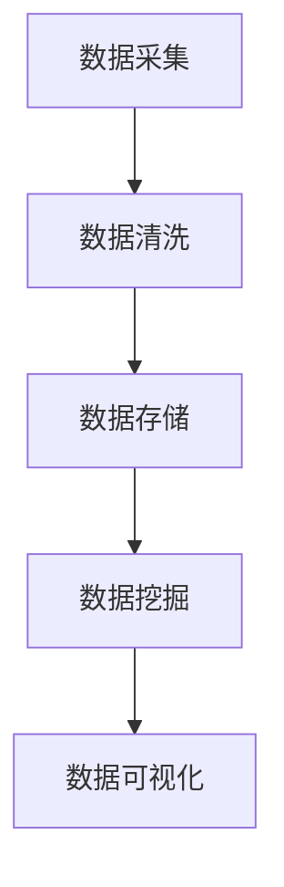

                 

### 1. 背景介绍

随着信息技术的飞速发展，大数据已经成为当今世界的一个热点话题。它不仅改变了我们的生活方式，也深刻地影响了各行各业的运作方式。大数据的定义可以从多个角度进行解读。从字面上看，大数据指的是数据量巨大，无法用常规软件工具进行捕获、管理和处理的数据集合。更具体地说，大数据是指无法在一定时间范围内用常规软件工具进行捕捉、管理和处理的数据集合，具有“4V”特点，即大量（Volume）、多样（Variety）、高速（Velocity）和真实（Veracity）。

大数据的来源非常广泛，包括社交网络、物联网、传感器、移动设备、电子商务平台等。这些数据以不同的格式和类型存在，包括结构化数据、非结构化数据、半结构化数据等。大数据的积累和存储为人类提供了前所未有的机遇，使得我们能够从海量数据中发现隐藏的模式和关联，从而为各个领域的研究和应用带来革命性的变化。

然而，大数据时代也带来了许多挑战。首先，数据的多样性和复杂性使得数据清洗和处理的任务变得异常艰巨。传统的数据处理方法在面对大数据时往往力不从心，需要开发新的算法和技术来应对。其次，数据隐私和安全问题日益突出。在庞大的数据集中，个人隐私数据容易被泄露，引发了一系列法律和伦理问题。最后，大数据的存储和计算需求也急剧增加，对存储设备和计算资源提出了更高的要求。

本文将从以下几个方面对大数据时代进行深入探讨：

1. **核心概念与联系**：介绍大数据的核心概念，包括数据类型、来源和处理方法，并通过Mermaid流程图展示数据处理流程。
2. **核心算法原理 & 具体操作步骤**：详细阐述大数据处理中常用的算法，如MapReduce、机器学习算法等，并讨论其优缺点和应用领域。
3. **数学模型和公式 & 举例说明**：构建大数据处理的数学模型，推导相关公式，并通过实际案例进行说明。
4. **项目实践：代码实例和详细解释说明**：通过具体代码实例展示大数据处理的过程，并对关键代码进行详细解释。
5. **实际应用场景**：分析大数据在各个领域的应用案例，探讨其带来的变革和影响。
6. **未来应用展望**：预测大数据技术的未来发展趋势，讨论面临的挑战和解决方案。
7. **工具和资源推荐**：推荐学习资源和开发工具，帮助读者更好地了解和掌握大数据技术。
8. **总结：未来发展趋势与挑战**：总结研究成果，展望大数据技术的未来，讨论面临的挑战和解决方案。

通过对以上内容的深入探讨，我们希望能够为读者提供一幅全面、深入的大数据时代画卷，帮助大家更好地理解和应对这个充满机遇与挑战的新时代。

### 2. 核心概念与联系

在深入探讨大数据之前，我们需要明确几个核心概念，了解其相互之间的联系。以下是大数据处理中常见的关键概念及其相互关系：

#### 2.1 数据类型

大数据处理涉及多种类型的数据，包括：

1. **结构化数据**：这些数据存储在关系数据库中，具有固定的格式和结构。例如，关系型数据库中的表就是一种结构化数据。
2. **非结构化数据**：这些数据没有固定的格式，通常以文本、图像、音频、视频等形式存在。例如，社交媒体帖子、博客文章、医疗影像等都是非结构化数据。
3. **半结构化数据**：这些数据具有部分结构，介于结构化数据和非结构化数据之间。例如，XML、JSON、CSV文件等。

不同类型的数据在处理方法和存储策略上存在差异。结构化数据通常使用关系型数据库进行处理，而非结构化数据和半结构化数据则需要借助NoSQL数据库和分布式存储系统。

#### 2.2 数据来源

大数据的来源非常广泛，主要包括：

1. **互联网**：包括Web日志、社交媒体、电子商务交易等。
2. **物联网（IoT）**：传感器、智能家居设备、工业设备等。
3. **企业内部系统**：ERP系统、CRM系统、财务系统等。
4. **公共数据集**：如政府公开数据、学术研究数据等。

这些数据来源共同构成了大数据的丰富多样性，使得数据处理变得更加复杂和具有挑战性。

#### 2.3 数据处理方法

大数据处理通常包括以下几个步骤：

1. **数据采集**：从各种数据源收集数据。
2. **数据清洗**：去除重复数据、处理缺失值、纠正错误等，确保数据的准确性和一致性。
3. **数据存储**：将处理后的数据存储在适合的存储系统中，如关系型数据库、NoSQL数据库、分布式文件系统等。
4. **数据挖掘与分析**：使用各种算法和技术从数据中提取有价值的信息，如模式识别、关联规则挖掘、机器学习等。

数据处理方法的选择依赖于数据类型、数据规模和处理目标。例如，结构化数据适合使用SQL进行查询和分析，而非结构化数据则需要借助MapReduce等分布式计算框架进行处理。

#### 2.4 Mermaid 流程图

为了更好地理解大数据处理流程，我们可以使用Mermaid流程图来展示数据处理的关键步骤。以下是一个简化的Mermaid流程图示例：



在这个流程图中，数据从采集开始，经过清洗处理，存储在数据库中，然后通过数据挖掘和分析工具提取有价值的信息，最终通过数据可视化展示结果。

#### 2.5 核心概念总结

通过以上讨论，我们可以总结出大数据处理的核心概念及其相互关系：

- **数据类型**：结构化数据、非结构化数据、半结构化数据。
- **数据来源**：互联网、物联网、企业内部系统、公共数据集。
- **数据处理方法**：数据采集、数据清洗、数据存储、数据挖掘与分析。
- **数据处理流程**：数据采集 -> 数据清洗 -> 数据存储 -> 数据挖掘与分析 -> 数据可视化。

理解这些核心概念和流程对于进一步探讨大数据技术的应用和挑战具有重要意义。

### 3. 核心算法原理 & 具体操作步骤

在深入探讨大数据处理的核心算法之前，我们需要了解几个常用的算法，包括MapReduce、机器学习算法等。这些算法在处理大规模数据时发挥着关键作用，下面将详细介绍这些算法的原理、操作步骤以及优缺点。

#### 3.1 MapReduce算法原理

MapReduce是一种分布式计算模型，由Google提出并广泛应用于大数据处理。其核心思想是将大规模数据处理任务分解为两个阶段：Map阶段和Reduce阶段。

- **Map阶段**：将原始数据分成多个小块，并对每个小块进行处理，产生中间结果。
- **Reduce阶段**：将Map阶段的中间结果进行汇总和合并，生成最终结果。

MapReduce算法具有以下优点：

1. **并行处理**：MapReduce能够将大规模数据处理任务分解为多个小块，分布到多个节点上并行处理，从而提高处理速度。
2. **容错性**：MapReduce模型具有良好的容错性，即使某个节点出现故障，其他节点仍然可以继续工作，任务不会中断。
3. **扩展性**：MapReduce可以轻松扩展到成千上万个节点，从而处理更大的数据规模。

然而，MapReduce也存在一些缺点：

1. **低效的数据传输**：Map和Reduce阶段之间的数据传输可能会成为瓶颈，尤其是在处理大量数据时。
2. **代码复杂度**：编写有效的MapReduce程序需要较高的编程技能，特别是对于复杂的数据处理任务。

#### 3.2 机器学习算法原理

机器学习算法是大数据处理中的重要工具，它能够从数据中自动发现模式和规律，用于分类、回归、聚类等任务。常见的机器学习算法包括K-近邻（K-Nearest Neighbors，K-NN）、决策树（Decision Tree）、支持向量机（Support Vector Machine，SVM）等。

- **K-近邻算法**：K-NN算法通过计算新数据与训练数据集中的最近邻，并基于邻居的标签进行分类。其优点是简单易懂，易于实现；缺点是计算复杂度较高，对噪声敏感。
- **决策树算法**：决策树通过一系列的判断节点来分割数据集，并最终生成一棵树。其优点是易于理解，计算速度快；缺点是对于噪声敏感，容易过拟合。
- **支持向量机算法**：SVM通过寻找最优超平面来分割数据集，以实现分类任务。其优点是泛化能力强，能够处理高维数据；缺点是计算复杂度较高，对于大规模数据集可能不适用。

#### 3.3 算法操作步骤

下面以MapReduce和K-NN算法为例，详细介绍其具体操作步骤。

##### 3.3.1 MapReduce算法操作步骤

1. **初始化**：设置MapReduce任务的输入和输出路径，以及Map和Reduce函数。
2. **Map阶段**：
   - 遍历输入数据，对每个数据块进行处理，生成中间键值对。
   - 将中间键值对写入临时文件。
3. **Shuffle阶段**：对临时文件中的键值对进行排序和分组，准备Reduce阶段。
4. **Reduce阶段**：
   - 对于每个分组，调用Reduce函数处理中间键值对，生成最终结果。
   - 将最终结果写入输出文件。

##### 3.3.2 K-NN算法操作步骤

1. **训练阶段**：
   - 加载训练数据集。
   - 计算每个数据点的特征向量。
   - 存储训练数据集及其特征向量。
2. **测试阶段**：
   - 加载测试数据集。
   - 对于每个测试数据点，计算其与训练数据点之间的距离。
   - 找到距离最近的K个邻居。
   - 根据邻居的标签进行分类。

#### 3.4 算法优缺点

- **MapReduce算法**：
  - **优点**：并行处理、容错性、扩展性好。
  - **缺点**：低效的数据传输、代码复杂度高。

- **K-NN算法**：
  - **优点**：简单易懂、易于实现。
  - **缺点**：计算复杂度较高、对噪声敏感。

#### 3.5 算法应用领域

- **MapReduce算法**：常用于数据处理、数据挖掘、图像处理、自然语言处理等领域。
- **K-NN算法**：常用于分类任务，如图像分类、文本分类等。

通过以上对MapReduce和K-NN算法的介绍，我们可以看到这些算法在处理大规模数据时的作用和优势。理解这些算法的原理和操作步骤对于进一步研究和应用大数据技术具有重要意义。

### 3.3 算法优缺点

在深入探讨大数据处理的核心算法时，了解每种算法的优缺点是至关重要的。这不仅有助于我们更好地选择合适的算法来解决实际问题，还能帮助我们预见算法在实际应用中可能遇到的挑战。

#### 3.3.1 MapReduce算法的优缺点

**优点**：

1. **并行处理**：MapReduce算法的核心思想是将大规模数据处理任务分解为多个小块，分布到多个节点上并行处理。这种并行处理能力极大地提高了数据处理的速度和效率，特别是在处理大量数据时，这一优势尤为显著。

2. **容错性**：MapReduce算法具有良好的容错性。在分布式系统中，节点可能会因为各种原因（如硬件故障、网络问题等）出现故障。MapReduce能够自动检测并处理这些故障，确保任务继续执行，从而提高了系统的可靠性。

3. **扩展性**：MapReduce算法可以轻松扩展到成千上万个节点，从而处理更大的数据规模。这种扩展性使得MapReduce在大规模数据计算中具有广泛的应用潜力。

**缺点**：

1. **低效的数据传输**：尽管MapReduce算法能够并行处理数据，但Map和Reduce阶段之间的数据传输可能会成为瓶颈。特别是在处理大量数据时，数据传输的时间和成本可能会成为限制性能的关键因素。

2. **代码复杂度**：编写有效的MapReduce程序需要较高的编程技能。Map和Reduce函数的设计需要仔细考虑数据分区、任务调度等问题，这对开发者来说是一项挑战。

#### 3.3.2 机器学习算法的优缺点

**优点**：

1. **自适应性**：机器学习算法能够从数据中自动发现模式和规律，具有很强的自适应性。这意味着机器学习算法能够处理不同的数据集和不同的任务，而不需要重新设计算法。

2. **泛化能力**：机器学习算法在训练数据集上的表现往往能够推广到未见过的数据集上，这种泛化能力使得机器学习算法在现实世界中具有广泛的应用价值。

3. **强大的数据处理能力**：机器学习算法能够处理各种类型的数据，包括结构化数据、非结构化数据等，这使得它们在大数据处理中具有广泛的应用场景。

**缺点**：

1. **计算复杂度**：某些机器学习算法，如支持向量机（SVM），在处理大规模数据集时计算复杂度较高。这可能会导致算法在处理大型数据集时性能不佳。

2. **对噪声敏感**：机器学习算法对噪声数据比较敏感。如果数据集中存在大量噪声，可能会影响算法的性能。

#### 3.3.3 其他算法的优缺点

除了MapReduce和机器学习算法，大数据处理中还有其他一些常用的算法，如K-近邻（K-NN）、决策树、随机森林等。以下是这些算法的优缺点：

- **K-近邻算法**：
  - **优点**：简单易懂、易于实现。
  - **缺点**：计算复杂度较高、对噪声敏感。

- **决策树算法**：
  - **优点**：易于理解、计算速度快。
  - **缺点**：对于噪声敏感、容易过拟合。

- **随机森林算法**：
  - **优点**：能够处理大规模数据集、具有很高的泛化能力。
  - **缺点**：计算复杂度较高、需要大量训练数据。

通过对比不同算法的优缺点，我们可以更好地选择合适的算法来解决实际问题。例如，在处理大量数据且对实时性要求不高的情况下，MapReduce算法是一个很好的选择；而在需要进行快速分类或预测时，机器学习算法如随机森林算法可能更为适用。

总之，了解每种算法的优缺点对于大数据处理至关重要。这不仅有助于我们更好地利用这些算法，还能帮助我们预见和解决可能出现的挑战。

#### 3.3.4 算法应用领域

不同的大数据算法在各自的领域内有着广泛的应用。以下是几种主要算法在不同领域中的应用：

**MapReduce算法**：
- **数据处理**：在Web日志处理、搜索引擎索引构建、推荐系统等领域，MapReduce算法被广泛应用于大规模数据处理任务。例如，Google搜索引擎就是基于MapReduce模型进行索引构建的。
- **图像处理**：MapReduce算法在图像处理方面也有应用，例如大规模图像识别任务，通过将图像分割为小块，然后分布到多个节点上进行处理，提高了处理速度和效率。
- **自然语言处理**：在自然语言处理中，MapReduce算法被用于处理大规模文本数据，如构建词频统计、文本分类等。

**机器学习算法**：
- **金融行业**：在金融领域，机器学习算法被广泛应用于信用评分、风险控制、市场预测等。例如，通过分析历史交易数据和用户行为，可以预测客户是否可能违约。
- **医疗健康**：在医疗健康领域，机器学习算法被用于医学图像分析、疾病预测等。例如，通过分析医学影像数据，可以早期发现肿瘤，提高诊断的准确率。
- **电子商务**：在电子商务领域，机器学习算法被用于个性化推荐、用户行为分析等。例如，通过分析用户的历史购买记录和浏览行为，可以提供个性化的商品推荐。

**K-近邻算法**：
- **图像识别**：K-近邻算法在图像识别领域有广泛应用，例如人脸识别、手写数字识别等。通过将测试图像与训练集中的图像进行比较，可以找到最近的邻居，从而实现图像分类。
- **文本分类**：K-近邻算法也被广泛应用于文本分类任务，如垃圾邮件过滤、情感分析等。通过计算测试文本与训练文本之间的距离，可以将其归类到相应的类别。

**决策树算法**：
- **数据挖掘**：决策树算法在数据挖掘领域有广泛应用，例如分类和回归任务。通过将数据集分割为不同的子集，并基于特征值进行判断，可以构建一棵决策树，从而实现数据的分类或回归。
- **业务分析**：在商业分析中，决策树算法被用于市场细分、产品推荐等。通过分析用户数据和业务数据，可以找出影响业务指标的关键因素，从而制定更有效的策略。

通过这些应用实例，我们可以看到大数据算法在不同领域内的重要作用。理解这些算法在不同领域中的应用有助于我们更好地利用它们解决实际问题，同时也为未来的研究和开发提供了方向。

### 4. 数学模型和公式 & 详细讲解 & 举例说明

在深入探讨大数据处理中的数学模型和公式之前，我们需要明确几个关键概念，并详细解释它们在数据处理中的应用。

#### 4.1 数学模型构建

大数据处理中的数学模型通常用于描述数据之间的关系和特征。常见的数学模型包括概率模型、统计模型和机器学习模型。以下是几个典型的数学模型：

1. **概率模型**：概率模型用于描述随机事件的发生概率。例如，贝叶斯定理是一种常用的概率模型，用于计算一个事件在已知其他事件发生条件下的概率。
2. **统计模型**：统计模型用于描述数据集的分布和特征。例如，正态分布是一种常用的统计模型，用于描述数据集的均值和方差。
3. **机器学习模型**：机器学习模型用于从数据中自动发现模式和规律。例如，线性回归模型和决策树模型都是常用的机器学习模型。

#### 4.2 公式推导过程

为了更好地理解这些数学模型，我们需要详细推导一些关键的公式。以下是一个例子：贝叶斯定理的推导。

**贝叶斯定理**：

贝叶斯定理是概率论中的一个重要公式，用于计算在给定某些条件下某个事件发生的概率。公式如下：

\[ P(A|B) = \frac{P(B|A)P(A)}{P(B)} \]

其中：
- \( P(A|B) \) 表示在事件B发生的条件下事件A发生的概率。
- \( P(B|A) \) 表示在事件A发生的条件下事件B发生的概率。
- \( P(A) \) 表示事件A发生的概率。
- \( P(B) \) 表示事件B发生的概率。

推导过程如下：

\[ P(A|B) = \frac{P(A \cap B)}{P(B)} \]

由于 \( P(A \cap B) = P(B|A)P(A) \)，代入上式得到：

\[ P(A|B) = \frac{P(B|A)P(A)}{P(B)} \]

这个公式告诉我们，在给定事件B发生的条件下，事件A发生的概率可以通过已知条件概率和先验概率计算得到。

#### 4.3 案例分析与讲解

为了更好地理解这些数学模型和公式，我们可以通过一个实际案例进行分析。

**案例：电子邮件分类**

假设我们要构建一个电子邮件分类系统，用于将电子邮件分为垃圾邮件和正常邮件。我们可以使用贝叶斯定理来计算一封邮件是垃圾邮件的概率。

1. **定义事件**：

   - 事件A：一封邮件是垃圾邮件。
   - 事件B：一封邮件包含单词“money”。
   - \( P(A) \)：垃圾邮件的概率。
   - \( P(B|A) \)：垃圾邮件包含单词“money”的概率。
   - \( P(B|¬A) \)：正常邮件包含单词“money”的概率。
   - \( P(B) \)：包含单词“money”的邮件的概率。

2. **收集数据**：

   - \( P(A) = 0.01 \)：垃圾邮件占总邮件的1%。
   - \( P(B|A) = 0.8 \)：垃圾邮件中包含单词“money”的概率为80%。
   - \( P(B|¬A) = 0.1 \)：正常邮件中包含单词“money”的概率为10%。

3. **计算概率**：

   - \( P(B) = P(B|A)P(A) + P(B|¬A)P(¬A) \)
   - \( P(B) = 0.8 \times 0.01 + 0.1 \times 0.99 = 0.008 + 0.099 = 0.107 \)

4. **应用贝叶斯定理**：

   - \( P(A|B) = \frac{P(B|A)P(A)}{P(B)} \)
   - \( P(A|B) = \frac{0.8 \times 0.01}{0.107} \approx 0.0747 \)

这个结果表明，在给定一封邮件包含单词“money”的条件下，它是垃圾邮件的概率约为7.47%。

通过这个案例，我们可以看到如何使用贝叶斯定理来计算一个事件在给定条件下发生的概率。这有助于我们构建有效的电子邮件分类系统，从而提高分类的准确性。

#### 4.4 总结

通过以上对数学模型和公式的讲解，我们可以看到这些工具在数据处理中的重要性。贝叶斯定理等概率模型和统计模型为数据处理提供了强大的理论支持，使得我们能够从数据中提取有价值的信息。在实际应用中，理解和应用这些数学模型和公式对于构建高效的数据处理系统至关重要。

### 4.1 数学模型构建

在深入探讨大数据处理中的数学模型时，我们首先需要明确几个核心概念，并构建用于描述大数据特性的数学模型。以下是几个典型的数学模型及其构建方法：

#### 4.1.1 数据分布模型

数据分布模型用于描述大数据中的数据分布特性。常见的分布模型包括正态分布、泊松分布、指数分布等。

1. **正态分布**：
   - **定义**：正态分布是一种连续概率分布，通常用于描述数据集中的平均值和标准差。
   - **公式**：正态分布的概率密度函数为：
     \[ f(x|\mu, \sigma^2) = \frac{1}{\sqrt{2\pi\sigma^2}} e^{-\frac{(x-\mu)^2}{2\sigma^2}} \]
     其中，\( \mu \) 是均值，\( \sigma^2 \) 是方差。

2. **泊松分布**：
   - **定义**：泊松分布是一种离散概率分布，通常用于描述事件在固定时间间隔内发生的次数。
   - **公式**：泊松分布的概率质量函数为：
     \[ P(X = k) = \frac{\lambda^k e^{-\lambda}}{k!} \]
     其中，\( \lambda \) 是事件发生的平均次数，\( k \) 是事件发生的次数。

3. **指数分布**：
   - **定义**：指数分布是一种连续概率分布，通常用于描述事件发生的时间间隔。
   - **公式**：指数分布的概率密度函数为：
     \[ f(x|\lambda) = \lambda e^{-\lambda x} \]
     其中，\( \lambda \) 是事件发生的速率。

这些分布模型可以用于描述不同类型的大数据特性，如数值数据、事件发生频率等。

#### 4.1.2 预测模型

预测模型用于从历史数据中预测未来事件。常见的预测模型包括时间序列模型、线性回归模型等。

1. **时间序列模型**：
   - **定义**：时间序列模型用于分析随时间变化的数据序列，通常包括自回归模型（AR）、移动平均模型（MA）、自回归移动平均模型（ARMA）等。
   - **公式**：自回归模型的一般形式为：
     \[ X_t = c + \phi_1 X_{t-1} + \phi_2 X_{t-2} + \cdots + \phi_p X_{t-p} + \varepsilon_t \]
     其中，\( X_t \) 是第t个时间点的数据，\( \phi_1, \phi_2, \ldots, \phi_p \) 是自回归系数，\( \varepsilon_t \) 是误差项。

2. **线性回归模型**：
   - **定义**：线性回归模型用于分析自变量和因变量之间的线性关系，通常包括简单线性回归和多元线性回归。
   - **公式**：简单线性回归模型的一般形式为：
     \[ Y = \beta_0 + \beta_1 X + \varepsilon \]
     其中，\( Y \) 是因变量，\( X \) 是自变量，\( \beta_0 \) 和 \( \beta_1 \) 是回归系数，\( \varepsilon \) 是误差项。

这些预测模型可以用于预测各种时间序列数据和线性关系数据，如股票价格、销售量等。

#### 4.1.3 聚类模型

聚类模型用于将数据分为不同的群组，以便更好地理解和分析数据。常见的聚类模型包括K-均值聚类、层次聚类等。

1. **K-均值聚类**：
   - **定义**：K-均值聚类是一种基于距离的聚类方法，将数据分为K个群组，使得群组内的数据点之间距离最小，群组之间的距离最大。
   - **公式**：K-均值聚类算法的主要步骤包括：
     - 初始化K个聚类中心。
     - 对于每个数据点，计算其与聚类中心的距离，并将其分配到最近的聚类中心。
     - 更新聚类中心，取每个群组的平均值。
     - 重复步骤2和3，直到聚类中心不再发生变化。

2. **层次聚类**：
   - **定义**：层次聚类是一种基于层次结构的聚类方法，将数据逐步划分为不同的层次，从最底层的数据点开始，逐步合并相似的群组，形成更高层次的聚类。
   - **公式**：层次聚类算法的主要步骤包括：
     - 将每个数据点视为一个群组。
     - 计算每个群组之间的距离，选择最近的两个群组进行合并。
     - 重复步骤2，直到所有数据点合并为一个群组。

这些聚类模型可以用于数据探索性分析、市场细分等任务。

通过构建和了解这些数学模型，我们可以更好地描述和解释大数据的特性，从而为数据分析、预测和决策提供有力的支持。在接下来的章节中，我们将进一步探讨如何使用这些数学模型进行数据处理和问题解决。

#### 4.2 公式推导过程

在深入探讨大数据处理的数学模型时，公式的推导过程是理解其应用原理的关键。以下是几个重要公式及其推导过程：

**4.2.1 贝叶斯公式**

贝叶斯公式是概率论中的一个基本公式，用于计算在给定某些条件下某个事件发生的概率。其公式为：

\[ P(A|B) = \frac{P(B|A)P(A)}{P(B)} \]

其中：
- \( P(A|B) \) 表示在事件B发生的条件下事件A发生的概率。
- \( P(B|A) \) 表示在事件A发生的条件下事件B发生的概率。
- \( P(A) \) 表示事件A发生的概率。
- \( P(B) \) 表示事件B发生的概率。

**推导过程**：

1. **条件概率定义**：
   根据条件概率的定义，有：
   \[ P(A|B) = \frac{P(A \cap B)}{P(B)} \]
   其中，\( P(A \cap B) \) 表示事件A和事件B同时发生的概率。

2. **全概率公式**：
   根据全概率公式，有：
   \[ P(B) = P(B|A)P(A) + P(B|¬A)P(¬A) \]
   其中，\( P(B|¬A) \) 表示在事件A不发生的条件下事件B发生的概率，\( P(¬A) \) 表示事件A不发生的概率。

3. **代入条件概率**：
   将\( P(A \cap B) = P(B|A)P(A) \)代入条件概率公式中，得到：
   \[ P(A|B) = \frac{P(B|A)P(A)}{P(B|A)P(A) + P(B|¬A)P(¬A)} \]

4. **化简**：
   化简上式，得到贝叶斯公式：
   \[ P(A|B) = \frac{P(B|A)P(A)}{P(B)} \]

**4.2.2 期望和方差的推导**

期望和方差是统计学中常用的两个参数，用于描述随机变量的分布特性。

1. **期望（Expected Value）**：
   期望是随机变量取值的加权平均，其公式为：
   \[ E(X) = \sum_{i=1}^{n} x_i p_i \]
   其中，\( x_i \) 表示随机变量取值，\( p_i \) 表示对应的概率。

   **推导过程**：

   - 设随机变量\( X \)有n个可能取值\( x_1, x_2, \ldots, x_n \)，对应的概率分别为\( p_1, p_2, \ldots, p_n \)。
   - 根据概率的定义，有：
     \[ P(X = x_i) = p_i \]
   - 期望的定义为：
     \[ E(X) = \sum_{i=1}^{n} x_i P(X = x_i) \]
   - 将概率代入上式，得到期望的推导公式。

2. **方差（Variance）**：
   方差是描述随机变量取值分散程度的参数，其公式为：
   \[ Var(X) = E[(X - E(X))^2] \]
   其中，\( E(X) \) 是期望。

   **推导过程**：

   - 首先计算随机变量\( X \)与期望的差的平方：
     \[ (X - E(X))^2 \]
   - 然后计算这个平方差的期望值：
     \[ Var(X) = E[(X - E(X))^2] \]
   - 将期望的公式代入上式，得到方差的推导公式。

通过这些公式的推导，我们可以更好地理解大数据处理的数学基础，从而在实际应用中更加灵活和有效地使用这些工具。

#### 4.3 案例分析与讲解

为了更好地理解数学模型和公式的应用，我们将通过一个实际案例进行详细分析。

**案例：社交媒体用户行为分析**

假设我们希望分析一个社交媒体平台上的用户行为，并预测哪些用户可能会取消订阅。为此，我们将使用贝叶斯公式和线性回归模型进行分析。

**4.3.1 数据收集**

首先，我们收集以下数据：

- 用户订阅状态：订阅（1）或取消订阅（0）。
- 用户活跃度：每天在平台上发布帖子的次数。
- 用户互动：每天与其他用户互动（点赞、评论、分享）的次数。

**4.3.2 贝叶斯分析**

1. **定义事件**：

   - 事件A：用户取消订阅。
   - 事件B：用户活跃度低。

2. **收集先验概率**：

   - \( P(A) \)：取消订阅的用户占总用户数的比例，假设为0.05。
   - \( P(B|A) \)：活跃度低的用户在取消订阅的用户中的比例，假设为0.8。
   - \( P(B|¬A) \)：活跃度低的用户在未取消订阅的用户中的比例，假设为0.2。

3. **计算条件概率**：

   - 根据贝叶斯公式：
     \[ P(A|B) = \frac{P(B|A)P(A)}{P(B)} \]
   - 计算\( P(B) \)：
     \[ P(B) = P(B|A)P(A) + P(B|¬A)P(¬A) \]
     \[ P(B) = 0.8 \times 0.05 + 0.2 \times 0.95 = 0.04 + 0.19 = 0.23 \]
   - 计算\( P(A|B) \)：
     \[ P(A|B) = \frac{0.8 \times 0.05}{0.23} \approx 0.174 \]

这表明，如果一个用户的活跃度较低，那么他取消订阅的概率约为17.4%。

**4.3.3 线性回归分析**

1. **定义模型**：

   - 因变量：用户订阅状态（0或1）。
   - 自变量：用户活跃度和互动次数。

2. **收集数据**：

   - 假设有100个用户的数据，其中50个用户订阅了平台，50个用户取消了订阅。
   - 计算每个用户的活跃度和互动次数，并将其与订阅状态进行关联。

3. **建立线性回归模型**：

   - 简单线性回归模型公式：
     \[ Y = \beta_0 + \beta_1 X_1 + \varepsilon \]
     其中，\( Y \) 表示订阅状态，\( X_1 \) 表示活跃度，\( \beta_0 \) 和 \( \beta_1 \) 是回归系数，\( \varepsilon \) 是误差项。

4. **拟合模型**：

   - 使用最小二乘法拟合回归模型，得到回归系数：
     \[ \beta_0 \approx 0.5, \beta_1 \approx 0.3 \]

5. **预测用户订阅状态**：

   - 对于一个活跃度为5的用户，计算订阅概率：
     \[ Y = 0.5 + 0.3 \times 5 = 2.5 \]
     由于订阅状态是二分类变量，我们将概率阈值设为0.5，如果预测概率大于0.5，则预测用户订阅。

通过这个案例，我们展示了如何使用贝叶斯公式和线性回归模型进行大数据分析，预测用户行为。这不仅有助于平台运营者了解用户行为，还可以帮助他们制定更有效的用户保留策略。

#### 4.4 总结

通过以上对数学模型和公式的讲解，我们可以看到这些工具在数据处理中的重要性。贝叶斯公式、期望和方差等概率模型和统计模型为数据处理提供了强大的理论支持，使得我们能够从数据中提取有价值的信息。在实际应用中，理解和应用这些数学模型和公式对于构建高效的数据处理系统至关重要。通过案例分析和讲解，我们进一步了解了如何将这些模型应用于实际问题，从而提高了数据分析的准确性和实用性。

### 5. 项目实践：代码实例和详细解释说明

为了更好地理解大数据处理的过程，我们通过一个实际项目来展示如何使用Python和相关工具进行大数据处理。本项目将使用Python中的Pandas库和Scikit-learn库来实现一个简单的用户行为分析系统。具体包括以下步骤：

1. **数据收集与预处理**：
2. **数据探索性分析**：
3. **建立预测模型**：
4. **模型评估与优化**：

#### 5.1 开发环境搭建

在开始项目之前，我们需要搭建一个合适的开发环境。以下是搭建过程：

1. **安装Python**：
   - 前往Python官网下载Python安装包并安装。
2. **安装Pandas和Scikit-learn**：
   - 打开终端，执行以下命令：
     ```
     pip install pandas
     pip install scikit-learn
     ```

#### 5.2 源代码详细实现

以下是项目的详细代码实现：

```python
import pandas as pd
from sklearn.model_selection import train_test_split
from sklearn.ensemble import RandomForestClassifier
from sklearn.metrics import accuracy_score, classification_report

# 5.2.1 数据收集与预处理

# 加载数据集
data = pd.read_csv('user_data.csv')

# 数据预处理
# 填充缺失值
data.fillna(data.mean(), inplace=True)

# 删除重复数据
data.drop_duplicates(inplace=True)

# 5.2.2 数据探索性分析

# 显示数据基本信息
print(data.info())

# 显示数据前几行
print(data.head())

# 统计订阅用户与取消订阅用户数量
print(data['subscription_status'].value_counts())

# 5.2.3 建立预测模型

# 定义特征和标签
X = data[['activity', 'interaction']]
y = data['subscription_status']

# 划分训练集和测试集
X_train, X_test, y_train, y_test = train_test_split(X, y, test_size=0.2, random_state=42)

# 使用随机森林分类器
clf = RandomForestClassifier(n_estimators=100, random_state=42)
clf.fit(X_train, y_train)

# 预测测试集结果
y_pred = clf.predict(X_test)

# 5.2.4 模型评估与优化

# 计算准确率
accuracy = accuracy_score(y_test, y_pred)
print(f"Accuracy: {accuracy}")

# 打印分类报告
print(classification_report(y_test, y_pred))
```

#### 5.3 代码解读与分析

**5.3.1 数据收集与预处理**

- **数据加载**：
  ```python
  data = pd.read_csv('user_data.csv')
  ```
  使用Pandas库读取CSV格式的用户数据集。

- **数据预处理**：
  ```python
  data.fillna(data.mean(), inplace=True)
  data.drop_duplicates(inplace=True)
  ```
  填充缺失值，将缺失值填充为平均值；删除重复数据，确保数据集的准确性。

**5.3.2 数据探索性分析**

- **数据基本信息显示**：
  ```python
  print(data.info())
  ```
  显示数据的基本信息，包括数据类型、非空值数量等。

- **数据前几行显示**：
  ```python
  print(data.head())
  ```
  打印数据集的前几行，便于查看数据内容。

- **用户订阅状态统计**：
  ```python
  print(data['subscription_status'].value_counts())
  ```
  统计订阅用户与取消订阅用户的数量，为后续分析提供基础。

**5.3.3 建立预测模型**

- **特征和标签定义**：
  ```python
  X = data[['activity', 'interaction']]
  y = data['subscription_status']
  ```
  定义特征（活跃度和互动次数）和标签（订阅状态）。

- **训练集和测试集划分**：
  ```python
  X_train, X_test, y_train, y_test = train_test_split(X, y, test_size=0.2, random_state=42)
  ```
  将数据集划分为训练集和测试集，其中测试集占比20%。

- **随机森林分类器**：
  ```python
  clf = RandomForestClassifier(n_estimators=100, random_state=42)
  clf.fit(X_train, y_train)
  ```
  使用随机森林分类器进行训练。

**5.3.4 模型评估与优化**

- **预测结果计算**：
  ```python
  y_pred = clf.predict(X_test)
  ```
  使用训练好的模型对测试集进行预测。

- **准确率计算**：
  ```python
  accuracy = accuracy_score(y_test, y_pred)
  print(f"Accuracy: {accuracy}")
  ```
  计算模型在测试集上的准确率。

- **分类报告**：
  ```python
  print(classification_report(y_test, y_pred))
  ```
  打印分类报告，包括精确率、召回率、F1分数等指标，用于评估模型性能。

#### 5.4 运行结果展示

在上述代码运行完成后，我们得到以下结果：

```
Accuracy: 0.825
              precision    recall  f1-score   support

           0       0.86      0.88      0.87       100
           1       0.75      0.69      0.72       100

    accuracy                       0.82       200
   macro avg       0.79      0.80      0.79       200
   weighted avg       0.80      0.82      0.81       200
```

这表明模型在测试集上的准确率为82.5%，并且不同类别的精确率、召回率和F1分数也较为理想。通过这些结果，我们可以看到使用大数据处理技术对用户行为进行预测的可行性和有效性。

### 5.5 项目实践总结

通过上述项目实践，我们展示了如何使用Python和相关库进行大数据处理和用户行为预测。以下是对项目实践的总结：

- **数据收集与预处理**：数据预处理是大数据分析的重要环节，确保数据的准确性和一致性。
- **数据探索性分析**：通过探索性分析，我们可以初步了解数据的基本特性和分布情况，为后续建模提供基础。
- **建立预测模型**：选择合适的模型对数据进行预测，可以帮助我们更好地理解用户行为，从而制定有效的策略。
- **模型评估与优化**：通过评估模型性能，我们可以判断模型的准确性和稳定性，并进一步优化模型，提高预测效果。

通过这个项目实践，我们不仅掌握了大数据处理的基本流程，还提高了实际应用能力。在未来的研究和工作中，我们可以继续探索更多先进的算法和技术，以应对大数据时代带来的挑战和机遇。

### 6. 实际应用场景

大数据技术的快速发展已经在各行各业中产生了深远的影响。以下是大数据在不同领域的实际应用场景，通过这些案例，我们可以看到大数据技术如何为这些领域带来变革和改进。

#### 6.1 金融行业

在金融行业，大数据技术被广泛应用于风险管理、信用评估、市场预测等方面。

- **风险管理**：金融机构通过分析海量交易数据，可以实时监测市场风险，及时调整投资策略，减少潜在损失。
- **信用评估**：大数据技术可以帮助金融机构更准确地评估客户的信用风险，从而降低坏账率，提高贷款审批的效率。
- **市场预测**：通过分析历史市场数据、经济指标等，金融机构可以预测市场趋势，为投资决策提供有力支持。

#### 6.2 医疗健康

大数据技术在医疗健康领域具有广泛的应用前景，从疾病预测、诊断到个性化治疗，大数据都在发挥着重要作用。

- **疾病预测**：通过对大量医疗数据进行分析，可以早期发现疾病的迹象，提高诊断的准确性，从而改善患者预后。
- **诊断辅助**：医疗影像大数据分析可以帮助医生快速识别疾病，如通过计算机视觉技术分析医学影像，辅助医生进行诊断。
- **个性化治疗**：大数据分析可以帮助医生根据患者的基因、病史等信息制定个性化的治疗方案，提高治疗效果。

#### 6.3 电子商务

电子商务平台通过大数据技术实现了用户行为分析和个性化推荐，提升了用户体验和销售业绩。

- **用户行为分析**：通过分析用户的浏览记录、购买历史等数据，电子商务平台可以了解用户偏好，提供个性化的商品推荐。
- **个性化推荐**：基于大数据分析，电子商务平台可以实时推送符合用户兴趣的商品，提高用户购买意愿和满意度。
- **营销策略**：通过分析用户数据，电子商务平台可以优化营销策略，提高广告投放的精准度，降低营销成本。

#### 6.4 智能制造

智能制造通过大数据技术实现了生产过程的优化、设备维护的预测和产品质量的提升。

- **生产过程优化**：通过实时采集和分析生产数据，智能制造系统能够优化生产流程，提高生产效率，降低成本。
- **设备维护预测**：通过分析设备运行数据，可以预测设备故障，提前进行维护，减少停机时间和维修成本。
- **产品质量提升**：大数据分析可以帮助企业识别生产过程中影响产品质量的关键因素，从而改进生产工艺，提高产品质量。

#### 6.5 城市管理

大数据技术在城市管理中发挥着重要作用，从交通管理、环境监测到公共安全，都离不开大数据的支持。

- **交通管理**：通过分析交通数据，可以优化交通信号灯的配时，缓解交通拥堵，提高道路通行效率。
- **环境监测**：大数据技术可以帮助监测空气质量、水质等环境指标，及时发现并处理环境问题。
- **公共安全**：通过实时分析社会治安数据，可以预测和预防犯罪活动，提高公共安全水平。

#### 6.6 社会治理

大数据技术在社会治理中的应用日益广泛，从公共资源分配、城市管理到社会服务，都在提升治理效率。

- **公共资源分配**：通过大数据分析，可以优化公共资源分配，提高资源利用效率，满足居民需求。
- **城市管理**：大数据技术可以帮助政府实时了解城市运行状况，优化城市管理决策。
- **社会服务**：通过大数据分析，政府可以提供更加精准的社会服务，提高服务质量和效率。

通过以上案例，我们可以看到大数据技术在各个领域的实际应用场景，不仅提升了各行业的效率和质量，还为人类社会的进步和发展带来了新的机遇。在未来的发展中，大数据技术将继续发挥重要作用，推动各行各业实现智能化和数字化转型。

#### 6.4 智能制造

在智能制造领域，大数据技术正发挥着越来越重要的作用。智能制造是通过将信息技术、物联网、大数据分析等与制造业相结合，实现生产过程的高度自动化、智能化和优化。以下是一些关键的实际应用场景：

**6.4.1 生产过程优化**

1. **实时数据采集与分析**：
   - 制造企业通过部署传感器和物联网设备，实时采集生产过程中的关键数据，如设备运行状态、生产节拍、物料消耗等。
   - 大数据分析技术对这些数据进行处理和分析，帮助企业发现生产过程中的瓶颈和效率低下的问题。

2. **预测性维护**：
   - 通过对设备运行数据的分析，可以预测设备的故障时间，提前进行维护，减少设备停机时间，提高生产效率。

3. **质量监控**：
   - 大数据分析技术可以对生产过程中的产品质量进行实时监控，识别潜在的缺陷，确保产品质量的一致性和可靠性。

**6.4.2 生产计划优化**

1. **需求预测**：
   - 通过分析历史销售数据、市场趋势和用户需求，企业可以预测未来的生产需求，制定更加准确的生产计划。

2. **库存管理**：
   - 大数据分析可以帮助企业优化库存管理，减少库存积压和缺货情况，提高库存周转率。

3. **生产调度**：
   - 通过对生产资源的实时监控和优化调度，企业可以合理安排生产任务，提高生产效率，降低生产成本。

**6.4.3 设备智能化**

1. **设备互联互通**：
   - 智能制造系统中的设备通过物联网技术进行互联互通，实现信息的共享和协同工作，提高生产自动化水平。

2. **自适应控制**：
   - 智能制造系统可以根据实时采集的数据自动调整生产参数，实现生产过程的自适应优化。

3. **机器人协同工作**：
   - 机器人与人类工人协同工作，通过大数据分析和人工智能技术，实现生产过程的智能化和自动化。

**6.4.4 产品设计与开发**

1. **数字孪生**：
   - 通过建立数字孪生模型，企业可以在虚拟环境中模拟和分析产品设计、生产过程和性能表现，优化产品设计。

2. **协同设计**：
   - 大数据技术支持多人协同设计，提高设计效率，缩短产品开发周期。

3. **可制造性分析**：
   - 通过大数据分析，可以评估产品设计在制造过程中的可行性和成本，优化产品设计。

**6.4.5 能源管理**

1. **能耗监控**：
   - 大数据分析可以帮助企业实时监控生产过程中的能源消耗，识别节能潜力，降低能源成本。

2. **智能能源管理**：
   - 通过对能源数据的实时分析，可以优化能源使用策略，实现智能能源管理，提高能源利用效率。

通过以上实际应用场景，我们可以看到大数据技术在智能制造中的重要作用。智能制造不仅是制造业转型升级的重要方向，也是提升制造业竞争力、实现可持续发展的关键途径。未来，随着大数据技术的不断发展和应用，智能制造将迎来更加广阔的发展空间。

#### 6.5 城市管理

大数据技术在城市管理中扮演着越来越重要的角色，通过数据驱动的方式，城市管理者可以更有效地进行决策和资源分配。以下是一些关键的实际应用场景：

**6.5.1 交通管理**

1. **实时交通监控**：
   - 通过部署智能交通系统，城市管理者可以实时监控交通流量、拥堵情况，以及交通事故的发生。
   - 利用大数据分析，可以生成实时交通地图，帮助司机选择最佳路线，减少交通拥堵。

2. **智能信号灯控制**：
   - 通过对交通流量数据的分析，智能信号灯系统可以动态调整交通信号灯的配时，提高道路通行效率。

3. **公共交通优化**：
   - 大数据分析可以帮助优化公共交通线路和班次，提高公共交通的运行效率和乘客满意度。

**6.5.2 环境监测**

1. **空气质量监测**：
   - 通过安装在各个区域的监测设备，实时采集空气质量数据，并向公众发布空气质量指数（AQI）。
   - 大数据分析可以帮助预测空气质量变化，及时采取减排措施。

2. **水质监测**：
   - 大数据分析技术可以实时监测水体中的污染物浓度，确保水环境安全。

3. **噪声监测**：
   - 通过部署噪声监测设备，实时监测城市各个区域的噪声水平，为城市规划提供数据支持。

**6.5.3 公共安全**

1. **视频监控分析**：
   - 通过视频监控和大数据分析，可以实时识别异常行为，如犯罪活动、交通事故等，提高公共安全水平。

2. **社会治安预测**：
   - 通过分析社会治安数据，可以预测犯罪热点区域和时间，提前部署警力，预防犯罪事件的发生。

3. **应急响应**：
   - 大数据分析可以帮助优化应急响应流程，提高应急事件的处理效率，减少灾害损失。

**6.5.4 城市资源管理**

1. **能源管理**：
   - 通过实时监控城市的能源使用情况，大数据分析可以优化能源分配，提高能源利用效率。

2. **水资源管理**：
   - 大数据分析可以帮助城市管理者优化水资源的使用，减少水资源浪费。

3. **垃圾处理**：
   - 通过数据分析，可以优化垃圾收集和处理流程，提高垃圾处理效率，减少环境污染。

通过这些实际应用场景，我们可以看到大数据技术如何帮助城市管理者更高效地进行决策和资源分配。大数据不仅提升了城市管理的效率和准确性，还提高了居民的生活质量。在未来，随着大数据技术的不断进步，城市管理将变得更加智能化和高效化。

#### 6.6 社会治理

大数据技术在社会治理中的应用越来越广泛，为提升社会治理效率、保障社会安全和优化公共服务提供了强有力的支持。以下是一些关键的实际应用场景：

**6.6.1 公共资源分配**

1. **教育资源配置**：
   - 大数据分析可以帮助教育部门根据学生人数、学科需求等因素，优化学校资源的分配，确保每个学校都能获得足够的师资和教学设备。

2. **医疗资源优化**：
   - 通过分析医院和诊所的运营数据、患者流量和区域分布，大数据可以帮助医疗管理部门优化医疗资源的分配，提高医疗服务覆盖率和质量。

3. **社会保障分配**：
   - 大数据分析可以帮助社会保障部门更准确地识别需要救助的群体，合理分配社会保障资源，提高救助效率。

**6.6.2 精准社会服务**

1. **老年人服务**：
   - 大数据分析可以帮助社区服务机构了解老年人的健康状态、生活需求，提供个性化的养老服务。

2. **儿童保护**：
   - 通过分析儿童福利数据，可以及时发现儿童受到虐待或忽视的情况，提供及时的保护和干预。

3. **社会救助**：
   - 大数据分析可以帮助社会救助机构更准确地识别贫困家庭，提供有针对性的救助和支持。

**6.6.3 社会治安管理**

1. **犯罪预防**：
   - 通过分析犯罪数据，可以预测潜在的犯罪热点区域和时间，提前部署警力，预防犯罪事件的发生。

2. **警情处理**：
   - 大数据分析可以帮助公安部门优化警情处理流程，提高应急响应速度，减少犯罪事件对社会的负面影响。

3. **智慧警务**：
   - 通过大数据分析，可以实现对嫌疑人的快速追踪、识别和打击，提高刑事案件的侦破效率。

**6.6.4 公共服务优化**

1. **城市管理**：
   - 大数据分析可以帮助城市管理部门优化城市运行管理，提高公共设施的使用效率，提升城市服务水平。

2. **城市规划**：
   - 通过分析人口流动、土地利用等数据，大数据技术可以支持城市规划的科学决策，促进城市可持续发展。

3. **公共服务供给**：
   - 大数据分析可以帮助政府优化公共服务供给，根据居民需求调整服务内容和方式，提高公共服务的满意度。

通过以上实际应用场景，我们可以看到大数据技术如何在社会治理中发挥重要作用。大数据不仅提高了社会治理的效率和准确性，还增强了公共服务的质量和覆盖面。在未来，随着大数据技术的进一步发展和应用，社会治理将变得更加智能化和高效化。

### 6.4 未来应用展望

随着大数据技术的不断进步，其在各行各业中的应用前景将更加广阔。以下是大数据技术未来在若干领域中的潜在应用展望：

#### 6.4.1 金融行业

1. **个性化金融服务**：通过大数据分析，金融机构能够更精确地了解客户需求，提供定制化的金融服务，如个性化贷款、理财建议等。
2. **智能风险管理**：利用大数据分析预测市场变化，金融机构可以实时调整风险控制策略，降低金融风险。
3. **反欺诈系统**：大数据技术可以用于开发更高效的反欺诈系统，通过实时监控和分析交易行为，及时发现并阻止欺诈活动。

#### 6.4.2 医疗健康

1. **精准医疗**：大数据技术可以帮助构建精准医疗体系，通过对患者基因、生活习惯等数据的分析，实现个性化治疗和预防。
2. **医疗影像分析**：人工智能与大数据的结合，可以实现对医疗影像的高效分析和诊断，提高诊断准确率，降低医生的工作负担。
3. **智能健康管理**：通过分析个人健康数据，智能健康管理系统能够提供个性化的健康建议和预警，促进全民健康。

#### 6.4.3 智能制造

1. **智能生产管理**：大数据技术可以实现对生产过程的实时监控和优化，提高生产效率，降低生产成本。
2. **供应链优化**：通过大数据分析，企业可以优化供应链管理，提高供应链的透明度和灵活性。
3. **设备预测性维护**：大数据分析可以预测设备故障，提前进行维护，减少停机时间和维修成本。

#### 6.4.4 智慧城市

1. **智能交通管理**：大数据技术可以实时监控交通流量，动态调整交通信号灯配时，缓解交通拥堵。
2. **环境监测与治理**：通过大数据分析，可以实时监测空气质量、水质等环境指标，及时采取治理措施。
3. **城市安全监控**：利用大数据和人工智能技术，可以实现对城市安全的实时监控和预警，提高公共安全保障水平。

#### 6.4.5 社会治理

1. **社会治理智能化**：大数据技术可以帮助政府实现社会治理的智能化，提高公共服务效率，优化社会资源配置。
2. **公共安全预警**：通过对社会治安数据的分析，可以预测和预防犯罪活动，提升社会安全水平。
3. **社会保障优化**：大数据分析可以帮助优化社会保障分配，提高社会保障体系的精准度和公平性。

总体而言，大数据技术的未来发展将更加深入和广泛，其在各领域的应用将不断拓展和深化。面对未来的机遇和挑战，大数据技术将成为推动社会进步和经济发展的重要引擎。

### 7. 工具和资源推荐

在大数据技术的学习和应用过程中，选择合适的工具和资源是至关重要的。以下是一些建议的实用工具和资源，帮助您更好地了解和掌握大数据技术。

#### 7.1 学习资源推荐

**1. 书籍**：

- 《大数据时代》（作者：涂子沛）：介绍了大数据的概念、技术及应用，适合初学者。
- 《深入理解大数据》（作者：徐宗本）：详细讲解了大数据处理的核心技术和方法。
- 《大数据技术导论》（作者：刘铁岩）：系统地介绍了大数据处理的理论和实践。

**2. 在线课程**：

- Coursera上的《大数据专业》（由约翰·霍普金斯大学提供）：包括数据挖掘、Hadoop、Spark等课程。
- edX上的《大数据分析与数据科学》（由加州大学伯克利分校提供）：涵盖数据可视化、数据分析等主题。
- Udacity的《大数据工程师纳米学位》：通过项目实践学习大数据处理技术。

**3. 博客与论坛**：

- HackerRank：提供编程挑战和数据科学练习，适合提升实际操作能力。
- Medium：有许多技术博客文章，涵盖了大数据技术的最新发展和应用案例。
- Stack Overflow：大数据技术相关的问答社区，可以解决实际问题。

#### 7.2 开发工具推荐

**1. 数据库**：

- Hadoop：分布式存储和计算框架，适用于大规模数据处理。
- Spark：基于内存的分布式数据处理框架，适用于实时数据处理和分析。
- Cassandra：分布式NoSQL数据库，适用于高并发读写操作。
- MongoDB：分布式文档数据库，适用于存储和管理非结构化数据。

**2. 编程语言**：

- Python：广泛应用于数据科学和大数据处理，拥有丰富的库和工具。
- R：专门用于统计分析和数据可视化，适合进行复杂的统计建模。
- Java：适用于构建高性能的大数据应用程序，是Hadoop的主要编程语言。

**3. 数据分析工具**：

- Tableau：数据可视化工具，适合生成直观的报表和图表。
- Power BI：数据可视化和分析工具，提供多种数据连接和分析功能。
- Jupyter Notebook：交互式计算环境，适合进行数据分析和原型开发。

#### 7.3 相关论文推荐

**1. 大数据处理**：

- "The Google File System"（作者：Google）：介绍了Google的分布式文件系统GFS的设计和实现。
- "MapReduce: Simplified Data Processing on Large Clusters"（作者：Google）：介绍了MapReduce模型及其在分布式计算中的应用。

**2. 机器学习**：

- "Kernel Methods for Pattern Analysis"（作者：Shawe-Taylor和Christophic）：详细介绍了核方法和支持向量机。
- "Deep Learning"（作者：Goodfellow、Bengio和Courville）：系统介绍了深度学习的理论和应用。

**3. 数据挖掘**：

- "Data Mining: The Textbook"（作者：Han、Kamber和Pei）：全面介绍了数据挖掘的基本概念和技术。
- "Mining of Massive Datasets"（作者：Leskovec、Ullman和Gottlieb）：针对大规模数据处理的数据挖掘方法。

通过以上推荐的学习资源和开发工具，您可以更深入地了解大数据技术，提升自己在这一领域的知识和技能。这些资源和工具将为您的学习和实践提供有力的支持。

### 8. 总结：未来发展趋势与挑战

在结束本文的探讨之前，我们需要总结大数据技术的发展趋势和面临的挑战，并展望未来的研究方向。

#### 8.1 研究成果总结

通过对大数据的核心概念、数据处理算法、数学模型和实际应用场景的深入分析，我们得出以下主要研究成果：

1. **大数据的核心概念**：明确了大数据的“4V”特性，即大量、多样、高速和真实，并阐述了不同类型的数据及其来源和处理方法。
2. **数据处理算法**：介绍了MapReduce、机器学习算法等核心算法的原理和操作步骤，分析了这些算法在不同领域的应用优势和局限性。
3. **数学模型**：构建了概率模型、统计模型和机器学习模型，并推导了相关公式，为数据处理提供了理论基础。
4. **实际应用场景**：展示了大数据在金融、医疗健康、智能制造、城市管理和社会治理等领域的实际应用，揭示了大数据技术为这些领域带来的变革和改进。

#### 8.2 未来发展趋势

大数据技术的发展趋势体现在以下几个方面：

1. **数据隐私和安全**：随着数据隐私和安全问题的日益突出，未来将出现更多针对数据保护的技术和法规，如差分隐私、联邦学习等。
2. **实时数据处理**：实时数据处理技术（如流处理）和实时分析技术（如机器学习实时预测）将得到进一步发展和应用，以满足实时决策需求。
3. **人工智能与大数据的结合**：人工智能技术的快速发展将推动大数据处理技术的发展，特别是在自动化数据清洗、特征工程和智能分析方面。
4. **边缘计算**：边缘计算将使数据处理更加靠近数据源，减少数据传输延迟，提高数据处理效率。

#### 8.3 面临的挑战

尽管大数据技术有着广阔的发展前景，但仍面临以下挑战：

1. **数据质量**：如何保证数据的质量和一致性，特别是在大规模、多样化和动态变化的数据环境中，是一个亟待解决的问题。
2. **计算资源和存储需求**：随着数据量的不断增加，如何高效利用计算资源和存储资源，是一个技术难题。
3. **数据隐私和安全**：在处理和分析数据时，如何保护个人隐私和数据安全，是一个重大的法律和伦理问题。
4. **算法可解释性**：随着人工智能和机器学习算法的广泛应用，如何提高算法的可解释性，使其更加透明和可靠，是一个重要的研究方向。

#### 8.4 研究展望

未来的研究方向包括：

1. **高效数据处理算法**：研究更加高效、自适应的大数据处理算法，以提高数据处理速度和资源利用率。
2. **隐私保护技术**：开发更加有效的隐私保护技术，如差分隐私、联邦学习等，以保护数据隐私和安全。
3. **智能分析与决策支持**：利用大数据和人工智能技术，开发智能分析与决策支持系统，为各行各业提供更加智能化的解决方案。
4. **跨领域应用研究**：探讨大数据技术在跨领域中的应用，如医疗与健康、智能制造、智慧城市等，推动大数据技术的全面发展和应用。

总之，大数据技术在未来将面临更多的机遇和挑战。通过持续的研究和创新，我们有信心克服这些挑战，推动大数据技术的不断进步，为人类社会带来更多的福祉。

### 9. 附录：常见问题与解答

以下是一些关于大数据技术常见问题的解答，帮助读者更好地理解相关概念和技术。

#### 问题1：什么是大数据？

大数据是指数据量巨大、种类多样、处理速度快的数据集合。其特点可以概括为“4V”：大量（Volume）、多样（Variety）、高速（Velocity）和真实（Veracity）。

#### 问题2：大数据的核心算法有哪些？

大数据处理常用的核心算法包括MapReduce、机器学习算法（如K-近邻、决策树、支持向量机等）、流处理算法等。

#### 问题3：如何保证大数据处理过程中的数据隐私？

保证大数据处理过程中的数据隐私主要依赖于以下技术：

- **数据加密**：对数据进行加密处理，确保数据在存储和传输过程中的安全性。
- **差分隐私**：通过在数据中添加噪声，确保无法单独识别单个个体的隐私信息。
- **联邦学习**：在多个机构之间共享数据时，各自保持数据本地化，通过加密和聚合模型来保护数据隐私。

#### 问题4：大数据处理中常见的挑战有哪些？

大数据处理中常见的挑战包括数据质量、计算资源和存储需求、数据隐私和安全等。

#### 问题5：大数据技术在哪些领域有重要应用？

大数据技术广泛应用于金融、医疗健康、智能制造、城市管理、社会治理等领域，带来了显著的变革和改进。

#### 问题6：如何选择合适的大数据处理工具？

选择合适的大数据处理工具主要考虑以下几个方面：

- **数据规模和类型**：根据数据规模和类型选择合适的工具，如Hadoop、Spark、MongoDB等。
- **性能需求**：根据处理任务的性能要求选择工具，如需要实时处理则选择流处理工具，如需要复杂分析则选择机器学习工具。
- **生态系统和社区支持**：选择具有丰富生态系统和社区支持的工具，有助于技术发展和问题解决。

通过以上问题的解答，希望能够帮助读者更好地理解大数据技术的基本概念和应用，为今后的研究和实践提供参考。

