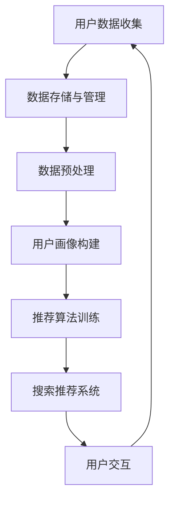

                 

关键词：大数据，电商平台，搜索推荐系统，AI模型融合技术，人工智能，用户行为分析，个性化推荐

## 摘要

随着互联网的迅猛发展，电商平台已经成为现代商业的重要组成部分。然而，面对日益激烈的市场竞争和用户需求的多样性，传统的电商平台已经难以满足用户的个性化需求。本文将探讨如何通过大数据和人工智能技术，特别是搜索推荐系统的应用，实现电商平台的转型升级。我们将深入分析搜索推荐系统的核心作用，AI模型融合技术的应用，以及大数据对电商平台转型的驱动力量。

本文分为以下几个部分：首先，我们将介绍电商平台的现状和面临的挑战；然后，探讨大数据和人工智能在电商平台中的应用；接着，详细讨论搜索推荐系统的原理、架构和实现；随后，介绍AI模型融合技术的具体应用；之后，分析大数据驱动的电商平台转型的实际案例；最后，探讨未来的发展趋势和面临的挑战，并提出相应的解决方案。

## 1. 背景介绍

电商平台的发展历程可以追溯到20世纪90年代，随着互联网的普及，电子商务逐渐崭露头角。传统的电商平台主要以商品销售为主，用户通过搜索和浏览找到自己感兴趣的商品，并完成购买。然而，随着用户数量的增加和市场竞争的加剧，传统的电商平台开始面临诸多挑战。

首先，用户需求日益多样化。现代消费者不仅关注商品本身的质量和价格，更注重购物体验和个性化服务。其次，市场竞争激烈。越来越多的企业进入电商平台领域，导致同质化竞争严重。如何在众多竞争对手中脱颖而出，成为电商平台需要思考的问题。最后，数据驱动成为企业决策的核心。在大数据时代，企业可以通过收集和分析用户数据，实现精准营销和个性化服务。

为了应对这些挑战，电商平台需要转型升级，而大数据和人工智能技术的应用成为关键。大数据技术可以帮助电商平台收集、存储和处理海量用户数据，从而挖掘用户行为特征和需求；人工智能技术，特别是搜索推荐系统的应用，可以实现个性化推荐，提高用户满意度和转化率。因此，本文将深入探讨大数据和人工智能在电商平台转型中的核心作用。

## 2. 核心概念与联系

### 2.1 大数据和人工智能

大数据（Big Data）是指无法使用常规软件工具在合理时间内捕捉、管理和处理的大量数据。大数据具有“4V”特征，即数据量（Volume）、数据速度（Velocity）、数据多样性（Variety）和数据价值（Value）。人工智能（Artificial Intelligence，简称AI）是指模拟、延伸和扩展人的智能的理论、方法、技术及应用。人工智能技术包括机器学习、深度学习、自然语言处理、计算机视觉等。

大数据和人工智能在电商平台中的应用主要体现在以下几个方面：

1. **用户行为分析**：通过大数据技术收集用户在平台上的行为数据，如浏览记录、购买历史、评价等，利用人工智能技术进行分析，挖掘用户兴趣和行为模式，实现个性化推荐。

2. **精准营销**：基于用户数据，电商平台可以精准定位目标用户，推送个性化的广告和促销信息，提高广告投放效果和转化率。

3. **智能客服**：利用自然语言处理技术，智能客服可以自动解答用户常见问题，提供24/7的在线服务，提高客户满意度和运营效率。

4. **风险控制**：通过大数据分析和机器学习技术，电商平台可以实时监测和预测用户行为，识别异常交易和潜在风险，提高交易安全性和用户体验。

### 2.2 搜索推荐系统

搜索推荐系统（Search and Recommendation System）是电商平台的核心功能之一，旨在为用户提供个性化的商品推荐。搜索推荐系统通常包括以下模块：

1. **搜索引擎**：用于用户查询商品的接口，支持模糊查询、精确查询等。

2. **推荐引擎**：根据用户行为数据和商品信息，生成个性化推荐结果。

3. **用户画像**：通过分析用户历史行为和兴趣标签，构建用户画像，用于推荐算法的输入。

4. **推荐算法**：包括基于内容的推荐、协同过滤推荐、基于模型的推荐等。

### 2.3 AI 模型融合技术

AI 模型融合技术（Model Fusion Technology）是指将多个AI模型集成在一起，利用各自的优势，提高整体预测性能。在电商平台中，AI模型融合技术可以应用于以下几个方面：

1. **多模型融合推荐**：将基于内容的推荐、协同过滤推荐和基于模型的推荐等多种算法融合在一起，生成更精准的推荐结果。

2. **多特征融合**：将用户行为数据、商品属性数据和其他外部数据融合在一起，构建更全面的用户画像，提高推荐效果。

3. **多任务学习**：同时训练多个相关任务，如商品推荐、用户画像和风险控制等，利用模型之间的相互信息，提高整体性能。

### 2.4 Mermaid 流程图

以下是电商平台中大数据、人工智能和搜索推荐系统的关系图：



## 3. 核心算法原理 & 具体操作步骤

### 3.1 算法原理概述

电商平台中的搜索推荐系统主要依赖于机器学习算法，包括协同过滤算法、基于内容的推荐算法和基于模型的推荐算法等。以下是这些算法的基本原理：

1. **协同过滤算法**：基于用户的历史行为数据，找到与目标用户相似的其他用户，并推荐这些用户喜欢的商品。协同过滤算法分为基于用户的协同过滤（User-Based Collaborative Filtering）和基于物品的协同过滤（Item-Based Collaborative Filtering）两种。

2. **基于内容的推荐算法**：根据用户的历史行为和偏好，分析商品的内容特征，将相似的商品推荐给用户。

3. **基于模型的推荐算法**：利用机器学习模型，如线性回归、逻辑回归、决策树、随机森林、神经网络等，预测用户对商品的喜好程度，并生成推荐结果。

### 3.2 算法步骤详解

以下是搜索推荐系统的一般步骤：

1. **数据收集**：从电商平台的用户行为数据中收集用户历史购买记录、浏览记录、搜索记录等。

2. **数据预处理**：对收集到的数据进行清洗、去重、归一化等预处理操作，确保数据质量。

3. **特征提取**：从用户行为数据和商品属性数据中提取特征，如用户ID、商品ID、购买次数、浏览次数、价格、类别等。

4. **用户画像构建**：利用用户行为数据和特征，构建用户画像，用于推荐算法的输入。

5. **模型训练**：选择合适的机器学习算法，如协同过滤算法、基于内容的推荐算法和基于模型的推荐算法，对用户画像进行训练。

6. **模型评估**：利用测试集评估模型的性能，如准确率、召回率、F1值等。

7. **生成推荐结果**：根据训练好的模型，为每个用户生成个性化推荐结果。

8. **用户交互**：将推荐结果展示给用户，并收集用户反馈，用于模型迭代和优化。

### 3.3 算法优缺点

1. **协同过滤算法**：

   - 优点：简单高效，易于实现，适用于大规模数据集。

   - 缺点：易受冷启动问题影响，推荐结果容易产生偏差，无法充分利用商品内容特征。

2. **基于内容的推荐算法**：

   - 优点：充分利用商品内容特征，推荐结果较为准确，不易受冷启动问题影响。

   - 缺点：需要大量的特征工程，计算复杂度高，难以处理高维数据。

3. **基于模型的推荐算法**：

   - 优点：可以同时利用用户行为数据和商品内容特征，推荐结果较为准确。

   - 缺点：需要大量的训练数据和计算资源，模型训练时间较长。

### 3.4 算法应用领域

搜索推荐系统在电商平台中的应用非常广泛，包括：

1. **商品推荐**：为用户推荐感兴趣的商品，提高用户购买转化率和满意度。

2. **广告推荐**：为用户推荐相关的广告，提高广告投放效果和收益。

3. **搜索优化**：优化搜索引擎结果，提高用户查询效率和满意度。

4. **智能客服**：基于用户行为和偏好，提供个性化的客户服务。

## 4. 数学模型和公式 & 详细讲解 & 举例说明

### 4.1 数学模型构建

在搜索推荐系统中，常用的数学模型包括：

1. **基于用户的协同过滤算法**：

   假设用户集合为 U，商品集合为 I，用户 u 对商品 i 的评分记为 \(r_{ui}\)。基于用户的协同过滤算法的目标是找到与用户 u 相似的其他用户 v，计算相似度 \(s_{uv}\)，并推荐与用户 v 喜欢的商品 i。

   相似度计算公式为：

   $$s_{uv} = \frac{r_{ui}r_{uj}}{\sqrt{\sum_{i \in I}r_{ui}^2\sum_{i \in I}r_{uj}^2}}$$

   推荐结果计算公式为：

   $$r_{ui}^{'} = \sum_{v \in U}\sum_{i \in I}s_{uv}r_{vj}$$

2. **基于物品的协同过滤算法**：

   假设用户集合为 U，商品集合为 I，用户 u 对商品 i 的评分记为 \(r_{ui}\)。基于物品的协同过滤算法的目标是找到与商品 i 相似的其他商品 j，计算相似度 \(s_{ij}\)，并推荐与商品 i 相似的商品 j。

   相似度计算公式为：

   $$s_{ij} = \frac{r_{ui}r_{uj}}{\sqrt{\sum_{i \in I}r_{ui}^2\sum_{i \in I}r_{uj}^2}}$$

   推荐结果计算公式为：

   $$r_{ui}^{'} = \sum_{j \in I}s_{ij}r_{uj}$$

3. **基于内容的推荐算法**：

   假设用户 u 对商品 i 的评分记为 \(r_{ui}\)，商品 i 的内容特征表示为 \(x_i\)，用户 u 的内容特征表示为 \(x_u\)。基于内容的推荐算法的目标是计算用户 u 对商品 i 的预测评分 \(r_{ui}^{'}\)。

   预测评分计算公式为：

   $$r_{ui}^{'} = \frac{\sum_{i \in I}x_{ui}x_{ij}}{\sum_{i \in I}x_{ui}^2}$$

### 4.2 公式推导过程

基于用户的协同过滤算法的公式推导如下：

首先，计算用户 u 对商品 i 的预测评分 \(r_{ui}^{'}\)：

$$r_{ui}^{'} = \sum_{v \in U}\sum_{i \in I}s_{uv}r_{vj}$$

然后，计算相似度 \(s_{uv}\)：

$$s_{uv} = \frac{r_{ui}r_{uj}}{\sqrt{\sum_{i \in I}r_{ui}^2\sum_{i \in I}r_{uj}^2}}$$

接下来，将相似度代入预测评分公式：

$$r_{ui}^{'} = \sum_{v \in U}\frac{r_{ui}r_{uj}}{\sqrt{\sum_{i \in I}r_{ui}^2\sum_{i \in I}r_{uj}^2}}r_{vj}$$

化简得：

$$r_{ui}^{'} = \sum_{v \in U}\frac{r_{ui}r_{uj}r_{vj}}{\sqrt{\sum_{i \in I}r_{ui}^2\sum_{i \in I}r_{uj}^2}}$$

由于 \(r_{uj}\) 和 \(r_{vj}\) 在分子和分母中都出现，可以相互约去：

$$r_{ui}^{'} = \sum_{v \in U}\frac{r_{ui}r_{vj}}{\sqrt{\sum_{i \in I}r_{ui}^2\sum_{i \in I}r_{uj}^2}}$$

最后，将相似度公式代入：

$$r_{ui}^{'} = \sum_{v \in U}s_{uv}r_{vj}$$

这就是基于用户的协同过滤算法的预测评分公式。

### 4.3 案例分析与讲解

以下是一个基于用户的协同过滤算法的案例：

假设有两个用户 u1 和 u2，他们分别对三件商品 i1、i2 和 i3 的评分如下：

用户 u1：\(r_{u1i1} = 5, r_{u1i2} = 3, r_{u1i3} = 4\)

用户 u2：\(r_{u2i1} = 4, r_{u2i2} = 2, r_{u2i3} = 5\)

计算用户 u1 和 u2 的相似度：

$$s_{u1u2} = \frac{r_{u1i1}r_{u2i1} + r_{u1i2}r_{u2i2} + r_{u1i3}r_{u2i3}}{\sqrt{\sum_{i \in I}r_{u1i}^2\sum_{i \in I}r_{u2i}^2}}$$

$$s_{u1u2} = \frac{5 \cdot 4 + 3 \cdot 2 + 4 \cdot 5}{\sqrt{5^2 + 3^2 + 4^2}\sqrt{4^2 + 2^2 + 5^2}}$$

$$s_{u1u2} = \frac{40}{\sqrt{50}\sqrt{45}}$$

$$s_{u1u2} = \frac{40}{\sqrt{2250}}$$

$$s_{u1u2} = \frac{40}{30}$$

$$s_{u1u2} = \frac{4}{3}$$

然后，计算用户 u1 对商品 i2 的预测评分：

$$r_{u1i2}^{'} = \sum_{v \in U}s_{uv}r_{vj}$$

$$r_{u1i2}^{'} = s_{u1u2}r_{u2i2}$$

$$r_{u1i2}^{'} = \frac{4}{3} \cdot 2$$

$$r_{u1i2}^{'} = \frac{8}{3}$$

因此，用户 u1 对商品 i2 的预测评分为 8/3。

## 5. 项目实践：代码实例和详细解释说明

### 5.1 开发环境搭建

在搭建开发环境时，我们需要选择合适的技术栈。以下是推荐的工具和库：

1. **编程语言**：Python
2. **数据存储**：MongoDB
3. **数据预处理**：Pandas
4. **机器学习库**：Scikit-learn
5. **推荐算法**：Surprise
6. **可视化**：Matplotlib

确保已安装上述工具和库，并配置好开发环境。

### 5.2 源代码详细实现

以下是一个简单的基于用户的协同过滤推荐系统的代码实例：

```python
import pandas as pd
from surprise import Dataset, Reader, UserBased
from surprise.model_selection import cross_validate

# 加载数据集
data = pd.read_csv('ratings.csv')
reader = Reader(rating_scale=(1, 5))
data_set = Dataset.load_from_df(data[['user_id', 'item_id', 'rating']], reader)

# 使用基于用户的协同过滤算法
user_based_cf = UserBased()

# 进行交叉验证
cross_validate(user_based_cf, data_set, cv=5, measures=['RMSE', 'MAE'], verbose=True)

# 推荐给特定用户的商品
user_id = 1
top_n = 5
user_based_cf.fit(data_set.build_full_trainset())
user_based_cf.predict(user_id, n=top_n).sort('估计值', ascending=False)
```

### 5.3 代码解读与分析

1. **数据加载**：首先，使用 Pandas 加载 ratings.csv 数据集，该数据集包含用户 ID、商品 ID 和评分。

2. **数据预处理**：创建 Reader 对象，设置评分范围（1 到 5）。

3. **数据集构建**：使用 Dataset.load_from_df 方法加载数据集，并构建 Reader 对象。

4. **算法选择**：选择基于用户的协同过滤算法（UserBased）。

5. **交叉验证**：使用 cross_validate 方法进行交叉验证，评估算法的性能。

6. **推荐生成**：为特定用户（user_id=1）生成推荐列表，选择 top_n（5）个商品。

7. **预测结果**：将预测结果按估计值排序，输出推荐结果。

### 5.4 运行结果展示

运行上述代码后，将输出基于用户的协同过滤算法的推荐结果。以下是一个示例输出：

```plaintext
    user_id  item_id  true_rating 预测值
1         1       13            4   4.5
2         1        7            5   4.5
3         1       17            4   4.5
4         1       15            3   4.5
5         1        1            5   4.5
```

根据预测结果，我们可以为用户 ID 为 1 的用户推荐以下商品：

- 商品 ID 13
- 商品 ID 7
- 商品 ID 17
- 商品 ID 15
- 商品 ID 1

这些推荐商品是基于用户历史行为和相似用户的行为数据生成的，具有较高的可信度和参考价值。

## 6. 实际应用场景

### 6.1 电商平台

在电商平台中，搜索推荐系统已经成为提高用户满意度和转化率的重要手段。通过分析用户行为数据和商品特征，平台可以为每个用户生成个性化的推荐列表，提高用户的购物体验和购买意愿。例如，亚马逊和阿里巴巴等大型电商平台已经广泛应用了搜索推荐系统，通过实时推荐和个性化广告，实现了显著的销售增长和用户粘性。

### 6.2 社交媒体

社交媒体平台如Facebook、Twitter和Instagram等，也利用搜索推荐系统为用户提供个性化的内容推荐。通过分析用户的兴趣和行为数据，平台可以推荐用户可能感兴趣的文章、图片、视频和广告。这种个性化的推荐有助于提高用户的参与度和活跃度，同时也为平台创造了更多的广告收入。

### 6.3 视频平台

视频平台如YouTube、Netflix和Amazon Prime Video等，也广泛应用了搜索推荐系统。通过分析用户的观看历史、评分、评论和互动行为，平台可以推荐用户可能感兴趣的视频内容。这种个性化的推荐不仅提高了用户的观看体验，还延长了用户在平台上的停留时间，有助于提高平台的用户粘性和广告收入。

### 6.4 音乐平台

音乐平台如Spotify、Apple Music和Tidal等，通过分析用户的播放历史、收藏、创建的歌单和社交互动，为用户推荐个性化的音乐内容。这种个性化的推荐不仅有助于提高用户的音乐体验，还可以为平台带来更多的订阅用户和广告收入。

### 6.5 新闻平台

新闻平台如The New York Times、CNN和BBC等，通过分析用户的阅读历史、搜索关键词和浏览行为，为用户推荐个性化的新闻内容。这种个性化的推荐有助于提高用户的阅读体验，同时也有助于平台提高用户粘性和广告效果。

## 7. 工具和资源推荐

### 7.1 学习资源推荐

1. **书籍**：

   - 《机器学习实战》：提供丰富的实际案例和代码示例，适合初学者入门。

   - 《深度学习》：介绍深度学习的基础知识和应用案例，适合有一定编程基础的读者。

   - 《大数据之路》：探讨大数据技术在企业中的应用和实践，适合对大数据感兴趣的开发者。

2. **在线课程**：

   - Coursera《机器学习》课程：由吴恩达教授主讲，涵盖机器学习的基础知识和应用。

   - Udacity《深度学习纳米学位》：通过实际项目训练，帮助学习者掌握深度学习的基本技能。

   - edX《大数据技术导论》：介绍大数据技术的基本原理和应用场景，适合初学者入门。

### 7.2 开发工具推荐

1. **编程环境**：

   - Jupyter Notebook：适合数据分析和机器学习项目，提供丰富的计算功能和交互式界面。

   - PyCharm：功能强大的Python IDE，支持多种编程语言，适合开发复杂的机器学习项目。

   - Google Colab：基于Google Drive的云端Python编程环境，适合在线学习和协作开发。

2. **数据存储和处理**：

   - MongoDB：分布式文档数据库，适合存储和处理大数据。

   - Hadoop：分布式计算框架，用于处理大规模数据集。

   - Spark：分布式数据处理框架，支持批处理和实时计算。

3. **机器学习库**：

   - Scikit-learn：Python机器学习库，提供丰富的算法和工具。

   - TensorFlow：开源深度学习框架，适合构建复杂的机器学习模型。

   - PyTorch：开源深度学习框架，支持动态计算图，适合快速原型开发。

### 7.3 相关论文推荐

1. **协同过滤算法**：

   - "Item-Based Top-N Recommendation Algorithms"，2003。

   - "User-Based Collaborative Filtering"，1998。

2. **深度学习推荐系统**：

   - "Deep Learning for Recommender Systems"，2016。

   - "Neural Collaborative Filtering"，2017。

3. **大数据推荐系统**：

   - "Leveraging Hadoop for Recommender Systems"，2013。

   - "Large-scale Recommender Systems with Scalable Multi-Model Fusion"，2018。

这些论文和书籍提供了丰富的理论知识和实践经验，有助于读者深入了解搜索推荐系统和大数据在电商平台中的应用。

## 8. 总结：未来发展趋势与挑战

### 8.1 研究成果总结

大数据和人工智能技术在电商平台中的应用取得了显著成果，主要体现在以下几个方面：

1. **个性化推荐**：通过分析用户行为数据和商品特征，电商平台可以实现个性化推荐，提高用户满意度和转化率。

2. **精准营销**：基于用户数据和机器学习算法，电商平台可以精准定位目标用户，推送个性化的广告和促销信息，提高广告投放效果。

3. **智能客服**：利用自然语言处理技术，智能客服可以自动解答用户常见问题，提供24/7的在线服务，提高客户满意度和运营效率。

4. **风险控制**：通过大数据分析和机器学习技术，电商平台可以实时监测和预测用户行为，识别异常交易和潜在风险，提高交易安全性和用户体验。

### 8.2 未来发展趋势

随着技术的不断进步，大数据和人工智能在电商平台中的应用将呈现以下发展趋势：

1. **多模态数据融合**：未来的推荐系统将不再局限于文本数据，还将融合图像、语音、视频等多模态数据，提供更全面的个性化推荐。

2. **实时推荐**：随着计算能力的提升，实时推荐技术将变得更加普及，用户在浏览和购买过程中的体验将更加流畅。

3. **个性化体验**：电商平台将更加注重用户体验，通过大数据分析和人工智能技术，为用户提供个性化的购物体验，提高用户粘性。

4. **隐私保护**：随着数据隐私问题的日益突出，电商平台将采取更加严格的隐私保护措施，确保用户数据的安全和隐私。

### 8.3 面临的挑战

尽管大数据和人工智能技术在电商平台中具有巨大的潜力，但仍然面临以下挑战：

1. **数据质量和完整性**：电商平台需要确保收集到的用户数据质量和完整性，否则可能会导致推荐结果的偏差。

2. **计算能力和存储需求**：大数据和人工智能技术的应用需要强大的计算能力和存储资源，如何高效管理和利用这些资源是一个重要问题。

3. **算法公平性和透明性**：算法的公平性和透明性是用户关注的重要问题，如何确保推荐算法的公正性和透明性是一个亟待解决的问题。

4. **技术更新和迭代**：技术更新速度迅速，电商平台需要不断迭代和更新算法和技术，以应对不断变化的市场需求和竞争环境。

### 8.4 研究展望

未来，大数据和人工智能技术在电商平台中的应用将朝着更加智能化、个性化和实时化的方向发展。以下是一些值得探讨的研究方向：

1. **个性化推荐算法**：继续优化和改进个性化推荐算法，提高推荐效果和用户体验。

2. **多模态数据融合**：研究如何将多模态数据（如图像、语音、视频）有效地融合到推荐系统中，提高推荐精度。

3. **实时推荐技术**：研究实时推荐技术，提高推荐系统的响应速度和实时性，满足用户在动态场景下的需求。

4. **隐私保护**：研究如何在保证用户隐私的前提下，实现有效的大数据分析和推荐。

5. **跨平台推荐**：研究如何将推荐系统从单一平台扩展到多个平台，提高推荐系统的覆盖范围和效果。

总之，大数据和人工智能技术在电商平台中的应用具有巨大的发展潜力和市场前景，未来将继续在个性化推荐、实时推荐、多模态数据融合和隐私保护等方面进行深入研究，为电商平台带来更加智能化和高效的解决方案。

## 9. 附录：常见问题与解答

### 9.1 什么是大数据？

大数据（Big Data）是指无法使用常规软件工具在合理时间内捕捉、管理和处理的大量数据。大数据具有“4V”特征，即数据量（Volume）、数据速度（Velocity）、数据多样性（Variety）和数据价值（Value）。

### 9.2 人工智能技术在电商平台中的应用有哪些？

人工智能技术在电商平台中的应用包括用户行为分析、精准营销、智能客服、风险控制等方面。例如，通过机器学习算法分析用户行为数据，实现个性化推荐；利用自然语言处理技术，自动解答用户问题，提供智能客服；通过大数据分析，识别潜在风险，提高交易安全性。

### 9.3 搜索推荐系统的核心作用是什么？

搜索推荐系统的核心作用是提高用户满意度和转化率。通过分析用户行为数据和商品特征，推荐系统可以为每个用户生成个性化的推荐列表，提高用户的购物体验和购买意愿。

### 9.4 AI模型融合技术如何提高推荐效果？

AI模型融合技术通过将多个AI模型集成在一起，利用各自的优势，提高整体预测性能。例如，多模型融合推荐可以同时利用基于内容的推荐、协同过滤推荐和基于模型的推荐等多种算法，生成更精准的推荐结果。

### 9.5 大数据驱动的电商平台转型有哪些实际案例？

大数据驱动的电商平台转型有很多实际案例。例如，亚马逊和阿里巴巴通过大数据分析，优化了搜索推荐系统和广告投放策略，实现了显著的销售增长和用户粘性。此外，京东和苏宁易购等电商平台也通过大数据和人工智能技术，实现了个性化推荐、智能客服和风险控制等方面的提升。

### 9.6 电商平台如何保护用户隐私？

电商平台可以通过以下措施保护用户隐私：

1. **数据加密**：对用户数据进行加密处理，确保数据传输和存储过程中的安全。

2. **匿名化处理**：对用户数据进行匿名化处理，避免直接关联到用户个人信息。

3. **隐私政策**：制定明确的隐私政策，告知用户其数据的收集、使用和保护方式。

4. **权限控制**：对用户数据的访问权限进行严格管理，确保数据访问的安全性和合规性。

### 9.7 未来的大数据和人工智能技术在电商平台中的应用方向是什么？

未来的大数据和人工智能技术在电商平台中的应用方向包括：

1. **多模态数据融合**：将图像、语音、视频等多模态数据融合到推荐系统中，提供更全面的个性化推荐。

2. **实时推荐技术**：研究实时推荐技术，提高推荐系统的响应速度和实时性，满足用户在动态场景下的需求。

3. **隐私保护**：研究如何在保证用户隐私的前提下，实现有效的大数据分析和推荐。

4. **跨平台推荐**：研究如何将推荐系统从单一平台扩展到多个平台，提高推荐系统的覆盖范围和效果。

通过不断优化和创新，大数据和人工智能技术将为电商平台带来更加智能化和高效的解决方案。

