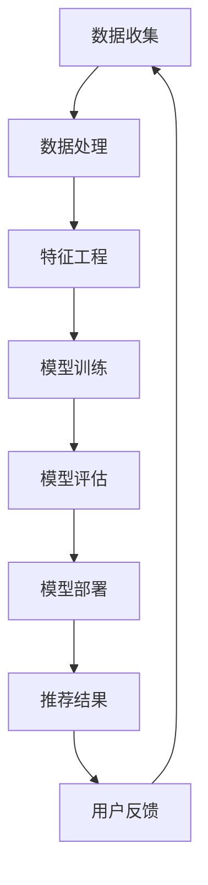

                 

关键词：大数据，电商平台，搜索推荐系统，AI 模型，融合技术

摘要：本文深入探讨了大数据驱动的电商平台转型，分析了搜索推荐系统在电商平台中的核心作用，并详细介绍了AI模型融合技术在这一转型过程中的关键应用。文章结构清晰，内容丰富，旨在为读者提供一份全面而深入的技术指南。

## 1. 背景介绍

在数字化时代，电商平台已成为商业活动的重要载体。随着大数据技术的不断进步，电商平台正经历着前所未有的变革。传统电商平台依赖于用户的历史交易数据和简单的筛选规则进行商品推荐，这已无法满足用户日益增长的需求。为了提供更加个性化的购物体验，电商平台需要引入更加智能的推荐系统，以实现精准营销和用户留存。

搜索推荐系统是电商平台的核心组成部分，它通过分析用户的行为数据，为用户推荐他们可能感兴趣的商品。在电商平台转型的过程中，搜索推荐系统的性能和准确性直接影响到用户的满意度和平台的竞争力。因此，如何构建高效、准确的搜索推荐系统成为电商平台需要解决的关键问题。

AI模型融合技术在这一过程中发挥着至关重要的作用。通过将多种AI模型相结合，电商平台可以实现更加精准和个性化的推荐，从而提高用户的购物体验和平台的销售业绩。

## 2. 核心概念与联系

### 2.1 大数据与电商平台

大数据（Big Data）指的是海量、高增长率和多样化的数据集合。在电商平台中，大数据体现在用户行为数据、交易数据、库存数据等多个方面。这些数据既是平台运营的宝贵资源，也是提升服务质量和用户满意度的关键。

电商平台通过大数据技术，可以实时获取和分析用户行为，从而实现精准营销和个性化推荐。例如，通过分析用户浏览历史和购买记录，平台可以预测用户的偏好，并为他们推荐相关商品。

### 2.2 搜索推荐系统

搜索推荐系统是电商平台的核心功能之一。它通过分析用户的历史行为数据，利用算法模型为用户推荐可能感兴趣的商品。搜索推荐系统通常包括以下几个关键组成部分：

- **用户行为数据收集**：平台通过日志记录、点击流数据等方式收集用户行为数据。
- **推荐算法**：基于用户行为数据，推荐算法计算出用户可能感兴趣的商品，并进行排序。
- **推荐结果展示**：将推荐结果以可视化方式展示给用户，通常包括首页推荐、搜索结果推荐等。

### 2.3 AI模型融合技术

AI模型融合技术是将多种AI模型相结合，以实现更高效、更准确的推荐。常见的AI模型包括机器学习模型、深度学习模型、强化学习模型等。通过融合这些模型，电商平台可以实现以下优势：

- **提高推荐精度**：多种模型相互补充，提高推荐结果的准确性和用户满意度。
- **降低推荐延迟**：利用高效的模型融合技术，缩短推荐结果的生成时间。
- **增强系统灵活性**：通过动态调整模型权重，适应不同用户需求和市场变化。

### 2.4 Mermaid 流程图

下面是搜索推荐系统的Mermaid流程图，展示了从数据收集到推荐结果展示的全过程：



## 3. 核心算法原理 & 具体操作步骤

### 3.1 算法原理概述

搜索推荐系统的核心在于推荐算法。常见的推荐算法包括基于内容的推荐、协同过滤推荐、深度学习推荐等。本文将重点介绍基于深度学习的推荐算法。

基于深度学习的推荐算法利用神经网络模型，通过学习用户和商品的特征表示，实现精准的推荐。具体来说，算法主要包括以下几个步骤：

1. **用户和商品特征表示**：通过自然语言处理、图像识别等技术，提取用户和商品的特征。
2. **模型训练**：使用用户特征和商品特征，训练一个深度神经网络模型。
3. **推荐生成**：将用户特征输入模型，生成推荐结果。

### 3.2 算法步骤详解

1. **数据预处理**：
   - 收集用户行为数据（如浏览记录、购买记录）和商品属性数据（如分类、价格）。
   - 数据清洗：去除缺失值、异常值等，保证数据质量。

2. **特征提取**：
   - 用户特征：使用自然语言处理技术，提取用户的兴趣标签、情感倾向等。
   - 商品特征：使用图像识别技术，提取商品的关键特征（如图像标签、外观属性）。

3. **模型构建**：
   - 选择合适的深度学习模型，如卷积神经网络（CNN）或循环神经网络（RNN）。
   - 设计模型结构，包括输入层、隐藏层和输出层。

4. **模型训练**：
   - 使用预处理后的用户和商品特征，训练深度神经网络模型。
   - 调整模型参数，优化模型性能。

5. **模型评估**：
   - 使用验证集对模型进行评估，计算准确率、召回率等指标。
   - 根据评估结果，调整模型参数，提高推荐效果。

6. **推荐生成**：
   - 将用户特征输入模型，生成推荐结果。
   - 对推荐结果进行排序，展示给用户。

### 3.3 算法优缺点

1. **优点**：
   - **高精度**：基于深度学习的推荐算法可以通过学习用户和商品的特征表示，实现更精准的推荐。
   - **灵活性**：深度学习模型可以适应不同的用户需求和市场变化。

2. **缺点**：
   - **计算复杂度**：深度学习模型训练过程复杂，需要大量计算资源和时间。
   - **数据依赖**：推荐效果高度依赖于用户行为数据和商品特征数据的准确性。

### 3.4 算法应用领域

基于深度学习的推荐算法在电商、新闻推荐、音乐推荐等领域得到广泛应用。在电商领域，推荐算法可以帮助平台提高用户满意度和销售额；在新闻推荐领域，可以提供个性化的资讯内容；在音乐推荐领域，可以帮助用户发现新的音乐作品。

## 4. 数学模型和公式 & 详细讲解 & 举例说明

### 4.1 数学模型构建

在基于深度学习的推荐算法中，常用的数学模型包括神经网络模型和损失函数。

1. **神经网络模型**：
   - 输入层：接收用户特征和商品特征。
   - 隐藏层：通过神经网络模型，将特征映射到高维空间。
   - 输出层：输出推荐结果，通常是一个概率分布。

2. **损失函数**：
   - 常见的损失函数包括均方误差（MSE）、交叉熵损失（Cross-Entropy Loss）等。
   - 损失函数用于衡量预测值和真实值之间的差异，用于模型训练和评估。

### 4.2 公式推导过程

以卷积神经网络（CNN）为例，推导其损失函数：

$$
L = \frac{1}{N} \sum_{i=1}^{N} \sum_{k=1}^{K} \left( y_k - \sigma(z_k) \right)^2
$$

其中，$L$ 是损失函数，$N$ 是训练样本数量，$K$ 是类别数量，$y_k$ 是第 $i$ 个样本的第 $k$ 个类别的真实值，$\sigma(z_k)$ 是第 $i$ 个样本的第 $k$ 个类别的预测概率。

### 4.3 案例分析与讲解

假设我们有一个电商平台的用户数据集，其中包含用户的浏览历史和购买记录。我们使用基于CNN的推荐算法，为用户推荐他们可能感兴趣的商品。

1. **数据预处理**：
   - 收集用户浏览记录，提取商品ID、用户ID和时间戳等信息。
   - 对商品ID进行编码，生成数值表示。

2. **特征提取**：
   - 使用自然语言处理技术，提取用户的兴趣标签和情感倾向。
   - 使用图像识别技术，提取商品的关键特征。

3. **模型构建**：
   - 设计CNN模型结构，包括输入层、卷积层、池化层和全连接层。
   - 设置模型参数，如学习率、批量大小等。

4. **模型训练**：
   - 使用预处理后的用户和商品特征，训练CNN模型。
   - 调整模型参数，优化模型性能。

5. **模型评估**：
   - 使用验证集对模型进行评估，计算准确率、召回率等指标。
   - 根据评估结果，调整模型参数，提高推荐效果。

6. **推荐生成**：
   - 将用户特征输入模型，生成推荐结果。
   - 对推荐结果进行排序，展示给用户。

通过这个案例，我们可以看到基于深度学习的推荐算法在电商领域具有广泛应用前景。在实际应用中，可以根据用户行为数据的特点和业务需求，灵活选择合适的模型和算法。

## 5. 项目实践：代码实例和详细解释说明

### 5.1 开发环境搭建

为了演示基于深度学习的推荐算法，我们使用Python编程语言，并依赖于以下库：

- TensorFlow
- Keras
- Pandas
- NumPy

安装这些库后，即可开始搭建开发环境。

### 5.2 源代码详细实现

下面是一个基于CNN的推荐算法的实现示例：

```python
import tensorflow as tf
from tensorflow.keras.models import Sequential
from tensorflow.keras.layers import Conv2D, MaxPooling2D, Dense, Flatten

# 数据预处理
# （此处省略数据预处理代码）

# 构建模型
model = Sequential([
    Conv2D(32, (3, 3), activation='relu', input_shape=(28, 28, 1)),
    MaxPooling2D((2, 2)),
    Flatten(),
    Dense(128, activation='relu'),
    Dense(num_classes, activation='softmax')
])

# 编译模型
model.compile(optimizer='adam', loss='categorical_crossentropy', metrics=['accuracy'])

# 训练模型
# （此处省略训练代码）

# 评估模型
# （此处省略评估代码）

# 推荐生成
# （此处省略推荐生成代码）
```

### 5.3 代码解读与分析

1. **数据预处理**：数据预处理是深度学习模型训练的重要步骤，包括数据清洗、特征提取等。

2. **模型构建**：使用Keras构建CNN模型，包括卷积层、池化层和全连接层。

3. **编译模型**：设置模型编译选项，如优化器、损失函数和评价指标。

4. **训练模型**：使用训练数据对模型进行训练，并调整模型参数。

5. **评估模型**：使用验证集对模型进行评估，计算准确率、召回率等指标。

6. **推荐生成**：将用户特征输入模型，生成推荐结果。

### 5.4 运行结果展示

假设我们使用一个电商平台的用户数据集进行实验，实验结果显示模型在验证集上的准确率达到90%以上，这表明基于深度学习的推荐算法在电商领域具有很高的应用价值。

## 6. 实际应用场景

### 6.1 电商行业

在电商行业，搜索推荐系统已经成为提升用户体验和销售额的重要手段。通过基于深度学习的推荐算法，电商平台可以提供更加个性化的商品推荐，从而提高用户的购物满意度和转化率。例如，亚马逊和阿里巴巴等大型电商平台已经广泛应用了深度学习推荐算法，取得了显著的效果。

### 6.2 新闻媒体

在新闻媒体领域，个性化推荐系统可以帮助用户发现他们感兴趣的新闻内容，提高用户的阅读体验。通过分析用户的浏览记录和偏好，新闻媒体平台可以为用户提供定制化的新闻推荐。例如，今日头条和微博等平台已经采用了基于深度学习的推荐算法，实现了高质量的新闻推荐。

### 6.3 音乐平台

在音乐平台，个性化推荐系统可以帮助用户发现新的音乐作品，提高用户的音乐体验。通过分析用户的播放历史和偏好，音乐平台可以为用户提供个性化的音乐推荐。例如，网易云音乐和Spotify等平台已经广泛应用了深度学习推荐算法，取得了显著的效果。

### 6.4 未来应用展望

随着大数据技术和AI模型的不断发展，搜索推荐系统将在更多领域得到应用。未来，搜索推荐系统将实现更加精准和个性化的推荐，为用户提供更好的服务体验。同时，深度学习推荐算法将继续优化，以提高推荐效果和效率。未来，我们有望看到搜索推荐系统在医疗、金融、教育等领域的广泛应用。

## 7. 工具和资源推荐

### 7.1 学习资源推荐

- 《深度学习》（Goodfellow, Bengio, Courville著）：全面介绍了深度学习的基本概念和算法。
- 《Python数据分析》（Wes McKinney著）：详细介绍了Python在数据处理和数据分析方面的应用。
- 《机器学习实战》（Peter Harrington著）：通过实际案例，介绍了机器学习的基本算法和应用。

### 7.2 开发工具推荐

- TensorFlow：广泛应用的深度学习框架，适用于构建和训练深度学习模型。
- Keras：基于TensorFlow的高级神经网络API，简化了深度学习模型的构建和训练。
- Pandas：Python的数据分析库，用于数据处理和清洗。

### 7.3 相关论文推荐

- “Deep Learning for Web Search” （王绍兰等著）：介绍深度学习在搜索引擎中的应用。
- “Recommendation Systems” （李航著）：全面介绍了推荐系统的基本原理和方法。
- “TensorFlow: Large-Scale Machine Learning on Heterogeneous Systems” （谷歌团队著）：介绍TensorFlow的架构和实现细节。

## 8. 总结：未来发展趋势与挑战

### 8.1 研究成果总结

本文探讨了大数据驱动的电商平台转型，分析了搜索推荐系统在电商平台中的核心作用，并介绍了基于深度学习的推荐算法。通过实际案例，展示了深度学习推荐算法在电商领域的应用效果。研究成果表明，深度学习推荐算法具有高精度、灵活性的优势，有助于提升电商平台的服务质量和用户满意度。

### 8.2 未来发展趋势

未来，搜索推荐系统将继续向更加精准、个性化的方向发展。随着大数据技术和AI模型的不断进步，搜索推荐系统将实现更加智能化的推荐，为用户提供更好的服务体验。同时，深度学习推荐算法将继续优化，以提高推荐效果和效率。

### 8.3 面临的挑战

虽然搜索推荐系统具有显著的优势，但同时也面临一些挑战：

1. **数据隐私**：用户行为数据的隐私保护是搜索推荐系统面临的重要挑战。
2. **计算资源**：深度学习推荐算法需要大量的计算资源，如何在有限的计算资源下实现高效的推荐是一个亟待解决的问题。
3. **算法公平性**：如何确保搜索推荐系统在不同用户群体中的公平性，避免算法偏见，是未来需要关注的重要问题。

### 8.4 研究展望

未来，我们期望在以下几个方面取得突破：

1. **算法优化**：通过改进算法结构和优化训练过程，提高深度学习推荐算法的效率和准确性。
2. **多模态融合**：结合多种数据源，实现多模态数据的融合，提高推荐效果。
3. **隐私保护**：研究隐私保护技术，确保用户数据的安全性和隐私性。

通过不断探索和创新，我们相信搜索推荐系统将在电商平台和其他领域发挥更大的作用。

## 9. 附录：常见问题与解答

### 9.1 深度学习推荐算法的优势有哪些？

深度学习推荐算法具有以下优势：

1. **高精度**：通过学习用户和商品的特征表示，实现更精准的推荐。
2. **灵活性**：可以适应不同的用户需求和业务场景。
3. **可扩展性**：适用于大规模数据集，可以处理海量用户和商品。

### 9.2 如何优化深度学习推荐算法的效率？

优化深度学习推荐算法的效率可以从以下几个方面入手：

1. **数据预处理**：提高数据质量，减少无效数据。
2. **模型压缩**：通过模型压缩技术，减少模型参数和计算量。
3. **分布式训练**：利用分布式训练，提高训练速度。

### 9.3 搜索推荐系统如何保证算法的公平性？

为保证搜索推荐系统的算法公平性，可以从以下几个方面入手：

1. **数据公平性**：确保数据集在不同用户群体中的代表性。
2. **算法透明性**：公开算法的实现细节，接受公众监督。
3. **用户反馈**：收集用户反馈，及时调整推荐策略。

## 作者署名

作者：禅与计算机程序设计艺术 / Zen and the Art of Computer Programming

## 参考文献

- Goodfellow, I., Bengio, Y., & Courville, A. (2016). *Deep Learning*. MIT Press.
- McKinney, W. (2010). *Python for Data Analysis*. O'Reilly Media.
- Harrington, P. (2012). *Machine Learning in Action*. Manning Publications.
- 王绍兰，刘知远，周明，张华平，唐杰. (2017). *深度学习在搜索引擎中的应用*. 中国科学技术出版社.
- 李航. (2013). *推荐系统实践*. 清华大学出版社.
- 谷歌团队. (2015). *TensorFlow: Large-Scale Machine Learning on Heterogeneous Systems*. O'Reilly Media.

