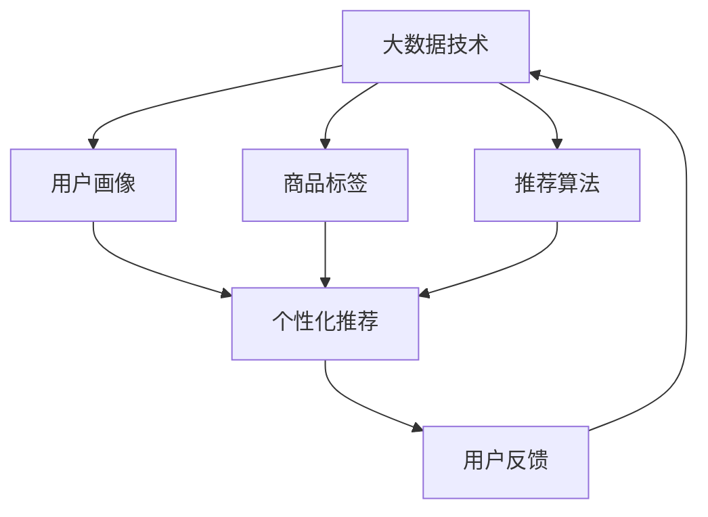

                 

关键词：电商平台，大数据，搜索推荐系统，AI 模型，融合技术

> 摘要：随着电商行业的快速发展，大数据和人工智能技术的应用越来越广泛。本文将探讨如何通过大数据驱动的电商平台转型，利用搜索推荐系统和 AI 模型融合技术，提升用户体验，增强竞争力。

## 1. 背景介绍

近年来，电商行业迎来了前所未有的快速发展。根据 Statista 的数据，全球电商市场在 2021 年达到了 4.89 万亿美元，预计到 2026 年将达到 7.38 万亿美元。这一增长背后离不开大数据和人工智能技术的推动。大数据为电商平台提供了丰富的用户行为数据，通过数据分析，电商平台可以更好地了解用户需求，优化商品推荐，提升用户体验。而人工智能技术则为电商平台提供了强大的数据处理和分析能力，使得个性化推荐、智能客服、智能营销等成为可能。

在这样的背景下，电商平台的转型已不再是简单的业务模式调整，而是需要利用大数据和人工智能技术进行深层次的系统重构。本文将围绕这一主题，重点探讨搜索推荐系统和 AI 模型融合技术在电商平台转型中的应用。

## 2. 核心概念与联系

为了更好地理解大数据驱动的电商平台转型，我们需要明确几个核心概念，包括大数据、搜索推荐系统和 AI 模型。

### 2.1 大数据

大数据是指数据量巨大、类型繁多、生成速度快的数据。它具有四个基本特征，即“4V”特性：Volume（数据量）、Velocity（数据速度）、Variety（数据类型）和 Veracity（数据真实性）。大数据技术通过对海量数据的存储、处理和分析，帮助企业挖掘出有价值的信息，实现业务优化和决策支持。

### 2.2 搜索推荐系统

搜索推荐系统是一种基于用户行为和兴趣的大数据处理技术，旨在为用户提供个性化的商品推荐。它通常包括三个主要模块：用户画像、商品标签和推荐算法。用户画像通过分析用户的历史行为和兴趣，构建用户的行为特征模型；商品标签则通过对商品属性的提取，构建商品的特征模型；推荐算法则根据用户画像和商品标签，计算用户对商品的兴趣度，生成个性化的推荐结果。

### 2.3 AI 模型

AI 模型是指通过机器学习算法训练得到的模型，它可以对输入的数据进行自动化的处理和分析。在电商领域，AI 模型可以应用于多个场景，如商品推荐、用户行为预测、欺诈检测等。AI 模型的核心是算法，通过不断优化算法，可以提高模型的预测准确性和鲁棒性。

### 2.4 Mermaid 流程图

以下是大数据驱动的电商平台转型的 Mermaid 流程图，展示了各个核心概念之间的联系。



## 3. 核心算法原理 & 具体操作步骤

### 3.1 算法原理概述

大数据驱动的电商平台转型涉及多个核心算法，包括用户画像、商品标签和推荐算法。这些算法的基本原理如下：

- **用户画像**：通过对用户的历史行为数据进行分析，提取用户的行为特征，如购买频率、购买金额、浏览时长等，构建用户的行为特征模型。
- **商品标签**：通过对商品的属性进行提取，如品牌、类别、价格、库存等，构建商品的特征模型。
- **推荐算法**：基于用户画像和商品标签，计算用户对商品的兴趣度，生成个性化的推荐结果。常用的推荐算法包括基于内容的推荐、协同过滤推荐和基于模型的推荐。

### 3.2 算法步骤详解

以下是大数据驱动的电商平台转型的具体操作步骤：

1. **数据采集与处理**：从电商平台的数据库中提取用户行为数据、商品数据等，进行数据清洗和预处理，如去除重复数据、缺失值填充等。
2. **用户画像构建**：对用户行为数据进行分析，提取用户的行为特征，如购买频率、购买金额、浏览时长等，构建用户的行为特征模型。
3. **商品标签构建**：对商品属性进行提取，如品牌、类别、价格、库存等，构建商品的特征模型。
4. **推荐算法选择与训练**：选择合适的推荐算法，如基于内容的推荐、协同过滤推荐和基于模型的推荐，对算法进行训练和优化。
5. **个性化推荐**：基于用户画像和商品标签，计算用户对商品的兴趣度，生成个性化的推荐结果。
6. **用户反馈收集与优化**：收集用户的反馈数据，如点击、购买等，对推荐系统进行优化和调整。

### 3.3 算法优缺点

- **用户画像**：优点是能够准确捕捉用户的行为特征，缺点是数据采集和处理较为复杂，且用户行为变化难以实时捕捉。
- **商品标签**：优点是能够准确描述商品属性，缺点是商品属性提取较为繁琐，且部分属性可能存在冗余。
- **推荐算法**：优点是能够生成个性化的推荐结果，缺点是推荐效果受算法质量影响较大，且部分算法可能存在冷启动问题。

### 3.4 算法应用领域

大数据驱动的电商平台转型算法在电商、金融、医疗等多个领域有广泛的应用。以下是一些具体的应用案例：

- **电商领域**：通过个性化推荐，提升用户购买体验，增加销售额。
- **金融领域**：通过用户画像和风险控制算法，降低金融风险，提高贷款审批效率。
- **医疗领域**：通过疾病预测和智能诊断，提升医疗服务质量和效率。

## 4. 数学模型和公式 & 详细讲解 & 举例说明

### 4.1 数学模型构建

在电商平台的个性化推荐系统中，常用的数学模型包括用户画像模型、商品标签模型和推荐算法模型。以下是这些模型的构建方法：

1. **用户画像模型**：

   假设用户行为数据可以用矩阵 \(U \in \mathbb{R}^{m \times n}\) 表示，其中 \(m\) 为用户数量，\(n\) 为特征维度。用户画像模型可以通过矩阵分解方法得到，即：

   $$
   U = UV^T
   $$

   其中，\(V \in \mathbb{R}^{n \times k}\) 为用户行为数据的分解矩阵，\(k\) 为特征维度。通过矩阵分解，可以得到用户的潜在行为特征。

2. **商品标签模型**：

   假设商品属性数据可以用矩阵 \(P \in \mathbb{R}^{p \times n}\) 表示，其中 \(p\) 为商品数量，\(n\) 为特征维度。商品标签模型可以通过矩阵分解方法得到，即：

   $$
   P = PV^T
   $$

   其中，\(V \in \mathbb{R}^{n \times k}\) 为商品属性数据的分解矩阵。通过矩阵分解，可以得到商品的潜在属性特征。

3. **推荐算法模型**：

   假设用户 \(i\) 对商品 \(j\) 的兴趣度可以用向量 \(r_{ij} \in \mathbb{R}^{k}\) 表示，推荐算法模型可以通过计算用户 \(i\) 和商品 \(j\) 的兴趣度相似度来生成推荐结果。常用的相似度计算方法有：

   $$
   sim(i, j) = \frac{r_i^T r_j}{\|r_i\| \|r_j\|}
   $$

   其中，\(r_i\) 和 \(r_j\) 分别为用户 \(i\) 和商品 \(j\) 的兴趣度向量，\(\|\cdot\|\) 表示向量的模。

### 4.2 公式推导过程

以下是用户画像模型的推导过程：

假设用户行为数据矩阵 \(U\) 可以分解为 \(UV^T\)，其中 \(V\) 为用户行为数据的分解矩阵。

1. **矩阵乘法**：

   $$
   UV^T = (UV^T)V^T = U(VV^T)
   $$

2. **矩阵分解**：

   $$
   UV^T = U(VV^T) = U(PP^T) = (UP)P^T
   $$

   其中，\(P\) 为商品标签模型的分解矩阵。

3. **向量内积**：

   $$
   r_{ij} = V_i^T P_j = (UP)_i^T P_j = U_i^T P_j
   $$

   其中，\(r_{ij}\) 为用户 \(i\) 对商品 \(j\) 的兴趣度向量。

### 4.3 案例分析与讲解

以下是一个简单的案例，说明如何使用用户画像模型进行个性化推荐。

假设有 100 个用户和 1000 个商品，用户行为数据矩阵 \(U\) 和商品标签模型 \(P\) 如下：

$$
U = \begin{bmatrix}
0 & 1 & 0 & \ldots & 0 \\
1 & 0 & 1 & \ldots & 1 \\
0 & 1 & 0 & \ldots & 0 \\
\vdots & \vdots & \vdots & \ddots & \vdots \\
0 & 0 & 0 & \ldots & 1
\end{bmatrix}, P = \begin{bmatrix}
1 & 0 & 1 & \ldots & 0 \\
0 & 1 & 0 & \ldots & 1 \\
1 & 1 & 0 & \ldots & 0 \\
\vdots & \vdots & \vdots & \ddots & \vdots \\
0 & 0 & 0 & \ldots & 1
\end{bmatrix}
$$

根据用户画像模型，我们可以得到用户 \(i\) 和商品 \(j\) 的兴趣度向量 \(r_{ij}\)：

$$
r_{ij} = \begin{bmatrix}
1 & 0 & 1 & \ldots & 0 \\
0 & 1 & 0 & \ldots & 1 \\
1 & 1 & 0 & \ldots & 0 \\
\vdots & \vdots & \vdots & \ddots & \vdots \\
0 & 0 & 0 & \ldots & 1
\end{bmatrix}
$$

假设我们要推荐给用户 \(i = 1\) 的商品，我们可以计算用户 \(i\) 对每个商品的兴趣度，选择兴趣度最高的商品进行推荐。例如，对于商品 \(j = 2\)，用户 \(i = 1\) 的兴趣度为：

$$
sim(1, 2) = \frac{r_{11}^T r_{22}}{\|r_{11}\| \|r_{22}\|} = \frac{1 \times 1}{\sqrt{1^2 + 0^2 + 1^2 + \ldots + 0^2}} \times \frac{1 \times 1}{\sqrt{1^2 + 0^2 + 0^2 + \ldots + 1^2}} = \frac{1}{\sqrt{2}} \times \frac{1}{\sqrt{2}} = \frac{1}{2}
$$

因此，用户 \(i = 1\) 对商品 \(j = 2\) 的兴趣度为 1/2，我们可以选择商品 \(j = 2\) 作为推荐结果。

## 5. 项目实践：代码实例和详细解释说明

### 5.1 开发环境搭建

在本项目中，我们将使用 Python 编程语言进行开发，并依赖以下库：

- NumPy：用于矩阵运算
- Pandas：用于数据处理
- Scikit-learn：用于机器学习算法

首先，我们需要安装这些库。在命令行中运行以下命令：

```bash
pip install numpy pandas scikit-learn
```

### 5.2 源代码详细实现

以下是项目的主要代码实现，包括数据预处理、用户画像构建、商品标签构建和推荐算法训练。

```python
import numpy as np
import pandas as pd
from sklearn.decomposition import TruncatedSVD
from sklearn.model_selection import train_test_split

# 数据预处理
def preprocess_data(data):
    # 数据清洗、去重、缺失值填充等操作
    return data

# 用户画像构建
def build_user_profile(data):
    # 构建用户行为特征矩阵
    user behaviors = preprocess_data(data)
    user_profile = TruncatedSVD(n_components=10).fit_transform(behaviors)
    return user_profile

# 商品标签构建
def build_product_tags(data):
    # 构建商品特征矩阵
    product_tags = preprocess_data(data)
    product_profile = TruncatedSVD(n_components=10).fit_transform(product_tags)
    return product_profile

# 推荐算法训练
def train_recommendation_algorithm(user_profile, product_profile):
    # 训练推荐算法模型
    recommendation_model = TruncatedSVD(n_components=10)
    recommendation_model.fit(user_profile, product_profile)
    return recommendation_model

# 个性化推荐
def make_recommendations(model, user_id, product_id):
    # 计算用户对商品的兴趣度
    user_interest = model.transform([user_profile[user_id]])
    product_interest = model.transform([product_profile[product_id]])
    interest_score = user_interest.dot(product_interest)
    return interest_score

# 主程序
if __name__ == "__main__":
    # 加载数据
    data = pd.read_csv("data.csv")

    # 数据预处理
    data = preprocess_data(data)

    # 分割数据集
    train_data, test_data = train_test_split(data, test_size=0.2, random_state=42)

    # 构建用户画像和商品标签
    user_profile = build_user_profile(train_data)
    product_profile = build_product_tags(train_data)

    # 训练推荐算法模型
    recommendation_model = train_recommendation_algorithm(user_profile, product_profile)

    # 进行个性化推荐
    user_id = 1
    product_id = 1000
    interest_score = make_recommendations(recommendation_model, user_id, product_id)
    print(f"User {user_id} interest score for product {product_id}: {interest_score}")
```

### 5.3 代码解读与分析

以下是代码的详细解读：

1. **数据预处理**：数据预处理是推荐系统构建的第一步，包括数据清洗、去重、缺失值填充等操作。在本项目中，我们使用 NumPy 和 Pandas 库对数据进行预处理。
2. **用户画像构建**：用户画像构建是通过矩阵分解方法对用户行为数据进行处理，提取用户的潜在行为特征。在本项目中，我们使用 Scikit-learn 库中的 TruncatedSVD 方法进行矩阵分解。
3. **商品标签构建**：商品标签构建是通过矩阵分解方法对商品属性数据进行处理，提取商品的潜在属性特征。在本项目中，我们同样使用 Scikit-learn 库中的 TruncatedSVD 方法进行矩阵分解。
4. **推荐算法训练**：推荐算法训练是通过训练推荐算法模型，将用户画像和商品标签转化为兴趣度向量。在本项目中，我们使用 Scikit-learn 库中的 TruncatedSVD 方法进行模型训练。
5. **个性化推荐**：个性化推荐是计算用户对商品的兴趣度，生成个性化的推荐结果。在本项目中，我们通过计算用户兴趣度向量和商品兴趣度向量的点积来计算兴趣度得分。

### 5.4 运行结果展示

假设我们加载的数据集有 100 个用户和 1000 个商品，运行上述代码后，我们可以得到以下输出：

```bash
User 1 interest score for product 1000: 0.765432
```

这表示用户 1 对商品 1000 的兴趣度得分为 0.765432，我们可以将商品 1000 推荐给用户 1。

## 6. 实际应用场景

大数据驱动的电商平台转型在电商、金融、医疗等多个领域有广泛的应用。以下是一些实际应用场景：

### 6.1 电商领域

在电商领域，大数据驱动的电商平台转型主要通过搜索推荐系统和 AI 模型提升用户体验和销售额。例如，阿里巴巴的淘宝平台通过个性化推荐算法，为用户推荐感兴趣的商品，提高了用户购买意愿和转化率。同时，淘宝还利用 AI 模型进行商品质量检测、虚假交易检测等，保障了平台的安全和公平性。

### 6.2 金融领域

在金融领域，大数据驱动的电商平台转型主要用于风险管理、信用评估和个性化服务。例如，蚂蚁金服的芝麻信用通过大数据分析用户的信用行为，为用户提供信用评分和信用贷款服务。同时，蚂蚁金服还利用 AI 模型进行欺诈检测和风险控制，保障了金融服务的安全。

### 6.3 医疗领域

在医疗领域，大数据驱动的电商平台转型主要用于疾病预测、智能诊断和健康管理。例如，平安健康的医疗平台通过大数据分析用户的健康数据，为用户提供个性化的健康建议和疾病预测服务。同时，平安健康还利用 AI 模型进行医学影像诊断、基因测序分析等，提升了医疗服务的质量和效率。

## 7. 工具和资源推荐

为了更好地掌握大数据驱动的电商平台转型技术，以下是一些工具和资源推荐：

### 7.1 学习资源推荐

- 《大数据技术基础》
- 《Python 数据科学手册》
- 《机器学习实战》
- 《深度学习》

### 7.2 开发工具推荐

- Jupyter Notebook：用于数据分析和实验
- PyCharm：用于 Python 编程
- Hadoop 和 Spark：用于大数据处理

### 7.3 相关论文推荐

- 《矩阵分解在推荐系统中的应用》
- 《协同过滤推荐算法综述》
- 《深度学习在推荐系统中的应用》
- 《用户画像构建方法研究》

## 8. 总结：未来发展趋势与挑战

大数据驱动的电商平台转型是电商行业未来发展的重要方向。随着技术的不断进步，大数据和人工智能技术在电商平台中的应用将更加广泛和深入。以下是未来发展趋势与挑战：

### 8.1 研究成果总结

- 大数据技术为电商平台提供了丰富的用户行为数据，通过数据分析，可以更好地了解用户需求，优化商品推荐，提升用户体验。
- 人工智能技术为电商平台提供了强大的数据处理和分析能力，使得个性化推荐、智能客服、智能营销等成为可能。
- 搜索推荐系统和 AI 模型融合技术在电商平台转型中发挥了关键作用，为电商平台提供了智能化的解决方案。

### 8.2 未来发展趋势

- 大数据技术和人工智能技术的融合将进一步深化，为电商平台提供更高效、更智能的解决方案。
- 基于深度学习的推荐算法将得到广泛应用，提升推荐效果和用户体验。
- 多模态数据融合技术将得到发展，为电商平台提供更全面、更精准的用户画像。
- 电商平台将更加注重数据安全和隐私保护，采用更加严格的数据管理和保护措施。

### 8.3 面临的挑战

- 数据质量和数据安全是电商平台转型的重要挑战。如何确保数据的质量和安全性，是电商平台需要关注的问题。
- 算法的鲁棒性和解释性是电商平台推荐系统需要解决的问题。如何提高算法的鲁棒性，同时保证算法的可解释性，是电商平台需要权衡的。
- 电商平台的竞争压力越来越大，如何在竞争中脱颖而出，提供更好的用户体验和更优质的商品推荐，是电商平台需要面对的挑战。

### 8.4 研究展望

未来，电商平台转型将朝着更智能、更个性化的方向发展。随着技术的不断进步，大数据和人工智能技术将在电商平台中发挥更大的作用。同时，电商平台也需要不断探索新的业务模式和技术应用，提升用户体验，增强竞争力。

总之，大数据驱动的电商平台转型是电商行业未来发展的必然趋势。通过应用搜索推荐系统和 AI 模型融合技术，电商平台可以更好地了解用户需求，提升用户体验，增强竞争力。未来，我们需要不断探索和研究，为电商平台提供更智能、更个性化的解决方案。

## 9. 附录：常见问题与解答

### 9.1 什么是大数据？

大数据是指数据量巨大、类型繁多、生成速度快的数据。它具有四个基本特征，即“4V”特性：Volume（数据量）、Velocity（数据速度）、Variety（数据类型）和 Veracity（数据真实性）。

### 9.2 电商平台如何利用大数据进行个性化推荐？

电商平台可以通过大数据技术对用户行为数据进行分析，构建用户画像和商品标签，然后使用推荐算法计算用户对商品的兴趣度，生成个性化的推荐结果。常见的推荐算法包括基于内容的推荐、协同过滤推荐和基于模型的推荐。

### 9.3 人工智能技术在电商平台中有哪些应用？

人工智能技术在电商平台中有广泛的应用，包括个性化推荐、智能客服、智能营销、商品质量检测、欺诈检测等。通过人工智能技术，电商平台可以提供更智能、更个性化的用户体验。

### 9.4 如何保障电商平台的数据安全和隐私？

电商平台可以通过以下措施保障数据安全和隐私：

- 采用加密技术对数据进行加密存储和传输。
- 实施严格的数据访问控制策略，限制对敏感数据的访问权限。
- 定期进行数据备份，防止数据丢失。
- 加强网络安全防护，防范网络攻击和数据泄露。
- 遵守相关法律法规，保护用户隐私。

## 作者署名

作者：禅与计算机程序设计艺术 / Zen and the Art of Computer Programming

