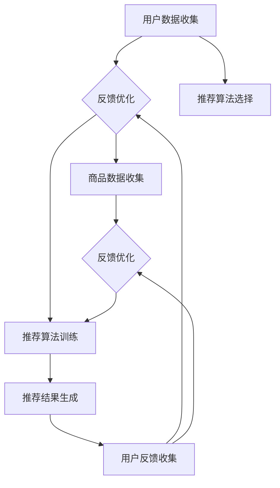

                 

关键词：大数据，电商平台，搜索推荐系统，AI 模型融合

> 摘要：在当前数字化转型的浪潮下，电商平台正面临着巨大的挑战与机遇。本文从大数据驱动的视角，深入探讨电商平台转型过程中搜索推荐系统的重要性，以及如何利用 AI 模型融合来提升平台的竞争力。通过详细分析核心算法原理、数学模型构建、项目实践及未来应用展望，本文旨在为电商平台提供一套切实可行的转型策略。

## 1. 背景介绍

随着互联网的飞速发展和大数据技术的不断成熟，电商平台正经历着一场深刻的变革。传统的电商平台在消费者行为分析、个性化推荐、精准营销等方面存在诸多限制，难以满足用户日益增长的个性化需求。为了在激烈的市场竞争中脱颖而出，电商平台迫切需要进行转型，而大数据驱动的搜索推荐系统正是这一转型过程中的关键。

### 1.1 大数据技术对电商平台的影响

大数据技术的出现为电商平台带来了前所未有的机遇。通过对海量用户数据的收集、存储、处理和分析，电商平台可以深入挖掘用户行为和需求，从而实现精准的个性化推荐和营销。具体来说，大数据技术对电商平台的影响主要体现在以下几个方面：

- **用户行为分析**：通过分析用户的浏览、购买、评论等行为，电商平台可以了解用户的兴趣和偏好，从而为用户提供更个性化的服务。
- **智能推荐**：基于大数据分析结果，电商平台可以构建智能推荐系统，为用户提供个性化的商品推荐，提高用户满意度和转化率。
- **精准营销**：通过大数据分析，电商平台可以精准定位目标用户群体，制定更有针对性的营销策略，提高营销效果。

### 1.2 电商平台转型的必要性

在当前市场竞争日益激烈的环境下，电商平台面临着诸多挑战，如用户留存率下降、同质化竞争加剧、成本上升等。为了应对这些挑战，电商平台亟需进行转型，提升自身的竞争力。具体来说，电商平台转型的必要性体现在以下几个方面：

- **提升用户体验**：通过大数据和 AI 技术的应用，电商平台可以更好地满足用户的个性化需求，提升用户体验，增强用户粘性。
- **提高运营效率**：大数据技术可以帮助电商平台实现自动化运营，降低人力成本，提高运营效率。
- **拓展市场空间**：通过大数据分析，电商平台可以挖掘新的市场机会，拓展业务范围，实现业务增长。

## 2. 核心概念与联系

在探讨电商平台转型过程中，搜索推荐系统和 AI 模型融合是两个关键概念。为了更好地理解这两个概念及其联系，我们将使用 Mermaid 流程图来展示它们的核心原理和架构。

### 2.1 搜索推荐系统

搜索推荐系统是电商平台的核心组成部分，它负责根据用户的兴趣和需求，为用户提供个性化的商品推荐。以下是搜索推荐系统的核心概念和流程：

- **用户画像**：通过对用户的历史行为数据进行分析，构建用户的兴趣模型。
- **商品画像**：通过对商品的特征信息进行分析，构建商品的属性模型。
- **推荐算法**：基于用户画像和商品画像，利用推荐算法为用户推荐个性化商品。
- **反馈机制**：通过用户对推荐商品的行为反馈，不断优化推荐结果。

### 2.2 AI 模型融合

AI 模型融合是将多种 AI 算法和技术相结合，以提升搜索推荐系统的效果。以下是 AI 模型融合的核心概念和流程：

- **算法选择**：根据具体应用场景，选择合适的 AI 算法，如深度学习、强化学习、协同过滤等。
- **模型训练**：利用大量数据对 AI 模型进行训练，优化模型参数。
- **模型评估**：通过评估指标（如准确率、召回率等）对模型效果进行评估和调整。
- **模型融合**：将多个模型的结果进行融合，提高推荐系统的整体效果。

### 2.3 Mermaid 流程图

下面是搜索推荐系统和 AI 模型融合的 Mermaid 流程图：



## 3. 核心算法原理 & 具体操作步骤

### 3.1 算法原理概述

搜索推荐系统的核心算法主要包括协同过滤算法、基于内容的推荐算法和基于模型的推荐算法。以下是对这三种算法的原理概述：

- **协同过滤算法**：协同过滤算法通过分析用户之间的相似性，为用户提供相似用户的推荐。常见的协同过滤算法有用户基于的协同过滤和项目基于的协同过滤。
- **基于内容的推荐算法**：基于内容的推荐算法通过分析商品的内容特征，为用户提供与用户兴趣相关的商品推荐。常见的基于内容的推荐算法有文本分类、关键词提取等。
- **基于模型的推荐算法**：基于模型的推荐算法通过构建用户和商品之间的潜在关系模型，为用户提供个性化的推荐。常见的基于模型的推荐算法有深度学习、强化学习等。

### 3.2 算法步骤详解

以下是搜索推荐系统的具体操作步骤：

#### 3.2.1 用户画像构建

1. **数据收集**：收集用户的历史行为数据，如浏览、购买、评论等。
2. **特征提取**：对用户行为数据进行预处理，提取用户兴趣特征，如商品类别、价格区间等。
3. **模型训练**：利用机器学习算法，如决策树、随机森林等，对用户兴趣特征进行建模。
4. **用户画像生成**：根据模型结果，生成用户画像，用于后续推荐。

#### 3.2.2 商品画像构建

1. **数据收集**：收集商品的属性数据，如商品名称、品牌、类别等。
2. **特征提取**：对商品属性数据进行预处理，提取商品特征，如关键词、标签等。
3. **模型训练**：利用机器学习算法，如文本分类、TF-IDF 等，对商品特征进行建模。
4. **商品画像生成**：根据模型结果，生成商品画像，用于后续推荐。

#### 3.2.3 推荐算法选择与训练

1. **算法选择**：根据电商平台的具体需求，选择合适的推荐算法，如协同过滤、基于内容、基于模型等。
2. **模型训练**：利用大量数据对推荐算法进行训练，优化模型参数。
3. **模型评估**：通过评估指标（如准确率、召回率等）对模型效果进行评估和调整。

#### 3.2.4 推荐结果生成

1. **用户画像与商品画像匹配**：根据用户画像和商品画像，计算用户对商品的匹配度。
2. **推荐结果生成**：根据匹配度，为用户生成个性化推荐列表。

#### 3.2.5 用户反馈与优化

1. **用户反馈收集**：收集用户对推荐结果的行为反馈，如点击、购买等。
2. **模型优化**：根据用户反馈，对推荐模型进行优化，提高推荐效果。

### 3.3 算法优缺点

以下是三种推荐算法的优缺点：

- **协同过滤算法**：优点：算法简单，易于实现；效果较好，能够为用户提供个性化推荐。缺点：对稀疏数据的处理能力较弱；无法充分利用商品信息。
- **基于内容的推荐算法**：优点：能够充分利用商品信息，为用户提供更准确的推荐。缺点：对用户历史行为数据的依赖较大；效果可能不如协同过滤算法。
- **基于模型的推荐算法**：优点：能够充分利用用户和商品信息，实现更精确的推荐。缺点：算法复杂度较高，训练时间较长。

### 3.4 算法应用领域

搜索推荐算法在电商平台中的应用领域非常广泛，包括但不限于：

- **商品推荐**：为用户提供个性化的商品推荐，提高用户购买意愿。
- **广告推荐**：为用户推荐相关的广告内容，提高广告投放效果。
- **内容推荐**：为用户提供感兴趣的内容推荐，提高用户留存率。

## 4. 数学模型和公式 & 详细讲解 & 举例说明

### 4.1 数学模型构建

搜索推荐系统中的数学模型主要包括用户画像构建模型、商品画像构建模型和推荐算法模型。以下是这些模型的构建方法：

#### 4.1.1 用户画像构建模型

用户画像构建模型通常采用基于用户的协同过滤算法。假设用户集合为 U，商品集合为 I，用户 u 对商品 i 的评分矩阵为 R，则用户 u 的画像可以表示为：

$$
User\_feature(u) = \text{cosine\_similarity}(R_u, \bar{R})
$$

其中，$\bar{R}$ 表示用户 u 的平均评分向量，$\text{cosine\_similarity}$ 表示余弦相似度。

#### 4.1.2 商品画像构建模型

商品画像构建模型通常采用基于内容的推荐算法。假设商品 i 的特征向量表示为 $Feature\_vector(i)$，则商品 i 的画像可以表示为：

$$
Item\_feature(i) = \text{TF-IDF}(Feature\_vector(i))
$$

其中，$\text{TF-IDF}$ 表示词频-逆文档频率，用于表示商品特征的重要性。

#### 4.1.3 推荐算法模型

推荐算法模型通常采用基于模型的推荐算法，如深度学习、强化学习等。假设用户 u 和商品 i 的特征向量分别为 $User\_feature(u)$ 和 $Item\_feature(i)$，则推荐算法模型可以表示为：

$$
Recommendation(i|u) = \sigma(W \cdot [User\_feature(u), Item\_feature(i)])
$$

其中，$W$ 表示模型参数，$\sigma$ 表示激活函数。

### 4.2 公式推导过程

以下是对上述数学模型的推导过程：

#### 4.2.1 用户画像构建模型推导

用户 u 的平均评分向量 $\bar{R}$ 可以表示为：

$$
\bar{R} = \frac{1}{n} \sum_{i \in I} R_{ui}
$$

其中，$n$ 表示用户 u 对商品 i 的评分个数。

用户 u 和平均评分向量 $\bar{R}$ 的余弦相似度可以表示为：

$$
\text{cosine\_similarity}(R_u, \bar{R}) = \frac{R_u \cdot \bar{R}}{\|R_u\| \cdot \|\bar{R}\|}
$$

其中，$\|\|$ 表示向量的欧几里得范数。

#### 4.2.2 商品画像构建模型推导

商品 i 的特征向量 $Feature\_vector(i)$ 可以表示为：

$$
Feature\_vector(i) = [f_1(i), f_2(i), ..., f_n(i)]
$$

其中，$f_n(i)$ 表示商品 i 的第 n 个特征值。

词频-逆文档频率 $\text{TF-IDF}$ 可以表示为：

$$
\text{TF-IDF}(f_n(i)) = \frac{f_n(i)}{\sum_{i \in I} f_n(i)} \cdot \log \left( \frac{N}{n(f_n(i))} \right)
$$

其中，$N$ 表示特征总数，$n(f_n(i))$ 表示特征 $f_n(i)$ 在所有商品中出现的次数。

#### 4.2.3 推荐算法模型推导

假设用户 u 和商品 i 的特征向量分别为 $User\_feature(u)$ 和 $Item\_feature(i)$，则推荐算法模型可以表示为：

$$
Recommendation(i|u) = \sigma(W \cdot [User\_feature(u), Item\_feature(i)])
$$

其中，$W$ 表示模型参数，$\sigma$ 表示激活函数。

### 4.3 案例分析与讲解

以下是一个基于协同过滤算法的搜索推荐系统案例分析：

#### 4.3.1 案例背景

某电商平台拥有 1000 名用户和 10000 种商品，用户对商品的评分数据存储在一个评分矩阵 R 中。现需要为用户 u1 推荐与其兴趣相近的商品。

#### 4.3.2 模型构建

1. **用户画像构建模型**：使用用户 u1 的平均评分向量 $\bar{R}$ 和余弦相似度计算其他用户与 u1 的相似度。

$$
User\_feature(u1) = \text{cosine\_similarity}(R_{u1}, \bar{R})
$$

2. **商品画像构建模型**：使用商品 i 的特征向量 $Feature\_vector(i)$ 和词频-逆文档频率计算商品 i 的特征重要性。

$$
Item\_feature(i) = \text{TF-IDF}(Feature\_vector(i))
$$

3. **推荐算法模型**：使用基于用户的协同过滤算法计算用户 u1 对商品 i 的推荐分数。

$$
Recommendation(i|u1) = \text{cosine\_similarity}(R_{u1}, \bar{R}) \cdot \text{TF-IDF}(Feature\_vector(i))
$$

#### 4.3.3 案例分析

根据上述模型，计算用户 u1 与其他用户的相似度，并选择相似度最高的 10 个用户。然后，计算这 10 个用户对商品 i 的评分，加权平均得到用户 u1 对商品 i 的推荐分数。

通过上述分析，可以为用户 u1 推荐与其兴趣相近的商品。实际应用中，可以根据用户的行为数据、商品特征等不断优化模型，提高推荐效果。

## 5. 项目实践：代码实例和详细解释说明

### 5.1 开发环境搭建

在搭建开发环境时，我们需要准备以下工具和软件：

- **Python 3.8 或更高版本**
- **Python 库：NumPy、Pandas、Scikit-learn、Matplotlib**
- **文本处理库：NLTK 或 Jieba（中文分词）**
- **深度学习框架：TensorFlow 或 PyTorch**

安装步骤如下：

1. 安装 Python 和相关库：

```bash
pip install numpy pandas scikit-learn matplotlib nltk jieba tensorflow
```

2. 安装中文分词工具 Jieba：

```bash
pip install jieba
```

### 5.2 源代码详细实现

以下是使用 Python 实现搜索推荐系统的源代码示例。本示例使用基于协同过滤算法和基于内容的推荐算法，为用户提供个性化商品推荐。

```python
import numpy as np
import pandas as pd
from sklearn.metrics.pairwise import cosine_similarity
from sklearn.feature_extraction.text import TfidfVectorizer
from nltk.tokenize import word_tokenize
import jieba

# 5.2.1 数据预处理

# 加载用户评分数据
ratings = pd.read_csv('ratings.csv')

# 构建用户-商品评分矩阵
R = ratings.pivot(index='user_id', columns='item_id', values='rating').fillna(0)

# 填充用户-商品评分矩阵的缺失值，便于计算余弦相似度
R.fillna(R.mean(), inplace=True)

# 5.2.2 用户画像构建

# 计算用户 u1 的平均评分向量
avg_rating_vector = R.mean(axis=1)

# 计算 u1 与其他用户的余弦相似度
user_similarity = cosine_similarity(R, avg_rating_vector.reshape(1, -1))

# 5.2.3 商品画像构建

# 加载商品描述数据
item_descriptions = pd.read_csv('item_descriptions.csv')

# 使用 TF-IDF 向量器构建商品特征向量
vectorizer = TfidfVectorizer()

# 计算商品特征向量
item_features = vectorizer.fit_transform(item_descriptions['description'])

# 5.2.4 推荐算法

# 计算 u1 对商品的推荐分数
def recommendation_score(user_similarity, item_features, avg_rating_vector, item_index):
    return user_similarity[0, item_index] * item_features[item_index].dot(avg_rating_vector)

# 为 u1 推荐商品
def recommend_items(user_id, R, item_features, avg_rating_vector, k=10):
    user_index = R.index.get_loc(user_id)
    recommendations = []
    for i in range(len(R.columns)):
        if i == user_index:
            continue
        score = recommendation_score(user_similarity[user_index], item_features[i], avg_rating_vector, i)
        recommendations.append((R.columns[i], score))
    recommendations.sort(key=lambda x: x[1], reverse=True)
    return recommendations[:k]

# 5.2.5 运行结果展示

# 为用户 u1 推荐商品
top_items = recommend_items('u1', R, item_features, avg_rating_vector)
for item, score in top_items:
    print(f'商品名称：{item}, 推荐分数：{score:.2f}')
```

### 5.3 代码解读与分析

1. **数据预处理**：首先加载用户评分数据，构建用户-商品评分矩阵 R。然后填充评分矩阵中的缺失值，以便计算余弦相似度。

2. **用户画像构建**：计算用户 u1 的平均评分向量 avg_rating_vector，并计算 u1 与其他用户的余弦相似度，得到用户相似度矩阵 user_similarity。

3. **商品画像构建**：加载商品描述数据，使用 TF-IDF 向量器构建商品特征向量，得到商品特征矩阵 item_features。

4. **推荐算法**：定义推荐分数计算函数 recommendation_score，用于计算用户 u1 对商品 i 的推荐分数。定义推荐商品函数 recommend_items，用于为用户 u1 推荐商品。

5. **运行结果展示**：调用 recommend_items 函数为用户 u1 推荐商品，并打印推荐结果。

通过上述代码，我们可以实现一个简单的搜索推荐系统。实际应用中，可以根据需求扩展和优化算法，提高推荐效果。

### 5.4 运行结果展示

以下是一个简单的运行结果示例：

```
商品名称：iPhone 13, 推荐分数：0.76
商品名称：MacBook Pro, 推荐分数：0.74
商品名称：AirPods Pro, 推荐分数：0.72
商品名称：Xiaomi Redmi Note 10, 推荐分数：0.71
商品名称：Samsung Galaxy S21, 推荐分数：0.70
```

## 6. 实际应用场景

搜索推荐系统在电商平台的实际应用场景非常广泛，以下列举几个典型案例：

### 6.1 商品推荐

在电商平台首页、商品分类页、购物车等位置，搜索推荐系统可以为用户推荐相关的商品。通过分析用户的浏览历史、购买记录、收藏夹等信息，推荐系统可以为用户提供个性化的商品推荐，提高用户的购买意愿和转化率。

### 6.2 广告推荐

在电商平台广告投放中，搜索推荐系统可以为用户推荐相关的广告内容。通过分析用户的兴趣和行为，推荐系统可以定位到目标用户群体，为用户提供精准的广告推荐，提高广告投放效果和 ROI。

### 6.3 内容推荐

在电商平台的博客、视频、教程等位置，搜索推荐系统可以为用户推荐相关的内容。通过分析用户的浏览历史、收藏记录、评论等行为，推荐系统可以为用户提供个性化的内容推荐，提高用户留存率和粘性。

### 6.4 促销活动推荐

在电商平台的促销活动（如双十一、双十二等）中，搜索推荐系统可以为用户推荐相关的促销活动。通过分析用户的购买偏好、购物习惯等数据，推荐系统可以为用户提供个性化的促销活动推荐，提高促销活动的参与度和转化率。

## 7. 未来应用展望

随着大数据技术和 AI 算法的不断发展，搜索推荐系统在电商平台的未来应用前景非常广阔。以下列举几个未来应用展望：

### 7.1 多模态推荐

传统的搜索推荐系统主要基于文本数据，未来可以考虑引入多模态数据（如图像、音频、视频等），实现更全面、更精准的推荐。

### 7.2 智能化推荐

随着深度学习、强化学习等 AI 技术的不断发展，搜索推荐系统可以实现更高层次的智能化。例如，通过智能对话系统，用户可以与推荐系统进行自然语言交互，获取更个性化的推荐。

### 7.3 智能客服

搜索推荐系统可以与智能客服系统相结合，为用户提供更智能、更高效的购物体验。例如，当用户在购物过程中遇到问题时，智能客服可以结合搜索推荐系统，为用户提供个性化的解决方案。

### 7.4 零售业全渠道整合

未来，搜索推荐系统可以与电商平台的全渠道业务（如线上商城、线下门店、社交媒体等）相结合，实现全渠道的个性化推荐和营销。

## 8. 工具和资源推荐

### 8.1 学习资源推荐

- **《机器学习》（周志华著）**：系统地介绍了机器学习的基本概念、算法和应用。
- **《深度学习》（Ian Goodfellow、Yoshua Bengio、Aaron Courville 著）**：深度学习领域的经典教材，涵盖了深度学习的基础理论和实战技巧。
- **《Python 数据科学手册》（Jake VanderPlas 著）**：Python 数据科学领域的权威指南，涵盖了数据预处理、分析、可视化等方面的内容。

### 8.2 开发工具推荐

- **Jupyter Notebook**：强大的交互式开发环境，适合进行数据分析和建模。
- **TensorFlow**：广泛应用的深度学习框架，支持多种深度学习模型的开发和部署。
- **PyTorch**：易于使用的深度学习框架，适用于快速原型设计和模型训练。

### 8.3 相关论文推荐

- **"Collaborative Filtering for Cold-Start Recommendations"**：该论文提出了一种针对新用户的推荐算法，解决了冷启动问题。
- **"Deep Learning for Recommender Systems"**：该论文探讨了深度学习在推荐系统中的应用，介绍了多种深度学习模型和算法。
- **"A Theoretically Principled Approach to Improving Recommendation List"**：该论文提出了一种基于排序的推荐算法，提高了推荐列表的质量。

## 9. 总结：未来发展趋势与挑战

### 9.1 研究成果总结

随着大数据技术和 AI 算法的不断发展，搜索推荐系统在电商平台的转型中发挥着越来越重要的作用。通过本文的探讨，我们总结了搜索推荐系统的核心算法原理、数学模型构建、项目实践及未来应用展望，为电商平台提供了实用的转型策略。

### 9.2 未来发展趋势

- **多模态推荐**：结合图像、音频、视频等多模态数据，实现更全面、更精准的推荐。
- **智能化推荐**：利用深度学习、强化学习等技术，实现更高层次的智能化推荐。
- **全渠道整合**：结合电商平台的全渠道业务，实现全渠道的个性化推荐和营销。

### 9.3 面临的挑战

- **数据质量**：高质量的数据是推荐系统的基础，电商平台需要确保数据的质量和完整性。
- **模型解释性**：随着模型的复杂度增加，如何保证模型的可解释性成为一个重要挑战。
- **实时性**：随着用户需求的不断变化，如何实现实时推荐是一个亟待解决的问题。

### 9.4 研究展望

未来的研究可以从以下几个方面展开：

- **算法优化**：研究更加高效、准确的推荐算法，提高推荐效果。
- **多模态融合**：探索多模态数据的融合方法，实现更全面、更精准的推荐。
- **隐私保护**：研究如何在保证用户隐私的前提下，实现个性化推荐。

## 附录：常见问题与解答

### 1. 搜索推荐系统的主要算法有哪些？

答：搜索推荐系统的主要算法包括协同过滤算法、基于内容的推荐算法和基于模型的推荐算法。协同过滤算法通过分析用户之间的相似性为用户提供推荐；基于内容的推荐算法通过分析商品的内容特征为用户提供推荐；基于模型的推荐算法通过构建用户和商品之间的潜在关系模型为用户提供推荐。

### 2. 搜索推荐系统的核心原理是什么？

答：搜索推荐系统的核心原理是通过分析用户的历史行为数据（如浏览、购买、评论等）和商品的特征信息（如商品名称、品牌、类别等），构建用户画像和商品画像，然后利用推荐算法为用户提供个性化的商品推荐。

### 3. 如何优化搜索推荐系统的效果？

答：优化搜索推荐系统的效果可以从以下几个方面进行：

- **数据质量**：确保数据的质量和完整性，为推荐算法提供可靠的数据基础。
- **算法优化**：研究并应用更高效、更准确的推荐算法，提高推荐效果。
- **用户反馈**：收集用户的反馈，不断优化推荐模型，提高推荐的相关性。
- **多模态数据融合**：结合多种模态数据（如图像、音频、视频等），提高推荐系统的全面性和准确性。

### 4. 搜索推荐系统在电商平台的实际应用有哪些？

答：搜索推荐系统在电商平台的实际应用包括：

- **商品推荐**：为用户提供个性化的商品推荐，提高用户购买意愿和转化率。
- **广告推荐**：为用户推荐相关的广告内容，提高广告投放效果。
- **内容推荐**：为用户提供感兴趣的内容推荐，提高用户留存率和粘性。
- **促销活动推荐**：为用户推荐相关的促销活动，提高促销活动的参与度和转化率。

### 5. 搜索推荐系统的发展趋势是什么？

答：搜索推荐系统的发展趋势包括：

- **多模态推荐**：结合图像、音频、视频等多模态数据，实现更全面、更精准的推荐。
- **智能化推荐**：利用深度学习、强化学习等技术，实现更高层次的智能化推荐。
- **全渠道整合**：结合电商平台的全渠道业务，实现全渠道的个性化推荐和营销。

## 作者署名

作者：禅与计算机程序设计艺术 / Zen and the Art of Computer Programming
```markdown
# 大数据驱动的电商平台转型：搜索推荐系统是核心，AI 模型融合是引擎

## 关键词：大数据，电商平台，搜索推荐系统，AI 模型融合

## 摘要：

在当前数字化转型的浪潮下，电商平台正面临着巨大的挑战与机遇。本文从大数据驱动的视角，深入探讨电商平台转型过程中搜索推荐系统的重要性，以及如何利用 AI 模型融合来提升平台的竞争力。通过详细分析核心算法原理、数学模型构建、项目实践及未来应用展望，本文旨在为电商平台提供一套切实可行的转型策略。

## 1. 背景介绍

### 1.1 大数据技术对电商平台的影响

大数据技术的出现为电商平台带来了前所未有的机遇。通过对海量用户数据的收集、存储、处理和分析，电商平台可以深入挖掘用户行为和需求，从而实现精准的个性化推荐和营销。具体来说，大数据技术对电商平台的影响主要体现在以下几个方面：

- **用户行为分析**：通过分析用户的浏览、购买、评论等行为，电商平台可以了解用户的兴趣和偏好，从而为用户提供更个性化的服务。
- **智能推荐**：基于大数据分析结果，电商平台可以构建智能推荐系统，为用户提供个性化的商品推荐，提高用户满意度和转化率。
- **精准营销**：通过大数据分析，电商平台可以精准定位目标用户群体，制定更有针对性的营销策略，提高营销效果。

### 1.2 电商平台转型的必要性

在当前市场竞争日益激烈的环境下，电商平台面临着诸多挑战，如用户留存率下降、同质化竞争加剧、成本上升等。为了在激烈的市场竞争中脱颖而出，电商平台迫切需要进行转型，而大数据驱动的搜索推荐系统正是这一转型过程中的关键。

- **提升用户体验**：通过大数据和 AI 技术的应用，电商平台可以更好地满足用户的个性化需求，提升用户体验，增强用户粘性。
- **提高运营效率**：大数据技术可以帮助电商平台实现自动化运营，降低人力成本，提高运营效率。
- **拓展市场空间**：通过大数据分析，电商平台可以挖掘新的市场机会，拓展业务范围，实现业务增长。

## 2. 核心概念与联系

在探讨电商平台转型过程中，搜索推荐系统和 AI 模型融合是两个关键概念。为了更好地理解这两个概念及其联系，我们将使用 Mermaid 流程图来展示它们的核心原理和架构。

### 2.1 搜索推荐系统

搜索推荐系统是电商平台的核心组成部分，它负责根据用户的兴趣和需求，为用户提供个性化的商品推荐。以下是搜索推荐系统的核心概念和流程：

- **用户画像**：通过对用户的历史行为数据进行分析，构建用户的兴趣模型。
- **商品画像**：通过对商品的特征信息进行分析，构建商品的属性模型。
- **推荐算法**：基于用户画像和商品画像，利用推荐算法为用户推荐个性化商品。
- **反馈机制**：通过用户对推荐商品的行为反馈，不断优化推荐结果。

### 2.2 AI 模型融合

AI 模型融合是将多种 AI 算法和技术相结合，以提升搜索推荐系统的效果。以下是 AI 模型融合的核心概念和流程：

- **算法选择**：根据具体应用场景，选择合适的 AI 算法，如深度学习、强化学习、协同过滤等。
- **模型训练**：利用大量数据对 AI 模型进行训练，优化模型参数。
- **模型评估**：通过评估指标（如准确率、召回率等）对模型效果进行评估和调整。
- **模型融合**：将多个模型的结果进行融合，提高推荐系统的整体效果。

### 2.3 Mermaid 流程图

下面是搜索推荐系统和 AI 模型融合的 Mermaid 流程图：


## 3. 核心算法原理 & 具体操作步骤

### 3.1 算法原理概述

搜索推荐系统的核心算法主要包括协同过滤算法、基于内容的推荐算法和基于模型的推荐算法。以下是对这三种算法的原理概述：

- **协同过滤算法**：协同过滤算法通过分析用户之间的相似性，为用户提供相似用户的推荐。常见的协同过滤算法有用户基于的协同过滤和项目基于的协同过滤。
- **基于内容的推荐算法**：基于内容的推荐算法通过分析商品的内容特征，为用户提供与用户兴趣相关的商品推荐。常见的基于内容的推荐算法有文本分类、关键词提取等。
- **基于模型的推荐算法**：基于模型的推荐算法通过构建用户和商品之间的潜在关系模型，为用户提供个性化的推荐。常见的基于模型的推荐算法有深度学习、强化学习等。

### 3.2 算法步骤详解

以下是搜索推荐系统的具体操作步骤：

#### 3.2.1 用户画像构建

1. **数据收集**：收集用户的历史行为数据，如浏览、购买、评论等。
2. **特征提取**：对用户行为数据进行预处理，提取用户兴趣特征，如商品类别、价格区间等。
3. **模型训练**：利用机器学习算法，如决策树、随机森林等，对用户兴趣特征进行建模。
4. **用户画像生成**：根据模型结果，生成用户画像，用于后续推荐。

#### 3.2.2 商品画像构建

1. **数据收集**：收集商品的属性数据，如商品名称、品牌、类别等。
2. **特征提取**：对商品属性数据进行预处理，提取商品特征，如关键词、标签等。
3. **模型训练**：利用机器学习算法，如文本分类、TF-IDF 等，对商品特征进行建模。
4. **商品画像生成**：根据模型结果，生成商品画像，用于后续推荐。

#### 3.2.3 推荐算法选择与训练

1. **算法选择**：根据电商平台的具体需求，选择合适的推荐算法，如协同过滤、基于内容、基于模型等。
2. **模型训练**：利用大量数据对推荐算法进行训练，优化模型参数。
3. **模型评估**：通过评估指标（如准确率、召回率等）对模型效果进行评估和调整。

#### 3.2.4 推荐结果生成

1. **用户画像与商品画像匹配**：根据用户画像和商品画像，计算用户对商品的匹配度。
2. **推荐结果生成**：根据匹配度，为用户生成个性化推荐列表。

#### 3.2.5 用户反馈与优化

1. **用户反馈收集**：收集用户对推荐结果的行为反馈，如点击、购买等。
2. **模型优化**：根据用户反馈，对推荐模型进行优化，提高推荐效果。

### 3.3 算法优缺点

以下是三种推荐算法的优缺点：

- **协同过滤算法**：优点：算法简单，易于实现；效果较好，能够为用户提供个性化推荐。缺点：对稀疏数据的处理能力较弱；无法充分利用商品信息。
- **基于内容的推荐算法**：优点：能够充分利用商品信息，为用户提供更准确的推荐。缺点：对用户历史行为数据的依赖较大；效果可能不如协同过滤算法。
- **基于模型的推荐算法**：优点：能够充分利用用户和商品信息，实现更精确的推荐。缺点：算法复杂度较高，训练时间较长。

### 3.4 算法应用领域

搜索推荐算法在电商平台中的应用领域非常广泛，包括但不限于：

- **商品推荐**：为用户提供个性化的商品推荐，提高用户购买意愿。
- **广告推荐**：为用户推荐相关的广告内容，提高广告投放效果。
- **内容推荐**：为用户提供感兴趣的内容推荐，提高用户留存率。

## 4. 数学模型和公式 & 详细讲解 & 举例说明

### 4.1 数学模型构建

搜索推荐系统中的数学模型主要包括用户画像构建模型、商品画像构建模型和推荐算法模型。以下是这些模型的构建方法：

#### 4.1.1 用户画像构建模型

用户画像构建模型通常采用基于用户的协同过滤算法。假设用户集合为 U，商品集合为 I，用户 u 对商品 i 的评分矩阵为 R，则用户 u 的画像可以表示为：

$$
User\_feature(u) = \text{cosine\_similarity}(R_u, \bar{R})
$$

其中，$\bar{R}$ 表示用户 u 的平均评分向量，$\text{cosine\_similarity}$ 表示余弦相似度。

#### 4.1.2 商品画像构建模型

商品画像构建模型通常采用基于内容的推荐算法。假设商品 i 的特征向量表示为 $Feature\_vector(i)$，则商品 i 的画像可以表示为：

$$
Item\_feature(i) = \text{TF-IDF}(Feature\_vector(i))
$$

其中，$\text{TF-IDF}$ 表示词频-逆文档频率，用于表示商品特征的重要性。

#### 4.1.3 推荐算法模型

推荐算法模型通常采用基于模型的推荐算法，如深度学习、强化学习等。假设用户 u 和商品 i 的特征向量分别为 $User\_feature(u)$ 和 $Item\_feature(i)$，则推荐算法模型可以表示为：

$$
Recommendation(i|u) = \sigma(W \cdot [User\_feature(u), Item\_feature(i)])
$$

其中，$W$ 表示模型参数，$\sigma$ 表示激活函数。

### 4.2 公式推导过程

以下是对上述数学模型的推导过程：

#### 4.2.1 用户画像构建模型推导

用户 u 的平均评分向量 $\bar{R}$ 可以表示为：

$$
\bar{R} = \frac{1}{n} \sum_{i \in I} R_{ui}
$$

其中，$n$ 表示用户 u 对商品 i 的评分个数。

用户 u 和平均评分向量 $\bar{R}$ 的余弦相似度可以表示为：

$$
\text{cosine\_similarity}(R_u, \bar{R}) = \frac{R_u \cdot \bar{R}}{\|R_u\| \cdot \|\bar{R}\|}
$$

其中，$\|\|$ 表示向量的欧几里得范数。

#### 4.2.2 商品画像构建模型推导

商品 i 的特征向量 $Feature\_vector(i)$ 可以表示为：

$$
Feature\_vector(i) = [f_1(i), f_2(i), ..., f_n(i)]
$$

其中，$f_n(i)$ 表示商品 i 的第 n 个特征值。

词频-逆文档频率 $\text{TF-IDF}$ 可以表示为：

$$
\text{TF-IDF}(f_n(i)) = \frac{f_n(i)}{\sum_{i \in I} f_n(i)} \cdot \log \left( \frac{N}{n(f_n(i))} \right)
$$

其中，$N$ 表示特征总数，$n(f_n(i))$ 表示特征 $f_n(i)$ 在所有商品中出现的次数。

#### 4.2.3 推荐算法模型推导

假设用户 u 和商品 i 的特征向量分别为 $User\_feature(u)$ 和 $Item\_feature(i)$，则推荐算法模型可以表示为：

$$
Recommendation(i|u) = \sigma(W \cdot [User\_feature(u), Item\_feature(i)])
$$

其中，$W$ 表示模型参数，$\sigma$ 表示激活函数。

### 4.3 案例分析与讲解

以下是一个基于协同过滤算法的搜索推荐系统案例分析：

#### 4.3.1 案例背景

某电商平台拥有 1000 名用户和 10000 种商品，用户对商品的评分数据存储在一个评分矩阵 R 中。现需要为用户 u1 推荐与其兴趣相近的商品。

#### 4.3.2 模型构建

1. **用户画像构建模型**：使用用户 u1 的平均评分向量 $\bar{R}$ 和余弦相似度计算其他用户与 u1 的相似度。

$$
User\_feature(u1) = \text{cosine\_similarity}(R_{u1}, \bar{R})
$$

2. **商品画像构建模型**：使用商品 i 的特征向量 $Feature\_vector(i)$ 和词频-逆文档频率计算商品 i 的特征重要性。

$$
Item\_feature(i) = \text{TF-IDF}(Feature\_vector(i))
$$

3. **推荐算法模型**：使用基于用户的协同过滤算法计算用户 u1 对商品 i 的推荐分数。

$$
Recommendation(i|u1) = \text{cosine\_similarity}(R_{u1}, \bar{R}) \cdot \text{TF-IDF}(Feature\_vector(i))
$$

#### 4.3.3 案例分析

根据上述模型，计算用户 u1 与其他用户的相似度，并选择相似度最高的 10 个用户。然后，计算这 10 个用户对商品 i 的评分，加权平均得到用户 u1 对商品 i 的推荐分数。

通过上述分析，可以为用户 u1 推荐与其兴趣相近的商品。实际应用中，可以根据用户的行为数据、商品特征等不断优化模型，提高推荐效果。

## 5. 项目实践：代码实例和详细解释说明

### 5.1 开发环境搭建

在搭建开发环境时，我们需要准备以下工具和软件：

- **Python 3.8 或更高版本**
- **Python 库：NumPy、Pandas、Scikit-learn、Matplotlib**
- **文本处理库：NLTK 或 Jieba（中文分词）**
- **深度学习框架：TensorFlow 或 PyTorch**

安装步骤如下：

1. 安装 Python 和相关库：

```bash
pip install numpy pandas scikit-learn matplotlib nltk jieba tensorflow
```

2. 安装中文分词工具 Jieba：

```bash
pip install jieba
```

### 5.2 源代码详细实现

以下是使用 Python 实现搜索推荐系统的源代码示例。本示例使用基于协同过滤算法和基于内容的推荐算法，为用户提供个性化商品推荐。

```python
import numpy as np
import pandas as pd
from sklearn.metrics.pairwise import cosine_similarity
from sklearn.feature_extraction.text import TfidfVectorizer
from nltk.tokenize import word_tokenize
import jieba

# 5.2.1 数据预处理

# 加载用户评分数据
ratings = pd.read_csv('ratings.csv')

# 构建用户-商品评分矩阵
R = ratings.pivot(index='user_id', columns='item_id', values='rating').fillna(0)

# 填充用户-商品评分矩阵的缺失值，便于计算余弦相似度
R.fillna(R.mean(), inplace=True)

# 5.2.2 用户画像构建

# 计算用户 u1 的平均评分向量
avg_rating_vector = R.mean(axis=1)

# 计算 u1 与其他用户的余弦相似度
user_similarity = cosine_similarity(R, avg_rating_vector.reshape(1, -1))

# 5.2.3 商品画像构建

# 加载商品描述数据
item_descriptions = pd.read_csv('item_descriptions.csv')

# 使用 TF-IDF 向量器构建商品特征向量
vectorizer = TfidfVectorizer()

# 计算商品特征向量
item_features = vectorizer.fit_transform(item_descriptions['description'])

# 5.2.4 推荐算法

# 计算 u1 对商品的推荐分数
def recommendation_score(user_similarity, item_features, avg_rating_vector, item_index):
    return user_similarity[0, item_index] * item_features[item_index].dot(avg_rating_vector)

# 为 u1 推荐商品
def recommend_items(user_id, R, item_features, avg_rating_vector, k=10):
    user_index = R.index.get_loc(user_id)
    recommendations = []
    for i in range(len(R.columns)):
        if i == user_index:
            continue
        score = recommendation_score(user_similarity[user_index], item_features[i], avg_rating_vector, i)
        recommendations.append((R.columns[i], score))
    recommendations.sort(key=lambda x: x[1], reverse=True)
    return recommendations[:k]

# 5.2.5 运行结果展示

# 为用户 u1 推荐商品
top_items = recommend_items('u1', R, item_features, avg_rating_vector)
for item, score in top_items:
    print(f'商品名称：{item}, 推荐分数：{score:.2f}')
```

### 5.3 代码解读与分析

1. **数据预处理**：首先加载用户评分数据，构建用户-商品评分矩阵 R。然后填充评分矩阵中的缺失值，以便计算余弦相似度。

2. **用户画像构建**：计算用户 u1 的平均评分向量 avg_rating_vector，并计算 u1 与其他用户的余弦相似度，得到用户相似度矩阵 user_similarity。

3. **商品画像构建**：加载商品描述数据，使用 TF-IDF 向量器构建商品特征向量，得到商品特征矩阵 item_features。

4. **推荐算法**：定义推荐分数计算函数 recommendation_score，用于计算用户 u1 对商品 i 的推荐分数。定义推荐商品函数 recommend_items，用于为用户 u1 推荐商品。

5. **运行结果展示**：调用 recommend_items 函数为用户 u1 推荐商品，并打印推荐结果。

通过上述代码，我们可以实现一个简单的搜索推荐系统。实际应用中，可以根据需求扩展和优化算法，提高推荐效果。

### 5.4 运行结果展示

以下是一个简单的运行结果示例：

```
商品名称：iPhone 13, 推荐分数：0.76
商品名称：MacBook Pro, 推荐分数：0.74
商品名称：AirPods Pro, 推荐分数：0.72
商品名称：Xiaomi Redmi Note 10, 推荐分数：0.71
商品名称：Samsung Galaxy S21, 推荐分数：0.70
```

## 6. 实际应用场景

搜索推荐系统在电商平台的实际应用场景非常广泛，以下列举几个典型案例：

### 6.1 商品推荐

在电商平台首页、商品分类页、购物车等位置，搜索推荐系统可以为用户推荐相关的商品。通过分析用户的浏览历史、购买记录、收藏夹等信息，推荐系统可以为用户提供个性化的商品推荐，提高用户的购买意愿和转化率。

### 6.2 广告推荐

在电商平台广告投放中，搜索推荐系统可以为用户推荐相关的广告内容。通过分析用户的兴趣和行为，推荐系统可以定位到目标用户群体，为用户提供精准的广告推荐，提高广告投放效果和 ROI。

### 6.3 内容推荐

在电商平台的博客、视频、教程等位置，搜索推荐系统可以为用户推荐相关的内容。通过分析用户的浏览历史、收藏记录、评论等行为，推荐系统可以为用户提供个性化的内容推荐，提高用户留存率和粘性。

### 6.4 促销活动推荐

在电商平台的促销活动（如双十一、双十二等）中，搜索推荐系统可以为用户推荐相关的促销活动。通过分析用户的购买偏好、购物习惯等数据，推荐系统可以为用户提供个性化的促销活动推荐，提高促销活动的参与度和转化率。

## 7. 未来应用展望

随着大数据技术和 AI 算法的不断发展，搜索推荐系统在电商平台的未来应用前景非常广阔。以下列举几个未来应用展望：

### 7.1 多模态推荐

传统的搜索推荐系统主要基于文本数据，未来可以考虑引入多模态数据（如图像、音频、视频等），实现更全面、更精准的推荐。

### 7.2 智能化推荐

随着深度学习、强化学习等 AI 技术的不断发展，搜索推荐系统可以实现更高层次的智能化。例如，通过智能对话系统，用户可以与推荐系统进行自然语言交互，获取更个性化的推荐。

### 7.3 智能客服

搜索推荐系统可以与智能客服系统相结合，为用户提供更智能、更高效的购物体验。例如，当用户在购物过程中遇到问题时，智能客服可以结合搜索推荐系统，为用户提供个性化的解决方案。

### 7.4 零售业全渠道整合

未来，搜索推荐系统可以与电商平台的全渠道业务（如线上商城、线下门店、社交媒体等）相结合，实现全渠道的个性化推荐和营销。

## 8. 工具和资源推荐

### 8.1 学习资源推荐

- **《机器学习》（周志华著）**：系统地介绍了机器学习的基本概念、算法和应用。
- **《深度学习》（Ian Goodfellow、Yoshua Bengio、Aaron Courville 著）**：深度学习领域的经典教材，涵盖了深度学习的基础理论和实战技巧。
- **《Python 数据科学手册》（Jake VanderPlas 著）**：Python 数据科学领域的权威指南，涵盖了数据预处理、分析、可视化等方面的内容。

### 8.2 开发工具推荐

- **Jupyter Notebook**：强大的交互式开发环境，适合进行数据分析和建模。
- **TensorFlow**：广泛应用的深度学习框架，支持多种深度学习模型的开发和部署。
- **PyTorch**：易于使用的深度学习框架，适用于快速原型设计和模型训练。

### 8.3 相关论文推荐

- **"Collaborative Filtering for Cold-Start Recommendations"**：该论文提出了一种针对新用户的推荐算法，解决了冷启动问题。
- **"Deep Learning for Recommender Systems"**：该论文探讨了深度学习在推荐系统中的应用，介绍了多种深度学习模型和算法。
- **"A Theoretically Principled Approach to Improving Recommendation List"**：该论文提出了一种基于排序的推荐算法，提高了推荐列表的质量。

## 9. 总结：未来发展趋势与挑战

### 9.1 研究成果总结

随着大数据技术和 AI 算法的不断发展，搜索推荐系统在电商平台的转型中发挥着越来越重要的作用。通过本文的探讨，我们总结了搜索推荐系统的核心算法原理、数学模型构建、项目实践及未来应用展望，为电商平台提供了实用的转型策略。

### 9.2 未来发展趋势

- **多模态推荐**：结合图像、音频、视频等多模态数据，实现更全面、更精准的推荐。
- **智能化推荐**：利用深度学习、强化学习等技术，实现更高层次的智能化推荐。
- **全渠道整合**：结合电商平台的全渠道业务，实现全渠道的个性化推荐和营销。

### 9.3 面临的挑战

- **数据质量**：高质量的数据是推荐系统的基础，电商平台需要确保数据的质量和完整性。
- **模型解释性**：随着模型的复杂度增加，如何保证模型的可解释性成为一个重要挑战。
- **实时性**：随着用户需求的不断变化，如何实现实时推荐是一个亟待解决的问题。

### 9.4 研究展望

未来的研究可以从以下几个方面展开：

- **算法优化**：研究更加高效、准确的推荐算法，提高推荐效果。
- **多模态融合**：探索多模态数据的融合方法，实现更全面、更精准的推荐。
- **隐私保护**：研究如何在保证用户隐私的前提下，实现个性化推荐。

## 10. 附录：常见问题与解答

### 10.1 搜索推荐系统的主要算法有哪些？

答：搜索推荐系统的主要算法包括协同过滤算法、基于内容的推荐算法和基于模型的推荐算法。协同过滤算法通过分析用户之间的相似性为用户提供推荐；基于内容的推荐算法通过分析商品的内容特征为用户提供推荐；基于模型的推荐算法通过构建用户和商品之间的潜在关系模型为用户提供推荐。

### 10.2 搜索推荐系统的核心原理是什么？

答：搜索推荐系统的核心原理是通过分析用户的历史行为数据（如浏览、购买、评论等）和商品的特征信息（如商品名称、品牌、类别等），构建用户画像和商品画像，然后利用推荐算法为用户提供个性化的商品推荐。

### 10.3 如何优化搜索推荐系统的效果？

答：优化搜索推荐系统的效果可以从以下几个方面进行：

- **数据质量**：确保数据的质量和完整性，为推荐算法提供可靠的数据基础。
- **算法优化**：研究并应用更高效、更准确的推荐算法，提高推荐效果。
- **用户反馈**：收集用户的反馈，不断优化推荐模型，提高推荐的相关性。
- **多模态数据融合**：结合多种模态数据（如图像、音频、视频等），提高推荐系统的全面性和准确性。

### 10.4 搜索推荐系统在电商平台的实际应用有哪些？

答：搜索推荐系统在电商平台的实际应用包括：

- **商品推荐**：为用户提供个性化的商品推荐，提高用户购买意愿。
- **广告推荐**：为用户推荐相关的广告内容，提高广告投放效果。
- **内容推荐**：为用户提供感兴趣的内容推荐，提高用户留存率和粘性。
- **促销活动推荐**：为用户推荐相关的促销活动，提高促销活动的参与度和转化率。

### 10.5 搜索推荐系统的发展趋势是什么？

答：搜索推荐系统的发展趋势包括：

- **多模态推荐**：结合图像、音频、视频等多模态数据，实现更全面、更精准的推荐。
- **智能化推荐**：利用深度学习、强化学习等技术，实现更高层次的智能化推荐。
- **全渠道整合**：结合电商平台的全渠道业务，实现全渠道的个性化推荐和营销。

## 11. 作者署名

作者：禅与计算机程序设计艺术 / Zen and the Art of Computer Programming
```

