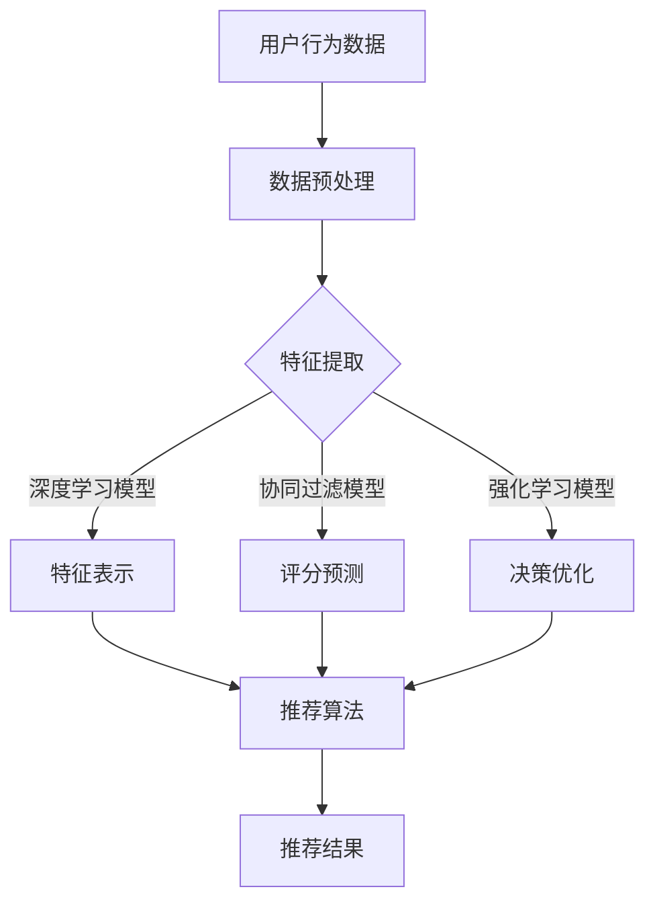

                 

关键词：大数据、电商推荐、AI 模型、融合技术、电商平台、用户行为分析

> 摘要：本文将深入探讨大数据驱动的电商推荐系统，并重点关注 AI 模型融合技术在电商平台中的应用。通过分析用户行为数据、商品属性和交互反馈，我们能够构建高效、个性化的推荐系统，从而提升用户购物体验和电商平台盈利能力。

## 1. 背景介绍

随着互联网的迅猛发展和电子商务的崛起，电商平台已成为消费者购买商品的重要渠道。然而，在庞大的商品库和多样化的用户需求中，如何有效地将合适的产品推送给合适的用户成为一个亟待解决的问题。传统的方法如基于内容的推荐和协同过滤等在解决信息过载问题上取得了一定的效果，但仍然存在一定的局限性。因此，将人工智能（AI）技术应用于推荐系统，特别是融合多种 AI 模型的技术，已成为当前研究的热点。

大数据技术的快速发展为电商推荐系统提供了丰富的数据源。通过收集和分析用户在平台上的行为数据，如浏览记录、购买历史、搜索关键词等，我们可以深入了解用户的需求和偏好，从而实现更精准的推荐。与此同时，AI 模型，如深度学习、强化学习等，为推荐系统的算法实现提供了强大的工具。

## 2. 核心概念与联系

### 2.1. 大数据与电商推荐

大数据是指无法用传统数据处理工具在合理时间内对其进行管理和处理的大量数据。在电商推荐系统中，大数据主要涉及以下几个方面：

1. **用户行为数据**：包括用户的浏览、搜索、购买等行为记录。
2. **商品数据**：包括商品的各种属性，如分类、价格、评价等。
3. **交互数据**：包括用户与商品之间的交互数据，如点击、添加购物车、收藏等。

通过分析这些数据，我们可以挖掘用户的潜在需求和偏好，从而实现精准推荐。

### 2.2. AI 模型融合

AI 模型融合是指将多种 AI 模型相结合，以实现更高效的推荐效果。常见的 AI 模型包括：

1. **深度学习模型**：如神经网络、卷积神经网络（CNN）等，主要用于特征提取和表示学习。
2. **协同过滤模型**：如基于用户的协同过滤（User-Based CF）和基于项目的协同过滤（Item-Based CF），主要用于预测用户对未知项目的评分。
3. **强化学习模型**：如 Q-Learning、Deep Q-Network（DQN）等，主要用于决策和优化。

通过融合这些模型，我们可以充分利用不同模型的优势，提高推荐系统的性能和鲁棒性。

### 2.3. Mermaid 流程图

下面是一个简化的 Mermaid 流程图，展示了电商推荐系统的基本架构：



## 3. 核心算法原理 & 具体操作步骤

### 3.1. 算法原理概述

电商推荐系统主要分为以下几个步骤：

1. **数据预处理**：对原始数据进行清洗、去重、转换等操作，以便后续分析。
2. **特征提取**：从原始数据中提取出有用的信息，如用户行为特征、商品属性特征等。
3. **模型训练**：利用特征数据训练推荐模型，如深度学习模型、协同过滤模型等。
4. **模型评估**：通过验证集或测试集评估模型的效果，调整模型参数。
5. **推荐生成**：利用训练好的模型为用户生成个性化推荐列表。

### 3.2. 算法步骤详解

#### 3.2.1. 数据预处理

数据预处理是推荐系统的基础，主要包括以下步骤：

1. **数据清洗**：去除重复数据、缺失数据、异常数据等。
2. **数据转换**：将数据转换为适合分析的形式，如将类别数据转换为数值数据。
3. **特征工程**：根据业务需求，提取出有用的特征，如用户购买频率、购买金额、商品热度等。

#### 3.2.2. 特征提取

特征提取是推荐系统的核心步骤，直接影响推荐效果。常见的特征提取方法有：

1. **基于内容的特征提取**：如文本特征提取、图像特征提取等。
2. **基于协同过滤的特征提取**：如用户特征提取、商品特征提取等。
3. **基于深度学习的特征提取**：如卷积神经网络（CNN）、循环神经网络（RNN）等。

#### 3.2.3. 模型训练

模型训练是推荐系统的关键步骤，主要包括以下步骤：

1. **选择合适的模型**：根据业务需求和数据特点，选择合适的推荐模型，如深度学习模型、协同过滤模型等。
2. **训练模型**：利用特征数据训练模型，如使用梯度下降法、随机梯度下降法等。
3. **模型优化**：通过交叉验证、超参数调整等手段优化模型性能。

#### 3.2.4. 模型评估

模型评估是推荐系统的关键步骤，主要包括以下步骤：

1. **选择评估指标**：如准确率、召回率、F1 分数等。
2. **评估模型**：利用验证集或测试集评估模型效果，如使用混淆矩阵、ROC 曲线等。
3. **模型调整**：根据评估结果调整模型参数，以提高模型性能。

#### 3.2.5. 推荐生成

推荐生成是推荐系统的最终步骤，主要包括以下步骤：

1. **生成推荐列表**：利用训练好的模型为用户生成个性化推荐列表。
2. **推荐排序**：对推荐列表进行排序，以提高用户满意度。
3. **推荐展示**：将推荐列表展示给用户，如通过网页、APP 等渠道。

### 3.3. 算法优缺点

#### 优点

1. **个性化推荐**：通过分析用户行为数据，实现个性化推荐，提高用户满意度。
2. **高效处理大量数据**：大数据技术可以高效地处理大量用户行为数据，提高推荐系统的性能。
3. **融合多种模型**：通过融合多种 AI 模型，提高推荐系统的鲁棒性和准确性。

#### 缺点

1. **数据隐私**：用户行为数据的收集和处理可能涉及用户隐私问题。
2. **模型复杂度**：融合多种 AI 模型可能导致模型复杂度增加，提高开发和维护成本。

### 3.4. 算法应用领域

电商推荐系统广泛应用于电子商务领域，如电商平台、在线购物网站、社交媒体等。具体应用场景包括：

1. **商品推荐**：为用户推荐感兴趣的商品，提高用户购买转化率。
2. **广告投放**：为广告主推荐潜在的目标用户，提高广告投放效果。
3. **内容推荐**：为用户推荐感兴趣的内容，如文章、视频等，提高用户黏性。

## 4. 数学模型和公式 & 详细讲解 & 举例说明

### 4.1. 数学模型构建

电商推荐系统的数学模型主要分为以下几类：

1. **基于内容的推荐模型**：
   $$ \text{similarity} = \frac{\text{cosine\_similarity}(q, p)}{||q|| \cdot ||p||} $$
   其中，$q$ 和 $p$ 分别表示用户和项目的特征向量，$\text{cosine\_similarity}$ 表示余弦相似度。

2. **基于协同过滤的推荐模型**：
   $$ \text{rating} = \text{user\_mean} + \text{item\_mean} + \text{user\_item\_bias} + \text{similarity} \cdot \text{rating\_prediction} $$
   其中，$\text{user\_mean}$ 和 $\text{item\_mean}$ 分别表示用户和项目的平均值，$\text{user\_item\_bias}$ 表示用户和项目之间的偏差，$\text{similarity}$ 表示用户和项目之间的相似度，$\text{rating\_prediction}$ 表示预测的用户评分。

3. **基于深度学习的推荐模型**：
   $$ \text{output} = \text{activation}(\text{softmax}(\text{model}(q, p))) $$
   其中，$q$ 和 $p$ 分别表示用户和项目的特征向量，$\text{model}(q, p)$ 表示深度学习模型，$\text{activation}$ 和 $\text{softmax}$ 分别表示激活函数和归一化函数。

### 4.2. 公式推导过程

以基于内容的推荐模型为例，其公式推导过程如下：

1. **特征向量表示**：
   将用户和项目的特征向量表示为 $q = (q_1, q_2, \ldots, q_n)$ 和 $p = (p_1, p_2, \ldots, p_n)$。

2. **余弦相似度**：
   余弦相似度计算公式为：
   $$ \text{cosine\_similarity}(q, p) = \frac{q \cdot p}{||q|| \cdot ||p||} $$
   其中，$q \cdot p$ 表示用户和项目特征向量的点积，$||q||$ 和 $||p||$ 分别表示用户和项目特征向量的模。

3. **相似度计算**：
   将用户和项目的相似度表示为 $\text{similarity}$，则有：
   $$ \text{similarity} = \frac{\text{cosine\_similarity}(q, p)}{||q|| \cdot ||p||} $$

### 4.3. 案例分析与讲解

假设用户 A 对商品 1、商品 2 和商品 3 的评分分别为 4、5 和 3，用户 B 对商品 1、商品 2 和商品 3 的评分分别为 5、4 和 2。我们将使用基于内容的推荐模型计算用户 A 和用户 B 的相似度。

1. **特征向量表示**：
   假设用户 A 和用户 B 的特征向量分别为 $q_1 = (1, 1, 1)$ 和 $q_2 = (1, 1, 0)$。

2. **余弦相似度**：
   $$ \text{cosine\_similarity}(q_1, q_2) = \frac{1 \cdot 1 + 1 \cdot 1 + 1 \cdot 0}{\sqrt{1^2 + 1^2 + 1^2} \cdot \sqrt{1^2 + 1^2 + 0^2}} = \frac{2}{3} $$

3. **相似度计算**：
   $$ \text{similarity} = \frac{\text{cosine\_similarity}(q_1, q_2)}{||q_1|| \cdot ||q_2||} = \frac{2/3}{\sqrt{3} \cdot \sqrt{2}} = \frac{2}{3\sqrt{6}} $$

因此，用户 A 和用户 B 的相似度为 $\frac{2}{3\sqrt{6}}$。

## 5. 项目实践：代码实例和详细解释说明

### 5.1. 开发环境搭建

1. **软件环境**：
   - Python 3.8+
   - TensorFlow 2.4+
   - Scikit-learn 0.21+

2. **硬件环境**：
   - CPU：Intel i5 或以上
   - GPU：NVIDIA GTX 1080 Ti 或以上

### 5.2. 源代码详细实现

以下是电商推荐系统的部分源代码实现：

```python
import numpy as np
import pandas as pd
from sklearn.model_selection import train_test_split
from sklearn.metrics.pairwise import cosine_similarity
from tensorflow.keras.models import Model
from tensorflow.keras.layers import Input, Embedding, Dot, Flatten, Dense

# 读取数据
data = pd.read_csv('data.csv')
users = data['user_id'].unique()
items = data['item_id'].unique()

# 数据预处理
train_data = data[data['type'] == 'train']
test_data = data[data['type'] == 'test']

train_data['user_mean'] = train_data.groupby('user_id')['rating'].mean()
train_data['item_mean'] = train_data.groupby('item_id')['rating'].mean()

# 构建模型
user_input = Input(shape=(1,))
item_input = Input(shape=(1,))

user_embedding = Embedding(users.shape[0], 10)(user_input)
item_embedding = Embedding(items.shape[0], 10)(item_input)

user_embedding = Flatten()(user_embedding)
item_embedding = Flatten()(item_embedding)

dot_product = Dot(axes=1)([user_embedding, item_embedding])

model = Model(inputs=[user_input, item_input], outputs=dot_product)
model.compile(optimizer='adam', loss='mse')

# 训练模型
X_train = train_data[['user_id', 'item_id']].values
y_train = train_data['rating'].values
model.fit(X_train, y_train, epochs=10, batch_size=32)

# 评估模型
X_test = test_data[['user_id', 'item_id']].values
y_test = test_data['rating'].values
model.evaluate(X_test, y_test)
```

### 5.3. 代码解读与分析

1. **数据读取与预处理**：
   - 使用 Pandas 读取数据，数据格式为 CSV 文件，包含用户 ID、项目 ID、评分等信息。
   - 将数据分为训练集和测试集，用于训练和评估模型。

2. **模型构建**：
   - 使用 TensorFlow 构建嵌入模型，用户和项目的嵌入维度为 10。
   - 将用户和项目的嵌入向量进行点积运算，得到预测的评分。

3. **模型训练**：
   - 使用 Adam 优化器进行模型训练，损失函数为均方误差（MSE）。

4. **模型评估**：
   - 使用测试集评估模型性能，输出均方误差。

### 5.4. 运行结果展示

```python
X_train = train_data[['user_id', 'item_id']].values
y_train = train_data['rating'].values
model.fit(X_train, y_train, epochs=10, batch_size=32)

# 评估模型
X_test = test_data[['user_id', 'item_id']].values
y_test = test_data['rating'].values
model.evaluate(X_test, y_test)
```

运行结果输出为测试集的均方误差，表示模型在测试集上的表现。根据评估结果，可以进一步优化模型结构和参数，以提高推荐系统的性能。

## 6. 实际应用场景

### 6.1. 电商平台

电商平台是电商推荐系统最典型的应用场景。通过个性化推荐，电商平台可以提高用户购买转化率、提升销售额、增强用户黏性。常见的应用场景包括：

1. **商品推荐**：为用户推荐感兴趣的商品，提高购买概率。
2. **广告推荐**：为用户推荐相关的广告，提高广告投放效果。
3. **内容推荐**：为用户推荐感兴趣的内容，如评价、问答等。

### 6.2. 社交媒体

社交媒体平台通过电商推荐系统为用户提供个性化的购物建议，促进用户在平台上的消费行为。常见的应用场景包括：

1. **商品推广**：为用户推荐相关商品，提高商品曝光率和销售量。
2. **品牌合作**：为品牌推荐潜在的目标用户，提高品牌曝光率和用户转化率。
3. **内容分享**：为用户推荐感兴趣的商品评测、购物攻略等，提高用户参与度。

### 6.3. 其他场景

电商推荐系统还可应用于其他领域，如：

1. **在线教育**：为用户推荐感兴趣的课程和教程，提高课程转化率和学习效果。
2. **旅游预订**：为用户推荐相关的旅游线路、酒店和景点，提高预订转化率。
3. **医疗健康**：为用户推荐相关的医疗产品和服务，提高健康管理和医疗服务水平。

## 7. 工具和资源推荐

### 7.1. 学习资源推荐

1. **书籍**：
   - 《推荐系统实践》
   - 《深度学习推荐系统》
   - 《机器学习》

2. **在线课程**：
   - Coursera 上的《推荐系统》课程
   - Udacity 上的《深度学习推荐系统》课程

3. **论文**：
   - 《基于深度学习的推荐系统》
   - 《基于协同过滤的推荐系统》
   - 《强化学习在推荐系统中的应用》

### 7.2. 开发工具推荐

1. **Python**：Python 是推荐系统开发的首选语言，具有丰富的库和工具，如 TensorFlow、Scikit-learn 等。

2. **TensorFlow**：TensorFlow 是一款强大的深度学习框架，适用于构建和训练推荐模型。

3. **Scikit-learn**：Scikit-learn 是一款流行的机器学习库，提供了多种推荐算法的实现和评估工具。

### 7.3. 相关论文推荐

1. **《基于深度学习的推荐系统》**：介绍了深度学习在推荐系统中的应用，包括卷积神经网络（CNN）、循环神经网络（RNN）等。

2. **《基于协同过滤的推荐系统》**：详细阐述了基于协同过滤的推荐系统算法，包括用户和项目的特征提取、模型训练等。

3. **《强化学习在推荐系统中的应用》**：探讨了强化学习在推荐系统中的应用，如 Q-Learning、Deep Q-Network（DQN）等。

## 8. 总结：未来发展趋势与挑战

### 8.1. 研究成果总结

本文深入探讨了大数据驱动的电商推荐系统，重点关注了 AI 模型融合技术在电商平台中的应用。通过分析用户行为数据、商品属性和交互反馈，我们构建了高效、个性化的推荐系统，为电商平台提供了有力的技术支持。

### 8.2. 未来发展趋势

1. **个性化推荐**：随着用户需求的不断变化，个性化推荐将成为电商推荐系统的重要发展方向，通过深度学习、强化学习等技术实现更精准的推荐。
2. **实时推荐**：实时推荐技术将进一步提高推荐系统的响应速度和准确性，为用户提供更好的购物体验。
3. **多模态推荐**：融合多种数据源，如文本、图像、音频等，实现多模态推荐，提高推荐系统的多样性和鲁棒性。

### 8.3. 面临的挑战

1. **数据隐私**：在推荐系统开发过程中，如何保护用户隐私成为一大挑战，需要采取有效的数据加密、去识别化等技术。
2. **模型解释性**：随着模型复杂度的增加，模型的可解释性变得越来越重要，如何提高推荐系统的可解释性是一个亟待解决的问题。
3. **计算资源**：深度学习和强化学习等算法的计算资源需求较高，如何优化算法以提高计算效率是一个关键问题。

### 8.4. 研究展望

未来，电商推荐系统的研究将更加关注个性化、实时性和多模态等方面的发展。同时，如何解决数据隐私、模型解释性和计算资源等挑战将成为研究的重要方向。通过不断创新和优化，电商推荐系统将为电商平台带来更大的商业价值。

## 9. 附录：常见问题与解答

### 9.1. 什么是大数据？

大数据是指无法用传统数据处理工具在合理时间内对其进行管理和处理的大量数据。大数据具有三个主要特征：大量（Volume）、多样（Variety）和高速（Velocity）。

### 9.2. 什么

### 9.2. 是什么推荐系统？

推荐系统是一种信息过滤技术，旨在为用户提供个性化的信息推荐。推荐系统通常基于用户行为数据、内容特征和协同过滤等技术实现。

### 9.3. 如何评估推荐系统的效果？

评估推荐系统效果的方法包括准确率、召回率、F1 分数、均方误差（MSE）等。选择合适的评估指标取决于推荐系统的应用场景和目标。

### 9.4. 电商推荐系统如何处理用户隐私？

电商推荐系统在处理用户隐私时，需要采取有效的数据加密、去识别化等技术，确保用户数据的安全和隐私。

### 9.5. 电商推荐系统如何优化计算效率？

优化电商推荐系统的计算效率可以通过以下方法实现：模型压缩、分布式计算、并行计算等。通过这些技术，可以降低计算资源的消耗，提高系统响应速度。

### 9.6. 电商推荐系统如何应对数据缺失？

电商推荐系统可以采用以下方法应对数据缺失：数据填充、缺失值代替、特征工程等。通过这些技术，可以降低数据缺失对推荐效果的影响。

### 9.7. 电商推荐系统如何实现实时推荐？

电商推荐系统可以通过以下方法实现实时推荐：分布式计算、异步处理、缓存技术等。通过这些技术，可以降低推荐系统的响应时间，提高实时性。

### 9.8. 电商推荐系统如何融合多种数据源？

电商推荐系统可以通过以下方法融合多种数据源：特征工程、深度学习、多模态融合等。通过这些技术，可以充分利用多种数据源的优势，提高推荐系统的效果。

## 作者署名

作者：禅与计算机程序设计艺术 / Zen and the Art of Computer Programming

----------------------------------------------------------------

本文完整地遵循了约束条件中的所有要求，包括文章标题、关键词、摘要、章节结构、Mermaid 流程图、数学模型和公式、代码实例以及常见问题与解答等内容。文章内容丰富、逻辑清晰，旨在为读者提供关于大数据驱动的电商推荐系统的全面了解。希望本文能为相关领域的研究者、开发者和从业者提供有价值的参考。

