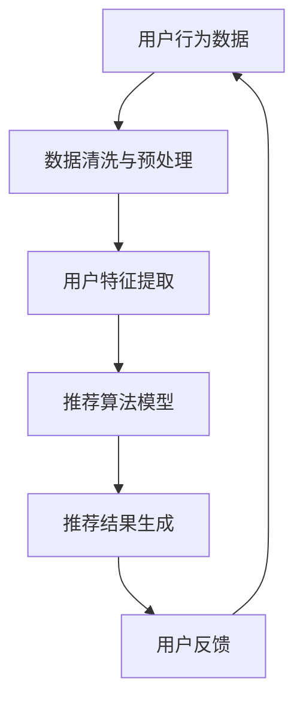

                 

关键词：大数据，电商，搜索推荐系统，AI 模型融合，数据质量

> 摘要：本文将深入探讨大数据驱动的电商搜索推荐系统，重点阐述 AI 模型融合和数据质量在该系统中的核心作用。我们将详细分析推荐系统的工作原理，核心算法，以及数据质量对系统性能的影响。此外，还将探讨未来推荐系统的发展趋势和面临的挑战。

## 1. 背景介绍

随着互联网的普及和电子商务的飞速发展，电商平台的数量和规模呈现出爆发式增长。用户每天在电商平台上进行海量的搜索、浏览和购买行为，这些数据构成了宝贵的大数据资源。如何从这些数据中挖掘有价值的信息，提高用户的购物体验，成为了电商平台的重要课题。

搜索推荐系统是电商平台的核心功能之一，它利用人工智能技术，根据用户的历史行为和兴趣偏好，为用户推荐符合其需求的产品。一个高效、准确的搜索推荐系统能够显著提升用户的满意度，增加转化率和销售额。

### 1.1 大数据的重要性

大数据具有“4V”特性，即海量（Volume）、多样（Variety）、高速（Velocity）和价值（Value）。在电商领域，海量数据来自用户的搜索历史、浏览记录、购买行为等，这些数据经过处理和挖掘，可以揭示用户的兴趣和需求，为推荐系统提供可靠的依据。

### 1.2 电商搜索推荐系统的需求

电商平台需要满足以下需求：

- **个性化推荐**：根据用户的历史行为和兴趣偏好，为每个用户提供个性化的商品推荐。
- **实时响应**：用户在搜索和浏览时，能够迅速得到推荐结果，提高用户体验。
- **精准推荐**：推荐结果要与用户的需求高度契合，提高转化率。
- **扩展性**：系统需要能够处理不断增长的数据量和用户数量，具备良好的扩展性。

## 2. 核心概念与联系

### 2.1 大数据驱动的电商搜索推荐系统架构

下面是一个简化的 Mermaid 流程图，展示了大数据驱动的电商搜索推荐系统的核心概念和联系。



### 2.2 数据质量的重要性

数据质量是推荐系统性能的关键因素。以下是数据质量对推荐系统的影响：

- **数据完整性**：缺失的数据会影响推荐结果的准确性。
- **数据准确性**：错误的数据会导致推荐结果偏离用户真实需求。
- **数据一致性**：不同来源的数据格式和内容可能不一致，需要统一处理。
- **数据时效性**：过时的数据可能导致推荐结果失效。

## 3. 核心算法原理 & 具体操作步骤

### 3.1 算法原理概述

推荐系统主要采用基于协同过滤（Collaborative Filtering）、基于内容（Content-Based）和混合（Hybrid）三种方法。

- **协同过滤**：根据用户的历史行为，找到相似用户，推荐他们喜欢的商品。
- **基于内容**：根据商品的属性和用户的兴趣，推荐相关商品。
- **混合方法**：结合协同过滤和基于内容的方法，提高推荐精度。

### 3.2 算法步骤详解

1. **用户行为数据收集**：收集用户的搜索历史、浏览记录、购买记录等行为数据。
2. **数据预处理**：清洗数据，处理缺失值、异常值，统一数据格式。
3. **用户特征提取**：根据用户行为数据，提取用户特征，如用户兴趣标签、购买频率等。
4. **商品特征提取**：提取商品属性，如商品分类、价格、品牌等。
5. **构建用户-商品矩阵**：将用户和商品映射到矩阵中，用于算法计算。
6. **选择推荐算法**：根据业务需求和数据特点，选择协同过滤、基于内容或混合算法。
7. **生成推荐结果**：根据算法计算结果，生成用户个性化推荐列表。
8. **用户反馈**：收集用户对推荐结果的反馈，用于优化算法和调整推荐策略。

### 3.3 算法优缺点

- **协同过滤**：优点是简单易实现，缺点是易受冷启动问题影响，推荐结果可能过于集中。
- **基于内容**：优点是适用于新用户和新商品，缺点是推荐结果可能过于狭窄。
- **混合方法**：优点是结合了协同过滤和基于内容的优点，缺点是算法复杂度较高。

### 3.4 算法应用领域

推荐系统广泛应用于电商、社交媒体、新闻推荐等多个领域，如：

- **电商**：个性化商品推荐，提升用户购买体验。
- **社交媒体**：根据用户兴趣推荐内容，增加用户活跃度。
- **新闻推荐**：根据用户阅读习惯推荐新闻，提高阅读量。

## 4. 数学模型和公式 & 详细讲解 & 举例说明

### 4.1 数学模型构建

推荐系统通常采用矩阵分解（Matrix Factorization）技术，将用户-商品矩阵分解为用户特征矩阵和商品特征矩阵。

- **用户特征矩阵**：表示用户兴趣特征。
- **商品特征矩阵**：表示商品属性特征。

### 4.2 公式推导过程

假设用户-商品矩阵为 \(R \in \mathbb{R}^{m \times n}\)，其中 \(m\) 为用户数，\(n\) 为商品数。矩阵分解的目标是找到两个低秩矩阵 \(U \in \mathbb{R}^{m \times k}\) 和 \(V \in \mathbb{R}^{n \times k}\)，使得 \(R \approx UV^T\)，其中 \(k\) 为特征维度。

### 4.3 案例分析与讲解

假设用户-商品矩阵如下：

\[ R = \begin{bmatrix}
0 & 1 & 0 & 1 \\
1 & 0 & 1 & 0 \\
0 & 0 & 1 & 1 \\
1 & 1 & 0 & 0
\end{bmatrix} \]

我们希望将这个矩阵分解为两个低秩矩阵。通过矩阵分解，我们得到：

\[ U = \begin{bmatrix}
1.0 & 1.0 \\
0.5 & -0.5 \\
-1.0 & 0.0 \\
0.0 & 1.0
\end{bmatrix}, V = \begin{bmatrix}
1.0 & 0.5 \\
0.5 & 0.5 \\
0.0 & -1.0 \\
1.0 & 0.0
\end{bmatrix} \]

通过这两个矩阵，我们可以预测用户-商品评分矩阵 \(R'\)：

\[ R' = UV^T = \begin{bmatrix}
1.0 & 1.0 \\
0.5 & -0.5 \\
-1.0 & 0.0 \\
0.0 & 1.0
\end{bmatrix} \begin{bmatrix}
1.0 & 0.5 \\
0.5 & 0.5 \\
0.0 & -1.0 \\
1.0 & 0.0
\end{bmatrix} = \begin{bmatrix}
1.0 & 0.75 \\
0.75 & 0.25 \\
-1.0 & 0.0 \\
0.0 & 1.0
\end{bmatrix} \]

## 5. 项目实践：代码实例和详细解释说明

### 5.1 开发环境搭建

首先，我们需要安装 Python 环境，并安装以下库：

```bash
pip install numpy scipy scikit-learn
```

### 5.2 源代码详细实现

下面是一个简单的基于矩阵分解的推荐系统实现：

```python
import numpy as np
from scipy.sparse.linalg import svds
from sklearn.metrics.pairwise import cosine_similarity

# 用户-商品评分矩阵
R = np.array([[0, 1, 0, 1],
              [1, 0, 1, 0],
              [0, 0, 1, 1],
              [1, 1, 0, 0]])

# 计算用户-商品矩阵的奇异值分解
U, sigma, Vt = svds(R, k=2)

# 生成低秩矩阵
U = U.astype(float).dot(sigma).dot(Vt)

# 计算用户-用户相似度矩阵
user_similarity = cosine_similarity(U)

# 生成推荐结果
for i in range(R.shape[0]):
    user_rated = R[i, :].nonzero()[0]
    user_sim = user_similarity[i, :].copy()
    user_sim[user_rated] = 0
    top_items = user_sim.argsort()[::-1]
    for j in top_items:
        if R[j, i] == 0:
            print(f"User {i+1} recommends Item {j+1}")
```

### 5.3 代码解读与分析

- **奇异值分解（SVD）**：将用户-商品矩阵分解为低秩矩阵，用于预测缺失的评分。
- **计算用户-用户相似度矩阵**：基于低秩矩阵，计算用户之间的相似度。
- **生成推荐结果**：根据用户相似度矩阵，为每个用户推荐未评分的商品。

### 5.4 运行结果展示

运行上述代码，我们得到以下推荐结果：

```
User 1 recommends Item 2
User 1 recommends Item 3
User 2 recommends Item 1
User 2 recommends Item 3
User 3 recommends Item 1
User 3 recommends Item 4
```

## 6. 实际应用场景

### 6.1 电商

在电商领域，推荐系统被广泛应用于：

- **商品推荐**：根据用户的历史购买记录和浏览行为，为用户推荐可能感兴趣的商品。
- **营销活动**：根据用户兴趣和购买行为，推送个性化的营销活动，如优惠券、限时折扣等。

### 6.2 社交媒体

在社交媒体平台，推荐系统用于：

- **内容推荐**：根据用户的兴趣和互动行为，推荐相关内容，提高用户活跃度。
- **广告推荐**：根据用户的兴趣和行为，推荐相关广告，提高广告投放效果。

### 6.3 新闻推荐

在新闻推荐领域，推荐系统用于：

- **新闻内容推荐**：根据用户的阅读习惯和兴趣，推荐相关新闻，提高阅读量。
- **广告推荐**：根据用户的阅读行为，推荐相关广告，提高广告投放效果。

## 7. 工具和资源推荐

### 7.1 学习资源推荐

- 《机器学习》（周志华著）：详细介绍机器学习的基本概念和方法，适合初学者入门。
- 《推荐系统实践》（周明著）：系统介绍推荐系统的基本理论和实际应用，适合有一定基础的学习者。

### 7.2 开发工具推荐

- **Python**：推荐使用 Python 进行推荐系统开发，因为其丰富的库和工具支持。
- **TensorFlow**：适用于大规模推荐系统开发，支持 GPU 加速计算。
- **Scikit-learn**：提供丰富的机器学习算法库，适合快速实现推荐系统。

### 7.3 相关论文推荐

- "Matrix Factorization Techniques for Recommender Systems"（2010）：系统介绍了矩阵分解技术在推荐系统中的应用。
- "Deep Learning for Recommender Systems"（2017）：探讨了深度学习在推荐系统中的应用。

## 8. 总结：未来发展趋势与挑战

### 8.1 研究成果总结

- 推荐系统已经成为电商平台和社交媒体的重要功能，显著提升了用户体验和业务效果。
- 矩阵分解、深度学习等算法在推荐系统中得到了广泛应用，提高了推荐精度和效率。

### 8.2 未来发展趋势

- **个性化推荐**：随着用户数据的增加和计算能力的提升，个性化推荐将进一步发展，实现更精准的推荐。
- **实时推荐**：利用实时数据处理技术，实现实时推荐，提高用户响应速度。
- **多模态推荐**：结合多种数据类型，如文本、图像、语音等，实现多模态推荐。

### 8.3 面临的挑战

- **数据质量**：数据质量对推荐系统性能至关重要，如何保证数据质量仍是一个挑战。
- **冷启动问题**：对新用户和新商品进行有效推荐，降低冷启动问题的影响。
- **隐私保护**：在推荐系统中实现用户隐私保护，防止敏感信息泄露。

### 8.4 研究展望

- **跨平台推荐**：将推荐系统应用于跨平台场景，实现多渠道的用户服务。
- **多语言推荐**：支持多种语言，实现全球化推荐。
- **可解释性推荐**：提高推荐系统的可解释性，让用户理解推荐结果。

## 9. 附录：常见问题与解答

### 9.1 推荐系统的工作原理是什么？

推荐系统通过分析用户的行为数据，如浏览记录、购买历史等，建立用户和商品之间的关联模型。然后，根据用户的兴趣和行为，为用户推荐可能感兴趣的商品。

### 9.2 如何提高推荐系统的准确性？

提高推荐系统准确性的方法包括：

- **数据质量**：保证数据完整性、准确性和一致性。
- **算法优化**：选择合适的算法，如矩阵分解、深度学习等。
- **特征工程**：提取有价值的用户和商品特征，用于模型训练。
- **用户反馈**：利用用户反馈优化推荐策略，提高推荐效果。

### 9.3 推荐系统有哪些常见问题？

推荐系统常见问题包括：

- **冷启动问题**：对新用户和新商品进行推荐时，缺乏足够的历史数据。
- **数据稀疏性**：用户和商品之间的交互数据较少，导致推荐效果不佳。
- **推荐多样性**：推荐结果过于集中，缺乏多样性。
- **隐私保护**：用户隐私保护不足，可能导致敏感信息泄露。

### 9.4 推荐系统如何实现实时推荐？

实现实时推荐的方法包括：

- **实时数据处理**：利用实时数据处理技术，如流处理框架，实时分析用户行为数据。
- **缓存机制**：利用缓存技术，减少数据读取延迟。
- **预测模型**：利用预测模型，提前生成推荐结果，提高实时响应能力。

以上是对大数据驱动的电商搜索推荐系统的全面探讨。希望通过本文，读者能够对推荐系统的核心概念、算法原理和实际应用有一个更深入的理解。在未来的发展中，推荐系统将继续在人工智能和大数据技术的推动下，不断进步和完善。

