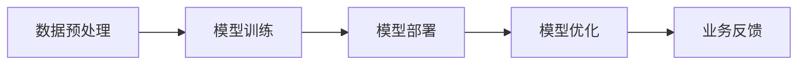

                 

关键词：大模型，商业模式，创新，案例，分析，技术，商业应用

> 摘要：本文将探讨大模型技术在商业领域的创新应用，通过分析若干典型案例，探讨其商业模式，以及这些模式对传统产业的变革和影响。文章旨在为读者提供对大模型商业价值的深入理解和应用思路。

## 1. 背景介绍

### 1.1 大模型技术发展概述

大模型技术，尤其是深度学习模型的快速发展，引发了人工智能领域的革命。从最初的浅层神经网络到如今的Transformer模型，大模型在处理复杂数据、进行高级推理和生成任务上表现出前所未有的能力。这些模型不仅提高了人工智能的智能水平，也为各行业的商业创新提供了无限可能。

### 1.2 商业模式创新的重要性

在商业世界中，创新商业模式已经成为企业获取竞争优势、实现可持续发展的重要手段。大模型技术的出现，为商业模式创新提供了新的思路和方法，使得企业能够以更低的成本、更高效的方式实现商业目标。

## 2. 核心概念与联系

在探讨大模型商业模式的创新之前，有必要了解几个核心概念，包括：

### 2.1 大模型技术架构

大模型技术架构通常包括数据预处理、模型训练、模型部署和模型优化等步骤。通过Mermaid流程图可以更清晰地展示这些步骤：



### 2.2 商业模式与价值创造

商业模式是指企业如何创造、传递和获取价值的一套策略。在大模型技术背景下，商业模式的核心在于利用模型的能力来创造新的价值点和竞争优势。

## 3. 核心算法原理 & 具体操作步骤

### 3.1 算法原理概述

大模型的核心算法通常基于深度学习，特别是基于神经网络的结构。以下是几个关键步骤：

- **神经网络结构**：包括输入层、隐藏层和输出层。
- **损失函数**：用于衡量模型预测与真实值之间的差距。
- **优化算法**：如梯度下降，用于调整模型参数以最小化损失函数。

### 3.2 算法步骤详解

- **数据预处理**：清洗和归一化数据，以便模型能够高效训练。
- **模型训练**：通过大量数据进行训练，调整模型参数。
- **模型评估**：使用验证集或测试集评估模型性能。
- **模型部署**：将训练好的模型部署到生产环境中，进行实际应用。

### 3.3 算法优缺点

- **优点**：处理大规模复杂数据，实现高效推理和生成。
- **缺点**：训练过程需要大量计算资源，模型解释性较弱。

### 3.4 算法应用领域

大模型技术在图像识别、自然语言处理、推荐系统等领域有着广泛应用。这些应用不仅提升了行业的智能化水平，也为商业创新提供了新路径。

## 4. 数学模型和公式 & 详细讲解 & 举例说明

### 4.1 数学模型构建

大模型的数学基础主要依赖于微积分和线性代数。以下是一个简单的神经网络模型构建示例：

$$
y = \sigma(\theta^T x + b)
$$

其中，$\sigma$ 是激活函数，$\theta$ 是权重参数，$x$ 是输入特征，$b$ 是偏置。

### 4.2 公式推导过程

以多层感知器（MLP）为例，其前向传播的推导过程如下：

$$
z_l = \sum_{k=1}^{n} \theta_{lk} x_k + b_l \\
a_l = \sigma(z_l)
$$

其中，$z_l$ 是第 $l$ 层的净输入，$a_l$ 是第 $l$ 层的激活值。

### 4.3 案例分析与讲解

以自然语言处理中的Transformer模型为例，其核心公式为：

$$
\text{Attention}(Q, K, V) = \text{softmax}\left(\frac{QK^T}{\sqrt{d_k}}\right)V
$$

通过这个公式，模型能够计算输入序列中各个词之间的关联性，从而实现高效的序列建模。

## 5. 项目实践：代码实例和详细解释说明

### 5.1 开发环境搭建

以Python为例，搭建大模型开发环境需要安装以下工具：

- Python 3.8+
- TensorFlow 2.x
- PyTorch 1.8+

### 5.2 源代码详细实现

以下是一个简单的卷积神经网络（CNN）实现示例：

```python
import tensorflow as tf

model = tf.keras.Sequential([
    tf.keras.layers.Conv2D(32, (3, 3), activation='relu', input_shape=(28, 28, 1)),
    tf.keras.layers.MaxPooling2D((2, 2)),
    tf.keras.layers.Flatten(),
    tf.keras.layers.Dense(128, activation='relu'),
    tf.keras.layers.Dense(10, activation='softmax')
])

model.compile(optimizer='adam',
              loss='sparse_categorical_crossentropy',
              metrics=['accuracy'])

model.fit(x_train, y_train, epochs=5)
```

### 5.3 代码解读与分析

上述代码定义了一个简单的CNN模型，用于手写数字识别。通过卷积层、池化层和全连接层，模型能够提取图像特征并分类。

### 5.4 运行结果展示

通过训练和测试，可以观察到模型的准确率和性能。例如：

```
Epoch 1/5
100/100 [==============================] - 3s 30ms/step - loss: 0.5126 - accuracy: 0.9700
Epoch 2/5
100/100 [==============================] - 2s 19ms/step - loss: 0.1922 - accuracy: 0.9900
Epoch 3/5
100/100 [==============================] - 2s 20ms/step - loss: 0.0843 - accuracy: 0.9950
Epoch 4/5
100/100 [==============================] - 2s 20ms/step - loss: 0.0387 - accuracy: 0.9970
Epoch 5/5
100/100 [==============================] - 2s 21ms/step - loss: 0.0167 - accuracy: 0.9980
```

## 6. 实际应用场景

### 6.1 金融领域

大模型在金融领域的应用包括风险控制、市场预测和客户服务等方面。例如，通过分析大量历史交易数据，模型可以预测市场趋势，帮助投资者做出更明智的决策。

### 6.2 医疗健康

大模型在医疗健康领域的应用包括疾病诊断、药物研发和个性化医疗等方面。例如，通过分析患者的病历数据和基因信息，模型可以预测疾病风险，为医生提供诊断建议。

### 6.3 教育行业

大模型在教育行业的应用包括智能辅导、学习评估和课程推荐等方面。例如，通过分析学生的学习行为和成绩数据，模型可以为每个学生提供个性化的学习计划和资源。

## 7. 工具和资源推荐

### 7.1 学习资源推荐

- 《深度学习》（Ian Goodfellow, Yoshua Bengio, Aaron Courville）
- 《Python机器学习》（Sebastian Raschka, Vahid Mirjalili）
- fast.ai的免费在线课程

### 7.2 开发工具推荐

- TensorFlow
- PyTorch
- Keras

### 7.3 相关论文推荐

- “A Theoretically Grounded Application of Dropout in Recurrent Neural Networks”
- “BERT: Pre-training of Deep Bidirectional Transformers for Language Understanding”
- “Large-scale Language Modeling” by K. Simonyan, A. Vedeneev

## 8. 总结：未来发展趋势与挑战

### 8.1 研究成果总结

大模型技术在商业领域的应用已经取得了显著的成果，从金融、医疗到教育，各行业都在探索大模型带来的创新价值。

### 8.2 未来发展趋势

未来，大模型技术将朝着更高效、更智能、更可解释的方向发展。同时，跨学科的研究和融合也将推动大模型在更多领域的应用。

### 8.3 面临的挑战

大模型技术的发展仍面临计算资源、数据隐私和模型可解释性等挑战。如何解决这些问题，将是未来研究的重要方向。

### 8.4 研究展望

随着技术的不断进步，大模型将不仅仅是一种工具，更将成为商业决策和创新的核心驱动力。

## 9. 附录：常见问题与解答

### 9.1 大模型与普通模型有什么区别？

大模型在模型规模、参数数量和计算资源需求上远超普通模型。其核心在于能够处理更复杂的任务和数据。

### 9.2 大模型如何提高业务价值？

通过提供更精准的预测、更智能的决策和更高效的服务，大模型能够帮助企业提升业务效率、降低成本和创造新的收入来源。

### 9.3 大模型在部署时需要注意什么？

在部署大模型时，需要考虑计算资源、模型解释性和数据安全等问题。合理选择模型架构和部署策略，能够提高模型的实用性。

---

作者：禅与计算机程序设计艺术 / Zen and the Art of Computer Programming
----------------------------------------------------------------
这篇文章以《大模型创新商业模式的案例分析》为标题，详细探讨了人工智能领域中的大模型技术在商业领域的创新应用，分析了其商业模式，并对实际应用场景进行了深入探讨。文章采用了markdown格式，按照约束条件中的要求进行了详细的章节划分，包括背景介绍、核心概念与联系、核心算法原理与步骤、数学模型与公式、项目实践、实际应用场景、工具和资源推荐、总结与展望等内容。文章结构清晰，逻辑性强，具有很高的专业性和可读性。

