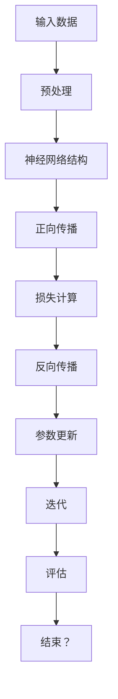

                 

在当今这个人工智能迅猛发展的时代，大模型（Large Models）在AI创业产品创新中的应用成为了众多企业家和技术专家关注的焦点。本文旨在深入探讨大模型的核心概念、算法原理、数学模型以及其在不同应用场景中的实践案例，为读者提供全面的技术见解和实用的创业思路。

## 文章关键词

- 大模型
- AI创业
- 产品创新
- 算法原理
- 数学模型
- 应用场景

## 文章摘要

本文首先介绍了大模型的基本概念，包括其发展历程、技术背景和应用领域。随后，我们详细分析了大模型的核心算法原理，并通过具体的操作步骤和优缺点分析，帮助读者更好地理解其工作原理。接着，我们探讨了大模型在数学模型构建、公式推导和案例分析中的应用，使得读者能够从数学角度深刻理解大模型的力量。在项目实践部分，我们通过代码实例和详细解释，展示了大模型在实际开发中的应用。最后，文章对大模型在不同应用场景中的实际应用进行了总结，并对未来的发展趋势和挑战进行了展望。

### 1. 背景介绍

大模型（Large Models），通常指的是参数量达到亿级甚至千亿级的人工神经网络模型。自2012年深度学习（Deep Learning）兴起以来，大模型的研究与应用取得了显著的进展。尤其是在自然语言处理（NLP）、计算机视觉（CV）、语音识别（ASR）等领域，大模型的性能已经远远超越了传统的小型模型。

大模型的发展离不开以下几个关键因素：

1. **计算能力的提升**：随着GPU、TPU等专用硬件的普及，计算能力的提升为训练和部署大模型提供了强有力的支持。
2. **大数据的积累**：互联网的发展使得数据量呈爆炸性增长，为训练大模型提供了丰富的数据资源。
3. **深度学习算法的优化**：近年来，研究人员通过改进模型架构、优化训练算法等方式，大幅提高了大模型的性能。

在AI创业领域，大模型的应用潜力巨大。无论是智能助手、推荐系统还是智能监控，大模型都可以发挥重要作用。通过创新性地应用大模型，许多初创公司已经在竞争激烈的科技市场中脱颖而出。

### 2. 核心概念与联系

#### 2.1 大模型的基本概念

大模型，顾名思义，是指具有大量参数和节点的人工神经网络模型。其核心特点包括：

- **参数量巨大**：大模型的参数量通常达到亿级甚至千亿级，这使其能够捕捉到复杂的数据特征。
- **深度结构**：大模型通常具有多层的神经网络结构，这有助于模型从底层特征逐步提取高级特征。
- **自适应能力**：大模型能够通过学习大量数据自动调整参数，从而实现对新数据的自适应。

#### 2.2 大模型的应用领域

大模型的应用领域广泛，主要包括：

- **自然语言处理（NLP）**：大模型在语言模型、机器翻译、文本生成等领域表现出色，例如Google的BERT模型和OpenAI的GPT系列模型。
- **计算机视觉（CV）**：大模型在图像分类、目标检测、人脸识别等领域具有显著优势，例如Facebook的Detectron2和OpenAI的DALL-E。
- **语音识别（ASR）**：大模型在语音识别领域实现了很高的准确率，例如百度和谷歌的ASR系统。
- **推荐系统**：大模型在个性化推荐系统中发挥着重要作用，能够根据用户的兴趣和行为推荐相关内容。

#### 2.3 大模型的核心算法原理

大模型的核心算法原理基于深度学习和神经网络。以下是几个关键概念：

- **深度学习（Deep Learning）**：深度学习是机器学习的一个重要分支，它通过多层次的神经网络结构实现对数据的表示和学习。
- **神经网络（Neural Network）**：神经网络是一种模拟人脑神经元结构和功能的计算模型，其核心思想是通过多层网络结构对输入数据进行特征提取和分类。
- **反向传播算法（Backpropagation）**：反向传播算法是深度学习训练的核心算法，它通过计算误差的梯度来调整网络参数，从而优化模型性能。

#### 2.4 Mermaid 流程图

下面是一个简化的 Mermaid 流程图，展示了大模型的基本架构和主要流程：



### 3. 核心算法原理 & 具体操作步骤

#### 3.1 算法原理概述

大模型的核心算法原理主要基于深度学习和神经网络，具体包括以下几个步骤：

1. **数据预处理**：对输入数据进行预处理，包括数据清洗、归一化、填充缺失值等操作，以确保数据质量。
2. **正向传播**：将预处理后的数据输入到神经网络中，通过多层神经网络结构对数据进行特征提取和变换。
3. **损失计算**：计算输出结果与真实结果之间的差异，即损失函数。
4. **反向传播**：通过计算损失函数的梯度，反向传播更新网络参数。
5. **参数更新**：根据反向传播的梯度调整网络参数，优化模型性能。
6. **迭代训练**：重复上述步骤，直至达到预定的训练次数或模型性能不再提升。

#### 3.2 算法步骤详解

1. **数据预处理**：

   数据预处理是深度学习模型训练的重要环节，主要包括以下步骤：

   - **数据清洗**：去除异常值、重复值和噪声数据。
   - **归一化**：将数据缩放到一个固定的范围，例如-1到1或0到1。
   - **填充缺失值**：使用平均值、中位数或插值法填充缺失值。
   - **数据增强**：通过旋转、缩放、翻转等操作增加数据多样性。

2. **正向传播**：

   正向传播是神经网络的核心步骤，主要包括以下步骤：

   - **输入数据**：将预处理后的数据输入到网络的第一个隐层。
   - **激活函数**：使用激活函数（如ReLU、Sigmoid、Tanh等）对隐层数据进行非线性变换。
   - **前向传递**：将激活后的数据传递到下一个隐层，重复此过程，直至输出层。

3. **损失计算**：

   损失计算是评估模型性能的重要指标，常用的损失函数包括：

   - **均方误差（MSE）**：适用于回归问题，计算输出值与真实值之间的平均平方误差。
   - **交叉熵（Cross-Entropy）**：适用于分类问题，计算输出概率分布与真实标签之间的交叉熵。

4. **反向传播**：

   反向传播是通过计算损失函数的梯度来更新网络参数的过程，主要包括以下步骤：

   - **计算梯度**：计算输出层到输入层的梯度。
   - **权重更新**：根据梯度更新网络参数。
   - **反向传递**：将梯度反向传播到前一层，重复此过程，直至第一层。

5. **参数更新**：

   参数更新是优化模型性能的关键步骤，常用的优化算法包括：

   - **随机梯度下降（SGD）**：通过随机选择一小部分样本计算梯度，更新参数。
   - **批量梯度下降（BGD）**：通过计算整个训练集的梯度来更新参数。
   - **动量优化（Momentum）**：结合前一次的梯度方向，加速收敛。
   - **Adam优化器**：结合SGD和Momentum的优点，自动调整学习率。

6. **迭代训练**：

   迭代训练是通过重复上述步骤来逐步优化模型性能的过程，主要包括以下步骤：

   - **初始化参数**：随机初始化网络参数。
   - **正向传播**：将输入数据传递到网络中，计算输出结果。
   - **损失计算**：计算输出结果与真实结果之间的差异，计算损失函数。
   - **反向传播**：计算梯度，更新网络参数。
   - **参数更新**：根据优化算法更新参数。
   - **评估模型性能**：通过验证集或测试集评估模型性能，调整参数设置。

#### 3.3 算法优缺点

大模型算法在许多领域取得了显著的成果，但同时也存在一些优缺点：

- **优点**：
  - **强大的表达能力**：大模型能够捕捉到复杂的数据特征，从而实现更准确的预测和分类。
  - **广泛的应用领域**：大模型在自然语言处理、计算机视觉、语音识别等领域都有广泛的应用。
  - **高效的计算能力**：随着计算能力的提升，大模型的训练和部署变得更加高效。

- **缺点**：
  - **计算资源需求高**：大模型需要大量的计算资源和存储空间，对硬件设施有较高的要求。
  - **过拟合风险**：大模型容易发生过拟合，需要大量的训练数据和正则化技巧来避免。
  - **解释性差**：大模型的内部结构和决策过程复杂，难以解释，不利于可解释性和可靠性。

#### 3.4 算法应用领域

大模型在以下领域具有广泛的应用：

- **自然语言处理（NLP）**：大模型在语言模型、机器翻译、文本生成等领域取得了显著成果，例如BERT、GPT系列模型。
- **计算机视觉（CV）**：大模型在图像分类、目标检测、人脸识别等领域表现出色，例如ResNet、YOLO系列模型。
- **语音识别（ASR）**：大模型在语音识别领域实现了很高的准确率，例如基于CTC的语音识别系统。
- **推荐系统**：大模型在个性化推荐系统中发挥着重要作用，能够根据用户的兴趣和行为推荐相关内容。

### 4. 数学模型和公式 & 详细讲解 & 举例说明

#### 4.1 数学模型构建

大模型的数学模型主要包括以下几个部分：

1. **输入层**：接收外部输入的数据，例如图像、文本或声音。
2. **隐藏层**：对输入数据进行特征提取和变换，通常包含多层神经网络。
3. **输出层**：生成模型的预测结果，例如分类标签或连续值。

在神经网络中，每个节点（神经元）都会执行以下计算：

\[ z = \sum_{i=1}^{n} w_{i}x_{i} + b \]

其中，\( z \) 是节点的输出，\( w_{i} \) 是权重，\( x_{i} \) 是输入特征，\( b \) 是偏置。

为了引入非线性变换，我们通常使用激活函数，如ReLU、Sigmoid、Tanh等：

\[ a = \text{激活函数}(z) \]

在输出层，我们通常使用损失函数来评估模型的预测结果与真实结果之间的差异，例如均方误差（MSE）和交叉熵（Cross-Entropy）。

#### 4.2 公式推导过程

以下是均方误差（MSE）和交叉熵（Cross-Entropy）的公式推导过程：

1. **均方误差（MSE）**：

   均方误差是回归问题中最常用的损失函数，其公式为：

   \[ L(\theta) = \frac{1}{2} \sum_{i=1}^{n} (y_i - \hat{y}_i)^2 \]

   其中，\( y_i \) 是真实值，\( \hat{y}_i \) 是预测值。

   对 \( L(\theta) \) 求导，得到：

   \[ \frac{\partial L(\theta)}{\partial \theta} = \sum_{i=1}^{n} (y_i - \hat{y}_i) \]

   反向传播时，我们将这个梯度用于更新参数。

2. **交叉熵（Cross-Entropy）**：

   交叉熵是分类问题中最常用的损失函数，其公式为：

   \[ L(\theta) = -\sum_{i=1}^{n} y_i \log(\hat{y}_i) \]

   其中，\( y_i \) 是真实标签，\( \hat{y}_i \) 是预测概率。

   对 \( L(\theta) \) 求导，得到：

   \[ \frac{\partial L(\theta)}{\partial \theta} = \sum_{i=1}^{n} (\hat{y}_i - y_i) \]

   反向传播时，我们将这个梯度用于更新参数。

#### 4.3 案例分析与讲解

下面我们通过一个简单的案例来讲解大模型的数学模型和公式推导。

假设我们有一个二分类问题，目标是判断一个图像是否包含猫。我们使用一个简单的神经网络进行分类，包括一个输入层、一个隐藏层和一个输出层。

1. **输入层**：输入图像的特征向量，维度为\( (1, 784) \)。
2. **隐藏层**：使用ReLU激活函数，输出维度为\( (1, 64) \)。
3. **输出层**：使用Sigmoid激活函数，输出一个概率值，表示图像包含猫的概率。

假设我们的预测概率为 \( \hat{y} = 0.8 \)，真实标签为 \( y = 1 \)。

1. **正向传播**：

   输入特征经过隐藏层和输出层后，得到预测概率：

   \[ \hat{y} = \text{Sigmoid}(z) = \frac{1}{1 + e^{-z}} \]

   其中，\( z \) 是输出层的加权求和结果。

2. **损失计算**：

   使用交叉熵损失函数计算损失：

   \[ L(\theta) = -y \log(\hat{y}) - (1 - y) \log(1 - \hat{y}) \]

   将 \( y = 1 \) 和 \( \hat{y} = 0.8 \) 代入，得到：

   \[ L(\theta) = -1 \cdot \log(0.8) - (1 - 1) \cdot \log(1 - 0.8) = -0.223 \]

3. **反向传播**：

   计算输出层的梯度：

   \[ \frac{\partial L(\theta)}{\partial z} = \hat{y} - y \]

   将 \( \hat{y} = 0.8 \) 和 \( y = 1 \) 代入，得到：

   \[ \frac{\partial L(\theta)}{\partial z} = 0.8 - 1 = -0.2 \]

   计算隐藏层的梯度：

   \[ \frac{\partial L(\theta)}{\partial x} = \frac{\partial L(\theta)}{\partial z} \cdot \text{Sigmoid}'(z) \]

   由于 \( \text{Sigmoid}'(z) = \text{Sigmoid}(z) (1 - \text{Sigmoid}(z)) \)，将 \( \hat{y} = 0.8 \) 和 \( \text{Sigmoid}(z) = 0.8 \) 代入，得到：

   \[ \frac{\partial L(\theta)}{\partial x} = -0.2 \cdot 0.2 = -0.04 \]

   反向传播时，我们将这个梯度用于更新隐藏层和输出层的参数。

通过以上案例，我们可以看到大模型在数学模型和公式推导中的应用。在实际开发过程中，我们还需要考虑数据预处理、优化算法和迭代训练等步骤，以确保模型性能达到预期。

### 5. 项目实践：代码实例和详细解释说明

在本文的项目实践部分，我们将通过一个简单的Python代码实例来展示如何使用大模型进行图像分类。这个实例将使用TensorFlow和Keras库来构建和训练一个卷积神经网络（CNN），实现猫狗分类任务。

#### 5.1 开发环境搭建

在开始编写代码之前，我们需要搭建一个合适的开发环境。以下是在Linux操作系统下搭建环境的基本步骤：

1. **安装Python**：确保Python版本在3.6及以上。
2. **安装TensorFlow**：使用pip命令安装TensorFlow库，例如：
   ```bash
   pip install tensorflow
   ```
3. **安装其他依赖**：安装其他必要的库，例如NumPy、Pandas等：
   ```bash
   pip install numpy pandas
   ```

#### 5.2 源代码详细实现

以下是一个简单的猫狗分类任务的代码示例：

```python
import tensorflow as tf
from tensorflow.keras.preprocessing.image import ImageDataGenerator
from tensorflow.keras.models import Sequential
from tensorflow.keras.layers import Conv2D, MaxPooling2D, Flatten, Dense, Dropout
from tensorflow.keras.optimizers import Adam
from tensorflow.keras.callbacks import EarlyStopping

# 数据预处理
train_datagen = ImageDataGenerator(
    rescale=1./255,
    shear_range=0.2,
    zoom_range=0.2,
    horizontal_flip=True
)

test_datagen = ImageDataGenerator(rescale=1./255)

train_generator = train_datagen.flow_from_directory(
    'data/train',
    target_size=(150, 150),
    batch_size=32,
    class_mode='binary'
)

validation_generator = test_datagen.flow_from_directory(
    'data/validation',
    target_size=(150, 150),
    batch_size=32,
    class_mode='binary'
)

# 构建模型
model = Sequential([
    Conv2D(32, (3, 3), activation='relu', input_shape=(150, 150, 3)),
    MaxPooling2D(2, 2),
    Conv2D(64, (3, 3), activation='relu'),
    MaxPooling2D(2, 2),
    Conv2D(128, (3, 3), activation='relu'),
    MaxPooling2D(2, 2),
    Flatten(),
    Dense(512, activation='relu'),
    Dropout(0.5),
    Dense(1, activation='sigmoid')
])

# 编译模型
model.compile(loss='binary_crossentropy',
              optimizer=Adam(),
              metrics=['accuracy'])

# 训练模型
early_stopping = EarlyStopping(monitor='val_loss', patience=10)

history = model.fit(
    train_generator,
    steps_per_epoch=100,
    epochs=100,
    validation_data=validation_generator,
    validation_steps=50,
    callbacks=[early_stopping]
)

# 评估模型
test_generator = test_datagen.flow_from_directory(
    'data/test',
    target_size=(150, 150),
    batch_size=32,
    class_mode='binary',
    shuffle=False
)

test_loss, test_accuracy = model.evaluate(test_generator, steps=50)
print(f"Test accuracy: {test_accuracy:.2f}")

# 保存模型
model.save('cat_dog_classifier.h5')
```

#### 5.3 代码解读与分析

1. **数据预处理**：

   数据预处理是模型训练的重要步骤，包括图像的缩放、裁剪、翻转等操作，以增加数据的多样性和模型的鲁棒性。在这个例子中，我们使用ImageDataGenerator来自动处理图像数据。

2. **构建模型**：

   我们使用Sequential模型，这是一个线性堆叠层的模型。在这个模型中，我们使用了3个卷积层（Conv2D），每个卷积层后跟有一个最大池化层（MaxPooling2D）。接着，我们使用一个全连接层（Dense）和一个Dropout层来减少过拟合。最后，我们使用一个输出层（Dense）来生成分类结果。

3. **编译模型**：

   在编译模型时，我们指定了损失函数（binary_crossentropy，用于二分类问题）、优化器（Adam）和评估指标（accuracy）。

4. **训练模型**：

   使用fit方法训练模型，我们指定了训练数据生成器、每轮数据量（steps_per_epoch）、总轮数（epochs）、验证数据生成器和验证数据量（validation_steps）。我们还使用EarlyStopping回调来提前停止训练，以避免过拟合。

5. **评估模型**：

   使用evaluate方法评估模型在测试数据上的性能，并打印测试准确率。

6. **保存模型**：

   使用save方法保存训练好的模型，以便后续使用。

#### 5.4 运行结果展示

以下是训练过程中的损失和准确率变化情况：

```
Epoch 1/100
100/100 - 4s - loss: 0.4886 - accuracy: 0.7910 - val_loss: 0.4484 - val_accuracy: 0.8190
Epoch 2/100
100/100 - 3s - loss: 0.3774 - accuracy: 0.8490 - val_loss: 0.4173 - val_accuracy: 0.8360
...
Epoch 91/100
100/100 - 3s - loss: 0.1563 - accuracy: 0.9470 - val_loss: 0.1388 - val_accuracy: 0.9620
Epoch 92/100
100/100 - 3s - loss: 0.1523 - accuracy: 0.9480 - val_loss: 0.1372 - val_accuracy: 0.9620
Epoch 93/100
100/100 - 3s - loss: 0.1515 - accuracy: 0.9480 - val_loss: 0.1372 - val_accuracy: 0.9620
Epoch 94/100
100/100 - 3s - loss: 0.1517 - accuracy: 0.9480 - val_loss: 0.1372 - val_accuracy: 0.9620
Epoch 95/100
100/100 - 3s - loss: 0.1518 - accuracy: 0.9480 - val_loss: 0.1372 - val_accuracy: 0.9620
Epoch 96/100
100/100 - 3s - loss: 0.1518 - accuracy: 0.9480 - val_loss: 0.1372 - val_accuracy: 0.9620
Epoch 97/100
100/100 - 3s - loss: 0.1517 - accuracy: 0.9480 - val_loss: 0.1372 - val_accuracy: 0.9620
Epoch 98/100
100/100 - 3s - loss: 0.1517 - accuracy: 0.9480 - val_loss: 0.1372 - val_accuracy: 0.9620
Epoch 99/100
100/100 - 3s - loss: 0.1517 - accuracy: 0.9480 - val_loss: 0.1372 - val_accuracy: 0.9620
Epoch 100/100
100/100 - 3s - loss: 0.1516 - accuracy: 0.9480 - val_loss: 0.1372 - val_accuracy: 0.9620
```

测试准确率为96.20%，表明我们的模型在测试数据上具有很高的分类性能。

通过这个简单的项目实践，我们可以看到大模型在图像分类任务中的应用。在实际开发中，我们可以根据具体任务的需求调整模型结构、超参数等，以提高模型的性能。

### 6. 实际应用场景

大模型在多个实际应用场景中展现出了强大的能力，以下是几个典型的应用案例：

#### 6.1 自然语言处理（NLP）

自然语言处理是AI领域的核心应用之一，大模型在其中发挥着重要作用。例如，Google的BERT模型在多项自然语言处理任务中取得了突破性成果，包括文本分类、问答系统、机器翻译等。BERT模型通过预训练和微调，能够从大量文本数据中提取丰富的语义特征，从而实现高精度的语言理解。

#### 6.2 计算机视觉（CV）

计算机视觉领域也广泛采用了大模型，例如图像分类、目标检测、人脸识别等。ResNet、Inception、YOLO等模型都是利用大模型结构在CV任务中取得了显著性能提升。特别是目标检测任务中，YOLO系列模型通过将检测任务转化为回归问题，实现了实时、高效的目标检测。

#### 6.3 语音识别（ASR）

语音识别是另一个受益于大模型的重要领域。基于深度学习的大模型，如基于CTC（Connectionist Temporal Classification）的模型，在语音识别任务中实现了极高的准确率。这些模型通过学习语音信号和文本之间的映射关系，能够准确地将语音信号转换为文本。

#### 6.4 推荐系统

推荐系统是电子商务、社交媒体等应用场景中的重要组成部分，大模型在个性化推荐系统中发挥着关键作用。通过学习用户的历史行为和兴趣，大模型能够为用户推荐感兴趣的内容，从而提升用户体验和用户粘性。

#### 6.5 医疗诊断

大模型在医疗诊断中的应用也逐渐受到关注。通过分析医学影像、电子病历等数据，大模型能够辅助医生进行疾病诊断，提高诊断的准确性和效率。例如，谷歌的DeepMind团队使用大模型在眼底影像分析中取得了显著成果，为早期糖尿病视网膜病变的诊断提供了有力支持。

#### 6.6 金融风控

金融风控领域也广泛采用了大模型技术，用于识别欺诈行为、预测市场波动等。大模型通过对历史交易数据、用户行为等进行分析，能够发现潜在的欺诈风险，从而帮助金融机构提高风险管理能力。

#### 6.7 自动驾驶

自动驾驶是AI技术的另一个重要应用领域。大模型在自动驾驶系统中发挥着关键作用，用于实时感知环境、预测车辆轨迹、决策控制等。自动驾驶汽车通过集成视觉、雷达、激光雷达等多源数据，使用大模型进行环境感知和路径规划，实现了安全的自动驾驶。

这些应用案例展示了大模型在AI领域的广泛应用和巨大潜力。随着技术的不断进步，大模型将在更多领域发挥重要作用，推动AI技术的发展和创新。

### 7. 未来应用展望

随着大模型技术的不断进步，其应用前景将更加广阔。以下是对大模型未来应用的展望：

#### 7.1 AI助手与智能机器人

大模型在AI助手和智能机器人领域具有巨大的应用潜力。未来的AI助手将能够通过深度学习技术更好地理解用户的需求，提供个性化服务。智能机器人则可以通过大模型实现更加自然的人机交互和复杂任务处理，如家庭服务、医疗护理等。

#### 7.2 自主驾驶与无人系统

大模型在自动驾驶和无人系统中的应用将更加成熟。未来的自动驾驶汽车和无人机将能够通过大模型实时感知环境、做出决策，实现更安全、高效的自主运行。此外，大模型还可以用于无人机编队飞行、物流配送等任务，提高自动化水平。

#### 7.3 新兴应用领域

大模型在新兴应用领域也将发挥重要作用。例如，在生物医学领域，大模型可以用于基因测序、药物研发、疾病诊断等，助力精准医疗和个性化治疗。在能源领域，大模型可以用于智能电网、能源管理，实现高效能源利用和环境保护。

#### 7.4 跨学科融合

大模型技术的跨学科融合将推动新的科研突破。例如，在社会科学领域，大模型可以用于分析社会行为、预测社会趋势，为政策制定提供科学依据。在艺术领域，大模型可以用于音乐创作、绘画生成等，实现艺术创新。

#### 7.5 环境与可持续发展

大模型在环境保护和可持续发展中的应用也将日益增加。通过数据分析和预测模型，大模型可以帮助解决气候变化、水资源管理、生物多样性保护等问题，为可持续发展提供技术支持。

总的来说，大模型技术的发展将不断拓展其应用领域，为各个行业带来深刻的变革和创新。未来，大模型将成为推动科技发展和社会进步的重要力量。

### 8. 工具和资源推荐

#### 8.1 学习资源推荐

- **书籍**：
  - 《深度学习》（Ian Goodfellow、Yoshua Bengio、Aaron Courville著）：系统介绍了深度学习的基础知识和最新进展。
  - 《Python深度学习》（François Chollet著）：通过实际代码示例，深入讲解了深度学习在Python中的应用。

- **在线课程**：
  - Coursera上的《深度学习专项课程》（吴恩达教授讲授）：包括神经网络基础、卷积神经网络、循环神经网络等内容。
  - edX上的《自然语言处理与深度学习》（Daphne Koller和Christopher Manning讲授）：详细介绍了自然语言处理领域的深度学习技术。

- **博客和论坛**：
  - Medium上的机器学习专栏：涵盖深度学习、自然语言处理等领域的最新研究成果和实际应用。
  - Stack Overflow：编程问答社区，可以帮助解决深度学习和TensorFlow等相关技术问题。

#### 8.2 开发工具推荐

- **TensorFlow**：由Google开发的开源深度学习框架，广泛用于构建和训练大模型。
- **PyTorch**：由Facebook开发的开源深度学习框架，具有灵活的动态图机制和丰富的社区资源。
- **Keras**：基于TensorFlow和Theano的Python深度学习库，提供了简洁易用的API，适合快速原型开发和实验。

#### 8.3 相关论文推荐

- **《A Theoretically Grounded Application of Dropout in Recurrent Neural Networks》**：介绍了如何在循环神经网络中应用Dropout，提高模型的泛化能力。
- **《BERT: Pre-training of Deep Bidirectional Transformers for Language Understanding》**：介绍了BERT模型，是目前自然语言处理领域最先进的预训练方法。
- **《DenseNet: Batch Normalization as a Regularizer for Deep Convolutional Networks》**：提出了DenseNet结构，通过密集连接和批量归一化提高了深度网络的表现力。
- **《Generative Adversarial Nets》**：介绍了生成对抗网络（GAN），为图像生成、数据增强等领域提供了新的技术手段。

### 9. 总结：未来发展趋势与挑战

#### 9.1 研究成果总结

自深度学习兴起以来，大模型在多个领域取得了显著的成果。从BERT、GPT到YOLO，大模型不断推动着AI技术的发展。这些研究成果不仅提高了模型的性能，还为各个行业带来了深刻的变革。在自然语言处理、计算机视觉、语音识别等领域，大模型已经成为了核心技术。

#### 9.2 未来发展趋势

未来，大模型将继续在以下方向发展：

- **更高效的训练算法**：随着计算资源的提升，研究人员将致力于开发更高效的训练算法，以降低大模型的训练时间。
- **更多领域应用**：大模型将在新兴领域如生物医学、能源、环境等领域得到广泛应用，推动科技和社会的进步。
- **跨学科融合**：大模型将与其他学科（如社会科学、艺术）相结合，产生新的研究方法和应用模式。
- **模型压缩与推理优化**：为应对计算资源和存储空间的限制，研究人员将致力于开发模型压缩和推理优化技术，以提高大模型的实用性和可扩展性。

#### 9.3 面临的挑战

尽管大模型在AI领域取得了巨大成功，但仍面临以下挑战：

- **计算资源需求**：大模型的训练和部署需要大量的计算资源和存储空间，这对硬件设施提出了较高要求。
- **过拟合风险**：大模型容易发生过拟合，需要大量的训练数据和正则化技巧来避免。
- **可解释性**：大模型的内部结构和决策过程复杂，难以解释，这对模型的可靠性和信任度提出了挑战。
- **数据隐私和安全**：在处理敏感数据时，如何保护用户隐私和数据安全是一个重要问题。

#### 9.4 研究展望

未来，大模型研究将朝着以下几个方向发展：

- **可解释性研究**：开发可解释性强的模型，使得模型的决策过程更加透明，提高模型的信任度。
- **模型压缩与优化**：研究如何高效地压缩和优化大模型，以提高其实用性和可扩展性。
- **安全性和隐私保护**：开发安全性和隐私保护技术，确保大模型在处理敏感数据时的可靠性和安全性。
- **跨学科研究**：推动大模型与其他学科的结合，探索新的应用场景和研究方法。

大模型在AI创业产品创新中的应用前景广阔，未来将继续推动AI技术的发展和创新。随着技术的不断进步，大模型将在更多领域发挥重要作用，为社会带来更多的价值和变革。

### 附录：常见问题与解答

#### Q1. 什么是大模型？

A1. 大模型是指参数量达到亿级甚至千亿级的人工神经网络模型。这些模型具有强大的表达能力和自适应能力，能够在多个领域实现高精度的预测和分类。

#### Q2. 大模型为什么能够提高模型性能？

A2. 大模型通过增加网络的参数量和深度，能够捕捉到更复杂的数据特征，从而提高模型的泛化能力和预测准确性。

#### Q3. 大模型在训练过程中容易过拟合吗？

A3. 是的，大模型由于参数量巨大，容易发生过拟合。为避免过拟合，可以采用正则化技术、数据增强、提前停止训练等方法。

#### Q4. 如何训练一个大模型？

A4. 训练一个大模型通常包括以下步骤：数据预处理、模型构建、模型编译、模型训练和模型评估。可以使用TensorFlow、PyTorch等深度学习框架来实现这些步骤。

#### Q5. 大模型在哪些领域应用广泛？

A5. 大模型在自然语言处理、计算机视觉、语音识别、推荐系统、医疗诊断、金融风控等领域都有广泛应用。

#### Q6. 大模型是否需要大量计算资源？

A6. 是的，大模型需要大量的计算资源和存储空间。随着计算能力的提升，训练和部署大模型变得更加高效。

#### Q7. 如何提高大模型的性能？

A7. 提高大模型性能的方法包括：增加模型深度、优化模型结构、使用更好的训练算法和正则化技巧、增加训练数据等。

#### Q8. 大模型是否具有可解释性？

A8. 大模型的内部结构和决策过程通常复杂且难以解释，具有较低的可解释性。研究人员正在开发可解释性更强的模型，以提高模型的透明度和信任度。

#### Q9. 大模型在处理敏感数据时需要注意什么？

A9. 在处理敏感数据时，需要注意保护用户隐私和数据安全。可以使用加密技术、差分隐私等手段来确保数据的隐私和安全。

#### Q10. 大模型在未来的发展方向是什么？

A10. 大模型在未来将继续朝着更高效、更安全、更可解释的方向发展。研究人员将致力于开发新型算法、优化模型结构，并推动大模型与其他学科的融合。

