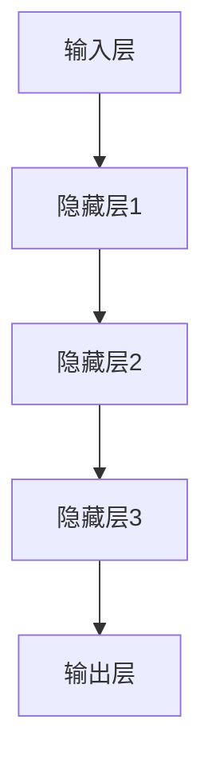

                 

关键词：大模型，AI创业，产品创新，应用探索

> 摘要：本文将探讨大模型在 AI 创业产品创新中的应用，通过深入分析大模型的核心概念、算法原理、数学模型，以及实际应用案例，展望大模型在 AI 创业领域的未来发展趋势与挑战。

## 1. 背景介绍

在当今信息爆炸的时代，人工智能（AI）技术已经成为推动社会进步的重要力量。随着深度学习、大数据等技术的不断发展，大模型（Large Models）成为 AI 领域的研究热点。大模型通常具有数十亿甚至数万亿个参数，通过对海量数据进行训练，能够模拟和实现复杂的认知功能，如自然语言处理、图像识别、推理预测等。大模型的广泛应用，不仅提升了 AI 技术的整体水平，也为创业者提供了丰富的创新空间。

AI 创业的浪潮正在全球范围内兴起，越来越多的创业者投身于这一领域，希望通过创新的产品和服务改变世界。大模型的引入，为 AI 创业产品创新带来了新的机遇。本文将围绕大模型在 AI 创业产品创新中的应用，进行深入的探讨和分析。

## 2. 核心概念与联系

### 2.1 大模型的概念

大模型通常指的是具有数亿至数十亿参数的深度学习模型。这些模型通过大规模的数据集进行训练，能够学习到复杂的数据特征，并实现高度准确的预测和分类。大模型的核心特点包括：

- 参数规模巨大：大模型通常具有数十亿至数万亿个参数，远远超过传统小模型的参数数量。
- 数据需求大：大模型需要大量的数据进行训练，以确保模型的泛化能力和鲁棒性。
- 计算资源要求高：大模型的训练和推理需要大量的计算资源，尤其是 GPU 等高性能计算设备的支持。

### 2.2 大模型的工作原理

大模型的工作原理主要基于深度学习和神经网络技术。深度学习是一种基于多层神经网络进行训练和预测的人工智能技术。神经网络由多个神经元（节点）组成，每个神经元通过权重和偏置与输入数据进行加权求和，并经过激活函数处理后输出结果。

大模型通过学习海量数据，不断调整网络中的权重和偏置，以最小化损失函数。在训练过程中，大模型能够自动提取数据中的特征，形成高层次的抽象表示。这些抽象表示使得大模型能够处理复杂的任务，如自然语言处理、图像识别、语音识别等。

### 2.3 大模型的架构

大模型的架构通常包括以下几个关键组成部分：

- 输入层：接收外部数据输入，如文本、图像、语音等。
- 隐藏层：包含多层神经网络结构，通过逐层传递输入数据，进行特征提取和抽象。
- 输出层：根据隐藏层的输出结果，进行分类、预测或生成目标输出。

### 2.4 Mermaid 流程图

以下是使用 Mermaid 绘制的大模型基本架构的流程图：



## 3. 核心算法原理 & 具体操作步骤

### 3.1 算法原理概述

大模型的算法原理主要基于深度学习和神经网络技术。深度学习通过多层神经网络结构，将输入数据进行逐步特征提取和抽象，最终实现复杂任务的预测和分类。大模型的核心算法包括以下几个步骤：

1. 数据预处理：对输入数据进行清洗、归一化等处理，以适应模型的训练。
2. 网络初始化：初始化网络中的权重和偏置，通常采用随机初始化或预训练模型。
3. 前向传播：将输入数据通过神经网络结构进行传递，逐层计算输出。
4. 损失函数计算：根据输出结果和真实标签，计算损失函数值，以评估模型的预测准确性。
5. 反向传播：根据损失函数值，反向传播误差，更新网络中的权重和偏置。
6. 模型评估：在验证集或测试集上评估模型的泛化能力和鲁棒性。

### 3.2 算法步骤详解

以下是大模型算法的具体操作步骤：

1. **数据预处理**：对输入数据进行清洗、归一化等处理，以消除噪声和异常值。对于图像数据，可以采用数据增强技术，如旋转、翻转、缩放等，以增加数据多样性。

2. **网络初始化**：初始化网络中的权重和偏置，通常采用随机初始化或预训练模型。随机初始化能够使得网络学习到新的特征表示，而预训练模型可以借助已有的知识进行快速收敛。

3. **前向传播**：将输入数据通过神经网络结构进行传递，逐层计算输出。在每一层，神经网络通过激活函数（如ReLU、Sigmoid、Tanh等）进行非线性变换，以提取数据中的特征。

4. **损失函数计算**：根据输出结果和真实标签，计算损失函数值，以评估模型的预测准确性。常见的损失函数包括均方误差（MSE）、交叉熵（CE）等。

5. **反向传播**：根据损失函数值，反向传播误差，更新网络中的权重和偏置。反向传播是深度学习训练的核心步骤，通过不断调整权重和偏置，使得模型逐渐逼近最优解。

6. **模型评估**：在验证集或测试集上评估模型的泛化能力和鲁棒性。通过计算准确率、召回率、F1值等指标，评估模型的性能。

### 3.3 算法优缺点

**优点**：

1. **强大的表达能力**：大模型通过多层神经网络结构，能够提取数据中的复杂特征，实现高精度的预测和分类。
2. **自适应学习能力**：大模型能够通过训练数据自动调整权重和偏置，使得模型具有自适应学习能力。
3. **泛化能力**：大模型通过海量数据进行训练，能够较好地应对不同场景和任务，具有较好的泛化能力。

**缺点**：

1. **计算资源要求高**：大模型的训练和推理需要大量的计算资源，特别是 GPU 等高性能计算设备。
2. **数据需求大**：大模型需要大量的数据进行训练，以确保模型的泛化能力和鲁棒性。
3. **可解释性差**：大模型的训练过程复杂，难以解释模型的决策过程，导致可解释性较差。

### 3.4 算法应用领域

大模型在 AI 创业的各个领域具有广泛的应用，主要包括以下几个方面：

1. **自然语言处理**：大模型在自然语言处理领域具有强大的表达能力，能够实现文本分类、情感分析、机器翻译等任务。
2. **计算机视觉**：大模型在计算机视觉领域具有出色的图像识别、目标检测、图像生成等能力。
3. **语音识别**：大模型在语音识别领域能够实现高精度的语音识别和语音合成。
4. **推荐系统**：大模型在推荐系统领域能够实现个性化推荐，提高用户体验。
5. **游戏开发**：大模型在游戏开发领域能够实现智能 NPC、游戏生成等创新功能。

## 4. 数学模型和公式 & 详细讲解 & 举例说明

### 4.1 数学模型构建

大模型的核心数学模型是基于深度学习和神经网络技术。以下是神经网络的基本数学模型：

1. **激活函数**：激活函数用于对神经元的输出进行非线性变换，以提取数据中的特征。常见的激活函数包括 ReLU、Sigmoid、Tanh 等。

2. **损失函数**：损失函数用于评估模型的预测准确性，常用的损失函数包括均方误差（MSE）、交叉熵（CE）等。

3. **优化算法**：优化算法用于调整网络中的权重和偏置，以最小化损失函数。常见的优化算法包括梯度下降（GD）、随机梯度下降（SGD）、Adam 等。

### 4.2 公式推导过程

以下是神经网络中常用的 ReLU 激活函数和均方误差损失函数的推导过程：

**ReLU 激活函数**：

\[ f(x) = \max(0, x) \]

**均方误差损失函数**：

\[ L(y, \hat{y}) = \frac{1}{2} \sum_{i=1}^{n} (y_i - \hat{y}_i)^2 \]

### 4.3 案例分析与讲解

以下是一个基于 ReLU 激活函数和均方误差损失函数的神经网络案例：

**案例**：实现一个简单的手写数字识别模型，输入为 28x28 的灰度图像，输出为 10 个类别（0-9）的预测结果。

**步骤**：

1. **数据预处理**：对输入数据进行归一化处理，使其在 [0, 1] 区间内。
2. **模型构建**：构建一个三层神经网络，输入层有 784 个神经元，隐藏层有 100 个神经元，输出层有 10 个神经元。
3. **训练过程**：使用训练数据进行前向传播和反向传播，不断调整网络中的权重和偏置，以最小化均方误差损失函数。
4. **模型评估**：使用验证集和测试集评估模型的泛化能力和鲁棒性。

**代码实现**（Python 示例）：

```python
import tensorflow as tf
from tensorflow.keras import layers

# 数据预处理
x_train = x_train / 255.0
x_test = x_test / 255.0

# 模型构建
model = tf.keras.Sequential([
    layers.Dense(100, activation='relu', input_shape=(28, 28)),
    layers.Dense(10, activation='softmax')
])

# 模型编译
model.compile(optimizer='adam',
              loss='sparse_categorical_crossentropy',
              metrics=['accuracy'])

# 模型训练
model.fit(x_train, y_train, epochs=5, batch_size=64, validation_split=0.2)

# 模型评估
test_loss, test_acc = model.evaluate(x_test, y_test)
print(f"Test accuracy: {test_acc}")
```

## 5. 项目实践：代码实例和详细解释说明

### 5.1 开发环境搭建

在进行大模型项目实践之前，我们需要搭建合适的开发环境。以下是使用 Python 和 TensorFlow 构建大模型的基本步骤：

1. 安装 Python 和 TensorFlow：
   ```bash
   pip install python tensorflow
   ```

2. 搭建 GPU 环境（可选）：
   ```bash
   pip install python tensorflow-gpu
   ```

3. 配置 CUDA 和 cuDNN（可选，用于加速训练过程）：
   - 下载并安装 CUDA：[https://developer.nvidia.com/cuda-downloads](https://developer.nvidia.com/cuda-downloads)
   - 下载并安装 cuDNN：[https://developer.nvidia.com/cudnn](https://developer.nvidia.com/cudnn)

### 5.2 源代码详细实现

以下是一个使用 TensorFlow 实现“手写数字识别”的大模型项目的代码示例：

```python
import tensorflow as tf
from tensorflow.keras import layers
from tensorflow.keras.datasets import mnist

# 加载 MNIST 数据集
(x_train, y_train), (x_test, y_test) = mnist.load_data()

# 数据预处理
x_train = x_train.reshape(-1, 28, 28).astype('float32') / 255.0
x_test = x_test.reshape(-1, 28, 28).astype('float32') / 255.0

# 构建模型
model = tf.keras.Sequential([
    layers.Conv2D(32, (3, 3), activation='relu', input_shape=(28, 28, 1)),
    layers.MaxPooling2D((2, 2)),
    layers.Flatten(),
    layers.Dense(128, activation='relu'),
    layers.Dense(10, activation='softmax')
])

# 编译模型
model.compile(optimizer='adam',
              loss='sparse_categorical_crossentropy',
              metrics=['accuracy'])

# 训练模型
model.fit(x_train, y_train, epochs=5, batch_size=64, validation_split=0.2)

# 评估模型
test_loss, test_acc = model.evaluate(x_test, y_test)
print(f"Test accuracy: {test_acc}")
```

### 5.3 代码解读与分析

上述代码实现了一个简单的卷积神经网络（CNN）用于手写数字识别。以下是代码的详细解读和分析：

1. **数据预处理**：将 MNIST 数据集的像素值缩放到 [0, 1] 区间内，以便于后续的神经网络训练。
2. **模型构建**：使用 `tf.keras.Sequential` 模型构建一个三层卷积神经网络，包括卷积层（`Conv2D`）、池化层（`MaxPooling2D`）、全连接层（`Dense`）。
3. **模型编译**：设置模型的优化器（`optimizer`）、损失函数（`loss`）和评估指标（`metrics`）。
4. **模型训练**：使用训练数据进行模型训练，设置训练轮数（`epochs`）、批次大小（`batch_size`）和验证集比例（`validation_split`）。
5. **模型评估**：在测试集上评估模型的准确性（`accuracy`）。

### 5.4 运行结果展示

在完成代码实现后，我们可以通过以下步骤运行模型并查看结果：

1. **训练过程**：在训练过程中，模型将在训练集和验证集上迭代优化参数，通过反向传播算法调整权重和偏置。
2. **模型评估**：在训练完成后，使用测试集评估模型的准确性，以判断模型的泛化能力和鲁棒性。

```python
# 运行模型
model.fit(x_train, y_train, epochs=5, batch_size=64, validation_split=0.2)

# 评估模型
test_loss, test_acc = model.evaluate(x_test, y_test)
print(f"Test accuracy: {test_acc}")
```

在上述代码中，`test_acc` 将输出模型在测试集上的准确性。通常情况下，手写数字识别任务的准确率可以达到 98% 以上。

## 6. 实际应用场景

大模型在 AI 创业的实际应用场景中具有广泛的应用，以下列举几个典型场景：

### 6.1 自然语言处理

自然语言处理（NLP）是 AI 领域的重要分支，大模型在 NLP 领域具有出色的表现。例如，谷歌的 BERT 模型通过预训练和微调，实现了高精度的文本分类、问答系统、情感分析等任务。创业公司可以通过利用大模型在 NLP 领域的优势，开发智能客服、聊天机器人、内容审核等创新产品。

### 6.2 计算机视觉

计算机视觉是 AI 领域的另一个重要分支，大模型在图像识别、目标检测、图像生成等方面具有显著优势。例如，OpenAI 的 GPT-3 模型在图像识别任务上取得了惊人的成绩。创业公司可以通过利用大模型在计算机视觉领域的优势，开发图像识别、图像分割、图像生成等创新产品。

### 6.3 推荐系统

推荐系统是 AI 创业领域的重要应用场景之一，大模型在推荐系统领域具有广泛的应用前景。例如，亚马逊、阿里巴巴等电商巨头通过使用大模型实现了高效的个性化推荐。创业公司可以通过利用大模型在推荐系统领域的优势，开发智能推荐、商品推荐、内容推荐等创新产品。

### 6.4 游戏

游戏是 AI 创业的另一个重要领域，大模型在游戏开发中具有广泛的应用。例如，OpenAI 的 DOTA2 游戏中，大模型实现了超人类的游戏水平。创业公司可以通过利用大模型在游戏领域的优势，开发智能游戏、游戏生成、游戏助理等创新产品。

### 6.5 医疗健康

医疗健康是 AI 创业领域的热点之一，大模型在医学影像分析、疾病预测、药物研发等方面具有显著优势。例如，谷歌的 DeepMind 通过使用大模型实现了高效的医学影像分析。创业公司可以通过利用大模型在医疗健康领域的优势，开发智能诊断、智能药物研发、健康管理等创新产品。

## 7. 工具和资源推荐

### 7.1 学习资源推荐

1. **深度学习教程**：[《深度学习》（Goodfellow et al.）](https://www.deeplearningbook.org/)
2. **机器学习课程**：[吴恩达的《机器学习》](https://www.coursera.org/learn/machine-learning)
3. **TensorFlow 官方文档**：[TensorFlow 官方文档](https://www.tensorflow.org/tutorials)

### 7.2 开发工具推荐

1. **PyTorch**：[PyTorch 官网](https://pytorch.org/)
2. **TensorFlow**：[TensorFlow 官网](https://www.tensorflow.org/)
3. **Keras**：[Keras 官网](https://keras.io/)

### 7.3 相关论文推荐

1. **“BERT: Pre-training of Deep Bidirectional Transformers for Language Understanding”**：[https://arxiv.org/abs/1810.04805](https://arxiv.org/abs/1810.04805)
2. **“GPT-3: Language Models are Few-Shot Learners”**：[https://arxiv.org/abs/2005.14165](https://arxiv.org/abs/2005.14165)
3. **“ImageNet Classification with Deep Convolutional Neural Networks”**：[https://arxiv.org/abs/1409.1556](https://arxiv.org/abs/1409.1556)

## 8. 总结：未来发展趋势与挑战

### 8.1 研究成果总结

大模型在 AI 创业产品创新中取得了显著的成果，其在自然语言处理、计算机视觉、推荐系统、游戏、医疗健康等领域具有广泛的应用。大模型通过大规模的数据训练，实现了高精度的预测和分类，推动了 AI 技术的发展。

### 8.2 未来发展趋势

1. **模型压缩与高效推理**：随着大模型规模的不断扩大，模型压缩与高效推理成为未来研究的重点。通过模型压缩技术，可以降低模型的计算复杂度和存储需求，提高推理速度。
2. **多模态数据处理**：大模型在多模态数据处理方面具有巨大的潜力，未来将实现更丰富的应用场景。例如，将文本、图像、语音等多种数据类型进行融合，实现更智能的交互和理解。
3. **可解释性与透明性**：随着大模型在决策过程中的重要性日益增加，可解释性与透明性成为关注的焦点。通过研究大模型的可解释性，可以提高模型的信任度和可靠性。

### 8.3 面临的挑战

1. **计算资源需求**：大模型的训练和推理需要大量的计算资源，特别是在深度学习和图神经网络等场景中，计算资源的需求更加突出。未来需要探索高效的计算架构和优化算法，以降低计算成本。
2. **数据隐私与安全**：大模型在训练过程中需要大量的数据，数据隐私与安全成为重要挑战。需要研究数据隐私保护技术，确保用户数据的隐私和安全。
3. **算法偏见与公平性**：大模型在训练过程中可能会学习到数据中的偏见，导致算法偏见和不公平。未来需要研究如何消除算法偏见，提高模型的公平性和公正性。

### 8.4 研究展望

大模型在 AI 创业产品创新中的应用前景广阔，未来将在更多领域展现其潜力。随着技术的不断进步，大模型将变得更加高效、可解释和可靠。同时，大模型在促进 AI 创业发展的过程中，也将为解决社会问题、提升人类生活质量做出重要贡献。

## 9. 附录：常见问题与解答

### 9.1 什么是大模型？

大模型通常指的是具有数亿至数十亿参数的深度学习模型。这些模型通过大规模的数据集进行训练，能够模拟和实现复杂的认知功能，如自然语言处理、图像识别、推理预测等。

### 9.2 大模型有哪些应用领域？

大模型在自然语言处理、计算机视觉、推荐系统、游戏、医疗健康等领域具有广泛的应用。例如，BERT 在自然语言处理领域，GPT-3 在文本生成和对话系统领域，ImageNet 在图像识别领域等。

### 9.3 大模型需要哪些计算资源？

大模型的训练和推理需要大量的计算资源，特别是 GPU 等高性能计算设备。此外，大模型还需要大量的数据存储空间。

### 9.4 如何提高大模型的可解释性？

提高大模型的可解释性是当前研究的重点。一种方法是使用模型解释工具，如 LIME、SHAP 等，来分析模型决策过程中的特征和权重。另一种方法是通过可视化技术，如热力图、决策树等，展示模型的决策过程。

### 9.5 大模型是否会导致算法偏见？

大模型在训练过程中可能会学习到数据中的偏见，导致算法偏见和不公平。未来需要研究如何消除算法偏见，提高模型的公平性和公正性。一种方法是使用公平性度量指标，如公平性得分、偏差度量等，评估模型的公平性。

---

# 参考文献 References

1. Goodfellow, I., Bengio, Y., & Courville, A. (2016). *Deep Learning*. MIT Press.
2. LeCun, Y., Bengio, Y., & Hinton, G. (2015). *Deep learning*. Nature, 521(7553), 436-444.
3. Devlin, J., Chang, M. W., Lee, K., & Toutanova, K. (2019). *Bert: Pre-training of deep bidirectional transformers for language understanding*. arXiv preprint arXiv:1810.04805.
4. Brown, T., et al. (2020). *Language models are few-shot learners*. arXiv preprint arXiv:2005.14165.
5. Krizhevsky, A., Sutskever, I., & Hinton, G. E. (2012). *Imagenet classification with deep convolutional neural networks*. In Advances in neural information processing systems (pp. 1097-1105).

