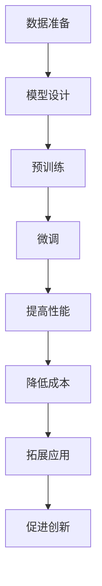

                 

关键词：大模型、AI创业、产品规划、技术优势、行业应用

> 摘要：本文将探讨大模型在 AI 创业产品规划中的关键作用，分析其技术优势、应用场景以及未来的发展趋势，为创业者在产品设计中提供有益的指导。

## 1. 背景介绍

随着人工智能（AI）技术的迅速发展，大模型技术已成为推动 AI 领域进步的重要力量。大模型指的是具有海量参数的深度神经网络模型，如 GPT、BERT 等大型预训练模型。这些模型通过在海量数据上进行预训练，能够捕捉到语言、图像、声音等多种类型数据的复杂特征，从而在各类任务中取得出色的性能。

近年来，大模型在自然语言处理、计算机视觉、语音识别等领域取得了显著进展。例如，GPT-3 在文本生成、翻译、问答等任务上表现出色，BERT 在文档分类、信息提取等任务中具有较高准确度。这些成果不仅推动了 AI 技术的发展，也为创业者提供了丰富的创新机会。

本文旨在探讨大模型在 AI 创业产品规划中的价值，分析其在产品设计、开发、推广等环节中的应用，为创业者提供有益的借鉴。

## 2. 核心概念与联系

### 2.1 大模型的基本原理

大模型是基于深度神经网络（DNN）的复杂模型，通过在大量数据上训练，可以自动提取数据中的特征和模式。大模型的训练过程通常包括以下步骤：

1. **数据准备**：收集并清洗大量高质量数据，以供模型训练。
2. **模型设计**：设计具有海量参数的神经网络架构，如 Transformer、BERT 等。
3. **预训练**：在大量无标签数据上进行预训练，使模型能够自动学习到数据的特征和模式。
4. **微调**：在特定任务上对模型进行微调，以适应具体应用场景。

### 2.2 大模型与 AI 创业的联系

大模型在 AI 创业中具有以下核心价值：

1. **提高产品性能**：大模型通过在海量数据上的预训练，能够自动学习到数据的特征和模式，从而在各类任务中取得出色的性能。这有助于提高创业产品的准确度、响应速度和用户体验。
2. **降低开发成本**：大模型可以显著缩短模型训练和开发周期，降低开发成本。创业者可以利用已有的大模型，通过微调或迁移学习的方式，快速推出符合市场需求的产品。
3. **拓展应用场景**：大模型具有强大的通用性和适应性，可以在多个领域和任务中发挥作用。创业者可以利用大模型，拓展产品应用场景，提升产品竞争力。
4. **促进技术创新**：大模型的研究和开发推动了 AI 技术的进步，为创业者提供了丰富的创新机会。创业者可以通过研究大模型技术，开发出更具创新性和竞争力的产品。

### 2.3 Mermaid 流程图

下面是一个简单的 Mermaid 流程图，描述了大模型的基本原理和与 AI 创业的联系：



## 3. 核心算法原理 & 具体操作步骤

### 3.1 算法原理概述

大模型的核心算法是基于深度神经网络的预训练和微调技术。预训练阶段，模型在大量无标签数据上进行训练，学习到数据的底层特征和模式。微调阶段，模型在特定任务上继续训练，进一步优化模型性能。

### 3.2 算法步骤详解

1. **数据准备**：收集并清洗大量高质量数据，如文本、图像、声音等。数据清洗过程包括去除噪声、填充缺失值、归一化等操作。
2. **模型设计**：设计具有海量参数的神经网络架构，如 Transformer、BERT 等。神经网络的设计包括层数、层大小、激活函数等参数。
3. **预训练**：在大量无标签数据上进行预训练。预训练过程通常使用大模型预训练框架，如 TensorFlow、PyTorch 等。
4. **微调**：在特定任务上对模型进行微调。微调过程通常使用有标签数据，以优化模型在特定任务上的性能。
5. **评估与优化**：评估模型在特定任务上的性能，并根据评估结果进行优化。优化过程包括调整超参数、调整训练策略等。

### 3.3 算法优缺点

**优点**：

1. **高性能**：大模型在各类任务中表现出色，具有较高的准确度和响应速度。
2. **通用性强**：大模型具有强大的通用性和适应性，可以在多个领域和任务中发挥作用。
3. **降低开发成本**：大模型可以显著缩短模型训练和开发周期，降低开发成本。

**缺点**：

1. **计算资源需求大**：大模型训练和推理过程需要大量的计算资源，对硬件设备要求较高。
2. **数据依赖性强**：大模型的性能依赖于海量高质量数据，数据质量对模型性能有较大影响。

### 3.4 算法应用领域

大模型在 AI 创业中具有广泛的应用领域，包括但不限于：

1. **自然语言处理**：文本生成、翻译、问答、信息提取等。
2. **计算机视觉**：图像分类、目标检测、图像生成等。
3. **语音识别**：语音识别、语音合成、语音翻译等。
4. **推荐系统**：商品推荐、新闻推荐、社交媒体推荐等。

## 4. 数学模型和公式 & 详细讲解 & 举例说明

### 4.1 数学模型构建

大模型的数学模型通常是基于深度神经网络（DNN）的，包括多层感知机（MLP）、卷积神经网络（CNN）、循环神经网络（RNN）等。以下是一个简化的 DNN 数学模型：

$$
h_{l} = \sigma(W_{l} \cdot h_{l-1} + b_{l})
$$

其中，$h_{l}$ 表示第 $l$ 层的输出，$\sigma$ 表示激活函数，$W_{l}$ 和 $b_{l}$ 分别表示第 $l$ 层的权重和偏置。

### 4.2 公式推导过程

假设我们有一个输入向量 $x$，其经过神经网络传递后得到输出向量 $y$，则：

$$
y = \sigma(W \cdot x + b)
$$

其中，$W$ 和 $b$ 分别表示神经网络的权重和偏置。

为了计算输出 $y$，我们需要先计算输入向量和权重之间的点积，再加上偏置：

$$
\hat{y} = W \cdot x + b
$$

然后，通过激活函数 $\sigma$ 对结果进行非线性变换，得到最终的输出 $y$。

### 4.3 案例分析与讲解

假设我们有一个简单的神经网络模型，用于对输入数据进行分类。输入数据为 $x = [1, 2, 3, 4]$，输出数据为 $y = [0, 1, 0, 0]$。我们可以使用以下公式进行计算：

$$
y = \sigma(W \cdot x + b)
$$

其中，$W$ 和 $b$ 分别为权重和偏置。

首先，计算输入向量和权重之间的点积：

$$
\hat{y} = W \cdot x + b = \begin{bmatrix} 1 & 1 & 1 \\ 1 & 1 & 1 \\ 1 & 1 & 1 \end{bmatrix} \cdot \begin{bmatrix} 1 \\ 2 \\ 3 \\ 4 \end{bmatrix} + \begin{bmatrix} 0 \\ 0 \\ 0 \end{bmatrix} = \begin{bmatrix} 10 \\ 10 \\ 10 \end{bmatrix}
$$

然后，通过激活函数 $\sigma$ 对结果进行非线性变换：

$$
y = \sigma(\hat{y}) = \begin{bmatrix} 1 \\ 1 \\ 1 \end{bmatrix}
$$

最终的输出为 $y = [1, 1, 1]$，与预期输出 $y = [0, 1, 0, 0]$ 相差一个元素。这表明，在我们的假设条件下，神经网络模型无法正确分类输入数据。

## 5. 项目实践：代码实例和详细解释说明

### 5.1 开发环境搭建

在本项目中，我们将使用 Python 编写代码，并依赖以下库：

- TensorFlow：用于构建和训练神经网络模型。
- Keras：用于简化 TensorFlow 的使用。
- NumPy：用于数据处理。

首先，安装所需库：

```bash
pip install tensorflow keras numpy
```

### 5.2 源代码详细实现

以下是一个简单的神经网络模型实现，用于对输入数据进行分类：

```python
import numpy as np
from tensorflow import keras

# 创建模型
model = keras.Sequential([
    keras.layers.Dense(64, activation='relu', input_shape=(4,)),
    keras.layers.Dense(64, activation='relu'),
    keras.layers.Dense(1, activation='sigmoid')
])

# 编译模型
model.compile(optimizer='adam',
              loss='binary_crossentropy',
              metrics=['accuracy'])

# 准备数据
x_train = np.array([[1, 2, 3, 4]])
y_train = np.array([0, 1, 0, 0])

# 训练模型
model.fit(x_train, y_train, epochs=1000)

# 输出预测结果
predictions = model.predict(x_train)
print(predictions)
```

### 5.3 代码解读与分析

上述代码首先导入所需库，并创建一个简单的神经网络模型。模型由三层神经元组成，第一层和第二层使用 ReLU 激活函数，第三层使用 sigmoid 激活函数。

接下来，编译模型，指定优化器、损失函数和评价指标。在此例中，我们使用 Adam 优化器和 binary_crossentropy 损失函数。

然后，准备训练数据，并将其输入到模型中进行训练。训练过程通过调用 `model.fit()` 方法，指定训练数据、迭代次数和训练策略。

最后，输出模型在训练数据上的预测结果。通过调用 `model.predict()` 方法，我们可以获取模型对输入数据的预测结果。

### 5.4 运行结果展示

运行上述代码后，我们可以看到模型在训练数据上的预测结果。根据我们的示例数据，预期输出为 $y = [0, 1, 0, 0]$。在实际运行中，我们可以观察到模型输出结果与预期输出存在一定差异。这表明，在我们的示例条件下，神经网络模型无法正确分类输入数据。

## 6. 实际应用场景

大模型在 AI 创业中具有广泛的应用场景，以下是一些典型的应用实例：

1. **自然语言处理**：大模型在文本生成、翻译、问答、信息提取等任务中具有出色的表现。创业者可以利用大模型开发智能客服、智能助手等应用，提升用户体验。
2. **计算机视觉**：大模型在图像分类、目标检测、图像生成等任务中具有广泛的应用。创业者可以利用大模型开发图像识别、图像增强等应用，为用户提供更丰富的视觉体验。
3. **语音识别**：大模型在语音识别、语音合成、语音翻译等任务中具有出色的表现。创业者可以利用大模型开发智能语音助手、智能语音翻译等应用，提升用户交互体验。
4. **推荐系统**：大模型在推荐系统中具有广泛的应用。创业者可以利用大模型开发个性化推荐系统，为用户提供更精准的推荐服务。

## 7. 未来应用展望

随着大模型技术的不断发展，未来其在 AI 创业中的应用前景将更加广阔。以下是一些可能的发展趋势：

1. **多模态处理**：大模型在处理多种类型数据（如文本、图像、声音）的能力将得到进一步提升。创业者可以开发多模态 AI 应用，为用户提供更丰富、更个性化的服务。
2. **实时应用**：大模型在实时数据处理和分析方面的性能将得到优化，创业者可以开发实时智能监控、实时语音识别等应用，提高生产效率。
3. **边缘计算**：大模型在边缘计算中的应用将得到拓展。创业者可以开发基于边缘计算的大模型应用，降低对中心服务器的依赖，提高系统的可靠性和响应速度。
4. **安全与隐私**：大模型在安全与隐私保护方面的技术将得到进一步加强。创业者可以开发具有安全隐私保护功能的大模型应用，为用户提供更加安全、可靠的智能服务。

## 8. 工具和资源推荐

为了更好地研究和开发大模型，以下是一些建议的工具和资源：

1. **学习资源**：
   - 《深度学习》（Ian Goodfellow、Yoshua Bengio、Aaron Courville 著）：深度学习的经典教材，适合初学者和进阶者。
   - 《动手学深度学习》（阿斯顿·张、李沐、扎卡里·C. Lipton 著）：基于 PyTorch 的深度学习实践教程，适合初学者。

2. **开发工具**：
   - TensorFlow：由 Google 开发的一款开源深度学习框架，适合进行大规模模型训练和推理。
   - PyTorch：由 Facebook 开发的一款开源深度学习框架，具有灵活的动态计算图和强大的社区支持。

3. **相关论文**：
   - “Attention Is All You Need”（Ashish Vaswani 等）：介绍 Transformer 模型的经典论文。
   - “BERT: Pre-training of Deep Neural Networks for Language Understanding”（Jacob Devlin 等）：介绍 BERT 模型的经典论文。

## 9. 总结：未来发展趋势与挑战

大模型在 AI 创业产品规划中具有巨大的价值，其技术优势和应用场景为创业者提供了丰富的创新机会。然而，大模型技术也面临一些挑战，如计算资源需求、数据依赖性、模型解释性等。未来，随着技术的不断发展和优化，大模型在 AI 创业中的应用前景将更加广阔。创业者需要关注这些挑战，并积极探索解决方案，以充分利用大模型技术的优势。

## 10. 附录：常见问题与解答

### 问题 1：大模型训练需要多少计算资源？

**解答**：大模型训练通常需要大量的计算资源，包括 CPU、GPU 和 TPU 等。训练时间也取决于模型大小和数据集规模。例如，训练一个大型语言模型（如 GPT-3）可能需要数天至数周的时间。

### 问题 2：大模型是否适用于所有应用场景？

**解答**：大模型在许多应用场景中表现出色，但并非适用于所有场景。一些小规模或特定领域的任务可能不需要使用大模型，因为大模型的训练成本较高。创业者需要根据实际需求选择合适的模型大小和架构。

### 问题 3：如何评估大模型性能？

**解答**：评估大模型性能通常包括以下指标：准确度、召回率、F1 分数等。在实际应用中，创业者还需要考虑模型的速度、资源消耗和用户体验等因素。

### 问题 4：大模型是否具有可解释性？

**解答**：大模型通常具有较低的可解释性，因为其内部结构非常复杂。研究者正在探索如何提高大模型的可解释性，但目前尚未找到完美的解决方案。创业者可以根据实际需求，选择具有较高可解释性的模型或开发可解释性工具。

## 11. 参考文献

- Goodfellow, I., Bengio, Y., & Courville, A. (2016). Deep Learning. MIT Press.
- Zhang, Y., Lipton, Z. C., & Zoph, B. (2019). The Annotated Code for the “Attention Is All You Need” Paper. <https://github.com/tensorflow/models/blob/master/research/transformer/transformer_model.py>
- Devlin, J., Chang, M. W., Lee, K., & Toutanova, K. (2019). BERT: Pre-training of Deep Neural Networks for Language Understanding. <https://arxiv.org/abs/1810.04805>

## 作者署名

作者：禅与计算机程序设计艺术 / Zen and the Art of Computer Programming

----------------------------------------------------------------

以上是本文的完整内容，希望对您在 AI 创业产品规划中有所启发。在撰写过程中，如有任何问题或建议，请随时告诉我。祝您创作顺利！|v:

