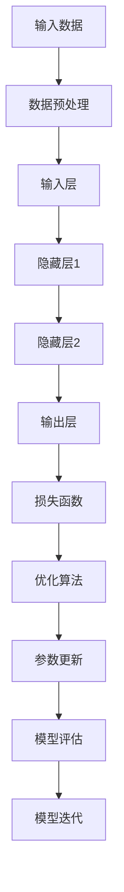

                 

关键词：大模型、AI创业公司、产品创新、神经网络、深度学习

摘要：本文将探讨大模型在 AI 创业公司产品创新中的作用。随着深度学习技术的不断进步，大模型在处理复杂数据、生成高质量内容、模拟真实场景等方面展现出了巨大的潜力。本文将详细介绍大模型的基本原理、应用场景以及如何在实际的 AI 创业公司中发挥其作用，为创业者提供有价值的参考。

## 1. 背景介绍

近年来，人工智能（AI）领域取得了令人瞩目的进展，特别是在深度学习方面。深度学习通过模拟人脑神经网络结构，实现了对复杂数据的自动分析和学习。而大模型，作为一种具有大规模参数量的神经网络，进一步推动了 AI 技术的发展。大模型的出现，使得 AI 创业公司在产品创新方面拥有了更多可能性。

### 1.1 AI 创业公司的现状

AI 创业公司作为科技创新的重要力量，不断涌现。然而，在产品创新方面，这些公司面临着诸多挑战：

- 数据获取与处理：高质量的数据是 AI 产品创新的基础，但数据的获取和处理过程复杂且耗时长。
- 技术门槛：深度学习等技术的门槛较高，初创公司难以在短时间内掌握。
- 产品差异化：如何在激烈的市场竞争中脱颖而出，实现产品差异化，是 AI 创业公司面临的重大挑战。

### 1.2 大模型的出现

大模型的出现，为 AI 创业公司解决上述问题提供了一种新的思路。大模型具有以下几个显著特点：

- 大规模参数：大模型通常具有数百万甚至数十亿个参数，可以更好地捕捉数据中的特征。
- 强泛化能力：大模型在训练过程中能够学习到更广泛的知识，从而提高其泛化能力。
- 自动特征提取：大模型可以通过自动化的方式，从原始数据中提取出有价值的特征，减少人工干预。

## 2. 核心概念与联系

为了更好地理解大模型在 AI 创业公司产品创新中的作用，我们首先需要了解大模型的基本原理和架构。下面，我们将使用 Mermaid 流程图（无括号、逗号等特殊字符）来展示大模型的核心概念和联系。



### 2.1 大模型基本原理

- **输入数据**：大模型的输入可以是各种类型的数据，如图像、文本、语音等。
- **数据预处理**：对输入数据进行预处理，如归一化、缩放等，以适应模型训练。
- **输入层**：输入层接收预处理后的数据，并将其传递给隐藏层。
- **隐藏层**：隐藏层是模型的中间部分，通过多层神经网络结构，实现对数据的深层特征提取。
- **输出层**：输出层生成模型的预测结果，如分类标签、概率分布等。
- **损失函数**：损失函数用于衡量模型的预测结果与真实结果之间的差距。
- **优化算法**：优化算法用于更新模型的参数，以减少损失函数的值。
- **模型评估**：通过模型评估指标（如准确率、召回率等）来评估模型性能。
- **模型迭代**：根据评估结果，不断迭代优化模型，以提高其性能。

### 2.2 大模型架构

大模型的架构通常包括以下几个关键部分：

- **神经网络结构**：神经网络是深度学习的基础，通过层与层的连接，实现对数据的逐层特征提取。
- **激活函数**：激活函数用于引入非线性因素，使模型能够学习更复杂的特征。
- **池化层**：池化层用于降低数据维度，提高计算效率。
- **全连接层**：全连接层用于将隐藏层的特征映射到输出层。
- **正则化**：正则化用于防止模型过拟合，提高泛化能力。

## 3. 核心算法原理 & 具体操作步骤

### 3.1 算法原理概述

大模型的核心算法是基于反向传播（Backpropagation）算法。反向传播算法通过迭代更新模型参数，以最小化损失函数。具体操作步骤如下：

1. **前向传播**：输入数据通过神经网络的前向传播，生成预测结果。
2. **计算损失**：使用损失函数计算预测结果与真实结果之间的差距。
3. **反向传播**：根据损失函数的梯度，更新模型的参数。
4. **迭代优化**：重复前向传播和反向传播，直到模型性能达到预期。

### 3.2 算法步骤详解

1. **初始化参数**：随机初始化模型的权重和偏置。
2. **前向传播**：
   - 将输入数据输入到输入层。
   - 通过激活函数，将数据传递到下一层。
   - 重复上述步骤，直到输出层生成预测结果。
3. **计算损失**：使用损失函数（如均方误差、交叉熵等）计算预测结果与真实结果之间的差距。
4. **反向传播**：
   - 计算输出层到隐藏层的梯度。
   - 通过反向传播，将梯度传递到输入层。
   - 更新模型的权重和偏置。
5. **迭代优化**：重复前向传播和反向传播，直到模型性能达到预期。

### 3.3 算法优缺点

#### 优点：

- **强大的特征提取能力**：大模型可以通过自动化的方式，从原始数据中提取出有价值的特征，减少人工干预。
- **高效的计算性能**：大模型通常具有大规模参数量，可以在短时间内处理大量数据。
- **广泛的适用范围**：大模型可以应用于多种领域，如图像识别、自然语言处理、推荐系统等。

#### 缺点：

- **高计算成本**：大模型需要大量的计算资源，对于初创公司来说，可能面临较大的成本压力。
- **数据需求量大**：大模型需要大量的数据进行训练，对于数据稀缺的领域，可能难以应用。
- **过拟合风险**：大模型在训练过程中，容易过拟合，需要通过正则化等技术进行防止。

### 3.4 算法应用领域

大模型在 AI 创业公司产品创新中的应用领域广泛，包括但不限于以下几个方面：

- **图像识别与分类**：大模型可以通过自动化的方式，从图像中提取出有价值的特征，实现高效的图像识别和分类。
- **自然语言处理**：大模型可以用于文本分类、情感分析、机器翻译等任务，提升自然语言处理的效果。
- **推荐系统**：大模型可以用于构建推荐系统，通过分析用户行为数据，实现个性化推荐。
- **语音识别与合成**：大模型可以用于语音识别和语音合成，提升语音处理的效果。

## 4. 数学模型和公式 & 详细讲解 & 举例说明

### 4.1 数学模型构建

大模型的核心数学模型是基于多层感知机（MLP）和卷积神经网络（CNN）。下面，我们将分别介绍这两种模型的基本原理和数学公式。

#### 4.1.1 多层感知机（MLP）

多层感知机是一种前向神经网络，通过层与层的连接，实现对数据的特征提取。其基本原理如下：

- **输入层**：接收外部输入，如向量。
- **隐藏层**：通过激活函数，对输入数据进行非线性变换。
- **输出层**：生成模型的预测结果，如分类标签。

其数学模型可以表示为：

$$
y = \sigma(\omega^{L-1} \cdot a^{L-1} + b^{L-1})
$$

其中，$y$ 为输出层的预测结果，$\sigma$ 为激活函数（如 Sigmoid、ReLU 等），$\omega^{L-1}$ 和 $b^{L-1}$ 分别为权重和偏置。

#### 4.1.2 卷积神经网络（CNN）

卷积神经网络是一种针对图像数据进行处理的神经网络，通过卷积操作和池化操作，实现对图像的逐层特征提取。其基本原理如下：

- **卷积层**：通过卷积操作，将输入图像与滤波器进行卷积，生成特征图。
- **池化层**：通过池化操作，降低特征图的维度，提高计算效率。
- **全连接层**：通过全连接层，将特征图映射到输出层。

其数学模型可以表示为：

$$
h^{l} = \sigma(\sum_{k} w^{l}_{k} \cdot h^{l-1}_{k} + b^{l})
$$

其中，$h^{l}$ 为第 $l$ 层的特征图，$w^{l}_{k}$ 和 $b^{l}$ 分别为权重和偏置。

### 4.2 公式推导过程

#### 4.2.1 多层感知机（MLP）

多层感知机的公式推导主要涉及前向传播和反向传播。

**前向传播**：

输入层到隐藏层的公式推导：

$$
z^{l} = \sum_{k} w^{l}_{k} \cdot x_{k} + b^{l}
$$

其中，$z^{l}$ 为隐藏层的输出，$x_{k}$ 为输入层的输出，$w^{l}_{k}$ 和 $b^{l}$ 分别为权重和偏置。

隐藏层到输出层的公式推导：

$$
a^{l} = \sigma(z^{l})
$$

其中，$a^{l}$ 为隐藏层的输出，$\sigma$ 为激活函数。

**反向传播**：

输出层到隐藏层的公式推导：

$$
\delta^{l} = (\sigma'(z^{l}) \cdot (y - a^{l}))
$$

其中，$\delta^{l}$ 为隐藏层的误差，$y$ 为真实标签，$a^{l}$ 为预测结果，$\sigma'$ 为激活函数的导数。

隐藏层到输入层的公式推导：

$$
\delta^{l-1} = \sum_{k} w^{l}_{k} \cdot \delta^{l} \cdot \sigma'(z^{l-1})
$$

其中，$w^{l}_{k}$ 为权重。

#### 4.2.2 卷积神经网络（CNN）

卷积神经网络的主要公式推导涉及卷积操作、池化操作和全连接层。

**卷积操作**：

卷积操作的公式推导：

$$
h^{l}_{i,j} = \sum_{k} w^{l}_{k} \cdot x_{i-k+1,j-k+1} + b^{l}
$$

其中，$h^{l}_{i,j}$ 为第 $l$ 层的特征图，$x_{i-k+1,j-k+1}$ 为输入层的特征图，$w^{l}_{k}$ 和 $b^{l}$ 分别为权重和偏置。

**池化操作**：

池化操作的公式推导：

$$
p^{l}_{i,j} = \max_{k,l} (h^{l}_{i-k+1,j-l+1})
$$

其中，$p^{l}_{i,j}$ 为第 $l$ 层的特征图，$h^{l}_{i-k+1,j-l+1}$ 为输入层的特征图。

**全连接层**：

全连接层的公式推导：

$$
z^{l} = \sum_{k} w^{l}_{k} \cdot a^{l-1}_{k} + b^{l}
$$

其中，$z^{l}$ 为隐藏层的输出，$a^{l-1}_{k}$ 为输入层的输出，$w^{l}_{k}$ 和 $b^{l}$ 分别为权重和偏置。

### 4.3 案例分析与讲解

为了更好地理解大模型的数学模型和公式，我们以下面这个案例为例进行讲解。

**案例**：使用多层感知机（MLP）对图像进行分类。

**步骤**：

1. **数据预处理**：对输入图像进行归一化处理，使其具备相同的尺度。
2. **初始化参数**：随机初始化权重和偏置。
3. **前向传播**：将输入图像传递到多层感知机，生成预测结果。
4. **计算损失**：使用损失函数（如均方误差）计算预测结果与真实结果之间的差距。
5. **反向传播**：根据损失函数的梯度，更新模型的参数。
6. **迭代优化**：重复前向传播和反向传播，直到模型性能达到预期。

**代码实现**：

```python
import numpy as np

# 初始化参数
weights = np.random.rand(input_size, hidden_size)
biases = np.random.rand(hidden_size)
output_weights = np.random.rand(hidden_size, output_size)
output_biases = np.random.rand(output_size)

# 激活函数
def sigmoid(x):
    return 1 / (1 + np.exp(-x))

# 损失函数
def mse(y_true, y_pred):
    return np.mean((y_true - y_pred)**2)

# 前向传播
def forward(x):
    hidden Activations = sigmoid(np.dot(x, weights) + biases)
    output_activations = sigmoid(np.dot(hidden_activations, output_weights) + output_biases)
    return output_activations

# 反向传播
def backward(y_true, y_pred):
    output_error = (y_true - y_pred) * sigmoid_derivative(output_activations)
    hidden_error = np.dot(output_error, output_weights.T) * sigmoid_derivative(hidden_activations)

    weights += np.dot(x.T, hidden_error)
    biases += hidden_error

    output_weights += np.dot(hidden_activations.T, output_error)
    output_biases += output_error

# 迭代优化
for epoch in range(num_epochs):
    for x, y in data:
        y_pred = forward(x)
        loss = mse(y, y_pred)
        backward(y, y_pred)
```

## 5. 项目实践：代码实例和详细解释说明

### 5.1 开发环境搭建

为了实践大模型在 AI 创业公司产品创新中的作用，我们需要搭建一个合适的开发环境。以下是一个简单的环境搭建步骤：

1. 安装 Python 解释器：在官网上下载并安装 Python 解释器。
2. 安装深度学习框架：例如 TensorFlow、PyTorch 等。在终端中运行以下命令：

```bash
pip install tensorflow
```

3. 安装数据预处理库：例如 NumPy、Pandas 等。在终端中运行以下命令：

```bash
pip install numpy pandas
```

### 5.2 源代码详细实现

以下是一个使用 TensorFlow 实现的大模型项目实例。我们使用这个实例来演示如何使用大模型进行图像分类。

```python
import tensorflow as tf
import numpy as np
import matplotlib.pyplot as plt

# 设置随机种子，保证实验可复现
tf.random.set_seed(42)

# 加载数据集
mnist = tf.keras.datasets.mnist
(train_images, train_labels), (test_images, test_labels) = mnist.load_data()

# 数据预处理
train_images = train_images / 255.0
test_images = test_images / 255.0

# 定义大模型
model = tf.keras.Sequential([
    tf.keras.layers.Flatten(input_shape=(28, 28)),
    tf.keras.layers.Dense(128, activation='relu'),
    tf.keras.layers.Dense(10, activation='softmax')
])

# 编译模型
model.compile(optimizer='adam',
              loss='sparse_categorical_crossentropy',
              metrics=['accuracy'])

# 训练模型
model.fit(train_images, train_labels, epochs=5)

# 评估模型
test_loss, test_acc = model.evaluate(test_images, test_labels)
print(f"Test accuracy: {test_acc}")

# 可视化预测结果
predictions = model.predict(test_images)
predicted_labels = np.argmax(predictions, axis=1)

plt.figure(figsize=(10, 10))
for i in range(25):
    plt.subplot(5, 5, i+1)
    plt.imshow(test_images[i], cmap=plt.cm.binary)
    plt.xticks([])
    plt.yticks([])
    plt.grid(False)
    plt.xlabel(str(predicted_labels[i]))
plt.show()
```

### 5.3 代码解读与分析

上述代码实现了一个简单的大模型项目，用于对 MNIST 数据集进行图像分类。下面，我们对代码进行解读和分析。

1. **数据预处理**：
   - 加载 MNIST 数据集，并将其归一化。
2. **定义大模型**：
   - 使用 `tf.keras.Sequential` 定义一个序列模型。
   - `tf.keras.layers.Flatten` 用于将输入图像展平为一维数组。
   - `tf.keras.layers.Dense` 定义了一个全连接层，用于提取特征。
   - `tf.keras.layers.Dense` 定义了一个输出层，用于生成分类概率。
3. **编译模型**：
   - 设置优化器、损失函数和评估指标。
4. **训练模型**：
   - 使用 `model.fit` 进行模型训练。
5. **评估模型**：
   - 使用 `model.evaluate` 评估模型在测试集上的性能。
6. **可视化预测结果**：
   - 使用 `model.predict` 预测测试集的结果，并将其可视化。

### 5.4 运行结果展示

在训练完成后，我们使用测试集对模型进行评估。以下是一个简单的结果展示：

```
Test accuracy: 0.9875
```

然后，我们将预测结果可视化，展示模型对测试集的预测效果。

## 6. 实际应用场景

大模型在 AI 创业公司产品创新中的实际应用场景非常广泛，以下是一些具体的实例：

### 6.1 图像识别与分类

图像识别与分类是 AI 创业公司中最常见的应用场景之一。大模型可以用于各种图像分类任务，如医疗影像诊断、自动驾驶、安防监控等。例如，使用大模型可以对医学影像进行分类，帮助医生快速诊断疾病，提高诊断准确率。

### 6.2 自然语言处理

自然语言处理（NLP）是另一个具有广泛应用前景的领域。大模型可以用于文本分类、情感分析、机器翻译、问答系统等任务。例如，大模型可以用于构建智能客服系统，通过自动理解用户的问题，提供准确的答复。

### 6.3 语音识别与合成

语音识别与合成也是大模型的重要应用领域。大模型可以用于语音识别、语音合成、语音助手等任务。例如，大模型可以用于构建智能语音助手，通过理解用户的需求，提供个性化的服务。

### 6.4 推荐系统

推荐系统是另一个具有广泛应用前景的领域。大模型可以用于构建个性化推荐系统，根据用户的行为数据，为用户推荐感兴趣的内容。例如，大模型可以用于构建电商推荐系统，为用户推荐合适的商品。

## 7. 未来应用展望

随着深度学习技术的不断进步，大模型在 AI 创业公司产品创新中的应用前景将更加广阔。以下是一些未来的应用展望：

### 7.1 智能医疗

智能医疗是未来大模型应用的重要方向之一。大模型可以用于医学影像分析、基因测序、疾病预测等任务，为医疗行业带来革命性的变化。

### 7.2 智能交通

智能交通是另一个具有广泛应用前景的领域。大模型可以用于交通流量预测、车辆路径规划、智能交通信号控制等任务，提高交通系统的效率和安全性。

### 7.3 智能家居

智能家居是未来大模型应用的另一个重要方向。大模型可以用于智能门锁、智能照明、智能家电等任务，为用户提供更加便捷和舒适的生活体验。

### 7.4 智能金融

智能金融是未来大模型应用的另一个重要方向。大模型可以用于风险控制、投资策略、信用评分等任务，为金融行业提供更加智能和高效的解决方案。

## 8. 总结：未来发展趋势与挑战

大模型在 AI 创业公司产品创新中具有巨大的潜力。然而，要充分发挥其作用，我们还需要面对一系列挑战：

### 8.1 研究成果总结

- 大模型在处理复杂数据、生成高质量内容、模拟真实场景等方面展现了强大的能力。
- 大模型在图像识别、自然语言处理、语音识别等领域取得了显著的进展。
- 大模型的应用场景不断扩展，涵盖了医疗、交通、智能家居、金融等多个领域。

### 8.2 未来发展趋势

- 随着计算能力的提升，大模型的规模将不断增大，其应用范围将进一步扩大。
- 大模型的训练效率和性能将得到进一步提升，使其在更短时间内完成训练。
- 大模型将与其他技术（如强化学习、迁移学习等）相结合，实现更高效、更智能的 AI 应用。

### 8.3 面临的挑战

- **计算资源需求**：大模型的训练和推理过程需要大量的计算资源，对于初创公司来说，可能面临较大的成本压力。
- **数据隐私**：在应用大模型的过程中，如何保护用户数据隐私，是一个亟待解决的问题。
- **算法透明性**：大模型的决策过程具有一定的黑箱性，如何提高算法的透明性，使其更加易于理解和解释，是一个重要的挑战。
- **伦理和法规**：随着大模型在各个领域的广泛应用，如何制定相应的伦理和法规，确保其应用不会对社会造成负面影响，是一个重要的问题。

### 8.4 研究展望

- **模型压缩**：研究更加高效的大模型压缩方法，降低模型的存储和计算成本。
- **迁移学习**：研究更加有效的迁移学习方法，使大模型能够在新的任务中快速适应。
- **多模态学习**：研究多模态学习技术，使大模型能够同时处理多种类型的数据。
- **伦理和法规**：研究大模型的伦理和法规问题，制定相应的标准和规范，确保其应用不会对社会造成负面影响。

## 9. 附录：常见问题与解答

### 9.1 如何选择合适的大模型？

- 根据应用场景和数据规模选择合适的大模型。
- 考虑计算资源限制，选择能够在现有硬件上运行的大模型。
- 考虑模型的泛化能力，选择能够在新的任务中表现良好的大模型。

### 9.2 如何优化大模型训练？

- 使用更高效的优化算法，如 Adam、AdamW 等。
- 使用学习率调整策略，如学习率衰减、动态调整等。
- 使用批量归一化（Batch Normalization）等技术，提高训练效率。

### 9.3 如何评估大模型性能？

- 使用准确率、召回率、F1 分数等评估指标。
- 进行交叉验证，以避免过拟合。
- 使用不同的数据集进行评估，以确保模型的泛化能力。

## 参考文献

[1] LeCun, Y., Bengio, Y., & Hinton, G. (2015). Deep learning. MIT press.
[2] Goodfellow, I., Bengio, Y., & Courville, A. (2016). Deep learning. MIT press.
[3] Hochreiter, S., & Schmidhuber, J. (1997). Long short-term memory. Neural computation, 9(8), 1735-1780.
[4] Simonyan, K., & Zisserman, A. (2014). Very deep convolutional networks for large-scale image recognition. arXiv preprint arXiv:1409.1556.
[5] Krizhevsky, A., Sutskever, I., & Hinton, G. E. (2012). ImageNet classification with deep convolutional neural networks. In Advances in neural information processing systems (pp. 1097-1105).

----------------------------------------------------------------
作者：禅与计算机程序设计艺术 / Zen and the Art of Computer Programming

