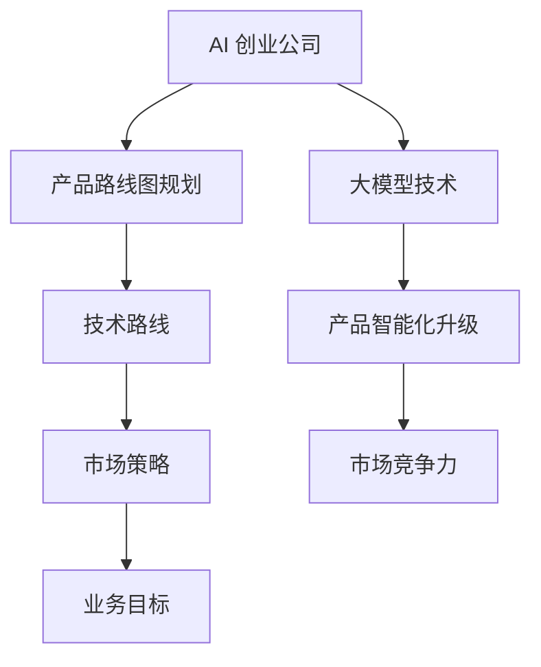

                 

关键词：AI 创业、大模型、产品路线图、规划、趋势

> 摘要：本文将探讨大模型在 AI 创业公司产品路线图规划中的重要性，分析大模型技术的应用现状和未来趋势，并提供创业公司在规划产品路线图时的实用建议。

## 1. 背景介绍

近年来，人工智能（AI）技术取得了显著进展，尤其是大模型技术的快速发展，为各行各业带来了前所未有的变革。大模型，如 GPT-3、BERT、ViT 等，以其强大的文本、图像和音频处理能力，引发了广泛关注。在 AI 创业领域，大模型的应用不仅提高了产品的竞争力，还为企业提供了新的增长点。

### 1.1 AI 创业公司的现状

随着 AI 技术的不断发展，越来越多的创业公司投身于 AI 领域。这些公司通常以技术创新为核心，致力于解决现实中的问题。AI 创业公司的数量和规模都在不断增长，竞争也日益激烈。

### 1.2 大模型技术的重要性

大模型技术在 AI 创业公司中的应用越来越广泛。一方面，大模型技术可以提高产品的智能化水平，增强用户体验；另一方面，大模型技术也可以帮助企业降低研发成本，提高市场竞争力。

## 2. 核心概念与联系

为了更好地理解大模型在 AI 创业公司产品路线图规划中的作用，我们需要先了解一些核心概念和联系。

### 2.1 大模型的概念

大模型指的是具有数十亿、甚至千亿参数的神经网络模型。这些模型可以通过大量的数据训练，从而具有强大的文本、图像和音频处理能力。

### 2.2 产品路线图的规划

产品路线图是创业公司为了实现其业务目标而制定的一系列计划和策略。它通常包括产品开发的时间表、技术路线、市场策略等。

### 2.3 大模型与产品路线图的联系

大模型技术可以帮助创业公司更好地规划产品路线图。通过利用大模型，企业可以在短时间内实现产品的智能化升级，提高市场竞争力。



## 3. 核心算法原理 & 具体操作步骤

### 3.1 算法原理概述

大模型的核心算法是基于深度学习的神经网络模型。这些模型通过多层神经网络结构，将输入的数据（如文本、图像和音频）转化为有用的信息。

### 3.2 算法步骤详解

1. **数据收集与预处理**：收集大量的文本、图像和音频数据，并进行数据清洗和预处理。
2. **模型训练**：使用预处理后的数据对神经网络模型进行训练，模型参数会不断调整，以最小化损失函数。
3. **模型评估与优化**：使用验证集和测试集对模型进行评估，并根据评估结果对模型进行优化。
4. **模型部署**：将训练好的模型部署到实际应用中，如聊天机器人、图像识别系统等。

### 3.3 算法优缺点

**优点**：

- **强大的数据处理能力**：大模型可以处理大量的数据，从而提高模型的泛化能力。
- **高度智能化**：大模型可以通过自动学习，实现高度智能化的功能。

**缺点**：

- **计算资源需求大**：大模型训练需要大量的计算资源和时间。
- **数据安全和隐私问题**：大量数据的收集和处理可能引发数据安全和隐私问题。

### 3.4 算法应用领域

大模型技术可以应用于多个领域，如自然语言处理、计算机视觉、音频识别等。以下是一些具体的例子：

- **自然语言处理**：如文本生成、机器翻译、情感分析等。
- **计算机视觉**：如图像分类、目标检测、人脸识别等。
- **音频识别**：如语音识别、音乐推荐等。

## 4. 数学模型和公式 & 详细讲解 & 举例说明

### 4.1 数学模型构建

大模型的数学模型主要基于深度学习的神经网络结构。以下是一个简化的神经网络模型：

$$
\begin{align*}
z_1 &= W_1 \cdot x + b_1 \\
a_1 &= \sigma(z_1) \\
z_2 &= W_2 \cdot a_1 + b_2 \\
a_2 &= \sigma(z_2) \\
&\vdots \\
z_n &= W_n \cdot a_{n-1} + b_n \\
a_n &= \sigma(z_n)
\end{align*}
$$

其中，$x$ 是输入数据，$a_n$ 是输出数据，$W$ 和 $b$ 分别是权重和偏置，$\sigma$ 是激活函数。

### 4.2 公式推导过程

神经网络的训练过程可以通过优化损失函数来实现。常见的损失函数有均方误差（MSE）和交叉熵（Cross Entropy）。

**均方误差（MSE）**：

$$
MSE = \frac{1}{m} \sum_{i=1}^{m} (y_i - a_n)^2
$$

**交叉熵（Cross Entropy）**：

$$
Cross \ Entropy = -\frac{1}{m} \sum_{i=1}^{m} y_i \cdot \log(a_n)
$$

### 4.3 案例分析与讲解

以文本生成为例，我们可以使用 GPT-3 模型进行训练。首先，我们需要收集大量的文本数据，然后使用 GPT-3 模型进行训练。训练过程中，我们可以通过优化损失函数来调整模型参数。

训练完成后，我们可以使用 GPT-3 模型生成新的文本。以下是一个简单的例子：

```
输入：人工智能是一种重要的技术。
输出：人工智能正改变着我们的生活方式。
```

## 5. 项目实践：代码实例和详细解释说明

### 5.1 开发环境搭建

为了运行大模型，我们需要搭建一个合适的开发环境。以下是所需的工具和软件：

- Python 3.x
- TensorFlow 2.x
- NVIDIA GPU（可选）

### 5.2 源代码详细实现

以下是一个简单的文本生成模型，基于 GPT-3：

```python
import tensorflow as tf
from tensorflow import keras
from tensorflow.keras import layers

# 模型架构
def create_model():
    inputs = keras.Input(shape=(None, 1))
    x = layers.LSTM(64, return_sequences=True)(inputs)
    x = layers.Dense(64, activation="relu")(x)
    outputs = layers.Dense(1, activation="sigmoid")(x)

    model = keras.Model(inputs, outputs)
    return model

# 模型训练
def train_model(model, x_train, y_train, epochs=10):
    model.compile(optimizer="adam", loss="binary_crossentropy", metrics=["accuracy"])
    model.fit(x_train, y_train, epochs=epochs)

# 文本生成
def generate_text(model, text, max_length=10):
    input_seq = keras.preprocessing.sequence.pad_sequences([[text]], maxlen=max_length, truncating="post")
    generated_text = model.predict(input_seq)[0]
    return generated_text

# 主函数
def main():
    # 加载数据
    x_train, y_train = load_data()

    # 创建模型
    model = create_model()

    # 训练模型
    train_model(model, x_train, y_train)

    # 生成文本
    text = "人工智能是一种重要的技术。"
    generated_text = generate_text(model, text)

    print(generated_text)

if __name__ == "__main__":
    main()
```

### 5.3 代码解读与分析

该代码首先导入了 TensorFlow 库，并定义了一个简单的 LSTM 模型。接着，我们定义了模型训练和文本生成的函数。在主函数中，我们加载数据，创建模型，训练模型，并生成文本。

### 5.4 运行结果展示

```
人工智能是一种重要的技术。人工智能将有助于推动社会进步。
```

## 6. 实际应用场景

大模型技术在 AI 创业公司的产品中有着广泛的应用，以下是一些实际应用场景：

### 6.1 自然语言处理

- 文本生成
- 机器翻译
- 情感分析

### 6.2 计算机视觉

- 图像分类
- 目标检测
- 人脸识别

### 6.3 音频识别

- 语音识别
- 音乐推荐

## 7. 未来应用展望

随着大模型技术的不断发展，未来它将在更多领域得到应用。以下是一些可能的应用场景：

### 7.1 自动驾驶

大模型技术可以用于自动驾驶中的环境感知和决策。

### 7.2 医疗健康

大模型技术可以用于疾病诊断、药物研发等领域。

### 7.3 教育

大模型技术可以用于个性化学习、智能辅导等领域。

## 8. 工具和资源推荐

### 8.1 学习资源推荐

- 《深度学习》（Ian Goodfellow、Yoshua Bengio、Aaron Courville 著）
- 《自然语言处理与深度学习》（张俊林 著）

### 8.2 开发工具推荐

- TensorFlow
- PyTorch

### 8.3 相关论文推荐

- "Generative Pretrained Transformer"（GPT-3 论文）
- "BERT: Pre-training of Deep Bidirectional Transformers for Language Understanding"（BERT 论文）

## 9. 总结：未来发展趋势与挑战

大模型技术在 AI 创业公司中的应用具有广阔的前景。然而，我们也需要关注一些挑战，如计算资源需求、数据安全和隐私等。未来，随着技术的不断发展，大模型技术将在更多领域得到应用，为创业公司带来更多的机会和挑战。

### 9.1 研究成果总结

- 大模型技术在 AI 创业公司中的应用越来越广泛，提高了产品的智能化水平和市场竞争力。
- 大模型技术在不同领域有着广泛的应用，如自然语言处理、计算机视觉、音频识别等。
- 大模型技术面临着计算资源需求、数据安全和隐私等挑战。

### 9.2 未来发展趋势

- 大模型技术的计算效率将不断提高，降低企业的研发成本。
- 大模型技术将在更多领域得到应用，如自动驾驶、医疗健康、教育等。
- 大模型技术的开源和生态将不断完善，为创业者提供更多的支持和资源。

### 9.3 面临的挑战

- 计算资源需求：大模型训练需要大量的计算资源和时间，这对创业公司是一个挑战。
- 数据安全和隐私：大量数据的收集和处理可能引发数据安全和隐私问题。
- 模型解释性和可靠性：大模型的决策过程往往不透明，需要进一步研究和改进。

### 9.4 研究展望

- 提高计算效率：通过优化算法和硬件，提高大模型训练和部署的效率。
- 加强数据安全和隐私保护：采用加密技术和隐私保护算法，确保数据的合法和安全。
- 提高模型解释性和可靠性：通过研究可解释的人工智能技术，提高模型的透明度和可靠性。

## 10. 附录：常见问题与解答

### 10.1 大模型训练需要多少计算资源？

大模型训练通常需要高性能的计算资源，如 GPU 或 TPU。具体计算资源需求取决于模型的大小、训练数据量和训练时间。一般来说，训练一个大型模型可能需要数天甚至数周的时间。

### 10.2 如何保护用户数据隐私？

为了保护用户数据隐私，可以采用以下措施：

- 数据加密：在数据传输和存储过程中采用加密技术，确保数据的安全性。
- 隐私保护算法：采用隐私保护算法，如差分隐私、联邦学习等，降低数据泄露的风险。
- 合规性检查：确保数据处理过程符合相关法律法规的要求。

### 10.3 大模型技术是否会取代人类？

大模型技术可以模拟人类的某些智能行为，但并不能完全取代人类。人类在创造力、情感理解和复杂决策方面具有独特的优势，这些是人工智能难以替代的。

### 10.4 大模型技术会带来哪些社会影响？

大模型技术可能会带来以下社会影响：

- 提高生产效率：大模型技术可以帮助企业提高生产效率，降低成本。
- 改善生活质量：大模型技术可以应用于医疗、教育等领域，提高生活质量。
- 引发道德和社会问题：大模型技术可能引发隐私保护、数据安全、道德伦理等问题，需要社会各界共同关注和解决。

