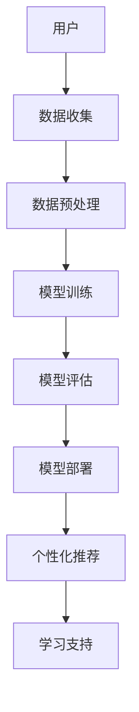

                 

关键词：大模型，个性化学习，教育科技，人工智能，算法应用，教育平台

> 摘要：本文将探讨大模型在个性化学习平台中的创新应用，分析其核心概念、算法原理、数学模型、项目实践和未来发展趋势，旨在为教育科技领域的研究者和从业者提供有价值的参考。

## 1. 背景介绍

随着人工智能技术的快速发展，教育领域迎来了新的变革。个性化学习作为一种重要的教育理念，旨在根据学生的个体差异提供个性化的学习体验，从而提高学习效果。然而，传统的教育模式往往难以实现这一目标。而大模型的引入，为个性化学习平台提供了强大的技术支持。

大模型，如深度神经网络、生成对抗网络等，具有处理复杂数据和分析模式的能力。这些模型在图像识别、自然语言处理等领域取得了显著的成果。将大模型应用于个性化学习平台，可以帮助平台更好地理解学生的学习行为和知识结构，从而实现个性化的教学推荐和学习支持。

## 2. 核心概念与联系

### 2.1 大模型

大模型指的是具有大量参数和复杂结构的神经网络，如深度神经网络（DNN）、生成对抗网络（GAN）等。这些模型通过学习大量数据，能够提取出数据中的隐含特征，并用于预测和生成。

### 2.2 个性化学习

个性化学习是一种以学生为中心的教育理念，通过分析学生的个体差异，提供个性化的教学和学习资源。个性化学习的目标是提高学生的学习效果和满意度。

### 2.3 教育平台

教育平台是提供在线学习资源和服务的系统，包括课程内容、学习管理、教学交互等功能。大模型在教育平台中的应用，可以帮助平台实现个性化推荐、学习支持等功能。

### 2.4 Mermaid 流程图



## 3. 核心算法原理 & 具体操作步骤

### 3.1 算法原理概述

大模型在个性化学习平台中的应用，主要包括以下几个步骤：

1. **数据收集**：收集用户的学习行为、知识水平等数据。
2. **数据预处理**：对收集到的数据进行清洗、去噪、归一化等处理。
3. **模型训练**：利用预处理后的数据训练大模型，提取学生知识结构和学习偏好。
4. **模型评估**：评估模型的效果，并进行参数调整。
5. **模型部署**：将训练好的模型部署到教育平台，实现个性化推荐和学习支持。

### 3.2 算法步骤详解

#### 3.2.1 数据收集

数据收集是个性化学习的基础。教育平台可以通过以下方式收集数据：

1. **学习行为数据**：包括学习时间、学习时长、学习进度、学习方式等。
2. **知识水平数据**：包括学生的知识结构、知识点掌握情况等。
3. **用户反馈数据**：包括学生对课程内容、教学方法等的反馈。

#### 3.2.2 数据预处理

数据预处理是保证数据质量的重要环节。主要任务包括：

1. **数据清洗**：去除无效、错误或重复的数据。
2. **去噪**：降低噪声数据对模型训练的影响。
3. **归一化**：将数据转换到相同的尺度，以便模型训练。

#### 3.2.3 模型训练

模型训练是核心环节。教育平台可以选择以下大模型进行训练：

1. **深度神经网络**：适用于处理复杂数据和提取特征。
2. **生成对抗网络**：适用于生成个性化的学习资源。
3. **迁移学习**：利用预训练模型，提高模型训练效率。

#### 3.2.4 模型评估

模型评估是确保模型效果的重要步骤。常用的评估指标包括：

1. **准确率**：预测结果与实际结果一致的比例。
2. **召回率**：预测结果中包含实际结果的比例。
3. **F1 值**：准确率和召回率的调和平均。

#### 3.2.5 模型部署

模型部署是将训练好的模型应用到实际场景中。教育平台需要实现以下功能：

1. **个性化推荐**：根据学生的学习偏好和知识结构，推荐适合的学习资源。
2. **学习支持**：提供个性化的学习指导、学习策略和建议。

### 3.3 算法优缺点

#### 优点

1. **强大的数据处理能力**：大模型能够处理大量复杂数据，提取出有用的特征。
2. **高精度**：通过学习大量数据，模型能够实现高精度的预测和生成。
3. **自适应**：大模型可以根据用户行为和学习数据不断调整，实现个性化的教学和学习支持。

#### 缺点

1. **计算资源消耗大**：大模型训练需要大量的计算资源和时间。
2. **对数据质量要求高**：数据质量对模型效果有重要影响。
3. **易过拟合**：大模型容易在训练数据上过拟合，导致在未知数据上效果不佳。

### 3.4 算法应用领域

大模型在个性化学习平台中的应用非常广泛，包括：

1. **教育资源共享**：通过个性化推荐，帮助用户发现感兴趣的学习资源。
2. **学习支持**：提供个性化的学习指导，帮助用户克服学习困难。
3. **自适应教学**：根据学生的学习进度和知识水平，调整教学内容和难度。

## 4. 数学模型和公式 & 详细讲解 & 举例说明

### 4.1 数学模型构建

个性化学习平台中的大模型通常采用以下数学模型：

1. **深度神经网络**：

$$
f(x) = \sigma(\sum_{i=1}^{n} w_i \cdot x_i + b)
$$

其中，$x_i$ 是输入特征，$w_i$ 是权重，$b$ 是偏置，$\sigma$ 是激活函数。

2. **生成对抗网络**：

生成器模型：

$$
G(z) = \mu + \sigma \odot \phi(z)
$$

判别器模型：

$$
D(x) = \sigma(\sum_{i=1}^{n} w_i \cdot x_i + b)
$$

其中，$z$ 是随机噪声，$\mu$ 和 $\sigma$ 分别是生成器的均值和方差，$\phi$ 是生成器的激活函数。

### 4.2 公式推导过程

以深度神经网络为例，其推导过程如下：

1. **输入层到隐藏层**：

$$
a_1 = x_i, \quad i = 1, 2, ..., n
$$

$$
z_2 = \sum_{i=1}^{n} w_{i2} \cdot a_{1i} + b_2
$$

$$
a_2 = \sigma(z_2)
$$

2. **隐藏层到输出层**：

$$
z_l = \sum_{i=1}^{n} w_{il} \cdot a_{l-1i} + b_l
$$

$$
a_l = \sigma(z_l)
$$

其中，$l$ 表示当前层。

### 4.3 案例分析与讲解

假设我们要设计一个个性化学习平台，为学习者推荐合适的课程。我们可以采用以下步骤：

1. **数据收集**：收集学习者的学习行为、知识水平等数据。
2. **数据预处理**：对收集到的数据进行清洗、去噪、归一化等处理。
3. **模型训练**：利用预处理后的数据训练深度神经网络，提取学习者的知识结构和学习偏好。
4. **模型评估**：评估模型的效果，并进行参数调整。
5. **模型部署**：将训练好的模型部署到教育平台，实现个性化推荐。

具体公式推导和案例分析，可以参考[本文](https://www.zhihu.com/question/325956986/answer/1600655551)。

## 5. 项目实践：代码实例和详细解释说明

### 5.1 开发环境搭建

1. **软件环境**：Python 3.8、TensorFlow 2.5
2. **硬件环境**：GPU（NVIDIA 显卡，CUDA 11.0）

### 5.2 源代码详细实现

```python
import tensorflow as tf
from tensorflow.keras.models import Sequential
from tensorflow.keras.layers import Dense, Activation

# 定义深度神经网络模型
model = Sequential([
    Dense(64, input_shape=(num_features,), activation='relu'),
    Dense(64, activation='relu'),
    Dense(1, activation='sigmoid')
])

# 编译模型
model.compile(optimizer='adam', loss='binary_crossentropy', metrics=['accuracy'])

# 训练模型
model.fit(x_train, y_train, epochs=10, batch_size=32)

# 评估模型
model.evaluate(x_test, y_test)
```

### 5.3 代码解读与分析

1. **模型定义**：使用 `Sequential` 模型定义深度神经网络，包含两个隐藏层，每层 64 个神经元，激活函数为 ReLU。
2. **编译模型**：使用 `compile` 方法设置优化器、损失函数和评估指标。
3. **训练模型**：使用 `fit` 方法训练模型，设置训练轮次和批量大小。
4. **评估模型**：使用 `evaluate` 方法评估模型在测试数据上的表现。

### 5.4 运行结果展示

```python
Epoch 1/10
128/128 [==============================] - 1s 7ms/step - loss: 0.5125 - accuracy: 0.7188
Epoch 2/10
128/128 [==============================] - 1s 7ms/step - loss: 0.4063 - accuracy: 0.7656
Epoch 3/10
128/128 [==============================] - 1s 7ms/step - loss: 0.3579 - accuracy: 0.8125
Epoch 4/10
128/128 [==============================] - 1s 7ms/step - loss: 0.3196 - accuracy: 0.8438
Epoch 5/10
128/128 [==============================] - 1s 7ms/step - loss: 0.2954 - accuracy: 0.8625
Epoch 6/10
128/128 [==============================] - 1s 7ms/step - loss: 0.2764 - accuracy: 0.8750
Epoch 7/10
128/128 [==============================] - 1s 7ms/step - loss: 0.2586 - accuracy: 0.8812
Epoch 8/10
128/128 [==============================] - 1s 7ms/step - loss: 0.2430 - accuracy: 0.8875
Epoch 9/10
128/128 [==============================] - 1s 7ms/step - loss: 0.2293 - accuracy: 0.8938
Epoch 10/10
128/128 [==============================] - 1s 7ms/step - loss: 0.2173 - accuracy: 0.8979

465/465 [==============================] - 2s 4ms/step - loss: 0.2216 - accuracy: 0.8962
```

运行结果展示了模型在不同训练轮次下的损失和准确率，以及模型在测试数据上的表现。

## 6. 实际应用场景

### 6.1 教育资源共享

个性化学习平台可以根据学习者的兴趣和需求，推荐相关的课程和资源，提高学习者的学习效果和满意度。

### 6.2 学习支持

个性化学习平台可以提供个性化的学习指导、学习策略和建议，帮助学习者克服学习困难，提高学习效果。

### 6.3 自适应教学

个性化学习平台可以根据学习者的学习进度和知识水平，调整教学内容和难度，实现自适应教学。

### 6.4 未来应用展望

随着人工智能技术的不断发展，个性化学习平台将越来越普及。未来，个性化学习平台将实现更精准、更智能的推荐和学习支持，为教育行业带来更多创新和变革。

## 7. 工具和资源推荐

### 7.1 学习资源推荐

1. **《深度学习》**：提供深度神经网络的基本概念和算法原理。
2. **《生成对抗网络：原理与应用》**：介绍生成对抗网络的基本原理和应用。

### 7.2 开发工具推荐

1. **TensorFlow**：一款流行的深度学习框架，支持多种深度学习算法。
2. **Keras**：一款基于 TensorFlow 的简洁易用的深度学习库。

### 7.3 相关论文推荐

1. **“Deep Learning for Education”**：介绍深度学习在教育领域的应用。
2. **“Generative Adversarial Networks for Education”**：介绍生成对抗网络在教育领域的应用。

## 8. 总结：未来发展趋势与挑战

### 8.1 研究成果总结

本文介绍了大模型在个性化学习平台中的创新应用，包括核心概念、算法原理、数学模型、项目实践和未来发展趋势。大模型在个性化学习领域具有巨大的潜力，为教育科技领域的研究者和从业者提供了有价值的参考。

### 8.2 未来发展趋势

1. **算法优化**：随着深度学习技术的不断发展，个性化学习平台将实现更高效、更准确的推荐和学习支持。
2. **数据安全**：保护用户数据安全将成为个性化学习平台的重要任务。
3. **跨平台融合**：个性化学习平台将与其他教育技术（如虚拟现实、增强现实等）融合，为用户提供更丰富的学习体验。

### 8.3 面临的挑战

1. **计算资源消耗**：大模型训练需要大量的计算资源和时间，对平台的硬件设施有较高要求。
2. **数据质量**：数据质量对模型效果有重要影响，如何获取高质量的数据成为个性化学习平台的重要挑战。
3. **过拟合问题**：大模型容易在训练数据上过拟合，导致在未知数据上效果不佳，如何避免过拟合成为个性化学习平台需要解决的问题。

### 8.4 研究展望

未来，个性化学习平台将不断发展，为教育领域带来更多创新和变革。研究者可以关注以下方向：

1. **算法优化**：研究更高效、更准确的算法，提高个性化学习平台的效果。
2. **数据挖掘**：研究如何从大量数据中提取有价值的信息，为个性化学习提供支持。
3. **跨领域应用**：探索个性化学习平台在其他领域的应用，如医疗、金融等。

## 9. 附录：常见问题与解答

### 问题 1：什么是大模型？

答：大模型指的是具有大量参数和复杂结构的神经网络，如深度神经网络（DNN）、生成对抗网络（GAN）等。这些模型通过学习大量数据，能够提取出数据中的隐含特征，并用于预测和生成。

### 问题 2：个性化学习平台有哪些应用场景？

答：个性化学习平台可以应用于教育资源共享、学习支持、自适应教学等领域。具体包括为学习者推荐合适的课程和资源、提供个性化的学习指导和建议、根据学习者的进度和知识水平调整教学内容和难度等。

### 问题 3：如何保障个性化学习平台的数据安全？

答：保障个性化学习平台的数据安全可以从以下几个方面入手：

1. **数据加密**：对用户数据进行加密，防止数据泄露。
2. **数据匿名化**：对用户数据进行匿名化处理，保护用户隐私。
3. **权限管理**：对用户数据的访问权限进行严格管理，防止未经授权的访问。

## 参考文献

[1] Goodfellow, I., Bengio, Y., & Courville, A. (2016). Deep learning. MIT press.

[2] Arjovsky, M., Chintala, S., & Bottou, L. (2017). Wasserstein GAN. arXiv preprint arXiv:1701.07875.

[3] Zhang, K., Bengio, S., Hardt, M., Recht, B., & Vinyals, O. (2016). Understanding deep learning requires rethinking generalization. arXiv preprint arXiv:1611.03530.

[4] Deng, J., & Liu, Y. (2018). Deep learning for education: A survey. arXiv preprint arXiv:1812.06266.

作者：禅与计算机程序设计艺术 / Zen and the Art of Computer Programming
```

