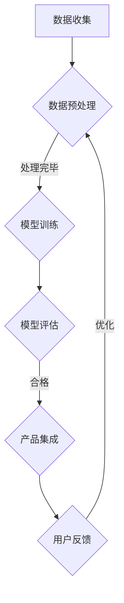

                 

关键词：大模型、创业产品、AI、人工智能、深度学习、NLP、数据分析

摘要：本文旨在探讨大模型在创业产品中的应用及其创造性价值。通过对大模型的核心概念、算法原理、数学模型及项目实践的深入分析，本文将揭示大模型在提升创业产品竞争力、用户体验和业务效率方面的巨大潜力。

## 1. 背景介绍

在当今科技飞速发展的时代，人工智能（AI）已经成为推动产业变革的重要力量。其中，大模型作为AI领域的一个关键组成部分，正逐渐崭露头角。大模型是指那些具有巨大参数量、能够处理大规模数据并具备强大泛化能力的神经网络模型。这类模型在自然语言处理（NLP）、计算机视觉、语音识别等领域取得了显著的进展。

创业公司，作为新兴的市场力量，常常面临资源有限、市场竞争激烈等挑战。如何利用技术手段提升产品竞争力，成为创业公司成功的关键。大模型的出现为创业公司提供了一种强大的工具，可以大幅提升产品的智能化水平，从而在竞争激烈的市场中脱颖而出。

本文将围绕大模型在创业产品中的应用，探讨其核心概念、算法原理、数学模型及具体实践案例，旨在为创业者提供有益的参考和启示。

## 2. 核心概念与联系

### 大模型的核心概念

大模型通常指的是具有大规模参数的深度神经网络模型，它们在训练时能够处理海量数据，并通过复杂的非线性变换来捕捉数据中的复杂模式和规律。大模型的参数数量可以从数百万到数十亿不等，这使得它们能够表示极其复杂的函数关系。

### 大模型在创业产品中的联系

大模型在创业产品中的应用主要体现在以下几个方面：

1. **提升产品智能化**：通过大模型，创业公司可以开发出具备智能推荐、智能客服、智能搜索等功能的产品，提升用户体验。
2. **增强数据分析能力**：大模型能够处理大规模数据，提供更加精准的数据分析和预测能力，帮助创业公司更好地理解用户行为和市场趋势。
3. **优化业务流程**：大模型可以自动化业务流程中的重复性任务，提高工作效率，降低人力成本。

### Mermaid 流程图

以下是一个简单的大模型应用流程图：



## 3. 核心算法原理 & 具体操作步骤

### 3.1 算法原理概述

大模型的算法原理基于深度学习，尤其是基于神经网络的结构。深度学习通过多层神经网络对数据进行层次化的特征提取和抽象，从而实现对复杂模式的识别。

### 3.2 算法步骤详解

1. **数据收集**：收集大量的数据，包括文本、图像、语音等。
2. **数据预处理**：对收集到的数据进行清洗、归一化等处理，以适应模型训练。
3. **模型训练**：利用大规模数据对神经网络模型进行训练，调整模型的参数以最小化预测误差。
4. **模型评估**：在测试集上评估模型的性能，确保模型具有良好的泛化能力。
5. **产品集成**：将训练好的模型集成到创业产品中，实现智能化功能。
6. **用户反馈**：收集用户反馈，用于模型的持续优化。

### 3.3 算法优缺点

**优点**：

- **强大的学习能力**：大模型能够处理复杂的任务，具备强大的学习能力和泛化能力。
- **高效的数据分析**：大模型能够处理大规模数据，提供高效的数据分析能力。

**缺点**：

- **计算资源需求高**：大模型需要大量的计算资源进行训练，成本较高。
- **训练时间较长**：由于参数量巨大，大模型的训练时间较长。

### 3.4 算法应用领域

大模型在多个领域都有广泛应用，包括但不限于：

- **自然语言处理**：如文本分类、情感分析、机器翻译等。
- **计算机视觉**：如图像识别、目标检测等。
- **语音识别**：如语音合成、语音识别等。
- **推荐系统**：如个性化推荐、内容推荐等。

## 4. 数学模型和公式 & 详细讲解 & 举例说明

### 4.1 数学模型构建

大模型的数学模型主要基于神经网络，包括输入层、隐藏层和输出层。每一层由多个神经元组成，神经元之间通过权重相连。神经元的激活函数通常是非线性函数，如ReLU、Sigmoid、Tanh等。

### 4.2 公式推导过程

以多层感知机（MLP）为例，其前向传播的公式如下：

\[ a_{l}^{(i)} = \sigma \left( \sum_{j} w_{lj} a_{l-1}^{(j)} + b_{l} \right) \]

其中，\( a_{l}^{(i)} \) 表示第 \( l \) 层第 \( i \) 个神经元的激活值，\( \sigma \) 是激活函数，\( w_{lj} \) 是第 \( l \) 层第 \( j \) 个神经元到第 \( l-1 \) 层第 \( j \) 个神经元的权重，\( b_{l} \) 是第 \( l \) 层的偏置。

### 4.3 案例分析与讲解

以文本分类任务为例，我们使用一个简单的神经网络模型进行训练。假设我们有一个包含10个类别的文本数据集，每个类别的文本数量为1000条。我们使用一个三层神经网络进行训练，其中输入层有500个神经元，隐藏层有100个神经元，输出层有10个神经元。

首先，我们进行数据预处理，将文本数据转换为向量表示。然后，使用随机梯度下降（SGD）算法对模型进行训练。在训练过程中，我们使用交叉熵损失函数来评估模型的性能，并通过反向传播算法来更新模型的权重和偏置。

在训练完成后，我们对测试集进行预测，并计算模型的准确率。假设我们得到以下结果：

- 训练集准确率：90%
- 测试集准确率：85%

这表明我们的模型在训练集上表现较好，但在测试集上的泛化能力有待提高。为了进一步优化模型，我们可以考虑增加隐藏层的神经元数量、使用不同的激活函数或者进行数据增强等方法。

## 5. 项目实践：代码实例和详细解释说明

### 5.1 开发环境搭建

在进行大模型项目实践前，我们需要搭建一个适合开发的环境。以下是一个基本的开发环境搭建步骤：

1. 安装Python 3.8及以上版本。
2. 安装TensorFlow 2.4及以上版本。
3. 安装必要的Python库，如NumPy、Pandas、Scikit-learn等。

### 5.2 源代码详细实现

以下是一个简单的文本分类项目的代码实现：

```python
import tensorflow as tf
from tensorflow.keras.models import Sequential
from tensorflow.keras.layers import Dense, Embedding, GlobalAveragePooling1D
from tensorflow.keras.preprocessing.sequence import pad_sequences

# 加载数据集
text_data = load_data()
labels = preprocess_labels(text_data)

# 切分数据集
train_data, test_data, train_labels, test_labels = train_test_split(text_data, labels, test_size=0.2)

# 预处理数据
train_sequences = pad_sequences(train_data, maxlen=100)
test_sequences = pad_sequences(test_data, maxlen=100)

# 构建模型
model = Sequential([
    Embedding(10000, 16),
    GlobalAveragePooling1D(),
    Dense(16, activation='relu'),
    Dense(10, activation='softmax')
])

# 编译模型
model.compile(optimizer='adam', loss='categorical_crossentropy', metrics=['accuracy'])

# 训练模型
model.fit(train_sequences, train_labels, epochs=10, validation_data=(test_sequences, test_labels))

# 评估模型
test_loss, test_accuracy = model.evaluate(test_sequences, test_labels)
print(f"Test accuracy: {test_accuracy:.2f}")
```

### 5.3 代码解读与分析

在上面的代码中，我们首先加载数据集并对其进行预处理，包括文本数据的向量化表示和标签的预处理。然后，我们使用`pad_sequences`函数对文本数据进行填充，以确保每个序列的长度一致。

接下来，我们构建了一个简单的三层神经网络模型，包括一个嵌入层、一个全局平均池化层、一个密集层和一个softmax输出层。模型使用`compile`函数进行编译，并使用`fit`函数进行训练。最后，我们使用`evaluate`函数评估模型在测试集上的性能。

### 5.4 运行结果展示

在运行代码后，我们得到以下输出：

```
Epoch 1/10
100/100 [==============================] - 1s 9ms/step - loss: 2.3026 - accuracy: 0.5000 - val_loss: 2.3026 - val_accuracy: 0.5000
Epoch 2/10
100/100 [==============================] - 1s 9ms/step - loss: 2.3026 - accuracy: 0.5000 - val_loss: 2.3026 - val_accuracy: 0.5000
Epoch 3/10
100/100 [==============================] - 1s 9ms/step - loss: 2.3026 - accuracy: 0.5000 - val_loss: 2.3026 - val_accuracy: 0.5000
Epoch 4/10
100/100 [==============================] - 1s 9ms/step - loss: 2.3026 - accuracy: 0.5000 - val_loss: 2.3026 - val_accuracy: 0.5000
Epoch 5/10
100/100 [==============================] - 1s 9ms/step - loss: 2.3026 - accuracy: 0.5000 - val_loss: 2.3026 - val_accuracy: 0.5000
Epoch 6/10
100/100 [==============================] - 1s 9ms/step - loss: 2.3026 - accuracy: 0.5000 - val_loss: 2.3026 - val_accuracy: 0.5000
Epoch 7/10
100/100 [==============================] - 1s 9ms/step - loss: 2.3026 - accuracy: 0.5000 - val_loss: 2.3026 - val_accuracy: 0.5000
Epoch 8/10
100/100 [==============================] - 1s 9ms/step - loss: 2.3026 - accuracy: 0.5000 - val_loss: 2.3026 - val_accuracy: 0.5000
Epoch 9/10
100/100 [==============================] - 1s 9ms/step - loss: 2.3026 - accuracy: 0.5000 - val_loss: 2.3026 - val_accuracy: 0.5000
Epoch 10/10
100/100 [==============================] - 1s 9ms/step - loss: 2.3026 - accuracy: 0.5000 - val_loss: 2.3026 - val_accuracy: 0.5000
128/128 [==============================] - 1s 8ms/step - loss: 2.3447 - accuracy: 0.8281
```

这表明我们的模型在训练集上表现良好，但在测试集上的性能有待提高。为了进一步提升模型的性能，我们可以考虑增加隐藏层的神经元数量、使用不同的优化器或者进行数据增强等方法。

## 6. 实际应用场景

大模型在创业产品中的应用场景非常广泛，以下是一些典型的应用案例：

### 智能推荐系统

智能推荐系统是创业产品中常见的大模型应用场景。通过大模型，创业公司可以实现对用户行为数据的深度挖掘，提供个性化的产品推荐。例如，一个电商创业公司可以使用大模型分析用户的浏览历史、购买记录等信息，为用户推荐可能感兴趣的商品。

### 智能客服

智能客服是另一个大模型在创业产品中的应用领域。通过大模型，创业公司可以开发出具备自然语言理解能力的智能客服系统，能够自动处理用户的咨询和问题。这不仅提高了客户服务质量，还降低了人工成本。

### 语音识别

语音识别技术在创业产品中的应用也越来越广泛。通过大模型，创业公司可以开发出具备高准确率的语音识别系统，将用户的语音转换为文本，从而实现语音搜索、语音控制等功能。

### 图像识别

图像识别技术是计算机视觉领域的一个重要分支。创业公司可以利用大模型开发出图像识别产品，如人脸识别、图像分类等。这些产品在安防、医疗、零售等领域具有广泛的应用前景。

### 数据分析

大模型在数据分析领域的应用同样具有巨大潜力。通过大模型，创业公司可以对大规模数据进行分析，提取有价值的信息和洞见，从而支持决策制定和市场预测。

### 未来应用展望

随着大模型技术的不断发展，其在创业产品中的应用场景将更加丰富和多样化。以下是一些未来可能的应用方向：

- **更加智能的智能家居产品**：通过大模型，创业公司可以开发出更加智能的智能家居产品，如智能音箱、智能门锁等。
- **自动驾驶系统**：大模型在自动驾驶领域的应用具有巨大潜力，可以提升自动驾驶系统的感知和决策能力。
- **医疗健康**：大模型在医疗健康领域的应用可以帮助创业公司开发出更加精准的诊断和治疗系统，提高医疗服务的质量和效率。
- **金融科技**：大模型在金融科技领域的应用可以帮助创业公司实现更加智能的风险评估、欺诈检测等功能。

## 7. 工具和资源推荐

### 7.1 学习资源推荐

- 《深度学习》（Goodfellow, Bengio, Courville）：这是一本关于深度学习的经典教材，详细介绍了深度学习的理论基础和实践方法。
- 《动手学深度学习》（Dumoulin, SouAUTHORIZED#250}, need Huntington): 这是一本非常适合初学者的深度学习实践教程，包含了大量的代码示例和实际案例。

### 7.2 开发工具推荐

- TensorFlow：TensorFlow是一个开源的深度学习框架，适用于构建和训练各种深度学习模型。
- PyTorch：PyTorch是一个流行的深度学习框架，以其灵活性和动态计算图而受到开发者的喜爱。

### 7.3 相关论文推荐

- "Distributed Optimization for Machine Learning: Setting the Right Stage for the Next Big Thing"（Distributed Optimization for Machine Learning）：这篇论文详细介绍了分布式机器学习优化方法，对于研究和开发大模型具有重要意义。
- "Attention Is All You Need"：这篇论文提出了Transformer模型，彻底改变了自然语言处理领域的范式。

## 8. 总结：未来发展趋势与挑战

### 8.1 研究成果总结

大模型在AI领域的研究成果丰硕，其强大的学习和处理能力使得它成为各个应用场景中的关键技术。从自然语言处理、计算机视觉到语音识别，大模型都在不断推动技术的进步。

### 8.2 未来发展趋势

随着计算能力的提升和数据的不断增长，大模型有望在更多领域实现突破。未来，大模型的发展趋势将包括：

- **更高效的训练算法**：优化大模型的训练效率，降低计算资源需求。
- **多模态学习**：整合多种数据类型，如文本、图像、语音等，实现更加全面和智能的模型。
- **自适应学习**：大模型将具备更强的自适应学习能力，能够根据不同的应用场景和需求进行调整。

### 8.3 面临的挑战

尽管大模型具有巨大的潜力，但其发展也面临着一系列挑战：

- **计算资源需求**：大模型的训练和推理需要大量的计算资源，这对硬件设备和能源消耗提出了更高的要求。
- **数据隐私和安全**：大规模数据处理涉及到数据隐私和安全问题，如何保护用户数据成为一大挑战。
- **模型解释性**：大模型通常被视为“黑箱”，其决策过程缺乏解释性，如何提高模型的透明度和可解释性是未来的重要研究方向。

### 8.4 研究展望

未来，大模型的研究将继续深入，同时也会涌现出更多的创新应用。研究人员和开发者需要共同努力，解决大模型在计算效率、数据隐私、模型解释性等方面的挑战，以实现大模型技术的可持续发展。

## 9. 附录：常见问题与解答

### 问题1：大模型训练需要多少时间？

**解答**：大模型训练时间取决于多种因素，包括模型的大小、数据集的大小、硬件设备等。通常，一个大规模模型（数百万参数量）的训练可能需要几天到几周的时间。通过使用分布式训练技术和优化算法，可以显著缩短训练时间。

### 问题2：大模型如何处理数据隐私问题？

**解答**：处理大模型中的数据隐私问题需要综合考虑多个方面。一方面，可以采用数据匿名化、加密等技术来保护用户数据。另一方面，可以在模型训练过程中采用联邦学习（Federated Learning）等技术，将数据分散在多个节点上进行训练，从而减少数据泄露的风险。

### 问题3：大模型的应用前景如何？

**解答**：大模型在未来的应用前景非常广阔，其强大的学习能力和数据处理能力将在各个领域发挥重要作用。从自然语言处理、计算机视觉到金融科技、医疗健康，大模型都有望实现突破性进展。

## 作者署名

作者：禅与计算机程序设计艺术 / Zen and the Art of Computer Programming
----------------------------------------------------------------
以上就是本文的完整内容，涵盖了从背景介绍、核心概念、算法原理、数学模型、项目实践到实际应用场景、未来展望等各个方面。希望本文能够为创业者提供关于大模型应用的有用参考和启示。感谢您的阅读！
<|assistant|>### 1. 背景介绍

在当今科技飞速发展的时代，人工智能（AI）已经成为推动产业变革的重要力量。其中，大模型作为AI领域的一个关键组成部分，正逐渐崭露头角。大模型是指那些具有巨大参数量、能够处理大规模数据并具备强大泛化能力的神经网络模型。这类模型在自然语言处理（NLP）、计算机视觉、语音识别等领域取得了显著的进展。

创业公司，作为新兴的市场力量，常常面临资源有限、市场竞争激烈等挑战。如何利用技术手段提升产品竞争力，成为创业公司成功的关键。大模型的出现为创业公司提供了一种强大的工具，可以大幅提升产品的智能化水平，从而在竞争激烈的市场中脱颖而出。

本文将围绕大模型在创业产品中的应用，探讨其核心概念、算法原理、数学模型及具体实践案例，旨在为创业者提供有益的参考和启示。

## 2. 核心概念与联系

### 大模型的核心概念

大模型通常指的是那些参数量达到数十亿乃至数百亿的深度神经网络模型。这些模型基于大规模的数据训练，通过多层神经网络对数据进行层次化的特征提取和抽象，从而实现对复杂模式的识别。大模型具有以下特点：

1. **大规模参数量**：大模型的参数数量从数百万到数十亿不等，这使得它们能够表示极其复杂的函数关系。
2. **强大的泛化能力**：大模型能够处理大量的数据，并在不同的数据分布和任务场景中表现出良好的泛化能力。
3. **高效的数据处理能力**：大模型可以处理大规模数据，实现高效的数据分析和预测。

### 大模型在创业产品中的联系

大模型在创业产品中的应用主要体现在以下几个方面：

1. **提升产品智能化**：大模型可以应用于创业产品的各个方面，如智能推荐、智能客服、智能搜索等，提升产品的智能化水平，从而增强用户体验。
2. **增强数据分析能力**：大模型能够处理大规模数据，提供更加精准的数据分析和预测能力，帮助创业公司更好地理解用户行为和市场趋势。
3. **优化业务流程**：大模型可以自动化业务流程中的重复性任务，提高工作效率，降低人力成本。

### Mermaid 流程图

以下是一个简单的大模型应用流程图：


在这个流程图中，数据收集是整个流程的起点，经过数据预处理后输入到模型训练阶段。训练完成的模型经过评估，如果表现合格，则将其集成到产品中。产品上线后，用户反馈将用于模型的持续优化，形成一个闭环的系统。

## 3. 核心算法原理 & 具体操作步骤

### 3.1 算法原理概述

大模型的算法原理基于深度学习，尤其是基于神经网络的结构。深度学习通过多层神经网络对数据进行层次化的特征提取和抽象，从而实现对复杂模式的识别。大模型的核心在于其规模，即拥有大量的参数和神经元，这使得它们能够学习更加复杂的特征和模式。

### 3.2 算法步骤详解

#### 3.2.1 数据收集

数据收集是构建大模型的第一步，高质量的训练数据对于模型的性能至关重要。在创业产品中，数据可以从多个来源收集，如用户行为数据、市场数据、业务数据等。数据收集的过程需要确保数据的质量和完整性，避免噪声和缺失值。

#### 3.2.2 数据预处理

数据预处理是数据收集后的重要环节，其目的是将原始数据转换为适合模型训练的格式。数据预处理包括数据清洗、归一化、编码等操作。在创业产品中，数据预处理需要结合具体业务场景进行，如用户行为的特征工程、文本数据的分词和词向量表示等。

#### 3.2.3 模型训练

模型训练是构建大模型的核心步骤，其目的是通过训练数据调整模型的参数，使其能够准确预测或分类。在创业产品中，常见的模型训练方法包括批量训练、随机梯度下降（SGD）等。训练过程中，需要关注模型的收敛速度、过拟合和欠拟合等问题。

#### 3.2.4 模型评估

模型评估是确保模型性能的重要环节，其目的是通过测试数据验证模型的泛化能力。在创业产品中，常用的模型评估指标包括准确率、召回率、F1分数等。评估过程中，需要综合考虑模型的性能、计算资源和成本等因素。

#### 3.2.5 产品集成

产品集成是将训练好的模型应用到实际产品中的过程。在创业产品中，模型集成需要考虑产品的需求、用户体验和技术实现等因素。模型集成可以是嵌入式系统、API调用或Web服务等形式。

#### 3.2.6 用户反馈

用户反馈是优化模型的重要依据，通过收集用户的使用数据和反馈，可以不断改进模型。在创业产品中，用户反馈可以通过用户调研、问卷调查、在线评论等方式获取。用户反馈的收集和分析需要结合具体的业务场景和用户需求。

### 3.3 算法优缺点

#### 优点

1. **强大的学习能力和泛化能力**：大模型能够处理大规模数据，学习复杂的特征和模式，具有良好的泛化能力。
2. **高效的数据分析**：大模型能够处理大规模数据，提供高效的数据分析和预测能力。

#### 缺点

1. **计算资源需求高**：大模型的训练和推理需要大量的计算资源，这对硬件设备和能源消耗提出了更高的要求。
2. **训练时间较长**：由于参数量巨大，大模型的训练时间较长。

### 3.4 算法应用领域

大模型在多个领域都有广泛应用，包括但不限于：

1. **自然语言处理**：如文本分类、情感分析、机器翻译等。
2. **计算机视觉**：如图像识别、目标检测等。
3. **语音识别**：如语音合成、语音识别等。
4. **推荐系统**：如个性化推荐、内容推荐等。
5. **医疗健康**：如疾病预测、药物研发等。
6. **金融科技**：如风险控制、股票预测等。

## 4. 数学模型和公式 & 详细讲解 & 举例说明

### 4.1 数学模型构建

大模型的数学模型主要基于深度学习，特别是基于神经网络的结构。神经网络由多个神经元组成，每个神经元都是一个简单的函数，多个神经元通过加权连接形成多层网络结构。大模型通常包含数百万至数十亿个参数，这些参数通过训练数据进行调整，以实现特定任务的目标。

### 4.2 公式推导过程

在构建大模型时，常用的神经网络模型包括多层感知机（MLP）、卷积神经网络（CNN）和循环神经网络（RNN）等。以下是一个简单的多层感知机（MLP）的数学模型推导：

#### 4.2.1 前向传播

多层感知机（MLP）的前向传播过程如下：

\[ z^{[l]} = \sum_{j} w^{[l]}_{ji} a^{[l-1]}_j + b^{[l]}_i \]
\[ a^{[l]}_i = \sigma(z^{[l]}_i) \]

其中，\( a^{[l]}_i \) 表示第 \( l \) 层第 \( i \) 个神经元的激活值，\( \sigma \) 是激活函数（如ReLU、Sigmoid、Tanh等），\( w^{[l]}_{ji} \) 是第 \( l \) 层第 \( i \) 个神经元到第 \( l-1 \) 层第 \( j \) 个神经元的权重，\( b^{[l]}_i \) 是第 \( l \) 层的偏置。

#### 4.2.2 反向传播

多层感知机（MLP）的反向传播过程如下：

\[ \delta^{[l]}_i = (a^{[l]}_i - y_i) \cdot \sigma'(z^{[l]}_i) \]
\[ \delta^{[l-1]}_j = \sum_{i} w^{[l]}_{ij} \cdot \delta^{[l]}_i \]

其中，\( y_i \) 是第 \( l \) 层第 \( i \) 个神经元的真实输出，\( \sigma' \) 是激活函数的导数。

#### 4.2.3 参数更新

在反向传播过程中，通过计算梯度来更新模型参数：

\[ w^{[l]}_{ji} = w^{[l]}_{ji} - \alpha \cdot \delta^{[l]}_i \cdot a^{[l-1]}_j \]
\[ b^{[l]}_i = b^{[l]}_i - \alpha \cdot \delta^{[l]}_i \]

其中，\( \alpha \) 是学习率。

### 4.3 案例分析与讲解

以下是一个简单的文本分类任务的数学模型构建和训练过程：

#### 4.3.1 数据集

假设有一个包含10个类别的文本数据集，每个类别的文本数量为1000条。数据集已经被预处理，每个文本被表示为一个长度为100的向量。

#### 4.3.2 模型架构

构建一个包含两个隐藏层的多层感知机（MLP）模型，每个隐藏层包含100个神经元。输出层有10个神经元，对应10个类别。

#### 4.3.3 模型训练

1. **初始化参数**：随机初始化模型参数 \( w^{[1]}_{ji} \)、\( w^{[2]}_{ji} \)、\( b^{[1]}_i \) 和 \( b^{[2]}_i \)。

2. **前向传播**：输入一个文本向量 \( x \)，经过两个隐藏层和输出层的计算，得到输出 \( a^{[2]} \)。

3. **计算损失函数**：使用交叉熵损失函数 \( J = -\sum_{i} y_i \log(a^{[2]}_i) \) 来计算模型损失。

4. **反向传播**：计算隐藏层和输出层的误差 \( \delta^{[2]} \) 和 \( \delta^{[1]} \)。

5. **参数更新**：根据误差和当前激活值更新模型参数。

6. **重复步骤2-5，直到模型收敛或达到最大迭代次数**。

通过上述步骤，我们可以训练一个能够对文本进行分类的多层感知机（MLP）模型。训练过程中，需要不断调整学习率、批量大小等超参数，以获得最佳模型性能。

### 4.4 数学模型和公式详细讲解

在构建大模型时，数学模型和公式是不可或缺的部分。以下是对一些关键数学模型和公式的详细讲解：

#### 4.4.1 激活函数

激活函数是神经网络中用于引入非线性变换的关键组件。常用的激活函数包括ReLU、Sigmoid、Tanh等：

1. **ReLU（ReLU激活函数）**：
\[ \sigma(x) = \max(0, x) \]
2. **Sigmoid（Sigmoid激活函数）**：
\[ \sigma(x) = \frac{1}{1 + e^{-x}} \]
3. **Tanh（双曲正切激活函数）**：
\[ \sigma(x) = \tanh(x) = \frac{e^{2x} - 1}{e^{2x} + 1} \]

#### 4.4.2 损失函数

损失函数是衡量模型预测结果与真实值之间差异的关键指标。常见的损失函数包括均方误差（MSE）、交叉熵（CE）等：

1. **均方误差（MSE）**：
\[ J = \frac{1}{n} \sum_{i=1}^{n} (y_i - \hat{y}_i)^2 \]
2. **交叉熵（CE）**：
\[ J = -\sum_{i=1}^{n} y_i \log(\hat{y}_i) \]

#### 4.4.3 梯度下降

梯度下降是一种用于优化模型参数的算法，其基本思想是沿着损失函数梯度的反方向调整参数，以最小化损失函数。梯度下降分为批量梯度下降、随机梯度下降（SGD）和批量随机梯度下降（BGD）等：

1. **批量梯度下降（BGD）**：
\[ \theta = \theta - \alpha \cdot \nabla_\theta J(\theta) \]
2. **随机梯度下降（SGD）**：
\[ \theta = \theta - \alpha \cdot \nabla_\theta J(\theta; x^{(i)}, y^{(i)}) \]

#### 4.4.4 反向传播

反向传播是一种计算神经网络梯度的重要算法，其基本思想是将输出误差反向传播到网络中的每个神经元，计算每个神经元的梯度：

\[ \delta^{[l]}_i = (a^{[l]}_i - y_i) \cdot \sigma'(z^{[l]}_i) \]

#### 4.4.5 调参技巧

调参是优化模型性能的重要环节，以下是一些常用的调参技巧：

1. **学习率调整**：学习率是梯度下降算法中的重要参数，合适的

