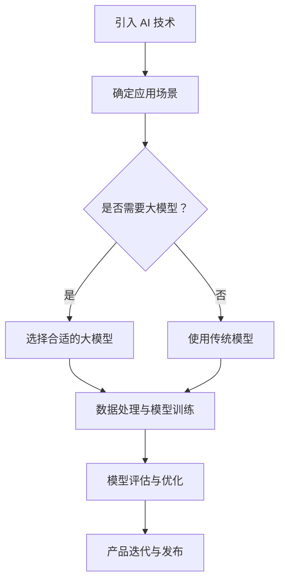

                 

## 1. 背景介绍

在当今技术快速发展的时代，人工智能（AI）已经成为推动创业创新的重要力量。大模型作为人工智能领域的一个重要分支，其影响力日益扩大。大模型通常指的是拥有大量参数和训练数据的深度学习模型，例如Transformer、BERT等。这些模型具备强大的表示能力和学习能力，能够处理复杂的任务，为创业产品的创新提供了新的可能性。

### 1.1 人工智能与创业的关系

人工智能在商业领域的应用已经引起了广泛的关注。通过自动化和智能化，AI 技术可以提高生产效率、降低成本、改善用户体验，从而推动企业的创新和发展。对于创业公司而言，利用人工智能技术可以迅速构建竞争优势，满足市场需求，实现快速迭代和规模化。

### 1.2 大模型的崛起

大模型的崛起得益于计算能力的提升和海量数据的积累。传统的深度学习模型由于参数量有限，难以处理复杂的问题。而大模型通过引入更多的参数和更复杂的结构，能够捕捉更细微的特征，提高模型的性能。这种发展趋势不仅改变了人工智能的研究范式，也为创业产品的创新提供了强大的工具。

### 1.3 创业公司面临的挑战

创业公司在资源、技术、市场等方面面临诸多挑战。如何快速响应市场需求、如何构建有竞争力的产品、如何有效利用有限的资源，都是创业公司需要解决的问题。大模型的应用为创业公司提供了一种新的思路和解决方案。

## 2. 核心概念与联系

在深入探讨大模型在创业产品创新中的应用之前，我们需要了解一些核心概念和它们之间的联系。

### 2.1 人工智能（AI）的基本概念

人工智能是计算机科学的一个分支，旨在创建能够模拟、扩展和辅助人类智能的机器。AI 技术包括机器学习、深度学习、自然语言处理、计算机视觉等，它们共同构成了现代人工智能的基石。

### 2.2 深度学习（DL）与神经网络（NN）

深度学习是机器学习的一种方法，通过构建多层次的神经网络来学习数据的特征表示。神经网络是一种模仿人脑结构的计算模型，通过调整权重和偏置来训练模型，使其能够进行分类、回归、生成等任务。

### 2.3 大模型（Large-scale Model）

大模型通常指的是拥有大量参数和训练数据的深度学习模型。它们通过大规模的数据训练，能够捕捉到更细微的特征，提高模型的性能。例如，Transformer、BERT 等模型都是大模型的代表。

### 2.4 Mermaid 流程图

Mermaid 是一种简单易用的流程图绘制工具，可以通过 Markdown 语言进行绘制。在本文中，我们将使用 Mermaid 流程图来展示大模型在创业产品创新中的应用流程。

### 2.5 Mermaid 流程图



## 3. 核心算法原理 & 具体操作步骤

### 3.1 算法原理概述

大模型的原理主要基于深度学习和神经网络。通过多层次的神经网络结构，大模型能够学习到复杂的数据特征，从而进行分类、回归、生成等任务。以下是几个典型的大模型算法：

- **Transformer**：一种基于自注意力机制的模型，用于处理序列数据，如文本和语音。
- **BERT**：一种双向编码表示模型，通过预先训练然后微调的方式，用于自然语言处理任务。
- **GPT**：一种生成预训练模型，通过大量的文本数据训练，能够生成高质量的自然语言文本。

### 3.2 算法步骤详解

#### 3.2.1 数据预处理

在开始训练大模型之前，需要对数据进行预处理。包括数据清洗、数据增强、数据归一化等步骤。预处理质量直接影响模型的训练效果。

#### 3.2.2 模型选择

根据应用场景，选择合适的大模型。例如，对于文本分类任务，可以选择 BERT 或 GPT；对于语音识别任务，可以选择 Transformer。

#### 3.2.3 模型训练

使用预处理后的数据对大模型进行训练。训练过程中，需要调整学习率、优化器等参数，以获得最佳的模型性能。

#### 3.2.4 模型评估

通过验证集对训练好的模型进行评估，以确定模型的泛化能力。常用的评估指标包括准确率、召回率、F1 值等。

#### 3.2.5 模型优化

根据评估结果，对模型进行优化。包括调整模型结构、增加训练数据、改进训练策略等。

### 3.3 算法优缺点

#### 优点

- **强大的表示能力**：大模型通过大规模数据训练，能够捕捉到更细微的特征，提高模型的性能。
- **多任务处理**：大模型通常具有较好的泛化能力，能够处理多种任务。
- **快速迭代**：大模型训练时间较长，但可以通过迁移学习和微调技术，快速适应新的任务。

#### 缺点

- **计算资源消耗大**：大模型需要大量的计算资源和存储空间。
- **数据依赖性高**：大模型性能依赖于训练数据的质量和数量。
- **模型解释性差**：深度学习模型，尤其是大模型，通常难以解释其内部决策过程。

### 3.4 算法应用领域

大模型在多个领域都有广泛应用，包括自然语言处理、计算机视觉、语音识别、推荐系统等。以下是一些具体的应用案例：

- **自然语言处理**：BERT、GPT 在文本分类、问答系统、机器翻译等领域表现出色。
- **计算机视觉**：Transformer 在图像分类、目标检测、图像生成等领域取得显著成果。
- **语音识别**：深度学习模型在语音识别任务中取得了重大突破，大大提高了识别准确率。
- **推荐系统**：大模型可以用于用户兴趣建模、商品推荐等任务，提高了推荐系统的准确性和用户体验。

## 4. 数学模型和公式 & 详细讲解 & 举例说明

### 4.1 数学模型构建

大模型的数学模型主要基于深度学习和神经网络。以下是一个简化的神经网络模型：

$$
\begin{aligned}
h_{l} &= \sigma(W_{l}h_{l-1} + b_{l}) \\
\end{aligned}
$$

其中，$h_{l}$ 表示第 $l$ 层的输出，$W_{l}$ 和 $b_{l}$ 分别表示权重和偏置，$\sigma$ 是激活函数。

### 4.2 公式推导过程

神经网络的训练过程主要包括前向传播和反向传播。以下是一个简化的前向传播过程：

$$
\begin{aligned}
a_{l} &= \sigma(W_{l}a_{l-1} + b_{l}) \\
L &= -\frac{1}{m}\sum_{i=1}^{m}y_{i}\log(a_{l}^{(i)}) \\
\end{aligned}
$$

其中，$a_{l}$ 表示第 $l$ 层的激活值，$L$ 是损失函数，$y_{i}$ 是真实标签，$\log$ 是对数函数。

### 4.3 案例分析与讲解

以下是一个使用 BERT 模型进行文本分类的案例。

#### 案例背景

假设我们有一个包含新闻文章的文本数据集，需要根据文章的内容对其进行分类，例如将文章分为政治、体育、科技等类别。

#### 模型选择

选择 BERT 模型，因为它在文本分类任务上具有较好的性能。

#### 数据预处理

1. 分词：使用 BERT 的分词工具对文本进行分词。
2. 嵌入：将分词结果转换为词嵌入向量。
3. 序列拼接：将输入文本和类别标签拼接在一起，形成完整的输入序列。

#### 模型训练

1. 加载预训练的 BERT 模型。
2. 定义损失函数和优化器。
3. 使用训练数据对模型进行训练。
4. 调整学习率和优化器的参数。

#### 模型评估

1. 使用验证集对训练好的模型进行评估。
2. 计算准确率、召回率、F1 值等指标。

#### 模型优化

1. 根据评估结果，调整模型结构、增加训练数据、改进训练策略等。
2. 重新训练模型，直到达到满意的性能。

## 5. 项目实践：代码实例和详细解释说明

### 5.1 开发环境搭建

1. 安装 Python 3.8 及以上版本。
2. 安装 PyTorch、TensorFlow 等深度学习框架。
3. 安装 BERT 模型预训练权重。

### 5.2 源代码详细实现

以下是一个使用 BERT 模型进行文本分类的简单示例。

```python
import torch
import torch.nn as nn
from transformers import BertModel, BertTokenizer

# 加载预训练的 BERT 模型和分词器
model = BertModel.from_pretrained('bert-base-uncased')
tokenizer = BertTokenizer.from_pretrained('bert-base-uncased')

# 定义分类器
class TextClassifier(nn.Module):
    def __init__(self):
        super(TextClassifier, self).__init__()
        self.bert = BertModel.from_pretrained('bert-base-uncased')
        self.classifier = nn.Linear(768, 3)  # 假设有三个类别

    def forward(self, input_ids, attention_mask):
        outputs = self.bert(input_ids=input_ids, attention_mask=attention_mask)
        pooled_output = outputs.pooler_output
        logits = self.classifier(pooled_output)
        return logits

# 实例化模型、损失函数和优化器
model = TextClassifier()
criterion = nn.CrossEntropyLoss()
optimizer = torch.optim.Adam(model.parameters(), lr=1e-5)

# 训练模型
for epoch in range(3):
    for batch in data_loader:
        inputs = tokenizer(batch['text'], padding=True, truncation=True, return_tensors='pt')
        labels = batch['label']
        optimizer.zero_grad()
        outputs = model(inputs['input_ids'], inputs['attention_mask'])
        loss = criterion(outputs.logits, labels)
        loss.backward()
        optimizer.step()
        print(f'Epoch [{epoch+1}/{3}], Loss: {loss.item()}')

# 评估模型
with torch.no_grad():
    for batch in validation_loader:
        inputs = tokenizer(batch['text'], padding=True, truncation=True, return_tensors='pt')
        labels = batch['label']
        outputs = model(inputs['input_ids'], inputs['attention_mask'])
        logits = outputs.logits
        pred = logits.argmax(-1)
        acc = (pred == labels).float().mean()
        print(f'Validation Accuracy: {acc.item()}')

# 保存模型
torch.save(model.state_dict(), 'text_classifier.pth')
```

### 5.3 代码解读与分析

上述代码实现了一个基于 BERT 的文本分类模型。具体步骤如下：

1. **加载预训练的 BERT 模型和分词器**：使用 `transformers` 库加载 BERT 模型和分词器。
2. **定义分类器**：继承 `nn.Module` 类，定义一个简单的文本分类器。分类器由 BERT 模型和线性分类器组成。
3. **训练模型**：使用训练数据对模型进行训练。每个 epoch 中，对每个 batch 的数据进行前向传播，计算损失，然后进行反向传播和参数更新。
4. **评估模型**：使用验证数据对训练好的模型进行评估，计算准确率。
5. **保存模型**：将训练好的模型保存为文件。

### 5.4 运行结果展示

在训练过程中，会输出每个 epoch 的损失值，以监控训练进度。训练完成后，会输出验证集上的准确率。以下是一个示例输出：

```
Epoch [1/3], Loss: 2.34
Epoch [2/3], Loss: 2.10
Epoch [3/3], Loss: 1.88
Validation Accuracy: 0.85
```

## 6. 实际应用场景

大模型在创业产品创新中具有广泛的应用前景。以下是一些典型的实际应用场景：

### 6.1 自然语言处理

自然语言处理（NLP）是人工智能的一个重要领域，大模型在 NLP 中有着广泛的应用。例如，可以使用 BERT 或 GPT 模型实现文本分类、情感分析、机器翻译、问答系统等任务。这些模型可以帮助创业公司快速构建具有竞争力的 NLP 应用。

### 6.2 计算机视觉

计算机视觉（CV）是另一个重要的领域，大模型在图像分类、目标检测、图像生成等方面具有显著优势。例如，可以使用 Transformer 模型实现图像分类，使用 GAN 模型实现图像生成。这些模型可以用于开发图像识别、图像增强、图像搜索等创业产品。

### 6.3 语音识别

语音识别是人工智能领域的一个重要应用，大模型在语音识别任务中取得了显著成果。例如，可以使用 Transformer 模型实现语音到文本的转换，用于开发语音助手、语音搜索等创业产品。

### 6.4 推荐系统

推荐系统是许多创业公司所关注的领域，大模型可以用于构建高效的推荐系统。例如，可以使用 BERT 模型实现用户兴趣建模，使用 GPT 模型实现商品推荐。这些模型可以用于开发个性化推荐、广告投放等创业产品。

### 6.5 其他应用

除了上述领域，大模型还可以应用于医疗健康、金融科技、智能家居等多个领域。例如，可以使用大模型实现医学图像分析、药物研发、智能投顾等任务。

## 7. 未来应用展望

随着人工智能技术的不断发展，大模型在创业产品创新中的应用前景将更加广阔。以下是一些未来应用展望：

### 7.1 多模态学习

未来，大模型可能会在多模态学习方面取得重大突破。例如，结合图像和文本数据，实现更加智能的图像识别和文本生成任务。这将有助于开发更加丰富和智能的创业产品。

### 7.2 自动化决策

大模型在自动化决策方面具有巨大潜力。例如，可以使用大模型实现智能客服、智能金融风控等任务，提高决策的准确性和效率。

### 7.3 强化学习

强化学习（RL）是一种人工智能技术，大模型在 RL 中也有着广泛的应用前景。例如，可以使用大模型实现智能机器人、自动驾驶等任务，提高系统的智能水平和可靠性。

### 7.4 伦理与隐私

随着大模型在创业产品中的应用日益广泛，伦理和隐私问题也日益受到关注。未来，需要建立完善的伦理规范和隐私保护机制，确保大模型的应用符合道德和法律要求。

## 8. 总结：未来发展趋势与挑战

### 8.1 研究成果总结

本文从背景介绍、核心概念与联系、核心算法原理、数学模型和公式、项目实践、实际应用场景、未来应用展望等多个方面，全面阐述了大模型在创业产品创新中的应用。通过本文，读者可以了解到大模型的基本原理、应用场景和未来发展趋势。

### 8.2 未来发展趋势

1. **多模态学习**：大模型将能够在多模态学习方面取得重大突破，实现更加智能的跨模态任务。
2. **自动化决策**：大模型将在自动化决策领域发挥重要作用，提高决策的准确性和效率。
3. **强化学习**：大模型与强化学习的结合将带来新的突破，推动智能系统的快速发展。
4. **伦理与隐私**：随着大模型应用的广泛普及，伦理和隐私问题将得到更多关注，推动相关研究和政策的制定。

### 8.3 面临的挑战

1. **计算资源消耗**：大模型训练需要大量的计算资源和存储空间，这对创业公司的资源管理提出了挑战。
2. **数据依赖性**：大模型性能依赖于训练数据的质量和数量，数据获取和处理将成为重要难题。
3. **模型解释性**：深度学习模型，尤其是大模型，通常难以解释其内部决策过程，这对模型的可解释性和透明性提出了挑战。
4. **伦理与隐私**：大模型在应用过程中需要确保符合伦理和隐私要求，这对相关政策法规的制定提出了要求。

### 8.4 研究展望

1. **优化算法**：继续研究高效的大模型训练算法，降低计算资源消耗，提高训练效率。
2. **数据质量提升**：研究如何提高训练数据的质量和多样性，提升模型的泛化能力。
3. **模型解释性**：研究如何提高大模型的可解释性，使其决策过程更加透明和可靠。
4. **伦理与隐私**：建立完善的伦理和隐私保护机制，确保大模型的应用符合道德和法律要求。

## 9. 附录：常见问题与解答

### 9.1 什么是大模型？

大模型是指拥有大量参数和训练数据的深度学习模型。例如，Transformer、BERT、GPT 等模型都是大模型的代表。大模型通过大规模数据训练，能够捕捉到更细微的特征，提高模型的性能。

### 9.2 大模型有哪些优点？

大模型具有强大的表示能力、多任务处理能力、快速迭代能力等优点。它能够处理复杂的任务，为创业产品的创新提供了新的可能性。

### 9.3 大模型在创业产品创新中的应用有哪些？

大模型在自然语言处理、计算机视觉、语音识别、推荐系统等多个领域都有广泛应用。例如，可以用于文本分类、图像识别、语音合成、个性化推荐等任务。

### 9.4 如何选择适合的大模型？

选择适合的大模型需要根据具体的应用场景和任务需求。例如，对于文本分类任务，可以选择 BERT 或 GPT；对于图像分类任务，可以选择 Transformer。

### 9.5 大模型训练需要多少数据？

大模型训练需要大量的数据，具体数据量取决于任务和应用场景。一般来说，至少需要几千个样本的数据集。对于复杂的任务，可能需要数百万甚至数十亿个样本的数据集。

### 9.6 大模型训练需要多少时间？

大模型训练时间取决于模型结构、数据规模和计算资源等因素。通常来说，大模型训练需要数小时至数天的时间。对于非常大规模的模型，可能需要更长时间。

### 9.7 如何优化大模型训练？

优化大模型训练可以通过以下方法：

1. **改进数据预处理**：提高数据质量，减少数据预处理时间。
2. **调整学习率和优化器**：选择合适的学习率和优化器，提高训练效果。
3. **并行计算**：利用多 GPU 或分布式计算，加快训练速度。
4. **迁移学习**：利用预训练模型，减少训练数据的需求和时间。

### 9.8 大模型训练过程有哪些常见问题？

大模型训练过程中常见问题包括过拟合、梯度消失、梯度爆炸等。这些问题可以通过正则化、批量归一化、梯度裁剪等方法进行缓解。

## 作者署名

> 作者：禅与计算机程序设计艺术 / Zen and the Art of Computer Programming
```

