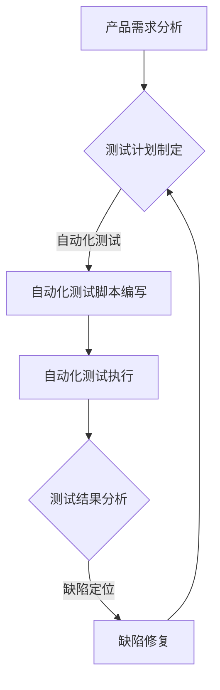

                 

 关键词：大模型、创业产品、测试、AI、效率

> 摘要：本文旨在探讨如何利用大模型技术提升创业产品测试的效率，分析其核心概念、算法原理、数学模型以及实际应用案例，并对未来发展趋势和挑战进行展望。

## 1. 背景介绍

随着人工智能技术的飞速发展，大模型（Large Models）作为深度学习的代表，已经在各个领域取得了显著成果。从自然语言处理到计算机视觉，再到语音识别和推荐系统，大模型的应用无处不在。然而，在创业产品的开发过程中，测试环节仍然面临着诸多挑战。传统的测试方法往往耗时耗力，难以满足快速迭代的需求。因此，如何利用大模型技术提升测试效率成为了一个亟待解决的问题。

本文将围绕以下核心内容展开：

1. 大模型的核心概念与架构。
2. 大模型在创业产品测试中的具体应用场景。
3. 大模型的数学模型和公式。
4. 大模型的实际应用案例。
5. 大模型未来应用展望。

## 2. 核心概念与联系

### 2.1. 大模型定义

大模型，即大型神经网络模型，通常具有数十亿甚至千亿级别的参数量。这些模型通过海量数据训练，能够自动学习并提取复杂的数据特征，从而实现高效的预测和分类。

### 2.2. 大模型架构

大模型通常采用多层神经网络结构，包括输入层、隐藏层和输出层。每一层都由大量神经元组成，通过前向传播和反向传播算法进行训练。常用的架构有卷积神经网络（CNN）、循环神经网络（RNN）、变换器模型（Transformer）等。

### 2.3. Mermaid 流程图

以下是大模型在创业产品测试中的应用流程图：



## 3. 核心算法原理 & 具体操作步骤

### 3.1. 算法原理概述

大模型在创业产品测试中的应用，主要依赖于其强大的特征提取和分类能力。通过训练大量数据，大模型能够自动学习并提取产品中的潜在缺陷特征，从而实现对缺陷的自动检测和定位。

### 3.2. 算法步骤详解

1. **数据准备**：收集与产品测试相关的数据，包括功能测试数据、性能测试数据等。
2. **模型训练**：利用收集到的数据，对大模型进行训练，使其掌握产品测试的相关特征。
3. **自动化测试**：利用训练好的大模型，对产品进行自动化测试，包括功能测试、性能测试等。
4. **测试结果分析**：对自动化测试结果进行分析，识别潜在的缺陷。
5. **缺陷定位**：利用大模型对识别出的缺陷进行定位，辅助开发人员进行缺陷修复。

### 3.3. 算法优缺点

#### 优点：

1. **高效**：大模型能够快速提取产品中的潜在缺陷特征，提高测试效率。
2. **准确**：大模型通过海量数据训练，具有较高的准确率。
3. **自适应**：大模型能够根据不同产品的测试需求，自适应调整测试策略。

#### 缺点：

1. **训练成本高**：大模型需要海量数据和计算资源进行训练。
2. **部署困难**：大模型部署过程中，需要考虑到计算资源、数据同步等问题。

### 3.4. 算法应用领域

大模型在创业产品测试中的应用，不仅限于功能测试和性能测试，还可以应用于以下领域：

1. **安全测试**：利用大模型对产品进行安全测试，识别潜在的安全漏洞。
2. **兼容性测试**：利用大模型对产品在不同操作系统、浏览器等环境下的兼容性进行测试。
3. **自动化测试优化**：利用大模型对自动化测试脚本进行优化，提高测试覆盖率。

## 4. 数学模型和公式

### 4.1. 数学模型构建

大模型通常采用多层神经网络结构，其数学模型主要包括以下几个部分：

1. **输入层**：输入层将原始数据输入到神经网络中。
2. **隐藏层**：隐藏层通过前向传播和反向传播算法，对输入数据进行处理和特征提取。
3. **输出层**：输出层对隐藏层处理后的数据进行分析和分类。

### 4.2. 公式推导过程

假设大模型由 $L$ 层神经元组成，其中第 $l$ 层的神经元数量为 $m_l$。对于第 $l$ 层的神经元 $j$，其输出值可以通过以下公式计算：

$$
a_{l,j} = \sigma(z_{l,j})
$$

其中，$a_{l,j}$ 表示第 $l$ 层第 $j$ 个神经元的输出值，$z_{l,j}$ 表示第 $l$ 层第 $j$ 个神经元的加权求和，$\sigma$ 表示激活函数。

对于 $l$ 层和 $l+1$ 层之间的神经元，其加权求和可以表示为：

$$
z_{l,j} = \sum_{i=1}^{m_{l-1}} w_{l,j,i}a_{l-1,i} + b_{l,j}
$$

其中，$w_{l,j,i}$ 表示第 $l$ 层第 $j$ 个神经元与第 $l-1$ 层第 $i$ 个神经元之间的权重，$b_{l,j}$ 表示第 $l$ 层第 $j$ 个神经元的偏置。

### 4.3. 案例分析与讲解

以图像分类任务为例，假设我们要训练一个大模型对猫和狗的图片进行分类。我们可以采用以下步骤：

1. **数据准备**：收集包含猫和狗图片的数据集。
2. **模型训练**：利用训练集对大模型进行训练，使其学会区分猫和狗。
3. **测试集评估**：利用测试集对训练好的模型进行评估，计算准确率。

通过以上步骤，我们可以构建一个基于大模型的图像分类系统，实现对猫和狗图片的自动分类。

## 5. 项目实践：代码实例和详细解释说明

### 5.1. 开发环境搭建

在Python环境中，我们可以使用TensorFlow或PyTorch等深度学习框架来构建和训练大模型。以下是一个简单的环境搭建步骤：

1. 安装Python环境。
2. 安装深度学习框架（如TensorFlow或PyTorch）。
3. 安装必要的依赖库（如NumPy、Pandas等）。

### 5.2. 源代码详细实现

以下是一个简单的基于TensorFlow的卷积神经网络（CNN）模型实现，用于图像分类任务：

```python
import tensorflow as tf
from tensorflow.keras.models import Sequential
from tensorflow.keras.layers import Conv2D, MaxPooling2D, Flatten, Dense

# 创建模型
model = Sequential([
    Conv2D(32, (3, 3), activation='relu', input_shape=(64, 64, 3)),
    MaxPooling2D((2, 2)),
    Flatten(),
    Dense(128, activation='relu'),
    Dense(1, activation='sigmoid')
])

# 编译模型
model.compile(optimizer='adam', loss='binary_crossentropy', metrics=['accuracy'])

# 模型训练
model.fit(train_images, train_labels, epochs=10, validation_split=0.2)
```

### 5.3. 代码解读与分析

1. **模型创建**：使用Sequential模型创建一个简单的卷积神经网络，包括一个卷积层、一个最大池化层、一个全连接层和一个输出层。
2. **模型编译**：编译模型，指定优化器、损失函数和评估指标。
3. **模型训练**：使用训练数据对模型进行训练，并设置训练轮数和验证比例。

### 5.4. 运行结果展示

在训练完成后，我们可以使用测试集对模型进行评估，并输出准确率：

```python
# 模型评估
test_loss, test_acc = model.evaluate(test_images, test_labels)
print(f"测试集准确率：{test_acc}")
```

## 6. 实际应用场景

### 6.1. 自动化测试

利用大模型进行自动化测试，可以提高测试效率，减少人工测试的工作量。例如，在Web应用测试中，大模型可以自动生成测试用例，并执行自动化测试。

### 6.2. 缺陷定位

在软件缺陷定位过程中，大模型可以通过分析缺陷数据，自动识别出潜在的缺陷原因，辅助开发人员快速定位缺陷。

### 6.3. 安全测试

大模型可以用于自动化安全测试，识别潜在的安全漏洞。例如，在Web应用安全测试中，大模型可以自动生成恶意代码，并检测其可能引起的安全问题。

## 7. 工具和资源推荐

### 7.1. 学习资源推荐

1. 《深度学习》（Goodfellow、Bengio和Courville著）：系统介绍了深度学习的基本概念和技术。
2. 《动手学深度学习》（阿斯顿·张著）：通过实战案例介绍了深度学习的实现方法。

### 7.2. 开发工具推荐

1. TensorFlow：一款开源的深度学习框架，支持多种深度学习模型的构建和训练。
2. PyTorch：一款流行的深度学习框架，具有灵活的动态计算图和高效的训练速度。

### 7.3. 相关论文推荐

1. "Distributed Deep Learning: Scaling Up by Milking the Model"（Nguyen et al., 2017）：介绍了分布式深度学习的基本概念和实现方法。
2. "EfficientDet: Scalable and Efficient Object Detection"（Bochkovskyy et al., 2019）：提出了一种高效的物体检测模型，适用于大型数据集。

## 8. 总结：未来发展趋势与挑战

### 8.1. 研究成果总结

大模型技术在创业产品测试中取得了显著成果，通过自动化测试、缺陷定位和安全测试等应用，提高了测试效率，降低了测试成本。

### 8.2. 未来发展趋势

1. **更高效的大模型**：随着计算资源和数据量的增加，大模型将更加高效，适用于更复杂的测试场景。
2. **多模态数据融合**：将图像、文本、语音等多模态数据融合到测试过程中，提高测试的全面性和准确性。
3. **在线测试**：利用在线测试技术，实现实时监测和反馈，提高测试的响应速度。

### 8.3. 面临的挑战

1. **数据隐私和安全**：在测试过程中，如何确保数据隐私和安全，是一个亟待解决的问题。
2. **计算资源限制**：大模型训练和部署过程中，计算资源需求较高，如何优化资源利用是一个挑战。
3. **模型可解释性**：大模型在测试中的应用具有一定的黑盒性质，如何提高模型的可解释性，使其更易于理解和接受。

### 8.4. 研究展望

未来，大模型技术在创业产品测试中的应用将不断深入，通过结合多模态数据、优化计算资源和提高模型可解释性，实现更高效、更可靠的测试服务。

## 9. 附录：常见问题与解答

### 9.1. 大模型训练需要多少数据？

大模型训练所需的数据量取决于具体任务和应用场景。一般来说，更多的数据有助于提高模型的准确性和泛化能力。对于一些复杂的任务，如图像分类，通常需要数十万到数百万张图像。

### 9.2. 如何处理大模型训练过程中的计算资源限制？

处理大模型训练过程中的计算资源限制可以通过以下几种方法：

1. **分布式训练**：将训练任务分布在多台机器上，提高计算效率。
2. **模型压缩**：通过模型压缩技术，减少模型的参数量和计算量。
3. **数据增强**：通过数据增强技术，增加训练数据的多样性，降低对计算资源的需求。

### 9.3. 大模型在测试中的应用是否会替代人工测试？

大模型在测试中的应用可以显著提高测试效率，但无法完全替代人工测试。人工测试在以下方面仍然具有不可替代的作用：

1. **复杂逻辑测试**：大模型难以覆盖所有复杂的业务逻辑，人工测试可以提供更全面的测试。
2. **用户体验测试**：大模型无法完全模拟用户行为和场景，用户体验测试仍然需要人工进行。

作者：禅与计算机程序设计艺术 / Zen and the Art of Computer Programming

----------------------------------------------------------------

### 结语

本文从大模型的核心概念、算法原理、数学模型、实际应用案例等多个角度，全面探讨了如何利用大模型技术提升创业产品测试的效率。通过本文的阐述，读者可以了解到大模型在创业产品测试中的应用前景和挑战，并为未来的研究和实践提供一定的参考。随着人工智能技术的不断进步，大模型在测试领域的应用将更加广泛，为创业产品带来更高的价值和效率。让我们一起期待这一美好未来的到来！

