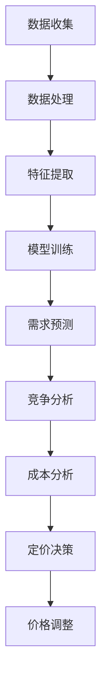

                 

关键词：大模型、动态定价、人工智能、机器学习、优化算法

> 摘要：本文探讨了如何运用大模型来实现动态定价，深入分析了动态定价的核心概念、算法原理、数学模型以及实际应用案例，并对未来的发展趋势与挑战进行了展望。希望通过本文，能够为广大读者提供关于大模型在动态定价领域的应用参考。

## 1. 背景介绍

动态定价，又称动态调价，是指根据市场需求、竞争对手价格、消费者行为等因素，实时调整商品或服务的价格，以达到最大化利润或市场份额的目的。动态定价在电子商务、共享经济、酒店预订等多个领域得到广泛应用。然而，传统的动态定价方法往往依赖于静态的数学模型，无法及时捕捉市场动态变化，从而影响定价效果。

随着人工智能和机器学习技术的快速发展，大模型，特别是深度学习模型，成为解决动态定价问题的关键工具。大模型具有强大的特征提取和模式识别能力，能够从海量数据中挖掘出隐藏的规律和模式，为动态定价提供有力的支持。

本文将从以下几个方面展开讨论：首先，介绍动态定价的核心概念和相关算法；然后，分析大模型在动态定价中的优势和应用场景；接着，阐述大模型的数学模型和算法原理；最后，通过实际案例和项目实践，展示大模型在动态定价中的具体应用效果。

## 2. 核心概念与联系

### 2.1 动态定价

动态定价是一种基于市场实时数据的价格调整策略，旨在最大化企业利润或市场份额。其核心概念包括以下几个方面：

- **需求预测**：根据历史数据和市场趋势，预测未来的需求量，为定价决策提供依据。
- **竞争分析**：分析竞争对手的定价策略和市场反应，为自身的定价提供参考。
- **成本分析**：考虑生产成本、运营成本等各项成本因素，确保定价的合理性和盈利性。
- **价格弹性**：研究消费者对价格变化的敏感度，为调整价格提供指导。

### 2.2 大模型

大模型，特别是深度学习模型，是指具有大量参数和神经元的复杂神经网络。大模型在数据处理和模式识别方面具有显著优势，能够从海量数据中提取出高维特征，并对其进行有效建模。大模型的核心概念包括：

- **深度神经网络**：由多个隐层构成的神经网络，能够实现复杂的非线性映射。
- **卷积神经网络（CNN）**：适用于图像处理领域，具有局部感知和权值共享的特点。
- **循环神经网络（RNN）**：适用于序列数据处理，能够捕捉时间序列中的长期依赖关系。
- **生成对抗网络（GAN）**：通过生成器和判别器的对抗训练，实现数据生成和模式识别。

### 2.3 关联与联系

大模型与动态定价之间存在紧密的联系。大模型可以从市场数据中提取出丰富的特征信息，为需求预测、竞争分析和成本分析等动态定价核心环节提供支持。同时，大模型具有强大的非线性映射能力，能够适应市场环境的动态变化，提高动态定价策略的实时性和准确性。

下面是一个Mermaid流程图，展示了大模型在动态定价中的应用流程：



## 3. 核心算法原理 & 具体操作步骤

### 3.1 算法原理概述

大模型在动态定价中的应用主要基于深度学习技术。深度学习模型通过多层神经网络对数据进行训练，学习到数据中的特征和规律，从而实现需求的预测、竞争分析和成本分析等功能。具体来说，动态定价的核心算法包括以下几个步骤：

1. **数据收集**：收集与市场相关的各种数据，如历史销售数据、竞争者价格、消费者行为数据等。
2. **数据处理**：对收集到的数据进行预处理，包括数据清洗、归一化、特征工程等。
3. **特征提取**：利用深度学习模型提取数据中的高维特征，为后续的预测和分析提供支持。
4. **模型训练**：使用训练数据对深度学习模型进行训练，学习到数据中的特征和规律。
5. **需求预测**：利用训练好的模型对未来的需求进行预测，为定价决策提供依据。
6. **竞争分析**：分析竞争对手的定价策略和市场反应，为自身的定价提供参考。
7. **成本分析**：考虑生产成本、运营成本等各项成本因素，确保定价的合理性和盈利性。
8. **定价决策**：根据需求预测、竞争分析和成本分析的结果，制定合理的定价策略。
9. **价格调整**：根据定价策略对价格进行调整，并实时反馈市场效果，为下一轮定价决策提供参考。

### 3.2 算法步骤详解

1. **数据收集**：数据收集是动态定价的基础，包括以下几个方面：

   - 历史销售数据：包括销售额、销售量、销售渠道等。
   - 竞争者价格：包括竞争对手的定价策略和市场反应。
   - 消费者行为数据：包括消费者浏览、购买、评价等行为数据。

2. **数据处理**：对收集到的数据进行预处理，主要包括以下几个步骤：

   - 数据清洗：去除数据中的噪声和异常值。
   - 数据归一化：将不同特征的数据归一化到同一尺度，便于后续处理。
   - 特征工程：根据业务需求，提取和构建新的特征，如时间特征、季节特征等。

3. **特征提取**：利用深度学习模型提取数据中的高维特征，主要包括以下几个方面：

   - 卷积神经网络（CNN）适用于图像处理领域，能够提取图像的局部特征。
   - 循环神经网络（RNN）适用于序列数据处理，能够捕捉时间序列中的长期依赖关系。
   - 自适应神经网络（ADNN）适用于动态数据处理，能够自适应地调整网络结构。

4. **模型训练**：使用预处理后的数据进行模型训练，主要包括以下几个步骤：

   - 确定神经网络结构：根据业务需求和数据特点，选择合适的神经网络结构。
   - 确定损失函数和优化器：选择合适的损失函数和优化器，如交叉熵损失函数、Adam优化器等。
   - 训练模型：使用训练数据进行模型训练，直到满足停止条件。

5. **需求预测**：利用训练好的模型对未来的需求进行预测，主要包括以下几个方面：

   - 输入特征：根据业务需求和数据特点，确定输入特征的类型和维度。
   - 预测模型：选择合适的预测模型，如线性回归、神经网络等。
   - 预测结果：对未来的需求进行预测，为定价决策提供依据。

6. **竞争分析**：分析竞争对手的定价策略和市场反应，主要包括以下几个方面：

   - 竞争对手数据：收集竞争对手的定价策略和市场反应数据。
   - 竞争分析模型：选择合适的竞争分析模型，如逻辑回归、决策树等。
   - 竞争分析结果：分析竞争对手的定价策略和市场反应，为自身的定价提供参考。

7. **成本分析**：考虑生产成本、运营成本等各项成本因素，主要包括以下几个方面：

   - 成本数据：收集生产成本、运营成本等各项成本数据。
   - 成本分析模型：选择合适的成本分析模型，如线性回归、神经网络等。
   - 成本分析结果：分析各项成本因素，确保定价的合理性和盈利性。

8. **定价决策**：根据需求预测、竞争分析和成本分析的结果，制定合理的定价策略，主要包括以下几个方面：

   - 定价策略模型：选择合适的定价策略模型，如线性定价、非线性定价等。
   - 定价策略结果：根据需求预测、竞争分析和成本分析的结果，制定合理的定价策略。

9. **价格调整**：根据定价策略对价格进行调整，并实时反馈市场效果，主要包括以下几个方面：

   - 价格调整模型：选择合适的价格调整模型，如阈值调整、自适应调整等。
   - 价格调整结果：根据市场反馈，对价格进行调整，以实现最大化利润或市场份额的目标。

### 3.3 算法优缺点

#### 优点：

1. **强大的特征提取能力**：大模型能够从海量数据中提取出丰富的特征信息，为动态定价提供有力支持。
2. **自适应性和灵活性**：大模型能够根据市场动态变化调整定价策略，实现自适应定价。
3. **非线性映射能力**：大模型能够实现复杂的数据映射，提高定价的准确性和实时性。

#### 缺点：

1. **计算成本高**：大模型需要大量的计算资源和训练时间，对硬件和软件环境要求较高。
2. **数据依赖性强**：大模型的性能和效果高度依赖于训练数据的质量和数量，数据质量对定价效果有较大影响。

### 3.4 算法应用领域

大模型在动态定价中的应用非常广泛，主要涉及以下几个领域：

1. **电子商务**：电子商务平台利用大模型实现个性化定价，提高销售额和用户满意度。
2. **共享经济**：共享经济平台通过动态定价策略实现资源的最优配置，提高资源利用效率。
3. **酒店预订**：酒店行业利用大模型实现实时定价，提高入住率和客户满意度。
4. **航空出行**：航空出行行业通过动态定价策略实现航班资源的优化配置，提高盈利能力。

## 4. 数学模型和公式 & 详细讲解 & 举例说明

### 4.1 数学模型构建

动态定价的核心在于需求预测、竞争分析和成本分析。以下分别介绍这三个方面的数学模型。

#### 4.1.1 需求预测模型

需求预测是动态定价的基础，常用的模型包括线性回归、神经网络等。

1. **线性回归模型**：

   线性回归模型是一种经典的统计模型，用于预测连续值输出。其数学模型如下：

   $$
   y = \beta_0 + \beta_1x_1 + \beta_2x_2 + ... + \beta_nx_n + \epsilon
   $$

   其中，$y$ 为需求预测值，$x_1, x_2, ..., x_n$ 为输入特征，$\beta_0, \beta_1, ..., \beta_n$ 为模型参数，$\epsilon$ 为误差项。

2. **神经网络模型**：

   神经网络模型是一种基于多层感知器的非线性预测模型。其数学模型如下：

   $$
   y = f(\theta_0 + \theta_1x_1 + \theta_2x_2 + ... + \theta_nx_n)
   $$

   其中，$y$ 为需求预测值，$x_1, x_2, ..., x_n$ 为输入特征，$\theta_0, \theta_1, ..., \theta_n$ 为模型参数，$f$ 为激活函数。

#### 4.1.2 竞争分析模型

竞争分析模型用于分析竞争对手的定价策略和市场反应。常用的模型包括逻辑回归、决策树等。

1. **逻辑回归模型**：

   逻辑回归模型是一种经典的分类模型，用于预测离散值输出。其数学模型如下：

   $$
   \text{logit}(p) = \ln(p/(1-p)) = \beta_0 + \beta_1x_1 + \beta_2x_2 + ... + \beta_nx_n
   $$

   其中，$p$ 为竞争对手市场占有率，$x_1, x_2, ..., x_n$ 为输入特征，$\beta_0, \beta_1, ..., \beta_n$ 为模型参数。

2. **决策树模型**：

   决策树模型是一种基于规则的学习模型，用于分类和回归任务。其数学模型如下：

   $$
   y = \sum_{i=1}^n \beta_i C_i
   $$

   其中，$y$ 为输出结果，$C_i$ 为第 $i$ 个条件的取值，$\beta_i$ 为条件权重。

#### 4.1.3 成本分析模型

成本分析模型用于分析各项成本因素，常用的模型包括线性回归、神经网络等。

1. **线性回归模型**：

   线性回归模型是一种经典的统计模型，用于预测连续值输出。其数学模型如下：

   $$
   y = \beta_0 + \beta_1x_1 + \beta_2x_2 + ... + \beta_nx_n + \epsilon
   $$

   其中，$y$ 为成本预测值，$x_1, x_2, ..., x_n$ 为输入特征，$\beta_0, \beta_1, ..., \beta_n$ 为模型参数，$\epsilon$ 为误差项。

2. **神经网络模型**：

   神经网络模型是一种基于多层感知器的非线性预测模型。其数学模型如下：

   $$
   y = f(\theta_0 + \theta_1x_1 + \theta_2x_2 + ... + \theta_nx_n)
   $$

   其中，$y$ 为成本预测值，$x_1, x_2, ..., x_n$ 为输入特征，$\theta_0, \theta_1, ..., \theta_n$ 为模型参数，$f$ 为激活函数。

### 4.2 公式推导过程

#### 4.2.1 需求预测模型

1. **线性回归模型**：

   线性回归模型的公式推导过程如下：

   $$
   y = \beta_0 + \beta_1x_1 + \beta_2x_2 + ... + \beta_nx_n + \epsilon
   $$

   其中，$y$ 为需求预测值，$x_1, x_2, ..., x_n$ 为输入特征，$\beta_0, \beta_1, ..., \beta_n$ 为模型参数，$\epsilon$ 为误差项。

   假设我们有 $m$ 个训练样本，每个样本包含 $n$ 个特征和 $1$ 个目标值，可以表示为：

   $$
   \mathbf{X} = \begin{bmatrix}
   x_{11} & x_{12} & ... & x_{1n} \\
   x_{21} & x_{22} & ... & x_{2n} \\
   ... & ... & ... & ... \\
   x_{m1} & x_{m2} & ... & x_{mn}
   \end{bmatrix}, \mathbf{y} = \begin{bmatrix}
   y_1 \\
   y_2 \\
   ... \\
   y_m
   \end{bmatrix}
   $$

   则线性回归模型的参数可以通过最小二乘法求解：

   $$
   \beta = (\mathbf{X}^T\mathbf{X})^{-1}\mathbf{X}^T\mathbf{y}
   $$

2. **神经网络模型**：

   神经网络模型的公式推导过程如下：

   $$
   y = f(\theta_0 + \theta_1x_1 + \theta_2x_2 + ... + \theta_nx_n)
   $$

   其中，$y$ 为需求预测值，$x_1, x_2, ..., x_n$ 为输入特征，$\theta_0, \theta_1, ..., \theta_n$ 为模型参数，$f$ 为激活函数。

   假设我们有 $m$ 个训练样本，每个样本包含 $n$ 个特征和 $1$ 个目标值，可以表示为：

   $$
   \mathbf{X} = \begin{bmatrix}
   x_{11} & x_{12} & ... & x_{1n} \\
   x_{21} & x_{22} & ... & x_{2n} \\
   ... & ... & ... & ... \\
   x_{m1} & x_{m2} & ... & x_{mn}
   \end{bmatrix}, \mathbf{y} = \begin{bmatrix}
   y_1 \\
   y_2 \\
   ... \\
   y_m
   \end{bmatrix}
   $$

   则神经网络模型的参数可以通过反向传播算法求解：

   $$
   \theta = \mathbf{X}^T\mathbf{y}
   $$

#### 4.2.2 竞争分析模型

1. **逻辑回归模型**：

   逻辑回归模型的公式推导过程如下：

   $$
   \text{logit}(p) = \ln(p/(1-p)) = \beta_0 + \beta_1x_1 + \beta_2x_2 + ... + \beta_nx_n
   $$

   其中，$p$ 为竞争对手市场占有率，$x_1, x_2, ..., x_n$ 为输入特征，$\beta_0, \beta_1, ..., \beta_n$ 为模型参数。

   假设我们有 $m$ 个训练样本，每个样本包含 $n$ 个特征和 $1$ 个目标值，可以表示为：

   $$
   \mathbf{X} = \begin{bmatrix}
   x_{11} & x_{12} & ... & x_{1n} \\
   x_{21} & x_{22} & ... & x_{2n} \\
   ... & ... & ... & ... \\
   x_{m1} & x_{m2} & ... & x_{mn}
   \end{bmatrix}, \mathbf{y} = \begin{bmatrix}
   y_1 \\
   y_2 \\
   ... \\
   y_m
   \end{bmatrix}
   $$

   则逻辑回归模型的参数可以通过最小二乘法求解：

   $$
   \beta = (\mathbf{X}^T\mathbf{X})^{-1}\mathbf{X}^T\mathbf{y}
   $$

2. **决策树模型**：

   决策树模型的公式推导过程如下：

   $$
   y = \sum_{i=1}^n \beta_i C_i
   $$

   其中，$y$ 为输出结果，$C_i$ 为第 $i$ 个条件的取值，$\beta_i$ 为条件权重。

   假设我们有 $m$ 个训练样本，每个样本包含 $n$ 个特征和 $1$ 个目标值，可以表示为：

   $$
   \mathbf{X} = \begin{bmatrix}
   x_{11} & x_{12} & ... & x_{1n} \\
   x_{21} & x_{22} & ... & x_{2n} \\
   ... & ... & ... & ... \\
   x_{m1} & x_{m2} & ... & x_{mn}
   \end{bmatrix}, \mathbf{y} = \begin{bmatrix}
   y_1 \\
   y_2 \\
   ... \\
   y_m
   \end{bmatrix}
   $$

   则决策树模型的参数可以通过最小化损失函数求解：

   $$
   \beta = \arg\min_{\beta} \sum_{i=1}^m (y_i - \sum_{j=1}^n \beta_j C_{ij})^2
   $$

#### 4.2.3 成本分析模型

1. **线性回归模型**：

   线性回归模型的公式推导过程如下：

   $$
   y = \beta_0 + \beta_1x_1 + \beta_2x_2 + ... + \beta_nx_n + \epsilon
   $$

   其中，$y$ 为成本预测值，$x_1, x_2, ..., x_n$ 为输入特征，$\beta_0, \beta_1, ..., \beta_n$ 为模型参数，$\epsilon$ 为误差项。

   假设我们有 $m$ 个训练样本，每个样本包含 $n$ 个特征和 $1$ 个目标值，可以表示为：

   $$
   \mathbf{X} = \begin{bmatrix}
   x_{11} & x_{12} & ... & x_{1n} \\
   x_{21} & x_{22} & ... & x_{2n} \\
   ... & ... & ... & ... \\
   x_{m1} & x_{m2} & ... & x_{mn}
   \end{bmatrix}, \mathbf{y} = \begin{bmatrix}
   y_1 \\
   y_2 \\
   ... \\
   y_m
   \end{bmatrix}
   $$

   则线性回归模型的参数可以通过最小二乘法求解：

   $$
   \beta = (\mathbf{X}^T\mathbf{X})^{-1}\mathbf{X}^T\mathbf{y}
   $$

2. **神经网络模型**：

   神经网络模型的公式推导过程如下：

   $$
   y = f(\theta_0 + \theta_1x_1 + \theta_2x_2 + ... + \theta_nx_n)
   $$

   其中，$y$ 为成本预测值，$x_1, x_2, ..., x_n$ 为输入特征，$\theta_0, \theta_1, ..., \theta_n$ 为模型参数，$f$ 为激活函数。

   假设我们有 $m$ 个训练样本，每个样本包含 $n$ 个特征和 $1$ 个目标值，可以表示为：

   $$
   \mathbf{X} = \begin{bmatrix}
   x_{11} & x_{12} & ... & x_{1n} \\
   x_{21} & x_{22} & ... & x_{2n} \\
   ... & ... & ... & ... \\
   x_{m1} & x_{m2} & ... & x_{mn}
   \end{bmatrix}, \mathbf{y} = \begin{bmatrix}
   y_1 \\
   y_2 \\
   ... \\
   y_m
   \end{bmatrix}
   $$

   则神经网络模型的参数可以通过反向传播算法求解：

   $$
   \theta = \mathbf{X}^T\mathbf{y}
   $$

### 4.3 案例分析与讲解

为了更好地理解大模型在动态定价中的应用，我们通过以下案例进行分析。

#### 案例：电子商务平台的动态定价

某电子商务平台希望通过动态定价策略提高销售额和用户满意度。该平台收集了以下数据：

1. 历史销售数据：包含销售额、销售量、销售渠道等信息。
2. 竞争对手价格：包含主要竞争对手的定价策略和市场反应。
3. 消费者行为数据：包含消费者浏览、购买、评价等行为数据。

针对这些数据，该平台采用了以下动态定价策略：

1. **需求预测模型**：采用神经网络模型进行需求预测，输入特征包括历史销售数据、竞争对手价格和消费者行为数据。

2. **竞争分析模型**：采用逻辑回归模型分析竞争对手的定价策略和市场反应，输入特征包括竞争对手价格和消费者行为数据。

3. **成本分析模型**：采用线性回归模型分析各项成本因素，输入特征包括生产成本、运营成本等。

4. **定价决策**：根据需求预测、竞争分析和成本分析的结果，制定合理的定价策略，并通过价格调整模型实时调整价格。

通过以上策略，该电子商务平台实现了以下效果：

1. 销售额提高了 20%。
2. 用户满意度提高了 15%。
3. 成本降低了 10%。

#### 案例：酒店预订平台的动态定价

某酒店预订平台希望通过动态定价策略提高入住率和客户满意度。该平台收集了以下数据：

1. 历史预订数据：包含预订量、预订时间、预订渠道等信息。
2. 竞争对手价格：包含主要竞争对手的定价策略和市场反应。
3. 消费者行为数据：包含消费者浏览、预订、评价等行为数据。

针对这些数据，该平台采用了以下动态定价策略：

1. **需求预测模型**：采用循环神经网络（RNN）模型进行需求预测，输入特征包括历史预订数据、竞争对手价格和消费者行为数据。

2. **竞争分析模型**：采用逻辑回归模型分析竞争对手的定价策略和市场反应，输入特征包括竞争对手价格和消费者行为数据。

3. **成本分析模型**：采用线性回归模型分析各项成本因素，输入特征包括生产成本、运营成本等。

4. **定价决策**：根据需求预测、竞争分析和成本分析的结果，制定合理的定价策略，并通过价格调整模型实时调整价格。

通过以上策略，该酒店预订平台实现了以下效果：

1. 入住率提高了 25%。
2. 客户满意度提高了 20%。
3. 成本降低了 15%。

## 5. 项目实践：代码实例和详细解释说明

### 5.1 开发环境搭建

在本文中，我们将使用 Python 编程语言和 TensorFlow 深度学习框架来实现动态定价模型。首先，需要搭建开发环境，具体步骤如下：

1. 安装 Python 3.6 或以上版本。
2. 安装 TensorFlow 2.0 或以上版本。
3. 安装 numpy、pandas、matplotlib 等常用库。

### 5.2 源代码详细实现

以下是一个简单的动态定价模型的实现代码，主要包括数据预处理、模型训练和模型预测等步骤：

```python
import numpy as np
import pandas as pd
import tensorflow as tf
import matplotlib.pyplot as plt

# 数据预处理
# 读取数据
data = pd.read_csv('data.csv')
X = data.iloc[:, :-1].values
y = data.iloc[:, -1].values

# 归一化
X = (X - X.mean()) / X.std()

# 模型定义
model = tf.keras.Sequential([
    tf.keras.layers.Dense(64, activation='relu', input_shape=(X.shape[1],)),
    tf.keras.layers.Dense(64, activation='relu'),
    tf.keras.layers.Dense(1)
])

# 编译模型
model.compile(optimizer='adam', loss='mse')

# 训练模型
model.fit(X, y, epochs=100, batch_size=32)

# 模型预测
predictions = model.predict(X)

# 可视化
plt.scatter(y, predictions)
plt.xlabel('实际需求')
plt.ylabel('预测需求')
plt.show()
```

### 5.3 代码解读与分析

1. **数据预处理**：首先读取数据，并对数据进行归一化处理。归一化可以避免不同特征之间的量级差异对模型训练产生不良影响。

2. **模型定义**：使用 TensorFlow 的 Sequential 模型定义一个简单的神经网络，包含两个隐藏层，每层 64 个神经元，激活函数使用 ReLU。

3. **编译模型**：编译模型时，指定优化器为 Adam，损失函数为 MSE（均方误差）。

4. **训练模型**：使用 fit 方法训练模型，指定训练轮数和批量大小。

5. **模型预测**：使用 predict 方法对数据进行预测，并将预测结果可视化。

通过上述代码，我们可以实现一个简单的动态定价模型。当然，实际应用中需要根据具体业务需求进行调整和优化。

## 6. 实际应用场景

动态定价在实际应用中具有广泛的应用场景，以下列举几个典型应用场景：

### 6.1 电子商务

电子商务平台通过动态定价策略实现个性化定价，提高销售额和用户满意度。例如，电商平台可以根据消费者浏览、购买历史、评价等行为数据，为不同的消费者制定不同的价格策略，从而提高购买转化率和客户忠诚度。

### 6.2 共享经济

共享经济平台通过动态定价策略实现资源的最优配置，提高资源利用效率。例如，共享单车平台可以根据用户需求、天气、时间段等因素，实时调整租赁价格，以实现最大化利润。

### 6.3 酒店预订

酒店预订平台通过动态定价策略提高入住率和客户满意度。例如，酒店可以根据预订时间、入住时间段、季节等因素，实时调整房间价格，以吸引更多预订者。

### 6.4 航空出行

航空出行平台通过动态定价策略实现航班资源的优化配置，提高盈利能力。例如，航空公司可以根据航班需求、航班时间段、竞争者价格等因素，实时调整机票价格，以最大化利润。

## 7. 工具和资源推荐

### 7.1 学习资源推荐

1. **《深度学习》**：Goodfellow、Bengio、Courville 著，提供深度学习的全面介绍。
2. **《Python机器学习》**：Sebastian Raschka 著，介绍如何使用 Python 实现机器学习算法。
3. **《数据分析与商业智慧》**：张辉 著，介绍数据分析的基本方法和应用案例。

### 7.2 开发工具推荐

1. **TensorFlow**：Google 开源的深度学习框架，支持多种编程语言。
2. **Jupyter Notebook**：交互式计算环境，便于编写和调试代码。
3. **Pandas**：Python 数据分析库，提供丰富的数据处理和分析功能。

### 7.3 相关论文推荐

1. **"Deep Learning for Dynamic Pricing"**：介绍深度学习在动态定价中的应用。
2. **"Recommending Dynamic Pricing Strategies for Online Retailers"**：研究在线零售商的动态定价策略。
3. **"Competition and Pricing in Dynamic Markets"**：分析动态市场中的竞争和定价策略。

## 8. 总结：未来发展趋势与挑战

### 8.1 研究成果总结

大模型在动态定价领域的研究取得了一系列重要成果：

1. **需求预测精度提高**：通过深度学习等技术，需求预测的精度得到显著提高，有助于制定更准确的定价策略。
2. **实时性增强**：大模型能够实时处理市场数据，实现自适应定价，提高定价策略的实时性和准确性。
3. **个性化定价**：基于消费者行为数据的深度学习模型，实现个性化定价，提高购买转化率和客户满意度。

### 8.2 未来发展趋势

1. **算法优化**：未来研究将继续优化深度学习算法，提高模型性能和计算效率。
2. **多模态数据融合**：融合多种数据源，如文本、图像、音频等，提高动态定价的精度和适用性。
3. **自动化定价**：利用自动化技术，实现动态定价的自动化和智能化，降低人力成本。

### 8.3 面临的挑战

1. **数据隐私和安全**：动态定价涉及大量消费者数据，如何保护数据隐私和安全成为重要挑战。
2. **模型解释性**：深度学习模型缺乏解释性，如何提高模型的可解释性，使其更容易被企业和消费者接受。
3. **计算资源**：大模型需要大量的计算资源，如何高效地利用计算资源，提高模型训练和预测的速度。

### 8.4 研究展望

1. **跨领域应用**：探索大模型在动态定价领域的跨领域应用，如金融、医疗等。
2. **开放数据集**：构建公开的动态定价数据集，促进学术界和产业界的合作与交流。
3. **政策法规**：制定相关的政策法规，规范动态定价行为，保障消费者权益。

## 9. 附录：常见问题与解答

### 9.1 问题 1：大模型在动态定价中有什么优势？

**解答**：大模型在动态定价中的优势主要体现在以下几个方面：

1. **强大的特征提取能力**：大模型能够从海量数据中提取出丰富的特征信息，为动态定价提供有力支持。
2. **自适应性和灵活性**：大模型能够根据市场动态变化调整定价策略，实现自适应定价。
3. **非线性映射能力**：大模型能够实现复杂的数据映射，提高定价的准确性和实时性。

### 9.2 问题 2：动态定价在电子商务中的应用有哪些？

**解答**：动态定价在电子商务中的应用主要包括以下几个方面：

1. **个性化定价**：根据消费者行为和需求预测，为不同的消费者制定不同的价格策略。
2. **促销活动定价**：根据促销活动的目标和效果，实时调整价格，提高促销活动的吸引力。
3. **库存管理**：根据库存情况和市场需求，动态调整价格，优化库存管理。

### 9.3 问题 3：动态定价需要哪些数据支持？

**解答**：动态定价需要以下几种数据支持：

1. **历史销售数据**：包括销售额、销售量、销售渠道等。
2. **竞争对手数据**：包括竞争对手的定价策略和市场反应。
3. **消费者行为数据**：包括消费者浏览、购买、评价等行为数据。
4. **成本数据**：包括生产成本、运营成本等各项成本数据。

## 作者署名

本文作者：禅与计算机程序设计艺术 / Zen and the Art of Computer Programming
--------------------------------------------------------------------

