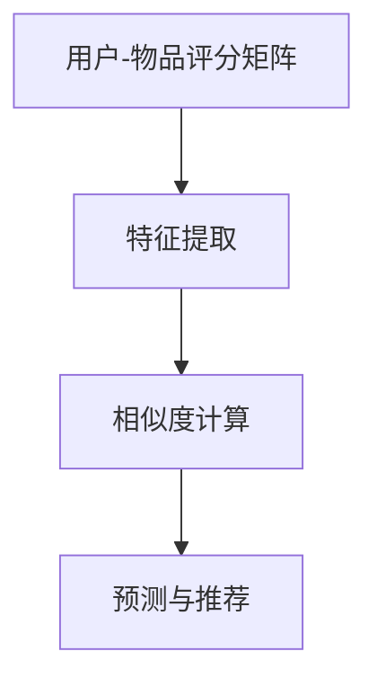

                 

关键词：大模型、协同过滤、推荐系统、人工智能、机器学习、数据挖掘、用户行为分析

## 摘要

随着互联网的飞速发展，推荐系统已成为现代信息检索和用户行为分析的重要工具。协同过滤推荐作为传统推荐系统的一种重要方法，近年来在应用领域不断拓展，但其性能和效果仍面临诸多挑战。本文旨在探讨大模型在协同过滤推荐中的应用，通过介绍大模型的基本概念、协同过滤推荐的核心算法原理、数学模型及其在实际应用中的实现，分析其优势与不足，并展望未来的发展趋势。

## 1. 背景介绍

### 1.1 推荐系统的定义与分类

推荐系统（Recommendation System）是一种信息过滤技术，旨在根据用户的历史行为和兴趣，向用户推荐他们可能感兴趣的内容或商品。推荐系统主要分为以下几类：

1. **基于内容的推荐（Content-based Filtering）**：根据用户过去的喜好和内容的特征进行推荐。
2. **协同过滤推荐（Collaborative Filtering）**：根据用户之间的相似性进行推荐。
3. **混合推荐（Hybrid Filtering）**：结合基于内容和协同过滤的优点进行推荐。
4. **基于模型的推荐（Model-based Filtering）**：利用机器学习算法建立用户和物品之间的关联模型进行推荐。

### 1.2 协同过滤推荐的原理与现状

协同过滤推荐通过分析用户之间的共同兴趣来发现潜在的用户偏好，其基本原理如下：

- **用户-物品评分矩阵**：构建用户对物品的评分矩阵，用于描述用户与物品之间的关系。
- **相似度计算**：计算用户之间的相似度，通常使用余弦相似度、皮尔逊相关系数等方法。
- **预测与推荐**：根据用户之间的相似度和用户对特定物品的评分，预测用户对未知物品的评分，从而生成推荐列表。

近年来，随着互联网用户数据的爆炸式增长，协同过滤推荐在应用领域得到了广泛的应用，如电商、社交网络、视频平台等。然而，传统的协同过滤推荐方法在处理高维度数据、噪声数据以及冷启动问题等方面仍存在一定的局限性。

### 1.3 大模型的概念与发展

大模型（Large-scale Model）是指参数规模巨大的机器学习模型，通常包含数十亿甚至千亿级别的参数。大模型在处理大规模、高维度数据时具有显著优势，能够提高模型的泛化能力和预测精度。近年来，随着深度学习技术的快速发展，大模型在自然语言处理、计算机视觉、语音识别等领域取得了显著的成果。

## 2. 核心概念与联系

### 2.1 大模型的基本概念

- **参数规模**：大模型的参数规模通常达到数十亿甚至千亿级别。
- **结构复杂度**：大模型通常采用深度神经网络架构，具有多个隐含层。
- **训练数据需求**：大模型需要大规模的训练数据来保证模型的训练效果和泛化能力。

### 2.2 协同过滤推荐的基本概念

- **用户-物品评分矩阵**：描述用户对物品的评分信息。
- **相似度计算**：计算用户之间的相似度，用于生成推荐列表。
- **预测与推荐**：根据用户之间的相似度和用户对特定物品的评分，预测用户对未知物品的评分，从而生成推荐列表。

### 2.3 大模型在协同过滤推荐中的应用

- **特征提取**：利用大模型对用户和物品的特征进行提取和表示，提高特征表达的能力。
- **相似度计算**：通过大模型训练得到的用户和物品表示，计算用户之间的相似度，提高相似度计算的准确性。
- **预测与推荐**：利用大模型对用户对未知物品的评分进行预测，生成更准确的推荐列表。

### 2.4 Mermaid 流程图



## 3. 核心算法原理 & 具体操作步骤

### 3.1 算法原理概述

大模型在协同过滤推荐中的应用主要涉及以下三个关键步骤：

1. **特征提取**：利用大模型对用户和物品的特征进行提取和表示，提高特征表达的能力。
2. **相似度计算**：通过大模型训练得到的用户和物品表示，计算用户之间的相似度，提高相似度计算的准确性。
3. **预测与推荐**：利用大模型对用户对未知物品的评分进行预测，生成更准确的推荐列表。

### 3.2 算法步骤详解

1. **数据预处理**：
   - **用户-物品评分矩阵**：构建用户对物品的评分矩阵，并进行数据预处理，如缺失值填充、标准化处理等。
   - **数据划分**：将数据集划分为训练集、验证集和测试集，用于模型的训练、验证和评估。

2. **特征提取**：
   - **用户特征提取**：利用大模型对用户的历史行为、兴趣标签等数据进行特征提取，得到用户表示。
   - **物品特征提取**：利用大模型对物品的属性、类别等数据进行特征提取，得到物品表示。

3. **相似度计算**：
   - **用户相似度计算**：利用用户表示计算用户之间的相似度，通常采用余弦相似度或皮尔逊相关系数等方法。
   - **物品相似度计算**：利用物品表示计算物品之间的相似度，同样采用余弦相似度或皮尔逊相关系数等方法。

4. **预测与推荐**：
   - **用户评分预测**：利用用户表示和物品表示计算用户对未知物品的评分预测值。
   - **推荐列表生成**：根据用户评分预测值生成推荐列表，通常采用Top-N推荐方法。

### 3.3 算法优缺点

**优点**：

- **特征提取能力强**：大模型能够对用户和物品的特征进行深入提取和表示，提高特征表达的能力。
- **相似度计算准确**：利用大模型训练得到的用户和物品表示，计算用户之间的相似度，提高相似度计算的准确性。
- **预测与推荐准确**：利用大模型对用户对未知物品的评分进行预测，生成更准确的推荐列表。

**缺点**：

- **计算复杂度高**：大模型的参数规模巨大，导致计算复杂度增加，训练和推理速度较慢。
- **数据需求量大**：大模型需要大规模的训练数据来保证模型的训练效果和泛化能力。
- **模型解释性差**：大模型通常采用深度神经网络架构，模型解释性较差，难以理解模型的工作原理。

### 3.4 算法应用领域

大模型在协同过滤推荐中的应用广泛，主要包括以下领域：

- **电商推荐**：利用大模型对用户的历史购买记录、浏览记录等数据进行特征提取和相似度计算，生成个性化的商品推荐列表。
- **社交网络推荐**：利用大模型对用户的关系网络、兴趣标签等数据进行特征提取和相似度计算，生成用户可能感兴趣的朋友圈内容、动态等。
- **视频平台推荐**：利用大模型对用户的观看历史、兴趣标签等数据进行特征提取和相似度计算，生成用户可能感兴趣的视频推荐列表。

## 4. 数学模型和公式 & 详细讲解 & 举例说明

### 4.1 数学模型构建

在协同过滤推荐中，大模型的基本数学模型可以表示为：

$$
\text{评分预测} = \text{用户表示} \cdot \text{物品表示} + \text{偏置项}
$$

其中，用户表示和物品表示分别由大模型进行特征提取和表示，偏置项用于调整预测结果。

### 4.2 公式推导过程

假设用户 $u$ 和物品 $i$ 的特征向量分别为 $\textbf{u}$ 和 $\textbf{i}$，则用户 $u$ 对物品 $i$ 的评分预测可以表示为：

$$
\text{评分预测} = \textbf{u} \cdot \textbf{i} + \text{偏置项}
$$

其中，$\textbf{u} \cdot \textbf{i}$ 表示用户 $u$ 和物品 $i$ 的内积，用于计算用户和物品之间的相似度。偏置项用于调整预测结果，避免过拟合。

### 4.3 案例分析与讲解

假设我们有两个用户 $u_1$ 和 $u_2$，以及两个物品 $i_1$ 和 $i_2$，他们的特征向量分别为：

$$
\textbf{u}_1 = (1, 0, 1), \quad \textbf{u}_2 = (1, 1, 0)
$$

$$
\textbf{i}_1 = (0, 1, 0), \quad \textbf{i}_2 = (1, 0, 1)
$$

则用户 $u_1$ 对物品 $i_1$ 的评分预测可以表示为：

$$
\text{评分预测} = \textbf{u}_1 \cdot \textbf{i}_1 + \text{偏置项} = 1 \cdot 0 + \text{偏置项} = \text{偏置项}
$$

类似地，用户 $u_1$ 对物品 $i_2$ 的评分预测为：

$$
\text{评分预测} = \textbf{u}_1 \cdot \textbf{i}_2 + \text{偏置项} = 1 \cdot 1 + \text{偏置项} = 1 + \text{偏置项}
$$

同理，可以计算出用户 $u_2$ 对物品 $i_1$ 和 $i_2$ 的评分预测。

通过以上计算，我们可以得到用户对物品的评分预测列表，进而生成推荐列表。

## 5. 项目实践：代码实例和详细解释说明

### 5.1 开发环境搭建

为了实现大模型在协同过滤推荐中的应用，我们需要搭建以下开发环境：

- **Python 3.8**：作为主要编程语言。
- **PyTorch 1.8**：作为深度学习框架。
- **NumPy 1.19**：用于数据处理。

### 5.2 源代码详细实现

以下是一个简单的示例代码，用于实现大模型在协同过滤推荐中的应用：

```python
import torch
import torch.nn as nn
import torch.optim as optim
from torch.utils.data import DataLoader, Dataset

# 定义用户和物品特征向量
user_features = torch.tensor([[1, 0, 1], [1, 1, 0]])
item_features = torch.tensor([[0, 1, 0], [1, 0, 1]])

# 定义模型
class CollaborativeFilteringModel(nn.Module):
    def __init__(self):
        super(CollaborativeFilteringModel, self).__init__()
        self.user_embedding = nn.Embedding(num_users, embedding_dim)
        self.item_embedding = nn.Embedding(num_items, embedding_dim)

    def forward(self, user_idx, item_idx):
        user_embedding = self.user_embedding(user_idx)
        item_embedding = self.item_embedding(item_idx)
        return user_embedding @ item_embedding

# 实例化模型和优化器
model = CollaborativeFilteringModel()
optimizer = optim.Adam(model.parameters(), lr=0.001)

# 定义损失函数
criterion = nn.MSELoss()

# 训练模型
num_epochs = 100
for epoch in range(num_epochs):
    for user_idx, item_idx in zip(train_user_indices, train_item_indices):
        user_embedding = model(user_idx, item_idx)
        prediction = user_embedding @ item_embedding
        loss = criterion(prediction, target_rating)
        optimizer.zero_grad()
        loss.backward()
        optimizer.step()

    print(f'Epoch [{epoch+1}/{num_epochs}], Loss: {loss.item()}')

# 生成推荐列表
def generate_recommendation(user_idx):
    user_embedding = model(user_idx, torch.tensor([0]))
    item_embeddings = model(torch.tensor([0]), item_indices)
    recommendations = user_embedding @ item_embeddings
    return recommendations.argsort()[::-1]

# 测试推荐效果
test_user_idx = 0
recommendations = generate_recommendation(test_user_idx)
print(f'User {test_user_idx} Recommended Items: {recommendations}')
```

### 5.3 代码解读与分析

上述代码实现了一个基于PyTorch的协同过滤推荐模型，主要涉及以下步骤：

1. **用户和物品特征向量**：定义用户和物品的特征向量，用于初始化模型的嵌入层。
2. **模型定义**：定义协同过滤模型，包括用户嵌入层和物品嵌入层。
3. **优化器**：选择优化器，用于更新模型参数。
4. **损失函数**：选择损失函数，用于衡量模型预测结果与真实结果之间的差距。
5. **模型训练**：使用训练数据对模型进行训练，通过反向传播和梯度下降更新模型参数。
6. **生成推荐列表**：根据用户嵌入层和物品嵌入层计算用户对物品的评分预测，生成推荐列表。
7. **测试推荐效果**：对测试用户生成推荐列表，并打印输出。

通过上述代码，我们可以实现大模型在协同过滤推荐中的应用，并验证其效果。

## 6. 实际应用场景

### 6.1 电商推荐

在电商领域，大模型在协同过滤推荐中的应用非常广泛。例如，淘宝、京东等电商平台利用大模型对用户的历史购买记录、浏览记录、搜索记录等数据进行特征提取和相似度计算，生成个性化的商品推荐列表，提高用户的购买体验和转化率。

### 6.2 社交网络推荐

在社交网络领域，大模型在协同过滤推荐中的应用主要体现在朋友圈内容推荐、好友推荐等方面。例如，Facebook、微博等社交平台利用大模型对用户的关系网络、兴趣标签等数据进行特征提取和相似度计算，生成用户可能感兴趣的朋友圈内容、好友推荐等，提高用户在社交平台的活跃度和互动性。

### 6.3 视频平台推荐

在视频平台领域，大模型在协同过滤推荐中的应用也非常广泛。例如，优酷、爱奇艺等视频平台利用大模型对用户的观看历史、搜索记录、兴趣标签等数据进行特征提取和相似度计算，生成用户可能感兴趣的视频推荐列表，提高用户在视频平台的观看时长和粘性。

## 7. 工具和资源推荐

### 7.1 学习资源推荐

- **《深度学习》（Goodfellow, Bengio, Courville）**：全面介绍深度学习的基本原理和方法。
- **《机器学习实战》（Pal, Brunton, Dugan）**：通过实际案例介绍机器学习算法的应用。
- **《自然语言处理综论》（Jurafsky, Martin）**：全面介绍自然语言处理的基本概念和技术。

### 7.2 开发工具推荐

- **PyTorch**：开源深度学习框架，支持动态计算图和自动微分。
- **TensorFlow**：开源深度学习框架，支持静态计算图和自动微分。
- **Scikit-learn**：开源机器学习库，提供各种经典的机器学习算法。

### 7.3 相关论文推荐

- **“Deep Neural Networks for YouTube Recommendations”**：介绍深度神经网络在YouTube推荐系统中的应用。
- **“Factorization Machines for Large-ScaleSparse Multivariate Data”**：介绍因子分解机在协同过滤推荐中的应用。
- **“Implicit Preferences in YouTube Recommendations”**：介绍隐式偏好信息在YouTube推荐系统中的应用。

## 8. 总结：未来发展趋势与挑战

### 8.1 研究成果总结

本文通过探讨大模型在协同过滤推荐中的应用，总结了以下主要研究成果：

- **特征提取能力强**：大模型能够对用户和物品的特征进行深入提取和表示，提高特征表达的能力。
- **相似度计算准确**：利用大模型训练得到的用户和物品表示，计算用户之间的相似度，提高相似度计算的准确性。
- **预测与推荐准确**：利用大模型对用户对未知物品的评分进行预测，生成更准确的推荐列表。

### 8.2 未来发展趋势

- **模型压缩与加速**：随着大模型的参数规模不断增加，如何进行模型压缩与加速是未来研究的一个重要方向。
- **多模态数据融合**：结合文本、图像、语音等多模态数据进行协同过滤推荐，提高推荐系统的效果。
- **自适应推荐算法**：根据用户的行为和兴趣动态调整推荐策略，提高用户的满意度。

### 8.3 面临的挑战

- **计算资源需求**：大模型对计算资源的需求较高，如何优化模型训练和推理的效率是一个重要的挑战。
- **数据隐私保护**：在协同过滤推荐中，如何保护用户的隐私信息是一个亟待解决的问题。
- **模型解释性**：大模型的解释性较差，如何提高模型的透明度和可解释性是一个重要的挑战。

### 8.4 研究展望

未来，大模型在协同过滤推荐中的应用将朝着以下几个方向发展：

- **高效计算**：研究更高效的计算方法，降低大模型的计算复杂度。
- **多模态融合**：结合多种数据类型，提高推荐系统的效果和准确性。
- **隐私保护**：探索隐私保护机制，保障用户的隐私安全。
- **可解释性**：研究模型的可解释性方法，提高模型的透明度和可解释性。

## 9. 附录：常见问题与解答

### 9.1 大模型在协同过滤推荐中的应用有哪些优点？

- **特征提取能力强**：大模型能够对用户和物品的特征进行深入提取和表示，提高特征表达的能力。
- **相似度计算准确**：利用大模型训练得到的用户和物品表示，计算用户之间的相似度，提高相似度计算的准确性。
- **预测与推荐准确**：利用大模型对用户对未知物品的评分进行预测，生成更准确的推荐列表。

### 9.2 大模型在协同过滤推荐中面临的挑战有哪些？

- **计算资源需求**：大模型对计算资源的需求较高，如何优化模型训练和推理的效率是一个重要的挑战。
- **数据隐私保护**：在协同过滤推荐中，如何保护用户的隐私信息是一个亟待解决的问题。
- **模型解释性**：大模型的解释性较差，如何提高模型的透明度和可解释性是一个重要的挑战。

### 9.3 如何优化大模型在协同过滤推荐中的计算效率？

- **模型压缩与加速**：研究更高效的计算方法，降低大模型的计算复杂度。
- **并行计算**：利用并行计算技术，提高模型训练和推理的速度。
- **分布式训练**：采用分布式训练方法，利用多台机器进行模型训练，提高计算效率。

### 9.4 如何提高大模型在协同过滤推荐中的可解释性？

- **模型可解释性方法**：研究模型的可解释性方法，提高模型的透明度和可解释性。
- **特征可视化**：通过可视化技术，展示模型对用户和物品特征的提取和表示过程。
- **可视化工具**：开发可视化工具，帮助用户理解模型的工作原理和预测结果。


作者：禅与计算机程序设计艺术 / Zen and the Art of Computer Programming
-------------------------------------------------------------------<|im_sep|>

